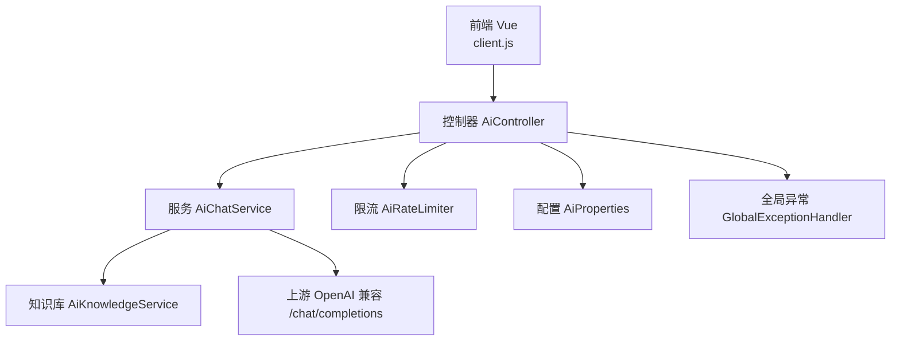
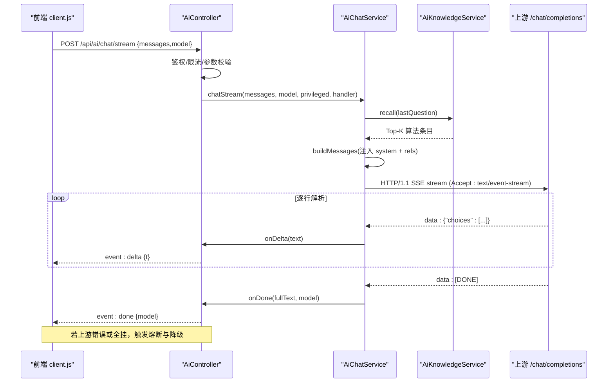
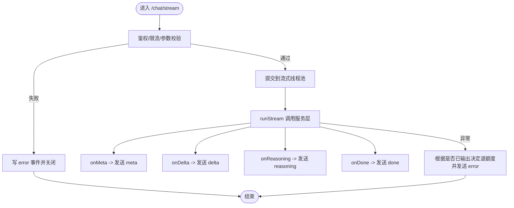
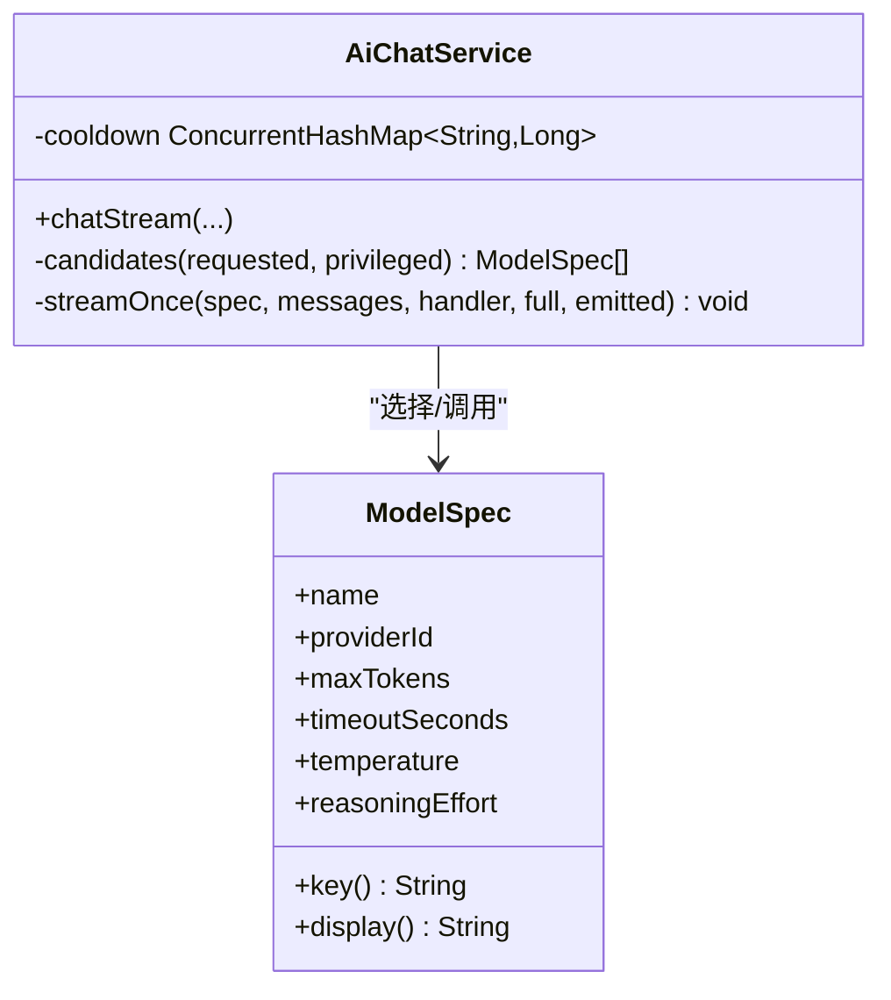
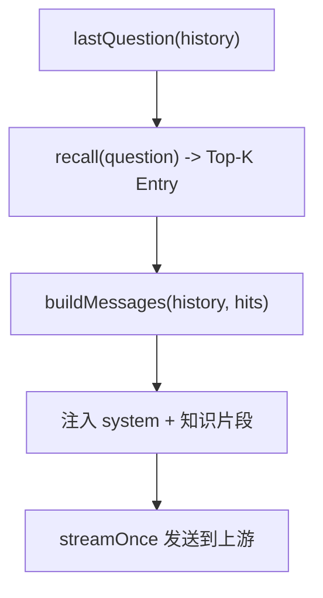
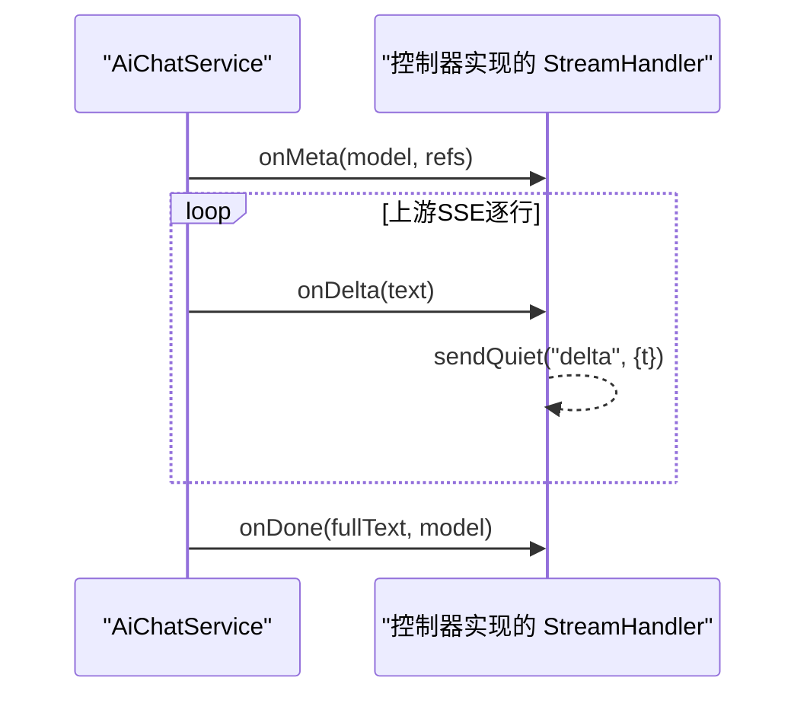
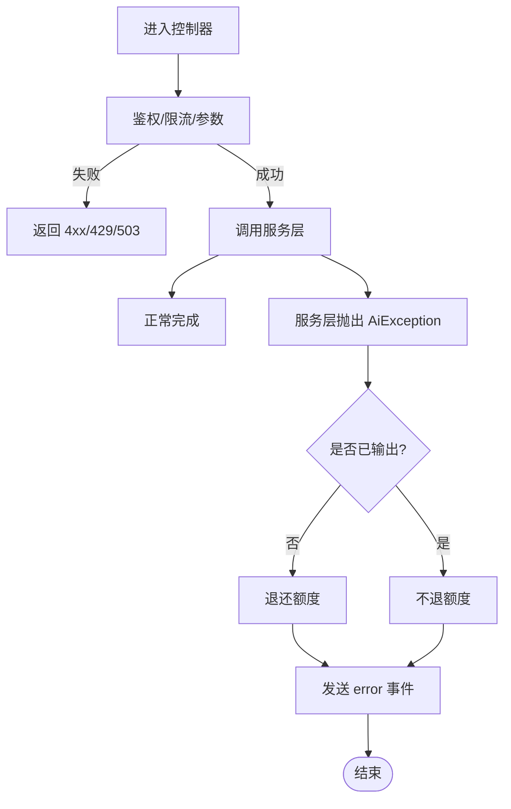
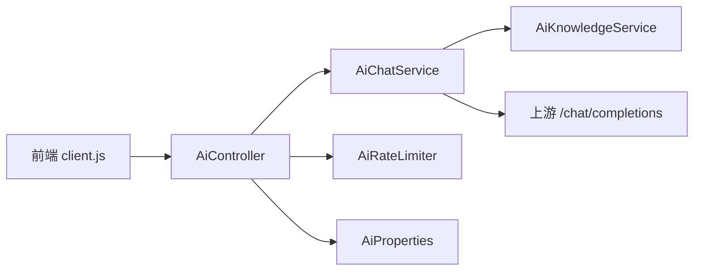

# AI对话服务

<cite>
**本文引用的文件**
- [AiController.java](file://backend/src/main/java/com/suanfa/controller/AiController.java)
- [AiChatService.java](file://backend/src/main/java/com/suanfa/service/AiChatService.java)
- [AiKnowledgeService.java](file://backend/src/main/java/com/suanfa/service/AiKnowledgeService.java)
- [AiRateLimiter.java](file://backend/src/main/java/com/suanfa/service/AiRateLimiter.java)
- [AiProperties.java](file://backend/src/main/java/com/suanfa/config/AiProperties.java)
- [GlobalExceptionHandler.java](file://backend/src/main/java/com/suanfa/config/GlobalExceptionHandler.java)
- [ChatRequest.java](file://backend/src/main/java/com/suanfa/dto/ChatRequest.java)
- [ChatResponse.java](file://backend/src/main/java/com/suanfa/dto/ChatResponse.java)
- [AiModelInfo.java](file://backend/src/main/java/com/suanfa/dto/AiModelInfo.java)
- [ChatRef.java](file://backend/src/main/java/com/suanfa/dto/ChatRef.java)
- [client.js](file://suanfa_vue/src/api/client.js)
</cite>

## 目录
1. [简介](#简介)
2. [项目结构](#项目结构)
3. [核心组件](#核心组件)
4. [架构总览](#架构总览)
5. [详细组件分析](#详细组件分析)
6. [依赖关系分析](#依赖关系分析)
7. [性能与稳定性](#性能与稳定性)
8. [故障排查指南](#故障排查指南)
9. [结论](#结论)
10. [附录：集成与使用模式](#附录集成与使用模式)

## 简介
本文档面向开发者，系统性说明后端AI对话服务的流式对话实现机制，包括SSE流式响应、多模型故障转移、上下文消息构建、对话历史管理、StreamHandler接口设计、增量文本回调、错误处理策略、对话状态维护、超时控制与连接管理等关键技术点。同时提供前后端协作的完整集成指南与使用模式，帮助快速接入并稳定运行。

## 项目结构
后端采用Spring Boot分层组织：
- 控制器层：暴露REST/SSE接口，负责鉴权、限流、参数校验与事件封装
- 服务层：封装上游模型调用、知识增强、熔断与降级、流式解析
- 配置层：集中管理上游中转站、模型清单、全局参数
- DTO层：请求/响应数据契约
- 前端：Vue应用通过SSE消费增量事件，实现打字机效果与“停止回答”

图表来源
- [AiController.java:224-313](file://backend/src/main/java/com/suanfa/controller/AiController.java#L224-L313)
- [AiChatService.java:574-730](file://backend/src/main/java/com/suanfa/service/AiChatService.java#L574-L730)
- [AiKnowledgeService.java:203-288](file://backend/src/main/java/com/suanfa/service/AiKnowledgeService.java#L203-L288)
- [AiRateLimiter.java:27-72](file://backend/src/main/java/com/suanfa/service/AiRateLimiter.java#L27-L72)
- [AiProperties.java:25-57](file://backend/src/main/java/com/suanfa/config/AiProperties.java#L25-L57)
- [GlobalExceptionHandler.java:21-68](file://backend/src/main/java/com/suanfa/config/GlobalExceptionHandler.java#L21-L68)

章节来源
- [AiController.java:34-118](file://backend/src/main/java/com/suanfa/controller/AiController.java#L34-L118)
- [AiChatService.java:30-105](file://backend/src/main/java/com/suanfa/service/AiChatService.java#L30-L105)

## 核心组件
- 控制器（AiController）：定义一次性对话与SSE流式对话接口；负责登录校验、模型权限、限流、并发池调度、SSE事件发送与错误兜底
- 聊天服务（AiChatService）：构建上下文消息、召回站内知识、流式调用上游、增量回调、模型选择与故障转移、熔断冷却、超时控制
- 知识库（AiKnowledgeService）：轻量RAG，按问题召回Top-K算法资料注入system prompt，并返回引用信息供前端展示
- 限流器（AiRateLimiter）：基于滑动窗口的每分钟请求限制，支持退额度
- 配置（AiProperties）：统一承载单/多中转站、模型预算、温度、超时、管理员白名单等
- 全局异常（GlobalExceptionHandler）：统一错误格式与HTTP状态码

章节来源
- [AiController.java:49-81](file://backend/src/main/java/com/suanfa/controller/AiController.java#L49-L81)
- [AiChatService.java:48-105](file://backend/src/main/java/com/suanfa/service/AiChatService.java#L48-L105)
- [AiKnowledgeService.java:23-33](file://backend/src/main/java/com/suanfa/service/AiKnowledgeService.java#L23-L33)
- [AiRateLimiter.java:11-25](file://backend/src/main/java/com/suanfa/service/AiRateLimiter.java#L11-L25)
- [AiProperties.java:11-57](file://backend/src/main/java/com/suanfa/config/AiProperties.java#L11-L57)
- [GlobalExceptionHandler.java:14-22](file://backend/src/main/java/com/suanfa/config/GlobalExceptionHandler.java#L14-L22)

## 架构总览
整体流程：前端发起POST到/chat/stream，控制器完成鉴权与限流后，在服务线程池中执行流式对话；服务层组装系统提示与历史消息，调用上游OpenAI兼容接口的SSE流，逐条解析增量并回调给控制器写入SSE；失败时按策略熔断、降级或返回错误。

图表来源
- [AiController.java:224-313](file://backend/src/main/java/com/suanfa/controller/AiController.java#L224-L313)
- [AiChatService.java:574-730](file://backend/src/main/java/com/suanfa/service/AiChatService.java#L574-L730)
- [AiKnowledgeService.java:203-288](file://backend/src/main/java/com/suanfa/service/AiKnowledgeService.java#L203-L288)
- [client.js:469-552](file://suanfa_vue/src/api/client.js#L469-L552)

## 详细组件分析

### SSE流式响应处理
- 控制器创建SseEmitter并设置超时与取消回调，将流式任务提交到专用线程池执行
- 通过sendQuiet安全发送meta/delta/reasoning/done/error事件，忽略客户端断开导致的异常
- 非流式接口直接聚合结果返回，便于旧客户端兼容

图表来源
- [AiController.java:224-313](file://backend/src/main/java/com/suanfa/controller/AiController.java#L224-L313)

章节来源
- [AiController.java:224-313](file://backend/src/main/java/com/suanfa/controller/AiController.java#L224-L313)

### 多模型故障转移与熔断
- 候选模型顺序：优先用户指定模型，其次跳过处于熔断期的模型；全部熔断时退化到最快恢复项
- 熔断表：以provider/name为键记录恢复时间，避免重复撞坏上游
- 错误分类：网络异常、上游4xx/5xx、空答案等分别设置不同冷却时长
- 已输出内容后失败不再切换模型，避免混排

图表来源
- [AiChatService.java:574-668](file://backend/src/main/java/com/suanfa/service/AiChatService.java#L574-L668)
- [AiChatService.java:672-730](file://backend/src/main/java/com/suanfa/service/AiChatService.java#L672-L730)

章节来源
- [AiChatService.java:574-668](file://backend/src/main/java/com/suanfa/service/AiChatService.java#L574-L668)
- [AiChatService.java:672-730](file://backend/src/main/java/com/suanfa/service/AiChatService.java#L672-L730)

### 上下文消息构建与对话历史管理
- 系统提示：内置角色设定与站点规则，结合知识库召回的Top-K算法摘录，形成强约束的system prompt
- 历史截断：最多保留最近若干轮消息，单条内容长度限制，防止滥用与超限
- 引用信息：将召回的算法条目转为refs，随meta下发前端用于渲染参考链接

图表来源
- [AiChatService.java:574-585](file://backend/src/main/java/com/suanfa/service/AiChatService.java#L574-L585)
- [AiKnowledgeService.java:203-288](file://backend/src/main/java/com/suanfa/service/AiKnowledgeService.java#L203-L288)

章节来源
- [AiChatService.java:574-585](file://backend/src/main/java/com/suanfa/service/AiChatService.java#L574-L585)
- [AiKnowledgeService.java:203-288](file://backend/src/main/java/com/suanfa/service/AiKnowledgeService.java#L203-L288)

### StreamHandler接口设计与增量回调
- StreamHandler定义onMeta/onDelta/onReasoning/onDone/onError，控制器实现该接口将事件映射为SSE事件
- 增量回调在流式解析过程中被多次调用，控制器负责安全写入SSE并处理客户端断开
- 思考链仅发送信号事件，不传输具体文本，保护隐私与带宽

图表来源
- [AiChatService.java:497-512](file://backend/src/main/java/com/suanfa/service/AiChatService.java#L497-L512)
- [AiController.java:256-313](file://backend/src/main/java/com/suanfa/controller/AiController.java#L256-L313)

章节来源
- [AiChatService.java:497-512](file://backend/src/main/java/com/suanfa/service/AiChatService.java#L497-L512)
- [AiController.java:256-313](file://backend/src/main/java/com/suanfa/controller/AiController.java#L256-L313)

### 错误处理策略
- 控制器层：对未登录、未配置、参数非法、限流拒绝进行前置拦截，返回对应HTTP状态码与错误体
- 服务层：区分客户端断开、上游错误、网络异常，设置不同熔断时长；已输出内容失败不切换模型
- 全局异常：统一捕获路由与方法错误、参数解析错误，保证前端获得明确状态码与消息

图表来源
- [AiController.java:323-348](file://backend/src/main/java/com/suanfa/controller/AiController.java#L323-L348)
- [AiChatService.java:595-636](file://backend/src/main/java/com/suanfa/service/AiChatService.java#L595-L636)
- [GlobalExceptionHandler.java:26-68](file://backend/src/main/java/com/suanfa/config/GlobalExceptionHandler.java#L26-L68)

章节来源
- [AiController.java:323-348](file://backend/src/main/java/com/suanfa/controller/AiController.java#L323-L348)
- [AiChatService.java:595-636](file://backend/src/main/java/com/suanfa/service/AiChatService.java#L595-L636)
- [GlobalExceptionHandler.java:26-68](file://backend/src/main/java/com/suanfa/config/GlobalExceptionHandler.java#L26-L68)

### 对话状态维护、超时控制与连接管理
- 会话状态：控制器维护cancelled标志位，监听SSE完成/超时/错误事件，及时中断后续写入
- 超时控制：SseEmitter设置发射器超时；上游请求设置超时；流式解析内检查deadline防止长耗时
- 连接管理：专用线程池限制并发，队列直连，满则立即拒绝并返回友好错误；上游使用HTTP/1.1兼容更多中转站

章节来源
- [AiController.java:53-81](file://backend/src/main/java/com/suanfa/controller/AiController.java#L53-L81)
- [AiController.java:224-253](file://backend/src/main/java/com/suanfa/controller/AiController.java#L224-L253)
- [AiChatService.java:690-730](file://backend/src/main/java/com/suanfa/service/AiChatService.java#L690-L730)

## 依赖关系分析
- 控制器依赖服务、限流、配置与服务设置，承担入口编排
- 服务依赖知识库与配置，封装上游调用与流式解析
- 知识库依赖数据库或种子文件，提供算法召回与上下文注入
- 前端依赖后端SSE事件约定，实现增量渲染与错误降级

图表来源
- [AiController.java:57-76](file://backend/src/main/java/com/suanfa/controller/AiController.java#L57-L76)
- [AiChatService.java:80-105](file://backend/src/main/java/com/suanfa/service/AiChatService.java#L80-L105)
- [client.js:469-552](file://suanfa_vue/src/api/client.js#L469-L552)

章节来源
- [AiController.java:57-76](file://backend/src/main/java/com/suanfa/controller/AiController.java#L57-L76)
- [AiChatService.java:80-105](file://backend/src/main/java/com/suanfa/service/AiChatService.java#L80-L105)
- [client.js:469-552](file://suanfa_vue/src/api/client.js#L469-L552)

## 性能与稳定性
- 流式吞吐：SSE逐字推送，降低首字节延迟，提升用户体验
- 并发控制：小线程池+无界队列直连，避免排队放大延迟，过载快速失败
- 熔断冷却：按模型维度记录失败恢复时间，减少无效重试
- 历史裁剪：限制消息数量与单条长度，控制prompt体积与成本
- 超时保护：发射器与上游双重超时，防止资源长期占用

[本节为通用性能讨论，无需特定文件引用]

## 故障排查指南
- 未登录/未开放：前端收到401/503时降级本地答疑，检查登录态与管理员开放配置
- 限流：429表示超过每分钟上限，等待或降低频率
- 上游不可用：查看模型详情中的cooldownSeconds，确认是否处于熔断期
- 空答案：本地思考型模型需增大max_tokens或调整reasoning_effort
- 方法/路径错误：全局异常会返回明确状态码与提示，核对前端请求方法与路径

章节来源
- [GlobalExceptionHandler.java:26-68](file://backend/src/main/java/com/suanfa/config/GlobalExceptionHandler.java#L26-L68)
- [AiController.java:323-348](file://backend/src/main/java/com/suanfa/controller/AiController.java#L323-L348)
- [AiChatService.java:595-636](file://backend/src/main/java/com/suanfa/service/AiChatService.java#L595-L636)

## 结论
该AI对话服务通过SSE流式响应、多模型故障转移、知识增强与严格限流，提供了高可用、低延迟、可观测的对话能力。控制器与服务层职责清晰，错误处理完善，适合在生产环境大规模使用。前端配合SSE解析与降级策略，确保在网络或服务异常时仍能提供良好体验。

[本节为总结性内容，无需特定文件引用]

## 附录：集成与使用模式

### 前端集成要点
- 使用fetch流式读取SSE，按事件类型处理meta/delta/reasoning/done/error
- 对401/503/404/405等状态做降级处理，必要时回退到一次性接口或本地答疑
- 支持AbortController中断生成，避免浪费上游额度

章节来源
- [client.js:426-552](file://suanfa_vue/src/api/client.js#L426-L552)

### 后端对接要点
- 请求体包含messages与可选model；messages建议限制轮数与长度
- 服务端自动选择默认模型，失败时按配置顺序降级
- 关注返回的refs，用于渲染站内参考链接

章节来源
- [ChatRequest.java:5-15](file://backend/src/main/java/com/suanfa/dto/ChatRequest.java#L5-L15)
- [ChatResponse.java:3-9](file://backend/src/main/java/com/suanfa/dto/ChatResponse.java#L3-L9)
- [AiModelInfo.java:10-27](file://backend/src/main/java/com/suanfa/dto/AiModelInfo.java#L10-L27)
- [ChatRef.java:3-5](file://backend/src/main/java/com/suanfa/dto/ChatRef.java#L3-L5)

### 关键配置项
- suanfa.ai.*：基础URL、API Key、超时、温度、最大token、限流速率、管理员白名单
- providers：多中转站配置，支持独立base-url、headers、模型级预算与可见性
- knowledgeEnabled：是否启用站内知识增强

章节来源
- [AiProperties.java:25-57](file://backend/src/main/java/com/suanfa/config/AiProperties.java#L25-L57)
- [AiProperties.java:58-267](file://backend/src/main/java/com/suanfa/config/AiProperties.java#L58-L267)