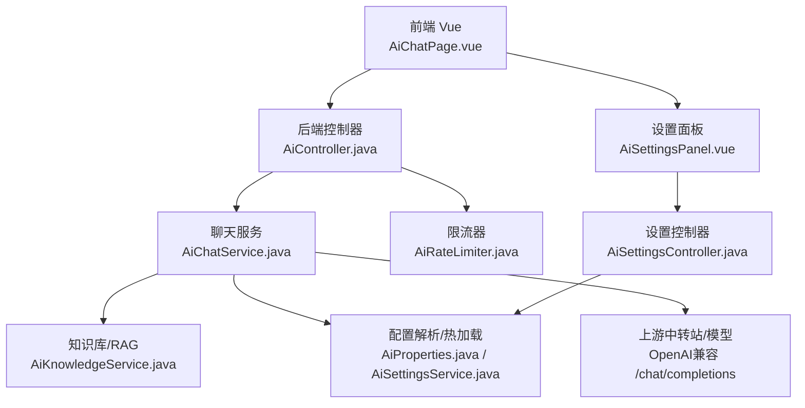
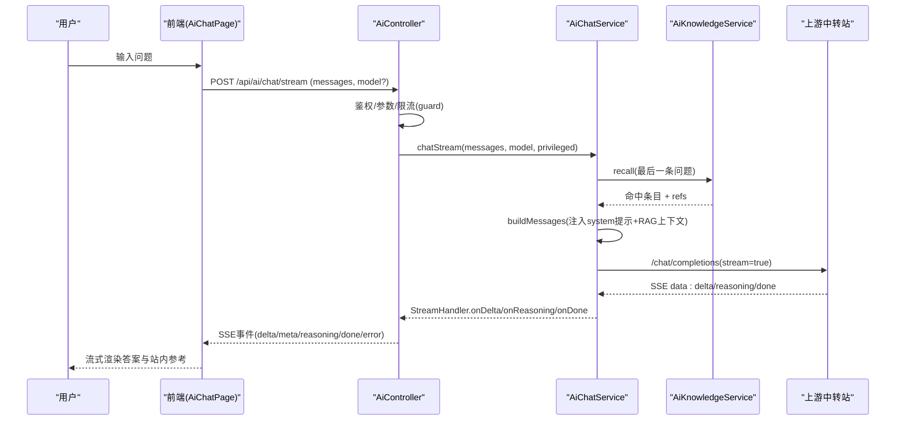
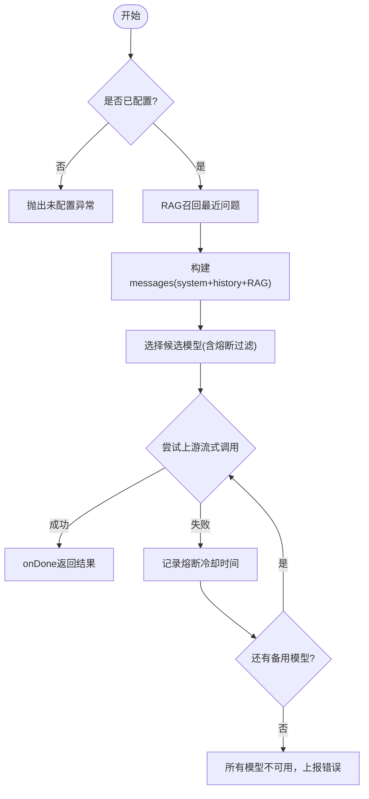
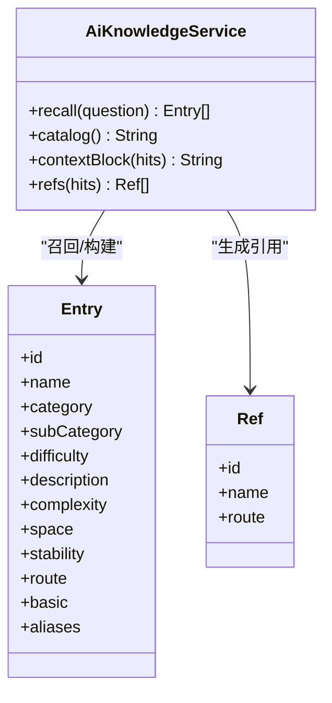
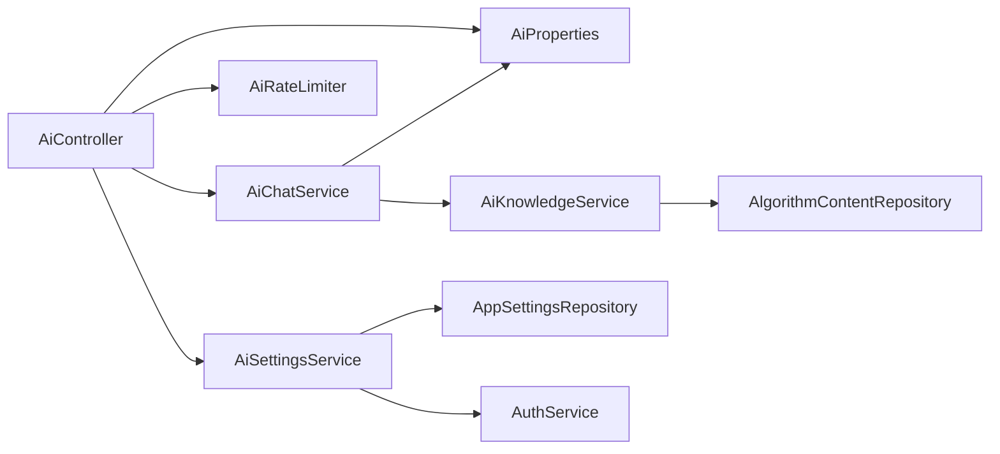

# AI系统集成

<cite>
**本文引用的文件**
- [AiController.java](file://backend/src/main/java/com/suanfa/controller/AiController.java)
- [AiChatService.java](file://backend/src/main/java/com/suanfa/service/AiChatService.java)
- [AiKnowledgeService.java](file://backend/src/main/java/com/suanfa/service/AiKnowledgeService.java)
- [AiRateLimiter.java](file://backend/src/main/java/com/suanfa/service/AiRateLimiter.java)
- [AiSettingsService.java](file://backend/src/main/java/com/suanfa/service/AiSettingsService.java)
- [AiSettingsController.java](file://backend/src/main/java/com/suanfa/controller/AiSettingsController.java)
- [AiProperties.java](file://backend/src/main/java/com/suanfa/config/AiProperties.java)
- [application.yml](file://backend/src/main/resources/application.yml)
- [ChatRequest.java](file://backend/src/main/java/com/suanfa/dto/ChatRequest.java)
- [ChatResponse.java](file://backend/src/main/java/com/suanfa/dto/ChatResponse.java)
- [AiChatPage.vue](file://suanfa_vue/src/components/common/AiChatPage.vue)
- [AiSettingsPanel.vue](file://suanfa_vue/src/components/common/AiSettingsPanel.vue)
</cite>

## 目录
1. [简介](#简介)
2. [项目结构](#项目结构)
3. [核心组件](#核心组件)
4. [架构总览](#架构总览)
5. [详细组件分析](#详细组件分析)
6. [依赖关系分析](#依赖关系分析)
7. [性能与限流熔断](#性能与限流熔断)
8. [故障排查指南](#故障排查指南)
9. [结论](#结论)
10. [附录：配置与安全](#附录配置与安全)

## 简介
本系统为“小白学算法”网站提供AI助教能力，后端以Spring Boot实现，通过OpenAI兼容的chat/completions接口对接多个API中转站或本地模型，提供多轮对话、上下文维护、流式响应、知识检索增强（RAG）、多模型自动降级与熔断、按用户维度的限流、以及页面可配置的动态热加载。前端Vue页面支持SSE流式打字机输出、站内资料引用、本地答疑模式与管理员中转站配置面板。

## 项目结构
- 后端（Java/Spring Boot）
  - 控制器层：暴露 /api/ai/* 接口，处理聊天、状态查询、设置管理
  - 服务层：封装上游调用、RAG召回、限流、配置热加载
  - 配置层：统一读取yml与环境变量，支持多中转站providers
  - DTO/实体：请求/响应数据对象
- 前端（Vue）
  - 聊天页：SSE流式接收、消息历史、站内参考链接
  - 设置面板：管理员可视化配置中转站、测试连接、保存即生效

**图表来源**
- [AiController.java:49-118](file://backend/src/main/java/com/suanfa/controller/AiController.java#L49-L118)
- [AiChatService.java:48-105](file://backend/src/main/java/com/suanfa/service/AiChatService.java#L48-L105)
- [AiKnowledgeService.java:23-33](file://backend/src/main/java/com/suanfa/service/AiKnowledgeService.java#L23-L33)
- [AiSettingsService.java:23-34](file://backend/src/main/java/com/suanfa/service/AiSettingsService.java#L23-L34)
- [AiSettingsController.java:21-33](file://backend/src/main/java/com/suanfa/controller/AiSettingsController.java#L21-L33)
- [AiChatPage.vue:1-10](file://suanfa_vue/src/components/common/AiChatPage.vue#L1-L10)
- [AiSettingsPanel.vue:1-5](file://suanfa_vue/src/components/common/AiSettingsPanel.vue#L1-L5)

**章节来源**
- [AiController.java:49-118](file://backend/src/main/java/com/suanfa/controller/AiController.java#L49-L118)
- [application.yml:18-50](file://backend/src/main/resources/application.yml#L18-L50)

## 核心组件
- 聊天控制器：统一入口，负责鉴权、参数校验、限流、SSE流式转发与错误处理
- 聊天服务：上游代理、多模型选择与降级、熔断冷却、RAG注入、流式解析
- 知识库服务：轻量RAG，基于站内算法内容构建索引与别名召回，生成提示上下文
- 限流器：按用户滑动窗口限流，支持退额度
- 设置服务：页面配置持久化、热加载、脱敏展示、管理员门禁
- 配置属性：集中承载AI相关配置，支持旧写法与多中转站providers合并

**章节来源**
- [AiController.java:199-254](file://backend/src/main/java/com/suanfa/controller/AiController.java#L199-L254)
- [AiChatService.java:553-636](file://backend/src/main/java/com/suanfa/service/AiChatService.java#L553-L636)
- [AiKnowledgeService.java:203-229](file://backend/src/main/java/com/suanfa/service/AiKnowledgeService.java#L203-L229)
- [AiRateLimiter.java:27-53](file://backend/src/main/java/com/suanfa/service/AiRateLimiter.java#L27-L53)
- [AiSettingsService.java:167-205](file://backend/src/main/java/com/suanfa/service/AiSettingsService.java#L167-L205)
- [AiProperties.java:25-57](file://backend/src/main/java/com/suanfa/config/AiProperties.java#L25-L57)

## 架构总览
系统采用“控制器-服务-上游”的分层架构，结合RAG与限流熔断机制，保证高可用与可控成本。

**图表来源**
- [AiController.java:224-313](file://backend/src/main/java/com/suanfa/controller/AiController.java#L224-L313)
- [AiChatService.java:574-636](file://backend/src/main/java/com/suanfa/service/AiChatService.java#L574-L636)
- [AiKnowledgeService.java:203-229](file://backend/src/main/java/com/suanfa/service/AiKnowledgeService.java#L203-L229)

## 详细组件分析

### 聊天服务（AiChatService）
- 多中转站与模型发现：支持从yml/env/providers-json/runtime配置合并，去重、墓碑屏蔽、primary置顶
- 模型选择与降级：优先用户指定模型；否则按可用顺序尝试；失败进入cooldown冷却表，避免重复撞坏上游
- 流式调用：使用HTTP/1.1 HttpClient读取SSE行，解析data:行与[DONE]结束标记；超时保护
- RAG注入：根据最后一条问题召回Top-K算法条目，拼接至system prompt，并返回refs供前端展示站内参考
- 错误诊断：解析上游错误体，区分限流/额度不足/网络异常等，附带冷却秒数
- 客户端断开：特殊异常类型，不计入熔断、不退额度（已消费上游额度）

**图表来源**
- [AiChatService.java:574-636](file://backend/src/main/java/com/suanfa/service/AiChatService.java#L574-L636)
- [AiChatService.java:638-668](file://backend/src/main/java/com/suanfa/service/AiChatService.java#L638-L668)
- [AiChatService.java:672-730](file://backend/src/main/java/com/suanfa/service/AiChatService.java#L672-L730)

**章节来源**
- [AiChatService.java:180-262](file://backend/src/main/java/com/suanfa/service/AiChatService.java#L180-L262)
- [AiChatService.java:574-636](file://backend/src/main/java/com/suanfa/service/AiChatService.java#L574-L636)
- [AiChatService.java:672-730](file://backend/src/main/java/com/suanfa/service/AiChatService.java#L672-L730)

### 知识检索增强（RAG）（AiKnowledgeService）
- 数据源：优先MongoDB集合，不可用时回退classpath种子文件，常驻内存缓存
- 索引构建：将每条算法内容展平为Entry，附带别名集（中英同义词、缩写、分类词），用于召回
- 相似度匹配：基于关键词包含与权重打分（别名长度、分类匹配加分），取Top-K
- 上下文生成：将命中条目摘要（简介、复杂度、稳定性、难度、基础说明）拼成提示片段，限制长度
- 引用返回：向控制器返回Ref列表，前端展示“站内参考”链接

**图表来源**
- [AiKnowledgeService.java:103-111](file://backend/src/main/java/com/suanfa/service/AiKnowledgeService.java#L103-L111)
- [AiKnowledgeService.java:203-229](file://backend/src/main/java/com/suanfa/service/AiKnowledgeService.java#L203-L229)
- [AiKnowledgeService.java:240-288](file://backend/src/main/java/com/suanfa/service/AiKnowledgeService.java#L240-L288)

**章节来源**
- [AiKnowledgeService.java:128-154](file://backend/src/main/java/com/suanfa/service/AiKnowledgeService.java#L128-L154)
- [AiKnowledgeService.java:203-229](file://backend/src/main/java/com/suanfa/service/AiKnowledgeService.java#L203-L229)
- [AiKnowledgeService.java:240-288](file://backend/src/main/java/com/suanfa/service/AiKnowledgeService.java#L240-L288)

### 多模型支持与切换逻辑
- 配置来源优先级：页面runtime > providers-json > yml/providers > 旧写法(base-url/model/fallback-models)
- 模型标识：provider/name唯一键，解决不同中转站同名模型冲突
- 默认模型：primary置顶，前端仅展示defaultModel，不暴露下拉选择
- 降级链：用户指定模型失败时，按可用顺序尝试其他模型；全部熔断时退化到最快恢复的模型
- 可见性控制：userVisible=false仅管理员可见，不参与普通用户降级链

**章节来源**
- [AiProperties.java:25-57](file://backend/src/main/java/com/suanfa/config/AiProperties.java#L25-L57)
- [AiChatService.java:180-262](file://backend/src/main/java/com/suanfa/service/AiChatService.java#L180-L262)
- [AiChatService.java:421-454](file://backend/src/main/java/com/suanfa/service/AiChatService.java#L421-L454)
- [AiChatService.java:638-668](file://backend/src/main/java/com/suanfa/service/AiChatService.java#L638-L668)

### 限流与熔断
- 限流：按用户ID滑动窗口（每分钟N次），支持退额度（上游全挂/参数错误/并发满）
- 熔断：模型级冷却表（provider/name -> until），失败后写入冷却时间，避免重复撞坏上游
- 并发保护：SSE流式使用固定线程池+SynchronousQueue，拒绝时直接503，防止排队耗尽资源

**章节来源**
- [AiRateLimiter.java:27-53](file://backend/src/main/java/com/suanfa/service/AiRateLimiter.java#L27-L53)
- [AiChatService.java:90-92](file://backend/src/main/java/com/suanfa/service/AiChatService.java#L90-L92)
- [AiChatService.java:638-668](file://backend/src/main/java/com/suanfa/service/AiChatService.java#L638-L668)
- [AiController.java:61-68](file://backend/src/main/java/com/suanfa/controller/AiController.java#L61-L68)

### 配置管理与密钥安全
- 配置项：base-url、api-key、model、fallback-models、timeout、max-tokens、temperature、knowledge-enabled、rate-per-minute、admin-usernames、providers/providers-json
- 热加载：页面保存providers后调用reload重建模型清单，无需重启
- 密钥安全：设置面板脱敏显示token；保存时保留已有key或显式清除；禁止覆盖关键头（authorization/content-type/accept）

**章节来源**
- [application.yml:18-50](file://backend/src/main/resources/application.yml#L18-L50)
- [AiSettingsService.java:167-205](file://backend/src/main/java/com/suanfa/service/AiSettingsService.java#L167-L205)
- [AiSettingsService.java:334-347](file://backend/src/main/java/com/suanfa/service/AiSettingsService.java#L334-L347)
- [AiChatService.java:732-744](file://backend/src/main/java/com/suanfa/service/AiChatService.java#L732-L744)

### 前端交互与流式处理
- 流式接收：SSE事件delta累积文本，meta携带refs，reasoning提示思考中，done完成
- 本地答疑：未登录或未配置时，前端走本地答疑模式（基于站内资料）
- 降级提示：当实际服务模型与默认模型不一致时，标注本次由某模型回答
- 停止回答：AbortController中断SSE，服务端识别客户端断开并静默收尾

**章节来源**
- [AiChatPage.vue:126-189](file://suanfa_vue/src/components/common/AiChatPage.vue#L126-L189)
- [AiChatPage.vue:245-259](file://suanfa_vue/src/components/common/AiChatPage.vue#L245-L259)
- [AiController.java:256-313](file://backend/src/main/java/com/suanfa/controller/AiController.java#L256-L313)

## 依赖关系分析
- 控制器依赖：AiChatService、AiRateLimiter、AiProperties、AiSettingsService
- 服务依赖：HttpClient、ObjectMapper、AiKnowledgeService、AiProperties
- 知识库依赖：AlgorithmContentRepository、ObjectMapper、种子文件
- 设置服务依赖：AppSettingsRepository、AuthService、AiChatService、AiProperties

**图表来源**
- [AiController.java:57-76](file://backend/src/main/java/com/suanfa/controller/AiController.java#L57-L76)
- [AiChatService.java:80-105](file://backend/src/main/java/com/suanfa/service/AiChatService.java#L80-L105)
- [AiKnowledgeService.java:93-101](file://backend/src/main/java/com/suanfa/service/AiKnowledgeService.java#L93-L101)
- [AiSettingsService.java:50-67](file://backend/src/main/java/com/suanfa/service/AiSettingsService.java#L50-L67)

**章节来源**
- [AiController.java:57-76](file://backend/src/main/java/com/suanfa/controller/AiController.java#L57-L76)
- [AiChatService.java:80-105](file://backend/src/main/java/com/suanfa/service/AiChatService.java#L80-L105)
- [AiKnowledgeService.java:93-101](file://backend/src/main/java/com/suanfa/service/AiKnowledgeService.java#L93-L101)
- [AiSettingsService.java:50-67](file://backend/src/main/java/com/suanfa/service/AiSettingsService.java#L50-L67)

## 性能与限流熔断
- 流式线程池：小容量线程池+无界队列直连，超限直接拒绝，避免阻塞主线程
- SSE缓冲关闭：响应头禁用nginx缓冲，确保实时推送
- 上游超时：单次请求设置超时，SSE逐行检查deadline，防止长尾占用
- 限流退额：上游全挂/参数错误/并发满时退还额度，避免误扣
- 熔断冷却：模型级冷却表，减少无效重试，提升整体可用性

[本节为通用性能讨论，不直接分析具体文件]

## 故障排查指南
- 未配置/未开放：/api/ai/status返回configured/loginRequired，前端降级本地答疑
- 限流触发：429 Too Many Requests，提示每分钟上限
- 上游错误：Bad Gateway，携带上游错误详情（限流/额度不足/网络异常）
- 模型熔断：status返回cooldownSecondsLeft>0，表示该模型处于冷却期
- 连接测试：/api/ai/settings/test返回步骤明细、延迟、错误信息

**章节来源**
- [AiController.java:83-118](file://backend/src/main/java/com/suanfa/controller/AiController.java#L83-L118)
- [AiController.java:199-222](file://backend/src/main/java/com/suanfa/controller/AiController.java#L199-L222)
- [AiController.java:224-254](file://backend/src/main/java/com/suanfa/controller/AiController.java#L224-L254)
- [AiSettingsController.java:84-109](file://backend/src/main/java/com/suanfa/controller/AiSettingsController.java#L84-L109)

## 结论
本AI系统集成以多中转站、RAG、流式响应、限流熔断为核心，提供了稳定、可控、可扩展的AI助教能力。通过页面可配置的热加载机制，管理员可灵活调整上游与模型策略；前端提供友好的交互体验与降级提示。建议在生产环境严格配置密钥、合理设置限流与熔断参数，并结合监控日志持续优化模型选择与RAG召回效果。

[本节为总结，不直接分析具体文件]

## 附录：配置与安全
- 环境变量与yml：AI_BASE_URL、AI_API_KEY、AI_MODEL、AI_FALLBACK_MODELS、AI_TIMEOUT_SECONDS、AI_MAX_TOKENS、AI_TEMPERATURE、AI_KNOWLEDGE、AI_RATE_PER_MINUTE、AI_ADMIN_USERNAMES、AI_PROVIDERS_JSON
- 页面配置：管理员通过设置面板编辑providers，保存即热生效；支持测试连接、导入模型名
- 密钥安全：token脱敏显示；保存时保留已有key或显式清除；禁止覆盖关键头
- 权限控制：仅白名单用户名可访问设置接口；未登录无法获取模型清单

**章节来源**
- [application.yml:18-50](file://backend/src/main/resources/application.yml#L18-L50)
- [AiSettingsController.java:21-33](file://backend/src/main/java/com/suanfa/controller/AiSettingsController.java#L21-L33)
- [AiSettingsService.java:334-347](file://backend/src/main/java/com/suanfa/service/AiSettingsService.java#L334-L347)
- [AiChatService.java:732-744](file://backend/src/main/java/com/suanfa/service/AiChatService.java#L732-L744)