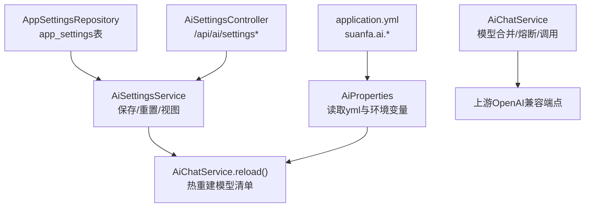
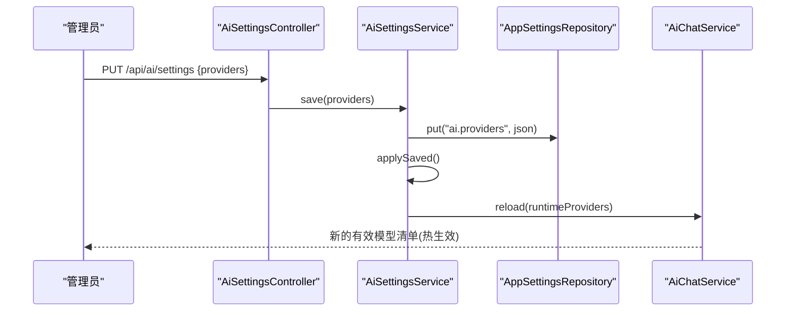
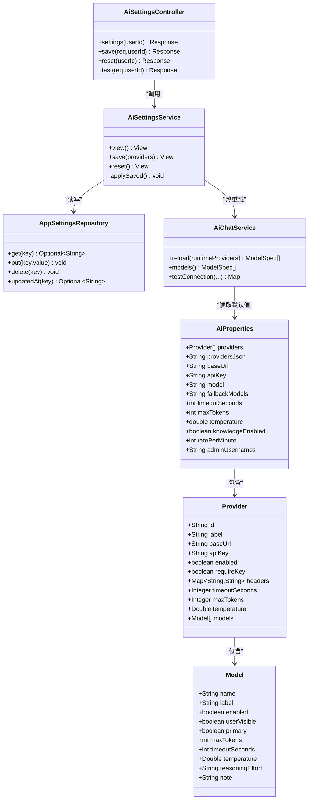

# AI配置管理

<cite>
**本文引用的文件**
- [AiProperties.java](file://backend/src/main/java/com/suanfa/config/AiProperties.java)
- [application.yml](file://backend/src/main/resources/application.yml)
- [AiSettingsDto.java](file://backend/src/main/java/com/suanfa/dto/AiSettingsDto.java)
- [AiSettingsService.java](file://backend/src/main/java/com/suanfa/service/AiSettingsService.java)
- [AiChatService.java](file://backend/src/main/java/com/suanfa/service/AiChatService.java)
- [AppSettingsRepository.java](file://backend/src/main/java/com/suanfa/repository/AppSettingsRepository.java)
- [AiSettingsController.java](file://backend/src/main/java/com/suanfa/controller/AiSettingsController.java)
- [JwtService.java](file://backend/src/main/java/com/suanfa/security/JwtService.java)
- [GlobalExceptionHandler.java](file://backend/src/main/java/com/suanfa/config/GlobalExceptionHandler.java)
</cite>

## 目录
1. [简介](#简介)
2. [项目结构](#项目结构)
3. [核心组件](#核心组件)
4. [架构总览](#架构总览)
5. [详细组件分析](#详细组件分析)
6. [依赖关系分析](#依赖关系分析)
7. [性能与容量特性](#性能与容量特性)
8. [故障诊断指南](#故障诊断指南)
9. [结论](#结论)
10. [附录：配置示例与最佳实践](#附录配置示例与最佳实践)

## 简介
本文件面向AI系统配置管理，覆盖多模型提供商（中转站）配置、环境变量管理、运行时配置更新、配置优先级规则、热重载机制与安全密钥管理。文档基于后端代码实现，提供从设计到部署维护的完整指导，帮助在生产环境中稳定运行多上游、可降级、可观测的AI助教能力。

## 项目结构
AI配置相关的关键位置如下：
- 配置类与默认值：AiProperties、application.yml
- 运行时配置存储与热加载：AppSettingsRepository、AiSettingsService
- 配置合并与生效模型清单：AiChatService
- 管理员配置接口：AiSettingsController
- 安全与鉴权：JwtService、全局异常处理：GlobalExceptionHandler

图表来源
- [application.yml:18-92](file://backend/src/main/resources/application.yml#L18-L92)
- [AiProperties.java:25-57](file://backend/src/main/java/com/suanfa/config/AiProperties.java#L25-L57)
- [AppSettingsRepository.java:15-44](file://backend/src/main/java/com/suanfa/repository/AppSettingsRepository.java#L15-L44)
- [AiSettingsService.java:35-67](file://backend/src/main/java/com/suanfa/service/AiSettingsService.java#L35-L67)
- [AiChatService.java:80-129](file://backend/src/main/java/com/suanfa/service/AiChatService.java#L80-L129)
- [AiSettingsController.java:34-46](file://backend/src/main/java/com/suanfa/controller/AiSettingsController.java#L34-L46)

章节来源
- [application.yml:18-92](file://backend/src/main/resources/application.yml#L18-L92)
- [AiProperties.java:25-57](file://backend/src/main/java/com/suanfa/config/AiProperties.java#L25-L57)
- [AppSettingsRepository.java:15-44](file://backend/src/main/java/com/suanfa/repository/AppSettingsRepository.java#L15-L44)
- [AiSettingsService.java:35-67](file://backend/src/main/java/com/suanfa/service/AiSettingsService.java#L35-L67)
- [AiChatService.java:80-129](file://backend/src/main/java/com/suanfa/service/AiChatService.java#L80-L129)
- [AiSettingsController.java:34-46](file://backend/src/main/java/com/suanfa/controller/AiSettingsController.java#L34-L46)

## 核心组件
- AiProperties：集中承载AI相关配置，支持旧单中转站写法与新多中转站providers写法，并提供providers-json环境变量友好字段。
- Provider与Model：Provider描述一个中转站（地址、密钥、头、预算等），Model描述该中转站下的具体模型（标签、可见性、默认、推理档位等）。
- AppSettingsRepository：持久化页面配置（key-value JSON），支持upsert与更新时间戳。
- AiSettingsService：管理员配置入口的服务层，负责校验、保存、重置、视图组装与热加载。
- AiChatService：合并所有来源的配置生成“当前生效模型清单”，提供熔断、降级、流式调用与测试连接能力。
- AiSettingsController：暴露管理员API（查看、保存、重置、测试连接），并做登录与白名单门禁。
- JwtService：JWT签发与解析，用于用户身份识别（含username），配合白名单控制配置权限。
- GlobalExceptionHandler：统一错误响应，确保方法不匹配、参数缺失等错误以正确状态码返回。

章节来源
- [AiProperties.java:25-267](file://backend/src/main/java/com/suanfa/config/AiProperties.java#L25-L267)
- [AppSettingsRepository.java:15-44](file://backend/src/main/java/com/suanfa/repository/AppSettingsRepository.java#L15-L44)
- [AiSettingsService.java:35-67](file://backend/src/main/java/com/suanfa/service/AiSettingsService.java#L35-L67)
- [AiChatService.java:80-129](file://backend/src/main/java/com/suanfa/service/AiChatService.java#L80-L129)
- [AiSettingsController.java:34-46](file://backend/src/main/java/com/suanfa/controller/AiSettingsController.java#L34-L46)
- [JwtService.java:14-56](file://backend/src/main/java/com/suanfa/security/JwtService.java#L14-L56)
- [GlobalExceptionHandler.java:21-69](file://backend/src/main/java/com/suanfa/config/GlobalExceptionHandler.java#L21-L69)

## 架构总览
配置来源与合并顺序（高→低）：
1) 页面运行时配置（app_settings，由管理员通过 /api/ai/settings 保存）
2) 环境变量 providers-json（AI_PROVIDERS_JSON）
3) yml providers（suanfa.ai.providers）
4) 旧写法（AI_BASE_URL / AI_MODEL / AI_FALLBACK_MODELS）

热重载机制：
- 管理员保存或重置配置后，服务层将JSON写入数据库，随后调用 AiChatService.reload() 在内存中重建模型清单，无需重启。
- 启动时应用就绪事件会尝试加载已保存的配置，失败则回退到yml/环境变量。

图表来源
- [AiSettingsController.java:54-76](file://backend/src/main/java/com/suanfa/controller/AiSettingsController.java#L54-L76)
- [AiSettingsService.java:172-205](file://backend/src/main/java/com/suanfa/service/AiSettingsService.java#L172-L205)
- [AppSettingsRepository.java:24-33](file://backend/src/main/java/com/suanfa/repository/AppSettingsRepository.java#L24-L33)
- [AiChatService.java:117-129](file://backend/src/main/java/com/suanfa/service/AiChatService.java#L117-L129)

## 详细组件分析

### AiProperties 配置类设计
- 前缀 suanfa.ai，包含旧单中转站字段（baseUrl、apiKey、model、fallbackModels、timeoutSeconds、maxTokens、temperature）与新多中转站列表 providers。
- 新增 providersJson 字段，用于接收 AI_PROVIDERS_JSON 环境变量，便于在不改yml的情况下注入第三方中转站。
- 其他开关：knowledgeEnabled、ratePerMinute、adminUsernames（配置页访问白名单用户名）。

Provider 模型定义
- id、label、baseUrl、apiKey、enabled、requireKey、headers、provider级默认预算（timeoutSeconds、maxTokens、temperature）、models列表。
- 每个Provider代表一个OpenAI兼容的中转站，可独立鉴权与路由头。

Model 规格设置
- name（必填）、label、enabled、userVisible（是否对普通用户开放）、primary（默认模型标记）、maxTokens、timeoutSeconds、temperature、reasoningEffort（minimal/low/medium/high）、note（仅展示与排查）。

章节来源
- [AiProperties.java:25-57](file://backend/src/main/java/com/suanfa/config/AiProperties.java#L25-L57)
- [AiProperties.java:58-163](file://backend/src/main/java/com/suanfa/config/AiProperties.java#L58-L163)
- [AiProperties.java:165-267](file://backend/src/main/java/com/suanfa/config/AiProperties.java#L165-L267)

### 配置优先级与合并规则
- 优先级：页面运行时配置 > 环境变量 providers-json > yml providers > 旧写法。
- 墓碑屏蔽：页面配置中 enabled=false 的同名模型会屏蔽同名的env/yml模型，无需修改.env即可停掉坏兜底。
- 继承与覆盖：模型未设置的预算/超时/温度会向上继承至provider或全局；requireKey=false的本地上游不强制要求token。

章节来源
- [AiChatService.java:180-262](file://backend/src/main/java/com/suanfa/service/AiChatService.java#L180-L262)
- [AiSettingsService.java:185-205](file://backend/src/main/java/com/suanfa/service/AiSettingsService.java#L185-L205)

### 运行时配置更新与热重载
- 管理员通过 /api/ai/settings 保存providers，服务层校验并持久化到 app_settings，然后触发 reload() 重建内存中的模型清单。
- 启动时监听 ApplicationReadyEvent，加载已保存配置；若解析失败则忽略并继续使用yml/环境变量。
- 重置操作删除页面配置，回退到出厂配置。

章节来源
- [AiSettingsService.java:69-77](file://backend/src/main/java/com/suanfa/service/AiSettingsService.java#L69-L77)
- [AiSettingsService.java:172-205](file://backend/src/main/java/com/suanfa/service/AiSettingsService.java#L172-L205)
- [AiChatService.java:117-129](file://backend/src/main/java/com/suanfa/service/AiChatService.java#L117-L129)

### 安全密钥管理与访问控制
- 配置页接口受登录与白名单保护：仅 admin-usernames 白名单内的用户可访问。
- 任何响应不回显完整 api-key，仅显示脱敏后的片段（保留首尾各4位与长度）。
- JWT签名密钥来自 suanfa.jwt.secret，生产环境必须通过环境变量覆盖。

章节来源
- [AiSettingsController.java:48-124](file://backend/src/main/java/com/suanfa/controller/AiSettingsController.java#L48-L124)
- [AiSettingsService.java:81-104](file://backend/src/main/java/com/suanfa/service/AiSettingsService.java#L81-L104)
- [AiSettingsService.java:398-405](file://backend/src/main/java/com/suanfa/service/AiSettingsService.java#L398-L405)
- [JwtService.java:14-56](file://backend/src/main/java/com/suanfa/security/JwtService.java#L14-L56)
- [application.yml:18-27](file://backend/src/main/resources/application.yml#L18-L27)

### 配置校验与约束
- 最多8个provider，每个provider最多30个模型，自定义请求头最多8条。
- baseUrl必须以http/https开头且去除尾部斜杠；id需合法字符且去重；模型名去重。
- maxTokens范围0~200,000，timeoutSeconds范围0~600；primary全站唯一（保留第一个）。
- 非法输入抛出 IllegalArgumentException，由全局异常处理器转为400响应。

章节来源
- [AiSettingsService.java:46-49](file://backend/src/main/java/com/suanfa/service/AiSettingsService.java#L46-L49)
- [AiSettingsService.java:218-332](file://backend/src/main/java/com/suanfa/service/AiSettingsService.java#L218-L332)
- [GlobalExceptionHandler.java:26-51](file://backend/src/main/java/com/suanfa/config/GlobalExceptionHandler.java#L26-L51)

### 模型熔断与降级
- 当某模型调用失败（限流/额度用尽/网络异常），进入冷却期（cooldown），期间自动跳过该模型，避免反复撞墙。
- 候选模型选择：优先用户指定模型，其次跳过冷却中的模型；全部冷却时退化到最快恢复的模型。
- 冷却时间根据错误类型动态设定（如30秒网络异常、特定业务错误更长）。

章节来源
- [AiChatService.java:90-92](file://backend/src/main/java/com/suanfa/service/AiChatService.java#L90-L92)
- [AiChatService.java:574-668](file://backend/src/main/java/com/suanfa/service/AiChatService.java#L574-L668)

### API概览（管理员）
- GET /api/ai/settings：获取当前配置（页面+出厂+生效模型，token脱敏）
- PUT /api/ai/settings：保存页面配置并热生效；{reset:true}等价清空
- POST /api/ai/settings/reset：清空页面配置，回退yml/环境变量
- POST /api/ai/settings/test：测试连接（可传未保存草稿），拉模型清单并试小对话

章节来源
- [AiSettingsController.java:48-109](file://backend/src/main/java/com/suanfa/controller/AiSettingsController.java#L48-L109)

## 依赖关系分析

图表来源
- [AiProperties.java:25-267](file://backend/src/main/java/com/suanfa/config/AiProperties.java#L25-L267)
- [AiSettingsService.java:35-67](file://backend/src/main/java/com/suanfa/service/AiSettingsService.java#L35-L67)
- [AppSettingsRepository.java:15-44](file://backend/src/main/java/com/suanfa/repository/AppSettingsRepository.java#L15-L44)
- [AiChatService.java:80-129](file://backend/src/main/java/com/suanfa/service/AiChatService.java#L80-L129)
- [AiSettingsController.java:34-46](file://backend/src/main/java/com/suanfa/controller/AiSettingsController.java#L34-L46)

章节来源
- [AiProperties.java:25-267](file://backend/src/main/java/com/suanfa/config/AiProperties.java#L25-L267)
- [AiSettingsService.java:35-67](file://backend/src/main/java/com/suanfa/service/AiSettingsService.java#L35-L67)
- [AppSettingsRepository.java:15-44](file://backend/src/main/java/com/suanfa/repository/AppSettingsRepository.java#L15-L44)
- [AiChatService.java:80-129](file://backend/src/main/java/com/suanfa/service/AiChatService.java#L80-L129)
- [AiSettingsController.java:34-46](file://backend/src/main/java/com/suanfa/controller/AiSettingsController.java#L34-L46)

## 性能与容量特性
- 配置规模限制：最多8个provider、每provider最多30个模型、自定义请求头最多8条，防止配置过大影响解析与请求构建。
- 熔断冷却：避免频繁重试坏上游，降低无效流量与延迟抖动。
- 流式SSE：使用HTTP/1.1与SSE流式传输，减少首字节延迟，提升交互体验。
- 连接超时与请求超时：客户端连接超时10秒，请求超时按模型/全局配置，避免长尾阻塞。

章节来源
- [AiSettingsService.java:46-49](file://backend/src/main/java/com/suanfa/service/AiSettingsService.java#L46-L49)
- [AiChatService.java:90-105](file://backend/src/main/java/com/suanfa/service/AiChatService.java#L90-L105)
- [AiChatService.java:672-730](file://backend/src/main/java/com/suanfa/service/AiChatService.java#L672-L730)

## 故障诊断指南
常见问题与定位步骤：
- 无法访问配置页
  - 检查是否登录且用户属于 admin-usernames 白名单。
  - 确认接口路径与方法正确（PUT /api/ai/settings 保存，POST /api/ai/settings/reset 重置）。
- 保存配置失败
  - 关注400错误信息（非法字段、重复id、URL格式错误、超出上限等）。
  - 检查全局异常处理器是否正确返回状态码。
- 配置未生效
  - 确认保存成功后是否触发了 reload()；查看日志中“已热加载”提示。
  - 若页面配置为空但仍有旧行为，可能是墓碑未生效或同名模型未禁用。
- 模型不可用或频繁失败
  - 查看生效模型列表中的 cooldownSecondsLeft，判断是否处于冷却期。
  - 使用测试连接接口逐步验证：连通性、模型清单、小对话。
- 密钥问题
  - 响应中只显示脱敏后的密钥片段；如需确认是否配置，检查 hasApiKey 与 apiKeySet。
  - 生产环境务必通过环境变量覆盖 suanfa.jwt.secret。

章节来源
- [AiSettingsController.java:48-124](file://backend/src/main/java/com/suanfa/controller/AiSettingsController.java#L48-L124)
- [GlobalExceptionHandler.java:26-51](file://backend/src/main/java/com/suanfa/config/GlobalExceptionHandler.java#L26-L51)
- [AiSettingsService.java:172-205](file://backend/src/main/java/com/suanfa/service/AiSettingsService.java#L172-L205)
- [AiChatService.java:574-668](file://backend/src/main/java/com/suanfa/service/AiChatService.java#L574-L668)
- [JwtService.java:14-56](file://backend/src/main/java/com/suanfa/security/JwtService.java#L14-L56)

## 结论
本系统通过分层配置与热重载机制，实现了灵活的多模型提供商接入与运行时调整。配置优先级清晰、校验严格、安全可控，结合熔断与降级策略，保障在高可用场景下的稳定性。建议在生产环境中：
- 使用环境变量管理敏感密钥与关键参数
- 通过页面配置进行灰度与快速切换
- 定期使用测试连接与生效模型视图进行健康检查
- 合理设置超时与预算，避免思考型模型耗尽配额

## 附录：配置示例与最佳实践

### 环境变量与yml配置要点
- 基础项：AI_BASE_URL、AI_API_KEY、AI_MODEL、AI_FALLBACK_MODELS、AI_TIMEOUT_SECONDS、AI_MAX_TOKENS、AI_TEMPERATURE、AI_KNOWLEDGE、AI_RATE_PER_MINUTE、AI_ADMIN_USERNAMES
- 多中转站：AI_PROVIDERS_JSON（JSON数组，字段camelCase，与页面表单一致）
- 注意：未配置api-key时接口返回不可用，前端降级为本地答疑模式

章节来源
- [application.yml:28-92](file://backend/src/main/resources/application.yml#L28-L92)
- [AiProperties.java:29-57](file://backend/src/main/java/com/suanfa/config/AiProperties.java#L29-L57)

### 页面配置最佳实践
- 使用唯一且语义化的provider id（如 relay-a、local）
- 为每个provider设置合理的默认预算与超时，模型级覆盖更精细
- 对内测或昂贵模型设置 userVisible=false，仅管理员可见
- 使用墓碑（enabled=false）屏蔽env中的坏兜底模型，无需改.env
- 保存前使用测试连接验证地址、token、模型清单与小对话

章节来源
- [AiSettingsService.java:218-332](file://backend/src/main/java/com/suanfa/service/AiSettingsService.java#L218-L332)
- [AiSettingsDto.java:20-128](file://backend/src/main/java/com/suanfa/dto/AiSettingsDto.java#L20-L128)

### 安全与运维建议
- 生产环境必须通过环境变量覆盖 suanfa.jwt.secret
- 限制 admin-usernames 为最小必要集合
- 定期审查生效模型与冷却状态，避免长期不可用模型被误用
- 记录并监控测试连接结果，建立告警阈值（如连续失败次数）

章节来源
- [application.yml:18-27](file://backend/src/main/resources/application.yml#L18-L27)
- [AiSettingsService.java:81-104](file://backend/src/main/java/com/suanfa/service/AiSettingsService.java#L81-L104)
- [AiChatService.java:574-668](file://backend/src/main/java/com/suanfa/service/AiChatService.java#L574-L668)