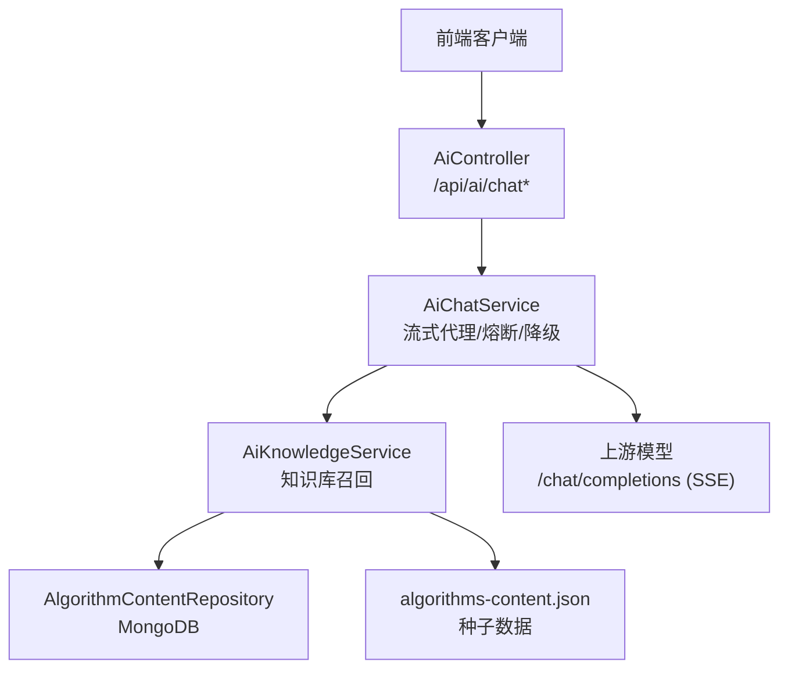
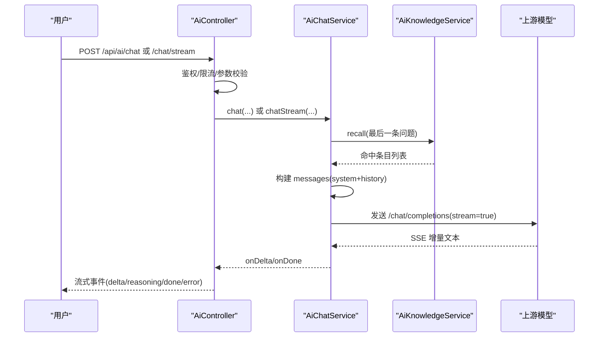
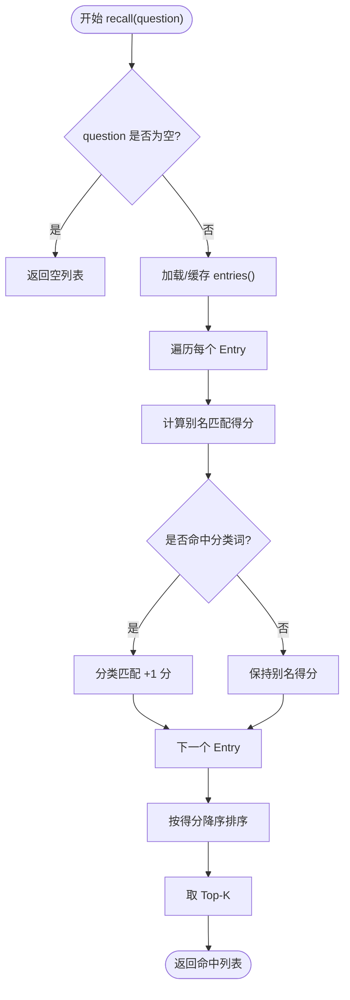
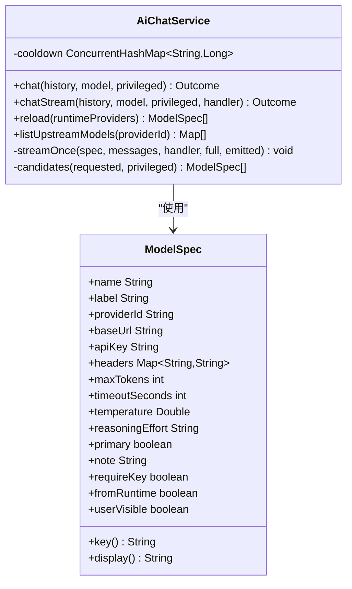
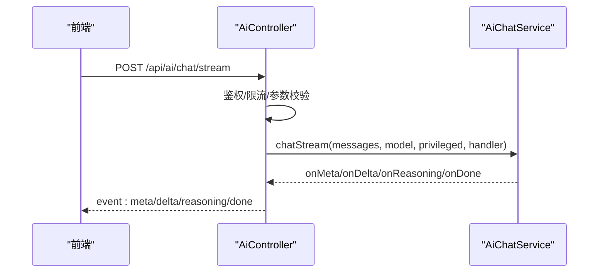
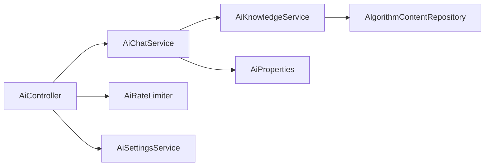

# 知识检索增强(RAG)

<cite>
**本文引用的文件**
- [AiKnowledgeService.java](file://backend/src/main/java/com/suanfa/service/AiKnowledgeService.java)
- [AiChatService.java](file://backend/src/main/java/com/suanfa/service/AiChatService.java)
- [AiController.java](file://backend/src/main/java/com/suanfa/controller/AiController.java)
- [AiProperties.java](file://backend/src/main/java/com/suanfa/config/AiProperties.java)
- [application.yml](file://backend/src/main/resources/application.yml)
- [AlgorithmContent.java](file://backend/src/main/java/com/suanfa/entity/AlgorithmContent.java)
- [AlgorithmContentRepository.java](file://backend/src/main/java/com/suanfa/repository/AlgorithmContentRepository.java)
- [algorithms-content.json](file://backend/src/main/resources/seed/algorithms-content.json)
</cite>

## 目录
1. [简介](#简介)
2. [项目结构](#项目结构)
3. [核心组件](#核心组件)
4. [架构总览](#架构总览)
5. [详细组件分析](#详细组件分析)
6. [依赖关系分析](#依赖关系分析)
7. [性能考量](#性能考量)
8. [故障排查指南](#故障排查指南)
9. [结论](#结论)
10. [附录：配置与扩展](#附录：配置与扩展)

## 简介
本仓库实现了一个面向算法学习平台的“轻量级 RAG”能力：在用户提问时，系统从站内算法知识库中召回相关知识点，将其摘要与结构化信息注入到系统提示词中，再由上游大模型生成回答。该方案不依赖外部向量数据库或在线嵌入服务，而是通过内存缓存 + 关键词别名匹配完成“语义近似”的召回，从而保证低延迟、易部署、可维护。

RAG 的核心流程包括：
- 内容解析：将 MongoDB 中的算法详情文档（或种子 JSON）转换为统一的结构化条目，并构建别名索引。
- 向量化存储：当前实现为“内存缓存 + 别名映射”，未使用向量库；后续可扩展为向量检索。
- 检索策略：基于问题文本与别名集合的包含匹配，结合分类词权重，取 Top-K 作为召回结果。
- 答案生成：将召回结果拼接成上下文片段，注入 system prompt，调用上游 OpenAI 兼容接口流式返回。

## 项目结构
后端采用 Spring Boot 分层组织：
- 控制器层：暴露 /api/ai/* 接口，负责鉴权、限流、SSE 流式转发。
- 服务层：AiKnowledgeService 负责知识库加载与召回；AiChatService 负责上游模型调用、熔断降级、消息组装。
- 配置层：AiProperties 提供多中转站、模型清单、开关等配置；application.yml 定义默认值与环境变量覆盖。
- 数据层：AlgorithmContent 实体与 MongoRepository 对接 MongoDB；同时支持 classpath 种子文件回退。

图表来源
- [AiController.java:49-118](file://backend/src/main/java/com/suanfa/controller/AiController.java#L49-L118)
- [AiChatService.java:574-636](file://backend/src/main/java/com/suanfa/service/AiChatService.java#L574-L636)
- [AiKnowledgeService.java:115-144](file://backend/src/main/java/com/suanfa/service/AiKnowledgeService.java#L115-L144)

章节来源
- [AiController.java:49-118](file://backend/src/main/java/com/suanfa/controller/AiController.java#L49-L118)
- [application.yml:18-49](file://backend/src/main/resources/application.yml#L18-L49)

## 核心组件
- AiKnowledgeService：负责知识库加载、别名构建、召回评分、上下文拼装与引用生成。
- AiChatService：负责上游模型发现、配置合并、流式对话、熔断降级、错误诊断。
- AiController：对外暴露 REST/SSE 接口，处理鉴权、限流、请求校验与响应封装。
- AiProperties：集中管理 AI 助教的多中转站、模型、超时、温度、限流、管理员白名单等配置。
- AlgorithmContent / Repository：算法详情的数据模型与访问接口。
- algorithms-content.json：当 MongoDB 不可用时的种子数据源。

章节来源
- [AiKnowledgeService.java:23-31](file://backend/src/main/java/com/suanfa/service/AiKnowledgeService.java#L23-L31)
- [AiChatService.java:30-47](file://backend/src/main/java/com/suanfa/service/AiChatService.java#L30-L47)
- [AiController.java:34-47](file://backend/src/main/java/com/suanfa/controller/AiController.java#L34-L47)
- [AiProperties.java:11-24](file://backend/src/main/java/com/suanfa/config/AiProperties.java#L11-L24)
- [AlgorithmContent.java:9-33](file://backend/src/main/java/com/suanfa/entity/AlgorithmContent.java#L9-L33)
- [algorithms-content.json:1-50](file://backend/src/main/resources/seed/algorithms-content.json#L1-L50)

## 架构总览
下图展示了从用户提问到答案生成的完整链路，包括知识库召回、上下文注入、上游模型调用与流式返回。

图表来源
- [AiController.java:199-313](file://backend/src/main/java/com/suanfa/controller/AiController.java#L199-L313)
- [AiChatService.java:574-730](file://backend/src/main/java/com/suanfa/service/AiChatService.java#L574-L730)
- [AiKnowledgeService.java:203-229](file://backend/src/main/java/com/suanfa/service/AiKnowledgeService.java#L203-L229)

## 详细组件分析

### 知识库与召回（AiKnowledgeService）
- 数据源优先级：优先从 MongoDB 读取算法详情；若不可用则回退到 classpath 下的种子 JSON。
- 条目转换：将文档转为 Entry，附带名称、分类、难度、复杂度、稳定性、路由、基础说明（截断控制长度），以及一组别名（id、name、缩写、中英同义词）。
- 别名与分类权重：
  - 别名匹配：对问题进行小写化后，遍历每个条目的别名集合，若包含则加分（分数与别名长度相关）。
  - 分类词权重：若问题命中某分类词（如“排序”、“图论”、“动态规划”），且条目属于该分类，则额外加 1 分。
- 召回结果：按分数降序取 Top-K（默认 3），用于构造上下文片段。
- 上下文拼装：将命中条目的简介、复杂度、空间复杂度、稳定性、难度、基础说明等拼成 Markdown 片段，注入 system prompt。
- 引用生成：返回命中条目的 id、name、route，供前端展示“参考站内页面”。

图表来源
- [AiKnowledgeService.java:203-229](file://backend/src/main/java/com/suanfa/service/AiKnowledgeService.java#L203-L229)
- [AiKnowledgeService.java:115-144](file://backend/src/main/java/com/suanfa/service/AiKnowledgeService.java#L115-L144)
- [AiKnowledgeService.java:240-284](file://backend/src/main/java/com/suanfa/service/AiKnowledgeService.java#L240-L284)

章节来源
- [AiKnowledgeService.java:23-31](file://backend/src/main/java/com/suanfa/service/AiKnowledgeService.java#L23-L31)
- [AiKnowledgeService.java:115-144](file://backend/src/main/java/com/suanfa/service/AiKnowledgeService.java#L115-L144)
- [AiKnowledgeService.java:156-199](file://backend/src/main/java/com/suanfa/service/AiKnowledgeService.java#L156-L199)
- [AiKnowledgeService.java:203-284](file://backend/src/main/java/com/suanfa/service/AiKnowledgeService.java#L203-L284)

### 上游模型调用与流式对话（AiChatService）
- 配置合并：支持多中转站（providers）、环境变量 providers-json、旧写法单中转站，运行时可通过页面配置热更新。
- 模型选择：支持 primary 标记、userVisible 控制普通用户可见性、fallback 降级链。
- 熔断机制：对失败模型记录冷却时间，避免频繁重试坏上游；已输出部分内容的请求不再切换模型，防止混排。
- 流式处理：以 SSE 方式接收上游增量，透传 delta/reasoning/done 事件；超时、非 200 状态码会解析错误并抛出可诊断异常。
- 知识增强：在构建 messages 前，先调用 knowledge.recall 获取最近问题的命中条目，并将 contextBlock 注入 system prompt。

图表来源
- [AiChatService.java:156-176](file://backend/src/main/java/com/suanfa/service/AiChatService.java#L156-L176)
- [AiChatService.java:574-730](file://backend/src/main/java/com/suanfa/service/AiChatService.java#L574-L730)

章节来源
- [AiChatService.java:30-47](file://backend/src/main/java/com/suanfa/service/AiChatService.java#L30-L47)
- [AiChatService.java:117-129](file://backend/src/main/java/com/suanfa/service/AiChatService.java#L117-L129)
- [AiChatService.java:180-262](file://backend/src/main/java/com/suanfa/service/AiChatService.java#L180-L262)
- [AiChatService.java:574-730](file://backend/src/main/java/com/suanfa/service/AiChatService.java#L574-L730)

### 控制器与接口（AiController）
- 接口清单：
  - GET /api/ai/status：返回可用性与模型清单（按身份裁剪）。
  - GET /api/ai/models：仅模型清单。
  - GET /api/ai/upstream-models：管理员可调，拉取各中转站真实模型。
  - POST /api/ai/chat：一次性返回。
  - POST /api/ai/chat/stream：SSE 流式返回。
- 安全与限流：登录校验、模型权限校验、每分钟请求次数限制。
- SSE 处理：线程池隔离流式任务，取消/超时/错误时静默收尾，避免误触发熔断。

图表来源
- [AiController.java:83-140](file://backend/src/main/java/com/suanfa/controller/AiController.java#L83-L140)
- [AiController.java:199-313](file://backend/src/main/java/com/suanfa/controller/AiController.java#L199-L313)
- [AiChatService.java:497-516](file://backend/src/main/java/com/suanfa/service/AiChatService.java#L497-L516)

章节来源
- [AiController.java:34-47](file://backend/src/main/java/com/suanfa/controller/AiController.java#L34-L47)
- [AiController.java:199-313](file://backend/src/main/java/com/suanfa/controller/AiController.java#L199-L313)

### 数据模型与存储（AlgorithmContent / Repository / 种子数据）
- 数据模型：AlgorithmContent 表示一个算法的详情文档，包含名称、分类、难度、描述、复杂度、路由、复杂度细节、章节（basic/advanced/defaultNotes）、视频、标签等。
- 存储访问：通过 MongoRepository 查询全部文档；若不可用则回退到 seed 文件。
- 种子数据：algorithms-content.json 提供离线可用的算法详情，便于无 MongoDB 环境运行。

章节来源
- [AlgorithmContent.java:9-33](file://backend/src/main/java/com/suanfa/entity/AlgorithmContent.java#L9-L33)
- [AlgorithmContentRepository.java:1-8](file://backend/src/main/java/com/suanfa/repository/AlgorithmContentRepository.java#L1-L8)
- [algorithms-content.json:1-50](file://backend/src/main/resources/seed/algorithms-content.json#L1-L50)

## 依赖关系分析
- 控制器依赖服务：AiController 依赖 AiChatService、AiRateLimiter、AiProperties、AiSettingsService。
- 服务依赖配置与知识库：AiChatService 依赖 AiProperties 与 AiKnowledgeService。
- 知识库依赖数据层：AiKnowledgeService 依赖 AlgorithmContentRepository 与 ObjectMapper。
- 配置驱动行为：application.yml 与 AiProperties 共同决定上游地址、模型、限流、知识增强开关等。

图表来源
- [AiController.java:57-76](file://backend/src/main/java/com/suanfa/controller/AiController.java#L57-L76)
- [AiChatService.java:80-105](file://backend/src/main/java/com/suanfa/service/AiChatService.java#L80-L105)
- [AiKnowledgeService.java:93-101](file://backend/src/main/java/com/suanfa/service/AiKnowledgeService.java#L93-L101)

章节来源
- [AiController.java:57-76](file://backend/src/main/java/com/suanfa/controller/AiController.java#L57-L76)
- [AiChatService.java:80-105](file://backend/src/main/java/com/suanfa/service/AiChatService.java#L80-L105)
- [AiKnowledgeService.java:93-101](file://backend/src/main/java/com/suanfa/service/AiKnowledgeService.java#L93-L101)

## 性能考量
- 知识库加载与缓存：entries() 使用 volatile 缓存，首次加载后常驻内存；单次问答无需重复 IO。
- 召回复杂度：O(N*M)，N 为条目数，M 为别名数量；当前规模下开销极低。
- 上下文长度控制：basic 字段截断至固定长度，避免 prompt 过大影响响应时间与成本。
- 流式传输：SSE 逐段推送，降低首字节延迟；线程池隔离长连接，避免阻塞主线程。
- 熔断与降级：失败模型进入冷却期，自动切换到备用模型，提升可用性。
- 建议优化：
  - 引入向量检索：将条目内容向量化并存储于向量库，替换当前关键词匹配，提高召回质量。
  - 异步预热：启动时预加载并预热知识库，减少首次请求延迟。
  - 批量召回：对相似问题做短期缓存，避免重复计算。
  - 监控指标：统计命中率、Top-K 分布、上游成功率、平均时延与 token 消耗。

[本节为通用性能讨论，不直接分析具体代码行]

## 故障排查指南
- 常见问题定位：
  - 未配置上游：status 接口返回 configured=false，需设置 base-url/api-key 或 providers。
  - 模型不可用：检查 provider 的 baseUrl 与 apiKey，必要时调用 upstream-models 核对真实模型名。
  - 限流触发：每分钟请求过多会返回 429，适当降低频率或调整 rate-per-minute。
  - 熔断生效：查看模型冷却剩余秒数，等待恢复或更换模型。
- 日志与诊断：
  - 上游错误：AiChatService 会解析不同上游的错误体，返回更具体的 message。
  - 客户端断开：特殊异常类型，不计入熔断，避免误伤健康模型。
  - SSE 发送失败：忽略客户端断开导致的异常，确保资源释放。

章节来源
- [AiController.java:323-348](file://backend/src/main/java/com/suanfa/controller/AiController.java#L323-L348)
- [AiChatService.java:518-546](file://backend/src/main/java/com/suanfa/service/AiChatService.java#L518-L546)
- [AiChatService.java:699-730](file://backend/src/main/java/com/suanfa/service/AiChatService.java#L699-L730)

## 结论
本系统的 RAG 实现以“轻量、可靠、易维护”为目标，通过内存缓存与别名匹配完成知识召回，并结合上游模型的流式能力提供即时回答。其优势在于无需外部向量服务即可快速上线，并通过熔断与降级保障可用性。未来可在不改变现有接口的前提下，逐步引入向量检索与更精细的评分策略，进一步提升召回质量与回答准确性。

[本节为总结性内容，不直接分析具体代码行]

## 附录：配置与扩展

### 配置参数说明
- 基础开关与全局参数：
  - suanfa.ai.base-url：上游 base URL。
  - suanfa.ai.api-key：上游 API Key。
  - suanfa.ai.model：主模型名。
  - suanfa.ai.fallback-models：备用模型串，支持 name@maxTokens@timeoutSeconds@reasoningEffort。
  - suanfa.ai.timeout-seconds：超时秒数。
  - suanfa.ai.max-tokens：最大 token 数。
  - suanfa.ai.temperature：采样温度。
  - suanfa.ai.knowledge-enabled：是否启用知识增强。
  - suanfa.ai.rate-per-minute：每分钟请求上限。
  - suanfa.ai.admin-usernames：管理员白名单用户名。
- 多中转站配置（providers/providers-json）：
  - 每个 provider 可独立设置 baseUrl、apiKey、headers、requireKey、超时、预算、温度。
  - 每个 provider 下可配置多个模型，支持 label、primary、userVisible、reasoningEffort、note 等。
- 环境变量覆盖：
  - 支持通过环境变量覆盖上述所有配置项，便于容器化部署。

章节来源
- [application.yml:18-92](file://backend/src/main/resources/application.yml#L18-L92)
- [AiProperties.java:29-57](file://backend/src/main/java/com/suanfa/config/AiProperties.java#L29-L57)
- [AiProperties.java:58-163](file://backend/src/main/java/com/suanfa/config/AiProperties.java#L58-L163)
- [AiProperties.java:165-267](file://backend/src/main/java/com/suanfa/config/AiProperties.java#L165-L267)

### 扩展开发指南
- 扩展别名与分类词：
  - 在 EXTRA_ALIASES 中添加新算法的中英别名与缩写。
  - 在 CATEGORY_WORDS 中补充分类词映射，提升分类召回精度。
- 改进召回策略：
  - 引入向量检索：将 sections.basic 与 description 向量化，存储于向量库；召回阶段改为向量相似度匹配。
  - 多路召回融合：结合关键词匹配与向量相似度，加权融合后取 Top-K。
  - 相关性评分：增加术语权重、距离惩罚、类别偏好等因子。
- 优化上下文注入：
  - 动态截断：根据模型 max_tokens 与历史消息长度动态调整 basic 截取长度。
  - 去重与压缩：合并重复信息，保留关键段落。
- 监控与可观测性：
  - 埋点统计：命中率、Top-K 分布、上游成功率、时延、token 消耗。
  - 告警规则：上游连续失败、熔断比例过高、限流触发频繁。

章节来源
- [AiKnowledgeService.java:41-91](file://backend/src/main/java/com/suanfa/service/AiKnowledgeService.java#L41-L91)
- [AiKnowledgeService.java:203-229](file://backend/src/main/java/com/suanfa/service/AiKnowledgeService.java#L203-L229)
- [AiChatService.java:574-730](file://backend/src/main/java/com/suanfa/service/AiChatService.java#L574-L730)