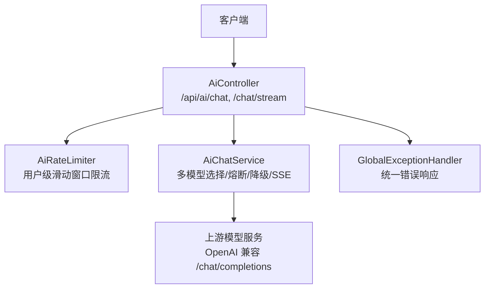
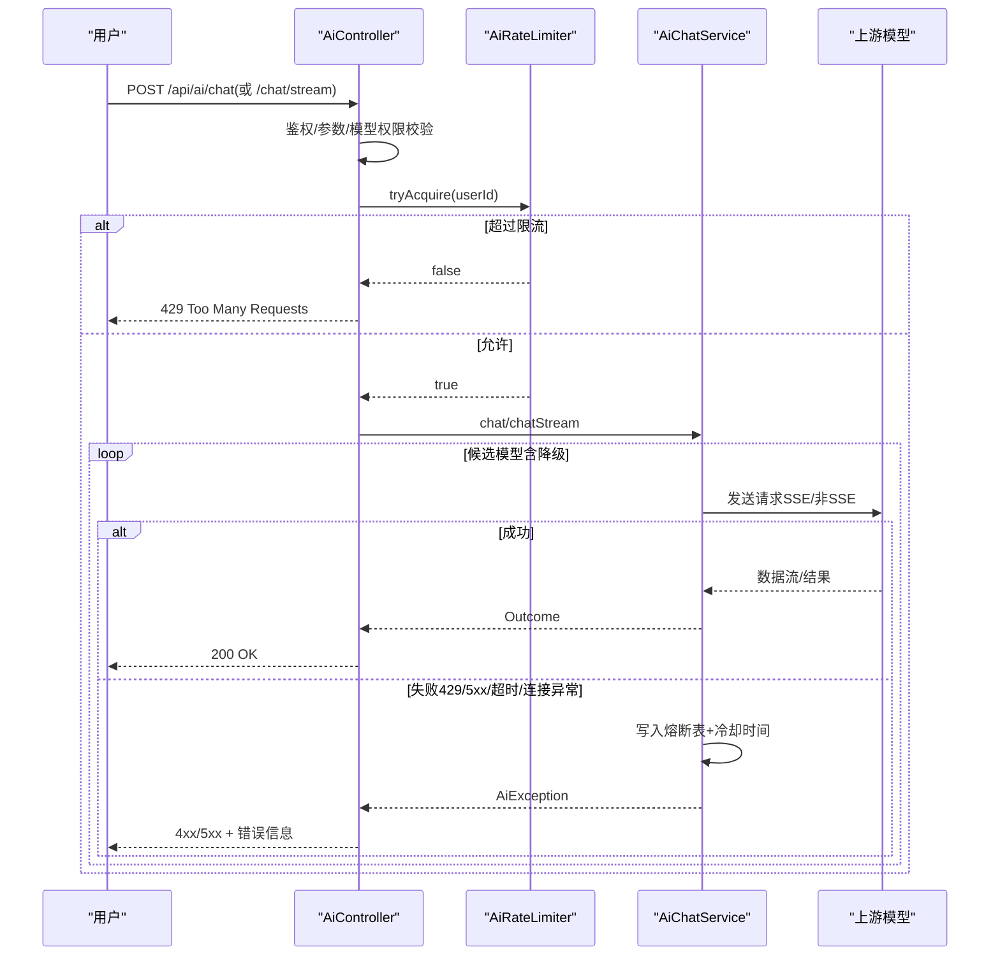
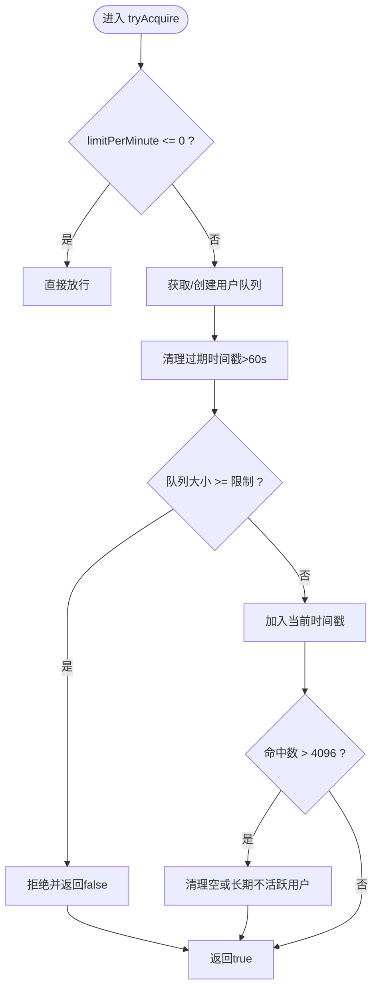
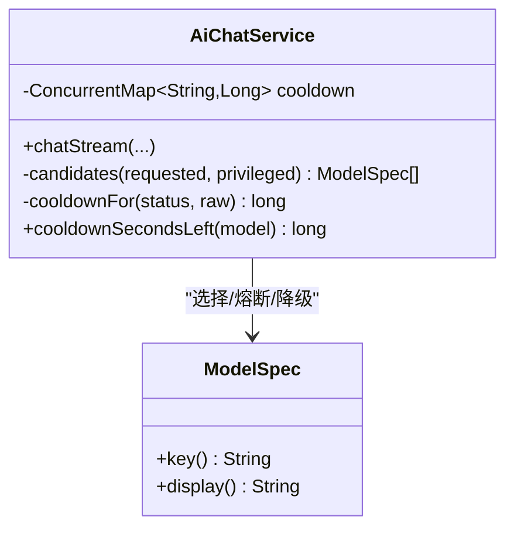
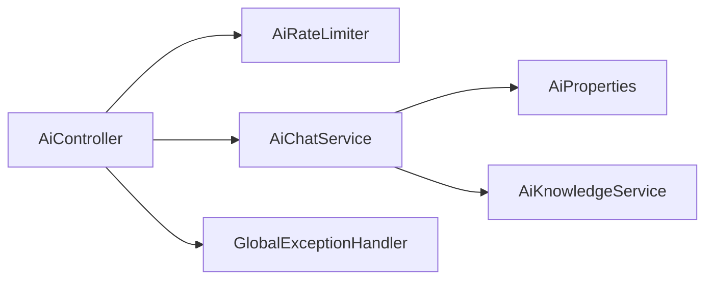

# 限流熔断机制

<cite>
**本文引用的文件**
- [AiRateLimiter.java](file://backend/src/main/java/com/suanfa/service/AiRateLimiter.java)
- [AiController.java](file://backend/src/main/java/com/suanfa/controller/AiController.java)
- [AiChatService.java](file://backend/src/main/java/com/suanfa/service/AiChatService.java)
- [GlobalExceptionHandler.java](file://backend/src/main/java/com/suanfa/config/GlobalExceptionHandler.java)
- [AiProperties.java](file://backend/src/main/java/com/suanfa/config/AiProperties.java)
- [application.yml](file://backend/src/main/resources/application.yml)
</cite>

## 目录
1. [简介](#简介)
2. [项目结构](#项目结构)
3. [核心组件](#核心组件)
4. [架构总览](#架构总览)
5. [详细组件分析](#详细组件分析)
6. [依赖关系分析](#依赖关系分析)
7. [性能与容量特性](#性能与容量特性)
8. [监控指标与可观测性](#监控指标与可观测性)
9. [配置参数说明](#配置参数说明)
10. [故障排查指南](#故障排查指南)
11. [结论](#结论)

## 简介
本文件面向 AI 助教服务的稳定性保障，系统化说明“API 调用频率控制（限流）”和“熔断器模式（自动降级与恢复）”的实现与策略。内容覆盖：
- 基于时间窗口的用户级限流算法
- 模型级熔断状态管理与冷却时间动态调整
- 不同错误类型的差异化处理（429 限流、5xx 服务异常、网络超时等）
- 自动降级到备用模型与 SSE 流式场景的退额策略
- 监控指标、关键配置项与排障建议

## 项目结构
后端采用 Spring Boot 分层结构：
- 控制器层：暴露 /api/ai/* 接口，统一鉴权、校验、限流入口
- 服务层：封装上游模型调用、SSE 流式转发、多中转站选择、熔断与降级
- 配置层：集中管理 AI 上游、限流阈值、管理员白名单等
- 全局异常：统一错误响应格式，避免吞掉业务状态码



**图表来源**
- [AiController.java:49-76](file://backend/src/main/java/com/suanfa/controller/AiController.java#L49-L76)
- [AiRateLimiter.java:15-25](file://backend/src/main/java/com/suanfa/service/AiRateLimiter.java#L15-L25)
- [AiChatService.java:48-105](file://backend/src/main/java/com/suanfa/service/AiChatService.java#L48-L105)
- [GlobalExceptionHandler.java:21-24](file://backend/src/main/java/com/suanfa/config/GlobalExceptionHandler.java#L21-L24)

**章节来源**
- [AiController.java:49-76](file://backend/src/main/java/com/suanfa/controller/AiController.java#L49-L76)
- [AiRateLimiter.java:15-25](file://backend/src/main/java/com/suanfa/service/AiRateLimiter.java#L15-L25)
- [AiChatService.java:48-105](file://backend/src/main/java/com/suanfa/service/AiChatService.java#L48-L105)
- [GlobalExceptionHandler.java:21-24](file://backend/src/main/java/com/suanfa/config/GlobalExceptionHandler.java#L21-L24)

## 核心组件
- AiRateLimiter：按用户 ID 的滑动窗口限流，支持退额，防止脚本刷接口与多标签连点
- AiChatService：多中转站模型发现、请求编排、SSE 流式转发、熔断表与冷却时间、自动降级
- AiController：请求入口，统一鉴权、参数校验、限流拦截、SSE 线程池隔离
- GlobalExceptionHandler：统一错误响应，保留 4xx/5xx 语义，便于前端降级
- AiProperties 与 application.yml：限流阈值、超时、模型清单、管理员白名单等配置

**章节来源**
- [AiRateLimiter.java:15-78](file://backend/src/main/java/com/suanfa/service/AiRateLimiter.java#L15-L78)
- [AiChatService.java:48-1166](file://backend/src/main/java/com/suanfa/service/AiChatService.java#L48-L1166)
- [AiController.java:49-375](file://backend/src/main/java/com/suanfa/controller/AiController.java#L49-L375)
- [GlobalExceptionHandler.java:21-69](file://backend/src/main/java/com/suanfa/config/GlobalExceptionHandler.java#L21-L69)
- [AiProperties.java:25-365](file://backend/src/main/java/com/suanfa/config/AiProperties.java#L25-L365)
- [application.yml:18-58](file://backend/src/main/resources/application.yml#L18-L58)

## 架构总览
整体流程：
- 客户端发起对话请求（一次性或 SSE 流式）
- 控制器进行登录校验、参数校验、模型权限校验
- 通过用户级限流器判断是否允许进入
- 服务层根据当前模型与熔断表选择候选模型，依次尝试上游
- 失败时写入熔断表并设置冷却时间；成功则清除熔断标记
- 流式场景下，若已输出部分文本后中断，不再切换模型，避免内容混排
- 全局异常处理器将错误以统一 JSON 返回，保持 HTTP 状态码语义



**图表来源**
- [AiController.java:199-348](file://backend/src/main/java/com/suanfa/controller/AiController.java#L199-L348)
- [AiRateLimiter.java:27-53](file://backend/src/main/java/com/suanfa/service/AiRateLimiter.java#L27-L53)
- [AiChatService.java:574-668](file://backend/src/main/java/com/suanfa/service/AiChatService.java#L574-L668)

## 详细组件分析

### 用户级限流：滑动窗口与退额
- 实现要点
  - 每个用户维护一个双端队列记录最近一次分钟内的请求时间戳
  - 窗口固定为 60 秒，超出限制直接拒绝
  - 当请求未产生有效结果（上游全挂/参数错误/并发满），调用退额方法移除本次计数，避免错误请求消耗额度
  - 长期不活跃的用户窗口会被回收，防止内存无界增长



**图表来源**
- [AiRateLimiter.java:27-53](file://backend/src/main/java/com/suanfa/service/AiRateLimiter.java#L27-L53)

**章节来源**
- [AiRateLimiter.java:27-78](file://backend/src/main/java/com/suanfa/service/AiRateLimiter.java#L27-L78)

### 熔断器模式：状态管理与冷却时间
- 熔断表
  - 使用并发 Map 存储每个模型的“恢复时间”（纳秒级）
  - key 为 provider/name，避免同名模型在不同中转站冲突
- 冷却时间动态调整
  - 429/额度用尽/限流关键词：冷却 300 秒
  - 鉴权失败/模型不存在/不支持：冷却 900 秒
  - 连接失败/上游不可用：冷却 60 秒
  - 其他 5xx：冷却 60 秒
  - 默认：冷却 30 秒
- 候选模型选择
  - 优先用户指定模型；其余跳过处于熔断中的模型
  - 全部熔断时退化到最快恢复的模型，保证可用性



**图表来源**
- [AiChatService.java:90-92](file://backend/src/main/java/com/suanfa/service/AiChatService.java#L90-L92)
- [AiChatService.java:638-668](file://backend/src/main/java/com/suanfa/service/AiChatService.java#L638-L668)
- [AiChatService.java:1044-1063](file://backend/src/main/java/com/suanfa/service/AiChatService.java#L1044-L1063)

**章节来源**
- [AiChatService.java:90-92](file://backend/src/main/java/com/suanfa/service/AiChatService.java#L90-L92)
- [AiChatService.java:638-668](file://backend/src/main/java/com/suanfa/service/AiChatService.java#L638-L668)
- [AiChatService.java:1044-1063](file://backend/src/main/java/com/suanfa/service/AiChatService.java#L1044-L1063)

### 自动降级逻辑与 SSE 流式处理
- 降级顺序
  - 用户指定模型优先；否则按可用且未熔断的顺序尝试
  - 所有模型熔断时，选择最早恢复的模型继续尝试
- SSE 流式特殊处理
  - 如果已经向用户输出了增量文本（onDelta），发生错误不再切换模型，避免内容混排
  - 客户端断开（停止回答/刷新页面）视为“本次调用作废”，不计入熔断，也不退额
  - 流式线程池小且直连队列，超并发直接 503，避免排队放大延迟

```mermaid
sequenceDiagram
participant C as "AiController"
participant S as "AiChatService"
participant M as "上游模型"
C->>S : chatStream(messages, model, handler)
loop 候选模型
S->>M : 发送SSE请求
alt 成功
M-->>S : delta* -> done
S-->>C : 完成
else 失败
S->>S : 写入熔断表+冷却时间
opt 已输出过增量
S-->>C : 错误不切换模型
else 未输出
S-->>C : 错误切换到下一个模型
end
end
end
```

**图表来源**
- [AiController.java:224-313](file://backend/src/main/java/com/suanfa/controller/AiController.java#L224-L313)
- [AiChatService.java:574-636](file://backend/src/main/java/com/suanfa/service/AiChatService.java#L574-L636)

**章节来源**
- [AiController.java:224-313](file://backend/src/main/java/com/suanfa/controller/AiController.java#L224-L313)
- [AiChatService.java:574-636](file://backend/src/main/java/com/suanfa/service/AiChatService.java#L574-L636)

### 错误类型处理策略
- 429 限流/额度用尽
  - 上游返回 429 或包含 rate/limit/quota 等关键词，触发较长冷却（300s）
  - 控制器返回 429 并提示每分钟上限
- 5xx 服务器错误/连接异常/超时
  - 连接被拒/DNS解析失败/HTTP超时等网络异常，触发中等冷却（60s）
  - 控制器返回 5xx 或 4xx 并附带可读错误信息
- 鉴权/模型不存在
  - 401/403/404 或 Invalid token/not found 等，触发长冷却（900s）
  - 控制器返回对应状态码与提示信息
- 客户端断开
  - 不记熔断、不退额、不切换模型，静默结束

**章节来源**
- [AiChatService.java:987-1063](file://backend/src/main/java/com/suanfa/service/AiChatService.java#L987-L1063)
- [AiController.java:199-348](file://backend/src/main/java/com/suanfa/controller/AiController.java#L199-L348)
- [GlobalExceptionHandler.java:26-58](file://backend/src/main/java/com/suanfa/config/GlobalExceptionHandler.java#L26-L58)

## 依赖关系分析
- 控制器依赖限流器与服务层，负责入口校验与状态码控制
- 服务层依赖配置与知识库，负责上游调用、熔断与降级
- 配置类提供运行时可调的参数，YAML 与环境变量共同生效
- 全局异常处理器确保错误语义不被吞没



**图表来源**
- [AiController.java:57-76](file://backend/src/main/java/com/suanfa/controller/AiController.java#L57-L76)
- [AiChatService.java:80-105](file://backend/src/main/java/com/suanfa/service/AiChatService.java#L80-L105)
- [AiProperties.java:25-57](file://backend/src/main/java/com/suanfa/config/AiProperties.java#L25-L57)
- [GlobalExceptionHandler.java:21-24](file://backend/src/main/java/com/suanfa/config/GlobalExceptionHandler.java#L21-L24)

**章节来源**
- [AiController.java:57-76](file://backend/src/main/java/com/suanfa/controller/AiController.java#L57-L76)
- [AiChatService.java:80-105](file://backend/src/main/java/com/suanfa/service/AiChatService.java#L80-L105)
- [AiProperties.java:25-57](file://backend/src/main/java/com/suanfa/config/AiProperties.java#L25-L57)
- [GlobalExceptionHandler.java:21-24](file://backend/src/main/java/com/suanfa/config/GlobalExceptionHandler.java#L21-L24)

## 性能与容量特性
- 限流粒度：按用户维度，避免单用户滥用影响他人
- 窗口长度：60 秒，适合短时突发流量保护
- 内存占用：用户队列与映射有回收策略，避免长期增长
- 流式线程池：小线程数+直连队列，快速失败，避免线程堆积导致雪崩
- 熔断冷却：按错误类型分级，减少无效重试，提升整体吞吐

[本节为通用性能讨论，不直接分析具体文件]

## 监控指标与可观测性
建议采集以下指标用于运行期观察与告警：
- 限流相关
  - 每分钟请求量（按用户分桶）
  - 限流拒绝次数（429）
  - 平均/峰值 QPS
- 熔断相关
  - 各模型熔断次数与冷却时长分布
  - 候选模型选择命中率（用户指定 vs 自动降级）
  - 冷却中模型数量
- 上游调用
  - 上游 HTTP 状态码分布（200/4xx/5xx）
  - 上游响应时间 P50/P95/P99
  - 连接失败/超时次数
- 流式对话
  - SSE 事件发送成功率
  - 客户端断开次数
  - 流式线程池拒绝次数

[本节为通用监控建议，不直接分析具体文件]

## 配置参数说明
- 限流阈值
  - suanfa.ai.rate-per-minute：每用户每分钟最大请求数（<=0 关闭）
- 超时与预算
  - suanfa.ai.timeout-seconds：全局超时秒数
  - suanfa.ai.max-tokens：全局最大 token 数
  - suanfa.ai.temperature：温度参数
- 多中转站与模型
  - suanfa.ai.providers-json：JSON 数组形式定义多个中转站与模型
  - 模型级 max-tokens、timeout-seconds、reasoning-effort、user-visible、primary 等
- 管理员白名单
  - suanfa.ai.admin-usernames：允许在页面修改中转站配置的用户名列表

**章节来源**
- [application.yml:18-58](file://backend/src/main/resources/application.yml#L18-L58)
- [AiProperties.java:25-57](file://backend/src/main/java/com/suanfa/config/AiProperties.java#L25-L57)
- [AiProperties.java:58-163](file://backend/src/main/java/com/suanfa/config/AiProperties.java#L58-L163)
- [AiProperties.java:165-267](file://backend/src/main/java/com/suanfa/config/AiProperties.java#L165-L267)

## 故障排查指南
- 常见问题定位
  - 429 频繁出现：检查 suanfa.ai.rate-per-minute 是否过小；确认是否存在脚本或自动化高频调用
  - 模型持续熔断：查看上游返回的错误类型（429/5xx/连接失败），调整冷却时间与上游配置
  - SSE 流式卡顿：检查流式线程池是否被拒绝；确认 Nginx 缓冲是否关闭（X-Accel-Buffering）
  - 鉴权失败：核对 API Key 与模型权限；确认 requireKey 与 headers 配置正确
- 日志与诊断
  - 全局异常处理器会记录方法不支持、接口不存在、参数解析失败等警告
  - 服务层对上游错误进行可读化翻译，便于快速定位问题
  - 可通过 /api/ai/upstream-models 拉取真实模型清单，辅助配置校对

**章节来源**
- [GlobalExceptionHandler.java:31-58](file://backend/src/main/java/com/suanfa/config/GlobalExceptionHandler.java#L31-L58)
- [AiChatService.java:987-1102](file://backend/src/main/java/com/suanfa/service/AiChatService.java#L987-L1102)
- [AiController.java:120-140](file://backend/src/main/java/com/suanfa/controller/AiController.java#L120-L140)

## 结论
该 AI 系统通过“用户级滑动窗口限流 + 模型级熔断与冷却 + 自动降级”的组合策略，有效应对上游限流、额度用尽、网络异常与高并发场景。配合统一的错误响应与可观测性指标，能够在生产环境中保障 AI 助教的稳定性与可靠性。建议在生产环境结合监控告警与压测，持续优化限流阈值与冷却策略，确保用户体验与资源利用率的最佳平衡。