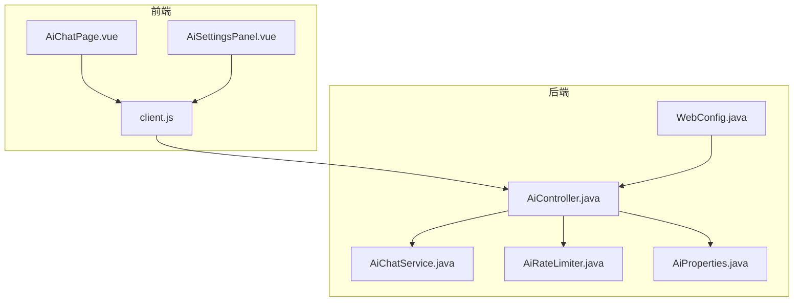
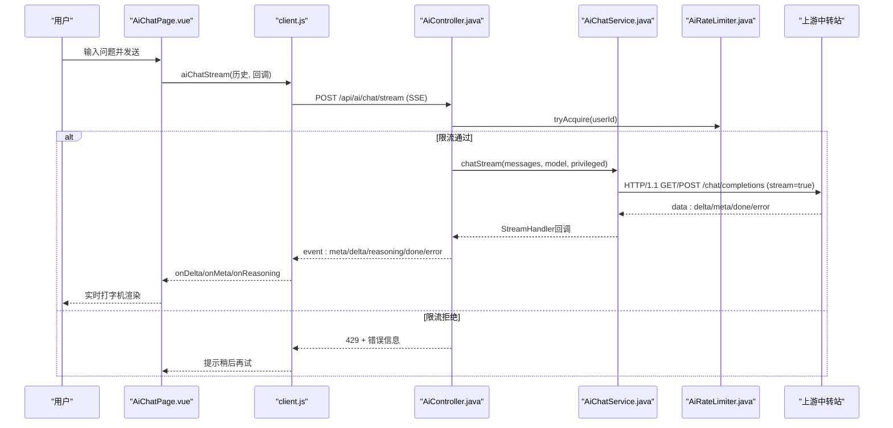
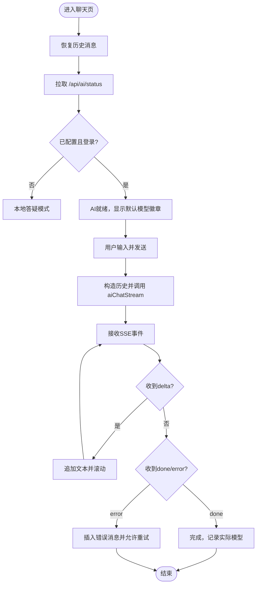
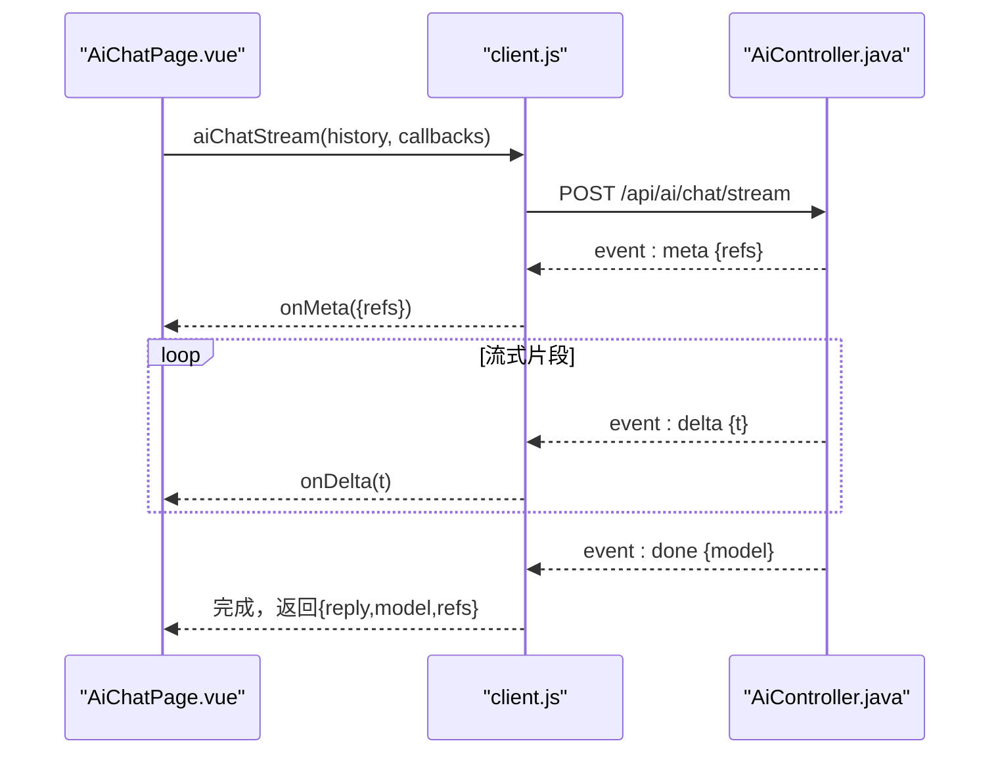
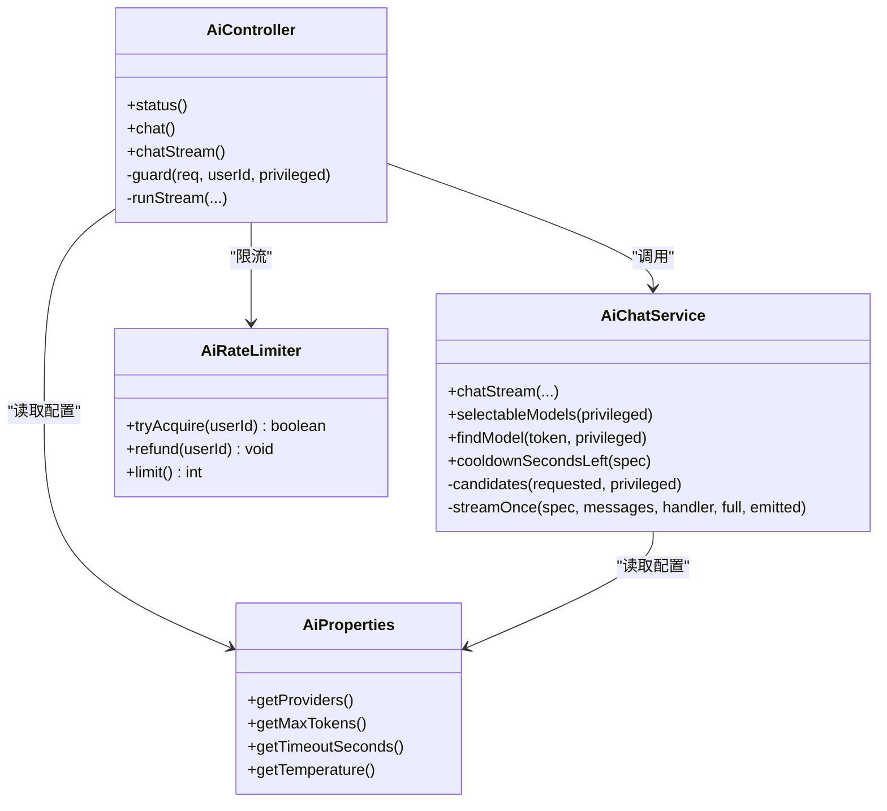
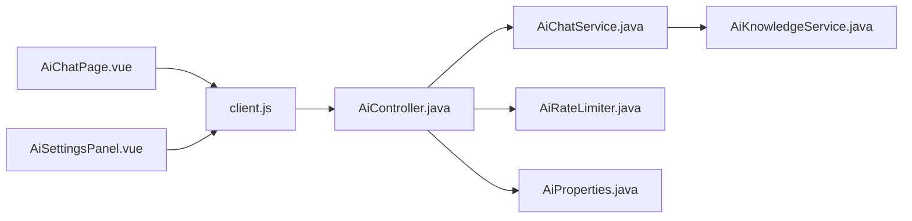

# AI聊天组件

<cite>
**本文引用的文件**
- [AiChatPage.vue](file://suanfa_vue/src/components/common/AiChatPage.vue)
- [client.js](file://suanfa_vue/src/api/client.js)
- [AiController.java](file://backend/src/main/java/com/suanfa/controller/AiController.java)
- [AiChatService.java](file://backend/src/main/java/com/suanfa/service/AiChatService.java)
- [AiRateLimiter.java](file://backend/src/main/java/com/suanfa/service/AiRateLimiter.java)
- [AiProperties.java](file://backend/src/main/java/com/suanfa/config/AiProperties.java)
- [WebConfig.java](file://backend/src/main/java/com/suanfa/config/WebConfig.java)
- [ChatRequest.java](file://backend/src/main/java/com/suanfa/dto/ChatRequest.java)
- [ChatResponse.java](file://backend/src/main/java/com/suanfa/dto/ChatResponse.java)
- [AiSettingsPanel.vue](file://suanfa_vue/src/components/common/AiSettingsPanel.vue)
</cite>

## 目录
1. [简介](#简介)
2. [项目结构](#项目结构)
3. [核心组件](#核心组件)
4. [架构总览](#架构总览)
5. [详细组件分析](#详细组件分析)
6. [依赖关系分析](#依赖关系分析)
7. [性能与内存优化](#性能与内存优化)
8. [故障排查指南](#故障排查指南)
9. [结论](#结论)
10. [附录：集成与扩展](#附录集成与扩展)

## 简介
本组件提供“AI算法助教”的对话能力，包含前端聊天界面、模型选择与降级、流式响应渲染、本地答疑兜底；后端提供SSE流式接口、限流、熔断、多中转站配置与热加载。默认不暴露模型下拉，由服务端下发当前默认模型并自动降级；未登录或未配置时自动降级为站内资料检索的本地答疑模式。

## 项目结构
- 前端（Vue）
  - 聊天页：AiChatPage.vue（消息渲染、输入处理、历史记录、流式接收）
  - API客户端：client.js（SSE解析、错误降级、本地答疑）
  - 设置面板：AiSettingsPanel.vue（管理员配置中转站、测试连接、热生效）
- 后端（Spring Boot）
  - 控制器：AiController.java（/api/ai/status、/chat、/chat/stream）
  - 服务：AiChatService.java（上游代理、熔断、知识增强、模型发现）
  - 限流：AiRateLimiter.java（滑动窗口按用户限流）
  - 配置：AiProperties.java（单/多中转站、全局参数）
  - Web配置：WebConfig.java（CORS、用户ID解析）

**图表来源**
- [AiChatPage.vue:1-723](file://suanfa_vue/src/components/common/AiChatPage.vue#L1-L723)
- [client.js:350-570](file://suanfa_vue/src/api/client.js#L350-L570)
- [AiController.java:83-375](file://backend/src/main/java/com/suanfa/controller/AiController.java#L83-L375)
- [AiChatService.java:48-800](file://backend/src/main/java/com/suanfa/service/AiChatService.java#L48-L800)
- [AiRateLimiter.java:1-78](file://backend/src/main/java/com/suanfa/service/AiRateLimiter.java#L1-L78)
- [AiProperties.java:1-365](file://backend/src/main/java/com/suanfa/config/AiProperties.java#L1-L365)
- [WebConfig.java:13-46](file://backend/src/main/java/com/suanfa/config/WebConfig.java#L13-L46)

**章节来源**
- [AiChatPage.vue:1-723](file://suanfa_vue/src/components/common/AiChatPage.vue#L1-L723)
- [client.js:350-570](file://suanfa_vue/src/api/client.js#L350-L570)
- [AiController.java:83-375](file://backend/src/main/java/com/suanfa/controller/AiController.java#L83-L375)

## 核心组件
- 聊天界面（AiChatPage.vue）
  - 消息列表、Markdown渲染、站内引用链接、错误重试、停止回答、清空历史
  - 历史记录持久化到localStorage（按用户隔离，保留最近若干条）
  - 模式徽章显示当前模式（AI/本地答疑/默认模型），悬停展示预算/熔断信息
- 流式客户端（client.js）
  - SSE事件解析器，支持meta/delta/reasoning/done/error
  - 自动降级：401/503/404等走本地答疑；旧版后端回退一次性接口
  - 限制历史轮数，避免超长上下文
- 后端控制器（AiController.java）
  - /api/ai/status：返回是否可用、默认模型、模型清单、限流配额、可管理权限
  - /api/ai/chat：一次性返回
  - /api/ai/chat/stream：SSE流式返回，线程池控制并发
- 服务层（AiChatService.java）
  - 多中转站配置合并、模型发现、熔断冷却、知识增强注入、上游SSE解析
- 限流（AiRateLimiter.java）
  - 按用户滑动窗口限流，失败可退款额度
- 配置（AiProperties.java）
  - 单/多中转站、全局max_tokens/timeout/temperature、管理员白名单、速率限制
- Web配置（WebConfig.java）
  - CORS策略、用户ID解析注入

**章节来源**
- [AiChatPage.vue:1-723](file://suanfa_vue/src/components/common/AiChatPage.vue#L1-L723)
- [client.js:350-570](file://suanfa_vue/src/api/client.js#L350-L570)
- [AiController.java:83-375](file://backend/src/main/java/com/suanfa/controller/AiController.java#L83-L375)
- [AiChatService.java:48-800](file://backend/src/main/java/com/suanfa/service/AiChatService.java#L48-L800)
- [AiRateLimiter.java:1-78](file://backend/src/main/java/com/suanfa/service/AiRateLimiter.java#L1-L78)
- [AiProperties.java:1-365](file://backend/src/main/java/com/suanfa/config/AiProperties.java#L1-L365)
- [WebConfig.java:13-46](file://backend/src/main/java/com/suanfa/config/WebConfig.java#L13-L46)

## 架构总览
系统采用前后端分离，前端通过SSE获取增量文本，后端以OpenAI兼容协议转发至多个上游中转站，具备熔断与降级能力。管理员可通过页面配置中转站并热生效。

**图表来源**
- [client.js:469-552](file://suanfa_vue/src/api/client.js#L469-L552)
- [AiController.java:224-313](file://backend/src/main/java/com/suanfa/controller/AiController.java#L224-L313)
- [AiChatService.java:574-730](file://backend/src/main/java/com/suanfa/service/AiChatService.java#L574-L730)
- [AiRateLimiter.java:27-53](file://backend/src/main/java/com/suanfa/service/AiRateLimiter.java#L27-L53)

## 详细组件分析

### 聊天界面（AiChatPage.vue）
- UI设计
  - 顶部标题与模式徽章（AI/本地答疑/默认模型），支持登录解锁、中转站配置入口、清空对话
  - 欢迎区含快捷提问按钮
  - 消息气泡区分用户/AI，AI消息支持Markdown、站内参考链接、错误重试、降级提示
  - 输入框支持Enter发送、Shift+Enter换行，输入法组合期间Enter不上屏
- 消息渲染
  - 使用MarkdownBlock渲染AI回复
  - 站内链接通过SPA路由跳转，避免整页刷新丢失会话
- 输入处理
  - 发送前过滤空内容，防止重复发送
  - 构建历史消息（仅携带role/content），限制最大轮次
- 历史记录管理
  - 基于localStorage按用户隔离存储，仅保留非错误消息且截断最近若干条
  - 监听路由变化与登录状态变化，恢复历史并刷新模型清单
- 流式交互
  - 使用AbortController支持“停止回答”
  - 接收onDelta增量文本，滚动到底部；onMeta更新站内引用；onReasoning显示思考中提示
  - 错误时插入错误消息并提供重试

**图表来源**
- [AiChatPage.vue:126-189](file://suanfa_vue/src/components/common/AiChatPage.vue#L126-L189)
- [client.js:469-552](file://suanfa_vue/src/api/client.js#L469-L552)

**章节来源**
- [AiChatPage.vue:1-723](file://suanfa_vue/src/components/common/AiChatPage.vue#L1-L723)

### 流式响应与SSE处理（client.js）
- SSE解析器
  - 按空行分割事件块，识别event/data字段，支持跨chunk安全拼接
  - 事件类型：meta（引用）、delta（增量文本）、reasoning（思考信号）、done（完成）、error（错误）
- 降级策略
  - 后端不可达或无stream路由时，回退到一次性接口或本地答疑
  - 401/503/404等状态码直接降级本地答疑，保持可用性
- 数据格式
  - 请求体：{ messages: [{role,content}], model?: string }
  - SSE事件数据：meta={refs}, delta={t}, done={model}, error={message}

**图表来源**
- [client.js:426-552](file://suanfa_vue/src/api/client.js#L426-L552)
- [AiController.java:224-313](file://backend/src/main/java/com/suanfa/controller/AiController.java#L224-L313)

**章节来源**
- [client.js:350-570](file://suanfa_vue/src/api/client.js#L350-L570)

### 后端流式处理与熔断（AiController.java + AiChatService.java）
- 控制器职责
  - 校验登录、配置、参数、模型权限、限流
  - 将SSE事件封装为统一事件名（meta/delta/reasoning/done/error）
  - 线程池限制并发，队列满直接返回503
- 服务层职责
  - 多中转站配置合并（页面配置 > providers-json > yml/providers > 旧写法）
  - 模型候选顺序：用户指定优先，跳过熔断中的模型，全部熔断时退化最快恢复者
  - 上游SSE解析：兼容data:行与非SSE JSON，聚合完整回复
  - 熔断表：provider/name -> 恢复时间，避免频繁撞坏上游
  - 知识增强：注入站内算法清单与召回摘录，生成站内引用

**图表来源**
- [AiController.java:83-375](file://backend/src/main/java/com/suanfa/controller/AiController.java#L83-L375)
- [AiChatService.java:48-800](file://backend/src/main/java/com/suanfa/service/AiChatService.java#L48-L800)
- [AiRateLimiter.java:1-78](file://backend/src/main/java/com/suanfa/service/AiRateLimiter.java#L1-L78)
- [AiProperties.java:1-365](file://backend/src/main/java/com/suanfa/config/AiProperties.java#L1-L365)

**章节来源**
- [AiController.java:83-375](file://backend/src/main/java/com/suanfa/controller/AiController.java#L83-L375)
- [AiChatService.java:48-800](file://backend/src/main/java/com/suanfa/service/AiChatService.java#L48-L800)

### 模型选择与降级机制
- 前端不暴露模型下拉，仅展示当前默认模型（来自/status的defaultModel）
- 后端按优先级选择模型：primary置顶，其余按配置顺序；普通用户仅可见开放模型
- 降级链：用户指定模型优先，否则按候选顺序；若某模型处于熔断期则跳过；全部熔断时退化到最快恢复者
- 降级提示：当实际服务模型不同于默认模型时，消息中标注本次由哪个模型回答

**章节来源**
- [AiChatPage.vue:41-65](file://suanfa_vue/src/components/common/AiChatPage.vue#L41-L65)
- [AiController.java:144-180](file://backend/src/main/java/com/suanfa/controller/AiController.java#L144-L180)
- [AiChatService.java:574-668](file://backend/src/main/java/com/suanfa/service/AiChatService.java#L574-L668)

### 限流与错误重试
- 限流：按用户滑动窗口（每分钟N次），超过返回429；失败可退款额度（上游全挂/参数错误/并发满）
- 错误重试：前端在错误消息旁提供“重试”按钮，删除错误消息并重新发送
- 熔断：上游失败（限流/欠费/超时/网络异常）写入冷却表，短时间内跳过该模型

**章节来源**
- [AiRateLimiter.java:27-78](file://backend/src/main/java/com/suanfa/service/AiRateLimiter.java#L27-L78)
- [AiChatService.java:595-636](file://backend/src/main/java/com/suanfa/service/AiChatService.java#L595-L636)
- [AiChatPage.vue:206-209](file://suanfa_vue/src/components/common/AiChatPage.vue#L206-L209)

### 本地答疑兜底
- 触发条件：后端不可达、未登录、未配置、stream路由不可用
- 实现：基于站内算法清单进行关键词匹配，生成对比或摘要回复，附带详情页链接
- 体验：保持功能可用，明确提示当前为本地答疑模式

**章节来源**
- [client.js:664-722](file://suanfa_vue/src/api/client.js#L664-L722)
- [AiChatPage.vue:52-65](file://suanfa_vue/src/components/common/AiChatPage.vue#L52-L65)

## 依赖关系分析
- 前端依赖
  - AiChatPage.vue依赖client.js的SSE客户端与本地答疑逻辑
  - AiSettingsPanel.vue依赖client.js的设置API（保存/重置/测试连接）
- 后端依赖
  - AiController依赖AiChatService、AiRateLimiter、AiProperties
  - AiChatService依赖AiKnowledgeService（知识增强）、HttpClient（上游通信）
  - WebConfig提供CORS与用户ID解析

**图表来源**
- [AiChatPage.vue:1-723](file://suanfa_vue/src/components/common/AiChatPage.vue#L1-L723)
- [client.js:350-570](file://suanfa_vue/src/api/client.js#L350-L570)
- [AiController.java:83-375](file://backend/src/main/java/com/suanfa/controller/AiController.java#L83-L375)

**章节来源**
- [AiChatPage.vue:1-723](file://suanfa_vue/src/components/common/AiChatPage.vue#L1-L723)
- [client.js:350-570](file://suanfa_vue/src/api/client.js#L350-L570)
- [AiController.java:83-375](file://backend/src/main/java/com/suanfa/controller/AiController.java#L83-L375)

## 性能与内存优化
- 前端
  - 限制历史轮数（最多24轮），减少请求体大小
  - 仅保留最近若干条消息到localStorage，避免存储膨胀
  - 流式增量渲染，避免大段文本一次性插入导致的重排开销
- 后端
  - SSE线程池小且队列直连，满则快速失败（503），防止线程堆积
  - 熔断冷却避免频繁探测坏上游
  - 上游HTTP/1.1，兼容部分不支持h2c的中转站
  - 滑动窗口限流定期清理长期不活跃用户，防止Map无限增长

**章节来源**
- [client.js:467-470](file://suanfa_vue/src/api/client.js#L467-L470)
- [AiChatPage.vue:76-86](file://suanfa_vue/src/components/common/AiChatPage.vue#L76-L86)
- [AiController.java:61-81](file://backend/src/main/java/com/suanfa/controller/AiController.java#L61-L81)
- [AiChatService.java:100-104](file://backend/src/main/java/com/suanfa/service/AiChatService.java#L100-L104)
- [AiRateLimiter.java:44-52](file://backend/src/main/java/com/suanfa/service/AiRateLimiter.java#L44-L52)

## 故障排查指南
- 常见问题
  - 未登录：返回401，前端降级本地答疑并提示登录
  - 未配置：返回503，前端降级本地答疑
  - 限流：返回429，提示每分钟次数上限
  - 上游不可用：熔断冷却，自动切换到备用模型
- 排查步骤
  - 查看/api/ai/status确认configured、defaultModel、ratePerMinute
  - 使用AiSettingsPanel测试连接，查看discoveredModels与steps详情
  - 检查浏览器控制台SSE事件流，确认meta/delta/done/error
  - 后端日志关注熔断与降级信息

**章节来源**
- [AiController.java:323-348](file://backend/src/main/java/com/suanfa/controller/AiController.java#L323-L348)
- [AiSettingsPanel.vue:195-242](file://suanfa_vue/src/components/common/AiSettingsPanel.vue#L195-L242)
- [client.js:488-509](file://suanfa_vue/src/api/client.js#L488-L509)

## 结论
该AI聊天组件实现了健壮的流式对话体验，具备多中转站配置、自动降级、熔断限流、本地答疑兜底等能力。前端注重用户体验（打字机效果、站内引用、错误重试），后端注重稳定性（线程池、熔断、限流）。管理员可通过页面配置热生效，无需重启服务。

## 附录：集成与扩展
- 集成步骤
  - 配置环境变量或yml：suanfa.ai.*（baseUrl、apiKey、providers等）
  - 启动后端，访问/api/ai/status验证配置
  - 前端路由挂载AiChatPage.vue，确保/api代理正确
- 自定义样式
  - 通过CSS变量（如--surface、--text-1等）覆盖主题
  - 调整聊天气泡、输入框、按钮样式类
- 扩展开发
  - 新增中转站：在AiSettingsPanel添加provider与models，保存后热生效
  - 自定义限流：修改AiRateLimiter的窗口大小与阈值
  - 知识增强：扩展AiKnowledgeService的召回逻辑与引用格式

**章节来源**
- [AiProperties.java:29-57](file://backend/src/main/java/com/suanfa/config/AiProperties.java#L29-L57)
- [AiSettingsPanel.vue:244-319](file://suanfa_vue/src/components/common/AiSettingsPanel.vue#L244-L319)
- [WebConfig.java:33-44](file://backend/src/main/java/com/suanfa/config/WebConfig.java#L33-L44)