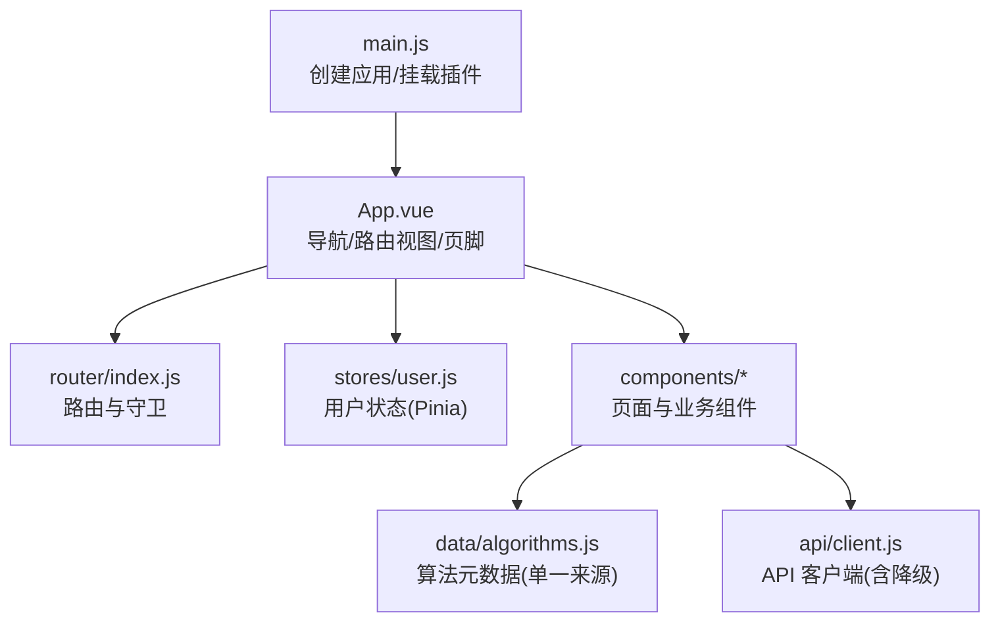
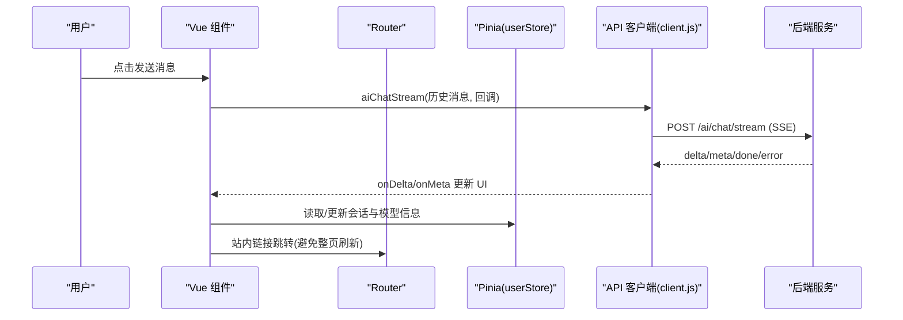
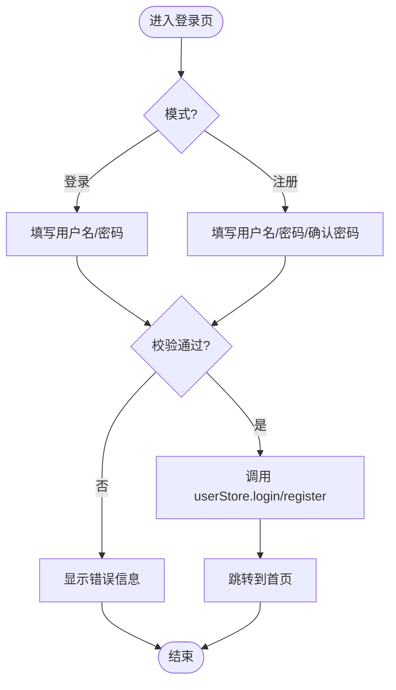
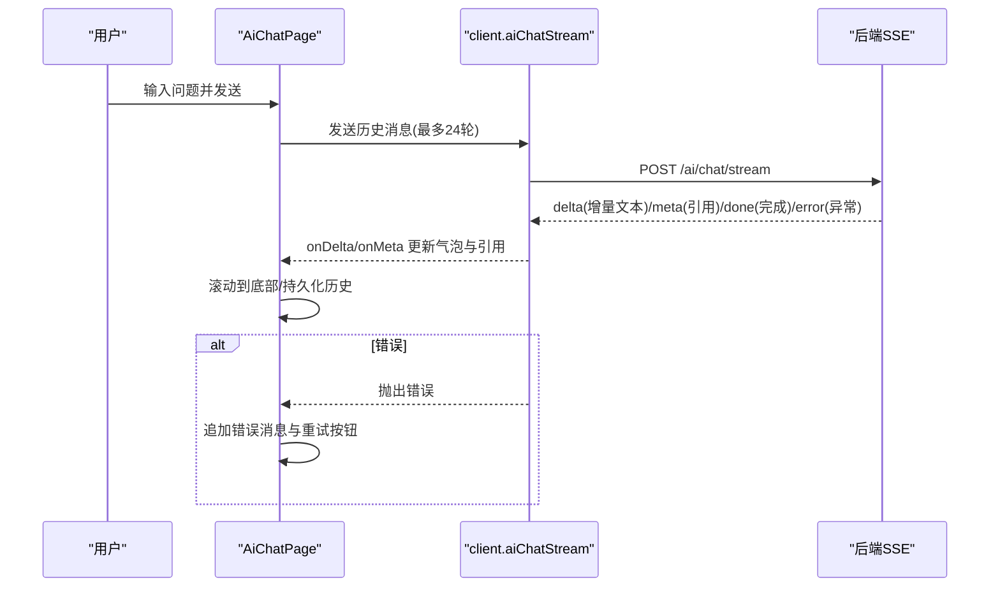
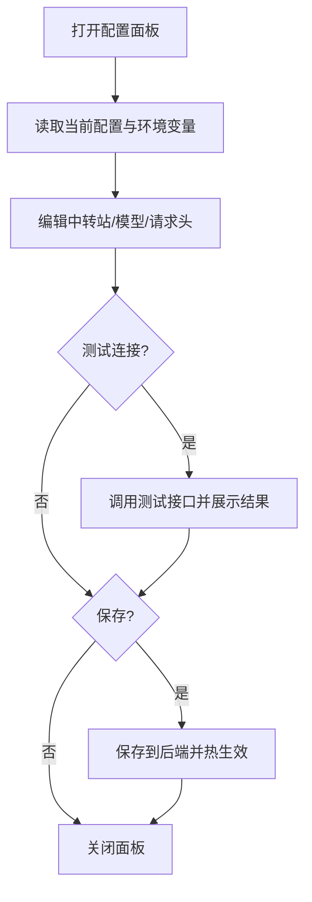
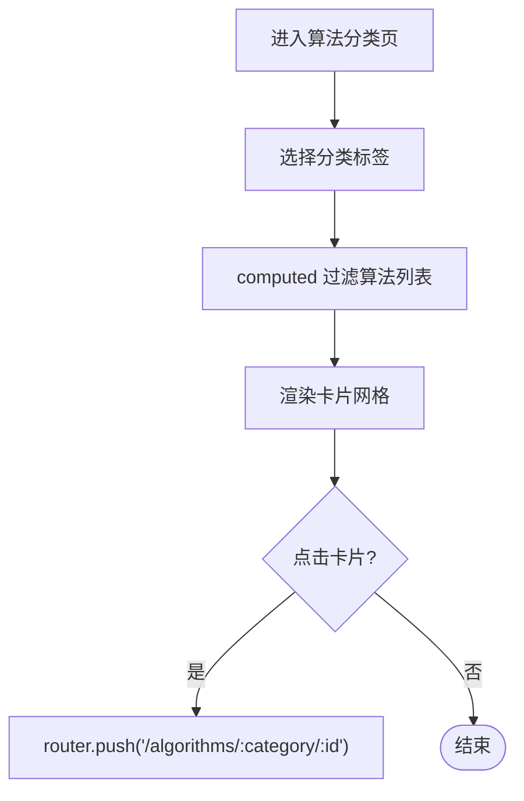
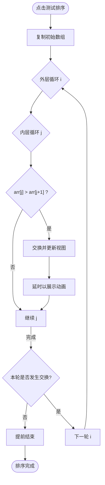
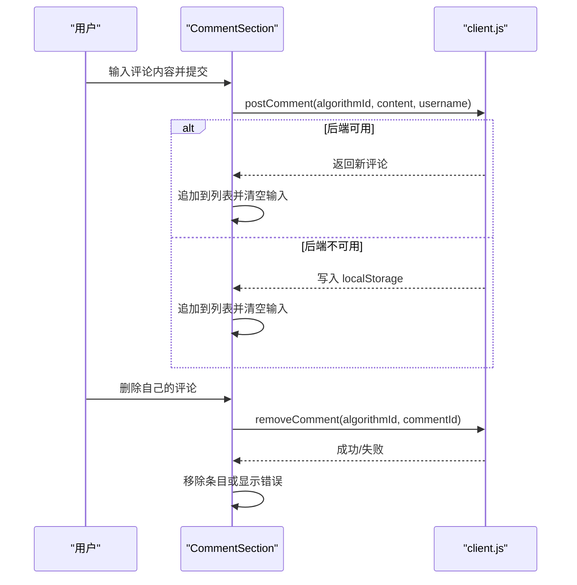
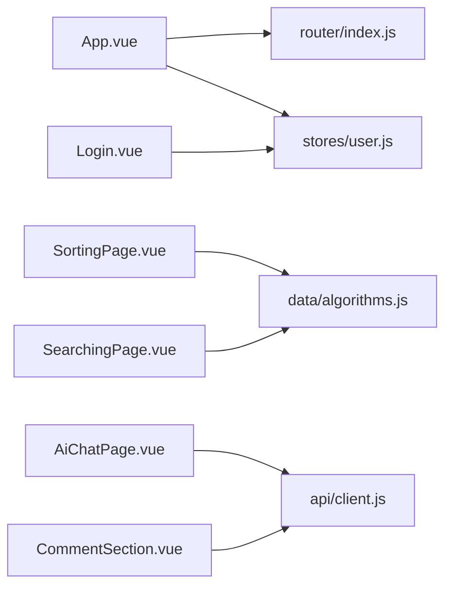

# 前端组件文档

<cite>
**本文引用的文件**
- [main.js](file://suanfa_vue/src/main.js)
- [App.vue](file://suanfa_vue/src/App.vue)
- [index.js](file://suanfa_vue/src/router/index.js)
- [package.json](file://suanfa_vue/package.json)
- [user.js](file://suanfa_vue/src/stores/user.js)
- [client.js](file://suanfa_vue/src/api/client.js)
- [algorithms.js](file://suanfa_vue/src/data/algorithms.js)
- [Login.vue](file://suanfa_vue/src/components/common/Login.vue)
- [AiChatPage.vue](file://suanfa_vue/src/components/common/AiChatPage.vue)
- [AiSettingsPanel.vue](file://suanfa_vue/src/components/common/AiSettingsPanel.vue)
- [SortingPage.vue](file://suanfa_vue/src/components/algorithms/sorting_algorithms/SortingPage.vue)
- [SearchingPage.vue](file://suanfa_vue/src/components/algorithms/searching_algorithms/SearchingPage.vue)
- [SimpleBubbleSort.vue](file://suanfa_vue/src/components/algorithms/sorting_algorithms/SimpleBubbleSort.vue)
- [CommentSection.vue](file://suanfa_vue/src/components/common/CommentSection.vue)
</cite>

## 目录
1. [简介](#简介)
2. [项目结构](#项目结构)
3. [核心组件](#核心组件)
4. [架构总览](#架构总览)
5. [详细组件分析](#详细组件分析)
6. [依赖关系分析](#依赖关系分析)
7. [性能考虑](#性能考虑)
8. [故障排查指南](#故障排查指南)
9. [结论](#结论)
10. [附录](#附录)

## 简介
本文件面向前端开发者，系统化梳理并说明该 Vue 3 项目的组件设计与实现。内容覆盖：
- 算法可视化组件（排序、搜索、图算法、动态规划演示）
- 用户界面组件（登录注册、主页导航、设置面板、评论系统）
- AI 聊天组件（对话界面、模型选择与降级、流式响应处理）
并对每个组件的 Props、事件、插槽、样式定制进行说明；给出使用示例与最佳实践；解释组件通信、状态管理、路由配置；以及响应式设计、可访问性、性能优化策略，帮助复用与扩展。

## 项目结构
- 入口与全局初始化：应用通过 main.js 创建 Vue 实例，挂载 Pinia 和 Router，并引入主题与基础样式。
- 根布局：App.vue 提供顶部导航、算法分类下拉菜单、页脚与主内容区，集成路由视图与用户状态。
- 路由：router/index.js 定义页面级路由与守卫，支持懒加载与权限控制。
- 数据源：data/algorithms.js 作为算法元数据的单一来源，派生各分类列表与详情页所需信息。
- API 客户端：api/client.js 封装后端请求与本地降级逻辑，统一认证、进度、笔记、评论、训练、AI 能力等接口。
- 状态管理：stores/user.js 使用 Pinia 管理登录态与用户信息。
- 组件组织：components 下按功能域划分（common、algorithms），算法类进一步按类别分目录。

图表来源
- [main.js:1-12](file://suanfa_vue/src/main.js#L1-L12)
- [App.vue:1-120](file://suanfa_vue/src/App.vue#L1-L120)
- [index.js:1-124](file://suanfa_vue/src/router/index.js#L1-L124)

章节来源
- [main.js:1-12](file://suanfa_vue/src/main.js#L1-L12)
- [package.json:1-23](file://suanfa_vue/package.json#L1-L23)

## 核心组件
- 登录注册组件（Login.vue）：支持登录/注册模式切换、表单校验、错误提示、加载态；调用 userStore 完成认证并跳转首页。
- AI 聊天组件（AiChatPage.vue）：SSE 流式输出、本地答疑降级、站内引用、模型徽章与熔断提示、快捷提问、历史持久化。
- AI 中转站配置面板（AiSettingsPanel.vue）：管理员专用，多中转站/模型配置、测试连接、保存热生效、环境变量展示与回退。
- 排序/搜索算法页面（SortingPage.vue / SearchingPage.vue）：分类筛选、卡片网格、统一跳转详情页、进度标记。
- 简单冒泡排序演示（SimpleBubbleSort.vue）：数组条可视化、逐步交换动画、控制台日志辅助理解。
- 评论区（CommentSection.vue）：登录后发表/删除、离线回退 localStorage、错误提示、时间排序。

章节来源
- [Login.vue:1-178](file://suanfa_vue/src/components/common/Login.vue#L1-L178)
- [AiChatPage.vue:1-723](file://suanfa_vue/src/components/common/AiChatPage.vue#L1-L723)
- [AiSettingsPanel.vue:1-800](file://suanfa_vue/src/components/common/AiSettingsPanel.vue#L1-L800)
- [SortingPage.vue:1-97](file://suanfa_vue/src/components/algorithms/sorting_algorithms/SortingPage.vue#L1-L97)
- [SearchingPage.vue:1-89](file://suanfa_vue/src/components/algorithms/searching_algorithms/SearchingPage.vue#L1-L89)
- [SimpleBubbleSort.vue:1-91](file://suanfa_vue/src/components/algorithms/sorting_algorithms/SimpleBubbleSort.vue#L1-L91)
- [CommentSection.vue:1-281](file://suanfa_vue/src/components/common/CommentSection.vue#L1-L281)

## 架构总览
整体采用“组件 + 路由 + Pinia + API 客户端”的分层架构：
- 表现层：Vue 单文件组件负责 UI 与交互。
- 路由层：vue-router 管理页面与权限。
- 状态层：Pinia 管理跨页面状态（如登录态）。
- 数据层：api/client.js 统一网络请求与本地降级；data/algorithms.js 提供静态元数据。

图表来源
- [AiChatPage.vue:126-189](file://suanfa_vue/src/components/common/AiChatPage.vue#L126-L189)
- [client.js:469-552](file://suanfa_vue/src/api/client.js#L469-L552)
- [index.js:109-120](file://suanfa_vue/src/router/index.js#L109-L120)

## 详细组件分析

### 登录/注册组件（Login.vue）
- 功能要点
  - 双模式切换：登录/注册共用表单，动态显示确认密码字段。
  - 表单校验：用户名非空、密码长度限制、两次密码一致。
  - 状态与交互：loading 禁用提交、错误信息展示、成功后跳转首页。
  - 状态管理：通过 useUserStore 调用 login/register/logout。
- Props/Events/Slots
  - 无外部 Props；内部通过 router.push 导航。
  - 无自定义事件暴露；无插槽。
- 样式定制
  - 使用 CSS 变量与 scoped 样式，便于主题替换。
- 使用示例
  - 在路由中直接渲染，无需额外配置。
- 最佳实践
  - 将敏感输入与自动填充属性配合使用，提升可用性。
  - 错误信息应明确且可操作。

图表来源
- [Login.vue:16-44](file://suanfa_vue/src/components/common/Login.vue#L16-L44)
- [user.js:24-33](file://suanfa_vue/src/stores/user.js#L24-L33)

章节来源
- [Login.vue:1-178](file://suanfa_vue/src/components/common/Login.vue#L1-L178)
- [user.js:1-36](file://suanfa_vue/src/stores/user.js#L1-L36)

### AI 聊天组件（AiChatPage.vue）
- 功能要点
  - SSE 流式响应：增量文本实时渲染，支持停止、重试、错误提示。
  - 模型与降级：默认模型由后端下发；不可用时自动降级到下一个可用模型或本地答疑。
  - 站内引用：回答附带 refs，点击跳转至算法详情页。
  - 历史持久化：最近 30 条消息缓存到 localStorage。
  - 快捷提问：内置常见问题一键发送。
- Props/Events/Slots
  - 无外部 Props；通过组合式函数与 store 协作。
  - 无自定义事件暴露；无插槽。
- 样式定制
  - 使用 CSS 变量与 scoped 样式，支持深色主题与响应式布局。
- 使用示例
  - 路由 /ai 直接渲染；可通过 query.ask 预填问题。
- 最佳实践
  - 长会话仅携带最近若干轮消息，降低带宽与延迟。
  - 对 AbortError 做友好提示，避免阻塞。

图表来源
- [AiChatPage.vue:126-189](file://suanfa_vue/src/components/common/AiChatPage.vue#L126-L189)
- [client.js:469-552](file://suanfa_vue/src/api/client.js#L469-L552)

章节来源
- [AiChatPage.vue:1-723](file://suanfa_vue/src/components/common/AiChatPage.vue#L1-L723)
- [client.js:360-570](file://suanfa_vue/src/api/client.js#L360-L570)

### AI 中转站配置面板（AiSettingsPanel.vue）
- 功能要点
  - 多中转站/模型配置：地址、Token、请求头、max_tokens、超时、reasoningEffort 等。
  - 测试连接：拉取上游模型清单，逐步反馈连通性与延迟。
  - 保存与重置：保存即热生效；支持清空页面配置回退到环境变量。
  - 可见性控制：模型可设置为仅管理员可见，普通用户不出现。
- Props/Events/Slots
  - Props: visible（布尔）控制弹窗显隐。
  - Events: close、saved（用于父组件刷新状态）。
  - 无插槽。
- 样式定制
  - 模态框与表格布局，使用 CSS 变量适配主题。
- 使用示例
  - 在 AiChatPage 中通过按钮打开，保存后触发 refreshStatus。
- 最佳实践
  - 测试连接时允许传未保存草稿，便于快速验证。
  - 对 Token 字段提供掩码与清除语义。

图表来源
- [AiSettingsPanel.vue:105-131](file://suanfa_vue/src/components/common/AiSettingsPanel.vue#L105-L131)
- [AiSettingsPanel.vue:195-242](file://suanfa_vue/src/components/common/AiSettingsPanel.vue#L195-L242)
- [AiSettingsPanel.vue:279-319](file://suanfa_vue/src/components/common/AiSettingsPanel.vue#L279-L319)

章节来源
- [AiSettingsPanel.vue:1-800](file://suanfa_vue/src/components/common/AiSettingsPanel.vue#L1-L800)

### 排序/搜索算法页面（SortingPage.vue / SearchingPage.vue）
- 功能要点
  - 分类标签：全部/比较类/非比较类/稳定/不稳定（排序）；顺序/分治/分块/哈希（搜索）。
  - 卡片网格：展示名称、难度、子分类、复杂度、进度标记。
  - 统一详情：点击跳转至 /algorithms/:category/:id。
- Props/Events/Slots
  - 无外部 Props；内部维护 currentCategory 与 filteredAlgorithms。
  - 无插槽。
- 样式定制
  - 引入公共样式，保持各算法分类页视觉一致。
- 使用示例
  - 路由分别映射到 SortingPage 与 SearchingPage。
- 最佳实践
  - 使用 computed 过滤数据，保证响应式与性能。

图表来源
- [SortingPage.vue:16-42](file://suanfa_vue/src/components/algorithms/sorting_algorithms/SortingPage.vue#L16-L42)
- [SearchingPage.vue:16-42](file://suanfa_vue/src/components/algorithms/searching_algorithms/SearchingPage.vue#L16-L42)
- [index.js:60-100](file://suanfa_vue/src/router/index.js#L60-L100)

章节来源
- [SortingPage.vue:1-97](file://suanfa_vue/src/components/algorithms/sorting_algorithms/SortingPage.vue#L1-L97)
- [SearchingPage.vue:1-89](file://suanfa_vue/src/components/algorithms/searching_algorithms/SearchingPage.vue#L1-L89)
- [index.js:60-100](file://suanfa_vue/src/router/index.js#L60-L100)

### 简单冒泡排序演示（SimpleBubbleSort.vue）
- 功能要点
  - 数组条可视化：高度映射数值大小。
  - 逐步交换动画：每步交换后更新视图并延时，便于观察过程。
  - 控制台日志：打印每轮比较与交换，辅助调试。
- Props/Events/Slots
  - 无外部 Props；无插槽。
  - 无自定义事件。
- 样式定制
  - 使用 flex 布局对齐条状元素，transition 平滑过渡。
- 使用示例
  - 路由 /algorithms/sorting/simple-bubble-sort 可直接访问。
- 最佳实践
  - 大数据量时建议减少动画帧率或增加延时，避免卡顿。

图表来源
- [SimpleBubbleSort.vue:20-53](file://suanfa_vue/src/components/algorithms/sorting_algorithms/SimpleBubbleSort.vue#L20-L53)

章节来源
- [SimpleBubbleSort.vue:1-91](file://suanfa_vue/src/components/algorithms/sorting_algorithms/SimpleBubbleSort.vue#L1-L91)

### 评论区（CommentSection.vue）
- 功能要点
  - 登录后发表/删除自己的评论；未登录提示登录。
  - 离线回退：后端不可用或失败时读写 localStorage。
  - 错误提示：加载/发表/删除失败时显示错误信息。
  - 时间排序：按 createdAt 升序排列。
- Props/Events/Slots
  - Props: algorithmId（字符串，必填）。
  - 无插槽；无自定义事件。
- 样式定制
  - 使用 CSS 变量与边框圆角，适配主题。
- 使用示例
  - 在算法详情页嵌入，传入对应算法 ID。
- 最佳实践
  - 提交前校验内容长度，避免无效请求。
  - 删除前二次确认，防止误删。

图表来源
- [CommentSection.vue:38-62](file://suanfa_vue/src/components/common/CommentSection.vue#L38-L62)
- [client.js:234-266](file://suanfa_vue/src/api/client.js#L234-L266)

章节来源
- [CommentSection.vue:1-281](file://suanfa_vue/src/components/common/CommentSection.vue#L1-L281)
- [client.js:218-266](file://suanfa_vue/src/api/client.js#L218-L266)

## 依赖关系分析
- 组件依赖
  - App.vue 依赖 router、userStore、algorithms 数据源。
  - 算法页面依赖 algorithms 数据与 ProgressMark 组件。
  - AI 聊天依赖 client.js 的流式接口与 MarkdownBlock。
  - 登录/注册依赖 userStore 与 router。
- 路由与守卫
  - 路由守卫在进入需要认证的页面时检查登录态，未登录则重定向到登录页并携带 redirect。
- API 客户端
  - 统一封装 fetch，带后端可用性探测与本地降级；AI 模块支持 SSE 流式解析与错误降级。

图表来源
- [App.vue:1-120](file://suanfa_vue/src/App.vue#L1-L120)
- [index.js:1-124](file://suanfa_vue/src/router/index.js#L1-L124)
- [SortingPage.vue:1-97](file://suanfa_vue/src/components/algorithms/sorting_algorithms/SortingPage.vue#L1-L97)
- [SearchingPage.vue:1-89](file://suanfa_vue/src/components/algorithms/searching_algorithms/SearchingPage.vue#L1-L89)
- [AiChatPage.vue:1-723](file://suanfa_vue/src/components/common/AiChatPage.vue#L1-L723)
- [Login.vue:1-178](file://suanfa_vue/src/components/common/Login.vue#L1-L178)
- [CommentSection.vue:1-281](file://suanfa_vue/src/components/common/CommentSection.vue#L1-L281)
- [client.js:1-725](file://suanfa_vue/src/api/client.js#L1-L725)

章节来源
- [index.js:109-120](file://suanfa_vue/src/router/index.js#L109-L120)
- [client.js:17-28](file://suanfa_vue/src/api/client.js#L17-L28)

## 性能考虑
- 路由懒加载：页面级组件按需导入，减少首屏体积。
- 计算属性与响应式：使用 computed 过滤算法列表，避免重复计算。
- 流式渲染：AI 聊天使用 SSE 增量更新，避免长等待。
- 会话裁剪：AI 请求仅携带最近若干轮消息，降低负载。
- 本地降级：后端不可用时使用 localStorage 与静态数据，保障可用性。
- 动画节流：算法可视化中使用延时控制帧率，避免频繁重排。

[本节为通用指导，不直接分析具体文件]

## 故障排查指南
- 登录/注册失败
  - 检查表单校验与 loading 状态；查看 userStore 的错误捕获与路由跳转。
- AI 聊天无响应
  - 检查后端是否可达；查看 SSE 事件解析与错误分支；必要时切换到本地答疑。
- 配置面板无法保存
  - 确认管理员权限；检查 Token 与 baseUrl；使用测试连接定位上游问题。
- 评论无法发表/删除
  - 检查后端可用性；查看 localStorage 回退是否生效；确认用户身份与权限。

章节来源
- [Login.vue:16-44](file://suanfa_vue/src/components/common/Login.vue#L16-L44)
- [AiChatPage.vue:173-189](file://suanfa_vue/src/components/common/AiChatPage.vue#L173-L189)
- [AiSettingsPanel.vue:279-319](file://suanfa_vue/src/components/common/AiSettingsPanel.vue#L279-L319)
- [CommentSection.vue:38-62](file://suanfa_vue/src/components/common/CommentSection.vue#L38-L62)
- [client.js:469-552](file://suanfa_vue/src/api/client.js#L469-L552)

## 结论
本项目以清晰的组件分层、统一的数据源与 API 客户端、完善的降级策略与流式交互，提供了可扩展的前端组件体系。开发者可基于现有组件快速复用与扩展新的算法可视化、AI 能力与用户功能，同时兼顾性能与可访问性。

[本节为总结，不直接分析具体文件]

## 附录
- 响应式设计
  - 使用 CSS 变量与媒体查询，确保在不同屏幕尺寸下的可读性与易用性。
- 可访问性
  - 导航项使用 aria-expanded 与键盘事件（Esc 关闭下拉），提升无障碍体验。
- 状态管理模式
  - 使用 Pinia 管理跨页面状态（如登录态），结合路由守卫实现权限控制。
- 路由配置
  - 使用 createWebHistory 与懒加载；通过 meta.requiresAuth/public 控制访问权限。
- 组件通信
  - 父子通信通过 Props/Events；跨组件通过 Pinia Store；页面间通过 Router。
- 样式定制
  - 通过 CSS 变量集中管理主题；scoped 样式隔离组件样式。

[本节为通用指导，不直接分析具体文件]