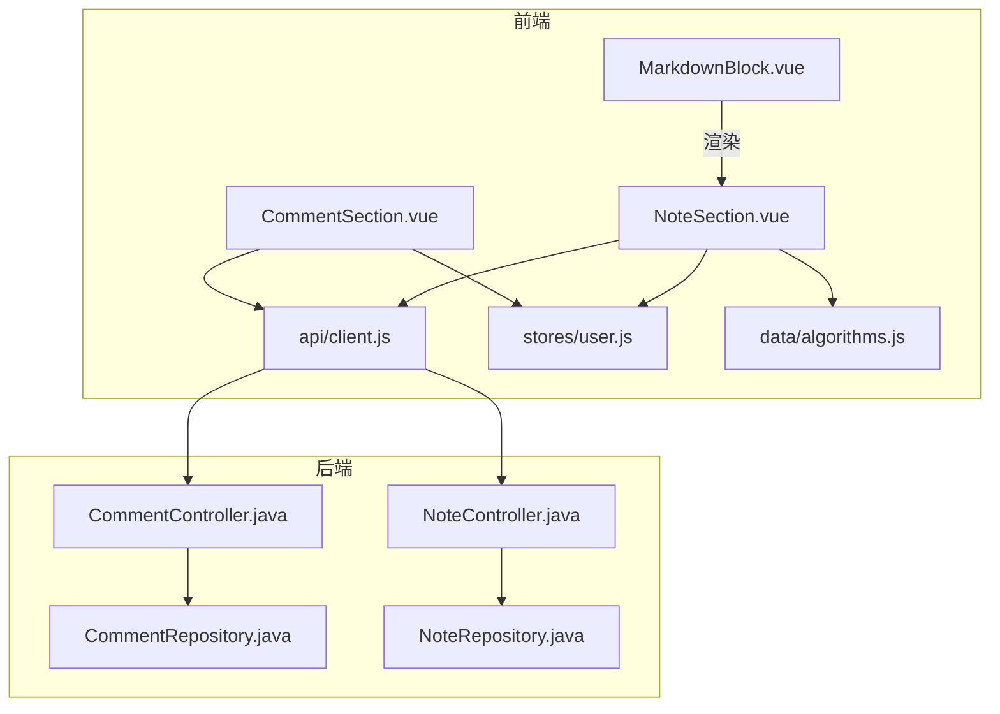
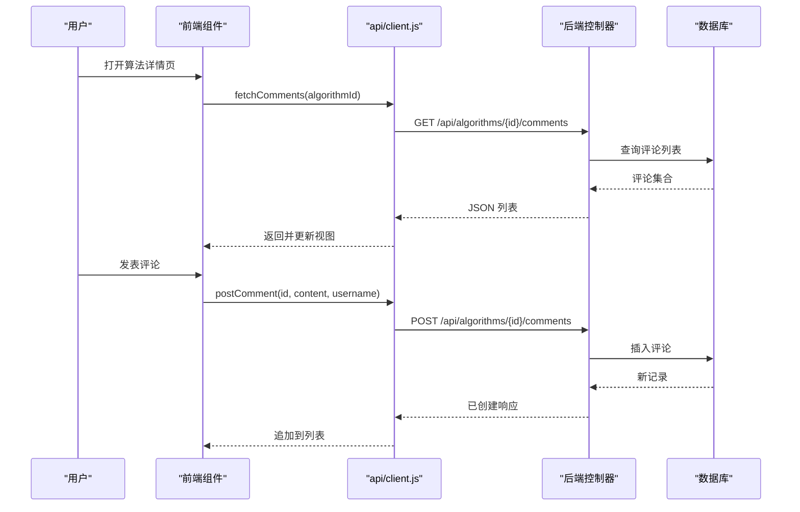
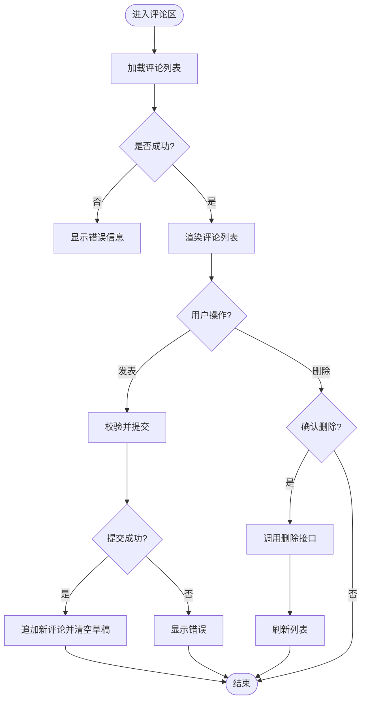
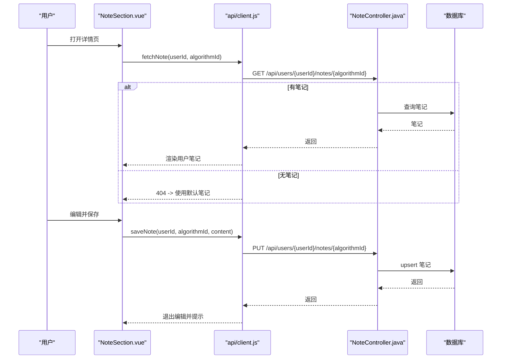
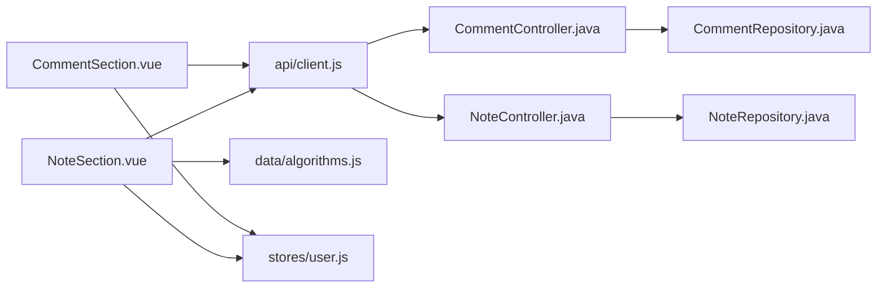

# 交互组件

<cite>
**本文引用的文件**
- [CommentSection.vue](file://suanfa_vue/src/components/common/CommentSection.vue)
- [NoteSection.vue](file://suanfa_vue/src/components/common/NoteSection.vue)
- [MarkdownBlock.vue](file://suanfa_vue/src/components/common/MarkdownBlock.vue)
- [client.js](file://suanfa_vue/src/api/client.js)
- [user.js](file://suanfa_vue/src/stores/user.js)
- [algorithms.js](file://suanfa_vue/src/data/algorithms.js)
- [CommentController.java](file://backend/src/main/java/com/suanfa/controller/CommentController.java)
- [NoteController.java](file://backend/src/main/java/com/suanfa/controller/NoteController.java)
- [CommentRepository.java](file://backend/src/main/java/com/suanfa/repository/CommentRepository.java)
- [NoteRepository.java](file://backend/src/main/java/com/suanfa/repository/NoteRepository.java)
- [Comment.java](file://backend/src/main/java/com/suanfa/entity/Comment.java)
- [Note.java](file://backend/src/main/java/com/suanfa/entity/Note.java)
- [CommentRequest.java](file://backend/src/main/java/com/suanfa/dto/CommentRequest.java)
- [NoteUpdateRequest.java](file://backend/src/main/java/com/suanfa/dto/NoteUpdateRequest.java)
</cite>

## 目录
1. [简介](#简介)
2. [项目结构](#项目结构)
3. [核心组件](#核心组件)
4. [架构总览](#架构总览)
5. [详细组件分析](#详细组件分析)
6. [依赖关系分析](#依赖关系分析)
7. [性能与内存优化](#性能与内存优化)
8. [故障排查指南](#故障排查指南)
9. [结论](#结论)
10. [附录：数据模型与接口契约](#附录数据模型与接口契约)

## 简介
本文件聚焦于“评论系统”和“笔记管理”两大交互组件，系统性说明其前端实现、后端接口、数据同步策略、安全处理机制、离线编辑支持、冲突解决策略、事件与状态管理、以及性能与用户体验优化要点。内容覆盖富文本（Markdown）渲染、实时预览、用户输入验证、内容过滤与安全、前后端一致性保障等关键主题。

## 项目结构
- 前端
  - 组件层：评论区 CommentSection.vue、笔记区 NoteSection.vue、通用 Markdown 渲染块 MarkdownBlock.vue
  - API 客户端：client.js（统一封装网络请求、后端可用性探测、离线回退 localStorage）
  - 状态管理：stores/user.js（登录态与会话恢复）
  - 静态数据：data/algorithms.js（算法元数据与默认笔记）
- 后端
  - 控制器：CommentController.java、NoteController.java
  - 仓储：CommentRepository.java、NoteRepository.java
  - 实体与 DTO：Comment.java、Note.java、CommentRequest.java、NoteUpdateRequest.java

**图表来源**
- [CommentSection.vue:1-73](file://suanfa_vue/src/components/common/CommentSection.vue#L1-L73)
- [NoteSection.vue:1-94](file://suanfa_vue/src/components/common/NoteSection.vue#L1-L94)
- [MarkdownBlock.vue:1-19](file://suanfa_vue/src/components/common/MarkdownBlock.vue#L1-L19)
- [client.js:154-266](file://suanfa_vue/src/api/client.js#L154-L266)
- [CommentController.java:18-96](file://backend/src/main/java/com/suanfa/controller/CommentController.java#L18-L96)
- [NoteController.java:13-77](file://backend/src/main/java/com/suanfa/controller/NoteController.java#L13-L77)

**章节来源**
- [CommentSection.vue:1-73](file://suanfa_vue/src/components/common/CommentSection.vue#L1-L73)
- [NoteSection.vue:1-94](file://suanfa_vue/src/components/common/NoteSection.vue#L1-L94)
- [client.js:1-725](file://suanfa_vue/src/api/client.js#L1-L725)
- [CommentController.java:18-96](file://backend/src/main/java/com/suanfa/controller/CommentController.java#L18-L96)
- [NoteController.java:13-77](file://backend/src/main/java/com/suanfa/controller/NoteController.java#L13-L77)

## 核心组件
- 评论组件 CommentSection.vue
  - 功能：列出某算法的评论；登录后发表/删除自己的评论；纯文本输入，长度限制；错误提示；按时间排序展示。
  - 数据流：从 client.js 拉取评论列表；提交时调用 postComment；删除调用 removeComment。
  - 状态：comments、loading、submitting、draft、error；计算属性 sorted 用于排序。
- 笔记组件 NoteSection.vue
  - 功能：查看/编辑双态；Markdown 渲染；保存/恢复默认；登录态控制编辑能力；反馈提示。
  - 数据流：onMounted 尝试加载用户笔记；编辑时写入 draft；保存调用 saveNote；恢复默认调用 deleteNote。
  - 渲染：marked 解析 + DOMPurify 消毒后 v-html 输出。
- MarkdownBlock.vue
  - 功能：通用 Markdown 渲染块，供多处复用；marked + DOMPurify 组合确保安全性与可读性。

**章节来源**
- [CommentSection.vue:1-119](file://suanfa_vue/src/components/common/CommentSection.vue#L1-L119)
- [NoteSection.vue:1-128](file://suanfa_vue/src/components/common/NoteSection.vue#L1-L128)
- [MarkdownBlock.vue:1-85](file://suanfa_vue/src/components/common/MarkdownBlock.vue#L1-L85)

## 架构总览
前后端通过 RESTful 接口交互，API 客户端具备“后端优先、失败降级到本地存储”的策略，保证无后端或离线场景下的基本可用。

**图表来源**
- [CommentSection.vue:26-52](file://suanfa_vue/src/components/common/CommentSection.vue#L26-L52)
- [client.js:223-254](file://suanfa_vue/src/api/client.js#L223-L254)
- [CommentController.java:35-60](file://backend/src/main/java/com/suanfa/controller/CommentController.java#L35-L60)
- [CommentRepository.java:27-47](file://backend/src/main/java/com/suanfa/repository/CommentRepository.java#L27-L47)

**章节来源**
- [client.js:12-43](file://suanfa_vue/src/api/client.js#L12-L43)
- [CommentController.java:35-77](file://backend/src/main/java/com/suanfa/controller/CommentController.java#L35-L77)

## 详细组件分析

### 评论组件（CommentSection.vue）
- 职责边界
  - 负责评论的展示、新增、删除；维护本地草稿与错误信息；根据登录态控制操作入口。
- 关键流程
  - 加载：onMounted 触发 load()，调用 fetchComments；异常时设置 error。
  - 提交：校验非空与提交中状态，调用 postComment，成功后清空草稿并追加到列表。
  - 删除：二次确认，调用 removeComment，成功后从本地列表移除。
- 输入验证与安全
  - 前端：trim 去空白、最大长度限制（常量 MAX_LENGTH）。
  - 后端：再次校验内容非空与长度上限；未登录拒绝；算法不存在返回 404。
- 状态与事件
  - 状态：comments、loading、submitting、draft、error。
  - 事件：点击提交/删除；监听 algorithmId 变化重新加载。
- 性能与体验
  - 列表排序使用 computed 缓存；提交按钮禁用防抖；错误消息即时可见。

**图表来源**
- [CommentSection.vue:26-72](file://suanfa_vue/src/components/common/CommentSection.vue#L26-L72)
- [client.js:223-266](file://suanfa_vue/src/api/client.js#L223-L266)
- [CommentController.java:43-77](file://backend/src/main/java/com/suanfa/controller/CommentController.java#L43-L77)

**章节来源**
- [CommentSection.vue:1-119](file://suanfa_vue/src/components/common/CommentSection.vue#L1-L119)
- [client.js:223-266](file://suanfa_vue/src/api/client.js#L223-L266)
- [CommentController.java:43-77](file://backend/src/main/java/com/suanfa/controller/CommentController.java#L43-L77)

### 笔记组件（NoteSection.vue）
- 职责边界
  - 提供查看/编辑双态；Markdown 渲染；保存/恢复默认；登录态控制编辑能力；反馈提示。
- 关键流程
  - 初始化：onMounted 若已登录则尝试获取用户笔记；失败时显示预置默认笔记。
  - 编辑：startEdit 将当前内容复制到 draft；取消编辑恢复原状。
  - 保存：submitSave 调用 saveNote，成功后退出编辑并提示；失败显示错误。
  - 恢复默认：deleteNote 删除用户笔记，回退到默认内容。
- 渲染与安全
  - marked.parse 解析 Markdown；DOMPurify.sanitize 清洗 HTML；v-html 渲染。
- 状态与事件
  - 状态：userNote、draft、isEditing、isSaving、feedback、feedbackKind、loadError。
  - 事件：编辑/取消/保存/恢复默认；反馈自动消失。
- 离线与回退
  - 当后端不可用时，client.js 会读写 localStorage 中的笔记缓存，保持基本可用。

**图表来源**
- [NoteSection.vue:36-94](file://suanfa_vue/src/components/common/NoteSection.vue#L36-L94)
- [client.js:154-186](file://suanfa_vue/src/api/client.js#L154-L186)
- [NoteController.java:28-57](file://backend/src/main/java/com/suanfa/controller/NoteController.java#L28-L57)
- [NoteRepository.java:27-44](file://backend/src/main/java/com/suanfa/repository/NoteRepository.java#L27-L44)

**章节来源**
- [NoteSection.vue:1-128](file://suanfa_vue/src/components/common/NoteSection.vue#L1-L128)
- [client.js:154-186](file://suanfa_vue/src/api/client.js#L154-L186)
- [NoteController.java:28-68](file://backend/src/main/java/com/suanfa/controller/NoteController.java#L28-L68)

### Markdown 渲染块（MarkdownBlock.vue）
- 功能：接收 source 字符串，使用 marked 解析为 HTML，再用 DOMPurify 消毒后以 v-html 渲染。
- 适用场景：在笔记、文章、教程等多处复用，统一渲染风格与安全策略。
- 样式：针对标题、段落、列表、代码块、表格等进行排版优化。

**章节来源**
- [MarkdownBlock.vue:1-85](file://suanfa_vue/src/components/common/MarkdownBlock.vue#L1-L85)

## 依赖关系分析
- 前端依赖
  - CommentSection.vue 依赖 api/client.js 的评论相关函数与 stores/user.js 的用户状态。
  - NoteSection.vue 依赖 api/client.js 的笔记相关函数、data/algorithms.js 的默认笔记、stores/user.js。
  - MarkdownBlock.vue 仅依赖 marked 与 DOMPurify，无业务耦合。
- 后端依赖
  - CommentController 依赖 CommentRepository、UserRepository、AlgorithmRepository。
  - NoteController 依赖 NoteRepository、AlgorithmRepository。
- 数据流向
  - 前端发起请求 → API 客户端判断后端可用性 → 命中后端则转发，否则降级到 localStorage。
  - 后端进行认证与参数校验 → 持久化到数据库 → 返回结果。

**图表来源**
- [CommentSection.vue:1-73](file://suanfa_vue/src/components/common/CommentSection.vue#L1-L73)
- [NoteSection.vue:1-94](file://suanfa_vue/src/components/common/NoteSection.vue#L1-L94)
- [client.js:154-266](file://suanfa_vue/src/api/client.js#L154-L266)
- [CommentController.java:18-96](file://backend/src/main/java/com/suanfa/controller/CommentController.java#L18-L96)
- [NoteController.java:13-77](file://backend/src/main/java/com/suanfa/controller/NoteController.java#L13-L77)

**章节来源**
- [client.js:12-43](file://suanfa_vue/src/api/client.js#L12-L43)
- [CommentController.java:18-96](file://backend/src/main/java/com/suanfa/controller/CommentController.java#L18-L96)
- [NoteController.java:13-77](file://backend/src/main/java/com/suanfa/controller/NoteController.java#L13-L77)

## 性能与内存优化
- 渲染性能
  - 使用 computed 缓存排序结果与渲染 HTML，避免重复计算。
  - Markdown 渲染仅在必要时执行（如切换编辑态），减少频繁重排。
- 网络与缓存
  - 后端可用性探测带负向缓存 TTL，避免频繁探测导致抖动。
  - 离线模式使用 localStorage 缓存评论与笔记，降低网络开销。
- 内存管理
  - 及时清理定时器（反馈提示 timer）；避免闭包持有大对象。
  - 列表渲染采用 key 绑定稳定标识，提升 diff 效率。
- 用户体验
  - 提交按钮禁用防止重复提交；错误信息即时可见；加载状态明确。
  - 编辑器支持 spellcheck=false 避免拼写检查干扰；textarea 自适应高度。

[本节为通用指导，不直接分析具体文件]

## 故障排查指南
- 常见问题定位
  - 评论加载失败：检查后端接口 /api/algorithms/{id}/comments 是否可达；查看 client.js 的错误捕获与降级逻辑。
  - 发表评论失败：确认是否已登录；检查内容长度与格式；后端返回 400/401/404 的具体原因。
  - 笔记保存失败：确认 userId 与 currentUserId 一致；检查 content 长度；后端 upsert 是否成功。
  - Markdown 渲染异常：确认 marked 解析结果与 DOMPurify 过滤规则；检查 v-html 注入的安全策略。
- 调试建议
  - 在前端控制台查看 API 请求与响应；在后端日志中检索对应接口的入参与异常堆栈。
  - 离线模式下检查 localStorage 键值是否存在且格式正确。
- 安全与合规
  - 所有用户输入均经过后端校验与前端限制；HTML 输出必须经 DOMPurify 消毒。
  - 权限控制：仅本人可删除评论/笔记；未登录无法访问受保护接口。

**章节来源**
- [CommentSection.vue:26-62](file://suanfa_vue/src/components/common/CommentSection.vue#L26-L62)
- [NoteSection.vue:36-94](file://suanfa_vue/src/components/common/NoteSection.vue#L36-L94)
- [client.js:154-266](file://suanfa_vue/src/api/client.js#L154-L266)
- [CommentController.java:43-77](file://backend/src/main/java/com/suanfa/controller/CommentController.java#L43-L77)
- [NoteController.java:28-68](file://backend/src/main/java/com/suanfa/controller/NoteController.java#L28-L68)

## 结论
评论系统与笔记管理组件通过清晰的前后端分层、严格的输入验证与安全过滤、完善的离线回退策略，实现了高可用与良好的用户体验。Markdown 渲染与实时预览提升了内容表达力；状态管理与事件处理保证了交互流畅；性能优化与内存管理保障了大规模数据下的稳定性。建议在后续迭代中继续强化错误提示、扩展离线同步策略（如增量合并与冲突解决），并持续监控性能指标。

[本节为总结性内容，不直接分析具体文件]

## 附录：数据模型与接口契约
- 数据模型
  - 评论 Comment：包含 id、userId、algorithmId、content、createdAt。
  - 笔记 Note：包含 id、userId、algorithmId、content、updatedAt。
- 接口契约
  - 评论
    - GET /api/algorithms/{algorithmId}/comments：公开读取评论列表。
    - POST /api/algorithms/{algorithmId}/comments：需登录，提交评论内容。
    - DELETE /api/comments/{id}：需登录，仅本人可删。
  - 笔记
    - GET /api/users/{userId}/notes/{algorithmId}：需登录，仅本人可查。
    - PUT /api/users/{userId}/notes/{algorithmId}：需登录，仅本人可写。
    - DELETE /api/users/{userId}/notes/{algorithmId}：需登录，仅本人可删。
- 约束与校验
  - 评论内容非空且不超过 2000 字符；笔记内容非空且不超过 20000 字符。
  - 未登录或越权访问返回 401/403；资源不存在返回 404。

**章节来源**
- [Comment.java:1-11](file://backend/src/main/java/com/suanfa/entity/Comment.java#L1-L11)
- [Note.java:1-11](file://backend/src/main/java/com/suanfa/entity/Note.java#L1-L11)
- [CommentRequest.java:1-6](file://backend/src/main/java/com/suanfa/dto/CommentRequest.java#L1-L6)
- [NoteUpdateRequest.java:1-6](file://backend/src/main/java/com/suanfa/dto/NoteUpdateRequest.java#L1-L6)
- [CommentController.java:35-77](file://backend/src/main/java/com/suanfa/controller/CommentController.java#L35-L77)
- [NoteController.java:28-68](file://backend/src/main/java/com/suanfa/controller/NoteController.java#L28-L68)