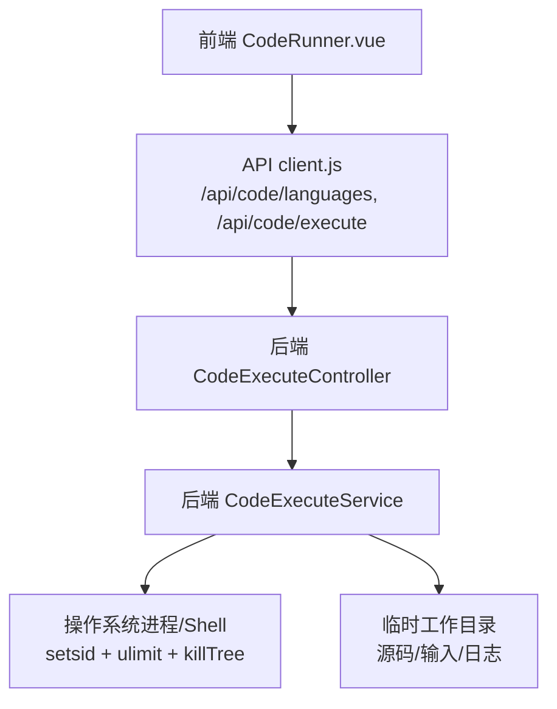
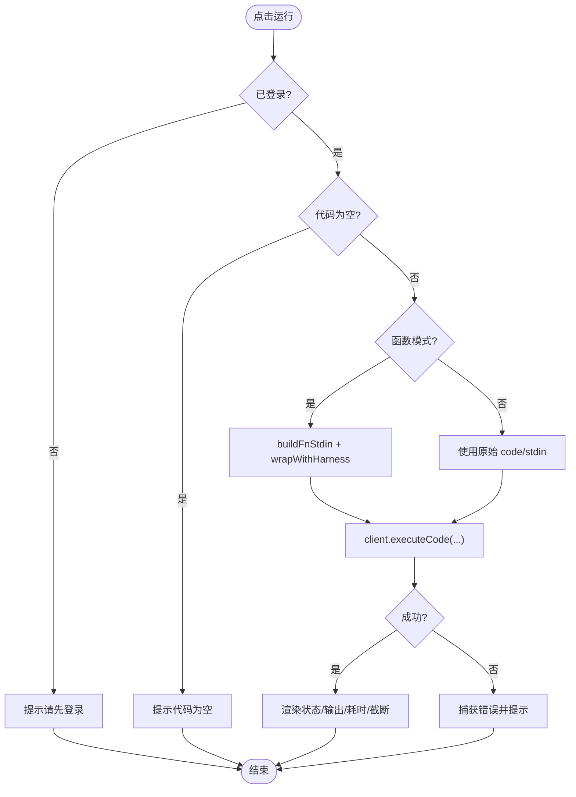
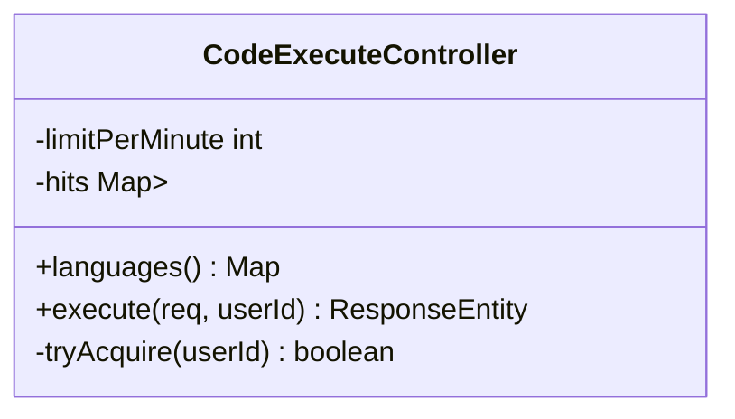
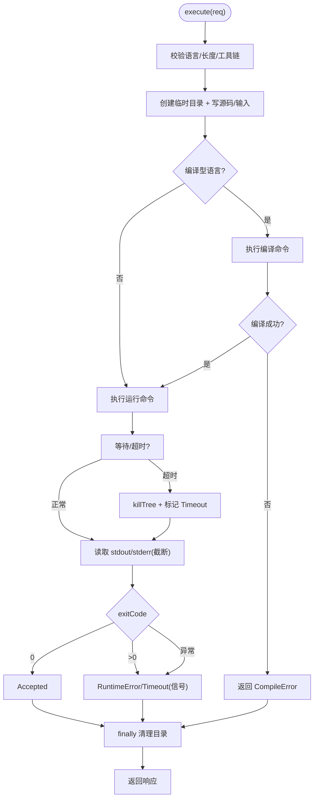
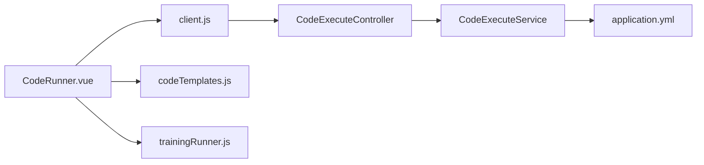

# 代码执行组件

<cite>
**本文引用的文件**
- [CodeExecuteController.java](file://backend/src/main/java/com/suanfa/controller/CodeExecuteController.java)
- [CodeExecuteService.java](file://backend/src/main/java/com/suanfa/service/CodeExecuteService.java)
- [CodeExecuteRequest.java](file://backend/src/main/java/com/suanfa/dto/CodeExecuteRequest.java)
- [CodeExecuteResponse.java](file://backend/src/main/java/com/suanfa/dto/CodeExecuteResponse.java)
- [application.yml](file://backend/src/main/resources/application.yml)
- [client.js](file://suanfa_vue/src/api/client.js)
- [CodeRunner.vue](file://suanfa_vue/src/components/common/CodeRunner.vue)
- [codeTemplates.js](file://suanfa_vue/src/data/codeTemplates.js)
- [trainingRunner.js](file://suanfa_vue/src/data/trainingRunner.js)
</cite>

## 目录
1. [简介](#简介)
2. [项目结构](#项目结构)
3. [核心组件](#核心组件)
4. [架构总览](#架构总览)
5. [详细组件分析](#详细组件分析)
6. [依赖关系分析](#依赖关系分析)
7. [性能与安全](#性能与安全)
8. [故障排查指南](#故障排查指南)
9. [结论](#结论)
10. [附录：扩展与集成](#附录：扩展与集成)

## 简介
本组件提供在线“代码工作台”，支持在浏览器中编写并运行 C/C++、Java、Python、Go、JavaScript 等语言的代码。前端负责编辑器交互、模板生成、输入参数绑定与结果展示；后端负责语言工具链检测、进程隔离执行、超时与资源限制、输出截断与错误归类，并通过限流与鉴权保障安全。

## 项目结构
- 前端（Vue）
  - 代码执行入口组件：CodeRunner.vue
  - API 客户端：client.js（封装 /api/code/* 请求）
  - 模板与函数模式元数据：codeTemplates.js、trainingRunner.js
- 后端（Spring Boot）
  - 控制器：CodeExecuteController（路由、鉴权、限流）
  - 服务：CodeExecuteService（语言配置、编译/运行、沙箱化执行、清理）
  - DTO：CodeExecuteRequest、CodeExecuteResponse
  - 配置：application.yml（超时、限流等）



图表来源
- [CodeRunner.vue:1-239](file://suanfa_vue/src/components/common/CodeRunner.vue#L1-L239)
- [client.js:330-347](file://suanfa_vue/src/api/client.js#L330-L347)
- [CodeExecuteController.java:26-58](file://backend/src/main/java/com/suanfa/controller/CodeExecuteController.java#L26-L58)
- [CodeExecuteService.java:89-191](file://backend/src/main/java/com/suanfa/service/CodeExecuteService.java#L89-L191)

章节来源
- [CodeRunner.vue:1-239](file://suanfa_vue/src/components/common/CodeRunner.vue#L1-L239)
- [client.js:330-347](file://suanfa_vue/src/api/client.js#L330-L347)
- [CodeExecuteController.java:26-58](file://backend/src/main/java/com/suanfa/controller/CodeExecuteController.java#L26-L58)
- [CodeExecuteService.java:89-191](file://backend/src/main/java/com/suanfa/service/CodeExecuteService.java#L89-L191)

## 核心组件
- 前端 CodeRunner.vue
  - 两种模式：函数模式（按题面参数自动拼装 stdin）、自由模式（直接写完整程序）
  - 本地草稿持久化（localStorage），Ctrl+Enter 快捷运行
  - 结果状态可视化（Accepted/CompileError/RuntimeError/Timeout/Unsupported）
  - 期望输出比对（宽松匹配：去空白、全角转半角、JSON 结构等价）
- 后端 CodeExecuteController
  - GET /api/code/languages：返回当前可用的语言列表
  - POST /api/code/execute：需登录 + 滑动窗口限流
- 后端 CodeExecuteService
  - 维护语言定义（编译/运行命令、工具链、内存限制）
  - 为每次执行创建独立临时目录，写入源码与输入
  - 以 setsid bash 启动子进程组，ulimit 限制 CPU/磁盘/虚存
  - 超时按进程组 kill，输出落盘并截断，结束后递归清理
- 模板与元数据
  - codeTemplates.js：各语言自由模式模板、函数模式的 head/stub/tail 拼接
  - trainingRunner.js：题目函数签名、参数类型、测试用例与期望输出

章节来源
- [CodeRunner.vue:1-239](file://suanfa_vue/src/components/common/CodeRunner.vue#L1-L239)
- [CodeExecuteController.java:26-58](file://backend/src/main/java/com/suanfa/controller/CodeExecuteController.java#L26-L58)
- [CodeExecuteService.java:43-82](file://backend/src/main/java/com/suanfa/service/CodeExecuteService.java#L43-L82)
- [codeTemplates.js:22-86](file://suanfa_vue/src/data/codeTemplates.js#L22-L86)
- [trainingRunner.js:14-96](file://suanfa_vue/src/data/trainingRunner.js#L14-L96)

## 架构总览
```mermaid
sequenceDiagram
participant U as "用户"
participant FE as "CodeRunner.vue"
participant CL as "client.js"
participant CTRL as "CodeExecuteController"
participant SVC as "CodeExecuteService"
participant OS as "OS Shell/Process"
U->>FE : 点击运行/切换用例
FE->>CL : executeCode(language, code, stdin)
CL->>CTRL : POST /api/code/execute {language, code, stdin}
CTRL->>CTRL : 鉴权 + 滑动窗口限流
CTRL->>SVC : execute(req)
SVC->>SVC : 校验语言/长度/工具链
SVC->>OS : 创建临时目录 + 写入源码/输入
SVC->>OS : setsid bash -c 'ulimit ...; exec ...'
OS-->>SVC : stdout.log/stderr.log/退出码
SVC->>SVC : 超时/信号处理 + 输出截断
SVC-->>CTRL : CodeExecuteResponse
CTRL-->>CL : JSON 响应
CL-->>FE : 渲染状态/输出/耗时/是否截断
```

图表来源
- [CodeRunner.vue:189-223](file://suanfa_vue/src/components/common/CodeRunner.vue#L189-L223)
- [client.js:341-347](file://suanfa_vue/src/api/client.js#L341-L347)
- [CodeExecuteController.java:47-58](file://backend/src/main/java/com/suanfa/controller/CodeExecuteController.java#L47-L58)
- [CodeExecuteService.java:89-191](file://backend/src/main/java/com/suanfa/service/CodeExecuteService.java#L89-L191)

## 详细组件分析

### 前端 CodeRunner.vue
- 功能要点
  - 函数模式：根据 trainingRunner.js 的 runnerMeta 生成具名参数输入框，提交时通过 buildFnStdin 构造 JSON 行作为 stdin，并用 wrapWithHarness 将 head/stub/tail 包裹后提交
  - 自由模式：直接提交用户编写的完整程序，stdin 原样传入
  - 本地存储：代码、stdin、参数、语言、模式均持久化到 localStorage
  - 结果展示：状态标签、耗时、exitCode、truncated 标记；编译错误单独显示；期望输出对比提示
  - 键盘快捷键：Tab 缩进、Ctrl+Enter 运行
- 关键流程
  - 运行时检查登录态与代码非空
  - 调用 client.executeCode 发起请求
  - 捕获 401 等错误并友好提示
  - 根据 supportedLanguages 置灰不可用语言



图表来源
- [CodeRunner.vue:189-223](file://suanfa_vue/src/components/common/CodeRunner.vue#L189-L223)
- [trainingRunner.js:112-139](file://suanfa_vue/src/data/trainingRunner.js#L112-L139)
- [codeTemplates.js:674-679](file://suanfa_vue/src/data/codeTemplates.js#L674-L679)

章节来源
- [CodeRunner.vue:1-239](file://suanfa_vue/src/components/common/CodeRunner.vue#L1-L239)
- [trainingRunner.js:14-139](file://suanfa_vue/src/data/trainingRunner.js#L14-L139)
- [codeTemplates.js:22-86](file://suanfa_vue/src/data/codeTemplates.js#L22-L86)

### 后端控制器 CodeExecuteController
- 职责
  - 暴露 /api/code/languages 与 /api/code/execute
  - 鉴权：未登录返回 401
  - 限流：基于用户 ID 的滑动窗口队列，每分钟最多 N 次（可配置）
- 限流实现
  - 使用 ConcurrentHashMap + Deque 记录时间戳
  - 定期清理过期条目，防止内存泄漏



图表来源
- [CodeExecuteController.java:26-80](file://backend/src/main/java/com/suanfa/controller/CodeExecuteController.java#L26-L80)

章节来源
- [CodeExecuteController.java:26-80](file://backend/src/main/java/com/suanfa/controller/CodeExecuteController.java#L26-L80)

### 后端服务 CodeExecuteService
- 职责
  - 维护语言定义（文件名、编译/运行命令、工具链、可选内存限制）
  - 校验语言与工具链可用性
  - 创建临时工作目录，写入源码与 input.txt
  - 对 Java 动态识别类名并调整编译/运行命令
  - 以 setsid bash 启动子进程组，设置 ulimit（CPU 秒、文件大小、可选虚存）
  - 超时按进程组 kill，读取 stdout/stderr 并截断至上限
  - 统一状态：Accepted/CompileError/RuntimeError/Timeout/Unsupported
  - finally 中递归删除临时目录
- 复杂度与边界
  - 最大代码/输入长度限制，避免过大负载
  - 输出字节上限，防止大输出拖垮网络/前端
  - 工具链探测失败时返回 Unsupported 并附带可用语言



图表来源
- [CodeExecuteService.java:89-191](file://backend/src/main/java/com/suanfa/service/CodeExecuteService.java#L89-L191)
- [CodeExecuteService.java:216-257](file://backend/src/main/java/com/suanfa/service/CodeExecuteService.java#L216-L257)
- [CodeExecuteService.java:268-283](file://backend/src/main/java/com/suanfa/service/CodeExecuteService.java#L268-L283)

章节来源
- [CodeExecuteService.java:43-82](file://backend/src/main/java/com/suanfa/service/CodeExecuteService.java#L43-L82)
- [CodeExecuteService.java:89-191](file://backend/src/main/java/com/suanfa/service/CodeExecuteService.java#L89-L191)
- [CodeExecuteService.java:216-283](file://backend/src/main/java/com/suanfa/service/CodeExecuteService.java#L216-L283)

### DTO 与配置
- CodeExecuteRequest：包含 language、code、stdin
- CodeExecuteResponse：status、stdout、stderr、compileError、exitCode、timeMs、truncated、supportedLanguages
- application.yml：配置编译/运行超时、限流阈值等

章节来源
- [CodeExecuteRequest.java:1-6](file://backend/src/main/java/com/suanfa/dto/CodeExecuteRequest.java#L1-L6)
- [CodeExecuteResponse.java:1-25](file://backend/src/main/java/com/suanfa/dto/CodeExecuteResponse.java#L1-L25)
- [application.yml:92-96](file://backend/src/main/resources/application.yml#L92-L96)

## 依赖关系分析
- 前端依赖
  - CodeRunner.vue 依赖 client.js 进行网络请求
  - CodeRunner.vue 依赖 codeTemplates.js 与 trainingRunner.js 生成模板与构建 stdin
- 后端依赖
  - CodeExecuteController 依赖 CodeExecuteService 执行业务逻辑
  - CodeExecuteService 依赖操作系统能力（which、setsid、bash、ulimit、kill）
  - 配置来自 application.yml 的环境变量覆盖



图表来源
- [CodeRunner.vue:1-239](file://suanfa_vue/src/components/common/CodeRunner.vue#L1-L239)
- [client.js:330-347](file://suanfa_vue/src/api/client.js#L330-L347)
- [CodeExecuteController.java:26-58](file://backend/src/main/java/com/suanfa/controller/CodeExecuteController.java#L26-L58)
- [CodeExecuteService.java:89-191](file://backend/src/main/java/com/suanfa/service/CodeExecuteService.java#L89-L191)
- [application.yml:92-96](file://backend/src/main/resources/application.yml#L92-L96)

章节来源
- [CodeRunner.vue:1-239](file://suanfa_vue/src/components/common/CodeRunner.vue#L1-L239)
- [client.js:330-347](file://suanfa_vue/src/api/client.js#L330-L347)
- [CodeExecuteController.java:26-58](file://backend/src/main/java/com/suanfa/controller/CodeExecuteController.java#L26-L58)
- [CodeExecuteService.java:89-191](file://backend/src/main/java/com/suanfa/service/CodeExecuteService.java#L89-L191)
- [application.yml:92-96](file://backend/src/main/resources/application.yml#L92-L96)

## 性能与安全
- 性能优化
  - 输出截断：stdout/stderr 超过上限被截断，减少传输与渲染开销
  - 超时控制：编译/运行分别设置 wall-time 超时，避免长时间占用线程
  - 临时目录清理：finally 中递归删除，避免磁盘膨胀
  - 语言工具链缓存：toolchainAvailable 快速判断，避免重复探测
- 内存控制
  - 对 C/C++ 设置虚存上限（ulimit -v），其他语言默认不限制以避免启动失败
  - Java 运行时限制堆大小与 GC 策略，降低峰值内存
- 安全机制
  - 进程级隔离：每个执行使用独立临时目录与独立进程组
  - 资源限制：ulimit -t（CPU 秒）、ulimit -f（文件大小）、可选 -v（虚存）
  - 超时强制终止：按进程组 kill，确保子进程也被回收
  - 鉴权与限流：仅登录用户可执行，滑动窗口限制每分钟次数
- 用户体验提升
  - 函数模式：无需手写输入解析，自动生成 harness
  - 期望输出比对：宽松匹配，提示差异原因
  - 快捷键与草稿保存：Ctrl+Enter 运行，自动保存代码/输入/参数
  - 语言可用性提示：后端不可达或工具链缺失时置灰并提示

[本节为通用指导，不直接分析具体文件]

## 故障排查指南
- 常见问题
  - 未登录：前端提示“请先登录”，后端返回 401
  - 限流触发：后端返回 429，提示“运行太频繁”
  - 工具链缺失：后端返回 Unsupported，并附带可用语言列表
  - 编译失败：返回 CompileError，显示 stderr 内容
  - 运行异常：返回 RuntimeError，可能包含信号信息
  - 超时：返回 Timeout，stderr 追加超时说明
  - 输出过长：返回 truncated=true，提示已截断
- 定位建议
  - 查看前端 runError 与 result 字段
  - 检查后端日志中的执行失败信息
  - 确认环境变量 CODE_COMPILE_TIMEOUT/CODE_RUN_TIMEOUT/CODE_RATE_PER_MINUTE 配置
  - 验证服务器是否安装对应工具链（gcc/g++/javac/python3/go/node）

章节来源
- [CodeRunner.vue:189-223](file://suanfa_vue/src/components/common/CodeRunner.vue#L189-L223)
- [CodeExecuteController.java:47-58](file://backend/src/main/java/com/suanfa/controller/CodeExecuteController.java#L47-L58)
- [CodeExecuteService.java:89-191](file://backend/src/main/java/com/suanfa/service/CodeExecuteService.java#L89-L191)
- [application.yml:92-96](file://backend/src/main/resources/application.yml#L92-L96)

## 结论
该代码执行组件以前端友好的函数/自由双模式、完善的模板与元数据管理、健壮的后端进程级沙箱与资源限制为核心，提供了稳定、安全的在线代码执行体验。通过超时、截断、限流与鉴权，兼顾了性能与安全性；通过期望输出比对与草稿持久化，提升了易用性。未来可在容器化沙箱、更多语言支持与更细粒度资源配额方面继续演进。

[本节为总结，不直接分析具体文件]

## 附录：扩展与集成
- 语言支持扩展
  - 在 CodeExecuteService 的 LANGS 映射中添加新语言定义（文件名、编译/运行命令、工具链、可选内存限制）
  - 在前端 LANGUAGES 列表中添加对应选项，并在 codeTemplates.js 中补充自由模式模板与函数模式 harness
- 模板管理
  - 使用 harnessParts 生成 head/stub/tail，保持编辑器简洁
  - 通过 wrapWithHarness 在提交时组装完整可执行程序
- 测试用例集成
  - 在 trainingRunner.js 的 RUNNER_META 中新增题目元数据（函数名、参数、返回值、用例与期望输出）
  - 前端自动渲染参数输入框与期望输出对比
- 异步与错误捕获
  - 前端使用 async/await 调用 client.executeCode，统一捕获错误并提示
  - 后端通过 try/catch 与 finally 保证异常路径与资源清理
- 性能与内存调优
  - 调整 application.yml 中的超时与限流参数
  - 针对特定语言设置合适的内存限制（如 C/C++ 的虚存上限）
  - 监控输出截断比例，必要时调整 MAX_OUTPUT_BYTES

章节来源
- [CodeExecuteService.java:43-82](file://backend/src/main/java/com/suanfa/service/CodeExecuteService.java#L43-L82)
- [codeTemplates.js:476-685](file://suanfa_vue/src/data/codeTemplates.js#L476-L685)
- [trainingRunner.js:14-96](file://suanfa_vue/src/data/trainingRunner.js#L14-L96)
- [application.yml:92-96](file://backend/src/main/resources/application.yml#L92-L96)