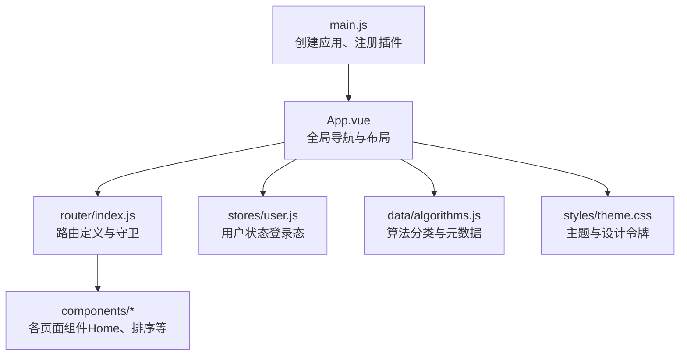
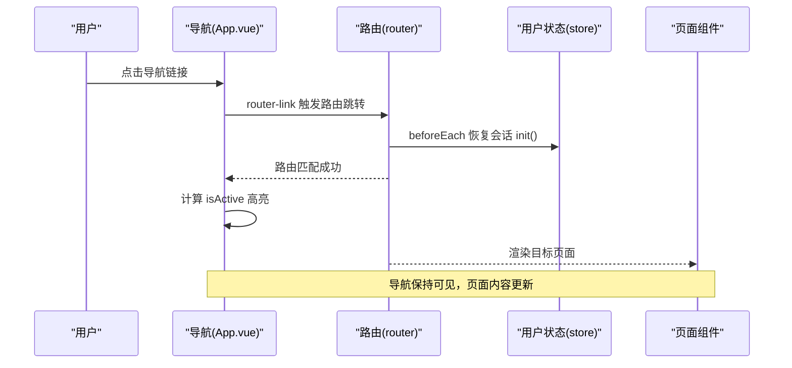
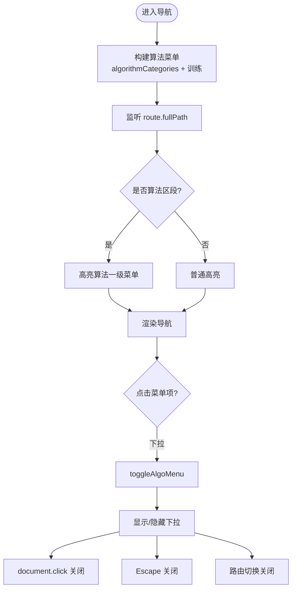
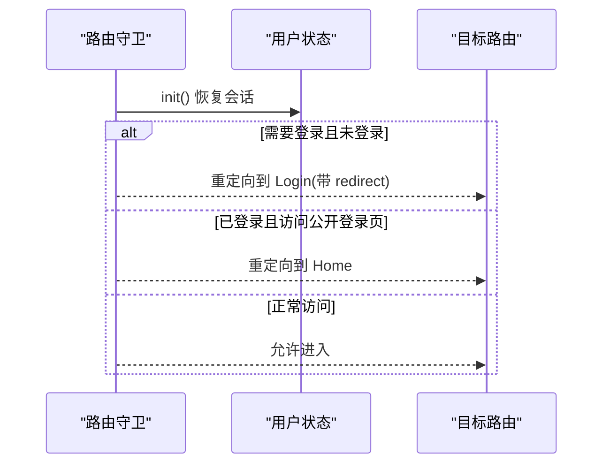
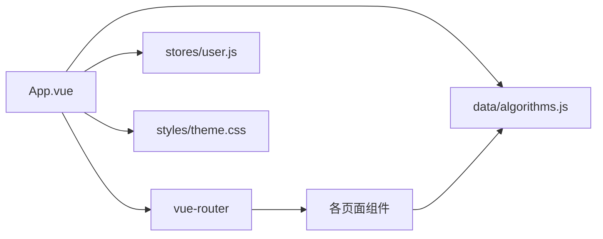

# 导航组件

<cite>
**本文引用的文件**
- [suanfa_vue/src/App.vue](file://suanfa_vue/src/App.vue)
- [suanfa_vue/src/router/index.js](file://suanfa_vue/src/router/index.js)
- [suanfa_vue/src/main.js](file://suanfa_vue/src/main.js)
- [suanfa_vue/src/data/algorithms.js](file://suanfa_vue/src/data/algorithms.js)
- [suanfa_vue/src/stores/user.js](file://suanfa_vue/src/stores/user.js)
- [suanfa_vue/src/styles/theme.css](file://suanfa_vue/src/styles/theme.css)
- [suanfa_vue/src/components/common/Home.vue](file://suanfa_vue/src/components/common/Home.vue)
- [suanfa_vue/src/components/algorithms/sorting_algorithms/SortingPage.vue](file://suanfa_vue/src/components/algorithms/sorting_algorithms/SortingPage.vue)
</cite>

## 目录
1. [简介](#简介)
2. [项目结构](#项目结构)
3. [核心组件](#核心组件)
4. [架构总览](#架构总览)
5. [详细组件分析](#详细组件分析)
6. [依赖关系分析](#依赖关系分析)
7. [性能与可维护性](#性能与可维护性)
8. [故障排查指南](#故障排查指南)
9. [结论](#结论)
10. [附录：SEO、可访问性与国际化建议](#附录seo可访问性与国际化建议)

## 简介
本文件聚焦“主页导航组件”的设计与实现，覆盖路由配置、页面布局结构、导航菜单设计、组件间通信与状态同步、响应式与移动端适配、键盘导航支持、主题切换、国际化扩展点、性能优化技巧，以及 SEO 与可访问性最佳实践。文档基于仓库中的 Vue 3 + Vue Router + Pinia 前端工程进行代码级分析，并给出可视化图示帮助理解。

## 项目结构
前端采用单页应用（SPA）架构，入口为 main.js，挂载根组件 App.vue；路由由 vue-router 管理；用户状态通过 Pinia store 跨页面共享；导航菜单在 App.vue 中实现，算法分类数据集中在 data/algorithms.js，样式变量集中在 styles/theme.css。

图表来源
- [suanfa_vue/src/main.js:1-12](file://suanfa_vue/src/main.js#L1-L12)
- [suanfa_vue/src/App.vue:1-134](file://suanfa_vue/src/App.vue#L1-L134)
- [suanfa_vue/src/router/index.js:1-124](file://suanfa_vue/src/router/index.js#L1-L124)
- [suanfa_vue/src/data/algorithms.js:777-800](file://suanfa_vue/src/data/algorithms.js#L777-L800)
- [suanfa_vue/src/stores/user.js:1-36](file://suanfa_vue/src/stores/user.js#L1-L36)
- [suanfa_vue/src/styles/theme.css:91-135](file://suanfa_vue/src/styles/theme.css#L91-L135)

章节来源
- [suanfa_vue/src/main.js:1-12](file://suanfa_vue/src/main.js#L1-L12)
- [suanfa_vue/src/App.vue:1-134](file://suanfa_vue/src/App.vue#L1-L134)
- [suanfa_vue/src/router/index.js:1-124](file://suanfa_vue/src/router/index.js#L1-L124)

## 核心组件
- 根布局与导航：App.vue 提供顶部导航栏、算法下拉菜单、登录/退出入口、页脚；使用 router-link 驱动 SPA 路由切换；通过 computed 判断当前激活项。
- 路由系统：router/index.js 集中声明所有页面路由，包含懒加载、重定向、动态路由和基于 meta 的鉴权守卫。
- 用户状态：stores/user.js 提供登录态、初始化、登录/注册/登出动作，被路由守卫和导航栏复用。
- 导航数据源：data/algorithms.js 提供算法分类列表 algorithmCategories，用于构建导航菜单与分类页。
- 主题与样式：styles/theme.css 以 CSS 变量形式定义导航栏配色、阴影、圆角、过渡等，便于统一换肤。

章节来源
- [suanfa_vue/src/App.vue:1-134](file://suanfa_vue/src/App.vue#L1-L134)
- [suanfa_vue/src/router/index.js:1-124](file://suanfa_vue/src/router/index.js#L1-L124)
- [suanfa_vue/src/stores/user.js:1-36](file://suanfa_vue/src/stores/user.js#L1-L36)
- [suanfa_vue/src/data/algorithms.js:777-800](file://suanfa_vue/src/data/algorithms.js#L777-L800)
- [suanfa_vue/src/styles/theme.css:91-135](file://suanfa_vue/src/styles/theme.css#L91-L135)

## 架构总览
导航组件位于应用顶层，负责：
- 渲染固定头部导航与页脚
- 根据当前路由高亮对应菜单项
- 控制算法分类下拉菜单的展开/收起
- 展示用户登录态并提供退出操作
- 通过 router-view 承载子页面内容

图表来源
- [suanfa_vue/src/App.vue:20-60](file://suanfa_vue/src/App.vue#L20-L60)
- [suanfa_vue/src/router/index.js:109-120](file://suanfa_vue/src/router/index.js#L109-L120)
- [suanfa_vue/src/stores/user.js:13-23](file://suanfa_vue/src/stores/user.js#L13-L23)

## 详细组件分析

### 导航菜单与交互（App.vue）
- 菜单数据来源：从 data/algorithms.js 的 algorithmCategories 派生算法类目的菜单项，并追加“算法训练”。
- 高亮逻辑：computed 判断当前路径是否属于算法区段；isActive 函数用于精确匹配或前缀匹配。
- 下拉菜单：ref 引用容器元素，监听 document click 关闭；键盘 Escape 关闭；路由变化时自动关闭。
- 登录态：读取 userStore.isLoggedIn 与用户名，提供退出按钮调用 store.logout。
- 可访问性：为下拉按钮设置 aria-expanded 与 aria-haspopup，提升屏幕阅读器体验。

图表来源
- [suanfa_vue/src/App.vue:10-60](file://suanfa_vue/src/App.vue#L10-L60)
- [suanfa_vue/src/data/algorithms.js:787-793](file://suanfa_vue/src/data/algorithms.js#L787-L793)

章节来源
- [suanfa_vue/src/App.vue:10-134](file://suanfa_vue/src/App.vue#L10-L134)
- [suanfa_vue/src/data/algorithms.js:787-793](file://suanfa_vue/src/data/algorithms.js#L787-L793)

### 路由配置与守卫（router/index.js）
- 路由组织：首页、关于、登录、进度、日历、训练、AI 助教、算法分类及详情页；使用懒加载减少首屏体积。
- 重定向：/algorithms 重定向到 /algorithms/sorting。
- 动态路由：/algorithms/:category/:id 统一承载算法详情页。
- 鉴权守卫：beforeEach 先恢复会话（userStore.init），再根据 meta.requiresAuth 与 meta.public 决定跳转登录或首页。

图表来源
- [suanfa_vue/src/router/index.js:109-120](file://suanfa_vue/src/router/index.js#L109-L120)
- [suanfa_vue/src/stores/user.js:13-23](file://suanfa_vue/src/stores/user.js#L13-L23)

章节来源
- [suanfa_vue/src/router/index.js:1-124](file://suanfa_vue/src/router/index.js#L1-L124)

### 用户状态与跨组件通信（stores/user.js）
- 状态字段：user、initialized；getter：isLoggedIn。
- 关键动作：init（恢复会话）、login/register（登录/注册）、logout（退出）。
- 通信模式：Pinia store 作为单一可信状态源，导航栏与路由守卫共同消费该状态，保证一致的用户体验。

章节来源
- [suanfa_vue/src/stores/user.js:1-36](file://suanfa_vue/src/stores/user.js#L1-L36)

### 导航数据源与页面联动（data/algorithms.js）
- 单一数据源：algorithms 数组集中维护算法元数据，供卡片、详情页、导航菜单复用。
- 分类元信息：algorithmCategories 提供导航所需的大类键值与路由映射。
- 便捷导出：按类别筛选的数组（如 sortingAlgorithms）供分类页使用。

章节来源
- [suanfa_vue/src/data/algorithms.js:777-800](file://suanfa_vue/src/data/algorithms.js#L777-L800)

### 主题与样式（styles/theme.css）
- 设计令牌：以 CSS 变量定义品牌色、背景、文字、边框、强调色等。
- 导航主题：nav-* 系列变量控制导航背景、文本、悬停、激活、下拉菜单、分隔线、认证按钮等。
- 可扩展性：通过覆盖 :root 变量即可实现换肤，无需改动组件样式。

章节来源
- [suanfa_vue/src/styles/theme.css:91-135](file://suanfa_vue/src/styles/theme.css#L91-L135)

### 页面布局与内容（Home.vue、SortingPage.vue）
- Home.vue：首页包含英雄区、算法分类概览、学习工具入口、特色内容区块，均通过 router-link 跳转到相应路由。
- SortingPage.vue：排序算法分类页，基于 data/algorithms.js 的数据进行筛选与展示，点击卡片进入统一详情页。

章节来源
- [suanfa_vue/src/components/common/Home.vue:1-120](file://suanfa_vue/src/components/common/Home.vue#L1-L120)
- [suanfa_vue/src/components/algorithms/sorting_algorithms/SortingPage.vue:1-97](file://suanfa_vue/src/components/algorithms/sorting_algorithms/SortingPage.vue#L1-L97)

## 依赖关系分析
- App.vue 依赖：
  - vue-router：useRoute、router-link、router-view
  - Pinia：useUserStore
  - 数据：data/algorithms.js 的 algorithmCategories
  - 样式：styles/theme.css 的导航变量
- 路由依赖：
  - 懒加载各页面组件
  - 用户状态：useUserStore.init
- 页面组件依赖：
  - 分类页依赖 data/algorithms.js 的分类与算法数据
  - 详情页通过动态路由参数获取算法 ID

图表来源
- [suanfa_vue/src/App.vue:1-10](file://suanfa_vue/src/App.vue#L1-L10)
- [suanfa_vue/src/router/index.js:1-19](file://suanfa_vue/src/router/index.js#L1-L19)
- [suanfa_vue/src/data/algorithms.js:777-800](file://suanfa_vue/src/data/algorithms.js#L777-L800)
- [suanfa_vue/src/stores/user.js:1-36](file://suanfa_vue/src/stores/user.js#L1-L36)
- [suanfa_vue/src/styles/theme.css:91-135](file://suanfa_vue/src/styles/theme.css#L91-L135)

章节来源
- [suanfa_vue/src/App.vue:1-134](file://suanfa_vue/src/App.vue#L1-L134)
- [suanfa_vue/src/router/index.js:1-124](file://suanfa_vue/src/router/index.js#L1-L124)

## 性能与可维护性
- 路由懒加载：页面组件按需导入，降低首屏包体。
- 单一数据源：算法元数据集中管理，避免多处重复定义导致不一致。
- 计算属性高亮：使用 computed 缓存 isActive 结果，减少重复计算。
- 事件清理：在 onBeforeUnmount 移除 document 事件监听，防止内存泄漏。
- 主题解耦：样式通过 CSS 变量统一管理，便于换肤与维护。
- 建议优化：
  - 对复杂下拉菜单可考虑虚拟滚动（若未来菜单项增多）
  - 将高频计算的 isActive 提取为 composable，提高复用性
  - 使用 IntersectionObserver 替代 scroll 事件以提升滚动性能（如需）

[本节为通用指导，不直接分析具体文件]

## 故障排查指南
- 登录后仍提示登录：检查路由守卫是否正确调用 userStore.init，并确保后端接口返回用户信息。
- 下拉菜单无法关闭：确认 ref 引用正确、document click 与 Escape 事件绑定与移除逻辑完整。
- 菜单高亮异常：核对 isActive 的路径匹配逻辑与路由 path 的一致性。
- 主题不生效：确认 theme.css 已引入，且组件样式引用的是 CSS 变量而非硬编码颜色。

章节来源
- [suanfa_vue/src/router/index.js:109-120](file://suanfa_vue/src/router/index.js#L109-L120)
- [suanfa_vue/src/App.vue:47-60](file://suanfa_vue/src/App.vue#L47-L60)
- [suanfa_vue/src/styles/theme.css:91-135](file://suanfa_vue/src/styles/theme.css#L91-L135)

## 结论
导航组件通过 Vue Router 与 Pinia 实现了清晰的路由控制与跨页面状态同步；以单一数据源驱动菜单与页面内容，保证了数据一致性；通过 CSS 变量实现主题化，便于后续扩展浅色模式。整体结构简洁、可维护性强，具备良好的可扩展基础。

[本节为总结，不直接分析具体文件]

## 附录：SEO、可访问性与国际化建议

- SEO 优化
  - 为每个页面设置合适的 title、meta description（可在路由 meta 中集中管理）
  - 为重要链接添加语义化标签与正确的 heading 层级
  - 使用结构化数据（JSON-LD）描述站点与内容（可选）
  - 确保路由可被搜索引擎抓取（History 模式需服务端配置）

- 可访问性（a11y）
  - 导航按钮与链接具备清晰的 aria-label 或文本
  - 下拉菜单支持键盘导航（Tab、Enter、Esc）与焦点管理
  - 为交互元素提供 aria-expanded、aria-haspopup 等属性（已在导航中使用）
  - 确保颜色对比度符合 WCAG 标准（深色主题下注意文字可读性）

- 国际化（i18n）
  - 当前文案硬编码在组件模板中，建议抽取为 i18n 资源文件
  - 通过语言包切换文案，避免在组件内写死字符串
  - 结合路由命名与元信息，支持多语言 URL 前缀（可选）

- 响应式与移动端适配
  - 当前导航在大屏上横向排列，在小屏下可通过媒体查询折叠为汉堡菜单
  - 建议在 App.vue 中添加移动端菜单开关与遮罩层，提升触控体验
  - 使用触摸友好的尺寸与间距，确保点击区域足够大

- 主题切换
  - 通过覆盖 :root 的 CSS 变量实现换肤（例如 html[data-theme='light']）
  - 可将主题偏好存储于 localStorage，并在应用启动时恢复

[本节为通用建议，不直接分析具体文件]