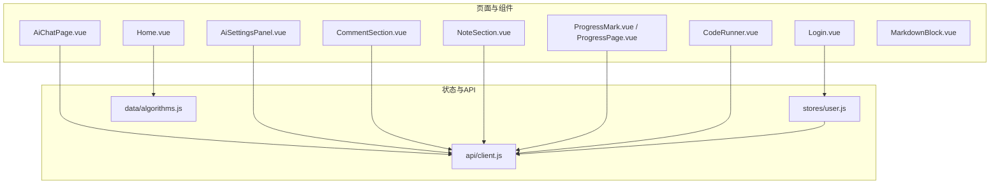
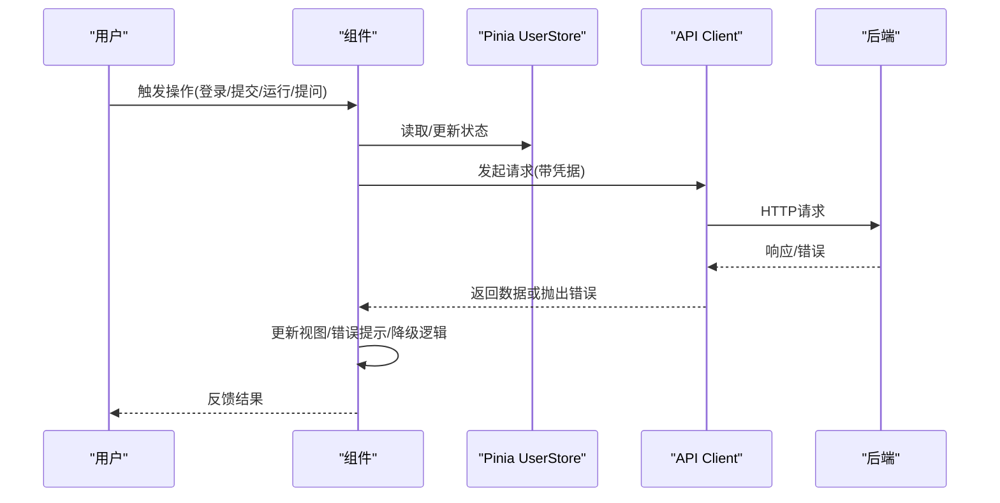
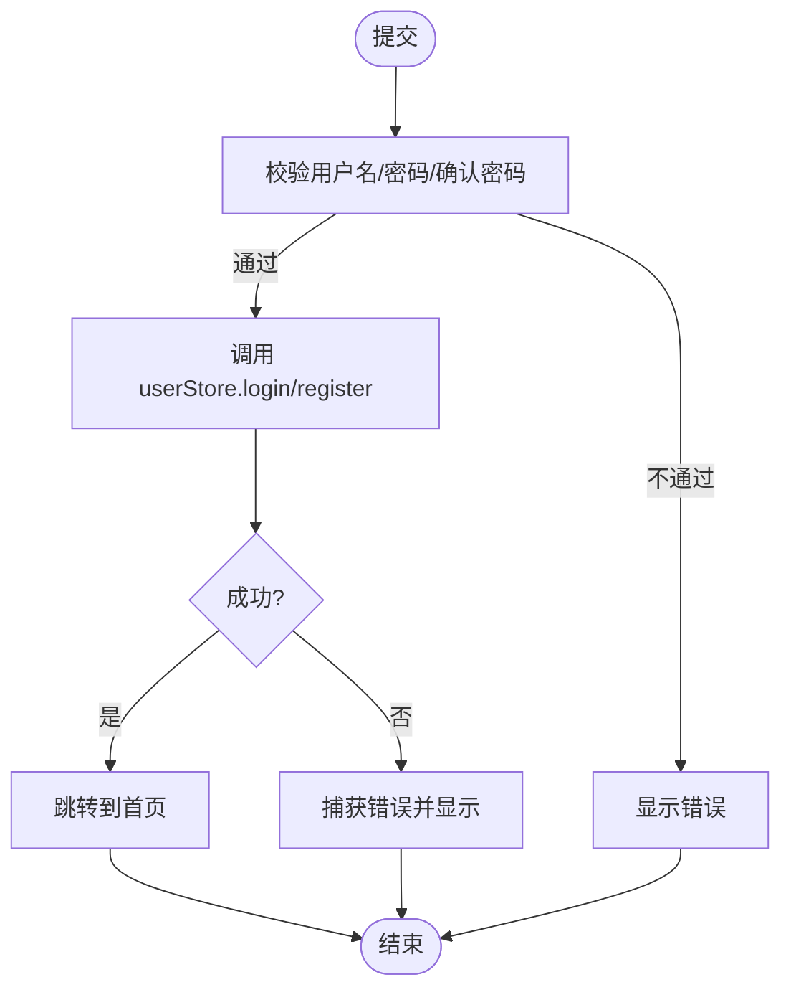
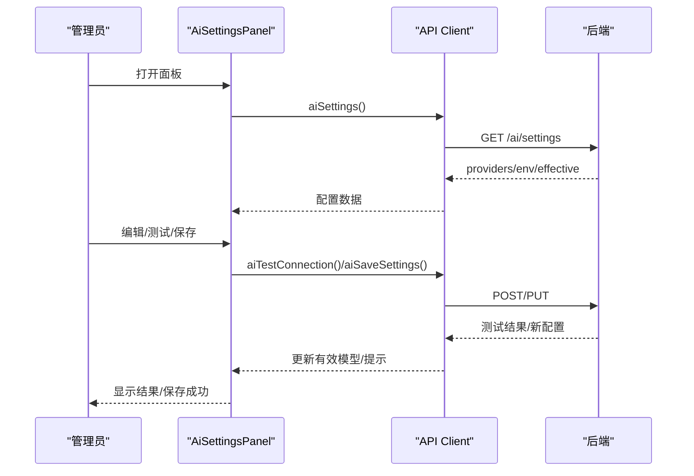
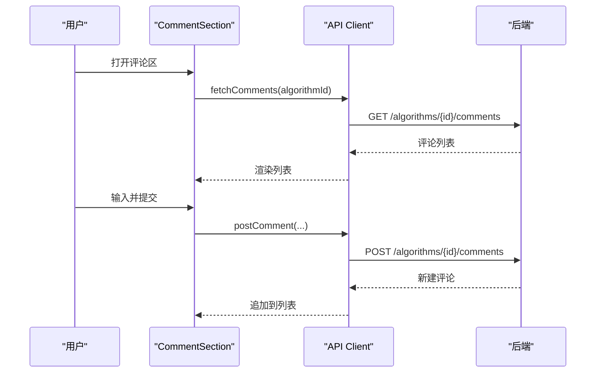
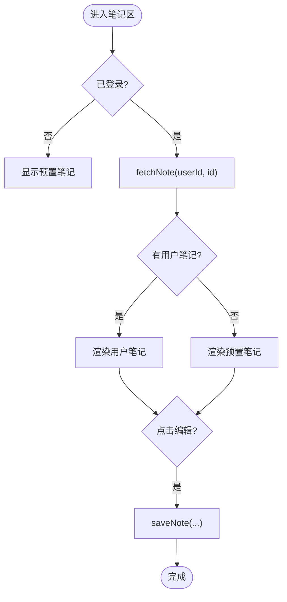
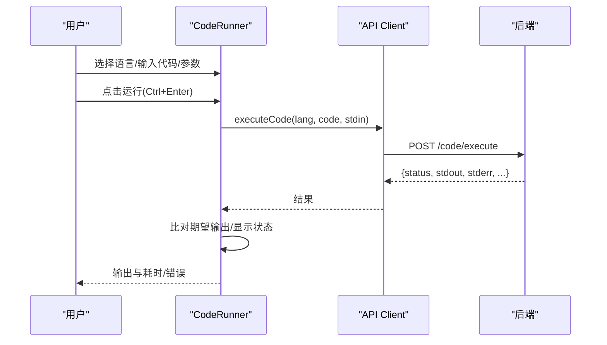
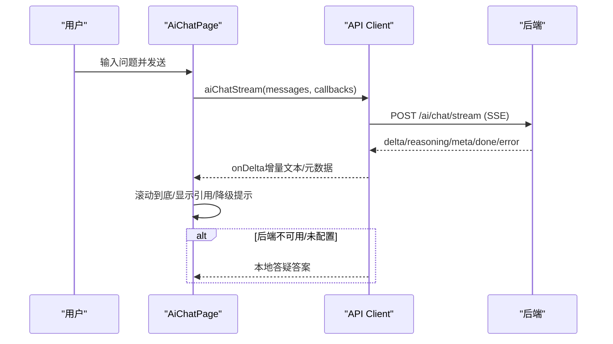
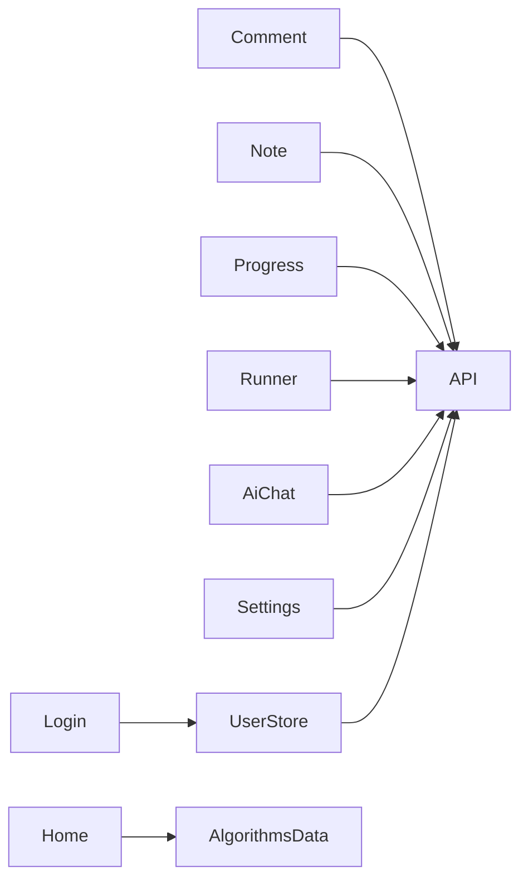

# 用户界面组件

<cite>
**本文引用的文件**
- [Login.vue](file://suanfa_vue/src/components/common/Login.vue)
- [Home.vue](file://suanfa_vue/src/components/common/Home.vue)
- [AiSettingsPanel.vue](file://suanfa_vue/src/components/common/AiSettingsPanel.vue)
- [CommentSection.vue](file://suanfa_vue/src/components/common/CommentSection.vue)
- [NoteSection.vue](file://suanfa_vue/src/components/common/NoteSection.vue)
- [ProgressMark.vue](file://suanfa_vue/src/components/common/ProgressMark.vue)
- [CodeRunner.vue](file://suanfa_vue/src/components/common/CodeRunner.vue)
- [MarkdownBlock.vue](file://suanfa_vue/src/components/common/MarkdownBlock.vue)
- [ProgressPage.vue](file://suanfa_vue/src/components/common/ProgressPage.vue)
- [AiChatPage.vue](file://suanfa_vue/src/components/common/AiChatPage.vue)
- [user.js](file://suanfa_vue/src/stores/user.js)
- [client.js](file://suanfa_vue/src/api/client.js)
- [algorithms.js](file://suanfa_vue/src/data/algorithms.js)
</cite>

## 目录
1. [简介](#简介)
2. [项目结构](#项目结构)
3. [核心组件总览](#核心组件总览)
4. [架构总览](#架构总览)
5. [详细组件分析](#详细组件分析)
6. [依赖关系分析](#依赖关系分析)
7. [性能与可用性](#性能与可用性)
8. [故障排查指南](#故障排查指南)
9. [结论](#结论)

## 简介
本文件面向“算法学习平台”的前端用户界面组件，覆盖登录注册、主页导航、设置面板（AI中转站配置）、评论系统、笔记管理、进度标记、代码执行器、AI对话等核心UI。文档从Props、事件、插槽、样式定制、表单验证、状态管理、API集成、错误处理、复用模式、组合式API、响应式设计、后端交互、数据同步、用户体验优化、可访问性与跨浏览器兼容性等方面给出系统化说明，并辅以架构图、时序图与流程图帮助理解。

## 项目结构
前端采用Vue 3 + Vite，使用Pinia进行全局状态管理，通过统一的API客户端封装与后端交互，并具备离线降级能力。组件集中在 common 目录下，按功能划分；数据源在 data 目录；路由与页面在 components/common 中组织。

图表来源
- [Home.vue:1-120](file://suanfa_vue/src/components/common/Home.vue#L1-L120)
- [Login.vue:1-84](file://suanfa_vue/src/components/common/Login.vue#L1-L84)
- [AiChatPage.vue:1-120](file://suanfa_vue/src/components/common/AiChatPage.vue#L1-L120)
- [AiSettingsPanel.vue:1-120](file://suanfa_vue/src/components/common/AiSettingsPanel.vue#L1-L120)
- [CommentSection.vue:1-73](file://suanfa_vue/src/components/common/CommentSection.vue#L1-L73)
- [NoteSection.vue:1-94](file://suanfa_vue/src/components/common/NoteSection.vue#L1-L94)
- [ProgressMark.vue:1-49](file://suanfa_vue/src/components/common/ProgressMark.vue#L1-L49)
- [ProgressPage.vue:1-59](file://suanfa_vue/src/components/common/ProgressPage.vue#L1-L59)
- [CodeRunner.vue:1-120](file://suanfa_vue/src/components/common/CodeRunner.vue#L1-L120)
- [MarkdownBlock.vue:1-19](file://suanfa_vue/src/components/common/MarkdownBlock.vue#L1-L19)
- [user.js:1-36](file://suanfa_vue/src/stores/user.js#L1-L36)
- [client.js:1-120](file://suanfa_vue/src/api/client.js#L1-L120)
- [algorithms.js:1-50](file://suanfa_vue/src/data/algorithms.js#L1-L50)

章节来源
- [Home.vue:1-120](file://suanfa_vue/src/components/common/Home.vue#L1-L120)
- [client.js:1-120](file://suanfa_vue/src/api/client.js#L1-L120)

## 核心组件总览
- 登录注册：统一表单校验、切换登录/注册模式、调用用户Store完成认证并跳转首页。
- 主页导航：展示分类卡片、工具入口、复杂度对比表等，数据驱动渲染。
- AI设置面板：管理员配置第三方OpenAI兼容中转站、模型清单、请求头、测试连接、保存热生效。
- 评论系统：列表公开可读，登录后发表/删除自己的评论，支持后端优先与本地回退。
- 笔记管理：查看/编辑双态，Markdown渲染，支持默认笔记与用户笔记切换，后端优先与本地回退。
- 进度标记：已掌握/收藏状态切换，未登录引导登录，持久化到后端。
- 代码执行器：函数模式/自由模式，多语言运行，参数输入、用例切换、输出比对、草稿本地缓存。
- Markdown块：安全渲染Markdown内容，用于AI回答与笔记预览。
- 进度页：按分类聚合展示已学/收藏的算法卡片。
- AI对话：SSE流式打字机输出，模型自动选择与降级提示，本地答疑兜底。

章节来源
- [Login.vue:1-84](file://suanfa_vue/src/components/common/Login.vue#L1-L84)
- [Home.vue:1-120](file://suanfa_vue/src/components/common/Home.vue#L1-L120)
- [AiSettingsPanel.vue:1-120](file://suanfa_vue/src/components/common/AiSettingsPanel.vue#L1-L120)
- [CommentSection.vue:1-73](file://suanfa_vue/src/components/common/CommentSection.vue#L1-L73)
- [NoteSection.vue:1-94](file://suanfa_vue/src/components/common/NoteSection.vue#L1-L94)
- [ProgressMark.vue:1-49](file://suanfa_vue/src/components/common/ProgressMark.vue#L1-L49)
- [CodeRunner.vue:1-120](file://suanfa_vue/src/components/common/CodeRunner.vue#L1-L120)
- [MarkdownBlock.vue:1-19](file://suanfa_vue/src/components/common/MarkdownBlock.vue#L1-L19)
- [ProgressPage.vue:1-59](file://suanfa_vue/src/components/common/ProgressPage.vue#L1-L59)
- [AiChatPage.vue:1-120](file://suanfa_vue/src/components/common/AiChatPage.vue#L1-L120)

## 架构总览
前端以组件为粒度组织，通过Pinia管理用户会话，通过统一API客户端与后端交互，并在后端不可用时提供本地数据或localStorage回退。AI对话支持SSE流式传输，失败时降级本地答疑。

图表来源
- [user.js:1-36](file://suanfa_vue/src/stores/user.js#L1-L36)
- [client.js:30-43](file://suanfa_vue/src/api/client.js#L30-L43)
- [Login.vue:16-44](file://suanfa_vue/src/components/common/Login.vue#L16-L44)
- [CodeRunner.vue:189-223](file://suanfa_vue/src/components/common/CodeRunner.vue#L189-L223)
- [AiChatPage.vue:126-189](file://suanfa_vue/src/components/common/AiChatPage.vue#L126-L189)

## 详细组件分析

### 登录注册组件（Login）
- Props：无
- Emits：无
- Slots：无
- 关键行为
  - 表单校验：用户名非空、密码长度≥4；注册模式需二次确认密码一致。
  - 状态：mode（login/register）、username/password/confirmPassword、error、loading。
  - 事件：submit（提交）、switchMode（切换模式）。
  - 状态管理：调用 userStore.login/register，成功后跳转到首页。
  - 错误处理：捕获异常并显示错误信息。
- 样式定制：主题变量（--surface, --text-*, --border-*, --c-*），按钮禁用态、聚焦态。
- 可访问性：label关联input、autocomplete属性、按钮disabled语义。
- 响应式：移动端自适应卡片宽度与内边距。

图表来源
- [Login.vue:16-44](file://suanfa_vue/src/components/common/Login.vue#L16-L44)
- [user.js:24-29](file://suanfa_vue/src/stores/user.js#L24-L29)

章节来源
- [Login.vue:1-84](file://suanfa_vue/src/components/common/Login.vue#L1-L84)
- [user.js:1-36](file://suanfa_vue/src/stores/user.js#L1-L36)

### 主页导航（Home）
- Props：无
- Emits：无
- Slots：无
- 关键行为：展示算法分类、学习工具入口、特色内容（复杂度对比表），数据来源于 algorithms.js。
- 样式定制：网格布局、卡片悬停效果、主题色。
- 响应式：auto-fill网格适配不同屏幕。

章节来源
- [Home.vue:1-120](file://suanfa_vue/src/components/common/Home.vue#L1-L120)
- [algorithms.js:1-50](file://suanfa_vue/src/data/algorithms.js#L1-L50)

### AI设置面板（AiSettingsPanel）
- Props：visible（Boolean）
- Emits：close、saved
- Slots：无
- 关键行为
  - 加载配置：aiSettings()，区分runtime与环境变量来源。
  - 编辑中转站：添加/删除provider、模型、请求头、预算/超时、reasoningEffort。
  - 测试连接：aiTestConnection()，支持传入未保存草稿，展示步骤与延迟。
  - 保存/重置：aiSaveSettings()/aiResetSettings()，保存后热生效。
  - 权限控制：仅管理员可见全量模型与配置项。
- 样式定制：模态框、表格、输入控件、状态颜色（ok/warn/bad）。
- 可访问性：role="dialog"、aria-label、键盘关闭。
- 响应式：最大宽度与滚动区域适配。

图表来源
- [AiSettingsPanel.vue:105-120](file://suanfa_vue/src/components/common/AiSettingsPanel.vue#L105-L120)
- [AiSettingsPanel.vue:195-218](file://suanfa_vue/src/components/common/AiSettingsPanel.vue#L195-L218)
- [AiSettingsPanel.vue:279-296](file://suanfa_vue/src/components/common/AiSettingsPanel.vue#L279-L296)
- [client.js:389-424](file://suanfa_vue/src/api/client.js#L389-L424)

章节来源
- [AiSettingsPanel.vue:1-565](file://suanfa_vue/src/components/common/AiSettingsPanel.vue#L1-L565)
- [client.js:389-424](file://suanfa_vue/src/api/client.js#L389-L424)

### 评论系统（CommentSection）
- Props：algorithmId（String，必填）
- Emits：无
- Slots：无
- 关键行为
  - 加载评论：fetchComments(algorithmId)，后端优先，失败回退localStorage。
  - 发表评论：postComment(algorithmId, content, username)，成功后追加至列表。
  - 删除评论：removeComment(algorithmId, commentId)，仅本人可删。
  - 排序：按createdAt升序。
- 样式定制：头像、时间、删除按钮、错误提示、空状态。
- 可访问性：文本域占位符、按钮禁用态。
- 响应式：textarea自适应宽度。

图表来源
- [CommentSection.vue:26-52](file://suanfa_vue/src/components/common/CommentSection.vue#L26-L52)
- [client.js:223-254](file://suanfa_vue/src/api/client.js#L223-L254)

章节来源
- [CommentSection.vue:1-119](file://suanfa_vue/src/components/common/CommentSection.vue#L1-L119)
- [client.js:223-254](file://suanfa_vue/src/api/client.js#L223-L254)

### 笔记管理（NoteSection）
- Props：algorithmId（String，必填）
- Emits：无
- Slots：无
- 关键行为
  - 加载用户笔记：fetchNote(userId, algorithmId)，后端优先，失败显示预置笔记。
  - 编辑/保存：saveNote(userId, algorithmId, content)，成功后退出编辑并提示。
  - 恢复默认：deleteNote(userId, algorithmId)，清空用户笔记。
  - Markdown渲染：marked解析+DOMPurify消毒。
- 样式定制：编辑器、动作栏、反馈消息、Markdown样式。
- 可访问性：spellcheck关闭、按钮禁用态。
- 响应式：textarea高度自适应。

图表来源
- [NoteSection.vue:36-93](file://suanfa_vue/src/components/common/NoteSection.vue#L36-L93)
- [client.js:154-186](file://suanfa_vue/src/api/client.js#L154-L186)

章节来源
- [NoteSection.vue:1-128](file://suanfa_vue/src/components/common/NoteSection.vue#L1-L128)
- [client.js:154-186](file://suanfa_vue/src/api/client.js#L154-L186)

### 进度标记（ProgressMark）
- Props：algorithmId（String，必填）
- Emits：无
- Slots：无
- 关键行为
  - 加载状态：fetchProgress(userId)，根据algorithmId匹配当前状态。
  - 切换状态：updateProgress(userId, algorithmId, status)，支持“已掌握/收藏/学习中”。
  - 未登录：跳转登录并保留redirect。
- 样式定制：按钮激活态、颜色区分。
- 可访问性：title提示、按钮禁用态。
- 响应式：inline-flex小尺寸按钮。

章节来源
- [ProgressMark.vue:1-72](file://suanfa_vue/src/components/common/ProgressMark.vue#L1-L72)
- [client.js:137-146](file://suanfa_vue/src/api/client.js#L137-L146)

### 代码执行器（CodeRunner）
- Props：problemId（String，必填）、defaultInput（String，默认''）
- Emits：无
- Slots：无
- 关键行为
  - 模式：函数模式（基于runnerMeta生成模板与参数输入）、自由模式（完整程序）。
  - 语言：支持C/C++/Java/Python/Go/JavaScript，后端不可用则置灰。
  - 运行：executeCode(language, code, stdin)，返回status/stdout/stderr/compileError/timeMs等。
  - 输出比对：宽松比较（去空白、全角转半角、JSON结构等价）。
  - 草稿：localStorage持久化代码、stdin、参数、模式、语言。
  - 快捷键：Ctrl+Enter运行、Tab缩进。
- 样式定制：工具栏、分栏布局、状态标签、错误高亮。
- 可访问性：标题、占位符、禁用态。
- 响应式：窄屏下分栏堆叠。

图表来源
- [CodeRunner.vue:189-223](file://suanfa_vue/src/components/common/CodeRunner.vue#L189-L223)
- [client.js:341-347](file://suanfa_vue/src/api/client.js#L341-L347)

章节来源
- [CodeRunner.vue:1-331](file://suanfa_vue/src/components/common/CodeRunner.vue#L1-L331)
- [client.js:330-347](file://suanfa_vue/src/api/client.js#L330-L347)

### Markdown块（MarkdownBlock）
- Props：source（String，默认''）
- Emits：无
- Slots：无
- 关键行为：marked解析+DOMPurify消毒，安全渲染HTML。
- 样式定制：标题、段落、列表、代码块、表格样式。
- 可访问性：语义化HTML结构。

章节来源
- [MarkdownBlock.vue:1-85](file://suanfa_vue/src/components/common/MarkdownBlock.vue#L1-L85)

### 进度页（ProgressPage）
- Props：无
- Emits：无
- Slots：无
- 关键行为：并行获取progress与algorithms，按分类分组展示，状态文案映射。
- 样式定制：卡片网格、状态标签颜色。
- 响应式：auto-fill网格。

章节来源
- [ProgressPage.vue:1-85](file://suanfa_vue/src/components/common/ProgressPage.vue#L1-L85)
- [client.js:137-146](file://suanfa_vue/src/api/client.js#L137-L146)

### AI对话（AiChatPage）
- Props：无
- Emits：无
- Slots：无
- 关键行为
  - 状态探测：aiStatus()，获取models/defaultModel/canManage/loginRequired。
  - 发送消息：aiChatStream(history, {onDelta,onMeta,onReasoning})，SSE流式输出，失败降级本地答疑。
  - 历史：localStorage持久化最近30条消息。
  - 模型降级：若实际服务模型不同于默认模型，显示降级提示。
  - 快捷问题：预设常见问题一键发送。
- 样式定制：聊天气泡、参考链接、思考动画、停止按钮。
- 可访问性：输入框占位符、按钮禁用态、内部链接拦截避免整页刷新。
- 响应式：头部按钮换行、输入区自适应。

图表来源
- [AiChatPage.vue:126-189](file://suanfa_vue/src/components/common/AiChatPage.vue#L126-L189)
- [client.js:469-552](file://suanfa_vue/src/api/client.js#L469-L552)

章节来源
- [AiChatPage.vue:1-262](file://suanfa_vue/src/components/common/AiChatPage.vue#L1-L262)
- [client.js:469-552](file://suanfa_vue/src/api/client.js#L469-L552)

## 依赖关系分析
- 组件依赖Pinia用户Store进行登录态管理。
- 所有数据读写通过统一API客户端，具备后端可用探测与降级策略。
- 数据源algorithms.js作为单一事实来源，支撑首页与详情页。
- AI相关组件依赖SSE流式接口，具备本地答疑兜底。

图表来源
- [user.js:1-36](file://suanfa_vue/src/stores/user.js#L1-L36)
- [client.js:1-120](file://suanfa_vue/src/api/client.js#L1-L120)
- [algorithms.js:1-50](file://suanfa_vue/src/data/algorithms.js#L1-L50)

章节来源
- [user.js:1-36](file://suanfa_vue/src/stores/user.js#L1-L36)
- [client.js:1-120](file://suanfa_vue/src/api/client.js#L1-L120)
- [algorithms.js:1-50](file://suanfa_vue/src/data/algorithms.js#L1-L50)

## 性能与可用性
- 性能
  - 并行请求：进度页同时拉取进度与算法列表，减少等待时间。
  - 流式输出：AI对话使用SSE增量渲染，提升首字速度。
  - 本地缓存：代码工作台、评论、笔记、活跃记录在离线时回退localStorage，保证可用性。
  - 后端探测：API客户端对后端可用性进行缓存探测，避免频繁失败重试。
- 可用性
  - 表单校验：登录注册即时校验，防止无效提交。
  - 错误提示：统一错误消息与状态反馈，便于定位问题。
  - 可访问性：label、aria属性、键盘操作、禁用态语义。
  - 响应式：Grid/Flex布局适配不同屏幕，组件在小屏下堆叠。
- 用户体验优化
  - 草稿持久化：代码、stdin、参数、模式、语言保存在localStorage，避免丢失。
  - 快速操作：快捷键（Ctrl+Enter运行）、快捷问题（AI对话）。
  - 降级策略：后端不可用或限流时，自动降级本地答疑或本地数据。

[本节为通用指导，无需特定文件来源]

## 故障排查指南
- 后端不可达
  - 现象：API请求失败，组件显示降级提示或本地数据。
  - 排查：检查网络、后端部署、CORS、凭据传递。
  - 参考：后端探测与降级逻辑。
- 登录态异常
  - 现象：登录后仍提示未登录或无法访问受保护功能。
  - 排查：检查Cookie/Session、/auth/me是否返回用户信息。
  - 参考：UserStore初始化与登录流程。
- AI对话失败
  - 现象：流式请求中断或返回错误。
  - 排查：检查SSE路由、AI_API_KEY配置、上游模型可用性、限流。
  - 参考：aiChatStream错误处理与降级。
- 代码执行失败
  - 现象：编译错误或运行时错误。
  - 排查：检查语言支持、代码语法、stdin格式、超时设置。
  - 参考：executeCode返回结构与错误展示。
- 评论/笔记保存失败
  - 现象：保存后无反馈或数据未持久化。
  - 排查：检查后端路由、权限、localStorage回退是否生效。
  - 参考：postComment/saveNote错误处理。

章节来源
- [client.js:17-43](file://suanfa_vue/src/api/client.js#L17-L43)
- [client.js:469-552](file://suanfa_vue/src/api/client.js#L469-L552)
- [CodeRunner.vue:189-223](file://suanfa_vue/src/components/common/CodeRunner.vue#L189-L223)
- [CommentSection.vue:26-62](file://suanfa_vue/src/components/common/CommentSection.vue#L26-L62)
- [NoteSection.vue:36-93](file://suanfa_vue/src/components/common/NoteSection.vue#L36-L93)

## 结论
该前端组件体系围绕“学习—实践—反馈”闭环设计，通过统一的API客户端与状态管理实现前后端解耦，并提供完善的降级与回退机制。各组件职责清晰、复用性强，结合组合式API与响应式设计，兼顾了性能、可访问性与跨浏览器兼容性。AI相关功能支持流式交互与智能降级，确保在不同环境下均能提供良好体验。建议后续持续完善单元测试与E2E测试，进一步提升稳定性与维护性。

[本节为总结，无需特定文件来源]