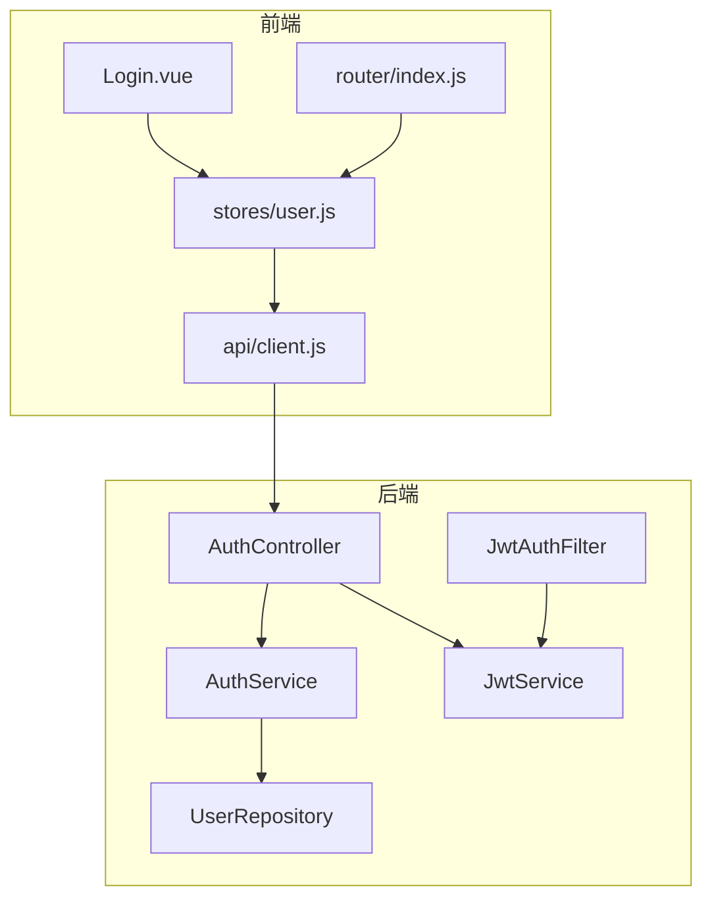
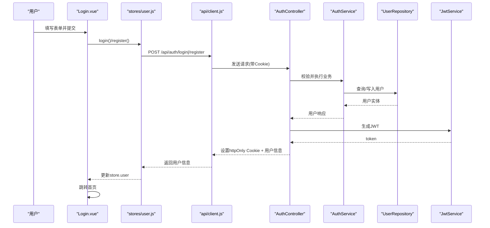
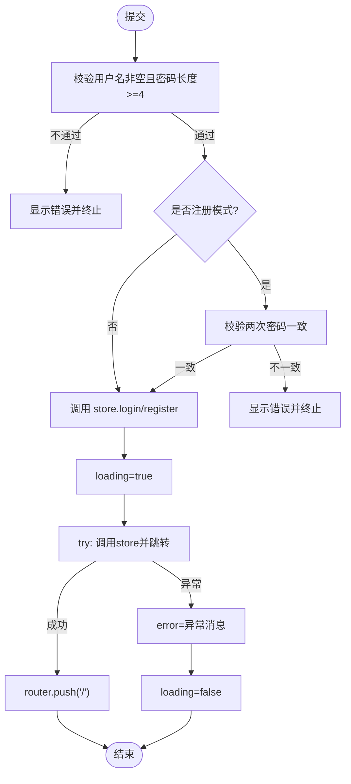
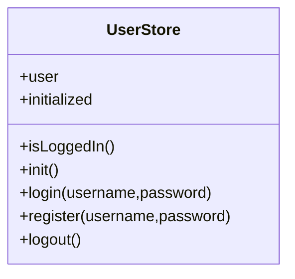
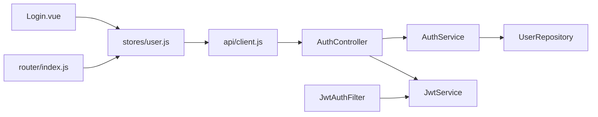

# 认证组件

<cite>
**本文引用的文件**
- [Login.vue](file://suanfa_vue/src/components/common/Login.vue)
- [user.js](file://suanfa_vue/src/stores/user.js)
- [client.js](file://suanfa_vue/src/api/client.js)
- [index.js](file://suanfa_vue/src/router/index.js)
- [AuthController.java](file://backend/src/main/java/com/suanfa/controller/AuthController.java)
- [AuthService.java](file://backend/src/main/java/com/suanfa/service/AuthService.java)
- [JwtService.java](file://backend/src/main/java/com/suanfa/security/JwtService.java)
- [JwtAuthFilter.java](file://backend/src/main/java/com/suanfa/security/JwtAuthFilter.java)
- [UserRepository.java](file://backend/src/main/java/com/suanfa/repository/UserRepository.java)
- [application.yml](file://backend/src/main/resources/application.yml)
</cite>

## 目录
1. [简介](#简介)
2. [项目结构](#项目结构)
3. [核心组件](#核心组件)
4. [架构总览](#架构总览)
5. [详细组件分析](#详细组件分析)
6. [依赖关系分析](#依赖关系分析)
7. [性能与可用性](#性能与可用性)
8. [故障排查指南](#故障排查指南)
9. [结论](#结论)
10. [附录：API 契约与配置](#附录api-契约与配置)

## 简介
本章节面向“登录/注册”认证能力，系统性说明前端表单验证、用户状态管理、错误处理、后端认证 API 集成、JWT 令牌存储、路由跳转逻辑，以及组件复用、样式定制、响应式实现、用户体验优化、可访问性与跨浏览器兼容性等实践。

## 项目结构
认证相关的前后端职责划分如下：
- 前端
  - 页面组件：登录/注册表单（模式切换、本地校验、加载态、错误提示）
  - 状态管理：Pinia store 负责会话恢复、登录/注册/登出动作
  - API 客户端：统一封装 fetch，自动携带 Cookie，统一错误转换
  - 路由守卫：基于 store 的登录态控制受保护页面访问
- 后端
  - 控制器：注册、登录、登出、当前用户信息
  - 服务层：密码加密、用户存在性检查、数据映射
  - JWT：签发与解析，过滤器从 httpOnly Cookie 提取并注入用户 ID
  - 数据库：SQLite 用户表，JDBC 操作

图表来源
- [Login.vue:1-178](file://suanfa_vue/src/components/common/Login.vue#L1-L178)
- [user.js:1-36](file://suanfa_vue/src/stores/user.js#L1-L36)
- [client.js:108-131](file://suanfa_vue/src/api/client.js#L108-L131)
- [index.js:109-120](file://suanfa_vue/src/router/index.js#L109-L120)
- [AuthController.java:15-94](file://backend/src/main/java/com/suanfa/controller/AuthController.java#L15-L94)
- [AuthService.java:10-53](file://backend/src/main/java/com/suanfa/service/AuthService.java#L10-L53)
- [JwtAuthFilter.java:15-49](file://backend/src/main/java/com/suanfa/security/JwtAuthFilter.java#L15-L49)
- [JwtService.java:14-56](file://backend/src/main/java/com/suanfa/security/JwtService.java#L14-L56)

章节来源
- [Login.vue:1-178](file://suanfa_vue/src/components/common/Login.vue#L1-L178)
- [user.js:1-36](file://suanfa_vue/src/stores/user.js#L1-L36)
- [client.js:108-131](file://suanfa_vue/src/api/client.js#L108-L131)
- [index.js:109-120](file://suanfa_vue/src/router/index.js#L109-L120)
- [AuthController.java:15-94](file://backend/src/main/java/com/suanfa/controller/AuthController.java#L15-L94)
- [AuthService.java:10-53](file://backend/src/main/java/com/suanfa/service/AuthService.java#L10-L53)
- [JwtAuthFilter.java:15-49](file://backend/src/main/java/com/suanfa/security/JwtAuthFilter.java#L15-L49)
- [JwtService.java:14-56](file://backend/src/main/java/com/suanfa/security/JwtService.java#L14-L56)

## 核心组件
- 登录/注册表单组件：提供用户名、密码、确认密码输入；支持登录/注册模式切换；本地前置校验；提交时调用 store；成功后跳转首页。
- 用户状态 Store：维护 user 对象与初始化标志；暴露 login/register/logout/init；在应用启动时尝试恢复会话。
- API 客户端：统一请求封装，自动携带 Cookie；认证相关接口包括 register/login/logout/fetchCurrentUser。
- 路由守卫：在进入需要认证的页面之前先恢复会话；未登录则重定向到登录页并保留目标路径。

章节来源
- [Login.vue:16-44](file://suanfa_vue/src/components/common/Login.vue#L16-L44)
- [user.js:4-35](file://suanfa_vue/src/stores/user.js#L4-L35)
- [client.js:108-131](file://suanfa_vue/src/api/client.js#L108-L131)
- [index.js:109-120](file://suanfa_vue/src/router/index.js#L109-L120)

## 架构总览
前后端通过 RESTful API 交互，使用 httpOnly Cookie 传递 JWT，避免 XSS 窃取风险。过滤器在每个请求中解析 Cookie 中的 JWT，将 userId 注入请求属性，供后续接口鉴权使用。

图表来源
- [Login.vue:16-39](file://suanfa_vue/src/components/common/Login.vue#L16-L39)
- [user.js:24-29](file://suanfa_vue/src/stores/user.js#L24-L29)
- [client.js:111-131](file://suanfa_vue/src/api/client.js#L111-L131)
- [AuthController.java:28-52](file://backend/src/main/java/com/suanfa/controller/AuthController.java#L28-L52)
- [AuthService.java:22-43](file://backend/src/main/java/com/suanfa/service/AuthService.java#L22-L43)
- [JwtService.java:28-37](file://backend/src/main/java/com/suanfa/security/JwtService.java#L28-L37)

## 详细组件分析

### 登录/注册表单组件（Login.vue）
- 表单字段与模式
  - 用户名：必填，提交前去除首尾空白
  - 密码：至少 4 位
  - 确认密码：仅在注册模式显示，需与密码一致
- 本地校验与错误提示
  - 空用户名或短密码直接阻止提交并提示
  - 注册模式下两次密码不一致则提示
  - 错误信息以变量形式展示，提交后清空
- 加载状态管理
  - loading 标志在提交时置为 true，按钮禁用并显示“请稍候…”
  - 无论成功或失败，finally 中重置 loading
- 提交流程
  - 根据模式调用 store.login 或 store.register
  - 成功后跳转到首页
  - 捕获异常并转换为友好错误消息
- 模式切换
  - 点击链接在登录/注册之间切换，同时清空错误信息

图表来源
- [Login.vue:16-44](file://suanfa_vue/src/components/common/Login.vue#L16-L44)
- [Login.vue:55-83](file://suanfa_vue/src/components/common/Login.vue#L55-L83)

章节来源
- [Login.vue:16-44](file://suanfa_vue/src/components/common/Login.vue#L16-L44)
- [Login.vue:47-83](file://suanfa_vue/src/components/common/Login.vue#L47-L83)
- [Login.vue:86-177](file://suanfa_vue/src/components/common/Login.vue#L86-L177)

### 用户状态管理（stores/user.js）
- 状态设计
  - user：当前登录用户信息，null 表示未登录
  - initialized：是否已尝试恢复会话，避免重复请求
- 关键动作
  - init：首次进入应用时调用 /auth/me 恢复会话
  - login/register：调用 API 并更新 user
  - logout：调用 /auth/logout 并清空 user
- 派生状态
  - isLoggedIn：基于 user 是否为 null

图表来源
- [user.js:4-35](file://suanfa_vue/src/stores/user.js#L4-L35)

章节来源
- [user.js:4-35](file://suanfa_vue/src/stores/user.js#L4-L35)

### API 客户端（api/client.js）
- 统一请求封装
  - 基础路径 /api
  - credentials: include，确保携带 Cookie
  - 非 2xx 响应抛出包含 status 的错误对象
- 认证接口
  - register/login/logout/fetchCurrentUser
- 降级策略
  - 其他功能具备后端不可用时的本地回退，但认证相关保持严格后端校验

章节来源
- [client.js:30-43](file://suanfa_vue/src/api/client.js#L30-L43)
- [client.js:108-131](file://suanfa_vue/src/api/client.js#L108-L131)

### 路由守卫（router/index.js）
- 全局前置守卫
  - 进入任何路由前先执行 userStore.init() 恢复会话
  - 若目标路由 requiresAuth 且未登录，重定向到登录页并附带 redirect 参数
  - 若目标是 public 且已登录，重定向到首页
- 登录页标记为 public，避免已登录用户重复进入

章节来源
- [index.js:109-120](file://suanfa_vue/src/router/index.js#L109-L120)

### 后端认证控制器与服务（AuthController.java, AuthService.java）
- 控制器
  - POST /api/auth/register：注册新用户，用户名冲突返回 409，否则设置 JWT Cookie 并返回用户信息
  - POST /api/auth/login：登录成功设置 JWT Cookie 并返回用户信息，失败返回 401
  - POST /api/auth/logout：清除 Cookie
  - GET /api/auth/me：读取当前用户，未登录返回 401
- 服务层
  - 注册：校验用户名非空、密码长度；检查用户名唯一；BCrypt 加密后入库
  - 登录：按用户名查找并校验密码
  - 用户查询与响应映射
- 安全
  - 密码使用 BCrypt 加密存储
  - 错误响应统一包装

章节来源
- [AuthController.java:28-71](file://backend/src/main/java/com/suanfa/controller/AuthController.java#L28-L71)
- [AuthService.java:22-51](file://backend/src/main/java/com/suanfa/service/AuthService.java#L22-L51)

### JWT 签发与解析（JwtService.java, JwtAuthFilter.java）
- 签发
  - HS256 签名，subject 为用户 ID，claim 包含 username，过期时间由配置决定
- 解析
  - 解析失败返回 null，用于过滤器判断
- 过滤器
  - 从 httpOnly Cookie 中读取 token 并解析，将 userId 注入 request attribute
  - 仅解析不拦截，具体接口在 Controller 层进行鉴权

章节来源
- [JwtService.java:21-54](file://backend/src/main/java/com/suanfa/security/JwtService.java#L21-L54)
- [JwtAuthFilter.java:20-47](file://backend/src/main/java/com/suanfa/security/JwtAuthFilter.java#L20-L47)

### 数据库与用户模型（UserRepository.java, application.yml）
- 用户表
  - 字段包含 id、username、password_hash、created_at
  - 通过 JdbcTemplate 完成插入与查询
- 配置
  - SQLite 作为开发数据库
  - JWT 密钥与过期天数通过配置项注入
  - CORS 默认允许所有来源（生产应限制）

章节来源
- [UserRepository.java:15-53](file://backend/src/main/java/com/suanfa/repository/UserRepository.java#L15-L53)
- [application.yml:4-24](file://backend/src/main/resources/application.yml#L4-L24)

## 依赖关系分析
- 前端
  - Login.vue 依赖 stores/user.js 与 vue-router
  - stores/user.js 依赖 api/client.js
  - router/index.js 依赖 stores/user.js 进行鉴权
- 后端
  - AuthController 依赖 AuthService 与 JwtService
  - AuthService 依赖 UserRepository 与密码编码器
  - JwtAuthFilter 依赖 JwtService 解析 Cookie

图表来源
- [Login.vue:1-8](file://suanfa_vue/src/components/common/Login.vue#L1-L8)
- [user.js:1-3](file://suanfa_vue/src/stores/user.js#L1-L3)
- [client.js:108-131](file://suanfa_vue/src/api/client.js#L108-L131)
- [index.js:1-3](file://suanfa_vue/src/router/index.js#L1-L3)
- [AuthController.java:15-26](file://backend/src/main/java/com/suanfa/controller/AuthController.java#L15-L26)
- [AuthService.java:10-20](file://backend/src/main/java/com/suanfa/service/AuthService.java#L10-L20)
- [JwtAuthFilter.java:20-29](file://backend/src/main/java/com/suanfa/security/JwtAuthFilter.java#L20-L29)
- [JwtService.java:14-26](file://backend/src/main/java/com/suanfa/security/JwtService.java#L14-L26)

章节来源
- [Login.vue:1-8](file://suanfa_vue/src/components/common/Login.vue#L1-L8)
- [user.js:1-3](file://suanfa_vue/src/stores/user.js#L1-L3)
- [client.js:108-131](file://suanfa_vue/src/api/client.js#L108-L131)
- [index.js:1-3](file://suanfa_vue/src/router/index.js#L1-L3)
- [AuthController.java:15-26](file://backend/src/main/java/com/suanfa/controller/AuthController.java#L15-L26)
- [AuthService.java:10-20](file://backend/src/main/java/com/suanfa/service/AuthService.java#L10-L20)
- [JwtAuthFilter.java:20-29](file://backend/src/main/java/com/suanfa/security/JwtAuthFilter.java#L20-L29)
- [JwtService.java:14-26](file://backend/src/main/java/com/suanfa/security/JwtService.java#L14-L26)

## 性能与可用性
- 网络与并发
  - 登录/注册为短请求，建议避免重复提交（loading 禁用按钮）
  - 会话恢复仅在路由守卫中执行一次，减少重复请求
- 缓存与降级
  - 认证相关不走本地降级，保证安全性
  - 其他功能具备后端不可用时的本地回退，提升可用性
- 安全与合规
  - 密码使用 BCrypt 哈希存储
  - JWT 通过 httpOnly Cookie 传输，降低 XSS 风险
  - 生产环境务必更换 JWT 密钥并限制 CORS

[本节为通用指导，无需特定文件引用]

## 故障排查指南
- 常见问题定位
  - 登录失败：检查用户名/密码是否正确；后端返回 401 表示凭据错误
  - 注册失败：用户名冲突返回 409；参数非法返回 400
  - 未登录访问受保护页面：路由守卫会重定向到登录页
  - 跨域问题：检查后端 CORS 配置与前端请求是否携带 Cookie
- 日志与调试
  - 后端日志级别可调，便于查看认证流程
  - 前端可在 API 客户端错误分支打印 status 与 message

章节来源
- [AuthController.java:28-71](file://backend/src/main/java/com/suanfa/controller/AuthController.java#L28-L71)
- [AuthService.java:22-43](file://backend/src/main/java/com/suanfa/service/AuthService.java#L22-L43)
- [client.js:30-43](file://suanfa_vue/src/api/client.js#L30-L43)
- [application.yml:98-102](file://backend/src/main/resources/application.yml#L98-L102)

## 结论
该认证方案以前端表单校验与状态管理为核心，结合后端严格的凭据校验与 JWT 机制，实现了安全的登录/注册流程。通过 httpOnly Cookie 传递令牌，配合路由守卫保障受保护资源访问。整体实现简洁清晰，具备良好的可扩展性与可维护性。

[本节为总结性内容，无需特定文件引用]

## 附录：API 契约与配置

### 认证 API 定义
- POST /api/auth/register
  - 请求体：{ username, password }
  - 成功：200 返回用户信息；设置 httpOnly Cookie
  - 失败：400 参数非法；409 用户名已存在
- POST /api/auth/login
  - 请求体：{ username, password }
  - 成功：200 返回用户信息；设置 httpOnly Cookie
  - 失败：401 用户名或密码错误
- POST /api/auth/logout
  - 成功：200 清除 Cookie
- GET /api/auth/me
  - 成功：200 返回当前用户
  - 失败：401 未登录或用户不存在

章节来源
- [AuthController.java:28-71](file://backend/src/main/java/com/suanfa/controller/AuthController.java#L28-L71)
- [client.js:111-131](file://suanfa_vue/src/api/client.js#L111-L131)

### 配置要点
- JWT
  - 密钥与过期天数通过配置注入；生产环境必须替换默认值
- CORS
  - 开发默认全开；生产应限制为可信域名
- 数据库
  - 开发使用 SQLite；生产可替换为持久化数据库

章节来源
- [application.yml:18-27](file://backend/src/main/resources/application.yml#L18-L27)