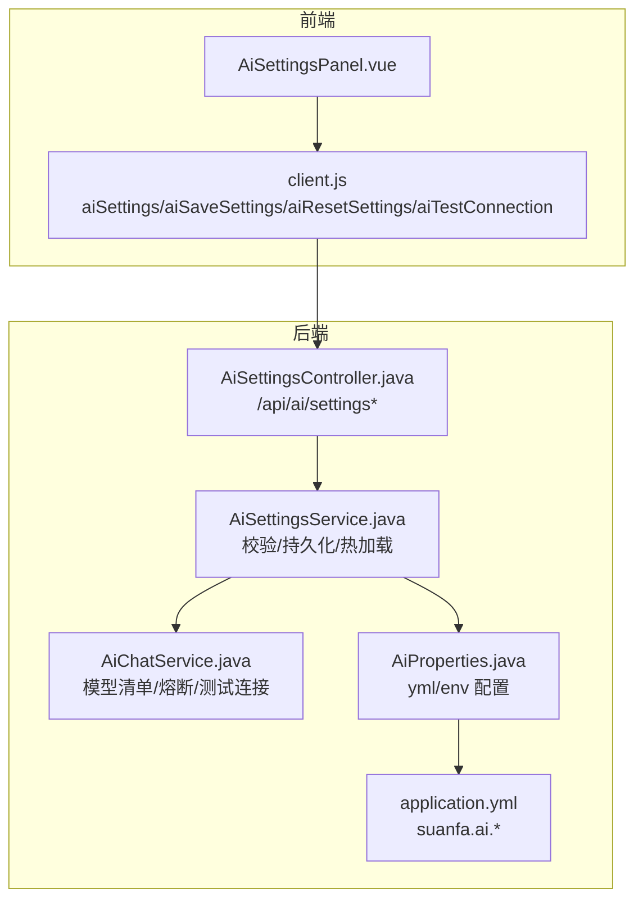
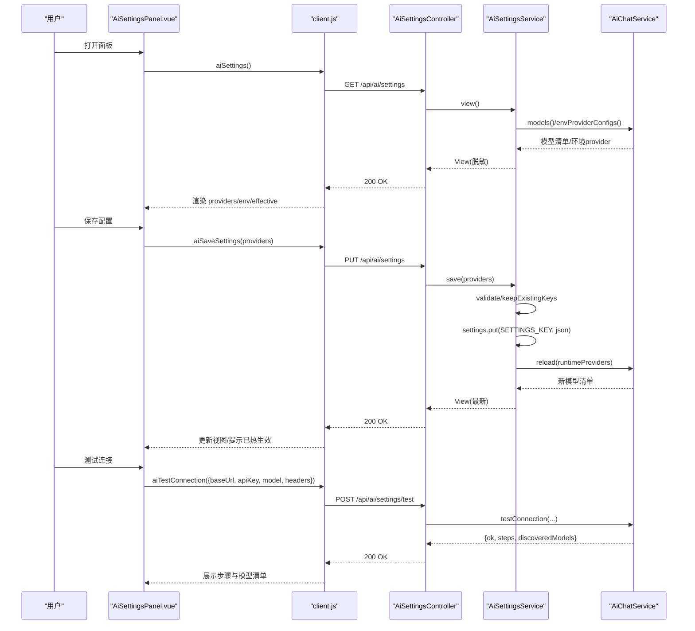
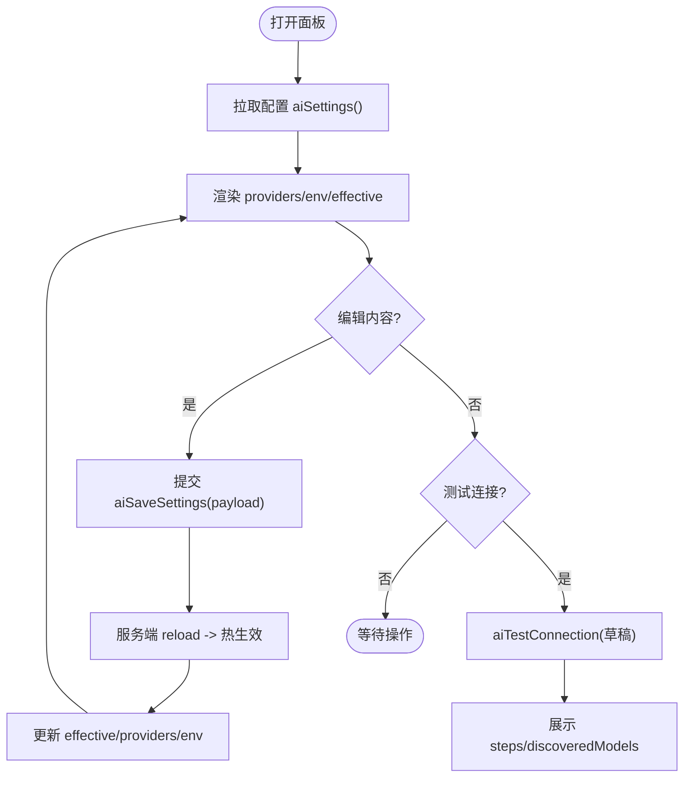
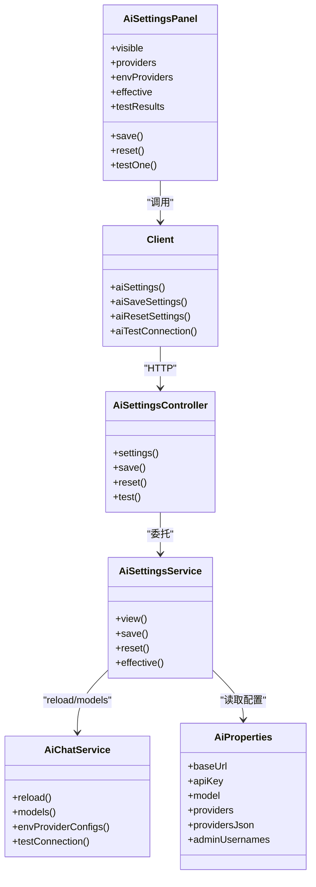

# 设置组件

<cite>
**本文引用的文件**
- [AiSettingsPanel.vue](file://suanfa_vue/src/components/common/AiSettingsPanel.vue)
- [client.js](file://suanfa_vue/src/api/client.js)
- [AiSettingsController.java](file://backend/src/main/java/com/suanfa/controller/AiSettingsController.java)
- [AiSettingsService.java](file://backend/src/main/java/com/suanfa/service/AiSettingsService.java)
- [AiSettingsDto.java](file://backend/src/main/java/com/suanfa/dto/AiSettingsDto.java)
- [AiChatService.java](file://backend/src/main/java/com/suanfa/service/AiChatService.java)
- [AiProperties.java](file://backend/src/main/java/com/suanfa/config/AiProperties.java)
- [application.yml](file://backend/src/main/resources/application.yml)
</cite>

## 目录
1. [简介](#简介)
2. [项目结构](#项目结构)
3. [核心组件](#核心组件)
4. [架构总览](#架构总览)
5. [详细组件分析](#详细组件分析)
6. [依赖关系分析](#依赖关系分析)
7. [性能与可用性](#性能与可用性)
8. [故障排查指南](#故障排查指南)
9. [结论](#结论)
10. [附录：扩展、主题与版本兼容](#附录：扩展主题与版本兼容)

## 简介
本组件为“AI 中转站配置面板”，面向管理员，用于在页面上配置第三方 OpenAI 兼容端点（地址、API Key、模型清单等），并支持测试连接、保存即热生效。它覆盖以下能力：
- 模型配置管理：多中转站、多模型、默认模型、预算/超时/温度、推理档位、是否对用户可见。
- API 密钥设置：支持留空沿用、清除、脱敏显示。
- 参数调优界面：max_tokens、timeout_seconds、temperature、reasoning_effort 等。
- 表单验证：前端基础校验 + 后端严格校验与范围限制。
- 配置持久化：保存到数据库 app_settings，启动时自动加载。
- 实时预览：当前生效模型表、测试结果步骤、熔断倒计时。
- 与后端设置 API 交互：获取、保存、重置、测试连接。
- 配置同步机制：保存后调用服务层 reload，内存中模型清单即时重建。
- 错误处理策略：统一异常包装、状态码映射、用户友好提示。
- 安全性考虑：仅管理员可访问、token 脱敏、白名单控制、请求头数量限制。
- 配置导入导出：页面配置与环境变量 JSON 同构，便于互拷。
- 版本兼容性：reset 路由兼容新旧写法；旧写法 legacy provider 展示。

## 项目结构
前端通过 Vue 组件 AiSettingsPanel 提供可视化配置界面，调用 client.js 中的封装函数与后端 /api/ai/settings* 交互。后端由控制器 AiSettingsController 暴露 REST 接口，服务层 AiSettingsService 负责校验、持久化与热加载，AiChatService 维护运行时模型清单与熔断，配置来源来自 AiProperties 与 application.yml。

图表来源
- [AiSettingsPanel.vue:1-120](file://suanfa_vue/src/components/common/AiSettingsPanel.vue#L1-L120)
- [client.js:387-424](file://suanfa_vue/src/api/client.js#L387-L424)
- [AiSettingsController.java:48-109](file://backend/src/main/java/com/suanfa/controller/AiSettingsController.java#L48-L109)
- [AiSettingsService.java:106-205](file://backend/src/main/java/com/suanfa/service/AiSettingsService.java#L106-L205)
- [AiChatService.java:117-144](file://backend/src/main/java/com/suanfa/service/AiChatService.java#L117-L144)
- [AiProperties.java:25-57](file://backend/src/main/java/com/suanfa/config/AiProperties.java#L25-L57)
- [application.yml:28-57](file://backend/src/main/resources/application.yml#L28-L57)

章节来源
- [AiSettingsPanel.vue:1-120](file://suanfa_vue/src/components/common/AiSettingsPanel.vue#L1-L120)
- [client.js:387-424](file://suanfa_vue/src/api/client.js#L387-L424)
- [AiSettingsController.java:48-109](file://backend/src/main/java/com/suanfa/controller/AiSettingsController.java#L48-L109)
- [AiSettingsService.java:106-205](file://backend/src/main/java/com/suanfa/service/AiSettingsService.java#L106-L205)
- [AiChatService.java:117-144](file://backend/src/main/java/com/suanfa/service/AiChatService.java#L117-L144)
- [AiProperties.java:25-57](file://backend/src/main/java/com/suanfa/config/AiProperties.java#L25-L57)
- [application.yml:28-57](file://backend/src/main/resources/application.yml#L28-L57)

## 核心组件
- 前端面板：AiSettingsPanel.vue
  - 功能：加载配置、编辑 providers/models、测试连接、保存/重置、展示有效模型与环境变量配置。
  - 关键状态：providers、envProviders、effective、testResults、testing、hasRuntime。
  - 交互：watch(visible) 打开时拉取配置；保存后触发 saved 事件通知父级刷新。
- 前端 API 客户端：client.js
  - 封装 aiSettings、aiSaveSettings、aiResetSettings、aiTestConnection，统一错误处理与凭据携带。
- 后端控制器：AiSettingsController.java
  - 暴露 GET/PUT/POST /api/ai/settings*，鉴权（登录+管理员白名单），调用服务层。
- 后端服务：AiSettingsService.java
  - 校验与归一化、持久化到 app_settings、热加载模型清单、视图组装（token 脱敏）。
- 运行时模型：AiChatService.java
  - 合并多源配置、构建 ModelSpec 列表、熔断（cooldown）、测试连接、环境 provider 读取。
- 配置属性：AiProperties.java + application.yml
  - 单上游/多上游、环境变量注入、管理员白名单、速率限制、知识增强开关。

章节来源
- [AiSettingsPanel.vue:1-324](file://suanfa_vue/src/components/common/AiSettingsPanel.vue#L1-L324)
- [client.js:387-424](file://suanfa_vue/src/api/client.js#L387-L424)
- [AiSettingsController.java:48-109](file://backend/src/main/java/com/suanfa/controller/AiSettingsController.java#L48-L109)
- [AiSettingsService.java:167-205](file://backend/src/main/java/com/suanfa/service/AiSettingsService.java#L167-L205)
- [AiChatService.java:117-144](file://backend/src/main/java/com/suanfa/service/AiChatService.java#L117-L144)
- [AiProperties.java:25-57](file://backend/src/main/java/com/suanfa/config/AiProperties.java#L25-L57)
- [application.yml:28-57](file://backend/src/main/resources/application.yml#L28-L57)

## 架构总览
设置面板的端到端流程如下：
- 打开面板 → 调用 GET /api/ai/settings → 返回 providers（含 origin=runtime/env）、env、effective。
- 编辑 providers/models → 点击“保存” → PUT /api/ai/settings → 服务层校验、写入 app_settings、reload → 返回最新视图。
- 点击“清空” → POST /api/ai/settings/reset → 删除页面配置 → 回退环境变量 → 返回视图。
- 点击“测试连接” → POST /api/ai/settings/test → 尝试拉模型清单与小对话 → 返回 steps/discoveredModels。

图表来源
- [AiSettingsPanel.vue:105-120](file://suanfa_vue/src/components/common/AiSettingsPanel.vue#L105-L120)
- [client.js:387-424](file://suanfa_vue/src/api/client.js#L387-L424)
- [AiSettingsController.java:48-109](file://backend/src/main/java/com/suanfa/controller/AiSettingsController.java#L48-L109)
- [AiSettingsService.java:167-205](file://backend/src/main/java/com/suanfa/service/AiSettingsService.java#L167-L205)
- [AiChatService.java:117-144](file://backend/src/main/java/com/suanfa/service/AiChatService.java#L117-L144)

## 详细组件分析

### 前端面板：AiSettingsPanel.vue
- 数据流
  - visible 变化时触发 reload，拉取当前配置（providers、env、effective）。
  - providers 为可编辑项（origin=runtime），envProviders 为只读（origin≠runtime）。
  - effective 为合并后的生效模型（含降级顺序、可用状态、熔断倒计时）。
- 表单与验证
  - 必填字段：baseUrl（以 http/https 开头）、model name（非空）。
  - 数值范围：maxTokens、timeoutSeconds 在前端做数字输入，后端进一步校验范围。
  - 头部键值对：动态增删，默认添加 X-Title。
  - 主模型唯一性：setPrimary 保证全局唯一 primary。
- 保存与重置
  - payload 构造时过滤空模型名、清理空格、转换 null/空串为 null 或保留。
  - save 成功后更新 hasRuntime、effective、envProviders，并 emit('saved')。
  - reset 使用专用路由，兼容旧版后端。
- 测试连接
  - 传草稿 baseUrl/apiKey/model/headers，不要求已保存。
  - 结果包含 steps（连通性检查、延迟、模型数、上游实际模型名、回复片段）与 discoveredModels（可一键加入）。
- 实时预览
  - “当前生效的模型”表格展示名称、中转站、地址、来源、预算、超时、状态、是否对用户可见。
  - 环境变量区展示 AI_BASE_URL/AI_API_KEY/AI_MODEL/AI_FALLBACK_MODELS/AI_PROVIDERS_JSON 的存在性与掩码。

图表来源
- [AiSettingsPanel.vue:105-120](file://suanfa_vue/src/components/common/AiSettingsPanel.vue#L105-L120)
- [AiSettingsPanel.vue:195-242](file://suanfa_vue/src/components/common/AiSettingsPanel.vue#L195-L242)
- [AiSettingsPanel.vue:246-319](file://suanfa_vue/src/components/common/AiSettingsPanel.vue#L246-L319)

章节来源
- [AiSettingsPanel.vue:1-324](file://suanfa_vue/src/components/common/AiSettingsPanel.vue#L1-L324)

### 后端控制器：AiSettingsController.java
- 接口定义
  - GET /api/ai/settings：返回当前配置（页面配置+出厂配置+生效模型，token 脱敏）。
  - PUT /api/ai/settings：保存页面配置并热生效；{reset:true} 等价于清空。
  - POST /api/ai/settings/reset：清空页面配置，回退 yml/环境变量。
  - POST /api/ai/settings/test：测试连接，支持未保存草稿。
- 鉴权
  - requireAdmin：未登录返回 401；非管理员返回 403。
- 错误处理
  - 保存失败：IllegalArgumentException -> 400；其他异常 -> 500 并包装消息。
  - 测试异常：返回 ok=false 与 steps=[]。

章节来源
- [AiSettingsController.java:48-109](file://backend/src/main/java/com/suanfa/controller/AiSettingsController.java#L48-L109)
- [AiSettingsController.java:113-128](file://backend/src/main/java/com/suanfa/controller/AiSettingsController.java#L113-L128)

### 后端服务：AiSettingsService.java
- 配置存储
  - key = "ai.providers"，value = providers JSON 数组。
  - 应用就绪时 applySavedOnStartup 加载页面配置，失败则忽略并继续用 env/yml。
- 视图组装
  - view() 合并 runtimeProviders 与 envProviderConfigs，并合成 legacyView（旧写法）。
  - effective() 基于 AiChatService.models() 生成当前生效模型（含降级顺序、可用性与熔断）。
- 写入与热加载
  - save() 校验并归一化，写入数据库，applySaved() 重新解析并调用 aiChatService.reload()。
  - reset() 删除 key 并 reload。
- 校验规则
  - 最多 8 个 provider、每个 provider 最多 30 个模型、最多 8 条自定义请求头。
  - baseUrl 必须 http/https；id 合法 slug；maxTokens/timeoutSeconds 范围限制。
  - 全站最多一个 primary；userVisible 默认 true。
- 安全与脱敏
  - mask() 对 token 脱敏（首尾各 4 位 + 长度）。
  - keepExistingKeys() 支持留空沿用、__CLEAR__ 清除。

章节来源
- [AiSettingsService.java:69-146](file://backend/src/main/java/com/suanfa/service/AiSettingsService.java#L69-L146)
- [AiSettingsService.java:167-205](file://backend/src/main/java/com/suanfa/service/AiSettingsService.java#L167-L205)
- [AiSettingsService.java:218-332](file://backend/src/main/java/com/suanfa/service/AiSettingsService.java#L218-L332)
- [AiSettingsService.java:334-405](file://backend/src/main/java/com/suanfa/service/AiSettingsService.java#L334-L405)

### DTO 与配置属性
- AiSettingsDto.java
  - Provider/Model：描述中转站与模型字段（enabled、primary、userVisible、reasoningEffort、note 等）。
  - SaveRequest/TestRequest：保存与测试的请求体。
  - View/ProviderView/Env/EffectiveModel：响应结构，token 脱敏、来源标注、生效模型详情。
- AiProperties.java + application.yml
  - suanfa.ai.* 配置项：base-url、api-key、model、fallback-models、timeout/max-tokens/temperature、knowledge-enabled、rate-per-minute、admin-usernames。
  - 多中转站：providers-json（环境变量友好）与 providers（yml 列表）合并。
  - 旧写法兼容：legacy provider 展示。

章节来源
- [AiSettingsDto.java:20-128](file://backend/src/main/java/com/suanfa/dto/AiSettingsDto.java#L20-L128)
- [AiProperties.java:25-57](file://backend/src/main/java/com/suanfa/config/AiProperties.java#L25-L57)
- [application.yml:28-57](file://backend/src/main/resources/application.yml#L28-L57)

### 运行时模型与熔断：AiChatService.java
- 模型合并
  - resolveModels() 按优先级合并：页面配置 > providers-json > providers > 旧写法。
  - 墓碑机制：页面 enabled=false 的模型屏蔽同名 env/yml 模型。
- 熔断与降级
  - cooldown 表记录 provider/name -> 恢复时间；冷却期间跳过该模型。
  - 测试连接与调用失败会进入冷却，避免频繁重试。
- 环境 provider 读取
  - envProviderConfigs() 解析 providers-json 与 yml providers，供设置页展示“出厂配置”。

章节来源
- [AiChatService.java:117-144](file://backend/src/main/java/com/suanfa/service/AiChatService.java#L117-L144)
- [AiChatService.java:180-200](file://backend/src/main/java/com/suanfa/service/AiChatService.java#L180-L200)

## 依赖关系分析
- 前端依赖
  - AiSettingsPanel.vue 依赖 client.js 的 aiSettings/aiSaveSettings/aiResetSettings/aiTestConnection。
- 后端依赖
  - AiSettingsController 依赖 AiSettingsService 与 AiChatService。
  - AiSettingsService 依赖 AppSettingsRepository（持久化）、AiChatService（reload）、AiProperties（配置）、AuthService（管理员判断）。
  - AiChatService 依赖 AiProperties（配置）、AiKnowledgeService（知识增强）。
- 外部集成
  - 第三方 OpenAI 兼容端点（通过 baseUrl 与 headers 路由）。
  - SQLite（app_settings 表）与 MongoDB（其他业务数据）。

图表来源
- [AiSettingsPanel.vue:1-120](file://suanfa_vue/src/components/common/AiSettingsPanel.vue#L1-L120)
- [client.js:387-424](file://suanfa_vue/src/api/client.js#L387-L424)
- [AiSettingsController.java:48-109](file://backend/src/main/java/com/suanfa/controller/AiSettingsController.java#L48-L109)
- [AiSettingsService.java:106-205](file://backend/src/main/java/com/suanfa/service/AiSettingsService.java#L106-L205)
- [AiChatService.java:117-144](file://backend/src/main/java/com/suanfa/service/AiChatService.java#L117-L144)
- [AiProperties.java:25-57](file://backend/src/main/java/com/suanfa/config/AiProperties.java#L25-L57)

章节来源
- [AiSettingsPanel.vue:1-120](file://suanfa_vue/src/components/common/AiSettingsPanel.vue#L1-L120)
- [client.js:387-424](file://suanfa_vue/src/api/client.js#L387-L424)
- [AiSettingsController.java:48-109](file://backend/src/main/java/com/suanfa/controller/AiSettingsController.java#L48-L109)
- [AiSettingsService.java:106-205](file://backend/src/main/java/com/suanfa/service/AiSettingsService.java#L106-L205)
- [AiChatService.java:117-144](file://backend/src/main/java/com/suanfa/service/AiChatService.java#L117-L144)
- [AiProperties.java:25-57](file://backend/src/main/java/com/suanfa/config/AiProperties.java#L25-L57)

## 性能与可用性
- 热加载：保存后立即 reload，无需重启服务，不影响正在进行的对话。
- 熔断：对失败模型设置冷却期，减少无效重试，提升整体可用性。
- 并发安全：reload/save/reset 使用 synchronized 保证一致性。
- 资源限制：provider/model/header 数量上限，防止滥用。
- 降级策略：未配置或不可用时，前端降级为本地答疑模式。

[本节为通用指导，不直接分析具体文件]

## 故障排查指南
- 401/403
  - 未登录或非管理员：控制器 requireAdmin 返回 401/403，前端隐藏入口或提示。
- 400
  - 表单校验失败：如 baseUrl 非法、id 重复、maxTokens/timeout 越界、header 过多。
- 500
  - 保存异常：序列化失败或未知异常，查看后端日志。
- 测试连接失败
  - 检查 baseUrl、apiKey、headers、网络可达性；查看 steps 中的错误与延迟。
- 模型不可用
  - 查看 effective 表格中的 usable 与 cooldownSeconds；确认 userVisible 与 primary 设置。
- 环境变量冲突
  - 使用墓碑（enabled=false）屏蔽同名 env 模型；或在页面配置中覆盖。

章节来源
- [AiSettingsController.java:113-128](file://backend/src/main/java/com/suanfa/controller/AiSettingsController.java#L113-L128)
- [AiSettingsService.java:218-332](file://backend/src/main/java/com/suanfa/service/AiSettingsService.java#L218-L332)
- [AiSettingsPanel.vue:195-242](file://suanfa_vue/src/components/common/AiSettingsPanel.vue#L195-L242)

## 结论
设置组件提供了完整的管理员级 AI 中转站配置能力，涵盖模型管理、密钥设置、参数调优、表单验证、持久化、实时预览、热加载、错误处理与安全控制。通过前后端协作与多源配置合并，实现了高可用与易维护的 AI 助教基础设施。

[本节为总结，不直接分析具体文件]

## 附录：扩展、主题与版本兼容
- 组件扩展模式
  - 新增 provider/model 字段：在 AiSettingsDto.Model/Provider 与 AiProperties.Model/Provider 中添加字段，并在 AiSettingsService.validate/toView 中处理。
  - 新增测试步骤：在 AiChatService.testConnection 中增加步骤逻辑，前端 AiSettingsPanel 自动渲染。
- 主题定制选项
  - 样式基于 CSS 变量（--surface、--border-1、--text-1 等），可在 theme.css 中调整。
- 用户偏好存储
  - 当前配置存储在数据库 app_settings；如需用户级偏好，可扩展 key 前缀或新增表。
- 安全性考虑
  - 仅管理员可访问；token 脱敏；白名单 admin-usernames；请求头数量限制；URL 协议校验。
- 配置导入导出
  - 页面配置与 AI_PROVIDERS_JSON 同构，可直接复制粘贴；legacy provider 用于旧写法兼容。
- 版本兼容性管理
  - reset 路由兼容新旧写法；旧版无 /settings/reset 时回退 PUT {reset:true}。
  - 旧写法（AI_BASE_URL/AI_MODEL/AI_FALLBACK_MODELS）仍被识别并展示为 legacy provider。

章节来源
- [AiSettingsDto.java:20-128](file://backend/src/main/java/com/suanfa/dto/AiSettingsDto.java#L20-L128)
- [AiProperties.java:25-57](file://backend/src/main/java/com/suanfa/config/AiProperties.java#L25-L57)
- [application.yml:28-57](file://backend/src/main/resources/application.yml#L28-L57)
- [client.js:407-416](file://suanfa_vue/src/api/client.js#L407-L416)