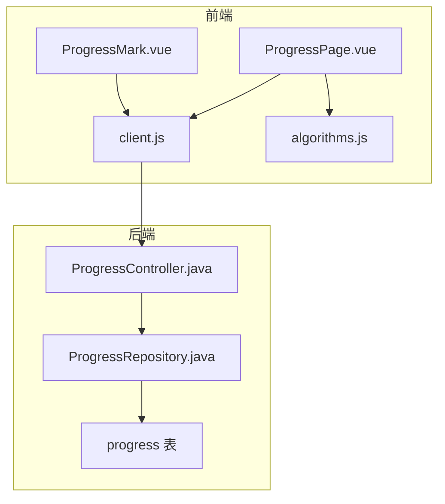
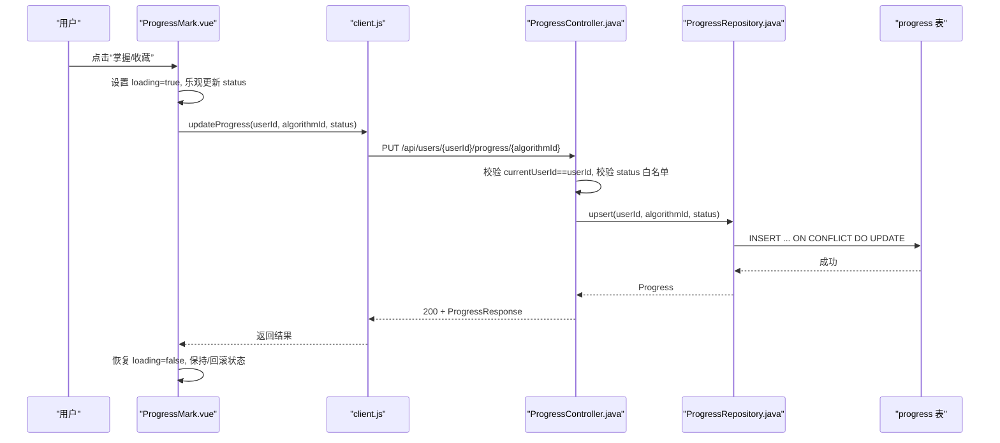
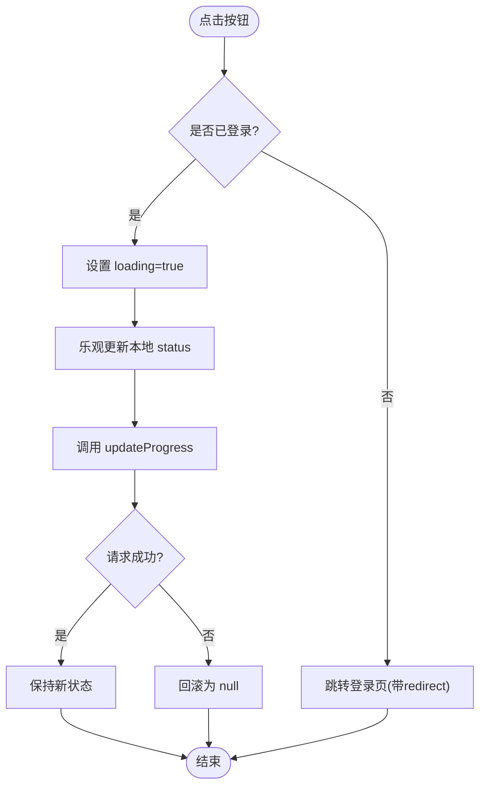
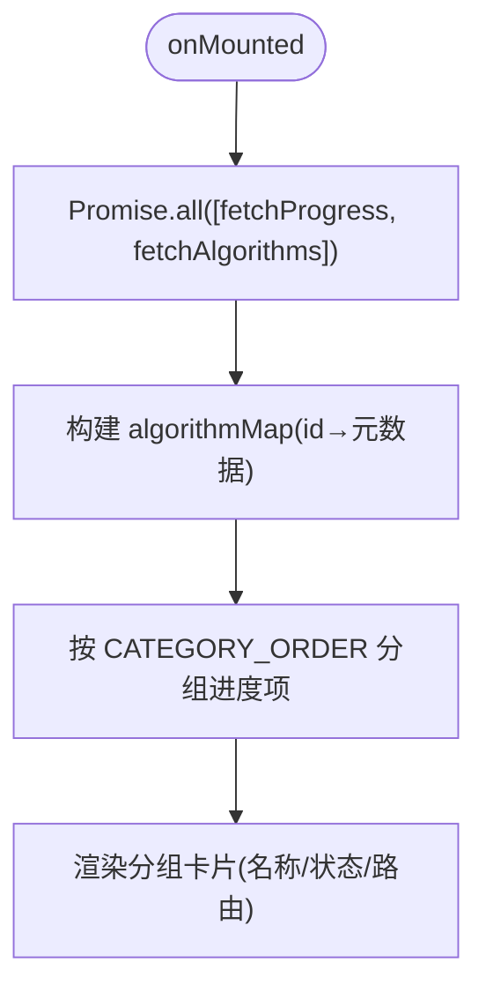
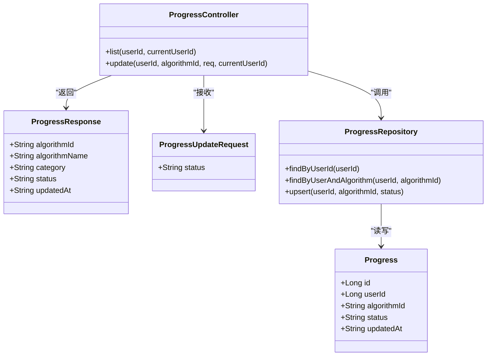
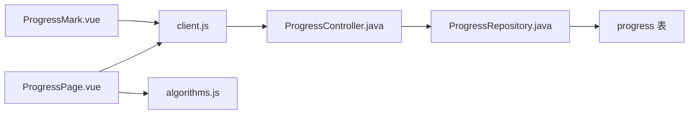

# 进度组件

<cite>
**本文引用的文件**
- [ProgressMark.vue](file://suanfa_vue/src/components/common/ProgressMark.vue)
- [ProgressPage.vue](file://suanfa_vue/src/components/common/ProgressPage.vue)
- [client.js](file://suanfa_vue/src/api/client.js)
- [algorithms.js](file://suanfa_vue/src/data/algorithms.js)
- [ProgressController.java](file://backend/src/main/java/com/suanfa/controller/ProgressController.java)
- [ProgressRepository.java](file://backend/src/main/java/com/suanfa/repository/ProgressRepository.java)
- [Progress.java](file://backend/src/main/java/com/suanfa/entity/Progress.java)
- [ProgressResponse.java](file://backend/src/main/java/com/suanfa/dto/ProgressResponse.java)
- [ProgressUpdateRequest.java](file://backend/src/main/java/com/suanfa/dto/ProgressUpdateRequest.java)
</cite>

## 目录
1. [简介](#简介)
2. [项目结构](#项目结构)
3. [核心组件](#核心组件)
4. [架构总览](#架构总览)
5. [详细组件分析](#详细组件分析)
6. [依赖关系分析](#依赖关系分析)
7. [性能与缓存](#性能与缓存)
8. [故障排查指南](#故障排查指南)
9. [结论](#结论)
10. [附录：定制、主题与无障碍](#附录定制主题与无障碍)

## 简介
本章节面向“学习进度标记”能力，覆盖以下方面：
- 状态管理：前端本地状态与后端持久化的同步策略
- 视觉反馈：按钮高亮、分类标签颜色、卡片悬浮动效
- 动画效果：过渡与交互反馈（如 hover、active）
- 用户操作响应：点击切换状态、未登录跳转登录页
- 数据持久化与同步：前后端接口、并发更新与一致性
- 与学习系统集成：详情页入口、进度页面分组展示、统计与导航
- 计算逻辑：按分类分组、状态映射、路由关联
- 定制选项、主题适配、无障碍支持
- 性能优化：请求合并、降级回退、渲染优化

## 项目结构
进度相关的前后端职责划分如下：
- 前端
  - ProgressMark.vue：算法详情页的“掌握/收藏”标记按钮
  - ProgressPage.vue：我的学习进度页面，按分类展示已学/收藏条目
  - client.js：统一 API 客户端，封装进度读取与更新
  - algorithms.js：算法元数据与分类定义（作为单一数据源）
- 后端
  - ProgressController.java：REST 接口，校验权限与状态，返回进度信息
  - ProgressRepository.java：JDBC 访问 progress 表，upsert 实现幂等更新
  - Progress.java / ProgressResponse.java / ProgressUpdateRequest.java：实体与 DTO

图表来源
- [ProgressMark.vue:1-49](file://suanfa_vue/src/components/common/ProgressMark.vue#L1-L49)
- [ProgressPage.vue:1-59](file://suanfa_vue/src/components/common/ProgressPage.vue#L1-L59)
- [client.js:137-146](file://suanfa_vue/src/api/client.js#L137-L146)
- [ProgressController.java:16-59](file://backend/src/main/java/com/suanfa/controller/ProgressController.java#L16-L59)
- [ProgressRepository.java:27-49](file://backend/src/main/java/com/suanfa/repository/ProgressRepository.java#L27-L49)

章节来源
- [ProgressMark.vue:1-118](file://suanfa_vue/src/components/common/ProgressMark.vue#L1-L118)
- [ProgressPage.vue:1-177](file://suanfa_vue/src/components/common/ProgressPage.vue#L1-L177)
- [client.js:137-146](file://suanfa_vue/src/api/client.js#L137-L146)
- [algorithms.js:779-800](file://suanfa_vue/src/data/algorithms.js#L779-L800)
- [ProgressController.java:16-74](file://backend/src/main/java/com/suanfa/controller/ProgressController.java#L16-L74)
- [ProgressRepository.java:1-51](file://backend/src/main/java/com/suanfa/repository/ProgressRepository.java#L1-L51)

## 核心组件
- 进度标记按钮（ProgressMark.vue）
  - 功能：在算法详情页提供“掌握/收藏”两个状态切换；未登录时引导登录；加载期间禁用按钮
  - 状态：status（learned/favorited/null）、loading
  - 数据流：初始化拉取当前用户进度列表并定位当前算法的状态；点击后调用更新接口
- 进度页面（ProgressPage.vue）
  - 功能：并行拉取用户进度与算法清单，按分类分组展示，显示名称、状态、路由
  - 计算：algorithmMap、groups（按分类顺序过滤空组），statusText 映射中文文案
- API 客户端（client.js）
  - 功能：fetchProgress、updateProgress 封装；全局后端可用性探测与降级策略（对其它模块有效，进度接口走真实后端）
- 后端控制器（ProgressController.java）
  - 功能：GET 列出某用户进度；PUT 更新单条进度；权限校验、状态白名单校验、算法存在性校验
- 数据访问（ProgressRepository.java）
  - 功能：按用户查询、按用户+算法查找、upsert（存在则更新状态与时间，否则插入）

章节来源
- [ProgressMark.vue:1-49](file://suanfa_vue/src/components/common/ProgressMark.vue#L1-L49)
- [ProgressPage.vue:1-59](file://suanfa_vue/src/components/common/ProgressPage.vue#L1-L59)
- [client.js:137-146](file://suanfa_vue/src/api/client.js#L137-L146)
- [ProgressController.java:16-59](file://backend/src/main/java/com/suanfa/controller/ProgressController.java#L16-L59)
- [ProgressRepository.java:27-49](file://backend/src/main/java/com/suanfa/repository/ProgressRepository.java#L27-L49)

## 架构总览
下图展示了从用户点击到数据落库的完整链路，以及错误分支处理。

图表来源
- [ProgressMark.vue:30-48](file://suanfa_vue/src/components/common/ProgressMark.vue#L30-L48)
- [client.js:141-146](file://suanfa_vue/src/api/client.js#L141-L146)
- [ProgressController.java:43-59](file://backend/src/main/java/com/suanfa/controller/ProgressController.java#L43-L59)
- [ProgressRepository.java:39-49](file://backend/src/main/java/com/suanfa/repository/ProgressRepository.java#L39-L49)

## 详细组件分析

### 进度标记按钮（ProgressMark.vue）
- 状态管理
  - 初始化：若已登录，拉取用户全部进度，定位当前算法的 status
  - 切换逻辑：点击后先乐观更新本地 status，再调用后端；失败时回滚为 null
  - 未登录：跳转到登录页并携带 redirect 参数
- 视觉反馈
  - 按钮样式：默认边框与浅色背景；hover 时边框与文字色变化
  - 激活态：根据 learned/favorited 使用不同背景色；disabled 时降低透明度
- 动画效果
  - CSS transition 用于 hover/active 过渡，提升交互顺滑度
- 与系统集成的注意点
  - 该组件通过 props.algorithmId 绑定具体算法；如需在详情页顶部展示，可在详情页模板中引入并传入算法 id

图表来源
- [ProgressMark.vue:17-48](file://suanfa_vue/src/components/common/ProgressMark.vue#L17-L48)

章节来源
- [ProgressMark.vue:1-118](file://suanfa_vue/src/components/common/ProgressMark.vue#L1-L118)

### 进度页面（ProgressPage.vue）
- 数据获取
  - 并行请求：同时拉取用户进度与算法清单，减少首屏等待
  - 错误处理：捕获异常并展示错误提示
- 分组与展示
  - 使用算法分类顺序（CATEGORY_ORDER）与标签（CATEGORY_LABELS）保证展示一致
  - 将进度项按算法 category 分组，过滤空组，生成 groups
  - 每个卡片包含名称、状态标签、路由链接
- 状态文本映射
  - learning → 学习中，learned → 已掌握，favorited → 已收藏

图表来源
- [ProgressPage.vue:14-58](file://suanfa_vue/src/components/common/ProgressPage.vue#L14-L58)
- [algorithms.js:779-800](file://suanfa_vue/src/data/algorithms.js#L779-L800)

章节来源
- [ProgressPage.vue:1-177](file://suanfa_vue/src/components/common/ProgressPage.vue#L1-L177)
- [algorithms.js:779-800](file://suanfa_vue/src/data/algorithms.js#L779-L800)

### 后端接口与数据层
- 控制器（ProgressController.java）
  - GET /api/users/{userId}/progress：仅本人可读，返回进度列表（含算法名与分类）
  - PUT /api/users/{userId}/progress/{algorithmId}：仅本人可写，校验 status 白名单，校验算法存在，upsert 保存
- 仓库（ProgressRepository.java）
  - findByUserId：按用户查询并按更新时间倒序
  - findByUserAndAlgorithm：精确查找
  - upsert：SQLite 语法实现“存在即更新，不存在则插入”，并返回最新记录
- 实体与 DTO
  - Progress：id、userId、algorithmId、status、updatedAt
  - ProgressResponse：algorithmId、algorithmName、category、status、updatedAt
  - ProgressUpdateRequest：status

图表来源
- [ProgressController.java:16-74](file://backend/src/main/java/com/suanfa/controller/ProgressController.java#L16-L74)
- [ProgressRepository.java:1-51](file://backend/src/main/java/com/suanfa/repository/ProgressRepository.java#L1-L51)
- [Progress.java:1-11](file://backend/src/main/java/com/suanfa/entity/Progress.java#L1-L11)
- [ProgressResponse.java:1-11](file://backend/src/main/java/com/suanfa/dto/ProgressResponse.java#L1-L11)
- [ProgressUpdateRequest.java:1-6](file://backend/src/main/java/com/suanfa/dto/ProgressUpdateRequest.java#L1-L6)

章节来源
- [ProgressController.java:16-74](file://backend/src/main/java/com/suanfa/controller/ProgressController.java#L16-L74)
- [ProgressRepository.java:1-51](file://backend/src/main/java/com/suanfa/repository/ProgressRepository.java#L1-L51)
- [Progress.java:1-11](file://backend/src/main/java/com/suanfa/entity/Progress.java#L1-L11)
- [ProgressResponse.java:1-11](file://backend/src/main/java/com/suanfa/dto/ProgressResponse.java#L1-L11)
- [ProgressUpdateRequest.java:1-6](file://backend/src/main/java/com/suanfa/dto/ProgressUpdateRequest.java#L1-L6)

## 依赖关系分析
- 前端依赖
  - ProgressMark.vue 依赖 userStore（登录态）、router（跳转）、client.js（网络）
  - ProgressPage.vue 依赖 algorithms.js（分类与顺序）、client.js（网络）
- 后端依赖
  - ProgressController 依赖 ProgressRepository、AlgorithmRepository（校验算法存在）
  - ProgressRepository 依赖 JdbcTemplate 与 SQLite 方言（datetime('now','localtime')）
- 耦合与内聚
  - 进度模块内聚良好：UI 与数据层通过清晰接口解耦
  - 潜在循环依赖：无直接循环；注意避免在 client.js 中引入业务组件

图表来源
- [ProgressMark.vue:1-49](file://suanfa_vue/src/components/common/ProgressMark.vue#L1-L49)
- [ProgressPage.vue:1-59](file://suanfa_vue/src/components/common/ProgressPage.vue#L1-L59)
- [client.js:137-146](file://suanfa_vue/src/api/client.js#L137-L146)
- [ProgressController.java:16-59](file://backend/src/main/java/com/suanfa/controller/ProgressController.java#L16-L59)
- [ProgressRepository.java:27-49](file://backend/src/main/java/com/suanfa/repository/ProgressRepository.java#L27-L49)

章节来源
- [ProgressMark.vue:1-49](file://suanfa_vue/src/components/common/ProgressMark.vue#L1-L49)
- [ProgressPage.vue:1-59](file://suanfa_vue/src/components/common/ProgressPage.vue#L1-L59)
- [client.js:137-146](file://suanfa_vue/src/api/client.js#L137-L146)
- [ProgressController.java:16-59](file://backend/src/main/java/com/suanfa/controller/ProgressController.java#L16-L59)
- [ProgressRepository.java:27-49](file://backend/src/main/java/com/suanfa/repository/ProgressRepository.java#L27-L49)

## 性能与缓存
- 前端
  - 并行请求：ProgressPage 使用 Promise.all 同时拉取进度与算法清单，缩短首屏时间
  - 乐观更新：ProgressMark 先改本地状态再发请求，提升感知速度；失败回滚保证一致性
  - 按钮禁用：请求期间 disabled 防止重复提交
  - 样式过渡：CSS transition 提供轻量动画，不阻塞主线程
- 后端
  - upsert 幂等：同一用户+算法多次更新不会产生重复行，减少脏数据
  - 排序输出：按 updated_at 倒序，利于最近活动优先展示
- 建议
  - 可考虑在 client.js 增加进度数据的短时内存缓存（例如 5-10 秒），减少频繁刷新时的重复请求
  - 对于大量算法场景，ProgressPage 可增加虚拟滚动或分页加载

[本节为通用性能建议，不直接引用具体代码]

## 故障排查指南
- 未登录无法标记
  - 现象：点击按钮后跳转登录页
  - 原因：userStore.isLoggedIn 为 false
  - 处理：登录后重新进入详情页，组件会重新加载状态
- 状态未生效
  - 现象：点击后状态回滚
  - 可能原因：后端返回非 2xx、或 status 不在白名单
  - 排查：检查浏览器网络面板与后端日志；确认 status 为 learning/learned/favorited 之一
- 进度页面为空
  - 现象：无分组或无卡片
  - 可能原因：当前用户无任何进度记录；或算法元数据缺失导致无法匹配 category
  - 处理：确保算法存在于 algorithms.js 且 category 正确；或先进行标记操作
- 后端 404/401/403
  - 现象：请求失败
  - 可能原因：路径错误、未登录、跨域或权限不足
  - 处理：核对路由前缀、会话 Cookie、CORS 配置

章节来源
- [ProgressMark.vue:17-48](file://suanfa_vue/src/components/common/ProgressMark.vue#L17-L48)
- [ProgressPage.vue:45-58](file://suanfa_vue/src/components/common/ProgressPage.vue#L45-L58)
- [ProgressController.java:31-59](file://backend/src/main/java/com/suanfa/controller/ProgressController.java#L31-L59)

## 结论
进度组件以简洁的前端 UI 与稳健的后端接口实现了“学习进度标记”的核心能力：
- 通过乐观更新与回滚机制保障用户体验与数据一致性
- 基于分类的进度聚合便于用户回顾与导航
- 后端 upsert 与权限校验确保数据安全与幂等
- 样式与过渡提供清晰的视觉反馈，易于扩展主题

[本节为总结性内容，不直接引用具体代码]

## 附录：定制、主题与无障碍
- 定制选项
  - 按钮文案：可在 ProgressMark.vue 中修改标题与按钮文本
  - 状态集合：后端白名单限制为 learning/learned/favorited，新增状态需同步修改后端校验
  - 展示顺序：通过 algorithms.js 中的 algorithmCategories 控制分类顺序
- 主题适配
  - 使用 CSS 变量（如 --border-1、--surface、--text-2、--tint-*）实现明暗主题切换
  - 激活态颜色（绿色/橙色）可通过样式类覆盖
- 无障碍支持
  - 按钮具备 title 属性，便于屏幕阅读器理解
  - 建议补充 aria-label 与键盘焦点管理（Tab 可达、Enter/Space 触发）
  - 颜色对比度应满足 WCAG 标准，必要时提供高对比度主题

[本节为通用指导，不直接引用具体代码]