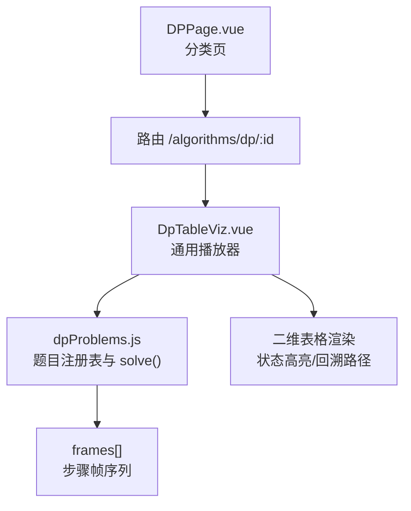
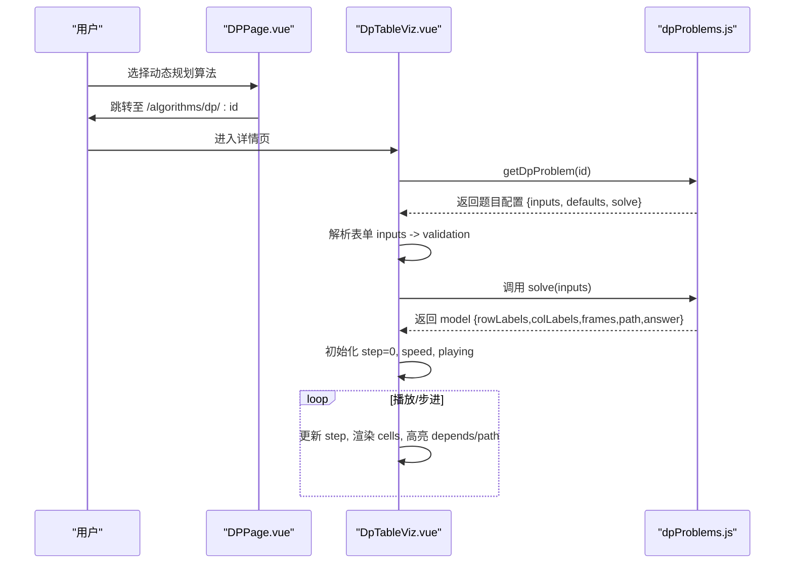
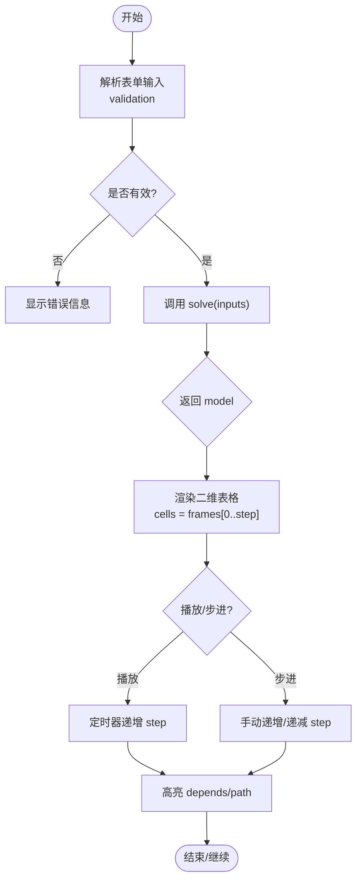
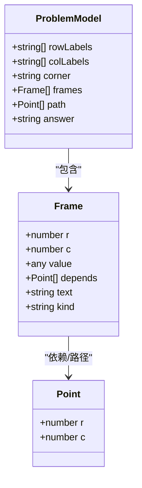

# 动态规划可视化

<cite>
**本文引用的文件**
- [DpTableViz.vue](file://suanfa_vue/src/components/algorithms/dp_algorithms/DpTableViz.vue)
- [DPPage.vue](file://suanfa_vue/src/components/algorithms/dp_algorithms/DPPage.vue)
- [dpProblems.js](file://suanfa_vue/src/data/dpProblems.js)
- [algorithms.js](file://suanfa_vue/src/data/algorithms.js)
- [gen-dp-greedy.py](file://scripts/gen-dp-greedy.py)
</cite>

## 目录
1. [简介](#简介)
2. [项目结构](#项目结构)
3. [核心组件](#核心组件)
4. [架构总览](#架构总览)
5. [详细组件分析](#详细组件分析)
6. [依赖关系分析](#依赖关系分析)
7. [性能与空间优化](#性能与空间优化)
8. [故障排查指南](#故障排查指南)
9. [结论](#结论)
10. [附录：问题清单与参数配置](#附录问题清单与参数配置)

## 简介
本仓库实现了一个“动态规划可视化”教学系统，通过通用表格渲染与逐步动画，展示经典 DP 问题的填表过程、状态转移、以及最优解路径回溯。用户可在前端输入参数（如数组、字符串、背包容量等），系统自动生成“帧序列”，并以二维表格形式逐格高亮、播放动画，帮助理解自底向上的递推过程与子问题重叠特性。

## 项目结构
- 前端可视化层
  - DpTableViz.vue：通用 DP 表格播放器，负责输入解析、帧播放、表格渲染、状态高亮与回溯路径显示。
  - DPPage.vue：动态规划分类页，提供算法卡片与筛选跳转。
- 数据与求解器
  - dpProblems.js：集中定义各 DP 题目的「求解器 + 帧生成」，统一输出 model（行/列标签、帧序列、答案、回溯路径）。
  - algorithms.js：算法元数据单一来源，用于页面展示与路由组织。
- 内容生成脚本
  - gen-dp-greedy.py：一次性生成器，将算法条目写入前端与后端种子数据，保持前后端一致。

**图表来源**
- [DPPage.vue:10-12](file://suanfa_vue/src/components/algorithms/dp_algorithms/DPPage.vue#L10-L12)
- [DpTableViz.vue:12-13](file://suanfa_vue/src/components/algorithms/dp_algorithms/DpTableViz.vue#L12-L13)
- [dpProblems.js:450-543](file://suanfa_vue/src/data/dpProblems.js#L450-L543)

**章节来源**
- [DPPage.vue:1-80](file://suanfa_vue/src/components/algorithms/dp_algorithms/DPPage.vue#L1-L80)
- [DpTableViz.vue:1-428](file://suanfa_vue/src/components/algorithms/dp_algorithms/DpTableViz.vue#L1-L428)
- [dpProblems.js:1-543](file://suanfa_vue/src/data/dpProblems.js#L1-L543)
- [algorithms.js:1-200](file://suanfa_vue/src/data/algorithms.js#L1-L200)

## 核心组件
- DpTableViz.vue
  - 职责：接收题目模型（由 dpProblems.js 的 solve 返回），渲染二维 DP 表，按帧播放动画，支持上一步/下一步/播放/随机数据/速度调节，并在完成后高亮回溯路径。
  - 关键能力：
    - 输入校验与解析（数字、整数列表、文本）
    - 计算当前已填充单元格集合 cells
    - 依赖高亮 depends（紫色边框）
    - 当前活动单元格 is-active（黄色高亮）
    - 完成后的 path 高亮（绿色路径）
    - 历史步骤列表与进度条
- DPPage.vue
  - 职责：展示动态规划算法卡片，支持按子分类筛选，点击跳转到对应详情页。
- dpProblems.js
  - 职责：为每个 DP 问题提供 solve(inputs) 函数，生成统一的 model（包含 rowLabels、colLabels、corner、frames、path、answer），并导出题目注册表与 getDpProblem(id)。
- algorithms.js
  - 职责：算法元数据单一来源，供页面展示与路由组织使用。
- gen-dp-greedy.py
  - 职责：批量生成算法条目到前端与后端种子数据，保证一致性。

**章节来源**
- [DpTableViz.vue:14-197](file://suanfa_vue/src/components/algorithms/dp_algorithms/DpTableViz.vue#L14-L197)
- [DPPage.vue:1-80](file://suanfa_vue/src/components/algorithms/dp_algorithms/DPPage.vue#L1-L80)
- [dpProblems.js:1-543](file://suanfa_vue/src/data/dpProblems.js#L1-L543)
- [algorithms.js:1-200](file://suanfa_vue/src/data/algorithms.js#L1-L200)
- [gen-dp-greedy.py:1-800](file://scripts/gen-dp-greedy.py#L1-L800)

## 架构总览
整体采用“数据驱动 + 通用播放器”的架构：
- 数据层：dpProblems.js 中每个问题提供 solve()，生成 frames（步骤帧）、path（回溯路径）、answer（最终答案文案）。
- 视图层：DpTableViz.vue 根据 model 渲染二维表格，按 step 推进播放，高亮依赖与路径。
- 导航层：DPPage.vue 提供分类与跳转；路由参数 id 决定加载哪个题目。

**图表来源**
- [DPPage.vue:10-12](file://suanfa_vue/src/components/algorithms/dp_algorithms/DPPage.vue#L10-L12)
- [DpTableViz.vue:12-13](file://suanfa_vue/src/components/algorithms/dp_algorithms/DpTableViz.vue#L12-L13)
- [dpProblems.js:450-543](file://suanfa_vue/src/data/dpProblems.js#L450-L543)

## 详细组件分析

### DpTableViz.vue：二维表格渲染与状态更新动画
- 输入控件与校验
  - 支持 number、intList、text 三类输入，自动长度/取值校验，错误提示。
  - 支持随机数据生成（若题目提供 makeRandom）。
- 帧播放控制
  - 播放/暂停/上一步/下一步/回到开头，支持速度滑块。
  - 播放时禁用输入，避免冲突。
- 表格渲染
  - 使用 CSS Grid 布局，行列头与左上角占位。
  - 单元格状态类：filled、is-init、is-skip、is-match、is-active、is-dep、is-path。
  - 已完成单元格集合 cells 由 frames[0..step-1] 聚合得到。
- 依赖高亮与路径回溯
  - depends 来自当前帧，高亮紫色边框表示依赖来源。
  - 完成后 path 高亮绿色路径，展示最优解回溯轨迹。
- 历史步骤与答案
  - 历史区列出每步文本说明，便于理解转移逻辑。
  - 完成后显示 answer 文案。

**图表来源**
- [DpTableViz.vue:33-98](file://suanfa_vue/src/components/algorithms/dp_algorithms/DpTableViz.vue#L33-L98)
- [DpTableViz.vue:137-197](file://suanfa_vue/src/components/algorithms/dp_algorithms/DpTableViz.vue#L137-L197)
- [DpTableViz.vue:244-296](file://suanfa_vue/src/components/algorithms/dp_algorithms/DpTableViz.vue#L244-L296)

**章节来源**
- [DpTableViz.vue:14-197](file://suanfa_vue/src/components/algorithms/dp_algorithms/DpTableViz.vue#L14-L197)
- [DpTableViz.vue:200-296](file://suanfa_vue/src/components/algorithms/dp_algorithms/DpTableViz.vue#L200-L296)

### dpProblems.js：典型 DP 问题的求解与帧生成
- 统一模型
  - rowLabels/colLabels：行列标签
  - corner：左上角说明
  - frames：步骤帧数组，每项含 r、c、value、depends、text、kind
  - path：回溯路径坐标序列
  - answer：最终答案文案
- 典型问题
  - 爬楼梯（线性 DP）：一维 DP，边界 dp[0]=1，dp[1]=1，递推 dp[i]=dp[i-1]+dp[i-2]
  - 最大子数组和（Kadane）：f[i] 以 i 结尾的最大和，维护全局 ans
  - 最长递增子序列（LIS）：dp[i] 以 i 结尾的最长递增子序列长度
  - 0/1 背包与完全背包：二维 DP，回溯选中的物品
  - 最长公共子序列（LCS）：双串 DP，相等取左上+1，否则 max(上,左)
  - 编辑距离：三种操作对应三个方向的最小值
  - 矩阵链乘：区间 DP，枚举断点 k，记录 s 表还原方案
- 帧生成策略
  - 边界初始化：kind='init'
  - 转移计算：kind='compute'
  - 跳过/继承：kind='skip'
  - 匹配命中：kind='match'
  - 依赖标注：depends=[[r,c],...]
  - 文本说明：text 描述当前步骤的计算逻辑

**图表来源**
- [dpProblems.js:1-13](file://suanfa_vue/src/data/dpProblems.js#L1-L13)
- [dpProblems.js:45-543](file://suanfa_vue/src/data/dpProblems.js#L45-L543)

**章节来源**
- [dpProblems.js:45-543](file://suanfa_vue/src/data/dpProblems.js#L45-L543)

### DPPage.vue：分类与导航
- 提供“全部算法”与各子分类标签，点击切换过滤结果。
- 算法卡片展示名称、难度、复杂度、描述，点击跳转至详情页。
- 与路由结合，将 id 传入详情页，触发 DpTableViz 加载对应题目。

**章节来源**
- [DPPage.vue:1-80](file://suanfa_vue/src/components/algorithms/dp_algorithms/DPPage.vue#L1-L80)

## 依赖关系分析
- 组件耦合
  - DpTableViz.vue 强依赖 dpProblems.js 的 solve() 与题目注册表。
  - DPPage.vue 仅负责导航，不直接参与求解。
- 外部依赖
  - Vue 响应式（ref/computed/watch）驱动 UI 更新。
  - Vue Router 传递路由参数 id。
- 潜在循环依赖
  - 无循环依赖，单向数据流：页面 → 组件 → 数据 → 渲染。

**图表来源**
- [DPPage.vue:10-12](file://suanfa_vue/src/components/algorithms/dp_algorithms/DPPage.vue#L10-L12)
- [DpTableViz.vue:12-13](file://suanfa_vue/src/components/algorithms/dp_algorithms/DpTableViz.vue#L12-L13)
- [dpProblems.js:450-543](file://suanfa_vue/src/data/dpProblems.js#L450-L543)

**章节来源**
- [DPPage.vue:1-80](file://suanfa_vue/src/components/algorithms/dp_algorithms/DPPage.vue#L1-L80)
- [DpTableViz.vue:1-428](file://suanfa_vue/src/components/algorithms/dp_algorithms/DpTableViz.vue#L1-L428)
- [dpProblems.js:450-543](file://suanfa_vue/src/data/dpProblems.js#L450-L543)

## 性能与空间优化
- 时间复杂度
  - 线性 DP（爬楼梯、最大子数组和、LIS O(n²)）：O(n) 或 O(n²)
  - 二维 DP（背包、LCS、编辑距离）：O(nW) 或 O(mn)
  - 区间 DP（矩阵链乘）：O(n³)
- 空间复杂度
  - 一维滚动优化：如爬楼梯可压缩到 O(1)，背包可压缩到 O(W)
  - 需要回溯方案时保留二维表或额外决策表
- 可视化性能
  - frames 数量与表格大小成正比，建议限制输入规模（如 intList 长度上限）
  - 播放速度可调，避免大量帧导致卡顿
- 记忆化搜索 vs 自底向上
  - 记忆化搜索（Top-down）适合递归思维，但存在函数调用开销与栈深度风险
  - 自底向上（Bottom-up）显式填表，易于可视化与调试，推荐教学场景

[本节为通用指导，无需具体文件引用]

## 故障排查指南
- 输入校验失败
  - 现象：显示错误信息，无法生成模型
  - 排查：检查输入类型、长度范围、数值合法性
  - 参考：[DpTableViz.vue:33-76](file://suanfa_vue/src/components/algorithms/dp_algorithms/DpTableViz.vue#L33-L76)
- 未找到题目配置
  - 现象：model 为空，显示“未找到该算法的可视化配置”
  - 排查：确认路由 id 是否在 dpProblems.js 的注册表中
  - 参考：[dpProblems.js:450-543](file://suanfa_vue/src/data/dpProblems.js#L450-L543)
- 播放无响应
  - 现象：点击播放无变化
  - 排查：检查 total.value 是否为空，speed 设置是否合理，timer 是否正确清理
  - 参考：[DpTableViz.vue:157-176](file://suanfa_vue/src/components/algorithms/dp_algorithms/DpTableViz.vue#L157-L176)
- 回溯路径未显示
  - 现象：完成后 path 为空
  - 排查：确认 solve() 是否生成 path，且 finished 状态正确
  - 参考：[DpTableViz.vue:114-116](file://suanfa_vue/src/components/algorithms/dp_algorithms/DpTableViz.vue#L114-L116)

**章节来源**
- [DpTableViz.vue:33-76](file://suanfa_vue/src/components/algorithms/dp_algorithms/DpTableViz.vue#L33-L76)
- [DpTableViz.vue:157-176](file://suanfa_vue/src/components/algorithms/dp_algorithms/DpTableViz.vue#L157-L176)
- [dpProblems.js:450-543](file://suanfa_vue/src/data/dpProblems.js#L450-L543)

## 结论
本项目通过“数据驱动 + 通用播放器”的架构，实现了动态规划问题的可视化教学。DpTableViz.vue 提供统一的二维表格渲染与动画播放能力，dpProblems.js 集中管理各题的求解与帧生成，DPPage.vue 负责导航与分类。该设计使得新增题目只需在数据层添加 solve()，即可在前端无缝展示，极大提升了教学效率与可扩展性。

[本节为总结，无需具体文件引用]

## 附录：问题清单与参数配置
以下为支持的 DP 问题及其参数配置（来源于 dpProblems.js 的题目注册表）：

- 爬楼梯
  - 参数：n（台阶数，数字）
  - 递推：dp[i] = dp[i-1] + dp[i-2]
  - 边界：dp[0]=1, dp[1]=1
- 最大子数组和
  - 参数：arr（整数列表）
  - 递推：f[i] = max(f[i-1]+a[i], a[i])
  - 边界：f[1]=a[1]
- 最长递增子序列
  - 参数：arr（整数列表）
  - 递推：dp[i] = 1 + max{dp[j] | j<i 且 a[j]<a[i]}
  - 边界：所有 dp[i]=1
- 0/1 背包
  - 参数：capacity（容量）、count（物品数）、items（物品列表）
  - 递推：dp[i][j] = max(dp[i-1][j], dp[i-1][j-w[i]]+v[i])
  - 边界：dp[0][j]=0, dp[i][0]=0
- 完全背包
  - 参数：同 0/1 背包
  - 递推：dp[i][j] = max(dp[i-1][j], dp[i][j-w[i]]+v[i])
  - 边界：同上
- 最长公共子序列
  - 参数：a、b（字符串）
  - 递推：相等取左上+1，否则 max(上,左)
  - 边界：dp[0][j]=0, dp[i][0]=0
- 编辑距离
  - 参数：a、b（字符串）
  - 递推：min(删、插、改)
  - 边界：dp[i][0]=i, dp[0][j]=j
- 矩阵链乘
  - 参数：dims（维度序列）
  - 递推：dp[i][j] = min{dp[i][k]+dp[k+1][j]+p[i-1]*p[k]*p[j]}
  - 边界：dp[i][i]=0

**章节来源**
- [dpProblems.js:450-543](file://suanfa_vue/src/data/dpProblems.js#L450-L543)