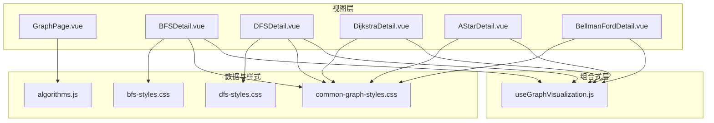
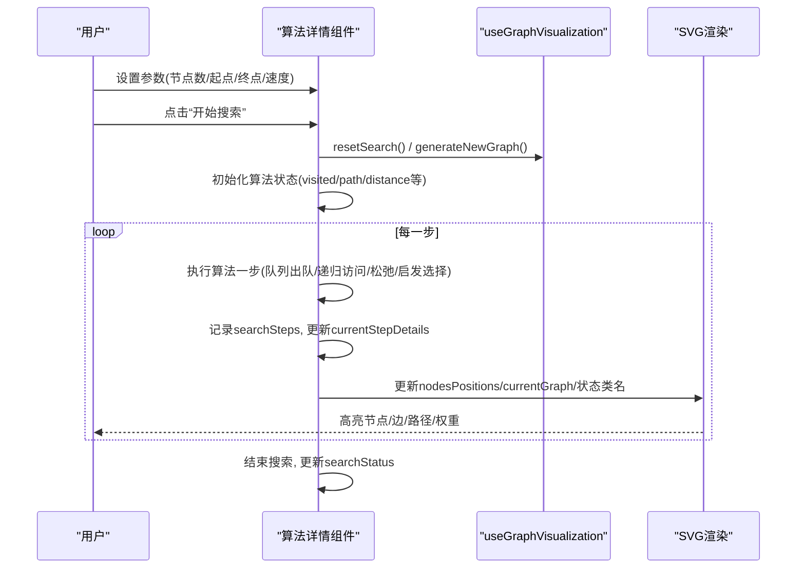
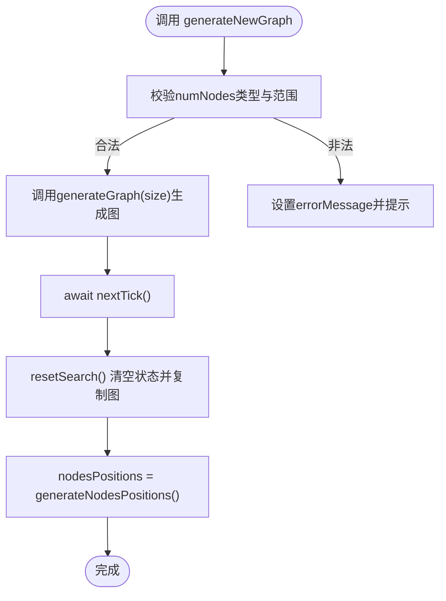
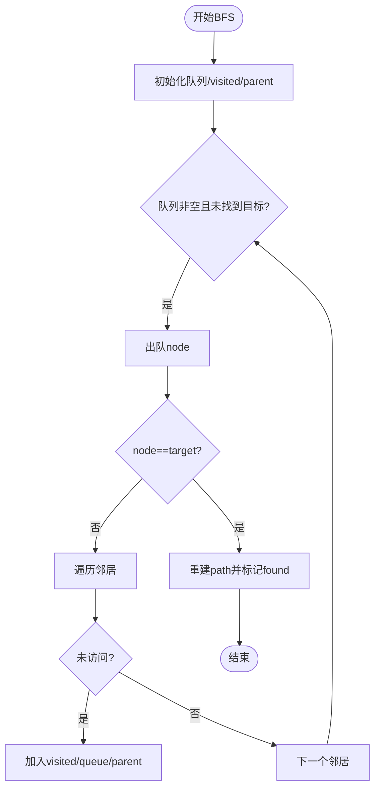
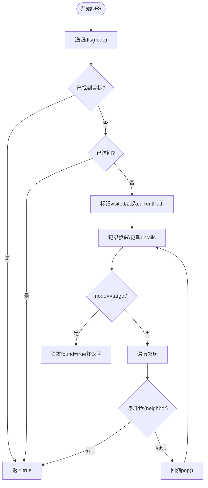
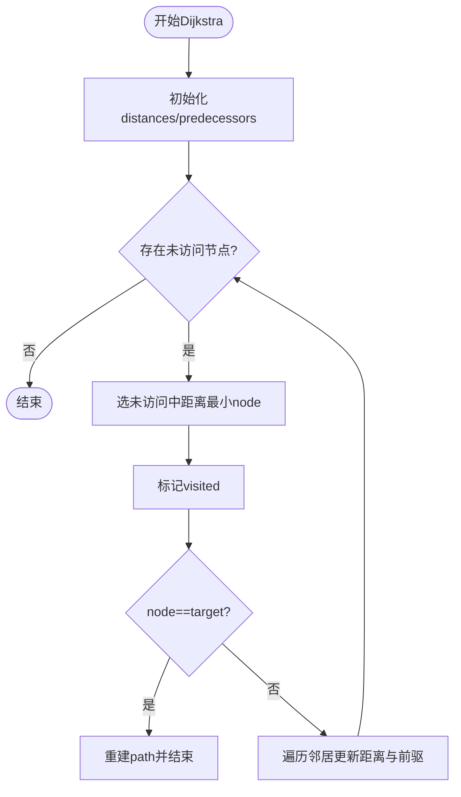
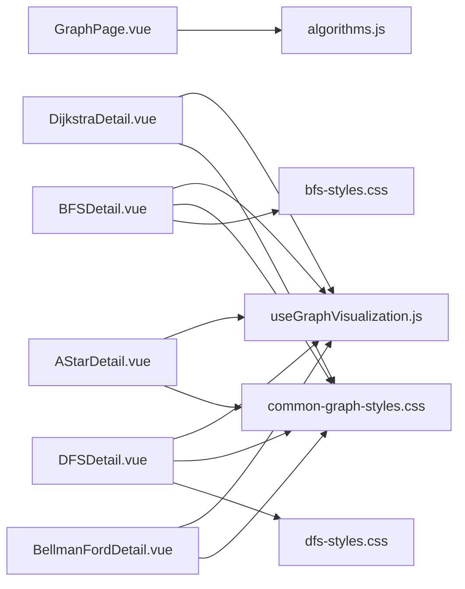

# 图算法可视化

<cite>
**本文引用的文件**
- [useGraphVisualization.js](file://suanfa_vue/src/composables/useGraphVisualization.js)
- [GraphPage.vue](file://suanfa_vue/src/components/algorithms/graph_algorithms/GraphPage.vue)
- [BFSDetail.vue](file://suanfa_vue/src/components/algorithms/graph_algorithms/BFSDetail.vue)
- [DFSDetail.vue](file://suanfa_vue/src/components/algorithms/graph_algorithms/DFSDetail.vue)
- [DijkstraDetail.vue](file://suanfa_vue/src/components/algorithms/graph_algorithms/DijkstraDetail.vue)
- [AStarDetail.vue](file://suanfa_vue/src/components/algorithms/graph_algorithms/AStarDetail.vue)
- [BellmanFordDetail.vue](file://suanfa_vue/src/components/algorithms/graph_algorithms/BellmanFordDetail.vue)
- [algorithms.js](file://suanfa_vue/src/data/algorithms.js)
- [common-graph-styles.css](file://suanfa_vue/src/components/algorithms/graph_algorithms/common-graph-styles.css)
- [bfs-styles.css](file://suanfa_vue/src/components/algorithms/graph_algorithms/bfs-styles.css)
- [dfs-styles.css](file://suanfa_vue/src/components/algorithms/graph_algorithms/dfs-styles.css)
</cite>

## 目录
1. [简介](#简介)
2. [项目结构](#项目结构)
3. [核心组件](#核心组件)
4. [架构总览](#架构总览)
5. [详细组件分析](#详细组件分析)
6. [依赖关系分析](#依赖关系分析)
7. [性能与渲染优化](#性能与渲染优化)
8. [故障排查指南](#故障排查指南)
9. [结论](#结论)
10. [附录](#附录)

## 简介
本项目提供图算法的交互式可视化，涵盖广度优先搜索（BFS）、深度优先搜索（DFS）、Dijkstra最短路径、A*启发式搜索、Bellman-Ford负权边处理等。通过统一的组合式函数 useGraphVisualization 管理图数据结构、节点布局、动画步骤与状态；各算法详情页仅关注自身逻辑与可视化细节。页面支持生成随机图、调整节点数量、选择起点/终点、控制动画速度，并以 SVG 展示节点与带箭头的边，实时高亮当前路径与访问顺序。

## 项目结构
- 组合式层：useGraphVisualization.js 提供通用图可视化能力（图数据、节点位置、边路径计算、步骤记录、重置与生成新图等）。
- 视图层：各算法 Detail 组件（BFS/DFS/Dijkstra/A*/Bellman-Ford）复用组合式能力，实现各自算法流程与可视化。
- 导航与元数据：GraphPage.vue 作为图算法入口页，按分类展示算法卡片；algorithms.js 为单一数据源，集中维护算法元信息与复杂度。
- 样式层：common-graph-styles.css 统一图可视化样式；bfs-styles.css、dfs-styles.css 提供算法特定样式。

图表来源
- [GraphPage.vue:1-92](file://suanfa_vue/src/components/algorithms/graph_algorithms/GraphPage.vue#L1-L92)
- [useGraphVisualization.js:1-148](file://suanfa_vue/src/composables/useGraphVisualization.js#L1-L148)
- [algorithms.js:364-602](file://suanfa_vue/src/data/algorithms.js#L364-L602)
- [common-graph-styles.css:1-238](file://suanfa_vue/src/components/algorithms/graph_algorithms/common-graph-styles.css#L1-L238)

章节来源
- [GraphPage.vue:1-92](file://suanfa_vue/src/components/algorithms/graph_algorithms/GraphPage.vue#L1-L92)
- [algorithms.js:364-602](file://suanfa_vue/src/data/algorithms.js#L364-L602)

## 核心组件
- 组合式函数 useGraphVisualization：
  - 管理图数据 graph/currentGraph、节点数 numNodes、节点位置 nodesPositions、边路径 getEdgePath。
  - 提供 generateNewGraph 生成新图并重置搜索；resetSearch 清零状态并复制原始图。
  - 维护 isSearching、searchStatus、currentStep、searchSteps、currentStepDetails 等可视化状态。
  - 错误信息 errorMessage 用于捕获异常并提示用户。
- 算法详情组件：
  - BFS/DFS：基于有向无环图（DAG）或一般有向图的遍历，记录 visitedNodes、path、found，逐步推进动画。
  - Dijkstra：加权图单源最短路径，维护 distances、predecessors，逐步更新距离并重建最短路径。
  - A*：引入启发函数 heuristic，维护 openSet/closedSet、gScore/fScore，按 f 值最小扩展。
  - Bellman-Ford：支持负权边，进行 V-1 轮松弛，检测负权环。

章节来源
- [useGraphVisualization.js:16-148](file://suanfa_vue/src/composables/useGraphVisualization.js#L16-L148)
- [BFSDetail.vue:67-225](file://suanfa_vue/src/components/algorithms/graph_algorithms/BFSDetail.vue#L67-L225)
- [DFSDetail.vue:67-233](file://suanfa_vue/src/components/algorithms/graph_algorithms/DFSDetail.vue#L67-L233)
- [DijkstraDetail.vue:67-289](file://suanfa_vue/src/components/algorithms/graph_algorithms/DijkstraDetail.vue#L67-L289)
- [AStarDetail.vue:63-200](file://suanfa_vue/src/components/algorithms/graph_algorithms/AStarDetail.vue#L63-L200)
- [BellmanFordDetail.vue:56-200](file://suanfa_vue/src/components/algorithms/graph_algorithms/BellmanFordDetail.vue#L56-L200)

## 架构总览
下图展示了从用户交互到算法执行与可视化的整体流程：用户在详情页设置参数（节点数、起点、终点、动画速度），点击“开始搜索”后，算法在异步循环中逐步推进，每步记录 searchSteps 并更新 currentStepDetails；SVG 根据 nodesPositions 和 currentGraph 渲染节点与边，并通过 CSS 类名高亮 visited/current/target/start 等状态。

图表来源
- [BFSDetail.vue:103-211](file://suanfa_vue/src/components/algorithms/graph_algorithms/BFSDetail.vue#L103-L211)
- [DFSDetail.vue:102-219](file://suanfa_vue/src/components/algorithms/graph_algorithms/DFSDetail.vue#L102-L219)
- [DijkstraDetail.vue:147-275](file://suanfa_vue/src/components/algorithms/graph_algorithms/DijkstraDetail.vue#L147-L275)
- [AStarDetail.vue:107-200](file://suanfa_vue/src/components/algorithms/graph_algorithms/AStarDetail.vue#L107-L200)
- [BellmanFordDetail.vue:97-200](file://suanfa_vue/src/components/algorithms/graph_algorithms/BellmanFordDetail.vue#L97-L200)
- [useGraphVisualization.js:104-138](file://suanfa_vue/src/composables/useGraphVisualization.js#L104-L138)

## 详细组件分析

### 组合式函数 useGraphVisualization
- 职责：
  - 图数据管理：graph（原始图）、currentGraph（可编辑/运行期图）。
  - 节点布局：generateNodesPositions 环形布局，适配 800x600 viewBox。
  - 边路径：getEdgePath 计算边与箭头路径，避免与节点重叠。
  - 生命周期：generateNewGraph 校验节点数、生成图、等待 DOM、重置搜索、重新布局。
  - 状态：isSearching、searchStatus、currentStep、searchSteps、currentStepDetails、errorMessage。
- 关键点：
  - 节点数限制 minSize/maxSize，输入非法时回退默认值。
  - onReset 钩子允许各算法注入专属状态清理逻辑。
  - nextTick 确保模板首次渲染前已有初始位置，避免读取 undefined。

图表来源
- [useGraphVisualization.js:23-48](file://suanfa_vue/src/composables/useGraphVisualization.js#L23-L48)
- [useGraphVisualization.js:49-102](file://suanfa_vue/src/composables/useGraphVisualization.js#L49-L102)
- [useGraphVisualization.js:104-138](file://suanfa_vue/src/composables/useGraphVisualization.js#L104-L138)

章节来源
- [useGraphVisualization.js:16-148](file://suanfa_vue/src/composables/useGraphVisualization.js#L16-L148)

### 广度优先搜索（BFS）
- 图生成：generateRandomDAG 生成字母节点与有向边，保证无环。
- 算法流程：
  - 使用队列，逐层扩展，记录 visited 与 parent 以重建路径。
  - 每步记录 searchSteps，更新 currentStepDetails，并通过 animationSpeed 控制节奏。
  - 找到目标后重建 path，最终显示“搜索成功/失败”。
- 可视化：
  - 节点状态类名：start/target/visited/current。
  - 边高亮：isPathEdge 判断是否在最终路径上。

图表来源
- [BFSDetail.vue:103-211](file://suanfa_vue/src/components/algorithms/graph_algorithms/BFSDetail.vue#L103-L211)

章节来源
- [BFSDetail.vue:8-225](file://suanfa_vue/src/components/algorithms/graph_algorithms/BFSDetail.vue#L8-L225)

### 深度优先搜索（DFS）
- 图生成：同 BFS 的 DAG 生成器。
- 算法流程：
  - 递归深入，维护 currentPath，回溯时弹出。
  - 每步记录 visit/neighbor/backtrack，动画节奏由 animationSpeed 控制。
  - 找到目标后终止搜索，否则继续回溯。
- 可视化：
  - 节点状态类名：start/target/visited/current。
  - 边高亮：isPathEdge 判断是否在最终路径上。

图表来源
- [DFSDetail.vue:102-219](file://suanfa_vue/src/components/algorithms/graph_algorithms/DFSDetail.vue#L102-L219)

章节来源
- [DFSDetail.vue:8-233](file://suanfa_vue/src/components/algorithms/graph_algorithms/DFSDetail.vue#L8-L233)

### Dijkstra 最短路径
- 图生成：generateRandomWeightedGraph 生成带权有向边（正权重）。
- 算法流程：
  - 初始化 distances=Infinity，predecessors=null，distances[start]=0。
  - 每次选择未访问节点中距离最小的 currentNode，标记 visited。
  - 若 currentNode==target，重建 path 并结束；否则松弛相邻边更新距离与前驱。
  - 每步记录 visit/update，动画节奏由 animationSpeed 控制。
- 可视化：
  - 节点显示距离标签（非 Infinity）。
  - 边权重标签位于边中点附近。
  - 路径高亮：isPathEdge 判断是否在最终最短路径上。

图表来源
- [DijkstraDetail.vue:147-275](file://suanfa_vue/src/components/algorithms/graph_algorithms/DijkstraDetail.vue#L147-L275)

章节来源
- [DijkstraDetail.vue:8-289](file://suanfa_vue/src/components/algorithms/graph_algorithms/DijkstraDetail.vue#L8-L289)

### A* 启发式搜索
- 图生成：generateRandomGraph 生成带权有向图。
- 算法流程：
  - 维护 openSet/closedSet、gScore/fScore、parent。
  - 每次从 openSet 选择 f 值最小的 node，移动到 closedSet。
  - 若 node==target，重建 path；否则扩展邻居更新 gScore/fScore。
  - 每步记录 select/move/expand，动画节奏由 animationSpeed 控制。
- 可视化：
  - 节点状态类名：start/target/visited/current。
  - 边权重标签显示。

章节来源
- [AStarDetail.vue:8-200](file://suanfa_vue/src/components/algorithms/graph_algorithms/AStarDetail.vue#L8-L200)

### Bellman-Ford 负权边处理
- 图生成：generateRandomGraph 生成可能包含负权边的有向图。
- 算法流程：
  - 初始化 distances/predecessors。
  - 进行 V-1 轮松弛，每轮遍历所有边尝试更新距离。
  - 若某轮无更新则提前结束。
  - 检查是否存在负权环：再次遍历所有边，若仍可松弛则存在负权环。
  - 每步记录 round/relax/check，动画节奏由 animationSpeed 控制。
- 可视化：
  - 节点显示距离标签。
  - 边权重标签显示。

章节来源
- [BellmanFordDetail.vue:8-200](file://suanfa_vue/src/components/algorithms/graph_algorithms/BellmanFordDetail.vue#L8-L200)

## 依赖关系分析
- GraphPage.vue 依赖 algorithms.js 获取图算法列表与元数据，按分类筛选并路由到对应详情页。
- 各算法详情组件依赖 useGraphVisualization 提供通用能力，减少重复代码。
- 样式文件 common-graph-styles.css 被多个算法样式文件引用，统一图可视化外观；bfs-styles.css、dfs-styles.css 提供算法特定样式。

图表来源
- [GraphPage.vue:1-92](file://suanfa_vue/src/components/algorithms/graph_algorithms/GraphPage.vue#L1-L92)
- [algorithms.js:777-800](file://suanfa_vue/src/data/algorithms.js#L777-L800)
- [common-graph-styles.css:1-238](file://suanfa_vue/src/components/algorithms/graph_algorithms/common-graph-styles.css#L1-L238)

章节来源
- [GraphPage.vue:1-92](file://suanfa_vue/src/components/algorithms/graph_algorithms/GraphPage.vue#L1-L92)
- [algorithms.js:364-602](file://suanfa_vue/src/data/algorithms.js#L364-L602)

## 性能与渲染优化
- SVG 渲染：
  - 使用 viewBox 与 preserveAspectRatio 自适应容器尺寸，避免频繁重排。
  - 边与箭头分离绘制，减少复杂 marker 开销；通过 CSS 类名切换高亮，降低 JS 操作频率。
- 布局计算：
  - 环形布局 generateNodesPositions 时间复杂度 O(V)，节点数变化时重新计算一次。
  - 对大规模图，建议限制 maxNodes（脚手架已提供 minSize/maxSize 约束）。
- 动画控制：
  - 使用 animationSpeed 控制每步延迟，避免 UI 阻塞；在大数据量下提高速度以提升流畅度。
- 状态管理：
  - 使用 ref 与 nextTick 确保模板渲染前数据就绪，避免读取 undefined。
  - 将算法专属状态与通用状态分离，减少不必要的响应式更新。
- 交互性能：
  - 按钮禁用态 isSearching 防止并发执行导致状态混乱。
  - 错误信息 errorMessage 及时提示，避免无效操作。

[本节为通用指导，不直接分析具体文件]

## 故障排查指南
- 节点数为非数字或越界：
  - 现象：generateNewGraph 抛出错误并设置 errorMessage。
  - 处理：检查 numNodes 输入，确保在 minSize 与 maxSize 范围内。
- 起始/目标节点无效：
  - 现象：生成图后自动校正 startNode/targetNode，若仍冲突会提示。
  - 处理：确保节点存在且不等于对方。
- 搜索失败：
  - 现象：searchStatus 显示“搜索失败”，currentStepDetails 给出原因。
  - 处理：检查图连通性、边方向、权重合法性（如 Dijkstra 不支持负权）。
- 动画卡顿：
  - 现象：界面响应慢。
  - 处理：增大 animationSpeed，减少节点数量，关闭多余日志输出。

章节来源
- [useGraphVisualization.js:104-138](file://suanfa_vue/src/composables/useGraphVisualization.js#L104-L138)
- [BFSDetail.vue:103-211](file://suanfa_vue/src/components/algorithms/graph_algorithms/BFSDetail.vue#L103-L211)
- [DijkstraDetail.vue:147-275](file://suanfa_vue/src/components/algorithms/graph_algorithms/DijkstraDetail.vue#L147-L275)

## 结论
本项目通过统一的组合式函数实现了图算法可视化的基础能力，各算法详情页专注于自身逻辑与可视化细节。BFS/DFS 适用于无权图遍历与路径查找；Dijkstra 适用于正权图最短路径；A* 通过启发式加速搜索；Bellman-Ford 支持负权边并检测负权环。SVG 渲染与 CSS 高亮提供了清晰的动画效果，结合动画速度与节点数量控制，可在不同规模图上保持良好交互体验。未来可扩展动态编辑节点/边、权重修改、方向性切换等功能，进一步提升可视化与教学价值。

[本节为总结，不直接分析具体文件]

## 附录
- 应用场景与复杂度对比：
  - BFS：无权图最短路径、层级遍历；时间 O(V+E)，空间 O(V)。
  - DFS：拓扑排序、连通分量、路径存在性；时间 O(V+E)，空间 O(V)。
  - Dijkstra：正权图单源最短路径；时间 O((V+E) log V)，空间 O(V)。
  - A*：启发式最短路径；时间取决于启发函数，最坏 O(V²)，平均 O(E log V)，空间 O(V)。
  - Bellman-Ford：含负权边最短路径与负权环检测；时间 O(V*E)，空间 O(V)。
- 数据来源：
  - 算法元数据与复杂度定义来自 algorithms.js，便于统一展示与维护。

章节来源
- [algorithms.js:364-602](file://suanfa_vue/src/data/algorithms.js#L364-L602)