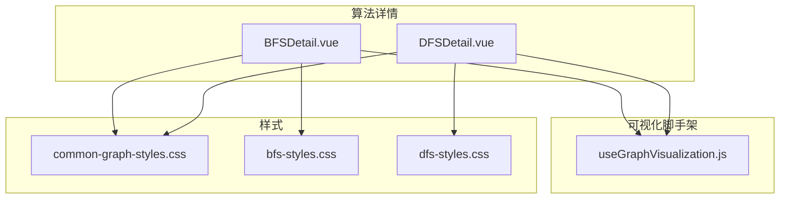
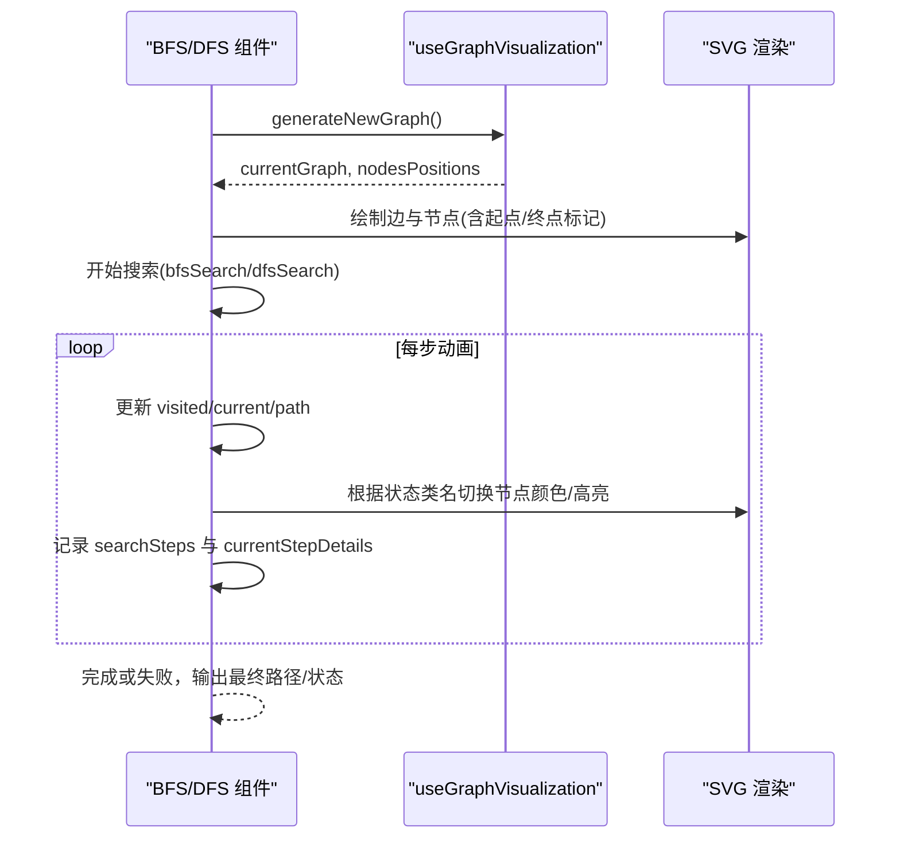
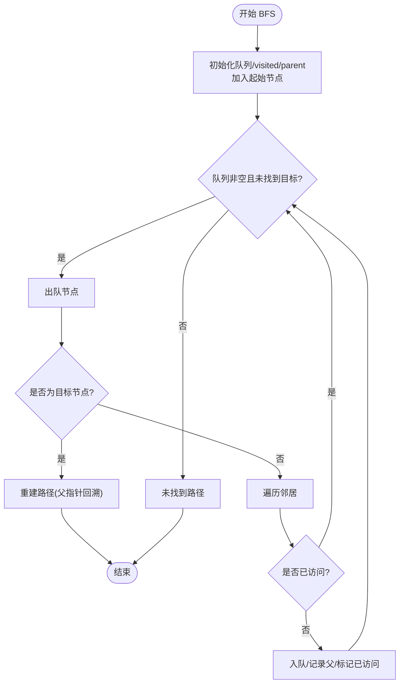
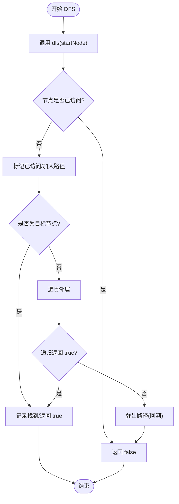
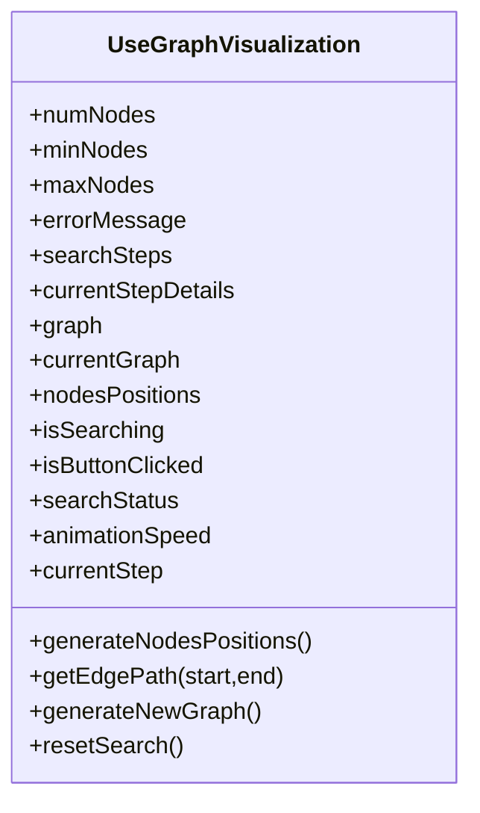
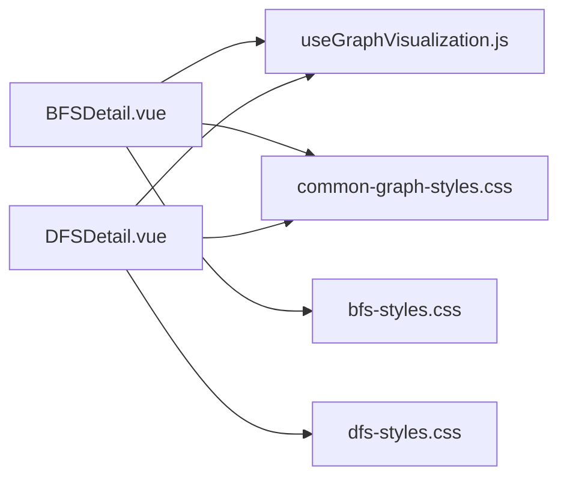

# 图遍历算法

<cite>
**本文引用的文件**
- [BFSDetail.vue](file://suanfa_vue/src/components/algorithms/graph_algorithms/BFSDetail.vue)
- [DFSDetail.vue](file://suanfa_vue/src/components/algorithms/graph_algorithms/DFSDetail.vue)
- [useGraphVisualization.js](file://suanfa_vue/src/composables/useGraphVisualization.js)
- [bfs-styles.css](file://suanfa_vue/src/components/algorithms/graph_algorithms/bfs-styles.css)
- [dfs-styles.css](file://suanfa_vue/src/components/algorithms/graph_algorithms/dfs-styles.css)
- [common-graph-styles.css](file://suanfa_vue/src/components/algorithms/graph_algorithms/common-graph-styles.css)
</cite>

## 目录
1. [简介](#简介)
2. [项目结构](#项目结构)
3. [核心组件](#核心组件)
4. [架构总览](#架构总览)
5. [详细组件分析](#详细组件分析)
6. [依赖关系分析](#依赖关系分析)
7. [性能与复杂度](#性能与复杂度)
8. [故障排查指南](#故障排查指南)
9. [结论](#结论)
10. [附录：交互与可视化实现要点](#附录：交互与可视化实现要点)

## 简介
本文件面向“图遍历算法”的可视化实现，重点覆盖广度优先搜索（BFS）与深度优先搜索（DFS）。文档从系统架构、数据流、处理逻辑、错误处理、性能特征等维度展开，并结合交互式演示中的节点颜色变化、动画效果与用户控制进行说明。目标是让读者既能理解算法本质，也能掌握前端可视化实现的关键细节。

## 项目结构
本项目采用 Vue 单页应用组织图算法可视化页面：
- 算法详情组件：BFS 与 DFS 分别由独立组件实现，负责算法逻辑与界面渲染。
- 共享可视化脚手架：抽取了图生成、布局计算、边绘制、状态管理等通用能力，供多个图算法复用。
- 样式体系：公共样式与算法专属样式分离，便于统一主题与差异化表现。

图表来源
- [BFSDetail.vue:1-10](file://suanfa_vue/src/components/algorithms/graph_algorithms/BFSDetail.vue#L1-L10)
- [DFSDetail.vue:1-10](file://suanfa_vue/src/components/algorithms/graph_algorithms/DFSDetail.vue#L1-L10)
- [useGraphVisualization.js:1-20](file://suanfa_vue/src/composables/useGraphVisualization.js#L1-L20)

章节来源
- [BFSDetail.vue:1-10](file://suanfa_vue/src/components/algorithms/graph_algorithms/BFSDetail.vue#L1-L10)
- [DFSDetail.vue:1-10](file://suanfa_vue/src/components/algorithms/graph_algorithms/DFSDetail.vue#L1-L10)
- [useGraphVisualization.js:1-20](file://suanfa_vue/src/composables/useGraphVisualization.js#L1-L20)

## 核心组件
- BFSDetail.vue：实现 BFS 层序遍历、队列操作、最短路径重建、步骤记录与可视化更新。
- DFSDetail.vue：实现 DFS 递归回溯、栈式访问顺序、连通性检测思路、步骤记录与可视化更新。
- useGraphVisualization.js：提供图生成、节点环形布局、箭头边绘制、动画速度、搜索状态管理、重置与生成新图等通用能力。

章节来源
- [BFSDetail.vue:62-225](file://suanfa_vue/src/components/algorithms/graph_algorithms/BFSDetail.vue#L62-L225)
- [DFSDetail.vue:62-233](file://suanfa_vue/src/components/algorithms/graph_algorithms/DFSDetail.vue#L62-L233)
- [useGraphVisualization.js:16-148](file://suanfa_vue/src/composables/useGraphVisualization.js#L16-L148)

## 架构总览
下图展示了 BFS/DFS 组件如何复用可视化脚手架，并通过 SVG 渲染图结构与动画。

图表来源
- [useGraphVisualization.js:104-138](file://suanfa_vue/src/composables/useGraphVisualization.js#L104-L138)
- [BFSDetail.vue:103-211](file://suanfa_vue/src/components/algorithms/graph_algorithms/BFSDetail.vue#L103-L211)
- [DFSDetail.vue:102-219](file://suanfa_vue/src/components/algorithms/graph_algorithms/DFSDetail.vue#L102-L219)

## 详细组件分析

### BFS 组件分析
- 数据结构与流程
  - 使用队列进行层序扩展；使用 Set 记录已访问节点；使用 Map 记录父节点以重建最短路径。
  - 每一步出队一个节点，若为目标则终止并重建路径；否则将未访问邻居入队并记录父关系。
- 可视化与交互
  - 通过 visitedNodes、path、startNode、targetNode 驱动节点样式类名变化，实现颜色与高亮。
  - 使用 animationSpeed 控制每步等待时间，形成逐步动画。
  - 步骤历史通过 searchSteps 累积，当前步骤文本通过 currentStepDetails 展示。
- 错误处理
  - 捕获异常并设置 errorMessage，同时记录错误步骤。

图表来源
- [BFSDetail.vue:103-211](file://suanfa_vue/src/components/algorithms/graph_algorithms/BFSDetail.vue#L103-L211)

章节来源
- [BFSDetail.vue:62-225](file://suanfa_vue/src/components/algorithms/graph_algorithms/BFSDetail.vue#L62-L225)
- [BFSDetail.vue:229-388](file://suanfa_vue/src/components/algorithms/graph_algorithms/BFSDetail.vue#L229-L388)

### DFS 组件分析
- 数据结构与流程
  - 使用递归函数实现回溯；使用 Set 记录已访问节点；使用 currentPath 维护当前路径。
  - 访问节点时压栈（push），回溯时弹栈（pop），从而体现栈式行为。
  - 找到目标即终止；否则按邻接表顺序递归探索。
- 可视化与交互
  - 通过 visitedNodes、path、currentPath 的变化驱动节点颜色与高亮。
  - 回溯阶段会记录“回溯”步骤，便于观察回退过程。
- 错误处理
  - 捕获异常并设置 errorMessage，同时记录错误步骤。

图表来源
- [DFSDetail.vue:102-219](file://suanfa_vue/src/components/algorithms/graph_algorithms/DFSDetail.vue#L102-L219)

章节来源
- [DFSDetail.vue:62-233](file://suanfa_vue/src/components/algorithms/graph_algorithms/DFSDetail.vue#L62-L233)
- [DFSDetail.vue:237-401](file://suanfa_vue/src/components/algorithms/graph_algorithms/DFSDetail.vue#L237-L401)

### 可视化脚手架分析
- 图生成与布局
  - 支持自定义 generateGraph(size)，默认环形布局计算节点坐标。
  - 提供 getEdgePath(start, end) 计算边与箭头路径，确保箭头指向正确且不穿透节点。
- 状态与动画
  - 统一管理 isSearching、searchStatus、animationSpeed、currentStep 等状态。
  - generateNewGraph 在生成新图后重置搜索并重新布局。
- 可插拔设计
  - 通过 onReset 钩子注入各算法的专属状态清理逻辑，避免重复代码。

图表来源
- [useGraphVisualization.js:16-148](file://suanfa_vue/src/composables/useGraphVisualization.js#L16-L148)

章节来源
- [useGraphVisualization.js:16-148](file://suanfa_vue/src/composables/useGraphVisualization.js#L16-L148)

## 依赖关系分析
- 组件依赖
  - BFS/DFS 组件均依赖 useGraphVisualization 提供的图生成、布局、边绘制与状态管理。
  - 样式上，BFS/DFS 各自引入算法专属样式，并共用公共样式。
- 耦合与内聚
  - 算法逻辑与可视化调度解耦：算法只关注自身状态与步骤记录，渲染由公共脚手架与模板绑定完成。
  - 通过 onReset 钩子降低耦合度，使各算法仅维护自身状态。

图表来源
- [BFSDetail.vue:1-10](file://suanfa_vue/src/components/algorithms/graph_algorithms/BFSDetail.vue#L1-L10)
- [DFSDetail.vue:1-10](file://suanfa_vue/src/components/algorithms/graph_algorithms/DFSDetail.vue#L1-L10)
- [useGraphVisualization.js:1-20](file://suanfa_vue/src/composables/useGraphVisualization.js#L1-L20)

章节来源
- [BFSDetail.vue:1-10](file://suanfa_vue/src/components/algorithms/graph_algorithms/BFSDetail.vue#L1-L10)
- [DFSDetail.vue:1-10](file://suanfa_vue/src/components/algorithms/graph_algorithms/DFSDetail.vue#L1-L10)
- [useGraphVisualization.js:1-20](file://suanfa_vue/src/composables/useGraphVisualization.js#L1-L20)

## 性能与复杂度
- 时间复杂度
  - BFS 与 DFS 均为 O(V+E)，其中 V 为顶点数，E 为边数。每个顶点最多入队/入栈一次，每条边最多被检查一次。
- 空间复杂度
  - BFS：最坏情况队列长度可达 O(V)（例如星型图），加上 visited 与 parent 存储，整体 O(V)。
  - DFS：递归深度最大为 O(V)，对应调用栈大小；visited 与 path 亦为 O(V)。
- 适用场景对比
  - BFS：适合求无权图的最短路径、层序遍历、连通分量计数等。
  - DFS：适合拓扑排序、环检测、连通性判断、路径枚举等。
- 优化建议
  - 使用 Set/Map 提升查找效率。
  - 对大图可考虑分块渲染或虚拟滚动，减少 DOM 压力。
  - 合理设置 animationSpeed，避免过慢影响体验。

[本节为通用性能讨论，不直接分析具体文件]

## 故障排查指南
- 常见问题
  - 节点位置未定义导致崩溃：确保在生成新图后调用 nextTick 再布局，或使用脚手架的 generateNewGraph。
  - 按钮点击无响应：检查 isSearching 状态是否正确复位，以及 onReset 是否清空了算法专属状态。
  - 路径高亮不生效：确认 isPathEdge 逻辑与 path 数组同步更新。
- 定位方法
  - 查看 searchSteps 与 currentStepDetails，定位问题发生在哪一步。
  - 检查 errorMessage 与浏览器控制台日志。
  - 调整 animationSpeed 至较大值，便于观察中间状态。

章节来源
- [BFSDetail.vue:203-211](file://suanfa_vue/src/components/algorithms/graph_algorithms/BFSDetail.vue#L203-L211)
- [DFSDetail.vue:211-219](file://suanfa_vue/src/components/algorithms/graph_algorithms/DFSDetail.vue#L211-L219)
- [useGraphVisualization.js:104-138](file://suanfa_vue/src/composables/useGraphVisualization.js#L104-L138)

## 结论
本项目通过组件化与可复用的可视化脚手架，实现了 BFS 与 DFS 的清晰可视化。BFS 以队列驱动层序扩展并支持最短路径重建；DFS 以递归回溯展示深搜过程。两者均具备完善的步骤记录、错误处理与交互控制。借助统一的样式体系与 SVG 渲染，用户可直观观察节点访问状态、边遍历顺序与动画效果。

[本节为总结性内容，不直接分析具体文件]

## 附录：交互与可视化实现要点
- 节点访问状态标记
  - 使用 CSS 类名控制节点外观：visited、current、target、start。
  - 通过 visitedNodes、path、startNode、targetNode 驱动类名切换。
- 边遍历顺序与高亮
  - 通过 isPathEdge(from, to) 判断边是否在路径中，动态添加 path-highlight 类。
  - 边与箭头由 getEdgePath 计算，保证箭头方向与视觉一致性。
- 动画与用户控制
  - animationSpeed 控制每步等待时间，形成逐步动画。
  - 提供节点数量、起止点选择、动画速度调节，以及生成新图、开始搜索、重置搜索按钮。
- 步骤历史与当前步骤
  - searchSteps 记录每一步的类型与描述，currentStepDetails 显示当前步骤详情。
  - 类型包括 info、visit、neighbor、found、backtrack、complete、error 等。

章节来源
- [common-graph-styles.css:56-80](file://suanfa_vue/src/components/algorithms/graph_algorithms/common-graph-styles.css#L56-L80)
- [common-graph-styles.css:232-238](file://suanfa_vue/src/components/algorithms/graph_algorithms/common-graph-styles.css#L232-L238)
- [bfs-styles.css:89-121](file://suanfa_vue/src/components/algorithms/graph_algorithms/bfs-styles.css#L89-L121)
- [dfs-styles.css:27-33](file://suanfa_vue/src/components/algorithms/graph_algorithms/dfs-styles.css#L27-L33)
- [BFSDetail.vue:214-225](file://suanfa_vue/src/components/algorithms/graph_algorithms/BFSDetail.vue#L214-L225)
- [DFSDetail.vue:221-230](file://suanfa_vue/src/components/algorithms/graph_algorithms/DFSDetail.vue#L221-L230)
- [useGraphVisualization.js:49-102](file://suanfa_vue/src/composables/useGraphVisualization.js#L49-L102)