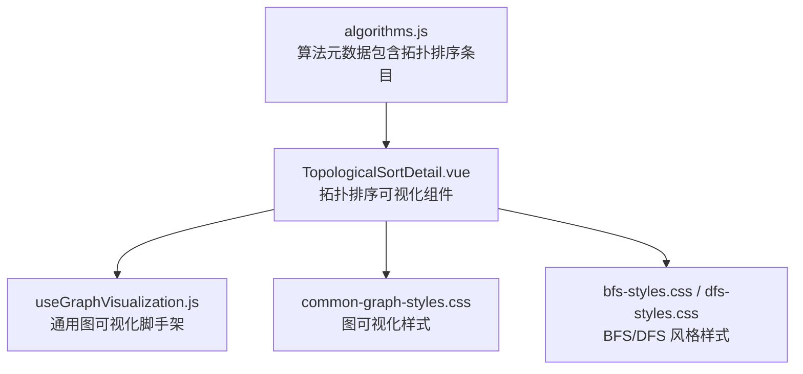
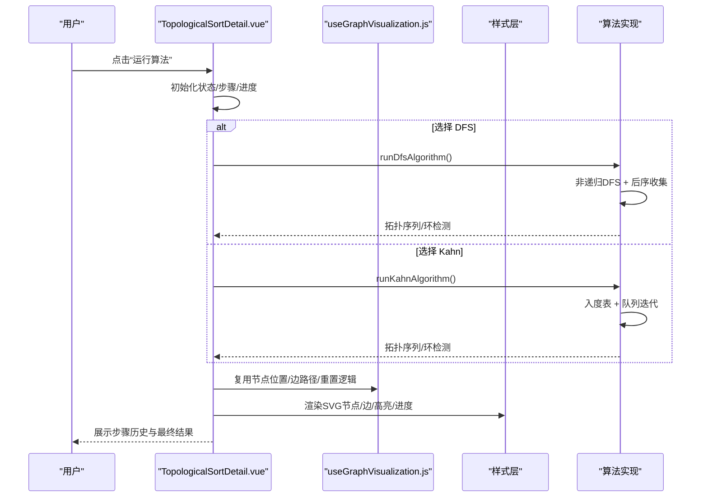
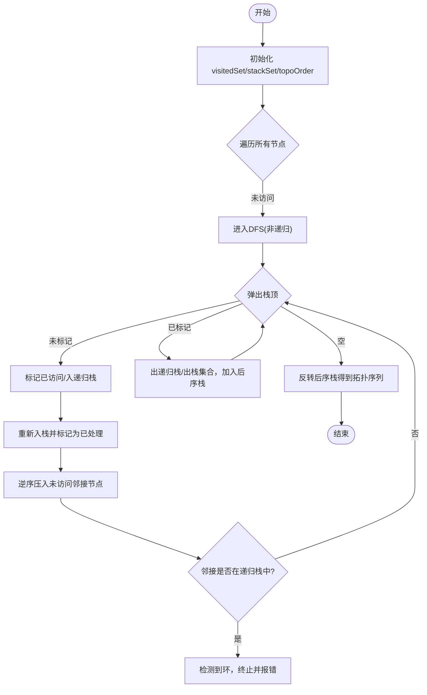
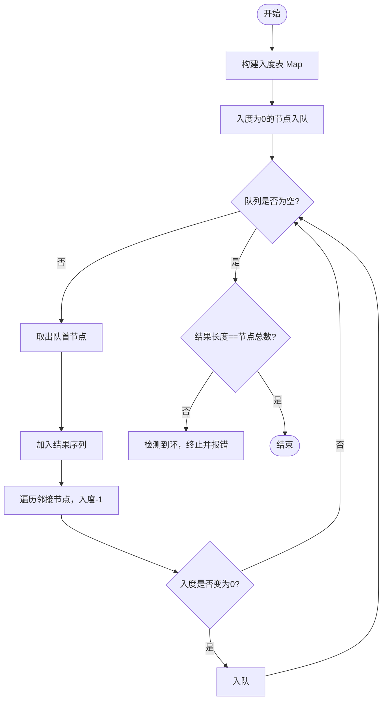
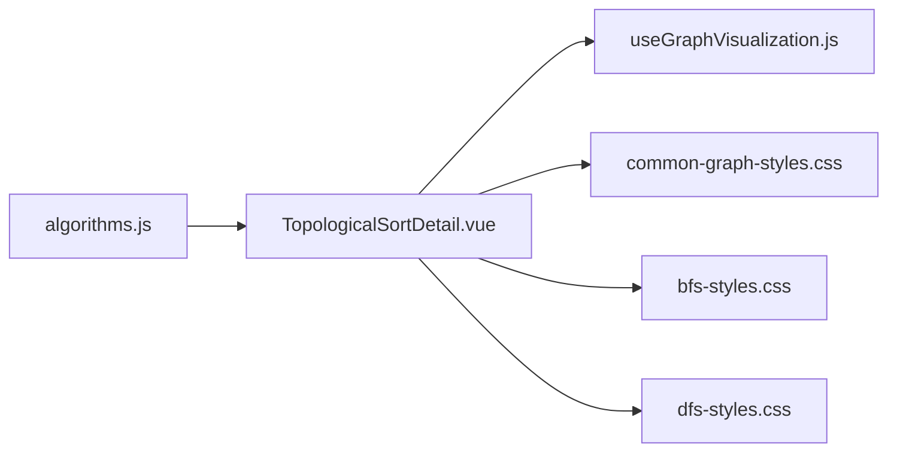

# 拓扑排序算法

<cite>
**本文引用的文件**
- [TopologicalSortDetail.vue](file://suanfa_vue/src/components/algorithms/graph_algorithms/TopologicalSortDetail.vue)
- [useGraphVisualization.js](file://suanfa_vue/src/composables/useGraphVisualization.js)
- [common-graph-styles.css](file://suanfa_vue/src/components/algorithms/graph_algorithms/common-graph-styles.css)
- [bfs-styles.css](file://suanfa_vue/src/components/algorithms/graph_algorithms/bfs-styles.css)
- [dfs-styles.css](file://suanfa_vue/src/components/algorithms/graph_algorithms/dfs-styles.css)
- [algorithms.js](file://suanfa_vue/src/data/algorithms.js)
</cite>

## 目录
1. [简介](#简介)
2. [项目结构](#项目结构)
3. [核心组件](#核心组件)
4. [架构总览](#架构总览)
5. [详细组件分析](#详细组件分析)
6. [依赖关系分析](#依赖关系分析)
7. [性能与复杂度](#性能与复杂度)
8. [故障排查指南](#故障排查指南)
9. [结论](#结论)
10. [附录](#附录)

## 简介
本文件围绕有向无环图（DAG）的拓扑排序，系统梳理并可视化实现两种经典方法：
- 基于深度优先搜索（DFS）的后序逆序法
- 基于入度统计的 BFS（Kahn 算法）

同时覆盖循环依赖检测、拓扑序列唯一性判断、多解处理策略、以及任务调度、课程安排、编译依赖等典型应用场景。文档结合前端可视化组件的实现细节，给出时间复杂度 O(V+E)、空间复杂度分析与大规模图优化建议。

## 项目结构
本项目将“拓扑排序”作为图算法之一，提供交互式可视化页面，支持：
- 随机生成 DAG（或含环图）
- 选择 DFS 或 Kahn 算法执行
- 逐步动画展示节点访问、边遍历、队列变化、后序结果构建
- 实时显示步骤历史、进度条、错误提示与执行耗时

图表来源
- [TopologicalSortDetail.vue:51-610](file://suanfa_vue/src/components/algorithms/graph_algorithms/TopologicalSortDetail.vue#L51-L610)
- [useGraphVisualization.js:16-148](file://suanfa_vue/src/composables/useGraphVisualization.js#L16-L148)
- [common-graph-styles.css:1-87](file://suanfa_vue/src/components/algorithms/graph_algorithms/common-graph-styles.css#L1-L87)
- [bfs-styles.css:1-160](file://suanfa_vue/src/components/algorithms/graph_algorithms/bfs-styles.css#L1-L160)
- [dfs-styles.css:1-72](file://suanfa_vue/src/components/algorithms/graph_algorithms/dfs-styles.css#L1-L72)
- [algorithms.js:582-602](file://suanfa_vue/src/data/algorithms.js#L582-L602)

章节来源
- [TopologicalSortDetail.vue:51-610](file://suanfa_vue/src/components/algorithms/graph_algorithms/TopologicalSortDetail.vue#L51-L610)
- [useGraphVisualization.js:16-148](file://suanfa_vue/src/composables/useGraphVisualization.js#L16-L148)
- [common-graph-styles.css:1-87](file://suanfa_vue/src/components/algorithms/graph_algorithms/common-graph-styles.css#L1-L87)
- [bfs-styles.css:1-160](file://suanfa_vue/src/components/algorithms/graph_algorithms/bfs-styles.css#L1-L160)
- [dfs-styles.css:1-72](file://suanfa_vue/src/components/algorithms/graph_algorithms/dfs-styles.css#L1-L72)
- [algorithms.js:582-602](file://suanfa_vue/src/data/algorithms.js#L582-L602)

## 核心组件
- 拓扑排序可视化组件（TopologicalSortDetail.vue）
  - 负责图生成、算法入口、DFS/Kahn 流程控制、步骤记录、动画与 UI 状态管理
- 通用图可视化脚手架（useGraphVisualization.js）
  - 提供节点位置计算、箭头边路径、重置搜索、错误信息、动画速度等公共能力
- 样式资源（common-graph-styles.css, bfs-styles.css, dfs-styles.css）
  - 统一图布局、节点/边样式、进度条、按钮、步骤历史等视觉呈现
- 算法元数据（algorithms.js）
  - 定义拓扑排序的类别、难度、复杂度描述与路由信息

章节来源
- [TopologicalSortDetail.vue:51-610](file://suanfa_vue/src/components/algorithms/graph_algorithms/TopologicalSortDetail.vue#L51-L610)
- [useGraphVisualization.js:16-148](file://suanfa_vue/src/composables/useGraphVisualization.js#L16-L148)
- [common-graph-styles.css:1-87](file://suanfa_vue/src/components/algorithms/graph_algorithms/common-graph-styles.css#L1-L87)
- [bfs-styles.css:1-160](file://suanfa_vue/src/components/algorithms/graph_algorithms/bfs-styles.css#L1-L160)
- [dfs-styles.css:1-72](file://suanfa_vue/src/components/algorithms/graph_algorithms/dfs-styles.css#L1-L72)
- [algorithms.js:582-602](file://suanfa_vue/src/data/algorithms.js#L582-L602)

## 架构总览
下图展示了拓扑排序可视化组件与共享逻辑的交互关系，以及两种算法的执行路径。

图表来源
- [TopologicalSortDetail.vue:280-503](file://suanfa_vue/src/components/algorithms/graph_algorithms/TopologicalSortDetail.vue#L280-L503)
- [TopologicalSortDetail.vue:505-578](file://suanfa_vue/src/components/algorithms/graph_algorithms/TopologicalSortDetail.vue#L505-L578)
- [useGraphVisualization.js:49-125](file://suanfa_vue/src/composables/useGraphVisualization.js#L49-L125)
- [common-graph-styles.css:1-87](file://suanfa_vue/src/components/algorithms/graph_algorithms/common-graph-styles.css#L1-L87)

## 详细组件分析

### 图生成与可视化
- 随机图生成
  - 默认生成 DAG：按索引顺序连接后续节点，确保无环；可选开启“包含环”以注入反向边形成环
  - 返回邻接表与边列表，便于 SVG 渲染与算法输入
- 节点布局
  - 环形布局：在 800x600 viewBox 内均匀分布，中心点 (400,300)，半径随节点数自适应
- 边绘制
  - 计算起点到终点的单位向量，调整终点至节点边缘，绘制带箭头的路径
- 可视化复用
  - 通过 useGraphVisualization 提供 getEdgePath、generateNodesPositions、resetSearch 等能力

章节来源
- [TopologicalSortDetail.vue:101-161](file://suanfa_vue/src/components/algorithms/graph_algorithms/TopologicalSortDetail.vue#L101-L161)
- [TopologicalSortDetail.vue:170-225](file://suanfa_vue/src/components/algorithms/graph_algorithms/TopologicalSortDetail.vue#L170-L225)
- [TopologicalSortDetail.vue:228-262](file://suanfa_vue/src/components/algorithms/graph_algorithms/TopologicalSortDetail.vue#L228-L262)
- [useGraphVisualization.js:49-125](file://suanfa_vue/src/composables/useGraphVisualization.js#L49-L125)

### DFS 拓扑排序（后序逆序）
- 核心思想
  - 对每个未访问节点执行 DFS，完成后将其加入临时栈；最终反转得到拓扑序列
- 环检测
  - 维护“递归栈集合”，若遇到已在栈中的邻接节点，说明存在环，立即中断并报错
- 可视化要点
  - 使用显式栈避免递归溢出；每步记录“访问/考察邻接/处理后序”等动作
  - 通过 visitedSet 与 stackSet 提升查找效率

图表来源
- [TopologicalSortDetail.vue:321-372](file://suanfa_vue/src/components/algorithms/graph_algorithms/TopologicalSortDetail.vue#L321-L372)
- [TopologicalSortDetail.vue:505-578](file://suanfa_vue/src/components/algorithms/graph_algorithms/TopologicalSortDetail.vue#L505-L578)

章节来源
- [TopologicalSortDetail.vue:321-372](file://suanfa_vue/src/components/algorithms/graph_algorithms/TopologicalSortDetail.vue#L321-L372)
- [TopologicalSortDetail.vue:505-578](file://suanfa_vue/src/components/algorithms/graph_algorithms/TopologicalSortDetail.vue#L505-L578)

### Kahn 算法（入度统计 BFS）
- 核心思想
  - 计算每个节点的入度，将所有入度为 0 的节点入队；每次取出一个节点加入结果，并将其邻接节点入度减一，若变为 0 则入队
- 环检测
  - 若最终结果长度小于节点总数，说明存在环
- 可视化要点
  - 逐步展示“初始队列”、“取节点”、“更新入度”、“新入队”的过程

图表来源
- [TopologicalSortDetail.vue:375-503](file://suanfa_vue/src/components/algorithms/graph_algorithms/TopologicalSortDetail.vue#L375-L503)

章节来源
- [TopologicalSortDetail.vue:375-503](file://suanfa_vue/src/components/algorithms/graph_algorithms/TopologicalSortDetail.vue#L375-L503)

### 可视化与交互
- 状态与进度
  - 算法状态、当前步骤、已访问节点数、拓扑序列长度、当前序列、进度百分比、执行耗时
- 步骤历史
  - 每一步都记录类型（info/visit/process/update/queue/error/complete）与详情文本
- 样式与高亮
  - 边激活、节点访问态、递归栈态、进度条、按钮禁用/点击反馈

章节来源
- [TopologicalSortDetail.vue:624-775](file://suanfa_vue/src/components/algorithms/graph_algorithms/TopologicalSortDetail.vue#L624-L775)
- [common-graph-styles.css:1-87](file://suanfa_vue/src/components/algorithms/graph_algorithms/common-graph-styles.css#L1-L87)
- [bfs-styles.css:1-160](file://suanfa_vue/src/components/algorithms/graph_algorithms/bfs-styles.css#L1-L160)
- [dfs-styles.css:1-72](file://suanfa_vue/src/components/algorithms/graph_algorithms/dfs-styles.css#L1-L72)

## 依赖关系分析
- TopologicalSortDetail.vue 依赖：
  - Vue 响应式 API（ref/watch/onMounted）
  - 自身样式与通用图样式
  - 算法实现函数（runDfsAlgorithm/runKahnAlgorithm/dfs）
- useGraphVisualization.js 提供：
  - 节点位置生成、边路径计算、重置搜索、错误信息、动画速度等
- algorithms.js 提供：
  - 拓扑排序的元数据（分类、难度、复杂度、路由），用于导航与展示

图表来源
- [TopologicalSortDetail.vue:51-610](file://suanfa_vue/src/components/algorithms/graph_algorithms/TopologicalSortDetail.vue#L51-L610)
- [useGraphVisualization.js:16-148](file://suanfa_vue/src/composables/useGraphVisualization.js#L16-L148)
- [common-graph-styles.css:1-87](file://suanfa_vue/src/components/algorithms/graph_algorithms/common-graph-styles.css#L1-L87)
- [bfs-styles.css:1-160](file://suanfa_vue/src/components/algorithms/graph_algorithms/bfs-styles.css#L1-L160)
- [dfs-styles.css:1-72](file://suanfa_vue/src/components/algorithms/graph_algorithms/dfs-styles.css#L1-L72)
- [algorithms.js:582-602](file://suanfa_vue/src/data/algorithms.js#L582-L602)

章节来源
- [TopologicalSortDetail.vue:51-610](file://suanfa_vue/src/components/algorithms/graph_algorithms/TopologicalSortDetail.vue#L51-L610)
- [useGraphVisualization.js:16-148](file://suanfa_vue/src/composables/useGraphVisualization.js#L16-L148)
- [algorithms.js:582-602](file://suanfa_vue/src/data/algorithms.js#L582-L602)

## 性能与复杂度
- 时间复杂度
  - DFS 与 Kahn 均为 O(V+E)，其中 V 为顶点数，E 为边数
  - 组件中使用 Set/Map 优化查找与更新，减少常数开销
- 空间复杂度
  - DFS：O(V) 用于 visited、递归栈、后序栈
  - Kahn：O(V+E) 存储图与入度表，队列最多 O(V)
- 大规模图优化建议
  - 使用邻接表表示图（已实现）
  - 使用 Set/Map 替代数组进行 O(1) 查找（已实现）
  - 批量更新 DOM：通过 Vue 响应式批量更新视图，减少重绘
  - 动画节流：通过 animationSpeed 控制每步延迟，避免阻塞主线程
  - 分块渲染：对于超大图可考虑分页/懒加载节点

章节来源
- [TopologicalSortDetail.vue:264-274](file://suanfa_vue/src/components/algorithms/graph_algorithms/TopologicalSortDetail.vue#L264-L274)
- [TopologicalSortDetail.vue:375-503](file://suanfa_vue/src/components/algorithms/graph_algorithms/TopologicalSortDetail.vue#L375-L503)
- [TopologicalSortDetail.vue:505-578](file://suanfa_vue/src/components/algorithms/graph_algorithms/TopologicalSortDetail.vue#L505-L578)
- [algorithms.js:582-602](file://suanfa_vue/src/data/algorithms.js#L582-L602)

## 故障排查指南
- 常见问题
  - 图中包含环：DFS 在递归栈中发现回边，或 Kahn 结果长度不足，均会触发环检测并中止
  - 节点数量非法：输入校验失败时自动修正或抛出错误
  - 动画卡顿：降低动画速度或减少节点数量
- 定位方式
  - 查看“步骤历史”中的 error 类型步骤与详细信息
  - 检查控制台日志输出（组件内多处 console.log）
  - 确认图生成是否成功（edges 与 graph 结构）

章节来源
- [TopologicalSortDetail.vue:321-372](file://suanfa_vue/src/components/algorithms/graph_algorithms/TopologicalSortDetail.vue#L321-L372)
- [TopologicalSortDetail.vue:375-503](file://suanfa_vue/src/components/algorithms/graph_algorithms/TopologicalSortDetail.vue#L375-L503)
- [TopologicalSortDetail.vue:505-578](file://suanfa_vue/src/components/algorithms/graph_algorithms/TopologicalSortDetail.vue#L505-L578)
- [TopologicalSortDetail.vue:101-161](file://suanfa_vue/src/components/algorithms/graph_algorithms/TopologicalSortDetail.vue#L101-L161)

## 结论
该实现提供了完整且可视化的拓扑排序教学工具，涵盖 DFS 与 Kahn 两种主流方法，具备环检测、步骤回放、进度反馈与错误提示等特性。代码结构清晰，复用度高，适合用于教学演示与工程实践中的依赖解析场景。

## 附录

### 应用场景
- 任务调度：作业/任务间的先后依赖，保证前置任务完成后再执行后继任务
- 课程安排：先修课程约束下的选课顺序
- 编译依赖：模块/包之间的依赖解析，确保被依赖模块先构建
- 工作流编排：流水线步骤的先后顺序确定

### 拓扑序列的唯一性与多解处理
- 唯一性判断
  - DFS：若任意时刻仅有一个未访问节点可推进（即出度为0的候选唯一），则序列唯一
  - Kahn：若队列中始终只有一个元素，则序列唯一；否则存在多解
- 多解处理
  - 按字典序输出：使用最小堆/优先队列维护入度为0的候选集
  - 全部解枚举：回溯搜索所有可能的拓扑序列（指数级，谨慎使用）
  - 方案计数：动态规划计数（注意去重与模运算）

### 可视化功能清单
- 节点排序动画：逐步高亮访问节点、边、队列变化
- 依赖关系展示：SVG 边与箭头，邻接表信息面板
- 冲突检测：环检测时即时提示并停止执行

章节来源
- [TopologicalSortDetail.vue:624-775](file://suanfa_vue/src/components/algorithms/graph_algorithms/TopologicalSortDetail.vue#L624-L775)
- [TopologicalSortDetail.vue:375-503](file://suanfa_vue/src/components/algorithms/graph_algorithms/TopologicalSortDetail.vue#L375-L503)
- [TopologicalSortDetail.vue:505-578](file://suanfa_vue/src/components/algorithms/graph_algorithms/TopologicalSortDetail.vue#L505-L578)