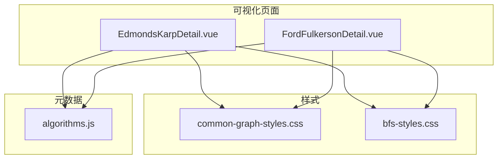
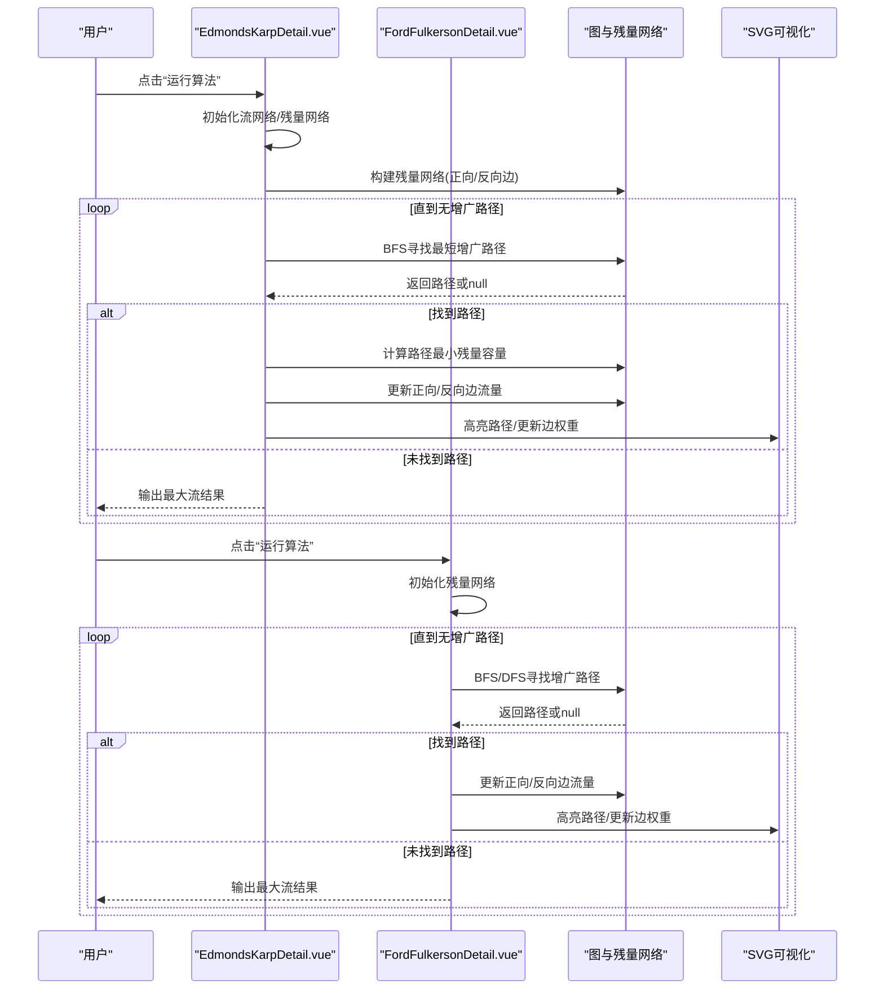
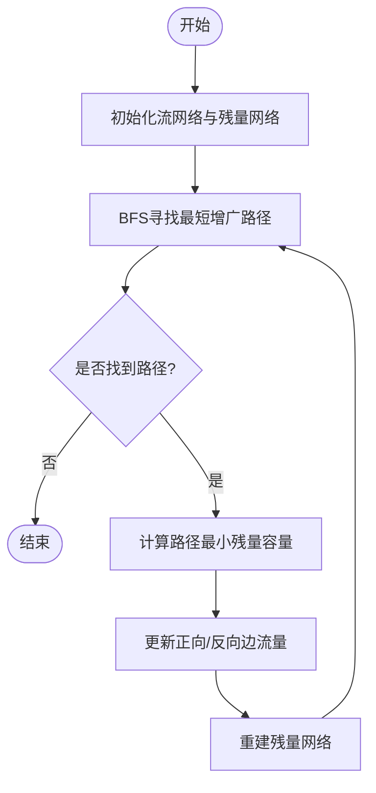
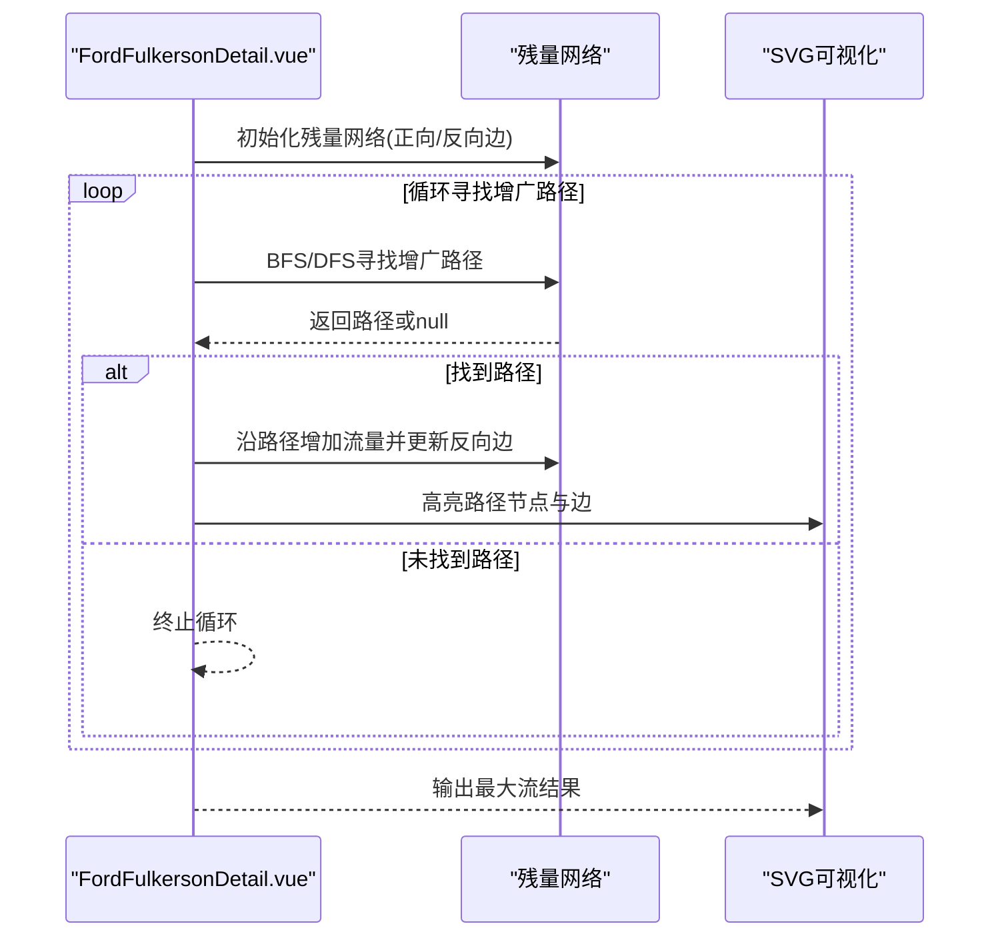
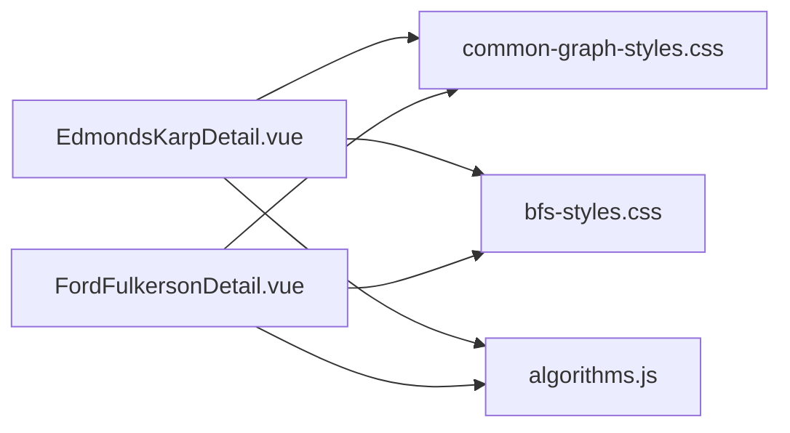

# 最大流算法

<cite>
**本文引用的文件**
- [EdmondsKarpDetail.vue](file://suanfa_vue/src/components/algorithms/graph_algorithms/EdmondsKarpDetail.vue)
- [FordFulkersonDetail.vue](file://suanfa_vue/src/components/algorithms/graph_algorithms/FordFulkersonDetail.vue)
- [bfs-styles.css](file://suanfa_vue/src/components/algorithms/graph_algorithms/bfs-styles.css)
- [common-graph-styles.css](file://suanfa_vue/src/components/algorithms/graph_algorithms/common-graph-styles.css)
- [algorithms.js](file://suanfa_vue/src/data/algorithms.js)
</cite>

## 目录
1. [简介](#简介)
2. [项目结构](#项目结构)
3. [核心组件](#核心组件)
4. [架构总览](#架构总览)
5. [详细组件分析](#详细组件分析)
6. [依赖关系分析](#依赖关系分析)
7. [性能与复杂度](#性能与复杂度)
8. [故障排查指南](#故障排查指南)
9. [结论](#结论)
10. [附录：可视化与交互说明](#附录可视化与交互说明)

## 简介
本文件面向“最大流”主题，结合前端可视化实现，系统讲解残量网络、增广路径、流量更新机制，并对比 Edmonds-Karp（BFS 找最短增广路径）与 Ford-Fulkerson（DFS/BFS 任意增广路径）两种方法。文档同时覆盖容量约束、流量守恒、割集概念，以及可视化中的流量分布显示、瓶颈边识别、残量网络更新动画等交互细节。最后给出时间复杂度、收敛性要点与实际应用场景。

## 项目结构
本项目在 Vue 前端中为图算法提供可视化页面，其中最大流相关页面位于 graph_algorithms 目录下：
- Edmonds-Karp 可视化：EdmondsKarpDetail.vue
- Ford-Fulkerson 可视化：FordFulkersonDetail.vue
- 通用样式：common-graph-styles.css、bfs-styles.css
- 算法元数据与路由信息：algorithms.js

图表来源
- [EdmondsKarpDetail.vue:1-720](file://suanfa_vue/src/components/algorithms/graph_algorithms/EdmondsKarpDetail.vue#L1-L720)
- [FordFulkersonDetail.vue:1-690](file://suanfa_vue/src/components/algorithms/graph_algorithms/FordFulkersonDetail.vue#L1-L690)
- [common-graph-styles.css:1-238](file://suanfa_vue/src/components/algorithms/graph_algorithms/common-graph-styles.css#L1-L238)
- [bfs-styles.css:1-160](file://suanfa_vue/src/components/algorithms/graph_algorithms/bfs-styles.css#L1-L160)
- [algorithms.js:539-580](file://suanfa_vue/src/data/algorithms.js#L539-L580)

章节来源
- [EdmondsKarpDetail.vue:1-720](file://suanfa_vue/src/components/algorithms/graph_algorithms/EdmondsKarpDetail.vue#L1-L720)
- [FordFulkersonDetail.vue:1-690](file://suanfa_vue/src/components/algorithms/graph_algorithms/FordFulkersonDetail.vue#L1-L690)
- [common-graph-styles.css:1-238](file://suanfa_vue/src/components/algorithms/graph_algorithms/common-graph-styles.css#L1-L238)
- [bfs-styles.css:1-160](file://suanfa_vue/src/components/algorithms/graph_algorithms/bfs-styles.css#L1-L160)
- [algorithms.js:539-580](file://suanfa_vue/src/data/algorithms.js#L539-L580)

## 核心组件
- Edmonds-Karp 可视化组件：负责生成随机流网络、维护流网络与残量网络、使用 BFS 寻找最短增广路径、沿路径更新流量、展示步骤历史与动画。
- Ford-Fulkerson 可视化组件：负责生成带残量网络的图、使用 BFS 寻找增广路径（也可替换为 DFS）、更新反向边与正向边流量、高亮当前增广路径与节点。
- 样式层：统一 SVG 节点、边、队列、步骤历史等视觉风格，支持高亮、虚线动画、响应式布局。
- 元数据：提供算法名称、分类、复杂度等信息，便于导航与展示。

章节来源
- [EdmondsKarpDetail.vue:86-146](file://suanfa_vue/src/components/algorithms/graph_algorithms/EdmondsKarpDetail.vue#L86-L146)
- [FordFulkersonDetail.vue:105-211](file://suanfa_vue/src/components/algorithms/graph_algorithms/FordFulkersonDetail.vue#L105-L211)
- [common-graph-styles.css:1-238](file://suanfa_vue/src/components/algorithms/graph_algorithms/common-graph-styles.css#L1-L238)
- [bfs-styles.css:1-160](file://suanfa_vue/src/components/algorithms/graph_algorithms/bfs-styles.css#L1-L160)
- [algorithms.js:539-580](file://suanfa_vue/src/data/algorithms.js#L539-L580)

## 架构总览
下图展示了两个可视化组件的调用流程与状态流转，包括图生成、残量网络构建、增广路径搜索、流量更新与结果输出。

图表来源
- [EdmondsKarpDetail.vue:308-481](file://suanfa_vue/src/components/algorithms/graph_algorithms/EdmondsKarpDetail.vue#L308-L481)
- [FordFulkersonDetail.vue:337-504](file://suanfa_vue/src/components/algorithms/graph_algorithms/FordFulkersonDetail.vue#L337-L504)

## 详细组件分析

### Edmonds-Karp 组件分析
- 图生成：按节点数量与容量范围生成有向边，确保源点到汇点存在基础路径，并随机添加额外边。
- 残量网络：对每条边维护正向边（剩余容量=容量-流量）和反向边（剩余容量=流量），用于允许“撤销”已分配流量。
- BFS 增广路径：从源点出发，按层扩展，优先探索容量较大的边以提升效率；到达汇点即回溯得到路径。
- 流量更新：沿路径取最小残量容量，更新正向边增加流量、反向边减少流量；累计最大流。
- 可视化：通过 SVG 绘制节点与边，动态高亮当前 BFS 访问节点、队列、增广路径；显示每步详情与历史。

图表来源
- [EdmondsKarpDetail.vue:232-257](file://suanfa_vue/src/components/algorithms/graph_algorithms/EdmondsKarpDetail.vue#L232-L257)
- [EdmondsKarpDetail.vue:308-360](file://suanfa_vue/src/components/algorithms/graph_algorithms/EdmondsKarpDetail.vue#L308-L360)
- [EdmondsKarpDetail.vue:396-481](file://suanfa_vue/src/components/algorithms/graph_algorithms/EdmondsKarpDetail.vue#L396-L481)

章节来源
- [EdmondsKarpDetail.vue:86-146](file://suanfa_vue/src/components/algorithms/graph_algorithms/EdmondsKarpDetail.vue#L86-L146)
- [EdmondsKarpDetail.vue:232-257](file://suanfa_vue/src/components/algorithms/graph_algorithms/EdmondsKarpDetail.vue#L232-L257)
- [EdmondsKarpDetail.vue:308-360](file://suanfa_vue/src/components/algorithms/graph_algorithms/EdmondsKarpDetail.vue#L308-L360)
- [EdmondsKarpDetail.vue:396-481](file://suanfa_vue/src/components/algorithms/graph_algorithms/EdmondsKarpDetail.vue#L396-L481)

### Ford-Fulkerson 组件分析
- 图生成：构造包含源点与汇点的有向图，并为每条边建立正向与反向边，初始反向边容量为 0。
- 增广路径搜索：使用 BFS 查找从源到汇的路径（可替换为 DFS），记录前驱以回溯路径。
- 流量更新：沿路径增加流量，同步更新反向边流量；累计最大流值。
- 可视化：高亮当前增广路径上的节点与边，完成后标记最终状态；显示步骤历史与统计信息。

图表来源
- [FordFulkersonDetail.vue:181-206](file://suanfa_vue/src/components/algorithms/graph_algorithms/FordFulkersonDetail.vue#L181-L206)
- [FordFulkersonDetail.vue:337-391](file://suanfa_vue/src/components/algorithms/graph_algorithms/FordFulkersonDetail.vue#L337-L391)
- [FordFulkersonDetail.vue:423-504](file://suanfa_vue/src/components/algorithms/graph_algorithms/FordFulkersonDetail.vue#L423-L504)

章节来源
- [FordFulkersonDetail.vue:105-211](file://suanfa_vue/src/components/algorithms/graph_algorithms/FordFulkersonDetail.vue#L105-L211)
- [FordFulkersonDetail.vue:337-391](file://suanfa_vue/src/components/algorithms/graph_algorithms/FordFulkersonDetail.vue#L337-L391)
- [FordFulkersonDetail.vue:423-504](file://suanfa_vue/src/components/algorithms/graph_algorithms/FordFulkersonDetail.vue#L423-L504)

### 可视化与交互说明
- 流量分布显示：边标签显示“当前流量/容量”，流量大于 0 的边加粗并着色；完成时统一高亮。
- 瓶颈边识别：每次增广路径的最小残量容量即为该路径的瓶颈；可在步骤历史中查看具体数值。
- 残量网络更新动画：每次更新后重建残量网络，并通过 SVG 重绘边与节点；BFS 过程中逐层高亮访问节点与队列。
- 控制项：节点数量、容量范围、动画速度可调；支持生成新图、运行算法、重置算法。

章节来源
- [EdmondsKarpDetail.vue:574-663](file://suanfa_vue/src/components/algorithms/graph_algorithms/EdmondsKarpDetail.vue#L574-L663)
- [FordFulkersonDetail.vue:570-630](file://suanfa_vue/src/components/algorithms/graph_algorithms/FordFulkersonDetail.vue#L570-L630)
- [common-graph-styles.css:128-155](file://suanfa_vue/src/components/algorithms/graph_algorithms/common-graph-styles.css#L128-L155)
- [bfs-styles.css:89-121](file://suanfa_vue/src/components/algorithms/graph_algorithms/bfs-styles.css#L89-L121)

## 依赖关系分析
- 组件间耦合：两个可视化组件各自独立，不互相引用；共享样式与元数据。
- 外部依赖：Vue 响应式状态管理（ref、watch、onMounted）驱动 UI 更新；SVG 渲染图形。
- 样式依赖：common-graph-styles.css 提供基础布局与按钮样式；bfs-styles.css 提供 BFS 相关高亮与动画。
- 元数据依赖：algorithms.js 提供算法分类与复杂度信息，便于导航与展示。

图表来源
- [EdmondsKarpDetail.vue:1-720](file://suanfa_vue/src/components/algorithms/graph_algorithms/EdmondsKarpDetail.vue#L1-L720)
- [FordFulkersonDetail.vue:1-690](file://suanfa_vue/src/components/algorithms/graph_algorithms/FordFulkersonDetail.vue#L1-L690)
- [common-graph-styles.css:1-238](file://suanfa_vue/src/components/algorithms/graph_algorithms/common-graph-styles.css#L1-L238)
- [bfs-styles.css:1-160](file://suanfa_vue/src/components/algorithms/graph_algorithms/bfs-styles.css#L1-L160)
- [algorithms.js:539-580](file://suanfa_vue/src/data/algorithms.js#L539-L580)

章节来源
- [EdmondsKarpDetail.vue:1-720](file://suanfa_vue/src/components/algorithms/graph_algorithms/EdmondsKarpDetail.vue#L1-L720)
- [FordFulkersonDetail.vue:1-690](file://suanfa_vue/src/components/algorithms/graph_algorithms/FordFulkersonDetail.vue#L1-L690)
- [common-graph-styles.css:1-238](file://suanfa_vue/src/components/algorithms/graph_algorithms/common-graph-styles.css#L1-L238)
- [bfs-styles.css:1-160](file://suanfa_vue/src/components/algorithms/graph_algorithms/bfs-styles.css#L1-L160)
- [algorithms.js:539-580](file://suanfa_vue/src/data/algorithms.js#L539-L580)

## 性能与复杂度
- Edmonds-Karp：使用 BFS 寻找最短增广路径，时间复杂度 O(V·E²)，空间复杂度 O(V+E)。适合中等规模网络，保证稳定收敛。
- Ford-Fulkerson：若使用 DFS 寻找任意增广路径，最坏时间复杂度 O(F·E)，其中 F 为最大流值；使用 BFS 则退化为 Edmonds-Karp。空间复杂度 O(V+E)。
- 实际表现：可视化中通过动画速度与逐步更新提升理解度；大规模图可能影响渲染性能，建议合理设置节点数量与容量范围。

章节来源
- [algorithms.js:539-580](file://suanfa_vue/src/data/algorithms.js#L539-L580)

## 故障排查指南
- 输入校验：节点数量、容量范围需为有效数字且满足约束；组件内对异常值进行回退与警告。
- 生成失败：检查随机边生成逻辑与源-汇连通性；错误信息会显示在界面并记录日志。
- 算法执行失败：捕获异常并更新状态为“算法失败”，步骤历史中追加错误信息。
- 可视化异常：确认节点位置生成与 SVG 路径计算正确；检查样式类名与绑定数据。

章节来源
- [EdmondsKarpDetail.vue:46-83](file://suanfa_vue/src/components/algorithms/graph_algorithms/EdmondsKarpDetail.vue#L46-L83)
- [EdmondsKarpDetail.vue:196-230](file://suanfa_vue/src/components/algorithms/graph_algorithms/EdmondsKarpDetail.vue#L196-L230)
- [EdmondsKarpDetail.vue:473-481](file://suanfa_vue/src/components/algorithms/graph_algorithms/EdmondsKarpDetail.vue#L473-L481)
- [FordFulkersonDetail.vue:66-103](file://suanfa_vue/src/components/algorithms/graph_algorithms/FordFulkersonDetail.vue#L66-L103)
- [FordFulkersonDetail.vue:252-280](file://suanfa_vue/src/components/algorithms/graph_algorithms/FordFulkersonDetail.vue#L252-L280)
- [FordFulkersonDetail.vue:496-504](file://suanfa_vue/src/components/algorithms/graph_algorithms/FordFulkersonDetail.vue#L496-L504)

## 结论
本仓库提供了 Edmonds-Karp 与 Ford-Fulkerson 的最大流算法可视化实现，涵盖残量网络、增广路径、流量更新的核心机制。通过交互式动画与步骤历史，帮助学习者直观理解算法过程。Edmonds-Karp 保证多项式时间复杂度，适用于教学与中等规模问题；Ford-Fulkerson 更灵活，但需注意最坏情况下的复杂度。两者均可用于网络传输、匹配问题等实际场景。

## 附录：可视化与交互说明
- 流量分布显示：边标签“流量/容量”，流量大于 0 的边高亮；完成时统一着色。
- 瓶颈边识别：每次增广路径的最小残量容量即为瓶颈；步骤历史中可查看具体数值。
- 残量网络更新动画：每次更新后重建残量网络，SVG 重绘边与节点；BFS 过程中逐层高亮访问节点与队列。
- 控制项：节点数量、容量范围、动画速度可调；支持生成新图、运行算法、重置算法。

章节来源
- [EdmondsKarpDetail.vue:574-663](file://suanfa_vue/src/components/algorithms/graph_algorithms/EdmondsKarpDetail.vue#L574-L663)
- [FordFulkersonDetail.vue:570-630](file://suanfa_vue/src/components/algorithms/graph_algorithms/FordFulkersonDetail.vue#L570-L630)
- [common-graph-styles.css:128-155](file://suanfa_vue/src/components/algorithms/graph_algorithms/common-graph-styles.css#L128-L155)
- [bfs-styles.css:89-121](file://suanfa_vue/src/components/algorithms/graph_algorithms/bfs-styles.css#L89-L121)