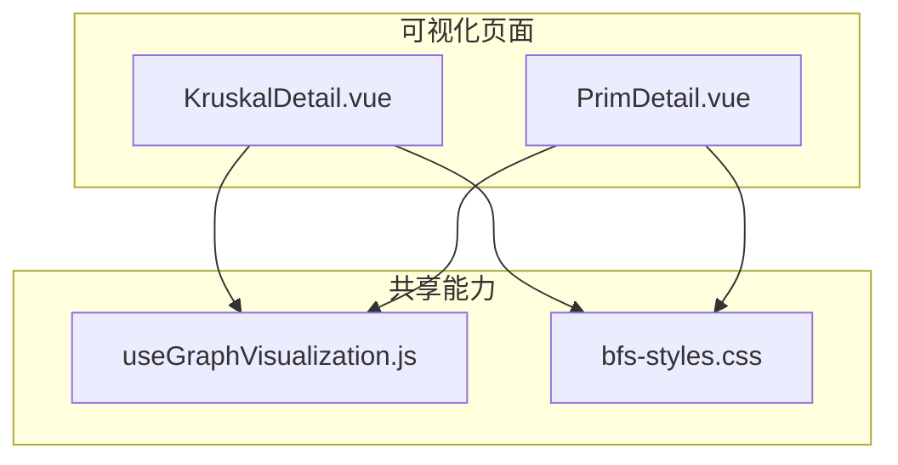
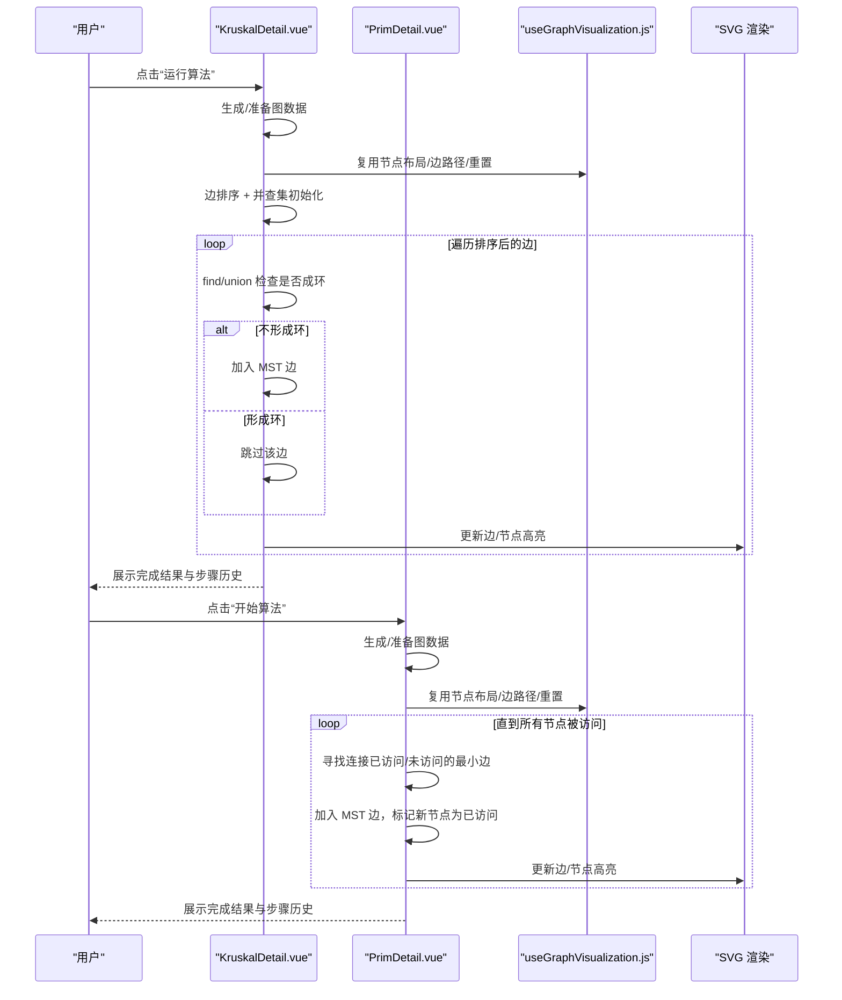
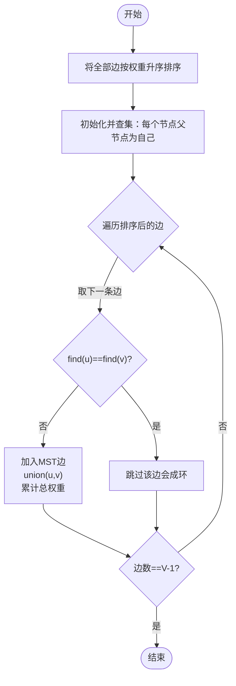
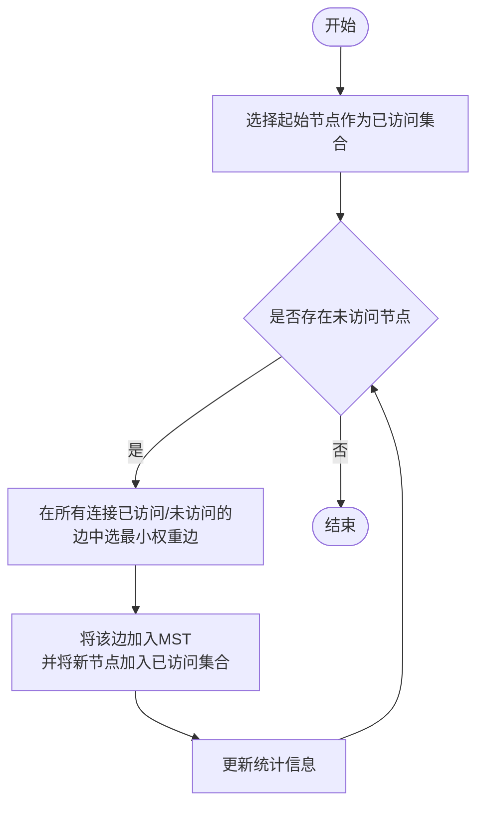
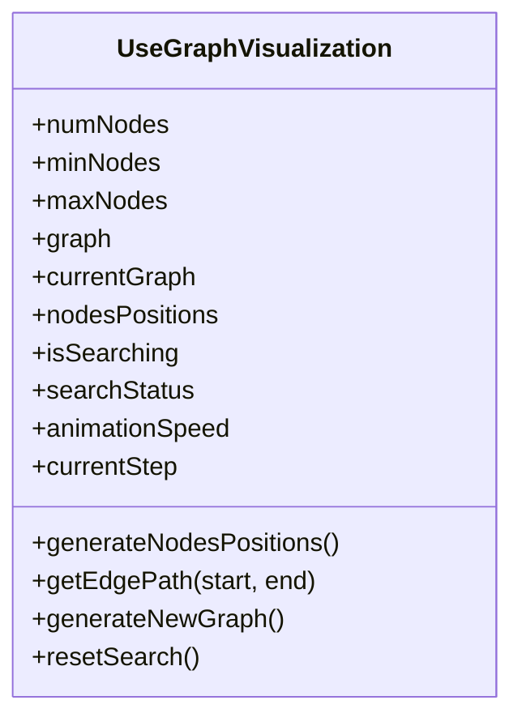
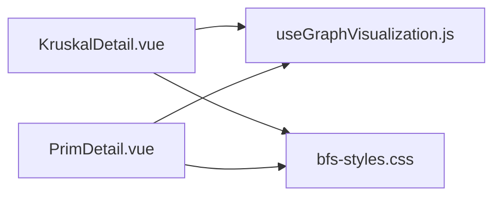

# 最小生成树算法

<cite>
**本文引用的文件**
- [KruskalDetail.vue](file://suanfa_vue/src/components/algorithms/graph_algorithms/KruskalDetail.vue)
- [PrimDetail.vue](file://suanfa_vue/src/components/algorithms/graph_algorithms/PrimDetail.vue)
- [useGraphVisualization.js](file://suanfa_vue/src/composables/useGraphVisualization.js)
- [bfs-styles.css](file://suanfa_vue/src/components/algorithms/graph_algorithms/bfs-styles.css)
</cite>

## 目录
1. [简介](#简介)
2. [项目结构](#项目结构)
3. [核心组件](#核心组件)
4. [架构总览](#架构总览)
5. [详细组件分析](#详细组件分析)
6. [依赖关系分析](#依赖关系分析)
7. [性能与复杂度](#性能与复杂度)
8. [故障排查指南](#故障排查指南)
9. [结论](#结论)
10. [附录：可视化交互说明](#附录可视化交互说明)

## 简介
本文件面向最小生成树（MST）的可视化实现，聚焦 Kruskal 与 Prim 两种经典算法。文档从工程实现角度解释：
- Kruskal：边排序策略、并查集数据结构、贪心选择原则、环检测机制、连通分量管理。
- Prim：顶点扩展策略、优先队列优化思路、邻接表表示、最小边选择过程。
同时对比两者在时间复杂度、适用图类型（稠密图 vs 稀疏图）、实现难度上的差异，并结合前端可视化中的动画、权重显示、步骤历史等交互进行说明。

## 项目结构
本项目采用前后端分离的前端可视化方案：
- 前端 Vue 单文件组件分别实现 Kruskal 与 Prim 的可视化页面，包含图生成、SVG 渲染、状态管理与动画控制。
- 共享的可组合式函数提供通用的图可视化能力（节点布局、边路径计算、重置流程等）。
- 样式文件统一了可视化界面风格与高亮效果。

图表来源
- [KruskalDetail.vue:1-561](file://suanfa_vue/src/components/algorithms/graph_algorithms/KruskalDetail.vue#L1-L561)
- [PrimDetail.vue:1-440](file://suanfa_vue/src/components/algorithms/graph_algorithms/PrimDetail.vue#L1-L440)
- [useGraphVisualization.js:1-148](file://suanfa_vue/src/composables/useGraphVisualization.js#L1-L148)
- [bfs-styles.css:1-160](file://suanfa_vue/src/components/algorithms/graph_algorithms/bfs-styles.css#L1-L160)

章节来源
- [KruskalDetail.vue:1-561](file://suanfa_vue/src/components/algorithms/graph_algorithms/KruskalDetail.vue#L1-L561)
- [PrimDetail.vue:1-440](file://suanfa_vue/src/components/algorithms/graph_algorithms/PrimDetail.vue#L1-L440)
- [useGraphVisualization.js:1-148](file://suanfa_vue/src/composables/useGraphVisualization.js#L1-L148)
- [bfs-styles.css:1-160](file://suanfa_vue/src/components/algorithms/graph_algorithms/bfs-styles.css#L1-L160)

## 核心组件
- Kruskal 可视化组件：负责随机加权无向图生成、边排序、并查集维护、逐步添加边、动画与步骤记录。
- Prim 可视化组件：负责连通图生成、邻接表表示、从起点逐步扩展、选择最小权重边、动画与步骤记录。
- 共享可视化可组合式：提供节点位置生成、边路径绘制、重置逻辑、通用状态管理。
- 样式：统一节点、边、MST 高亮、步骤项颜色等视觉表现。

章节来源
- [KruskalDetail.vue:257-374](file://suanfa_vue/src/components/algorithms/graph_algorithms/KruskalDetail.vue#L257-L374)
- [PrimDetail.vue:320-417](file://suanfa_vue/src/components/algorithms/graph_algorithms/PrimDetail.vue#L320-L417)
- [useGraphVisualization.js:49-138](file://suanfa_vue/src/composables/useGraphVisualization.js#L49-L138)
- [bfs-styles.css:47-70](file://suanfa_vue/src/components/algorithms/graph_algorithms/bfs-styles.css#L47-L70)

## 架构总览
下图展示了两个算法组件与共享能力的协作关系，以及数据流与控制流的基本走向。

图表来源
- [KruskalDetail.vue:257-374](file://suanfa_vue/src/components/algorithms/graph_algorithms/KruskalDetail.vue#L257-L374)
- [PrimDetail.vue:320-417](file://suanfa_vue/src/components/algorithms/graph_algorithms/PrimDetail.vue#L320-L417)
- [useGraphVisualization.js:49-138](file://suanfa_vue/src/composables/useGraphVisualization.js#L49-L138)

## 详细组件分析

### Kruskal 算法可视化
- 边排序策略：将所有边按权重从小到大排序，确保每次考虑当前最小权重的边。
- 并查集数据结构：使用 parent 数组/映射实现查找与合并，配合路径压缩提升效率；用于判断加入某条边是否会形成环。
- 贪心选择原则：依次考察排序后的边，若两端点不在同一连通分量则加入 MST。
- 环检测机制：通过并查集的 find 操作判断两端点根节点是否相同。
- 树的构建过程：从空边集开始，逐步添加不会形成环的最小边，直至边数达到 V-1。
- 可视化特性：
  - 边添加/删除动画：通过异步延时与步骤记录驱动 UI 更新。
  - 权重比较显示：每条边的权重在 SVG 中居中显示，MST 边高亮。
  - 连通分量管理：并查集维护各节点的根节点，体现分量的合并过程。

图表来源
- [KruskalDetail.vue:277-357](file://suanfa_vue/src/components/algorithms/graph_algorithms/KruskalDetail.vue#L277-L357)

章节来源
- [KruskalDetail.vue:82-132](file://suanfa_vue/src/components/algorithms/graph_algorithms/KruskalDetail.vue#L82-L132)
- [KruskalDetail.vue:257-374](file://suanfa_vue/src/components/algorithms/graph_algorithms/KruskalDetail.vue#L257-L374)
- [KruskalDetail.vue:447-501](file://suanfa_vue/src/components/algorithms/graph_algorithms/KruskalDetail.vue#L447-L501)
- [bfs-styles.css:47-70](file://suanfa_vue/src/components/algorithms/graph_algorithms/bfs-styles.css#L47-L70)

### Prim 算法可视化
- 顶点扩展策略：从起始节点出发，维护已访问集合，每次选择连接已访问与未访问节点的最小权重边，将新节点纳入已访问集合。
- 优先队列优化：当前实现使用线性扫描寻找最小边；可替换为优先队列（堆）以优化至 O(E log V)。
- 邻接表表示：使用对象映射存储邻接关系与权重，便于遍历相邻边。
- 最小边选择规则：在所有跨割边中选择权重最小的边加入 MST。
- 可视化特性：
  - 边添加动画：每步添加一条边并高亮。
  - 权重比较显示：边权重在 SVG 中显示，MST 边高亮。
  - 连通性检查：若无法找到跨割边则抛出错误提示图不连通。

图表来源
- [PrimDetail.vue:320-417](file://suanfa_vue/src/components/algorithms/graph_algorithms/PrimDetail.vue#L320-L417)

章节来源
- [PrimDetail.vue:192-230](file://suanfa_vue/src/components/algorithms/graph_algorithms/PrimDetail.vue#L192-L230)
- [PrimDetail.vue:320-417](file://suanfa_vue/src/components/algorithms/graph_algorithms/PrimDetail.vue#L320-L417)
- [PrimDetail.vue:42-115](file://suanfa_vue/src/components/algorithms/graph_algorithms/PrimDetail.vue#L42-L115)
- [bfs-styles.css:47-70](file://suanfa_vue/src/components/algorithms/graph_algorithms/bfs-styles.css#L47-L70)

### 共享可视化能力
- 节点位置生成：环形布局，基于 viewBox 尺寸动态计算半径与中心点，保证不同节点数量下的良好分布。
- 边路径计算：计算边与箭头路径，使边在节点边缘处终止，箭头指向目标节点。
- 重置流程：统一清理搜索状态、复制原始图、调用 onReset 钩子处理算法专属状态。
- 通用状态：包括运行状态、动画速度、步骤计数、错误信息等。

图表来源
- [useGraphVisualization.js:16-148](file://suanfa_vue/src/composables/useGraphVisualization.js#L16-L148)

章节来源
- [useGraphVisualization.js:49-138](file://suanfa_vue/src/composables/useGraphVisualization.js#L49-L138)

## 依赖关系分析
- KruskalDetail.vue 依赖：
  - 自身实现的图生成与算法逻辑。
  - 共享可视化能力（节点布局、边路径、重置）。
  - 样式文件（MST 节点高亮、步骤项颜色）。
- PrimDetail.vue 依赖：
  - 自身实现的图生成与算法逻辑。
  - 共享可视化能力。
  - 样式文件。
- 共同依赖：
  - 样式文件统一视觉风格。
  - 共享可组合式减少重复代码，提高一致性。

图表来源
- [KruskalDetail.vue:1-561](file://suanfa_vue/src/components/algorithms/graph_algorithms/KruskalDetail.vue#L1-L561)
- [PrimDetail.vue:1-440](file://suanfa_vue/src/components/algorithms/graph_algorithms/PrimDetail.vue#L1-L440)
- [useGraphVisualization.js:1-148](file://suanfa_vue/src/composables/useGraphVisualization.js#L1-L148)
- [bfs-styles.css:1-160](file://suanfa_vue/src/components/algorithms/graph_algorithms/bfs-styles.css#L1-L160)

章节来源
- [KruskalDetail.vue:1-561](file://suanfa_vue/src/components/algorithms/graph_algorithms/KruskalDetail.vue#L1-L561)
- [PrimDetail.vue:1-440](file://suanfa_vue/src/components/algorithms/graph_algorithms/PrimDetail.vue#L1-L440)
- [useGraphVisualization.js:1-148](file://suanfa_vue/src/composables/useGraphVisualization.js#L1-L148)
- [bfs-styles.css:1-160](file://suanfa_vue/src/components/algorithms/graph_algorithms/bfs-styles.css#L1-L160)

## 性能与复杂度
- Kruskal：
  - 时间复杂度：O(E log E) 或 O(E log V)，主要开销在边排序；并查集操作近似常数时间（路径压缩后）。
  - 适用图类型：更适合稀疏图（E 较小），因为排序成本与边数相关。
  - 实现难度：中等，需正确实现并查集与环检测。
- Prim：
  - 时间复杂度：
    - 朴素实现（线性扫描最小边）：O(V^2)，适合稠密图。
    - 优先队列优化（二叉堆）：O(E log V)，适合稀疏图。
  - 适用图类型：
    - 朴素实现：稠密图更优。
    - 优先队列优化：稀疏图更优。
  - 实现难度：
    - 朴素实现：较低。
    - 优先队列优化：较高，需维护堆与键值更新。
- 对比总结：
  - 稀疏图：Kruskal 通常更直观且高效；Prim 用优先队列也可达相近复杂度。
  - 稠密图：Prim 朴素实现常优于 Kruskal。
  - 实现难度：Kruskal 需要并查集；Prim 优先队列实现较复杂但可扩展性强。

[本节为通用性能讨论，不直接分析具体文件]

## 故障排查指南
- 图不连通问题：
  - Prim 在无法找到跨割边时会抛出错误，提示图不连通，需检查图生成逻辑或输入图是否连通。
- 数据类型校验：
  - 节点数量、权重范围等参数需为有效数字，组件内对输入进行校验与边界修正。
- 动画与状态：
  - 运行中按钮禁用，避免重复触发；重置时清空步骤历史与状态，重新复制原始图。
- 可视化渲染：
  - 节点位置与边路径计算依赖 nodesPositions，确保首次渲染前同步生成初始位置，避免读取 undefined。

章节来源
- [PrimDetail.vue:372-374](file://suanfa_vue/src/components/algorithms/graph_algorithms/PrimDetail.vue#L372-L374)
- [KruskalDetail.vue:44-80](file://suanfa_vue/src/components/algorithms/graph_algorithms/KruskalDetail.vue#L44-L80)
- [useGraphVisualization.js:69-71](file://suanfa_vue/src/composables/useGraphVisualization.js#L69-L71)

## 结论
- Kruskal 通过边排序与并查集实现简洁高效的 MST 构建，适合稀疏图与教学演示。
- Prim 通过顶点扩展与最小边选择构建 MST，朴素实现适合稠密图，优先队列优化适合稀疏图。
- 前端可视化通过 SVG 渲染、动画与步骤历史增强理解，共享能力提升了代码复用性与一致性。
- 在实际工程中，可根据图的密度与性能需求选择合适的算法与实现方式。

[本节为总结性内容，不直接分析具体文件]

## 附录：可视化交互说明
- 边添加/删除动画：通过异步延时与步骤记录驱动 UI 更新，逐步展示算法执行过程。
- 权重比较显示：每条边的权重在 SVG 中居中显示，MST 边高亮以便区分。
- 连通分量管理：Kruskal 使用并查集维护连通分量，Prim 通过已访问集合体现扩展过程。
- 控制项：
  - 节点数量、权重范围、动画速度可调。
  - 支持生成新图、运行算法、重置算法等操作。
- 样式高亮：
  - MST 节点与边高亮，步骤项按类型着色，便于跟踪执行阶段。

章节来源
- [KruskalDetail.vue:447-501](file://suanfa_vue/src/components/algorithms/graph_algorithms/KruskalDetail.vue#L447-L501)
- [PrimDetail.vue:42-115](file://suanfa_vue/src/components/algorithms/graph_algorithms/PrimDetail.vue#L42-L115)
- [bfs-styles.css:47-70](file://suanfa_vue/src/components/algorithms/graph_algorithms/bfs-styles.css#L47-L70)