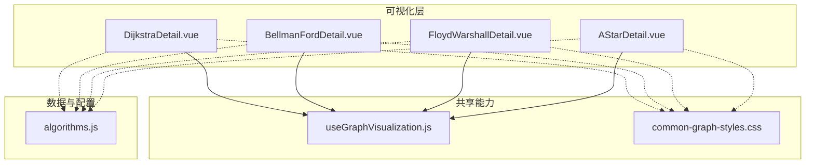
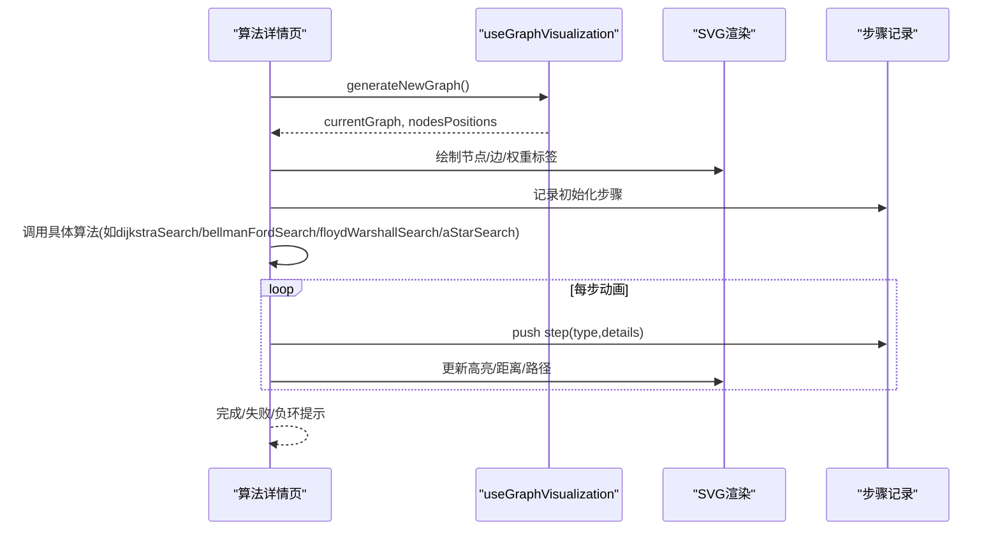
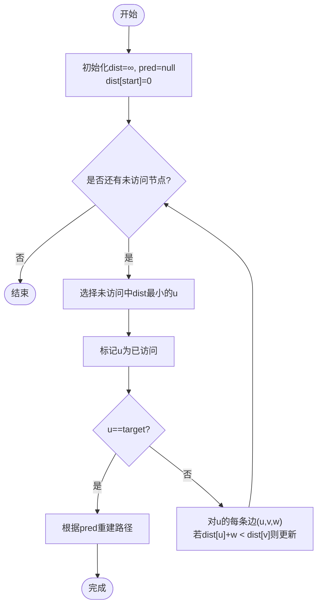
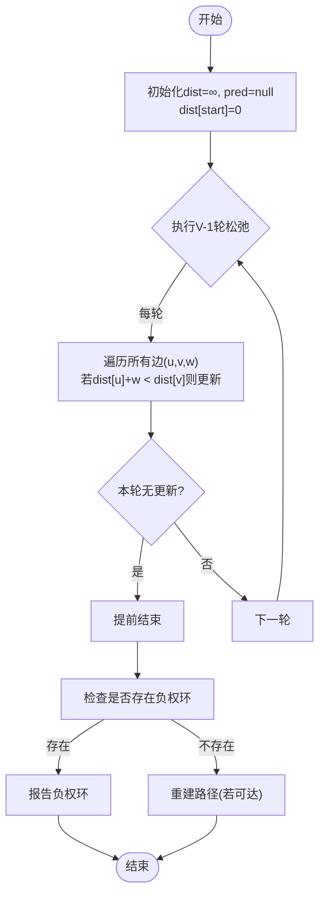
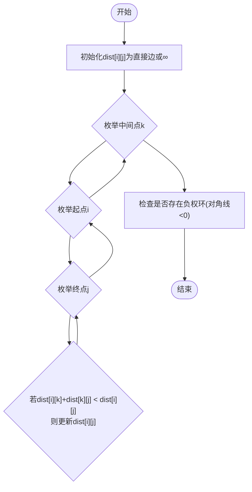
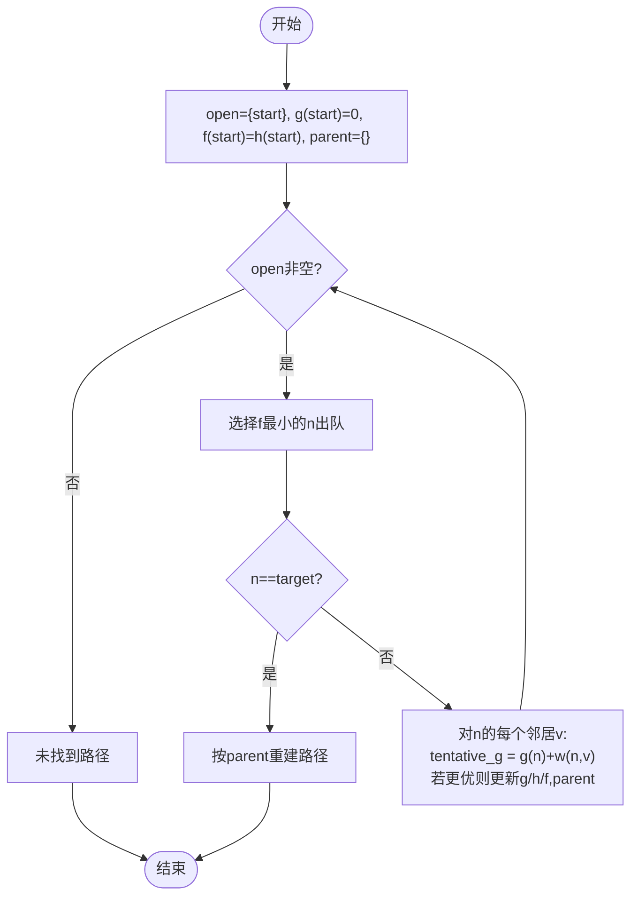
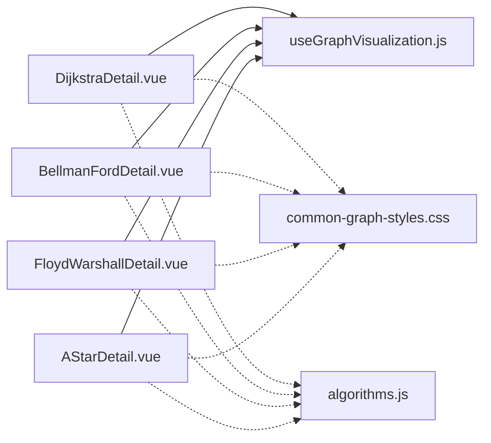

# 最短路径算法

<cite>
**本文引用的文件**
- [DijkstraDetail.vue](file://suanfa_vue/src/components/algorithms/graph_algorithms/DijkstraDetail.vue)
- [BellmanFordDetail.vue](file://suanfa_vue/src/components/algorithms/graph_algorithms/BellmanFordDetail.vue)
- [FloydWarshallDetail.vue](file://suanfa_vue/src/components/algorithms/graph_algorithms/FloydWarshallDetail.vue)
- [AStarDetail.vue](file://suanfa_vue/src/components/algorithms/graph_algorithms/AStarDetail.vue)
- [useGraphVisualization.js](file://suanfa_vue/src/composables/useGraphVisualization.js)
- [common-graph-styles.css](file://suanfa_vue/src/components/algorithms/graph_algorithms/common-graph-styles.css)
- [algorithms.js](file://suanfa_vue/src/data/algorithms.js)
</cite>

## 目录
1. [简介](#简介)
2. [项目结构](#项目结构)
3. [核心组件](#核心组件)
4. [架构总览](#架构总览)
5. [详细组件分析](#详细组件分析)
6. [依赖关系分析](#依赖关系分析)
7. [性能与复杂度](#性能与复杂度)
8. [故障排查指南](#故障排查指南)
9. [结论](#结论)
10. [附录：可视化功能说明](#附录可视化功能说明)

## 简介
本文件面向“最短路径算法”的可视化实现，覆盖 Dijkstra、Bellman-Ford、Floyd-Warshall 与 A* 四种经典算法。文档从系统架构、数据流、处理逻辑、错误处理与性能特性等维度进行系统化梳理，并结合代码级图示解释路径重建、距离更新、优先级队列优化以及可视化中的路径高亮、距离标注与步骤展示机制。

## 项目结构
前端采用 Vue 单页应用组织，图算法可视化集中在 graph_algorithms 目录下，每个算法一个 Detail 组件；共享的可视化调度逻辑抽取到 composables/useGraphVisualization.js；样式统一在 common-graph-styles.css；算法元信息（名称、描述、复杂度）集中维护在 data/algorithms.js。

图表来源
- [DijkstraDetail.vue:1-482](file://suanfa_vue/src/components/algorithms/graph_algorithms/DijkstraDetail.vue#L1-L482)
- [BellmanFordDetail.vue:1-473](file://suanfa_vue/src/components/algorithms/graph_algorithms/BellmanFordDetail.vue#L1-L473)
- [FloydWarshallDetail.vue:1-409](file://suanfa_vue/src/components/algorithms/graph_algorithms/FloydWarshallDetail.vue#L1-L409)
- [AStarDetail.vue:1-450](file://suanfa_vue/src/components/algorithms/graph_algorithms/AStarDetail.vue#L1-L450)
- [useGraphVisualization.js:1-148](file://suanfa_vue/src/composables/useGraphVisualization.js#L1-L148)
- [common-graph-styles.css:1-238](file://suanfa_vue/src/components/algorithms/graph_algorithms/common-graph-styles.css#L1-L238)
- [algorithms.js:410-494](file://suanfa_vue/src/data/algorithms.js#L410-L494)

章节来源
- [DijkstraDetail.vue:1-482](file://suanfa_vue/src/components/algorithms/graph_algorithms/DijkstraDetail.vue#L1-L482)
- [useGraphVisualization.js:1-148](file://suanfa_vue/src/composables/useGraphVisualization.js#L1-L148)
- [common-graph-styles.css:1-238](file://suanfa_vue/src/components/algorithms/graph_algorithms/common-graph-styles.css#L1-L238)
- [algorithms.js:410-494](file://suanfa_vue/src/data/algorithms.js#L410-L494)

## 核心组件
- 可视化脚手架 useGraphVisualization.js
  - 提供节点数校验、图生成、节点环形布局、边箭头路径计算、搜索状态管理、步骤记录与动画速度控制。
  - 通过 onReset 钩子让各算法组件注入自身专属状态的清理逻辑。
- 算法详情组件
  - DijkstraDetail.vue：单源最短路径（非负权重），贪心策略，逐步选择当前未访问的最小距离节点，支持路径重建与距离标注。
  - BellmanFordDetail.vue：单源最短路径（允许负权边），V-1 轮松弛 + 负环检测，支持路径重建与距离标注。
  - FloydWarshallDetail.vue：全源最短路径动态规划，三重循环更新距离矩阵，支持负权边与负环检测。
  - AStarDetail.vue：启发式搜索（g+h），开放/关闭集合，优先选择 f 最小节点，支持路径重建与距离标注。

章节来源
- [useGraphVisualization.js:1-148](file://suanfa_vue/src/composables/useGraphVisualization.js#L1-L148)
- [DijkstraDetail.vue:146-275](file://suanfa_vue/src/components/algorithms/graph_algorithms/DijkstraDetail.vue#L146-L275)
- [BellmanFordDetail.vue:97-261](file://suanfa_vue/src/components/algorithms/graph_algorithms/BellmanFordDetail.vue#L97-L261)
- [FloydWarshallDetail.vue:108-221](file://suanfa_vue/src/components/algorithms/graph_algorithms/FloydWarshallDetail.vue#L108-L221)
- [AStarDetail.vue:107-267](file://suanfa_vue/src/components/algorithms/graph_algorithms/AStarDetail.vue#L107-L267)

## 架构总览
下图展示了四个算法组件如何复用共享可视化能力，并在各自模板中渲染 SVG 图、统计面板、步骤历史与控件。

图表来源
- [useGraphVisualization.js:104-138](file://suanfa_vue/src/composables/useGraphVisualization.js#L104-L138)
- [DijkstraDetail.vue:146-275](file://suanfa_vue/src/components/algorithms/graph_algorithms/DijkstraDetail.vue#L146-L275)
- [BellmanFordDetail.vue:97-261](file://suanfa_vue/src/components/algorithms/graph_algorithms/BellmanFordDetail.vue#L97-L261)
- [FloydWarshallDetail.vue:108-221](file://suanfa_vue/src/components/algorithms/graph_algorithms/FloydWarshallDetail.vue#L108-L221)
- [AStarDetail.vue:107-267](file://suanfa_vue/src/components/algorithms/graph_algorithms/AStarDetail.vue#L107-L267)

## 详细组件分析

### Dijkstra 算法（单源最短路径，非负权重）
- 核心思想
  - 维护 dist[] 与 predecessor[]，每次从未访问节点中选择距离最小的节点进行扩展，并松弛其邻接边。
  - 当目标节点被选中时，基于 predecessor 回溯重建路径。
- 可视化要点
  - 使用 getEdgePath 计算带箭头的边路径，并在模板中为路径边添加 path-highlight 类以高亮最终最短路径。
  - 节点上方显示当前 dist 值；起点/终点有额外标签。
- 时间复杂度
  - 朴素实现 O(V^2)，优先队列实现 O((V+E) log V)。
- 适用条件
  - 所有边权非负；若存在负权边，结果可能不正确。
- 路径重建
  - 找到目标后，沿 predecessor 自底向上回溯得到完整路径。

图表来源
- [DijkstraDetail.vue:146-275](file://suanfa_vue/src/components/algorithms/graph_algorithms/DijkstraDetail.vue#L146-L275)

章节来源
- [DijkstraDetail.vue:146-275](file://suanfa_vue/src/components/algorithms/graph_algorithms/DijkstraDetail.vue#L146-L275)
- [algorithms.js:410-428](file://suanfa_vue/src/data/algorithms.js#L410-L428)

### Bellman-Ford 算法（单源最短路径，允许负权边）
- 核心思想
  - 进行 V-1 轮松弛，每轮遍历所有边尝试更新 dist。
  - 第 V 轮再检查一次，若仍可更新则存在负权环。
- 可视化要点
  - 每轮松弛与更新均记录步骤；负权边权重以红色显示；检测到负环时给出明确提示。
- 时间复杂度
  - O(V·E)。
- 适用条件
  - 允许负权边；若存在负权环，无法定义最短路径。
- 路径重建
  - 若无负环且目标可达，沿 predecessor 回溯得到路径。

图表来源
- [BellmanFordDetail.vue:97-261](file://suanfa_vue/src/components/algorithms/graph_algorithms/BellmanFordDetail.vue#L97-L261)

章节来源
- [BellmanFordDetail.vue:97-261](file://suanfa_vue/src/components/algorithms/graph_algorithms/BellmanFordDetail.vue#L97-L261)
- [algorithms.js:431-450](file://suanfa_vue/src/data/algorithms.js#L431-L450)

### Floyd-Warshall 算法（全源最短路径，动态规划）
- 核心思想
  - 用 dist[i][j] 表示 i 到 j 的最短距离，枚举中间点 k，尝试通过 k 缩短 i→j 的距离。
  - 完成后检查对角线 dist[i][i] < 0 判断是否存在负权环。
- 可视化要点
  - 每轮以某个 k 作为中间点，并在更新时记录步骤；可展示距离矩阵变化过程。
- 时间复杂度
  - O(V^3)。
- 适用条件
  - 允许负权边；若存在负权环，无法定义最短路径。
- 路径重建
  - 可在 DP 过程中维护 next[i][j] 或 parent 信息以重建任意两点间路径（当前实现简化为仅显示起止）。

图表来源
- [FloydWarshallDetail.vue:108-221](file://suanfa_vue/src/components/algorithms/graph_algorithms/FloydWarshallDetail.vue#L108-L221)

章节来源
- [FloydWarshallDetail.vue:108-221](file://suanfa_vue/src/components/algorithms/graph_algorithms/FloydWarshallDetail.vue#L108-L221)
- [algorithms.js:453-472](file://suanfa_vue/src/data/algorithms.js#L453-L472)

### A* 算法（启发式搜索，最优路径）
- 核心思想
  - 维护 g(n) 实际代价、h(n) 启发估计、f(n)=g(n)+h(n)。
  - 使用开放集合按 f 最小优先扩展，到达目标后通过 parent 重建路径。
- 可视化要点
  - 开放/关闭集合移动、邻居发现与代价更新均有步骤记录；可结合启发函数展示搜索方向性。
- 时间复杂度
  - 最坏 O(V^2)（线性扫描 openSet），平均 O(E log V)（使用优先队列）。
- 适用条件
  - 需要合理的启发函数 h(n) 保证可采纳性以获得最优解；通常用于网格/地图寻路。
- 路径重建
  - 通过 parent 指针从目标回溯至起点。

图表来源
- [AStarDetail.vue:107-267](file://suanfa_vue/src/components/algorithms/graph_algorithms/AStarDetail.vue#L107-L267)

章节来源
- [AStarDetail.vue:107-267](file://suanfa_vue/src/components/algorithms/graph_algorithms/AStarDetail.vue#L107-L267)
- [algorithms.js:475-494](file://suanfa_vue/src/data/algorithms.js#L475-L494)

## 依赖关系分析
- 组件耦合
  - 四个算法组件高度复用 useGraphVisualization.js 提供的图生成、布局、边路径计算与状态管理。
  - 样式通过 common-graph-styles.css 统一节点、边、按钮、步骤历史等视觉风格。
- 外部依赖
  - algorithms.js 提供算法元信息与复杂度数据，便于在界面中展示复杂度对比。
- 潜在循环依赖
  - 组件仅单向依赖 composable 与样式，无循环引用风险。

图表来源
- [DijkstraDetail.vue:1-482](file://suanfa_vue/src/components/algorithms/graph_algorithms/DijkstraDetail.vue#L1-L482)
- [BellmanFordDetail.vue:1-473](file://suanfa_vue/src/components/algorithms/graph_algorithms/BellmanFordDetail.vue#L1-L473)
- [FloydWarshallDetail.vue:1-409](file://suanfa_vue/src/components/algorithms/graph_algorithms/FloydWarshallDetail.vue#L1-L409)
- [AStarDetail.vue:1-450](file://suanfa_vue/src/components/algorithms/graph_algorithms/AStarDetail.vue#L1-L450)
- [useGraphVisualization.js:1-148](file://suanfa_vue/src/composables/useGraphVisualization.js#L1-L148)
- [common-graph-styles.css:1-238](file://suanfa_vue/src/components/algorithms/graph_algorithms/common-graph-styles.css#L1-L238)
- [algorithms.js:410-494](file://suanfa_vue/src/data/algorithms.js#L410-L494)

章节来源
- [useGraphVisualization.js:1-148](file://suanfa_vue/src/composables/useGraphVisualization.js#L1-L148)
- [common-graph-styles.css:1-238](file://suanfa_vue/src/components/algorithms/graph_algorithms/common-graph-styles.css#L1-L238)
- [algorithms.js:410-494](file://suanfa_vue/src/data/algorithms.js#L410-L494)

## 性能与复杂度
- Dijkstra
  - 时间：朴素 O(V^2)，优先队列 O((V+E) log V)
  - 空间：O(V)
  - 适用：非负权图；适合稠密图或需单源最短路径的场景
- Bellman-Ford
  - 时间：O(V·E)
  - 空间：O(V)
  - 适用：含负权边但无负环；可用于负环检测
- Floyd-Warshall
  - 时间：O(V^3)
  - 空间：O(V^2)
  - 适用：全源最短路径；小规模图或需要任意两点距离
- A*
  - 时间：最坏 O(V^2)，平均 O(E log V)（优先队列）
  - 空间：O(V)
  - 适用：具备良好启发函数的寻路问题；可显著减少搜索范围

章节来源
- [algorithms.js:410-494](file://suanfa_vue/src/data/algorithms.js#L410-L494)

## 故障排查指南
- 常见问题
  - 节点数量非法：输入非数字或越界会被自动修正或报错。
  - 图生成失败：抛出异常并显示错误消息，同时阻断后续搜索。
  - 搜索中断：isSearching 标志位确保运行期间禁用交互，避免并发修改。
- 定位方法
  - 查看“当前步骤详情”与“搜索步骤历史”，确认哪一步触发错误。
  - 检查控制台日志输出，确认图结构与参数是否符合预期。
- 恢复方式
  - 点击“重置搜索”清空状态并重新复制原始图；必要时“生成新图”刷新数据。

章节来源
- [useGraphVisualization.js:104-138](file://suanfa_vue/src/composables/useGraphVisualization.js#L104-L138)
- [DijkstraDetail.vue:267-275](file://suanfa_vue/src/components/algorithms/graph_algorithms/DijkstraDetail.vue#L267-L275)
- [BellmanFordDetail.vue:253-261](file://suanfa_vue/src/components/algorithms/graph_algorithms/BellmanFordDetail.vue#L253-L261)
- [FloydWarshallDetail.vue:213-221](file://suanfa_vue/src/components/algorithms/graph_algorithms/FloydWarshallDetail.vue#L213-L221)
- [AStarDetail.vue:259-267](file://suanfa_vue/src/components/algorithms/graph_algorithms/AStarDetail.vue#L259-L267)

## 结论
本项目将四种最短路径算法以统一的可视化框架呈现，既保证了教学演示的一致性，又便于扩展新的算法。通过步骤化展示、路径高亮与距离标注，用户能直观理解算法的执行过程与关键决策点。对于不同场景（单源/全源、正权/负权、是否需要启发式），可根据复杂度与约束选择合适的算法。

## 附录：可视化功能说明
- 路径高亮
  - 通过 isPathEdge 判断边是否在最终路径上，并为对应边添加 path-highlight 类，使其加粗并高亮显示。
- 距离标注
  - 节点上方实时显示当前 dist/gScore，帮助理解距离更新过程。
- 算法步骤展示
  - 每一步都记录 type 与 details，并在“搜索步骤历史”中滚动展示；“当前步骤详情”突出显示最新操作。
- 动画控制
  - 通过 animationSpeed 调节步骤间隔，便于观察快速或慢速执行效果。
- 图生成与布局
  - 使用环形布局均匀分布节点；getEdgePath 计算边与箭头，保证箭头指向正确且不遮挡节点。

章节来源
- [common-graph-styles.css:232-238](file://suanfa_vue/src/components/algorithms/graph_algorithms/common-graph-styles.css#L232-L238)
- [useGraphVisualization.js:49-102](file://suanfa_vue/src/composables/useGraphVisualization.js#L49-L102)
- [DijkstraDetail.vue:277-286](file://suanfa_vue/src/components/algorithms/graph_algorithms/DijkstraDetail.vue#L277-L286)
- [BellmanFordDetail.vue:263-282](file://suanfa_vue/src/components/algorithms/graph_algorithms/BellmanFordDetail.vue#L263-L282)
- [FloydWarshallDetail.vue:223-227](file://suanfa_vue/src/components/algorithms/graph_algorithms/FloydWarshallDetail.vue#L223-L227)
- [AStarDetail.vue:269-280](file://suanfa_vue/src/components/algorithms/graph_algorithms/AStarDetail.vue#L269-L280)