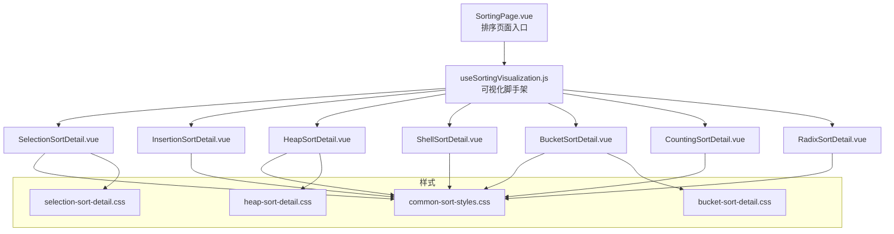
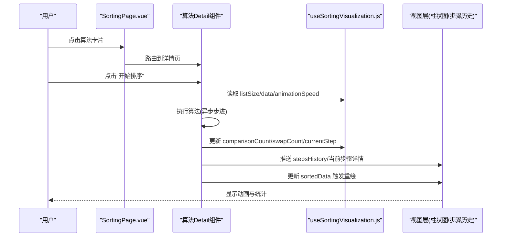
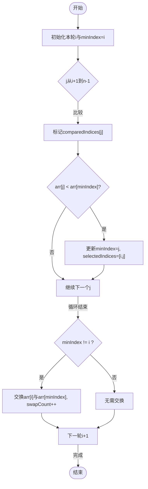
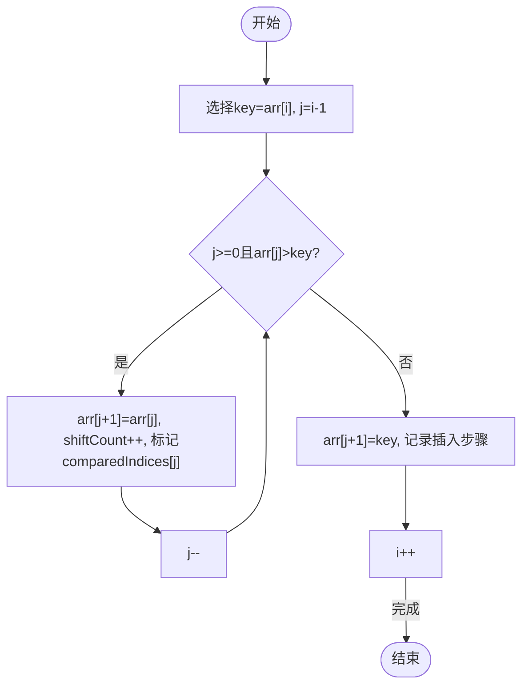
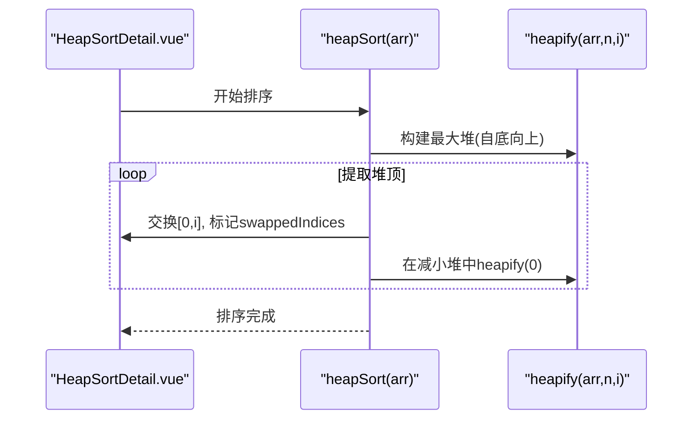
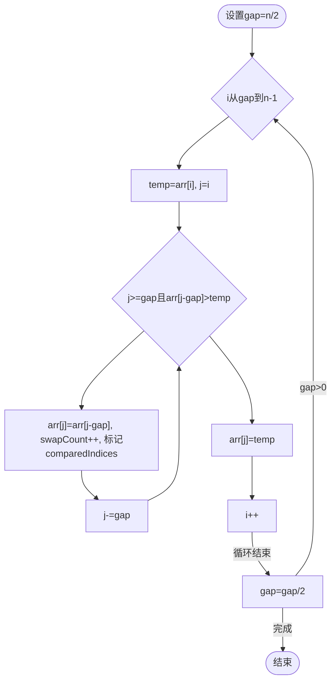
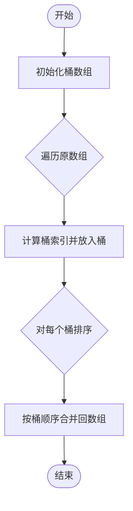
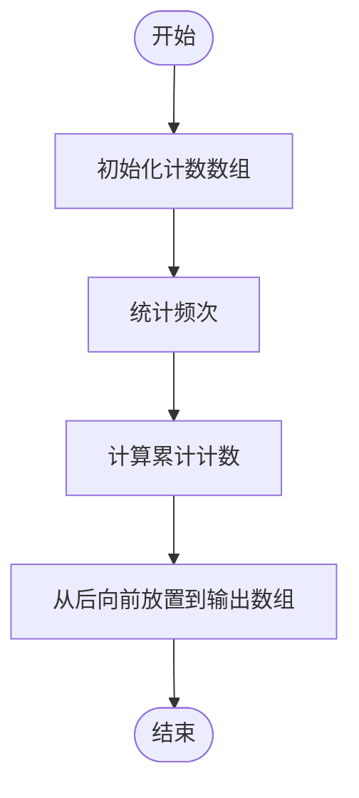
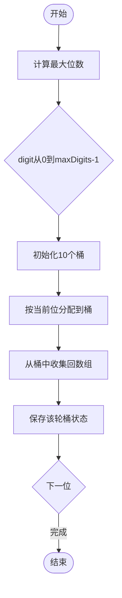
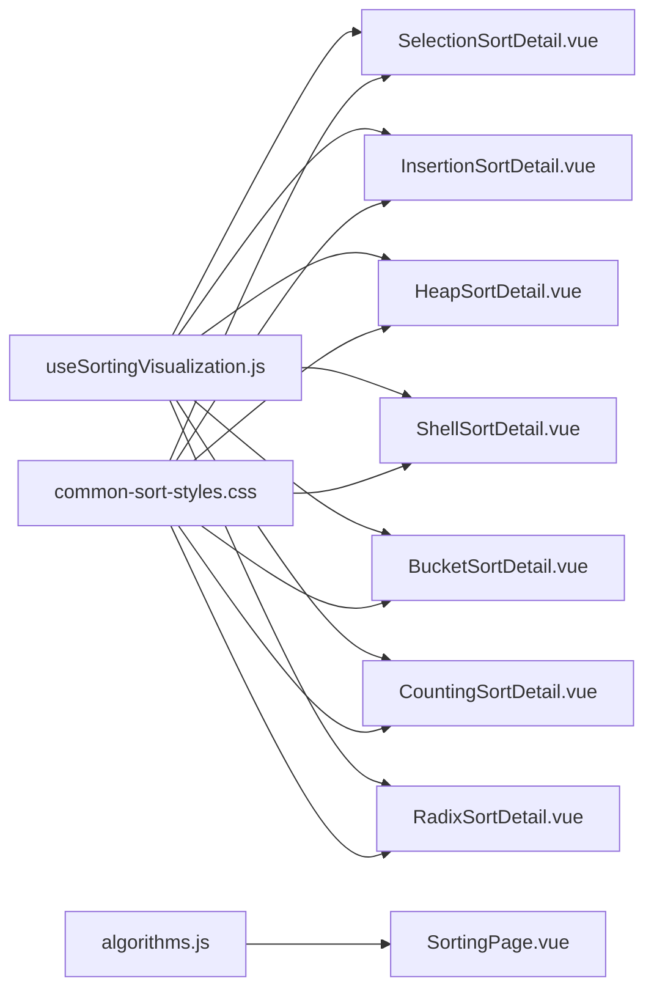

# 其他排序算法可视化

<cite>
**本文引用的文件**
- [SelectionSortDetail.vue](file://suanfa_vue/src/components/algorithms/sorting_algorithms/SelectionSortDetail.vue)
- [InsertionSortDetail.vue](file://suanfa_vue/src/components/algorithms/sorting_algorithms/InsertionSortDetail.vue)
- [HeapSortDetail.vue](file://suanfa_vue/src/components/algorithms/sorting_algorithms/HeapSortDetail.vue)
- [ShellSortDetail.vue](file://suanfa_vue/src/components/algorithms/sorting_algorithms/ShellSortDetail.vue)
- [BucketSortDetail.vue](file://suanfa_vue/src/components/algorithms/sorting_algorithms/BucketSortDetail.vue)
- [CountingSortDetail.vue](file://suanfa_vue/src/components/algorithms/sorting_algorithms/CountingSortDetail.vue)
- [RadixSortDetail.vue](file://suanfa_vue/src/components/algorithms/sorting_algorithms/RadixSortDetail.vue)
- [useSortingVisualization.js](file://suanfa_vue/src/composables/useSortingVisualization.js)
- [common-sort-styles.css](file://suanfa_vue/src/components/algorithms/sorting_algorithms/common-sort-styles.css)
- [selection-sort-detail.css](file://suanfa_vue/src/components/algorithms/sorting_algorithms/selection-sort-detail.css)
- [heap-sort-detail.css](file://suanfa_vue/src/components/algorithms/sorting_algorithms/heap-sort-detail.css)
- [bucket-sort-detail.css](file://suanfa_vue/src/components/algorithms/sorting_algorithms/bucket-sort-detail.css)
- [algorithms.js](file://suanfa_vue/src/data/algorithms.js)
- [SortingPage.vue](file://suanfa_vue/src/components/algorithms/sorting_algorithms/SortingPage.vue)
</cite>

## 目录
1. [简介](#简介)
2. [项目结构](#项目结构)
3. [核心组件](#核心组件)
4. [架构总览](#架构总览)
5. [详细组件分析](#详细组件分析)
6. [依赖关系分析](#依赖关系分析)
7. [性能与复杂度对比](#性能与复杂度对比)
8. [故障排查指南](#故障排查指南)
9. [结论](#结论)
10. [附录：交互控制接口与视觉规范](#附录：交互控制接口与视觉规范)

## 简介
本文件聚焦“其他排序算法”的可视化实现，覆盖选择排序、插入排序、堆排序、希尔排序、桶排序、计数排序、基数排序。文档从系统架构、组件职责、数据流、动画与交互设计、复杂度与应用场景等维度进行系统化说明，并提供统一的交互控制接口与一致的视觉风格建议，帮助读者理解并扩展这些可视化实现。

## 项目结构
前端采用 Vue 单文件组件组织，每个排序算法对应一个 Detail 组件；所有排序共享同一套可视化脚手架 composable，统一处理列表大小校验、随机数据生成、重置、统计状态与动画速度等通用逻辑。样式通过公共样式与算法专属样式组合，保证一致的视觉体验。

图表来源
- [SortingPage.vue:1-97](file://suanfa_vue/src/components/algorithms/sorting_algorithms/SortingPage.vue#L1-L97)
- [useSortingVisualization.js:1-111](file://suanfa_vue/src/composables/useSortingVisualization.js#L1-L111)
- [common-sort-styles.css:1-325](file://suanfa_vue/src/components/algorithms/sorting_algorithms/common-sort-styles.css#L1-L325)

章节来源
- [SortingPage.vue:1-97](file://suanfa_vue/src/components/algorithms/sorting_algorithms/SortingPage.vue#L1-L97)
- [useSortingVisualization.js:1-111](file://suanfa_vue/src/composables/useSortingVisualization.js#L1-L111)
- [common-sort-styles.css:1-325](file://suanfa_vue/src/components/algorithms/sorting_algorithms/common-sort-styles.css#L1-L325)

## 核心组件
- 可视化脚手架 useSortingVisualization：提供 listSize、data、sortedData、isSorting、animationSpeed、comparisonCount、swapCount、currentStep、comparedIndices、swappedIndices 等统一状态，以及 generateNewList、resetSort 等通用方法，并通过 onReset 钩子让各算法注入自身专属状态清理逻辑。
- 各算法 Detail 组件：封装各自算法的异步可视化流程（比较、交换、移动、分配、收集等），将步骤信息推入 sortingSteps，更新 currentStepDetails，驱动 UI 重绘。
- 公共样式：定义柱状条、高亮态（比较/交换/已排序）、步骤历史面板、控件布局等，确保一致视觉风格。

章节来源
- [useSortingVisualization.js:1-111](file://suanfa_vue/src/composables/useSortingVisualization.js#L1-L111)
- [common-sort-styles.css:1-325](file://suanfa_vue/src/components/algorithms/sorting_algorithms/common-sort-styles.css#L1-L325)

## 架构总览
下图展示用户操作到可视化更新的调用链：用户在 SortingPage 进入具体算法详情页，触发算法函数；算法函数基于共享状态推进步骤，更新 sortedData 与统计指标，UI 响应式渲染。

图表来源
- [SortingPage.vue:1-97](file://suanfa_vue/src/components/algorithms/sorting_algorithms/SortingPage.vue#L1-L97)
- [useSortingVisualization.js:1-111](file://suanfa_vue/src/composables/useSortingVisualization.js#L1-L111)

## 详细组件分析

### 选择排序（最小值选择动画）
- 可视化特征：每轮选定当前位置为候选最小值，扫描后续元素进行比较，若发现更小则更新最小值索引；一轮结束后与位置 i 交换。
- 关键状态：selectedIndices、minIndex、comparedIndices、comparisonCount、swapCount。
- 动画节奏：每步使用 animationSpeed 控制等待时间，逐步记录步骤详情。
- 适用场景：小规模数据、教学演示；对内存要求低，但比较次数固定 O(n^2)。

图表来源
- [SelectionSortDetail.vue:33-126](file://suanfa_vue/src/components/algorithms/sorting_algorithms/SelectionSortDetail.vue#L33-L126)

章节来源
- [SelectionSortDetail.vue:1-310](file://suanfa_vue/src/components/algorithms/sorting_algorithms/SelectionSortDetail.vue#L1-L310)
- [selection-sort-detail.css:1-11](file://suanfa_vue/src/components/algorithms/sorting_algorithms/selection-sort-detail.css#L1-L11)

### 插入排序（元素插入过程）
- 可视化特征：逐个选取待插入元素 key，在已排序区间从后向前比较并后移较大元素，直到找到合适位置插入。
- 关键状态：insertedIndices、shiftCount、comparedIndices、comparisonCount。
- 动画节奏：每次比较、移动、插入都记录步骤，便于观察有序区增长。
- 适用场景：近乎有序的小规模数据；稳定排序，原地排序。

图表来源
- [InsertionSortDetail.vue:33-117](file://suanfa_vue/src/components/algorithms/sorting_algorithms/InsertionSortDetail.vue#L33-L117)

章节来源
- [InsertionSortDetail.vue:1-290](file://suanfa_vue/src/components/algorithms/sorting_algorithms/InsertionSortDetail.vue#L1-L290)

### 堆排序（堆构建与调整）
- 可视化特征：先自底向上 heapify 构建最大堆，再反复将堆顶与末尾交换，缩小堆范围并重新 heapify。
- 关键状态：comparedIndices、swappedIndices、sortedIndices、heapifyCount、swapCount、stepsHistory。
- 颜色语义：比较蓝色、交换橙色、已排序绿色、根节点粉色、堆化紫色（由组件内 getBarColor 决定）。
- 适用场景：需要原地排序且最坏情况 O(n log n)，不稳定。

图表来源
- [HeapSortDetail.vue:177-255](file://suanfa_vue/src/components/algorithms/sorting_algorithms/HeapSortDetail.vue#L177-L255)

章节来源
- [HeapSortDetail.vue:1-322](file://suanfa_vue/src/components/algorithms/sorting_algorithms/HeapSortDetail.vue#L1-L322)
- [heap-sort-detail.css:1-32](file://suanfa_vue/src/components/algorithms/sorting_algorithms/heap-sort-detail.css#L1-L32)

### 希尔排序（间隔分组演示）
- 可视化特征：以递减间隔 gap 进行插入式排序，直观展示“分组—比较—移动—合并”的过程。
- 关键状态：gap、selectedIndices、comparedIndices、comparisonCount、swapCount。
- 适用场景：中等规模数据，优于简单插入排序；不稳定。

图表来源
- [ShellSortDetail.vue:32-114](file://suanfa_vue/src/components/algorithms/sorting_algorithms/ShellSortDetail.vue#L32-L114)

章节来源
- [ShellSortDetail.vue:1-250](file://suanfa_vue/src/components/algorithms/sorting_algorithms/ShellSortDetail.vue#L1-L250)

### 桶排序（非比较类特殊处理）
- 可视化特征：根据数据范围与桶数量计算桶大小，将元素分配到桶中，对每个桶内部排序（示例中使用插入排序），最后按序合并。
- 关键状态：bucketCount、maxDataValue、buckets、currentBucket、selectedIndices。
- 适用场景：数据均匀分布时接近线性；空间开销 O(n+k)。

图表来源
- [BucketSortDetail.vue:38-181](file://suanfa_vue/src/components/algorithms/sorting_algorithms/BucketSortDetail.vue#L38-L181)

章节来源
- [BucketSortDetail.vue:1-361](file://suanfa_vue/src/components/algorithms/sorting_algorithms/BucketSortDetail.vue#L1-L361)
- [bucket-sort-detail.css:1-10](file://suanfa_vue/src/components/algorithms/sorting_algorithms/bucket-sort-detail.css#L1-L10)

### 计数排序（非比较类特殊处理）
- 可视化特征：统计每个元素出现次数，计算累计计数，从后向前放置元素到输出数组。
- 关键状态：counts、maxValue、selectedIndices、comparisonCount、swapCount。
- 适用场景：整数范围 k 较小；稳定排序；时间 O(n+k)。

图表来源
- [CountingSortDetail.vue:42-131](file://suanfa_vue/src/components/algorithms/sorting_algorithms/CountingSortDetail.vue#L42-L131)

章节来源
- [CountingSortDetail.vue:1-270](file://suanfa_vue/src/components/algorithms/sorting_algorithms/CountingSortDetail.vue#L1-L270)

### 基数排序（非比较类特殊处理）
- 可视化特征：按位（从最低位到最高位）进行稳定分配收集（通常用计数排序思想），每轮维护桶状态并可回放历史。
- 关键状态：currentDigit、buckets、bucketsHistory、maxDigits、selectedIndices。
- 适用场景：定长整数或可映射为整数的键；稳定排序；时间 O(nk)。

图表来源
- [RadixSortDetail.vue:45-141](file://suanfa_vue/src/components/algorithms/sorting_algorithms/RadixSortDetail.vue#L45-L141)

章节来源
- [RadixSortDetail.vue:1-352](file://suanfa_vue/src/components/algorithms/sorting_algorithms/RadixSortDetail.vue#L1-L352)

## 依赖关系分析
- 组件耦合：各 Detail 组件仅依赖 useSortingVisualization 提供的通用能力，算法逻辑内聚于各自组件，降低耦合度。
- 样式解耦：公共样式集中管理，算法专属样式按需引入，避免重复与冲突。
- 数据源：排序算法元数据集中在 algorithms.js，用于页面分类与展示。

图表来源
- [useSortingVisualization.js:1-111](file://suanfa_vue/src/composables/useSortingVisualization.js#L1-L111)
- [common-sort-styles.css:1-325](file://suanfa_vue/src/components/algorithms/sorting_algorithms/common-sort-styles.css#L1-L325)
- [algorithms.js:1-800](file://suanfa_vue/src/data/algorithms.js#L1-L800)
- [SortingPage.vue:1-97](file://suanfa_vue/src/components/algorithms/sorting_algorithms/SortingPage.vue#L1-L97)

章节来源
- [useSortingVisualization.js:1-111](file://suanfa_vue/src/composables/useSortingVisualization.js#L1-L111)
- [algorithms.js:1-800](file://suanfa_vue/src/data/algorithms.js#L1-L800)

## 性能与复杂度对比
以下复杂度与稳定性来自单一数据源 algorithms.js，供参考与对比：

- 选择排序：时间 O(n^2)，空间 O(1)，不稳定
- 插入排序：时间 O(n^2)/最好 O(n)，空间 O(1)，稳定
- 堆排序：时间 O(n log n)，空间 O(1)，不稳定
- 希尔排序：平均 O(n^1.3)，空间 O(1)，不稳定
- 计数排序：时间 O(n + k)，空间 O(n + k)，稳定
- 桶排序：平均 O(n + k + n^2/k)，空间 O(n + k)，稳定
- 基数排序：时间 O(nk)，空间 O(n + k)，稳定

适用场景指导
- 小规模或近乎有序：插入排序
- 内存受限且需稳定性能：堆排序
- 数据范围有限且分布均匀：计数/桶排序
- 定长整数或字符串键：基数排序
- 教学演示与基础理解：选择/插入/希尔

性能测试基准建议
- 输入规模：n = 100/500/1000/5000
- 数据分布：随机、近似有序、逆序、大量重复
- 指标：比较次数、交换/移动次数、耗时（可用浏览器 Performance API）
- 可视化辅助：通过 comparisonCount、swapCount、currentStep 与步骤历史定位瓶颈

[本节为通用指导，不直接分析具体代码文件]

## 故障排查指南
常见问题与定位
- 列表长度不一致：桶排序与计数排序在合并阶段需确保最终长度与原数组一致，组件内有长度修正逻辑。
- 数据未初始化：部分测试路径会检查 data.value 是否为数组，避免空引用。
- 动画卡顿：animationSpeed 过大导致 UI 阻塞，建议调小或分批渲染。
- 状态未重置：onReset 钩子应清空算法专属状态（如 selectedIndices、buckets 等）。

定位方法
- 查看 currentStepDetails 与 stepsHistory 了解当前步骤
- 检查 comparisonCount/swapCount 是否异常增长
- 确认 isSorting 与 sortingStatus 状态机是否正确切换

章节来源
- [BucketSortDetail.vue:147-181](file://suanfa_vue/src/components/algorithms/sorting_algorithms/BucketSortDetail.vue#L147-L181)
- [CountingSortDetail.vue:124-131](file://suanfa_vue/src/components/algorithms/sorting_algorithms/CountingSortDetail.vue#L124-L131)
- [RadixSortDetail.vue:134-141](file://suanfa_vue/src/components/algorithms/sorting_algorithms/RadixSortDetail.vue#L134-L141)
- [useSortingVisualization.js:57-101](file://suanfa_vue/src/composables/useSortingVisualization.js#L57-L101)

## 结论
本项目通过统一的可视化脚手架与一致的视觉风格，实现了多种排序算法的交互式可视化。每种算法均具备独特的可视化特征与步骤记录，便于学习与调试。结合复杂度与应用场景指导，可在不同数据特征下选择合适的排序策略。建议在工程实践中补充自动化性能测试与更多边界用例，以提升鲁棒性与可维护性。

[本节为总结性内容，不直接分析具体代码文件]

## 附录：交互控制接口与视觉规范
统一交互控制接口（来自 useSortingVisualization）
- 列表控制：listSize、minSize、maxSize
- 数据与视图：data、sortedData、generateNewList、resetSort
- 运行状态：isSorting、isButtonClicked、sortingStatus、animationSpeed
- 统计指标：comparisonCount、swapCount、currentStep、comparedIndices、swappedIndices
- 错误与步骤：errorMessage、sortingSteps、currentStepDetails

标准化动画效果
- 比较：高亮当前比较元素（compared）
- 交换/移动：高亮参与交换的元素（swapped）
- 已排序：标记已就位元素（sorted）
- 步骤历史：每一步类型（info/compare/select/swap/finish）带颜色标识

一致的视觉设计风格
- 公共样式：统一按钮、滑块、柱状条、步骤历史面板样式
- 算法专属样式：选择排序选中态、堆排序根/堆化态、桶排序桶内态等

章节来源
- [useSortingVisualization.js:1-111](file://suanfa_vue/src/composables/useSortingVisualization.js#L1-L111)
- [common-sort-styles.css:1-325](file://suanfa_vue/src/components/algorithms/sorting_algorithms/common-sort-styles.css#L1-L325)
- [selection-sort-detail.css:1-11](file://suanfa_vue/src/components/algorithms/sorting_algorithms/selection-sort-detail.css#L1-L11)
- [heap-sort-detail.css:1-32](file://suanfa_vue/src/components/algorithms/sorting_algorithms/heap-sort-detail.css#L1-L32)
- [bucket-sort-detail.css:1-10](file://suanfa_vue/src/components/algorithms/sorting_algorithms/bucket-sort-detail.css#L1-L10)