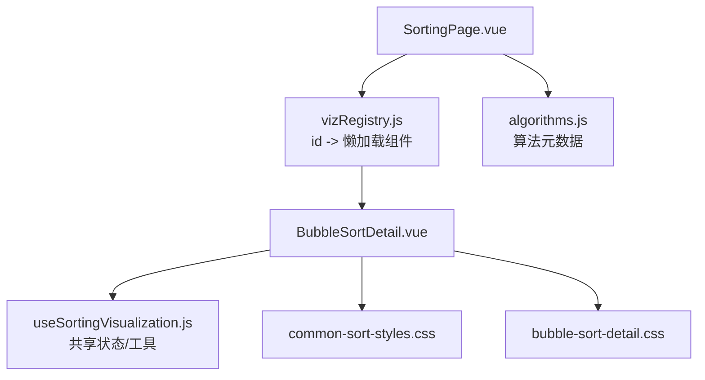
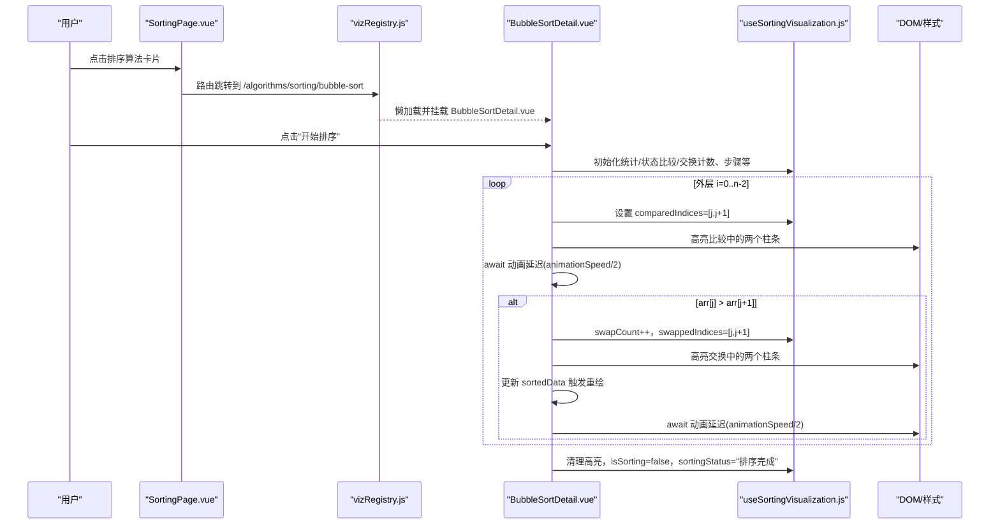
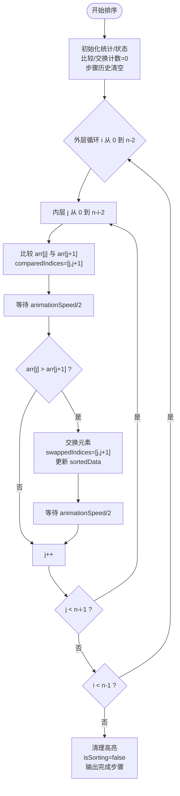
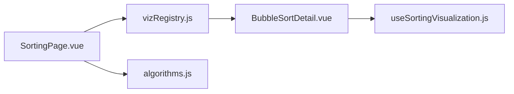

# 冒泡排序可视化

<cite>
**本文引用的文件**
- [BubbleSortDetail.vue](file://suanfa_vue/src/components/algorithms/sorting_algorithms/BubbleSortDetail.vue)
- [useSortingVisualization.js](file://suanfa_vue/src/composables/useSortingVisualization.js)
- [common-sort-styles.css](file://suanfa_vue/src/components/algorithms/sorting_algorithms/common-sort-styles.css)
- [bubble-sort-detail.css](file://suanfa_vue/src/components/algorithms/sorting_algorithms/bubble-sort-detail.css)
- [vizRegistry.js](file://suanfa_vue/src/components/algorithms/vizRegistry.js)
- [algorithms.js](file://suanfa_vue/src/data/algorithms.js)
- [SortingPage.vue](file://suanfa_vue/src/components/algorithms/sorting_algorithms/SortingPage.vue)
</cite>

## 目录
1. [简介](#简介)
2. [项目结构](#项目结构)
3. [核心组件与数据流](#核心组件与数据流)
4. [架构总览](#架构总览)
5. [详细组件分析](#详细组件分析)
6. [依赖关系分析](#依赖关系分析)
7. [性能与复杂度](#性能与复杂度)
8. [交互与使用指南](#交互与使用指南)
9. [可访问性与无障碍支持](#可访问性与无障碍支持)
10. [故障排查](#故障排查)
11. [结论](#结论)

## 简介
本文件面向“冒泡排序可视化”的实现，系统性说明相邻元素比较与交换的动画过程、每轮最大值“冒泡”到末尾的展示方式；解析 BubbleSortDetail 组件的状态管理、动画控制逻辑与用户交互处理；给出时间复杂度 O(n²)、空间复杂度 O(1) 及稳定性（稳定）的分析；并提供自定义数据集输入、速度调节、暂停/重置等交互功能的使用指南；同时覆盖性能监控指标（比较次数、交换次数）、排序步骤历史与可访问性支持。

## 项目结构
- 算法详情页由路由注册表动态加载：
  - 通过 vizRegistry 将 id 'bubble-sort' 映射到 BubbleSortDetail.vue。
- 排序页面 SortingPage.vue 提供分类筛选与跳转，点击卡片进入对应算法详情页。
- 通用排序可视化能力抽取为 useSortingVisualization composable，统一处理列表大小校验、随机数据生成、统计状态、重置排序等。
- 样式集中在 common-sort-styles.css 与 bubble-sort-detail.css。

图表来源
- [vizRegistry.js:7-17](file://suanfa_vue/src/components/algorithms/vizRegistry.js#L7-L17)
- [SortingPage.vue:11-14](file://suanfa_vue/src/components/algorithms/sorting_algorithms/SortingPage.vue#L11-L14)
- [BubbleSortDetail.vue:1-16](file://suanfa_vue/src/components/algorithms/sorting_algorithms/BubbleSortDetail.vue#L1-L16)
- [useSortingVisualization.js:16-111](file://suanfa_vue/src/composables/useSortingVisualization.js#L16-L111)
- [algorithms.js:9-30](file://suanfa_vue/src/data/algorithms.js#L9-L30)

章节来源
- [vizRegistry.js:7-17](file://suanfa_vue/src/components/algorithms/vizRegistry.js#L7-L17)
- [SortingPage.vue:11-14](file://suanfa_vue/src/components/algorithms/sorting_algorithms/SortingPage.vue#L11-L14)
- [BubbleSortDetail.vue:1-16](file://suanfa_vue/src/components/algorithms/sorting_algorithms/BubbleSortDetail.vue#L1-L16)
- [useSortingVisualization.js:16-111](file://suanfa_vue/src/composables/useSortingVisualization.js#L16-L111)
- [algorithms.js:9-30](file://suanfa_vue/src/data/algorithms.js#L9-L30)

## 核心组件与数据流
- BubbleSortDetail.vue：实现冒泡排序的可视化流程，维护比较/交换高亮、步骤历史、当前步骤详情、排序状态等。
- useSortingVisualization.js：提供公共状态与工具方法，包括：
  - 列表大小控制与校验
  - 随机数据生成
  - 生成新列表与重置排序（Fisher-Yates 打乱 + 统计清零）
  - 动画速度、比较/交换计数、当前步骤、比较/交换索引高亮等
- 样式：common-sort-styles.css 定义柱状条、比较/交换/完成态颜色与布局；bubble-sort-detail.css 定义容器基础样式。

章节来源
- [BubbleSortDetail.vue:23-91](file://suanfa_vue/src/components/algorithms/sorting_algorithms/BubbleSortDetail.vue#L23-L91)
- [useSortingVisualization.js:16-111](file://suanfa_vue/src/composables/useSortingVisualization.js#L16-L111)
- [common-sort-styles.css:142-174](file://suanfa_vue/src/components/algorithms/sorting_algorithms/common-sort-styles.css#L142-L174)
- [bubble-sort-detail.css:2-9](file://suanfa_vue/src/components/algorithms/sorting_algorithms/bubble-sort-detail.css#L2-L9)

## 架构总览
冒泡排序可视化的运行时调用链如下：

图表来源
- [BubbleSortDetail.vue:23-91](file://suanfa_vue/src/components/algorithms/sorting_algorithms/BubbleSortDetail.vue#L23-L91)
- [useSortingVisualization.js:46-55](file://suanfa_vue/src/composables/useSortingVisualization.js#L46-L55)
- [common-sort-styles.css:160-174](file://suanfa_vue/src/components/algorithms/sorting_algorithms/common-sort-styles.css#L160-L174)

## 详细组件分析

### BubbleSortDetail.vue：冒泡排序可视化主组件
- 状态管理
  - 复用 useSortingVisualization 提供的 listSize、data、sortedData、isSorting、animationSpeed、comparisonCount、swapCount、currentStep、comparedIndices、swappedIndices、sortingSteps、currentStepDetails 等。
  - 本地 isButtonClicked 用于按钮点击反馈。
- 动画控制
  - 使用 async/await + setTimeout 模拟动画帧，每次比较或交换后等待 animationSpeed/2 毫秒，形成逐步推进的可视化节奏。
  - 通过 comparedIndices 和 swappedIndices 驱动 DOM 高亮，配合 CSS 类 .compared/.swapped 实现视觉反馈。
- 用户交互
  - “开始排序”：触发冒泡排序流程，记录初始信息步骤，逐轮比较与交换，完成后输出总结步骤。
  - “测试排序”：与“开始排序”类似，但忽略 isSorting 状态，便于快速验证。
  - “生成新列表”：基于 listSize 生成随机数据，并重置排序状态。
  - “重置排序”：使用 Fisher-Yates 打乱 data，恢复初始未排序视图，并清空统计。
  - “速度调节”：通过 range 控件调整 animationSpeed，影响比较/交换之间的等待时长。
- 可视化呈现
  - 柱状图高度由值决定，数值越大越高；比较时黄色高亮放大，交换时绿色高亮放大，排序完成后可标记已就位元素。
  - 步骤历史区按 compare/swap/info/finish 类型着色显示，便于回溯理解。

图表来源
- [BubbleSortDetail.vue:23-91](file://suanfa_vue/src/components/algorithms/sorting_algorithms/BubbleSortDetail.vue#L23-L91)

章节来源
- [BubbleSortDetail.vue:23-91](file://suanfa_vue/src/components/algorithms/sorting_algorithms/BubbleSortDetail.vue#L23-L91)
- [BubbleSortDetail.vue:165-243](file://suanfa_vue/src/components/algorithms/sorting_algorithms/BubbleSortDetail.vue#L165-L243)

### useSortingVisualization.js：共享可视化脚手架
- 职责
  - 列表大小校验与范围限制（minSize/maxSize）。
  - 随机数据生成（默认 1-100 整数）。
  - generateNewList：生成新列表并重置排序。
  - resetSort：Fisher-Yates 打乱 + 公共状态清零（统计、步骤、高亮等）。
  - 暴露动画速度、比较/交换计数、当前步骤、比较/交换索引等响应式状态。
- 设计要点
  - 通过 onReset 钩子允许具体算法注入专属状态清理逻辑（当前冒泡排序未使用）。
  - 错误处理：生成列表失败时设置 errorMessage 并提示。

章节来源
- [useSortingVisualization.js:16-111](file://suanfa_vue/src/composables/useSortingVisualization.js#L16-L111)

### 样式与可视化效果
- common-sort-styles.css
  - .bar：柱状条基础样式，含过渡动画。
  - .compared：比较中黄色高亮并放大。
  - .swapped：交换中绿色高亮并放大。
  - .sorted：排序完成后的标识色。
  - .stats-container：统计面板布局。
  - .steps-history：步骤历史滚动区域。
- bubble-sort-detail.css
  - .bubble-sort-detail：容器背景、圆角、阴影与定位。

章节来源
- [common-sort-styles.css:108-174](file://suanfa_vue/src/components/algorithms/sorting_algorithms/common-sort-styles.css#L108-L174)
- [common-sort-styles.css:229-314](file://suanfa_vue/src/components/algorithms/sorting_algorithms/common-sort-styles.css#L229-L314)
- [bubble-sort-detail.css:2-9](file://suanfa_vue/src/components/algorithms/sorting_algorithms/bubble-sort-detail.css#L2-L9)

## 依赖关系分析
- 路由与懒加载
  - vizRegistry.js 将 'bubble-sort' 映射到 BubbleSortDetail.vue，实现按需加载。
- 页面导航
  - SortingPage.vue 提供分类标签与卡片，点击后通过 router.push 进入详情页。
- 数据源
  - algorithms.js 提供冒泡排序的元数据（名称、类别、难度、稳定性、复杂度、描述等），供页面展示与详情页复杂度块使用。

图表来源
- [vizRegistry.js:7-17](file://suanfa_vue/src/components/algorithms/vizRegistry.js#L7-L17)
- [SortingPage.vue:11-14](file://suanfa_vue/src/components/algorithms/sorting_algorithms/SortingPage.vue#L11-L14)
- [algorithms.js:9-30](file://suanfa_vue/src/data/algorithms.js#L9-L30)

章节来源
- [vizRegistry.js:7-17](file://suanfa_vue/src/components/algorithms/vizRegistry.js#L7-L17)
- [SortingPage.vue:11-14](file://suanfa_vue/src/components/algorithms/sorting_algorithms/SortingPage.vue#L11-L14)
- [algorithms.js:9-30](file://suanfa_vue/src/data/algorithms.js#L9-L30)

## 性能与复杂度
- 时间复杂度
  - 最坏情况：O(n²)，当数组完全逆序时，每轮都需要大量交换。
  - 最好情况：O(n)，当数组已经有序且存在提前终止优化（代码中使用 sorted 标志位，若一轮无交换则提前结束）。
  - 平均情况：O(n²)。
- 空间复杂度
  - O(1)，原地排序，仅使用常数级额外变量（如 temp、sorted）。
- 稳定性
  - 稳定：相等元素的相对顺序在排序过程中保持不变（仅在严格大于时交换）。
- 可视化性能
  - 动画延迟由 animationSpeed 控制，过大可能导致交互卡顿，建议根据设备性能调优。
  - 大数据集下频繁 DOM 更新可能影响渲染性能，可通过降低列表大小或提高动画速度缓解。

章节来源
- [BubbleSortDetail.vue:43-91](file://suanfa_vue/src/components/algorithms/sorting_algorithms/BubbleSortDetail.vue#L43-L91)
- [algorithms.js:9-30](file://suanfa_vue/src/data/algorithms.js#L9-L30)

## 交互与使用指南
- 自定义数据集输入
  - 通过“列表大小”滑块调整数据规模（受 minSize/maxSize 限制），点击“生成新列表”以重新生成随机数据。
  - 如需固定数据集，可在 useSortingVisualization 中传入自定义 generateRandomData 函数（当前默认生成 1-100 随机数）。
- 速度调节
  - 拖动“动画速度”滑块调整 animationSpeed（单位毫秒），值越小动画越快。
- 开始排序与测试排序
  - “开始排序”会检查 isSorting 状态，避免重复触发；“测试排序”忽略该状态，便于快速验证。
- 暂停与重置
  - 当前实现未提供“暂停”按钮；可通过关闭详情页或刷新页面中断。
  - “重置排序”会将数据打乱并清空统计，恢复到初始未排序状态。
- 观察指标
  - 比较次数、交换次数、当前步骤、排序状态实时显示。
  - 步骤历史区按 compare/swap/info/finish 分类展示，便于复盘。

章节来源
- [BubbleSortDetail.vue:165-243](file://suanfa_vue/src/components/algorithms/sorting_algorithms/BubbleSortDetail.vue#L165-L243)
- [useSortingVisualization.js:57-101](file://suanfa_vue/src/composables/useSortingVisualization.js#L57-L101)

## 可访问性与无障碍支持
- 键盘操作
  - 所有交互按钮均为原生 button，支持 Tab 聚焦与 Enter/Space 激活。
- 屏幕阅读器
  - 统计项与步骤历史包含语义化文本（如“比较次数”、“交换次数”、“第 X 步：比较...”），便于读屏软件播报。
- 视觉对比
  - 比较/交换/完成态使用不同颜色与缩放效果，建议在主题中确保足够的对比度。
- 建议增强
  - 可为关键柱条添加 aria-label 标注其值与状态（例如“索引 j，值为 v，正在比较”）。
  - 为“动画速度”滑块添加 aria-valuemin/aria-valuemax/aria-valuenow 以提升可访问性。

[本节为通用指导，不直接分析具体文件，故无章节来源]

## 故障排查
- 列表大小无效
  - 现象：生成新列表失败并弹出错误提示。
  - 原因：listSize 非数字或超出范围。
  - 解决：确保 listSize 为数字且在 minSize/maxSize 范围内。
- 排序无法启动
  - 现象：“开始排序”按钮不可用。
  - 原因：isSorting 为 true（上一次排序未完成）。
  - 解决：等待排序完成或刷新页面重置状态。
- 动画卡顿
  - 现象：大数据集下动画明显延迟。
  - 原因：animationSpeed 过小导致频繁 DOM 更新。
  - 解决：增大 animationSpeed 或减小列表大小。
- 步骤历史为空
  - 现象：步骤历史区无内容。
  - 原因：尚未执行排序或未记录步骤。
  - 解决：点击“开始排序”或“测试排序”。

章节来源
- [useSortingVisualization.js:57-77](file://suanfa_vue/src/composables/useSortingVisualization.js#L57-L77)
- [BubbleSortDetail.vue:23-91](file://suanfa_vue/src/components/algorithms/sorting_algorithms/BubbleSortDetail.vue#L23-L91)

## 结论
冒泡排序可视化通过 BubbleSortDetail 与 useSortingVisualization 的组合，实现了清晰的相邻元素比较与交换动画、每轮最大值“冒泡”到末尾的效果，并提供丰富的交互与监控能力。其时间复杂度 O(n²)、空间复杂度 O(1)、稳定性稳定，适合教学演示与小规模数据排序。通过合理调节动画速度与数据规模，可获得流畅的用户体验。未来可考虑增加“暂停/继续”、自定义数据集输入、更细粒度的可访问性标注等增强功能。