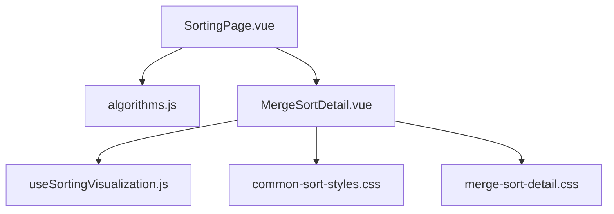
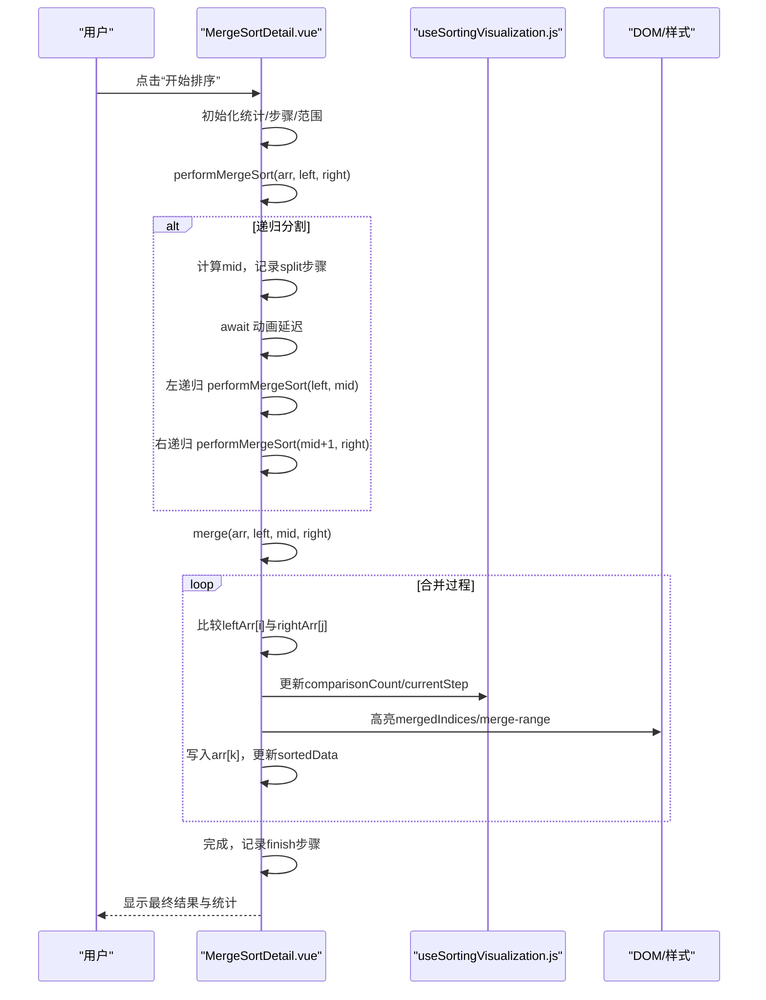
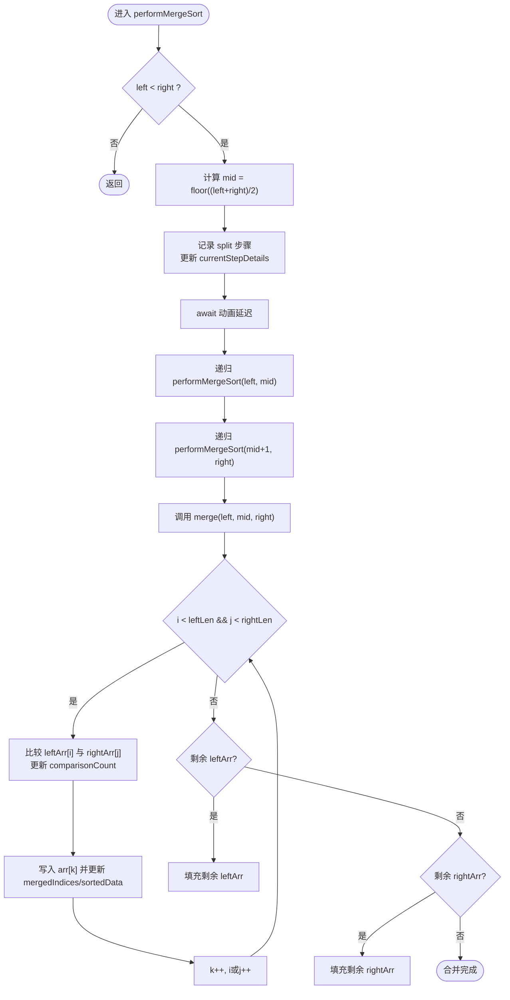
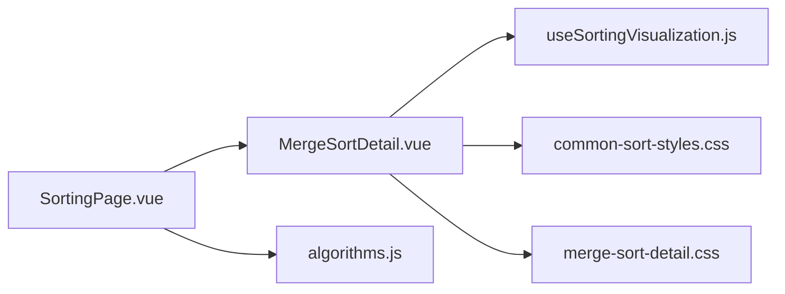

# 归并排序可视化

<cite>
**本文引用的文件**
- [MergeSortDetail.vue](file://suanfa_vue/src/components/algorithms/sorting_algorithms/MergeSortDetail.vue)
- [merge-sort-detail.css](file://suanfa_vue/src/components/algorithms/sorting_algorithms/merge-sort-detail.css)
- [useSortingVisualization.js](file://suanfa_vue/src/composables/useSortingVisualization.js)
- [common-sort-styles.css](file://suanfa_vue/src/components/algorithms/sorting_algorithms/common-sort-styles.css)
- [algorithms.js](file://suanfa_vue/src/data/algorithms.js)
- [SortingPage.vue](file://suanfa_vue/src/components/algorithms/sorting_algorithms/SortingPage.vue)
</cite>

## 目录
1. [简介](#简介)
2. [项目结构](#项目结构)
3. [核心组件](#核心组件)
4. [架构总览](#架构总览)
5. [详细组件分析](#详细组件分析)
6. [依赖关系分析](#依赖关系分析)
7. [性能与复杂度](#性能与复杂度)
8. [故障排查指南](#故障排查指南)
9. [结论](#结论)
10. [附录：交互与扩展](#附录：交互与扩展)

## 简介
本文件面向“归并排序可视化”的实现与使用，聚焦分治策略的可视化呈现：数组分割过程的动画、合并操作的逐步演示、递归树的结构化理解。文档基于仓库中的 Vue 前端实现，详细说明 MergeSortDetail 组件的状态管理、合并动画控制、临时数组可视化，以及时间/空间复杂度、稳定性等算法特性。同时提供交互功能说明（分割点标记、合并高亮、递归层级显示）和外部排序应用场景、大数据优化与内存管理的最佳实践建议。

## 项目结构
归并排序可视化位于排序算法子模块中，采用“共享可视化脚手架 + 算法专属细节”的分层组织方式：
- 共享可视化能力由组合式函数 useSortingVisualization 提供，负责数据生成、列表大小校验、重置、统计状态、动画速度等通用逻辑。
- 算法专属细节由 MergeSortDetail.vue 实现，封装归并排序的递归分割、合并步骤、可视化状态与 UI 渲染。
- 样式通过 common-sort-styles.css 统一基础样式，merge-sort-detail.css 补充归并排序特有视觉反馈。
- 算法元数据（名称、分类、复杂度、稳定性等）集中在 algorithms.js，供页面与详情页展示。
- SortingPage.vue 作为排序算法入口页，提供分类筛选与跳转至详情。

图表来源
- [SortingPage.vue:1-97](file://suanfa_vue/src/components/algorithms/sorting_algorithms/SortingPage.vue#L1-L97)
- [MergeSortDetail.vue:1-247](file://suanfa_vue/src/components/algorithms/sorting_algorithms/MergeSortDetail.vue#L1-L247)
- [useSortingVisualization.js:1-111](file://suanfa_vue/src/composables/useSortingVisualization.js#L1-L111)
- [common-sort-styles.css:1-325](file://suanfa_vue/src/components/algorithms/sorting_algorithms/common-sort-styles.css#L1-L325)
- [merge-sort-detail.css:1-30](file://suanfa_vue/src/components/algorithms/sorting_algorithms/merge-sort-detail.css#L1-L30)
- [algorithms.js:54-74](file://suanfa_vue/src/data/algorithms.js#L54-L74)

章节来源
- [SortingPage.vue:1-97](file://suanfa_vue/src/components/algorithms/sorting_algorithms/SortingPage.vue#L1-L97)
- [algorithms.js:54-74](file://suanfa_vue/src/data/algorithms.js#L54-L74)

## 核心组件
- MergeSortDetail.vue：归并排序可视化主视图，包含算法实现、状态管理、UI 控件与步骤历史。
- useSortingVisualization.js：复用排序可视化公共逻辑，包括随机数据生成、列表大小控制、重置、统计计数、动画速度等。
- 样式文件：common-sort-styles.css 提供通用排序可视化样式；merge-sort-detail.css 定义归并排序特有的高亮与步骤样式。
- algorithms.js：集中维护算法元数据，包括归并排序的时间/空间复杂度与稳定性信息。

章节来源
- [MergeSortDetail.vue:1-247](file://suanfa_vue/src/components/algorithms/sorting_algorithms/MergeSortDetail.vue#L1-L247)
- [useSortingVisualization.js:1-111](file://suanfa_vue/src/composables/useSortingVisualization.js#L1-L111)
- [common-sort-styles.css:1-325](file://suanfa_vue/src/components/algorithms/sorting_algorithms/common-sort-styles.css#L1-L325)
- [merge-sort-detail.css:1-30](file://suanfa_vue/src/components/algorithms/sorting_algorithms/merge-sort-detail.css#L1-L30)
- [algorithms.js:54-74](file://suanfa_vue/src/data/algorithms.js#L54-L74)

## 架构总览
归并排序可视化的调用链与数据流如下：
- 用户点击“开始排序”，触发 mergeSort，初始化统计与步骤记录。
- performMergeSort 递归执行分治：计算 mid，记录分割步骤，等待动画间隔后继续左右递归。
- merge 将左右子数组合并为有序段，逐元素比较与写入，更新 mergedIndices 与 sortedData，驱动柱状图高亮。
- 完成时汇总比较次数与合并次数，输出最终结果与步骤历史。

图表来源
- [MergeSortDetail.vue:35-132](file://suanfa_vue/src/components/algorithms/sorting_algorithms/MergeSortDetail.vue#L35-L132)
- [useSortingVisualization.js:43-111](file://suanfa_vue/src/composables/useSortingVisualization.js#L43-L111)

## 详细组件分析

### MergeSortDetail.vue 组件分析
- 职责
  - 封装归并排序的递归分割与合并流程。
  - 管理可视化状态：当前合并区间、已合并索引、步骤历史、当前步骤描述、动画速度等。
  - 提供交互控件：生成新列表、开始排序、测试排序、重置排序、调整动画速度。
- 关键状态
  - mergeCount：累计合并次数。
  - mergedIndices：当前合并写入位置的高亮索引集合。
  - currentMergeRange：当前合并区间的起止索引，用于高亮整个合并范围。
  - sortingSteps/currentStepDetails：步骤历史与当前步骤文本。
  - comparisonCount：比较次数统计。
- 算法流程
  - performMergeSort：递归分割，记录 split 步骤，按动画速度暂停以形成动画效果。
  - merge：创建左右临时数组，逐元素比较并写入原数组，更新 mergedIndices 与 sortedData，记录 compare 步骤。
- 可视化映射
  - 柱状图高度映射数值大小。
  - .bar.merged/.bar.merge-range/.bar.sorted 三类样式分别表示已合并、当前合并范围、已排序元素。
  - 步骤历史按类型着色（split/compare/merge/finish）。

图表来源
- [MergeSortDetail.vue:68-132](file://suanfa_vue/src/components/algorithms/sorting_algorithms/MergeSortDetail.vue#L68-L132)

章节来源
- [MergeSortDetail.vue:35-132](file://suanfa_vue/src/components/algorithms/sorting_algorithms/MergeSortDetail.vue#L35-L132)
- [merge-sort-detail.css:12-30](file://suanfa_vue/src/components/algorithms/sorting_algorithms/merge-sort-detail.css#L12-L30)
- [common-sort-styles.css:142-174](file://suanfa_vue/src/components/algorithms/sorting_algorithms/common-sort-styles.css#L142-L174)

### useSortingVisualization.js 共享逻辑
- 职责
  - 提供统一的排序可视化基础设施：列表大小控制、随机数据生成、错误处理、重置排序、统计状态、动画速度。
  - 通过 onReset 钩子允许算法组件在重置时清理自身状态（如归并排序的合并计数与范围）。
- 关键点
  - generateNewList：校验 size → 生成随机数据 → nextTick → resetSort。
  - resetSort：打乱数据、清零统计、清空步骤、调用 onReset。
  - 暴露 isSorting、animationSpeed、comparisonCount、currentStep 等状态供各算法组件使用。

章节来源
- [useSortingVisualization.js:16-111](file://suanfa_vue/src/composables/useSortingVisualization.js#L16-L111)

### 样式与可视化映射
- common-sort-styles.css
  - 定义柱状图容器、按钮、步骤历史、错误提示等通用样式。
  - 提供 .bar.compared/.bar.swapped/.bar.sorted 等状态样式，便于不同算法复用。
- merge-sort-detail.css
  - 定义归并排序特有条目：.bar.merged（已合并高亮）、.bar.merge-range（当前合并范围高亮）、步骤项 split/merge 的颜色。

章节来源
- [common-sort-styles.css:108-174](file://suanfa_vue/src/components/algorithms/sorting_algorithms/common-sort-styles.css#L108-L174)
- [merge-sort-detail.css:12-30](file://suanfa_vue/src/components/algorithms/sorting_algorithms/merge-sort-detail.css#L12-L30)

### 算法元数据与页面导航
- algorithms.js
  - 归并排序条目包含：名称、分类（比较类排序）、难度（中等）、稳定性（稳定）、复杂度（O(n log n)）、空间复杂度（O(n)）。
- SortingPage.vue
  - 提供分类标签（全部/比较类/非比较类/稳定/不稳定），点击卡片跳转到对应详情页路由。

章节来源
- [algorithms.js:54-74](file://suanfa_vue/src/data/algorithms.js#L54-L74)
- [SortingPage.vue:16-42](file://suanfa_vue/src/components/algorithms/sorting_algorithms/SortingPage.vue#L16-L42)

## 依赖关系分析
- MergeSortDetail.vue 依赖 useSortingVisualization.js 提供的共享状态与方法。
- 样式依赖 common-sort-styles.css 与 merge-sort-detail.css。
- 页面导航与元数据依赖 algorithms.js。
- 无循环依赖；组件间耦合清晰，职责分离良好。

图表来源
- [MergeSortDetail.vue:1-247](file://suanfa_vue/src/components/algorithms/sorting_algorithms/MergeSortDetail.vue#L1-L247)
- [useSortingVisualization.js:1-111](file://suanfa_vue/src/composables/useSortingVisualization.js#L1-L111)
- [SortingPage.vue:1-97](file://suanfa_vue/src/components/algorithms/sorting_algorithms/SortingPage.vue#L1-L97)
- [algorithms.js:54-74](file://suanfa_vue/src/data/algorithms.js#L54-L74)

章节来源
- [MergeSortDetail.vue:1-247](file://suanfa_vue/src/components/algorithms/sorting_algorithms/MergeSortDetail.vue#L1-L247)
- [useSortingVisualization.js:1-111](file://suanfa_vue/src/composables/useSortingVisualization.js#L1-L111)
- [SortingPage.vue:1-97](file://suanfa_vue/src/components/algorithms/sorting_algorithms/SortingPage.vue#L1-L97)
- [algorithms.js:54-74](file://suanfa_vue/src/data/algorithms.js#L54-L74)

## 性能与复杂度
- 时间复杂度
  - 最坏/最好/平均均为 O(n log n)。每一层递归进行线性合并，共 log n 层。
- 空间复杂度
  - 需要额外 O(n) 空间用于临时数组（左右子数组切片与合并缓冲）。
- 稳定性
  - 稳定排序：相等元素的相对顺序在合并过程中保持不变（代码中使用 <= 保证稳定性）。
- 可视化性能
  - 动画延迟由 animationSpeed 控制，避免频繁 DOM 更新导致卡顿。
  - 每次写入仅更新 mergedIndices 与 sortedData，利用 Vue 响应式最小化重绘。

章节来源
- [algorithms.js:54-74](file://suanfa_vue/src/data/algorithms.js#L54-L74)
- [MergeSortDetail.vue:93-131](file://suanfa_vue/src/components/algorithms/sorting_algorithms/MergeSortDetail.vue#L93-L131)
- [useSortingVisualization.js:47-53](file://suanfa_vue/src/composables/useSortingVisualization.js#L47-L53)

## 故障排查指南
- 常见问题
  - 列表大小无效：generateNewList 会抛出错误并显示 errorMessage。
  - 动画不生效：检查 animationSpeed 是否被禁用或值异常。
  - 重置无效：确认 onReset 钩子是否正确清理算法专属状态（如 mergeCount、mergedIndices、currentMergeRange）。
- 调试建议
  - 查看 steps-history 中的步骤类型与详情，定位分割/比较/合并阶段。
  - 观察 mergedIndices 与 currentMergeRange 的变化，确认高亮是否符合预期。
  - 控制台日志：mergeSort/testSort 打印初始数据与完成统计，辅助验证数据一致性。

章节来源
- [useSortingVisualization.js:58-77](file://suanfa_vue/src/composables/useSortingVisualization.js#L58-L77)
- [MergeSortDetail.vue:35-65](file://suanfa_vue/src/components/algorithms/sorting_algorithms/MergeSortDetail.vue#L35-L65)
- [common-sort-styles.css:229-237](file://suanfa_vue/src/components/algorithms/sorting_algorithms/common-sort-styles.css#L229-L237)

## 结论
该实现以清晰的组件分层与共享可视化能力，提供了直观且可交互的归并排序教学工具。通过分割步骤记录、合并过程高亮、步骤历史与统计信息，学习者可以深入理解分治思想与归并排序的执行细节。结合稳定的排序特性与 O(n log n) 时间复杂度、O(n) 空间复杂度，归并排序适合对稳定性有要求且数据规模适中的场景。

## 附录：交互与扩展
- 交互功能
  - 分割点标记：performMergeSort 中记录 split 步骤，配合样式区分。
  - 合并过程高亮：mergedIndices 与 merge-range 样式实时反映写入位置与当前合并区间。
  - 递归层级显示：可通过步骤历史中的 details 文本体现当前 left/mid/right 范围，辅助理解递归深度。
- 外部排序应用场景
  - 多路归并：当数据无法一次性装入内存时，可将数据分段排序后落盘，再使用多路归并合并多个有序文件。
  - 数据库/文件系统：大表排序、日志聚合、离线批处理任务常采用外部归并。
- 大数据处理优化
  - 分块读取与预取：减少 I/O 次数，提升吞吐。
  - 并行归并：在多核环境下对多个子文件并行排序，最后串行或多线程合并。
  - 缓存与缓冲：合理设置缓冲区大小，平衡内存占用与 I/O 效率。
- 内存管理最佳实践
  - 复用临时数组：避免重复分配，降低 GC 压力。
  - 控制动画频率：在大数组上适当提高 animationSpeed 或限制步数，防止界面卡顿。
  - 及时释放引用：合并完成后清理 mergedIndices、currentMergeRange 等中间状态。

[本节为概念性内容，不直接分析具体文件，故无章节来源]