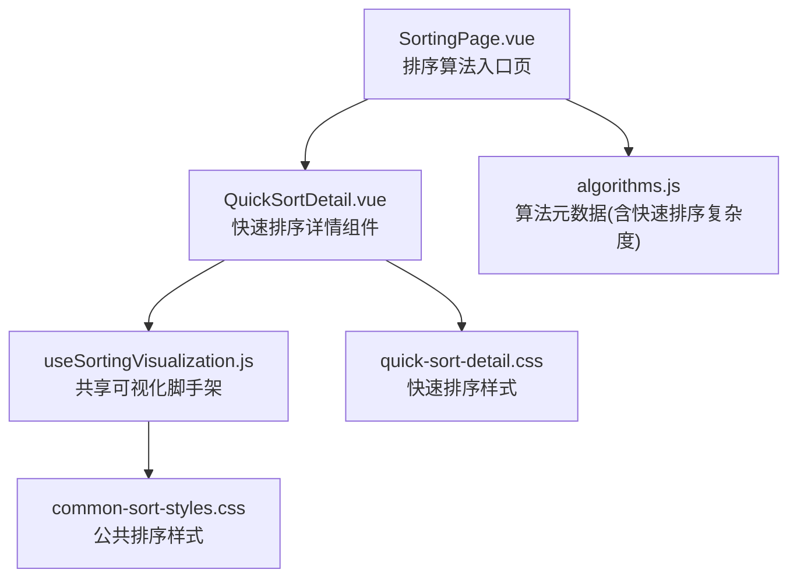
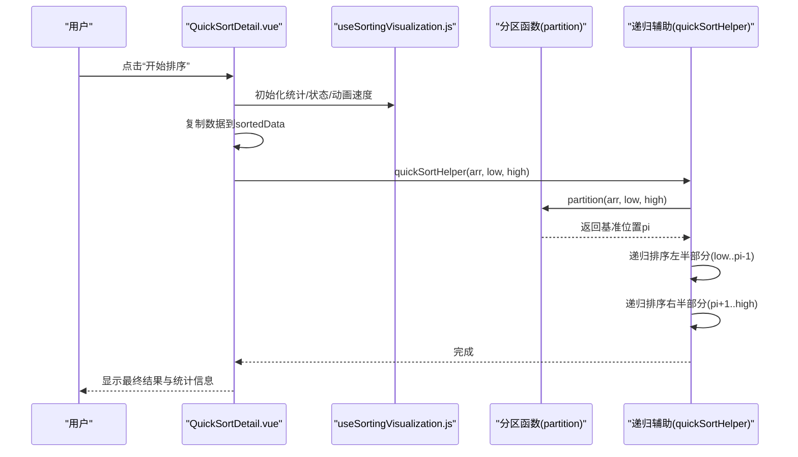
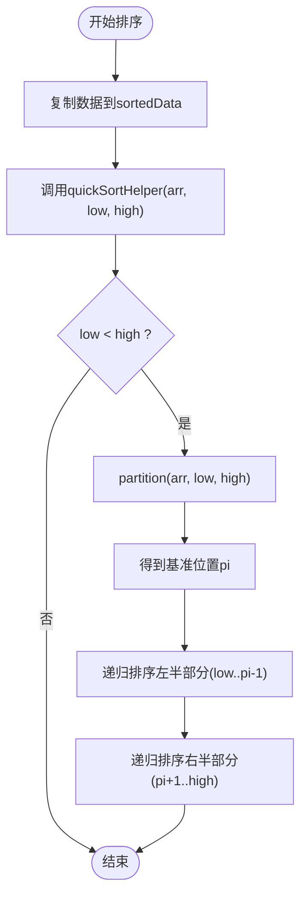
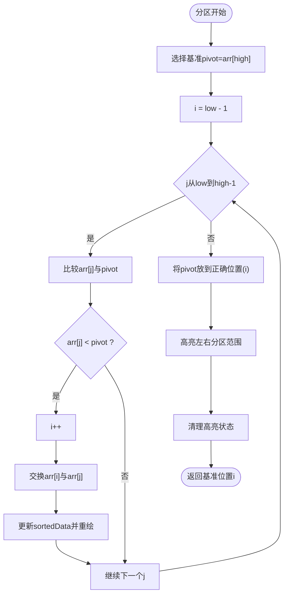
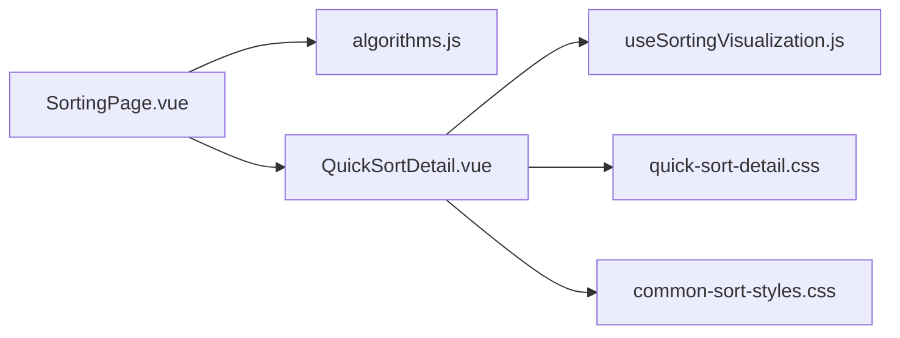

# 快速排序可视化

<cite>
**本文引用的文件**
- [QuickSortDetail.vue](file://suanfa_vue/src/components/algorithms/sorting_algorithms/QuickSortDetail.vue)
- [useSortingVisualization.js](file://suanfa_vue/src/composables/useSortingVisualization.js)
- [quick-sort-detail.css](file://suanfa_vue/src/components/algorithms/sorting_algorithms/quick-sort-detail.css)
- [common-sort-styles.css](file://suanfa_vue/src/components/algorithms/sorting_algorithms/common-sort-styles.css)
- [algorithms.js](file://suanfa_vue/src/data/algorithms.js)
- [SortingPage.vue](file://suanfa_vue/src/components/algorithms/sorting_algorithms/SortingPage.vue)
</cite>

## 目录
1. [简介](#简介)
2. [项目结构](#项目结构)
3. [核心组件](#核心组件)
4. [架构总览](#架构总览)
5. [详细组件分析](#详细组件分析)
6. [依赖关系分析](#依赖关系分析)
7. [性能考量](#性能考量)
8. [故障排查指南](#故障排查指南)
9. [结论](#结论)
10. [附录](#附录)

## 简介
本文件面向“快速排序可视化”的实现与使用，聚焦分治策略的可视化呈现：基准元素选择、分区过程的动画展示、递归调用的层次结构呈现。文档同时解释 QuickSortDetail 组件的递归状态管理、分区动画控制、栈操作可视化思路，并给出复杂度分析（平均 O(n log n)、最坏 O(n²)、原地排序特性）、交互演示要点、大数据集处理建议与内存监控方法。

## 项目结构
快速排序可视化位于前端 Vue 工程中的排序算法详情页模块，采用“共享可视化脚手架 + 算法专属逻辑”的分层组织方式：
- 共享可视化能力由组合式函数提供，负责数据生成、列表大小校验、重置、统计状态、动画速度等通用逻辑。
- 算法专属组件实现具体排序流程、步骤记录、UI 高亮与交互。
- 样式文件分为公共排序样式与快速排序特有样式，便于统一视觉风格与差异化表达。
- 算法元数据集中管理，用于页面导航、分类筛选与复杂度展示。

图表来源
- [SortingPage.vue:1-97](file://suanfa_vue/src/components/algorithms/sorting_algorithms/SortingPage.vue#L1-L97)
- [QuickSortDetail.vue:1-297](file://suanfa_vue/src/components/algorithms/sorting_algorithms/QuickSortDetail.vue#L1-L297)
- [useSortingVisualization.js:1-111](file://suanfa_vue/src/composables/useSortingVisualization.js#L1-L111)
- [quick-sort-detail.css:1-34](file://suanfa_vue/src/components/algorithms/sorting_algorithms/quick-sort-detail.css#L1-L34)
- [common-sort-styles.css:1-325](file://suanfa_vue/src/components/algorithms/sorting_algorithms/common-sort-styles.css#L1-L325)
- [algorithms.js:31-52](file://suanfa_vue/src/data/algorithms.js#L31-L52)

章节来源
- [SortingPage.vue:1-97](file://suanfa_vue/src/components/algorithms/sorting_algorithms/SortingPage.vue#L1-L97)
- [QuickSortDetail.vue:1-297](file://suanfa_vue/src/components/algorithms/sorting_algorithms/QuickSortDetail.vue#L1-L297)
- [useSortingVisualization.js:1-111](file://suanfa_vue/src/composables/useSortingVisualization.js#L1-L111)
- [quick-sort-detail.css:1-34](file://suanfa_vue/src/components/algorithms/sorting_algorithms/quick-sort-detail.css#L1-L34)
- [common-sort-styles.css:1-325](file://suanfa_vue/src/components/algorithms/sorting_algorithms/common-sort-styles.css#L1-L325)
- [algorithms.js:31-52](file://suanfa_vue/src/data/algorithms.js#L31-L52)

## 核心组件
- QuickSortDetail.vue：快速排序可视化主组件，封装了快速排序的核心流程、分区动画、步骤记录与 UI 渲染。
- useSortingVisualization.js：提供排序可视化通用能力（随机数据生成、列表大小控制、重置、统计计数、动画速度、错误提示等）。
- quick-sort-detail.css：快速排序特有的柱状条高亮样式（基准、左分区、右分区、步骤项颜色）。
- common-sort-styles.css：所有排序算法共用的布局、控件、步骤历史、柱状条基础样式。
- algorithms.js：包含快速排序的元数据（名称、分类、难度、稳定性、复杂度描述），供页面展示与路由使用。
- SortingPage.vue：排序算法列表页，点击卡片进入对应算法详情页。

章节来源
- [QuickSortDetail.vue:1-297](file://suanfa_vue/src/components/algorithms/sorting_algorithms/QuickSortDetail.vue#L1-L297)
- [useSortingVisualization.js:1-111](file://suanfa_vue/src/composables/useSortingVisualization.js#L1-L111)
- [quick-sort-detail.css:1-34](file://suanfa_vue/src/components/algorithms/sorting_algorithms/quick-sort-detail.css#L1-L34)
- [common-sort-styles.css:1-325](file://suanfa_vue/src/components/algorithms/sorting_algorithms/common-sort-styles.css#L1-L325)
- [algorithms.js:31-52](file://suanfa_vue/src/data/algorithms.js#L31-L52)
- [SortingPage.vue:1-97](file://suanfa_vue/src/components/algorithms/sorting_algorithms/SortingPage.vue#L1-L97)

## 架构总览
快速排序可视化的执行流从用户触发“开始排序”开始，组件内部维护当前数组副本与排序进度，通过异步函数驱动分区与递归调用，并在每一步更新比较/交换计数、步骤历史与 UI 高亮。

图表来源
- [QuickSortDetail.vue:41-96](file://suanfa_vue/src/components/algorithms/sorting_algorithms/QuickSortDetail.vue#L41-L96)
- [QuickSortDetail.vue:98-177](file://suanfa_vue/src/components/algorithms/sorting_algorithms/QuickSortDetail.vue#L98-L177)
- [useSortingVisualization.js:57-101](file://suanfa_vue/src/composables/useSortingVisualization.js#L57-L101)

## 详细组件分析

### QuickSortDetail 组件：递归状态管理与分区动画控制
- 递归状态管理
  - 使用 ref 维护 pivotIndex、leftPartitionIndices、rightPartitionIndices，以在 UI 上高亮基准与左右分区范围。
  - 通过 currentStep、sortingSteps、currentStepDetails 记录每一步的类型与说明，形成可回溯的步骤历史。
  - 复用 useSortingVisualization 提供的 isSorting、animationSpeed、comparisonCount、swapCount 等状态，确保与其他排序组件一致的交互体验。
- 分区动画控制
  - 分区过程按元素逐一比较，每次比较与交换都插入步骤记录并短暂延时，配合 animationSpeed 控制整体节奏。
  - 基准选择、比较、交换、分区完成四个阶段均有独立的步骤类型与高亮样式，便于理解分治过程。
- 递归层次呈现
  - 递归调用通过 quickSortHelper 对子区间进行排序，虽然未显式绘制递归树，但步骤历史中会体现“选择基准”和“分区完成”的关键节点，结合 UI 高亮可感知递归层次。

图表来源
- [QuickSortDetail.vue:41-96](file://suanfa_vue/src/components/algorithms/sorting_algorithms/QuickSortDetail.vue#L41-L96)
- [QuickSortDetail.vue:98-177](file://suanfa_vue/src/components/algorithms/sorting_algorithms/QuickSortDetail.vue#L98-L177)

章节来源
- [QuickSortDetail.vue:41-96](file://suanfa_vue/src/components/algorithms/sorting_algorithms/QuickSortDetail.vue#L41-L96)
- [QuickSortDetail.vue:98-177](file://suanfa_vue/src/components/algorithms/sorting_algorithms/QuickSortDetail.vue#L98-L177)
- [QuickSortDetail.vue:215-297](file://suanfa_vue/src/components/algorithms/sorting_algorithms/QuickSortDetail.vue#L215-L297)

### 分区函数：基准选择与分区过程
- 基准选择
  - 当前实现选择最右侧元素作为基准，并在 UI 中高亮该基准位置。
- 分区过程
  - 维护小于基准区域的指针 i，遍历 j 从 low 到 high-1：
    - 每次比较都会记录比较次数与比较索引，并高亮当前比较的两个元素。
    - 若 arr[j] < pivot，则 i++ 并交换 arr[i] 与 arr[j]，记录交换次数与交换索引，更新 sortedData 触发重绘。
  - 循环结束后将基准元素放到正确位置（i 处），再次记录交换并高亮。
  - 最后计算并高亮左分区与右分区范围，随后清理高亮状态。

图表来源
- [QuickSortDetail.vue:98-177](file://suanfa_vue/src/components/algorithms/sorting_algorithms/QuickSortDetail.vue#L98-L177)

章节来源
- [QuickSortDetail.vue:98-177](file://suanfa_vue/src/components/algorithms/sorting_algorithms/QuickSortDetail.vue#L98-L177)

### 共享可视化脚手架：useSortingVisualization
- 职责
  - 提供列表大小控制、随机数据生成、生成新列表、重置排序、统计状态、动画速度、错误信息等通用能力。
  - 通过 onReset 钩子允许算法组件在重置时清除自身专属状态（如基准、分区范围等）。
- 关键状态
  - data、sortedData：原始数据与当前可视化数据。
  - comparisonCount、swapCount、currentStep：统计比较次数、交换次数、当前步骤编号。
  - comparedIndices、swappedIndices：高亮比较与交换的元素索引。
  - sortingStatus、isSorting、isButtonClicked：控制按钮状态与提示信息。
- 重置流程
  - 打乱数据（Fisher-Yates）并清零统计与步骤历史，然后调用算法组件的 onReset 回调。

章节来源
- [useSortingVisualization.js:1-111](file://suanfa_vue/src/composables/useSortingVisualization.js#L1-L111)

### 样式系统：快速排序特有与公共样式
- 快速排序特有样式
  - .bar.pivot：基准元素高亮（放大与发光效果）。
  - .bar.left-partition/.bar.right-partition：左右分区范围高亮。
  - .step-item.pivot/.step-item.partition：步骤历史中基准与分区完成的高亮背景色。
- 公共排序样式
  - .bar.compared/.bar.swapped/.bar.sorted：比较、交换、已排序状态的高亮。
  - .stats-container、.controls、.steps-history：统计面板、控制面板、步骤历史容器。
  - .close-btn、.modal-header、.modal-content：模态窗口布局。

章节来源
- [quick-sort-detail.css:1-34](file://suanfa_vue/src/components/algorithms/sorting_algorithms/quick-sort-detail.css#L1-L34)
- [common-sort-styles.css:1-325](file://suanfa_vue/src/components/algorithms/sorting_algorithms/common-sort-styles.css#L1-L325)

### 算法元数据与页面导航
- algorithms.js 中定义了快速排序的元数据，包括名称、分类、难度、稳定性、复杂度描述与路由路径。
- SortingPage.vue 提供排序算法列表与分类筛选，点击卡片跳转到对应详情页。

章节来源
- [algorithms.js:31-52](file://suanfa_vue/src/data/algorithms.js#L31-L52)
- [SortingPage.vue:1-97](file://suanfa_vue/src/components/algorithms/sorting_algorithms/SortingPage.vue#L1-L97)

## 依赖关系分析
- QuickSortDetail.vue 依赖 useSortingVisualization.js 提供的共享状态与工具函数。
- QuickSortDetail.vue 依赖 quick-sort-detail.css 与 common-sort-styles.css 进行样式渲染。
- SortingPage.vue 依赖 algorithms.js 获取排序算法列表与元数据。
- 各组件之间通过 Vue 的响应式状态与事件机制协作，无直接耦合。

图表来源
- [SortingPage.vue:1-97](file://suanfa_vue/src/components/algorithms/sorting_algorithms/SortingPage.vue#L1-L97)
- [QuickSortDetail.vue:1-297](file://suanfa_vue/src/components/algorithms/sorting_algorithms/QuickSortDetail.vue#L1-L297)
- [useSortingVisualization.js:1-111](file://suanfa_vue/src/composables/useSortingVisualization.js#L1-L111)
- [quick-sort-detail.css:1-34](file://suanfa_vue/src/components/algorithms/sorting_algorithms/quick-sort-detail.css#L1-L34)
- [common-sort-styles.css:1-325](file://suanfa_vue/src/components/algorithms/sorting_algorithms/common-sort-styles.css#L1-L325)
- [algorithms.js:31-52](file://suanfa_vue/src/data/algorithms.js#L31-L52)

章节来源
- [SortingPage.vue:1-97](file://suanfa_vue/src/components/algorithms/sorting_algorithms/SortingPage.vue#L1-L97)
- [QuickSortDetail.vue:1-297](file://suanfa_vue/src/components/algorithms/sorting_algorithms/QuickSortDetail.vue#L1-L297)
- [useSortingVisualization.js:1-111](file://suanfa_vue/src/composables/useSortingVisualization.js#L1-L111)
- [quick-sort-detail.css:1-34](file://suanfa_vue/src/components/algorithms/sorting_algorithms/quick-sort-detail.css#L1-L34)
- [common-sort-styles.css:1-325](file://suanfa_vue/src/components/algorithms/sorting_algorithms/common-sort-styles.css#L1-L325)
- [algorithms.js:31-52](file://suanfa_vue/src/data/algorithms.js#L31-L52)

## 性能考量
- 时间复杂度
  - 平均情况：O(n log n)，基准划分较为均衡时，每层递归处理 n 个元素，递归深度约 log n。
  - 最好情况：O(n log n)，每次都能将数组均匀划分为两个近似相等的子数组。
  - 最坏情况：O(n²)，当每次选择的基准都是当前区间的最大或最小值（例如已排序且始终选最右元素为基准），导致退化为线性扫描。
- 空间复杂度
  - 原地排序：不需要额外数组，仅使用常数级额外空间；递归调用栈在最坏情况下可能达到 O(n)，平均情况 O(log n)。
- 可视化性能
  - 动画速度由 animationSpeed 控制，过慢会导致大量 DOM 更新与渲染开销；建议在大数据集下提高动画速度或减少初始列表大小。
  - 比较与交换计数可用于评估实际运行效率，步骤历史有助于定位性能瓶颈。

章节来源
- [algorithms.js:31-52](file://suanfa_vue/src/data/algorithms.js#L31-L52)
- [QuickSortDetail.vue:41-96](file://suanfa_vue/src/components/algorithms/sorting_algorithms/QuickSortDetail.vue#L41-L96)
- [useSortingVisualization.js:57-101](file://suanfa_vue/src/composables/useSortingVisualization.js#L57-L101)

## 故障排查指南
- 常见问题
  - 列表大小无效：输入非数字或超出范围会被自动修正；若仍报错，检查 generateNewList 的错误提示。
  - 排序进行中无法操作：isSorting 为真时会禁用相关按钮，等待排序完成或重置。
  - 步骤历史为空：确认是否触发了排序或测试排序，以及 resetSort 是否正确清空状态。
- 调试建议
  - 查看控制台日志：组件内记录了排序开始、分区完成、步骤详情等信息，便于定位问题。
  - 调整动画速度：通过 speed-control 滑块降低或提高动画速度，观察 UI 更新频率。
  - 检查样式类名：确认 .bar.pivot/.bar.left-partition/.bar.right-partition 是否正确应用。

章节来源
- [useSortingVisualization.js:57-101](file://suanfa_vue/src/composables/useSortingVisualization.js#L57-L101)
- [QuickSortDetail.vue:41-96](file://suanfa_vue/src/components/algorithms/sorting_algorithms/QuickSortDetail.vue#L41-L96)
- [quick-sort-detail.css:1-34](file://suanfa_vue/src/components/algorithms/sorting_algorithms/quick-sort-detail.css#L1-L34)

## 结论
本实现通过 QuickSortDetail 组件与 useSortingVisualization 组合式函数，提供了清晰、可交互的快速排序可视化体验。基准选择、分区动画与步骤历史帮助用户直观理解分治策略与递归过程。结合复杂度分析与性能优化建议，可在不同数据集规模下获得良好的演示效果。未来可扩展更多基准选择策略（如三数取中、随机基准）与递归深度可视化，进一步提升教学价值。

## 附录
- 交互式分区演示
  - 使用“开始排序”或“测试排序”按钮触发分区过程，观察比较与交换的高亮变化。
  - 通过“列表大小”滑块调整数据规模，验证不同规模下的性能表现。
- 基准选择策略切换
  - 当前实现固定选择最右元素为基准；如需切换策略，可在 partition 函数中修改基准选择逻辑（例如随机选择或三数取中），并相应更新步骤记录与高亮。
- 递归深度显示
  - 可通过维护一个 depth 变量并在递归调用前后递增/递减，实时显示当前递归深度，帮助理解递归层次。
- 大数据集处理建议
  - 增大 animationSpeed 以减少渲染压力；限制 listSize 上限避免浏览器卡顿。
  - 考虑使用虚拟滚动或分页渲染，仅展示当前可见范围的柱状条。
- 内存使用监控
  - 在浏览器开发者工具的 Memory 面板中观察堆快照，关注 sortedData、sortingSteps 等数组的增长情况。
  - 及时重置排序以释放临时状态，避免长时间运行导致的内存泄漏。