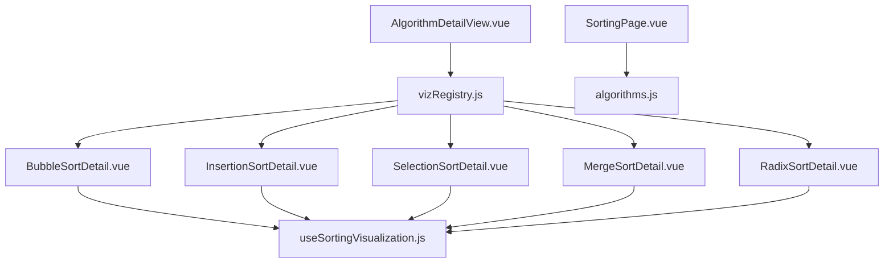
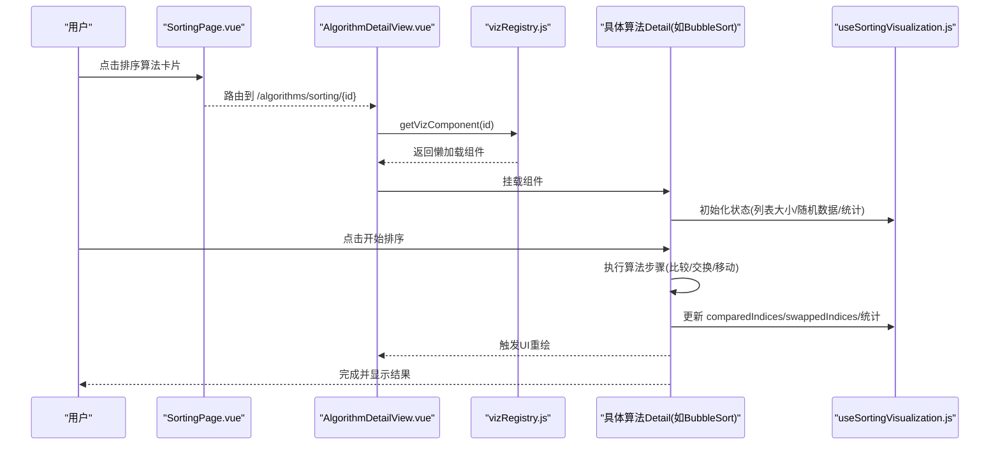
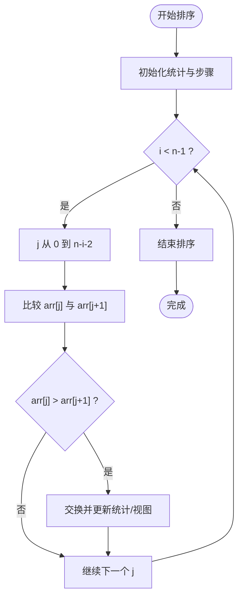
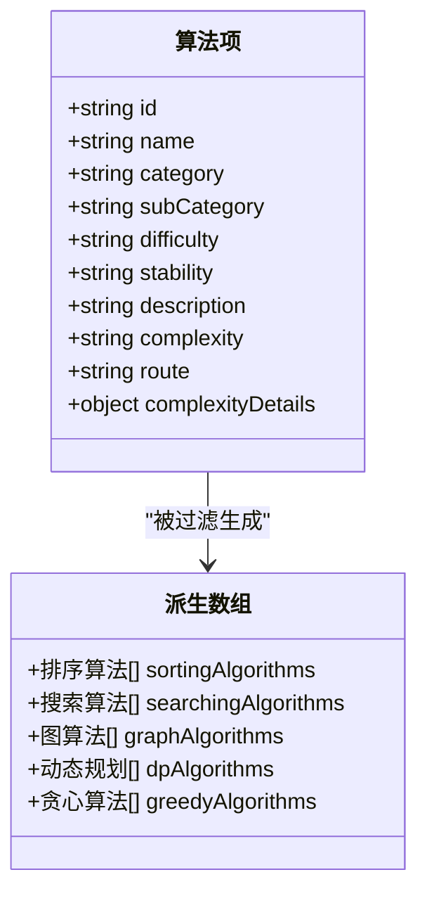
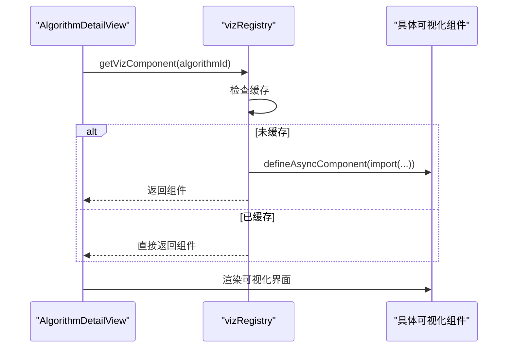
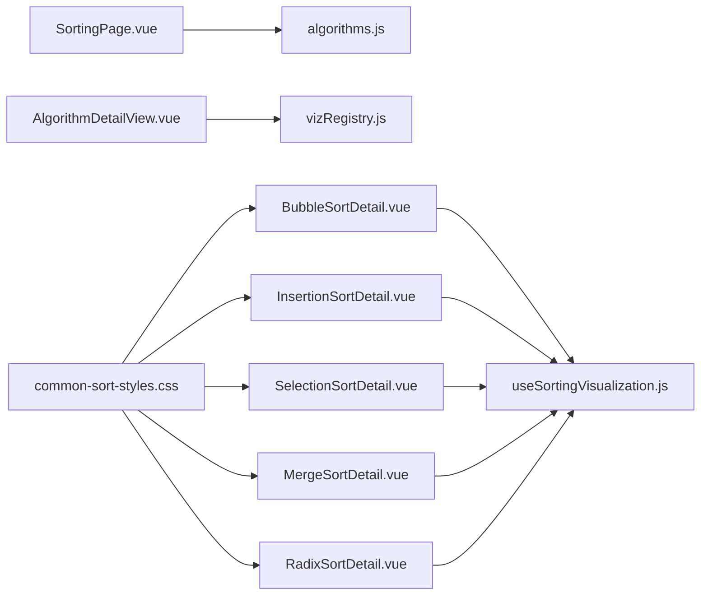

# 排序可视化核心框架

<cite>
**本文引用的文件**
- [useSortingVisualization.js](file://suanfa_vue/src/composables/useSortingVisualization.js)
- [algorithms.js](file://suanfa_vue/src/data/algorithms.js)
- [SortingPage.vue](file://suanfa_vue/src/components/algorithms/sorting_algorithms/SortingPage.vue)
- [vizRegistry.js](file://suanfa_vue/src/components/algorithms/vizRegistry.js)
- [AlgorithmDetailView.vue](file://suanfa_vue/src/components/algorithms/AlgorithmDetailView.vue)
- [BubbleSortDetail.vue](file://suanfa_vue/src/components/algorithms/sorting_algorithms/BubbleSortDetail.vue)
- [InsertionSortDetail.vue](file://suanfa_vue/src/components/algorithms/sorting_algorithms/InsertionSortDetail.vue)
- [SelectionSortDetail.vue](file://suanfa_vue/src/components/algorithms/sorting_algorithms/SelectionSortDetail.vue)
- [MergeSortDetail.vue](file://suanfa_vue/src/components/algorithms/sorting_algorithms/MergeSortDetail.vue)
- [RadixSortDetail.vue](file://suanfa_vue/src/components/algorithms/sorting_algorithms/RadixSortDetail.vue)
- [common-sort-styles.css](file://suanfa_vue/src/components/algorithms/sorting_algorithms/common-sort-styles.css)
</cite>

## 目录
1. [简介](#简介)
2. [项目结构](#项目结构)
3. [核心组件](#核心组件)
4. [架构总览](#架构总览)
5. [详细组件分析](#详细组件分析)
6. [依赖关系分析](#依赖关系分析)
7. [性能考量](#性能考量)
8. [故障排查指南](#故障排查指南)
9. [结论](#结论)
10. [附录：扩展与定制指南](#附录：扩展与定制指南)

## 简介
本文件面向“排序可视化核心框架”，系统性解析 useSortingVisualization 组合式函数的架构设计，涵盖数据流管理、状态机设计、动画队列控制、事件处理机制；统一抽象层如何承载多种排序算法的可视化渲染；以及 algorithms.js 中的数据模型、元数据管理与分类筛选。同时给出响应式布局适配、键盘导航与无障碍访问建议，并提供扩展新算法、自定义动画、主题定制、调试与性能监控、错误处理的实践指南。

## 项目结构
前端采用 Vue 3 + Vite 的单页应用组织方式，排序可视化相关代码主要分布在以下位置：
- composables：共享逻辑（如 useSortingVisualization）
- data：算法元数据与分类派生数据（algorithms.js）
- components/algorithms：各算法详情页与注册表
- components/algorithms/sorting_algorithms：排序类算法的具体实现与样式

图表来源
- [AlgorithmDetailView.vue:1-120](file://suanfa_vue/src/components/algorithms/AlgorithmDetailView.vue#L1-L120)
- [vizRegistry.js:1-62](file://suanfa_vue/src/components/algorithms/vizRegistry.js#L1-L62)
- [BubbleSortDetail.vue:1-160](file://suanfa_vue/src/components/algorithms/sorting_algorithms/BubbleSortDetail.vue#L1-L160)
- [InsertionSortDetail.vue:1-60](file://suanfa_vue/src/components/algorithms/sorting_algorithms/InsertionSortDetail.vue#L1-L60)
- [SelectionSortDetail.vue:1-60](file://suanfa_vue/src/components/algorithms/sorting_algorithms/SelectionSortDetail.vue#L1-L60)
- [MergeSortDetail.vue:172-204](file://suanfa_vue/src/components/algorithms/sorting_algorithms/MergeSortDetail.vue#L172-L204)
- [RadixSortDetail.vue:198-270](file://suanfa_vue/src/components/algorithms/sorting_algorithms/RadixSortDetail.vue#L198-L270)
- [SortingPage.vue:1-97](file://suanfa_vue/src/components/algorithms/sorting_algorithms/SortingPage.vue#L1-L97)
- [algorithms.js:777-800](file://suanfa_vue/src/data/algorithms.js#L777-L800)

章节来源
- [AlgorithmDetailView.vue:1-120](file://suanfa_vue/src/components/algorithms/AlgorithmDetailView.vue#L1-L120)
- [vizRegistry.js:1-62](file://suanfa_vue/src/components/algorithms/vizRegistry.js#L1-L62)
- [SortingPage.vue:1-97](file://suanfa_vue/src/components/algorithms/sorting_algorithms/SortingPage.vue#L1-L97)
- [algorithms.js:777-800](file://suanfa_vue/src/data/algorithms.js#L777-L800)

## 核心组件
- useSortingVisualization：提供排序可视化的公共状态与能力（列表大小校验、随机数据生成、重置排序、统计指标、动画速度等），并通过 onReset 钩子让具体算法注入专属状态清理。
- vizRegistry：按算法 id 懒加载对应可视化组件，并缓存已加载组件，避免重复 import。
- AlgorithmDetailView：统一详情页外壳，负责内容加载、标签切换、动态挂载可视化组件。
- SortingPage：排序算法入口页，基于 algorithms.js 的排序子集进行展示与分类筛选。
- 各排序 Detail 组件：复用 useSortingVisualization，实现各自算法步骤、比较/交换/移动等可视化状态更新。

章节来源
- [useSortingVisualization.js:1-111](file://suanfa_vue/src/composables/useSortingVisualization.js#L1-L111)
- [vizRegistry.js:1-62](file://suanfa_vue/src/components/algorithms/vizRegistry.js#L1-L62)
- [AlgorithmDetailView.vue:1-120](file://suanfa_vue/src/components/algorithms/AlgorithmDetailView.vue#L1-L120)
- [SortingPage.vue:1-97](file://suanfa_vue/src/components/algorithms/sorting_algorithms/SortingPage.vue#L1-L97)

## 架构总览
整体采用“统一详情页 + 注册表 + 组合式函数”的分层架构：
- 路由/页面层：SortingPage 展示算法卡片，点击跳转至统一详情页。
- 详情页层：AlgorithmDetailView 根据 algorithmId 通过 vizRegistry 动态加载对应可视化组件。
- 可视化层：每个算法 Detail 使用 useSortingVisualization 管理通用状态，并在算法循环中逐步更新对比/交换/插入等索引集合，驱动 UI 重绘。
- 数据层：algorithms.js 作为单一数据源，提供算法元数据与分类派生数组。

图表来源
- [SortingPage.vue:11-14](file://suanfa_vue/src/components/algorithms/sorting_algorithms/SortingPage.vue#L11-L14)
- [AlgorithmDetailView.vue:31-54](file://suanfa_vue/src/components/algorithms/AlgorithmDetailView.vue#L31-L54)
- [vizRegistry.js:51-62](file://suanfa_vue/src/components/algorithms/vizRegistry.js#L51-L62)
- [BubbleSortDetail.vue:23-91](file://suanfa_vue/src/components/algorithms/sorting_algorithms/BubbleSortDetail.vue#L23-L91)
- [useSortingVisualization.js:16-111](file://suanfa_vue/src/composables/useSortingVisualization.js#L16-L111)

## 详细组件分析

### 组合式函数 useSortingVisualization
职责与数据流
- 输入选项：默认列表长度、最小/最大长度、自定义随机数据生成器、onReset 钩子。
- 状态管理：
  - 列表控制：listSize、minSize、maxSize，watch 自动裁剪非法值。
  - 数据：data（原始）、sortedData（当前可视化序列）。
  - 统计：isSorting、isButtonClicked、sortingStatus、animationSpeed、comparisonCount、swapCount、currentStep、comparedIndices、swappedIndices。
  - 错误与步骤：errorMessage、sortingSteps、currentStepDetails。
- 关键方法：
  - generateNewList：校验 size → 生成随机数据 → nextTick → resetSort。
  - resetSort：Fisher-Yates 打乱 → 清零统计与步骤 → 调用 onReset。

状态机设计
- 初始态：就绪，可生成新列表或开始排序。
- 运行态：isSorting=true，禁用交互，逐步推进 currentStep，记录比较/交换。
- 完成态：isSorting=false，显示最终结果与统计信息。

动画队列控制
- 通过 animationSpeed 控制每步等待时间（await new Promise(resolve => setTimeout(resolve, speed))），形成“伪队列”步进。
- 每次比较/交换后更新 sortedData 以触发视图更新，再等待下一帧。

事件处理机制
- 按钮点击：设置 isButtonClicked 短暂高亮，防止重复点击。
- 列表大小调整：watch 自动归一化到[min,max]区间。
- 错误处理：try/catch 捕获异常，写入 errorMessage 并提示。

复杂度与性能
- 列表生成 O(n)，重置排序 O(n)。
- 动画步进为异步，避免阻塞主线程；大数据量时建议降低 listSize 或提高 animationSpeed。

章节来源
- [useSortingVisualization.js:16-111](file://suanfa_vue/src/composables/useSortingVisualization.js#L16-L111)

#### 冒泡排序 BubbleSortDetail
- 复用 useSortingVisualization 提供的状态与方法。
- 算法流程：外层 i 轮，内层 j 遍历，比较相邻元素，必要时交换。
- 可视化：comparedIndices 标记比较对，swappedIndices 标记交换对，sortedData 实时更新。
- 统计：comparisonCount、swapCount、currentStep、sortingSteps 记录每一步详情。

图表来源
- [BubbleSortDetail.vue:23-91](file://suanfa_vue/src/components/algorithms/sorting_algorithms/BubbleSortDetail.vue#L23-L91)

章节来源
- [BubbleSortDetail.vue:1-160](file://suanfa_vue/src/components/algorithms/sorting_algorithms/BubbleSortDetail.vue#L1-L160)

#### 插入排序 InsertionSortDetail
- 复用公共状态，额外维护 shiftCount 与 insertedIndices。
- 在 onReset 中清空插入相关状态，保证重置一致性。
- 可视化：comparedIndices 标记比较，insertedIndices 标记插入位置。

章节来源
- [InsertionSortDetail.vue:1-60](file://suanfa_vue/src/components/algorithms/sorting_algorithms/InsertionSortDetail.vue#L1-L60)

#### 选择排序 SelectionSortDetail
- 复用公共状态，额外维护 selectedIndices 与 minIndex。
- onReset 中清空选择相关状态。
- 可视化：comparedIndices 标记比较，selectedIndices/min 标记当前候选最小值。

章节来源
- [SelectionSortDetail.vue:1-60](file://suanfa_vue/src/components/algorithms/sorting_algorithms/SelectionSortDetail.vue#L1-L60)

#### 归并排序 MergeSortDetail
- 复用公共状态，额外维护 mergeCount、mergedIndices、currentMergeRange。
- 可视化：合并阶段用 mergedIndices 与 merge-range 高亮当前合并区间。

章节来源
- [MergeSortDetail.vue:172-204](file://suanfa_vue/src/components/algorithms/sorting_algorithms/MergeSortDetail.vue#L172-L204)

#### 基数排序 RadixSortDetail
- 复用公共状态，额外维护 buckets、currentDigit。
- 可视化：桶状态区显示当前位分配情况，便于理解 LSD 过程。

章节来源
- [RadixSortDetail.vue:198-270](file://suanfa_vue/src/components/algorithms/sorting_algorithms/RadixSortDetail.vue#L198-L270)

### 数据模型与分类筛选（algorithms.js）
- 单一数据源：algorithms 数组包含所有算法的元数据（id、name、category、subCategory、difficulty、stability、description、complexity、route、complexityDetails 等）。
- 派生数据：按 category 过滤出 sortingAlgorithms、searchingAlgorithms 等，供页面展示。
- 分类元信息：algorithmCategories 用于导航与进度页；categorySubCategories 定义子分类顺序。

图表来源
- [algorithms.js:7-228](file://suanfa_vue/src/data/algorithms.js#L7-L228)
- [algorithms.js:777-800](file://suanfa_vue/src/data/algorithms.js#L777-L800)

章节来源
- [algorithms.js:7-228](file://suanfa_vue/src/data/algorithms.js#L7-L228)
- [algorithms.js:777-800](file://suanfa_vue/src/data/algorithms.js#L777-L800)

### 统一详情页与组件注册
- AlgorithmDetailView 负责：
  - 加载算法内容（支持本地兜底）。
  - 标签切换（基础/可视化/进阶/笔记/评论/视频）。
  - 动态挂载可视化组件（通过 vizRegistry）。
- vizRegistry：
  - 维护 loaders Map，按 id 懒加载对应组件。
  - 使用 defineAsyncComponent 与 Map 缓存，提升二次打开性能。

图表来源
- [AlgorithmDetailView.vue:31-54](file://suanfa_vue/src/components/algorithms/AlgorithmDetailView.vue#L31-L54)
- [vizRegistry.js:51-62](file://suanfa_vue/src/components/algorithms/vizRegistry.js#L51-L62)

章节来源
- [AlgorithmDetailView.vue:1-120](file://suanfa_vue/src/components/algorithms/AlgorithmDetailView.vue#L1-L120)
- [vizRegistry.js:1-62](file://suanfa_vue/src/components/algorithms/vizRegistry.js#L1-L62)

## 依赖关系分析
- SortingPage 依赖 algorithms.js 的排序子集进行展示与筛选。
- AlgorithmDetailView 依赖 vizRegistry 动态加载可视化组件。
- 各排序 Detail 依赖 useSortingVisualization 提供通用状态与能力。
- 样式层面，common-sort-styles.css 提供统一的条状图、统计面板、控制栏、步骤历史等样式。

图表来源
- [SortingPage.vue:1-97](file://suanfa_vue/src/components/algorithms/sorting_algorithms/SortingPage.vue#L1-L97)
- [AlgorithmDetailView.vue:1-120](file://suanfa_vue/src/components/algorithms/AlgorithmDetailView.vue#L1-L120)
- [vizRegistry.js:1-62](file://suanfa_vue/src/components/algorithms/vizRegistry.js#L1-L62)
- [BubbleSortDetail.vue:1-160](file://suanfa_vue/src/components/algorithms/sorting_algorithms/BubbleSortDetail.vue#L1-L160)
- [InsertionSortDetail.vue:1-60](file://suanfa_vue/src/components/algorithms/sorting_algorithms/InsertionSortDetail.vue#L1-L60)
- [SelectionSortDetail.vue:1-60](file://suanfa_vue/src/components/algorithms/sorting_algorithms/SelectionSortDetail.vue#L1-L60)
- [MergeSortDetail.vue:172-204](file://suanfa_vue/src/components/algorithms/sorting_algorithms/MergeSortDetail.vue#L172-L204)
- [RadixSortDetail.vue:198-270](file://suanfa_vue/src/components/algorithms/sorting_algorithms/RadixSortDetail.vue#L198-L270)
- [common-sort-styles.css:1-325](file://suanfa_vue/src/components/algorithms/sorting_algorithms/common-sort-styles.css#L1-L325)

章节来源
- [SortingPage.vue:1-97](file://suanfa_vue/src/components/algorithms/sorting_algorithms/SortingPage.vue#L1-L97)
- [common-sort-styles.css:1-325](file://suanfa_vue/src/components/algorithms/sorting_algorithms/common-sort-styles.css#L1-L325)

## 性能考量
- 列表大小限制：minSize/maxSize 防止过大数组导致渲染卡顿。
- 动画速度：animationSpeed 越大越慢，适合教学演示；生产环境可根据设备性能调优。
- 懒加载与缓存：vizRegistry 使用 defineAsyncComponent 与 Map 缓存，减少首屏体积与重复加载开销。
- 步骤记录：sortingSteps 仅保存必要信息，避免过长历史导致内存压力。
- 数据更新策略：每次比较/交换后更新 sortedData，利用 Vue 响应式最小化 DOM 更新。

[本节为通用指导，不直接分析具体文件]

## 故障排查指南
- 列表大小无效：generateNewList 会抛出错误并写入 errorMessage，检查输入是否为数字且在[min,max]范围内。
- 排序未启动：确认 isSorting 未被其他逻辑锁定；检查按钮是否被禁用。
- 动画无响应：检查 animationSpeed 是否过大；确认 await 的定时器是否生效。
- 重置无效：确保 onReset 钩子正确清空算法专属状态（如插入排序的 insertedIndices）。
- 组件未加载：确认 vizRegistry 中存在对应 id 的 loader；检查路由参数是否正确。

章节来源
- [useSortingVisualization.js:58-77](file://suanfa_vue/src/composables/useSortingVisualization.js#L58-L77)
- [BubbleSortDetail.vue:23-91](file://suanfa_vue/src/components/algorithms/sorting_algorithms/BubbleSortDetail.vue#L23-L91)
- [InsertionSortDetail.vue:1-60](file://suanfa_vue/src/components/algorithms/sorting_algorithms/InsertionSortDetail.vue#L1-L60)
- [vizRegistry.js:51-62](file://suanfa_vue/src/components/algorithms/vizRegistry.js#L51-L62)

## 结论
该框架通过组合式函数抽离通用可视化能力，结合统一详情页与组件注册表，实现了排序算法可视化的可扩展、可维护与高性能呈现。algorithms.js 作为单一数据源，支撑了多端一致的分类与展示。未来可通过扩展 onReset、新增算法元数据与注册项，快速接入新算法与自定义动画效果。

[本节为总结性内容，不直接分析具体文件]

## 附录：扩展与定制指南

### 扩展新排序算法
- 新增算法元数据：在 algorithms.js 中添加条目，填写 id、name、category、subCategory、difficulty、stability、description、complexity、route、complexityDetails。
- 创建可视化组件：在 sorting_algorithms 下新建 Detail 组件，复用 useSortingVisualization，实现算法步骤与状态更新。
- 注册可视化组件：在 vizRegistry.js 的 loaders 中添加 id -> 懒加载路径映射。
- 路由与展示：SortingPage 会自动从 sortingAlgorithms 派生数据中展示新算法卡片。

章节来源
- [algorithms.js:7-228](file://suanfa_vue/src/data/algorithms.js#L7-L228)
- [vizRegistry.js:7-17](file://suanfa_vue/src/components/algorithms/vizRegistry.js#L7-L17)
- [SortingPage.vue:28-42](file://suanfa_vue/src/components/algorithms/sorting_algorithms/SortingPage.vue#L28-L42)

### 自定义动画效果
- 调整动画速度：通过 animationSpeed 滑块控制每步等待时间。
- 自定义高亮样式：在 common-sort-styles.css 中扩展 .bar 的状态类（如 compared、swapped、sorted），或在具体 Detail 组件中引入专用样式。
- 步骤历史样式：通过 .step-item 的不同类型类（info、compare、swap、finish）进行差异化展示。

章节来源
- [common-sort-styles.css:142-174](file://suanfa_vue/src/components/algorithms/sorting_algorithms/common-sort-styles.css#L142-L174)
- [common-sort-styles.css:277-314](file://suanfa_vue/src/components/algorithms/sorting_algorithms/common-sort-styles.css#L277-L314)

### 主题定制选项
- 使用 CSS 变量：框架广泛使用 var(--surface)、var(--text-1)、var(--border-1) 等变量，可在全局样式中覆盖以实现主题切换。
- 颜色与阴影：通过修改 .bar、.controls button、.error-message 等类的背景色与阴影，统一视觉风格。

[本节为通用指导，不直接分析具体文件]

### 响应式布局适配方案
- 图表容器：.chart-container 使用 flex 居中与固定高度，配合条宽与间距适应不同屏幕。
- 控制栏：.controls 使用 wrap 与 gap，在小屏上自动换行。
- 步骤历史：.steps-history 设置 max-height 与 overflow-y，避免长列表溢出。

章节来源
- [common-sort-styles.css:176-186](file://suanfa_vue/src/components/algorithms/sorting_algorithms/common-sort-styles.css#L176-L186)
- [common-sort-styles.css:188-227](file://suanfa_vue/src/components/algorithms/sorting_algorithms/common-sort-styles.css#L188-L227)
- [common-sort-styles.css:254-275](file://suanfa_vue/src/components/algorithms/sorting_algorithms/common-sort-styles.css#L254-L275)

### 键盘导航支持与无障碍访问
- 按钮焦点：确保所有交互按钮具有清晰的 tabindex 与 focus 样式（可在样式中补充 outline）。
- 语义化标签：使用 button、label、h1-h4 等语义元素，便于屏幕阅读器识别。
- 错误提示：errorMessage 区域应使用 aria-live 或 role="alert" 通知读屏器。
- 快捷键：可为“开始/暂停/重置”绑定键盘快捷键（如空格、R），并在 UI 中提示。

[本节为通用指导，不直接分析具体文件]

### 调试工具使用
- 控制台日志：各 Detail 组件在关键步骤输出 console.log，便于追踪执行流程。
- 步骤历史：sortingSteps 记录每一步的类型与详情，可用于回放与定位问题。
- 当前步骤详情：currentStepDetails 实时显示当前操作说明，辅助理解算法行为。

章节来源
- [BubbleSortDetail.vue:23-91](file://suanfa_vue/src/components/algorithms/sorting_algorithms/BubbleSortDetail.vue#L23-L91)
- [InsertionSortDetail.vue:32-60](file://suanfa_vue/src/components/algorithms/sorting_algorithms/InsertionSortDetail.vue#L32-L60)

### 性能监控指标
- 比较次数：comparisonCount 反映算法比较操作的规模。
- 交换/移动次数：swapCount、shiftCount、mergeCount 等体现数据变动成本。
- 当前步骤：currentStep 用于衡量进度与耗时估算。
- 动画速度：animationSpeed 影响用户体验与 CPU 占用，需平衡教学与性能。

章节来源
- [useSortingVisualization.js:46-55](file://suanfa_vue/src/composables/useSortingVisualization.js#L46-L55)
- [BubbleSortDetail.vue:23-91](file://suanfa_vue/src/components/algorithms/sorting_algorithms/BubbleSortDetail.vue#L23-L91)

### 错误处理策略
- 输入校验：generateNewList 对 listSize 进行类型与范围校验，失败时抛出错误并提示。
- 运行时异常：try/catch 包裹关键逻辑，捕获异常后写入 errorMessage 并中断后续流程。
- 状态一致性：resetSort 确保所有公共与专属状态清零，避免脏状态累积。

章节来源
- [useSortingVisualization.js:58-77](file://suanfa_vue/src/composables/useSortingVisualization.js#L58-L77)
- [useSortingVisualization.js:79-101](file://suanfa_vue/src/composables/useSortingVisualization.js#L79-L101)