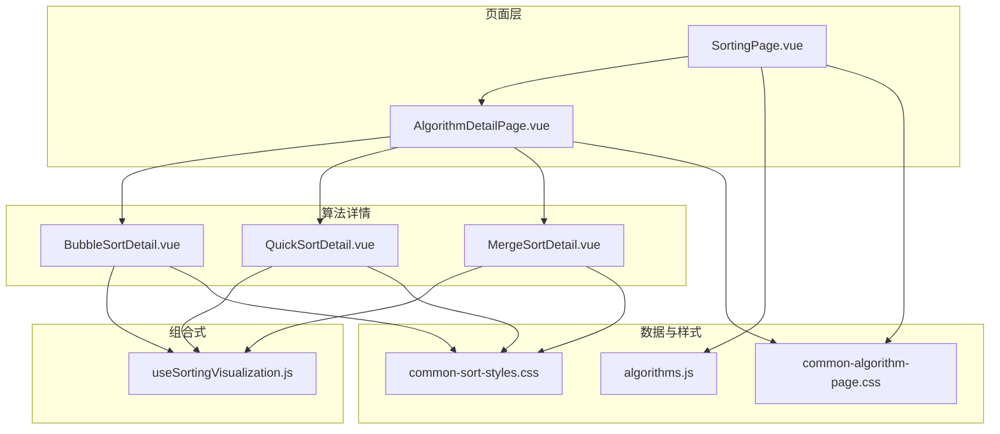
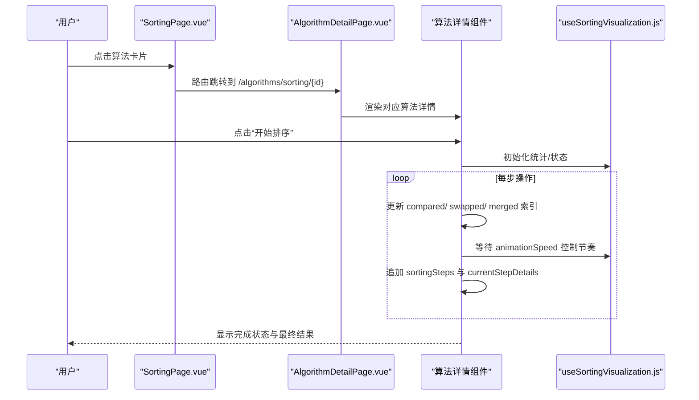
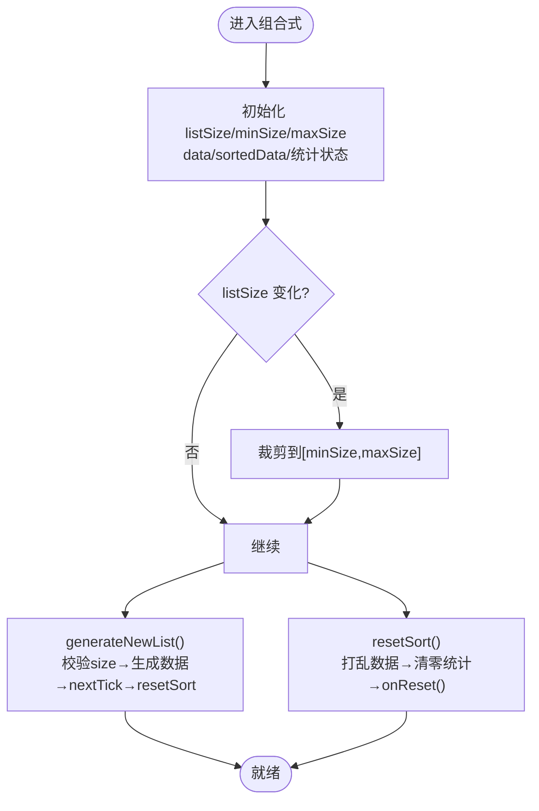
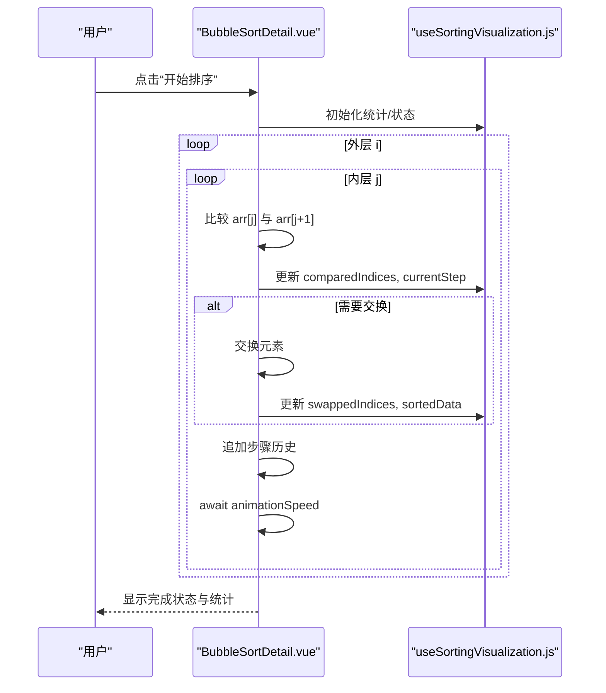
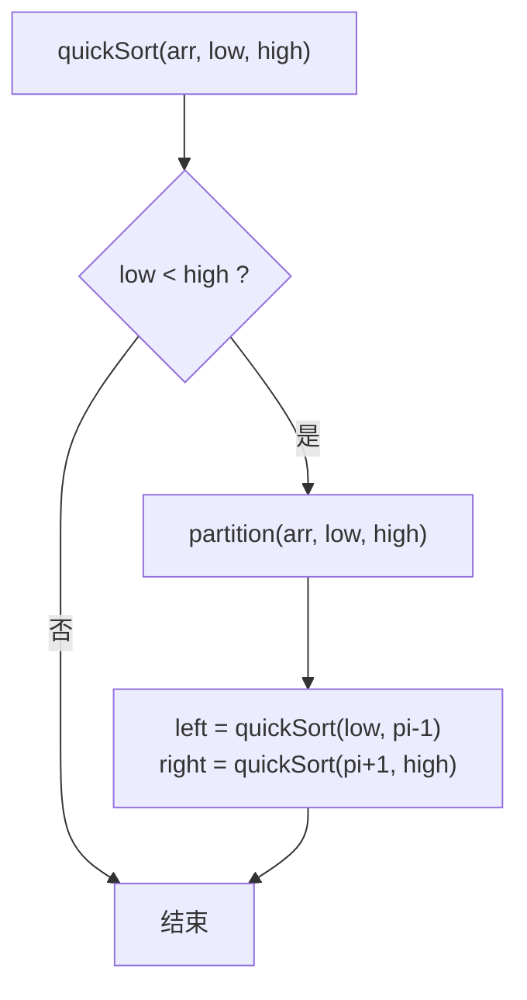
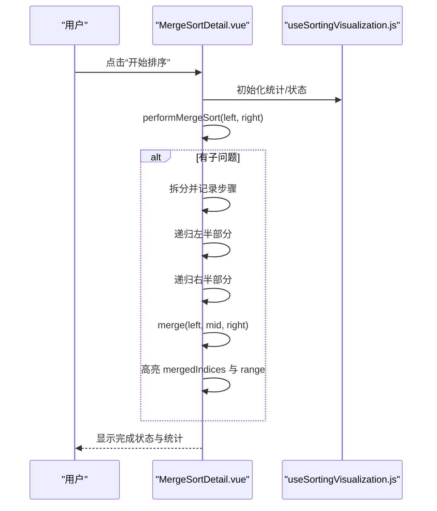
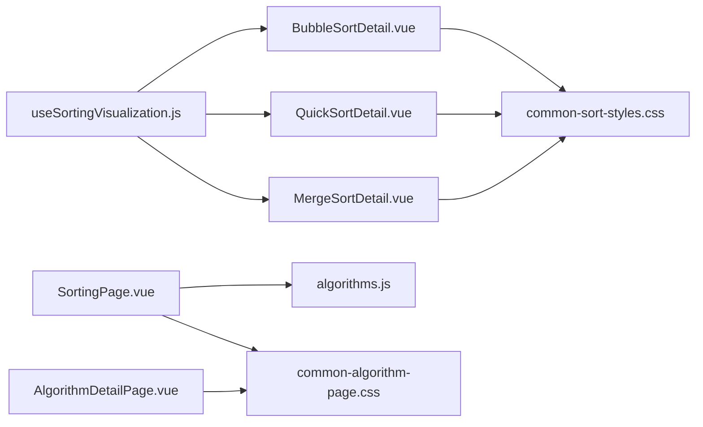

# 排序算法可视化

<cite>
**本文引用的文件**
- [useSortingVisualization.js](file://suanfa_vue/src/composables/useSortingVisualization.js)
- [BubbleSortDetail.vue](file://suanfa_vue/src/components/algorithms/sorting_algorithms/BubbleSortDetail.vue)
- [QuickSortDetail.vue](file://suanfa_vue/src/components/algorithms/sorting_algorithms/QuickSortDetail.vue)
- [MergeSortDetail.vue](file://suanfa_vue/src/components/algorithms/sorting_algorithms/MergeSortDetail.vue)
- [SortingPage.vue](file://suanfa_vue/src/components/algorithms/sorting_algorithms/SortingPage.vue)
- [algorithms.js](file://suanfa_vue/src/data/algorithms.js)
- [common-sort-styles.css](file://suanfa_vue/src/components/algorithms/sorting_algorithms/common-sort-styles.css)
- [common-algorithm-page.css](file://suanfa_vue/src/components/algorithms/sorting_algorithms/common-algorithm-page.css)
- [AlgorithmDetailPage.vue](file://suanfa_vue/src/components/algorithms/AlgorithmDetailPage.vue)
</cite>

## 目录
1. [简介](#简介)
2. [项目结构](#项目结构)
3. [核心组件](#核心组件)
4. [架构总览](#架构总览)
5. [详细组件分析](#详细组件分析)
6. [依赖关系分析](#依赖关系分析)
7. [性能与复杂度](#性能与复杂度)
8. [故障排查指南](#故障排查指南)
9. [结论](#结论)
10. [附录](#附录)

## 简介
本项目提供排序算法的交互式可视化，覆盖冒泡排序、快速排序、归并排序等核心算法。通过统一的组合式函数管理数据流、状态与动画控制，各算法详情页仅保留算法专属逻辑，实现“共享脚手架 + 算法插件”的可扩展架构。页面支持：
- 开始/暂停（通过速度控制与异步步骤）/重置
- 实时统计：比较次数、交换次数、合并次数、当前步骤
- 数组输入校验与自定义数据集生成器
- 响应式布局与可访问性基础样式
- 步骤历史与当前步骤详情展示

## 项目结构
排序可视化位于前端 Vue 应用中，采用“组合式函数 + 算法详情组件 + 统一样式”的分层组织：
- 组合式函数 useSortingVisualization：提供列表大小、随机数据、错误信息、步骤记录、统计状态、生成新列表与重置排序等通用能力
- 算法详情组件：BubbleSortDetail、QuickSortDetail、MergeSortDetail 等，各自实现具体排序算法的可视化流程
- 排序入口页 SortingPage：按分类筛选算法卡片，跳转至对应详情页
- 路由包装 AlgorithmDetailPage：统一承载算法详情页，支持返回上一级
- 数据源 algorithms.js：单一数据源，维护所有算法元数据（名称、复杂度、稳定性、子分类等）
- 样式：common-sort-styles.css、common-algorithm-page.css 提供一致的视觉与布局

图表来源
- [SortingPage.vue:1-97](file://suanfa_vue/src/components/algorithms/sorting_algorithms/SortingPage.vue#L1-L97)
- [AlgorithmDetailPage.vue:1-20](file://suanfa_vue/src/components/algorithms/AlgorithmDetailPage.vue#L1-L20)
- [BubbleSortDetail.vue:1-243](file://suanfa_vue/src/components/algorithms/sorting_algorithms/BubbleSortDetail.vue#L1-L243)
- [QuickSortDetail.vue:1-297](file://suanfa_vue/src/components/algorithms/sorting_algorithms/QuickSortDetail.vue#L1-L297)
- [MergeSortDetail.vue:1-247](file://suanfa_vue/src/components/algorithms/sorting_algorithms/MergeSortDetail.vue#L1-L247)
- [useSortingVisualization.js:1-111](file://suanfa_vue/src/composables/useSortingVisualization.js#L1-L111)
- [algorithms.js:1-808](file://suanfa_vue/src/data/algorithms.js#L1-L808)
- [common-sort-styles.css:1-325](file://suanfa_vue/src/components/algorithms/sorting_algorithms/common-sort-styles.css#L1-L325)
- [common-algorithm-page.css:1-173](file://suanfa_vue/src/components/algorithms/sorting_algorithms/common-algorithm-page.css#L1-L173)

章节来源
- [SortingPage.vue:1-97](file://suanfa_vue/src/components/algorithms/sorting_algorithms/SortingPage.vue#L1-L97)
- [common-algorithm-page.css:1-173](file://suanfa_vue/src/components/algorithms/sorting_algorithms/common-algorithm-page.css#L1-L173)

## 核心组件
- 组合式函数 useSortingVisualization：集中管理排序可视化的公共状态与行为，包括：
  - 列表大小控制与边界校验
  - 随机数据生成（可注入自定义生成器）
  - 错误信息与步骤记录
  - 统计指标：比较次数、交换次数、当前步骤、已比较/已交换索引
  - 生成新列表与重置排序（Fisher-Yates 打乱 + 状态清零）
  - 动画速度控制
- 算法详情组件：
  - BubbleSortDetail：冒泡排序可视化，包含比较与交换的高亮、步骤历史
  - QuickSortDetail：快速排序可视化，包含基准选择、分区高亮、递归过程
  - MergeSortDetail：归并排序可视化，包含拆分、合并区间高亮、合并计数
- 排序入口页 SortingPage：提供分类标签（全部/比较类/非比较类/稳定/不稳定），渲染算法卡片并路由到详情页
- 路由包装 AlgorithmDetailPage：统一承载算法详情页，支持关闭返回

章节来源
- [useSortingVisualization.js:1-111](file://suanfa_vue/src/composables/useSortingVisualization.js#L1-L111)
- [BubbleSortDetail.vue:1-243](file://suanfa_vue/src/components/algorithms/sorting_algorithms/BubbleSortDetail.vue#L1-L243)
- [QuickSortDetail.vue:1-297](file://suanfa_vue/src/components/algorithms/sorting_algorithms/QuickSortDetail.vue#L1-L297)
- [MergeSortDetail.vue:1-247](file://suanfa_vue/src/components/algorithms/sorting_algorithms/MergeSortDetail.vue#L1-L247)
- [SortingPage.vue:1-97](file://suanfa_vue/src/components/algorithms/sorting_algorithms/SortingPage.vue#L1-L97)
- [AlgorithmDetailPage.vue:1-20](file://suanfa_vue/src/components/algorithms/AlgorithmDetailPage.vue#L1-L20)

## 架构总览
整体采用“组合式函数 + 算法详情组件”的松耦合设计：
- 组合式函数负责数据流与状态机，提供 generateNewList、resetSort、动画速度等能力
- 算法详情组件聚焦于算法步骤的可视化：在关键操作处更新 comparedIndices/swappedIndices/mergedIndices 等状态，并通过 await 与 animationSpeed 控制节奏
- 页面层负责导航、分类筛选与统一样式

图表来源
- [SortingPage.vue:1-97](file://suanfa_vue/src/components/algorithms/sorting_algorithms/SortingPage.vue#L1-L97)
- [AlgorithmDetailPage.vue:1-20](file://suanfa_vue/src/components/algorithms/AlgorithmDetailPage.vue#L1-L20)
- [BubbleSortDetail.vue:24-91](file://suanfa_vue/src/components/algorithms/sorting_algorithms/BubbleSortDetail.vue#L24-L91)
- [QuickSortDetail.vue:41-81](file://suanfa_vue/src/components/algorithms/sorting_algorithms/QuickSortDetail.vue#L41-L81)
- [MergeSortDetail.vue:35-65](file://suanfa_vue/src/components/algorithms/sorting_algorithms/MergeSortDetail.vue#L35-L65)
- [useSortingVisualization.js:57-101](file://suanfa_vue/src/composables/useSortingVisualization.js#L57-L101)

## 详细组件分析

### 组合式函数 useSortingVisualization
职责与数据流：
- 列表大小控制：watch 监听 listSize，自动裁剪到 minSize~maxSize，保证有效范围
- 数据生成：generateRandomData 默认生成 1-100 随机数，可通过 options.generateRandomData 替换为自定义数据集生成器
- 错误处理：errorMessage 与 alert 提示，避免无效输入导致崩溃
- 重置排序：使用 Fisher-Yates 打乱 data，清空统计与步骤，调用 onReset 钩子清理算法专属状态
- 动画控制：animationSpeed 用于控制每一步的延时，驱动 UI 逐步更新

图表来源
- [useSortingVisualization.js:16-111](file://suanfa_vue/src/composables/useSortingVisualization.js#L16-L111)

章节来源
- [useSortingVisualization.js:16-111](file://suanfa_vue/src/composables/useSortingVisualization.js#L16-L111)

### 冒泡排序 BubbleSortDetail
可视化要点：
- 外层循环 i，内层循环 j 比较相邻元素
- 每次比较更新 comparedIndices，必要时交换并更新 swappedIndices
- 每步追加 sortingSteps 与 currentStepDetails，使用 animationSpeed 控制节奏
- 完成后输出比较与交换总数

图表来源
- [BubbleSortDetail.vue:24-91](file://suanfa_vue/src/components/algorithms/sorting_algorithms/BubbleSortDetail.vue#L24-L91)
- [useSortingVisualization.js:57-101](file://suanfa_vue/src/composables/useSortingVisualization.js#L57-L101)

章节来源
- [BubbleSortDetail.vue:24-91](file://suanfa_vue/src/components/algorithms/sorting_algorithms/BubbleSortDetail.vue#L24-L91)

### 快速排序 QuickSortDetail
可视化要点：
- 选择最右元素作为基准 pivot，高亮 pivotIndex
- 分区过程中比较 arr[j] 与 pivot，小于则交换并推进 i
- 将基准放到正确位置后，高亮 leftPartitionIndices 与 rightPartitionIndices
- 递归对左右子区间排序，每步追加步骤历史

图表来源
- [QuickSortDetail.vue:41-81](file://suanfa_vue/src/components/algorithms/sorting_algorithms/QuickSortDetail.vue#L41-L81)
- [QuickSortDetail.vue:84-177](file://suanfa_vue/src/components/algorithms/sorting_algorithms/QuickSortDetail.vue#L84-L177)

章节来源
- [QuickSortDetail.vue:41-81](file://suanfa_vue/src/components/algorithms/sorting_algorithms/QuickSortDetail.vue#L41-L81)
- [QuickSortDetail.vue:84-177](file://suanfa_vue/src/components/algorithms/sorting_algorithms/QuickSortDetail.vue#L84-L177)

### 归并排序 MergeSortDetail
可视化要点：
- 递归拆分 performMergeSort(left, mid, right)，记录拆分步骤
- 合并 merge(left, mid, right) 时高亮 mergedIndices 与 currentMergeRange
- 每步追加步骤历史，使用 animationSpeed 控制节奏
- 完成后输出比较与合并总数

图表来源
- [MergeSortDetail.vue:35-65](file://suanfa_vue/src/components/algorithms/sorting_algorithms/MergeSortDetail.vue#L35-L65)
- [MergeSortDetail.vue:68-132](file://suanfa_vue/src/components/algorithms/sorting_algorithms/MergeSortDetail.vue#L68-L132)
- [useSortingVisualization.js:57-101](file://suanfa_vue/src/composables/useSortingVisualization.js#L57-L101)

章节来源
- [MergeSortDetail.vue:35-65](file://suanfa_vue/src/components/algorithms/sorting_algorithms/MergeSortDetail.vue#L35-L65)
- [MergeSortDetail.vue:68-132](file://suanfa_vue/src/components/algorithms/sorting_algorithms/MergeSortDetail.vue#L68-L132)

### 排序入口页 SortingPage
功能：
- 分类标签：全部/比较类/非比较类/稳定/不稳定
- 算法卡片网格：展示名称、难度、子分类、稳定性、复杂度
- 路由跳转：点击卡片或“查看详情”按钮跳转到对应详情页

章节来源
- [SortingPage.vue:1-97](file://suanfa_vue/src/components/algorithms/sorting_algorithms/SortingPage.vue#L1-L97)

## 依赖关系分析
- 组合式函数被三个算法详情组件复用，形成稳定的数据流与状态基座
- 算法详情组件通过 options.onReset 注入算法专属状态的清理逻辑，保持低耦合
- 页面层通过路由与数据源统一管理导航与元数据展示
- 样式文件统一提供交互反馈（比较/交换/合并/完成）与响应式布局

图表来源
- [useSortingVisualization.js:16-111](file://suanfa_vue/src/composables/useSortingVisualization.js#L16-L111)
- [BubbleSortDetail.vue:1-243](file://suanfa_vue/src/components/algorithms/sorting_algorithms/BubbleSortDetail.vue#L1-L243)
- [QuickSortDetail.vue:1-297](file://suanfa_vue/src/components/algorithms/sorting_algorithms/QuickSortDetail.vue#L1-L297)
- [MergeSortDetail.vue:1-247](file://suanfa_vue/src/components/algorithms/sorting_algorithms/MergeSortDetail.vue#L1-L247)
- [SortingPage.vue:1-97](file://suanfa_vue/src/components/algorithms/sorting_algorithms/SortingPage.vue#L1-L97)
- [algorithms.js:1-808](file://suanfa_vue/src/data/algorithms.js#L1-L808)
- [common-sort-styles.css:1-325](file://suanfa_vue/src/components/algorithms/sorting_algorithms/common-sort-styles.css#L1-L325)
- [common-algorithm-page.css:1-173](file://suanfa_vue/src/components/algorithms/sorting_algorithms/common-algorithm-page.css#L1-L173)
- [AlgorithmDetailPage.vue:1-20](file://suanfa_vue/src/components/algorithms/AlgorithmDetailPage.vue#L1-L20)

章节来源
- [useSortingVisualization.js:16-111](file://suanfa_vue/src/composables/useSortingVisualization.js#L16-L111)
- [SortingPage.vue:1-97](file://suanfa_vue/src/components/algorithms/sorting_algorithms/SortingPage.vue#L1-L97)
- [algorithms.js:1-808](file://suanfa_vue/src/data/algorithms.js#L1-L808)

## 性能与复杂度
- 冒泡排序
  - 时间复杂度：O(n^2)（最坏/平均），最好 O(n)（已有序且优化提前退出）
  - 空间复杂度：O(1)
  - 稳定性：稳定
  - 适用场景：小规模数据、教学演示
- 快速排序
  - 时间复杂度：O(n log n)（平均），最坏 O(n^2)（退化情况）
  - 空间复杂度：O(log n)（递归栈）
  - 稳定性：不稳定
  - 适用场景：大规模数据、内存受限环境
- 归并排序
  - 时间复杂度：O(n log n)（所有情况）
  - 空间复杂度：O(n)（合并临时数组）
  - 稳定性：稳定
  - 适用场景：外部排序、链表排序、需要稳定性的场景

章节来源
- [algorithms.js:9-74](file://suanfa_vue/src/data/algorithms.js#L9-L74)

## 故障排查指南
常见问题与定位：
- 列表大小非法：组合式函数会抛出错误并显示 errorMessage，检查 listSize 是否为数字且在范围内
- 动画卡顿：animationSpeed 过大可能导致界面不流畅，适当调小速度；大数据集建议减少列表大小
- 状态未重置：确保 resetSort 被调用，并在 onReset 中清理算法专属状态（如 pivotIndex、left/right partition indices、mergedIndices 等）
- 步骤历史缺失：确认每步都追加了 sortingSteps 与 currentStepDetails，并在关键操作后 await animationSpeed

章节来源
- [useSortingVisualization.js:57-101](file://suanfa_vue/src/composables/useSortingVisualization.js#L57-L101)
- [BubbleSortDetail.vue:24-91](file://suanfa_vue/src/components/algorithms/sorting_algorithms/BubbleSortDetail.vue#L24-L91)
- [QuickSortDetail.vue:41-81](file://suanfa_vue/src/components/algorithms/sorting_algorithms/QuickSortDetail.vue#L41-L81)
- [MergeSortDetail.vue:35-65](file://suanfa_vue/src/components/algorithms/sorting_algorithms/MergeSortDetail.vue#L35-L65)

## 结论
本实现通过组合式函数抽象出排序可视化的通用能力，使各算法详情组件专注于算法步骤的可视化与交互。统一的样式与数据源保证了体验一致性与可维护性。未来可扩展更多排序算法，并通过自定义数据生成器与键盘导航增强可访问性。

## 附录
- 交互控制说明
  - 开始排序：触发算法主流程，更新统计与步骤历史
  - 测试排序：忽略 isSorting 状态执行一次完整流程，便于调试
  - 重置排序：打乱数据并清零统计，调用 onReset 清理算法专属状态
  - 速度调节：调整 animationSpeed 控制每步延时
- 响应式与可访问性
  - 使用 common-algorithm-page.css 提供的容器与网格布局，适配不同屏幕尺寸
  - 按钮与滑块具备基本可访问性，建议在后续迭代中加入 aria-label 与键盘事件支持