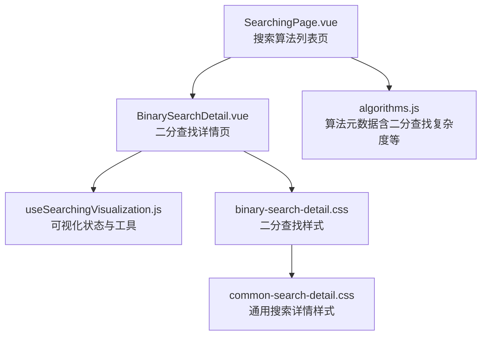
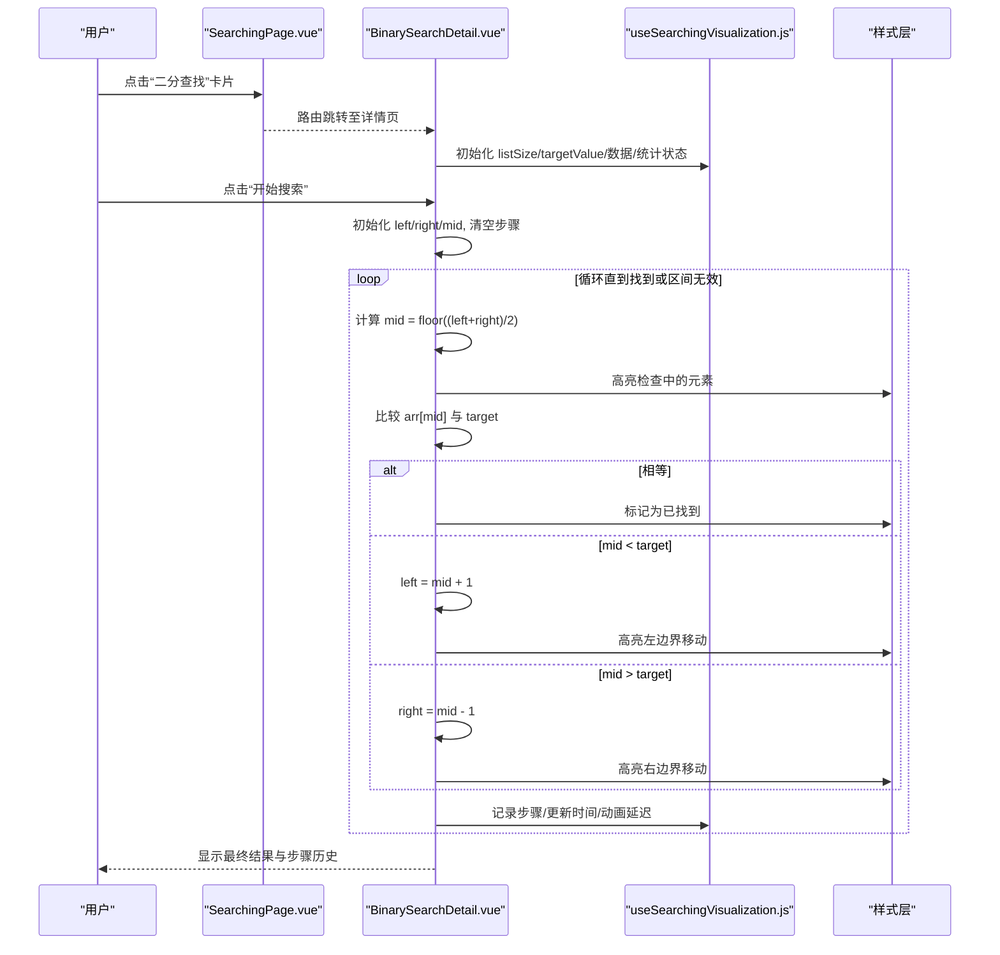
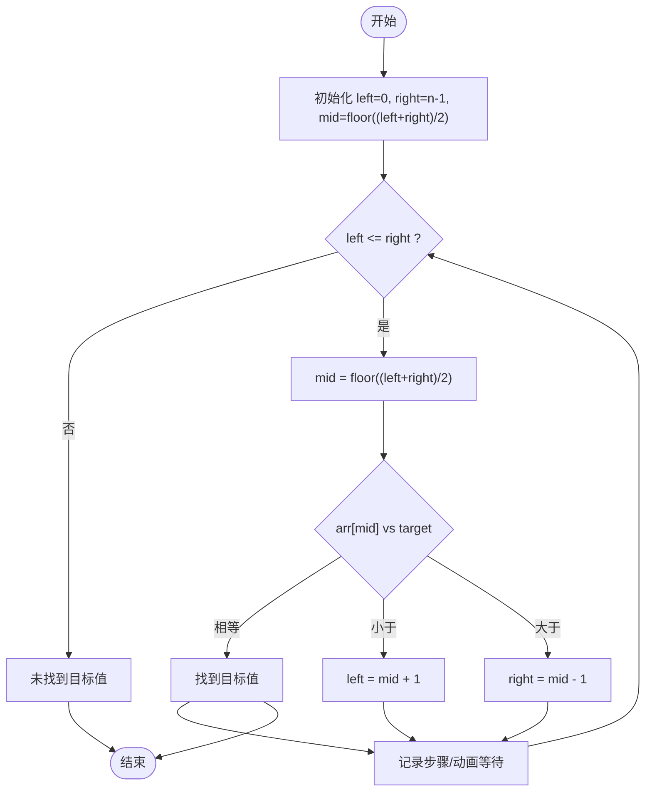
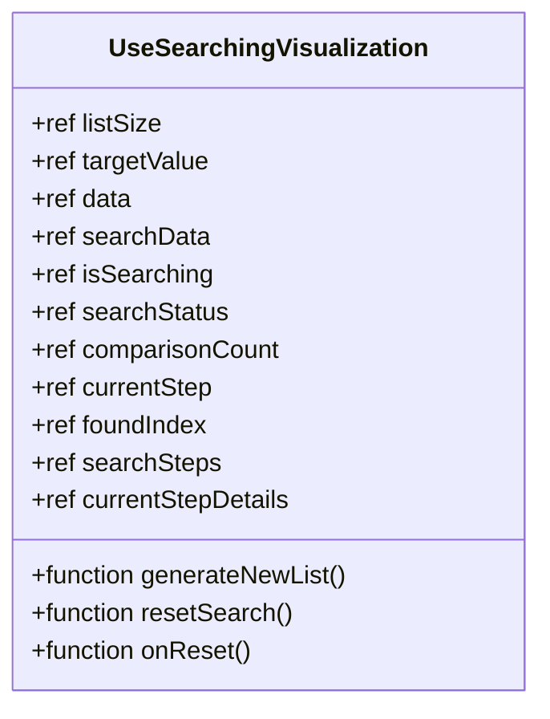
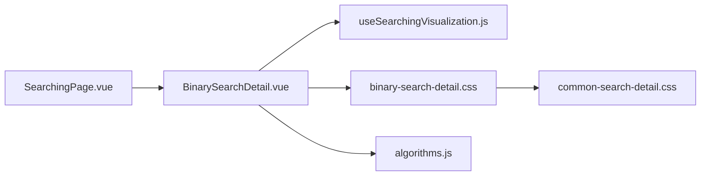

# 二分查找可视化

<cite>
**本文引用的文件**
- [BinarySearchDetail.vue](file://suanfa_vue/src/components/algorithms/searching_algorithms/BinarySearchDetail.vue)
- [useSearchingVisualization.js](file://suanfa_vue/src/composables/useSearchingVisualization.js)
- [binary-search-detail.css](file://suanfa_vue/src/components/algorithms/searching_algorithms/binary-search-detail.css)
- [common-search-detail.css](file://suanfa_vue/src/components/algorithms/searching_algorithms/common-search-detail.css)
- [algorithms.js](file://suanfa_vue/src/data/algorithms.js)
- [SearchingPage.vue](file://suanfa_vue/src/components/algorithms/searching_algorithms/SearchingPage.vue)
</cite>

## 目录
1. [简介](#简介)
2. [项目结构](#项目结构)
3. [核心组件](#核心组件)
4. [架构总览](#架构总览)
5. [详细组件分析](#详细组件分析)
6. [依赖关系分析](#依赖关系分析)
7. [性能与复杂度](#性能与复杂度)
8. [故障排查指南](#故障排查指南)
9. [结论](#结论)
10. [附录](#附录)

## 简介
本文件面向“二分查找算法可视化”的实现与使用，系统说明：
- 二分查找的前提条件（有序数组）与核心思想（分治策略：每次取中点比较并缩小一半范围）。
- 可视化如何展示查找区间变化、中点计算过程、左右边界调整。
- useSearchingVisualization 组合式函数在状态管理、区间更新、动画节奏控制中的作用。
- 时间复杂度 O(log n)、空间复杂度 O(1)，以及与线性查找的性能对比。
- 数据准备要求、查找效率分析方法、错误处理机制的使用指南。

## 项目结构
前端采用 Vue 3 + Vite，搜索算法详情页位于 searching_algorithms 目录下，复用统一的可视化脚手架 composables/useSearchingVisualization.js，并通过样式文件统一交互体验。

图表来源
- [SearchingPage.vue:1-89](file://suanfa_vue/src/components/algorithms/searching_algorithms/SearchingPage.vue#L1-L89)
- [BinarySearchDetail.vue:1-281](file://suanfa_vue/src/components/algorithms/searching_algorithms/BinarySearchDetail.vue#L1-L281)
- [useSearchingVisualization.js:1-119](file://suanfa_vue/src/composables/useSearchingVisualization.js#L1-L119)
- [binary-search-detail.css:1-147](file://suanfa_vue/src/components/algorithms/searching_algorithms/binary-search-detail.css#L1-L147)
- [common-search-detail.css:1-370](file://suanfa_vue/src/components/algorithms/searching_algorithms/common-search-detail.css#L1-L370)
- [algorithms.js:230-274](file://suanfa_vue/src/data/algorithms.js#L230-L274)

章节来源
- [SearchingPage.vue:1-89](file://suanfa_vue/src/components/algorithms/searching_algorithms/SearchingPage.vue#L1-L89)
- [BinarySearchDetail.vue:1-281](file://suanfa_vue/src/components/algorithms/searching_algorithms/BinarySearchDetail.vue#L1-L281)
- [useSearchingVisualization.js:1-119](file://suanfa_vue/src/composables/useSearchingVisualization.js#L1-L119)
- [binary-search-detail.css:1-147](file://suanfa_vue/src/components/algorithms/searching_algorithms/binary-search-detail.css#L1-L147)
- [common-search-detail.css:1-370](file://suanfa_vue/src/components/algorithms/searching_algorithms/common-search-detail.css#L1-L370)
- [algorithms.js:230-274](file://suanfa_vue/src/data/algorithms.js#L230-L274)

## 核心组件
- BinarySearchDetail.vue：实现二分查找的可视化流程，维护 left/right/mid 边界与当前步骤，驱动动画与步骤历史。
- useSearchingVisualization.js：提供通用的数据生成、输入校验、统计状态、重置逻辑与动画速度控制，供各搜索算法复用。
- CSS 样式：binary-search-detail.css 与 common-search-detail.css 负责数组元素高亮、按钮交互、步骤历史展示等视觉反馈。
- algorithms.js：集中维护算法元数据，包含二分查找的时间/空间复杂度、难度、描述等。

章节来源
- [BinarySearchDetail.vue:1-281](file://suanfa_vue/src/components/algorithms/searching_algorithms/BinarySearchDetail.vue#L1-L281)
- [useSearchingVisualization.js:1-119](file://suanfa_vue/src/composables/useSearchingVisualization.js#L1-L119)
- [binary-search-detail.css:1-147](file://suanfa_vue/src/components/algorithms/searching_algorithms/binary-search-detail.css#L1-L147)
- [common-search-detail.css:1-370](file://suanfa_vue/src/components/algorithms/searching_algorithms/common-search-detail.css#L1-L370)
- [algorithms.js:230-274](file://suanfa_vue/src/data/algorithms.js#L230-L274)

## 架构总览
二分查找可视化由“页面路由 -> 详情页 -> 组合式函数 -> 样式”构成。用户通过 SearchingPage 进入二分查找详情页，详情页调用 useSearchingVisualization 管理公共状态，并在自身逻辑中实现二分查找的迭代流程与动画。

图表来源
- [SearchingPage.vue:1-89](file://suanfa_vue/src/components/algorithms/searching_algorithms/SearchingPage.vue#L1-L89)
- [BinarySearchDetail.vue:44-114](file://suanfa_vue/src/components/algorithms/searching_algorithms/BinarySearchDetail.vue#L44-L114)
- [useSearchingVisualization.js:19-118](file://suanfa_vue/src/composables/useSearchingVisualization.js#L19-L118)
- [binary-search-detail.css:12-49](file://suanfa_vue/src/components/algorithms/searching_algorithms/binary-search-detail.css#L12-L49)

## 详细组件分析

### 二分查找算法与可视化流程
- 前提条件：数组必须有序（升序），否则无法保证“按中点比较后丢弃一半”的正确性。
- 核心思想：分治策略。每次取中间位置 mid，将目标值与 arr[mid] 比较：
  - 相等则结束；
  - 若 arr[mid] < target，则目标只可能在右半段，left = mid + 1；
  - 若 arr[mid] > target，则目标只可能在左半段，right = mid - 1。
- 可视化呈现：
  - 数组元素根据 currentMid/currentLeft/currentRight/foundIndex 动态高亮，体现“检查中点”“左右边界”“找到/未找到”。
  - 每一步记录到 searchSteps，并在界面以“步骤历史”滚动展示。
  - 动画速度由 animationSpeed 控制，每步通过异步等待实现逐步推进。

图表来源
- [BinarySearchDetail.vue:44-114](file://suanfa_vue/src/components/algorithms/searching_algorithms/BinarySearchDetail.vue#L44-L114)

章节来源
- [BinarySearchDetail.vue:44-114](file://suanfa_vue/src/components/algorithms/searching_algorithms/BinarySearchDetail.vue#L44-L114)

### useSearchingVisualization 组合式函数
职责与能力：
- 输入校验与约束：listSize/targetValue 的范围限制与类型校验，避免非法输入导致异常。
- 数据生成：默认生成 1~100 随机数，支持自定义 generateRandomData（二分查找需排序）。
- 状态管理：isSearching、searchStatus、comparisonCount、currentStep、foundIndex、searchSteps、currentStepDetails 等。
- 生命周期：generateNewList 生成新数据并重置搜索；resetSearch 清零状态并复制原始数据；onReset 钩子用于算法专属状态复位。
- 动画控制：animationSpeed 控制每步等待时长，配合 UI 实现渐进式演示。

图表来源
- [useSearchingVisualization.js:19-118](file://suanfa_vue/src/composables/useSearchingVisualization.js#L19-L118)

章节来源
- [useSearchingVisualization.js:19-118](file://suanfa_vue/src/composables/useSearchingVisualization.js#L19-L118)

### 样式与交互
- binary-search-detail.css：定义数组元素的初始色、检查态（checking）、找到态（found）、未找到态（not-found）、边界高亮（left-boundary/right-boundary），以及脉动动画。
- common-search-detail.css：统一模态框头部、标签页、滑块控件、按钮组、步骤历史容器、响应式适配等。

章节来源
- [binary-search-detail.css:12-49](file://suanfa_vue/src/components/algorithms/searching_algorithms/binary-search-detail.css#L12-L49)
- [common-search-detail.css:94-196](file://suanfa_vue/src/components/algorithms/searching_algorithms/common-search-detail.css#L94-L196)

### 数据源与导航
- algorithms.js：提供二分查找的元数据，包括名称、分类、复杂度、难度、描述等，便于列表页与详情页展示。
- SearchingPage.vue：提供搜索算法分类筛选与跳转逻辑，用户可进入二分查找详情页。

章节来源
- [algorithms.js:254-274](file://suanfa_vue/src/data/algorithms.js#L254-L274)
- [SearchingPage.vue:1-89](file://suanfa_vue/src/components/algorithms/searching_algorithms/SearchingPage.vue#L1-L89)

## 依赖关系分析
- BinarySearchDetail.vue 依赖 useSearchingVisualization.js 提供的通用状态与工具方法。
- 样式依赖 binary-search-detail.css 与 common-search-detail.css。
- 数据依赖 algorithms.js 中的算法元信息。
- 导航入口来自 SearchingPage.vue。

图表来源
- [BinarySearchDetail.vue:1-281](file://suanfa_vue/src/components/algorithms/searching_algorithms/BinarySearchDetail.vue#L1-L281)
- [useSearchingVisualization.js:1-119](file://suanfa_vue/src/composables/useSearchingVisualization.js#L1-L119)
- [binary-search-detail.css:1-147](file://suanfa_vue/src/components/algorithms/searching_algorithms/binary-search-detail.css#L1-L147)
- [common-search-detail.css:1-370](file://suanfa_vue/src/components/algorithms/searching_algorithms/common-search-detail.css#L1-L370)
- [SearchingPage.vue:1-89](file://suanfa_vue/src/components/algorithms/searching_algorithms/SearchingPage.vue#L1-L89)
- [algorithms.js:230-274](file://suanfa_vue/src/data/algorithms.js#L230-L274)

章节来源
- [BinarySearchDetail.vue:1-281](file://suanfa_vue/src/components/algorithms/searching_algorithms/BinarySearchDetail.vue#L1-L281)
- [useSearchingVisualization.js:1-119](file://suanfa_vue/src/composables/useSearchingVisualization.js#L1-L119)
- [binary-search-detail.css:1-147](file://suanfa_vue/src/components/algorithms/searching_algorithms/binary-search-detail.css#L1-L147)
- [common-search-detail.css:1-370](file://suanfa_vue/src/components/algorithms/searching_algorithms/common-search-detail.css#L1-L370)
- [SearchingPage.vue:1-89](file://suanfa_vue/src/components/algorithms/searching_algorithms/SearchingPage.vue#L1-L89)
- [algorithms.js:230-274](file://suanfa_vue/src/data/algorithms.js#L230-L274)

## 性能与复杂度
- 时间复杂度：O(log n)。每次比较后将查找区间减半，最多进行 log2(n) 次比较。
- 空间复杂度：O(1)。仅使用常数个变量（left、right、mid、found 标志等）。
- 与线性查找对比：
  - 线性查找 O(n)：逐个扫描，最坏情况需要 n 次比较。
  - 二分查找 O(log n)：对有序数组更高效，适合大规模数据快速定位。
- 动画与交互开销：每步通过异步等待实现动画，实际运行时间与 animationSpeed 相关；不影响算法本身的复杂度。

章节来源
- [algorithms.js:254-274](file://suanfa_vue/src/data/algorithms.js#L254-L274)
- [BinarySearchDetail.vue:44-114](file://suanfa_vue/src/components/algorithms/searching_algorithms/BinarySearchDetail.vue#L44-L114)

## 故障排查指南
常见问题与处理：
- 列表大小非数字或越界：useSearchingVisualization 会进行类型与范围校验，并在 generateNewList 时抛出错误提示。
- 目标值非数字或越界：watcher 会自动修正为目标值范围，避免非法输入。
- 搜索过程中重复点击：isSearching 状态防止并发执行；按钮禁用避免误操作。
- 未找到目标值：当 left > right 时终止，记录“未找到”步骤并展示最终状态。
- 动画卡顿：可通过调整 animationSpeed 降低或提升演示速度。

建议：
- 确保数据已排序（二分查找要求有序数组），可在 generateRandomData 中排序或使用有序数据集。
- 若需调试，查看 searchSteps 与 currentStepDetails 获取每一步详细信息。
- 若出现异常，检查 errorMessage 与浏览器控制台日志。

章节来源
- [useSearchingVisualization.js:26-52](file://suanfa_vue/src/composables/useSearchingVisualization.js#L26-L52)
- [useSearchingVisualization.js:72-108](file://suanfa_vue/src/composables/useSearchingVisualization.js#L72-L108)
- [BinarySearchDetail.vue:44-114](file://suanfa_vue/src/components/algorithms/searching_algorithms/BinarySearchDetail.vue#L44-L114)

## 结论
本实现通过 Vue 3 的组合式函数与组件化设计，将二分查找的分治思想以直观的可视化方式呈现：有序数组为前提，每次取中点比较并缩小一半范围，直至找到目标或确定不存在。useSearchingVisualization 提供了健壮的状态管理与动画控制，BinarySearchDetail 聚焦算法逻辑与步骤记录，CSS 提供一致的交互体验。该方案易于扩展到其他搜索算法，同时具备良好的可维护性与用户体验。

## 附录
- 数据准备要求：
  - 输入数组必须为升序排列；可使用 generateRandomData 生成并排序的数据集。
  - 目标值应在合理范围内（默认 1~100），可通过 minTarget/maxTarget 配置。
- 查找效率分析：
  - 比较次数上限为 log2(n)，适合大规模有序数据的快速定位。
  - 与线性查找相比，二分查找在大数据量下显著减少比较次数。
- 错误处理机制：
  - 输入校验失败时给出明确错误信息；搜索过程中状态保护避免并发问题。
  - 步骤历史与当前步骤详情可用于回溯与教学演示。