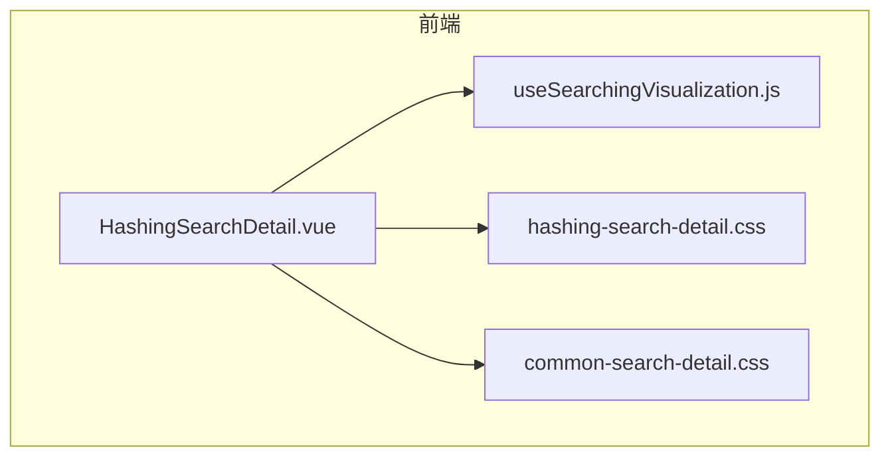
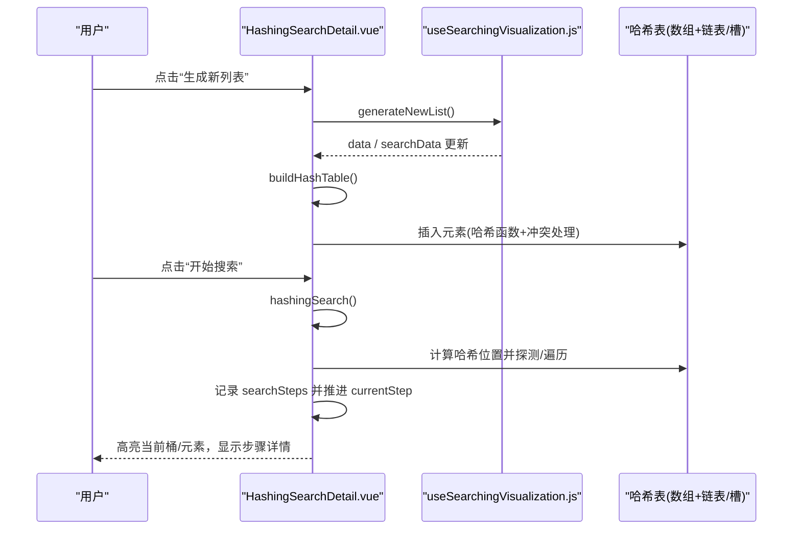
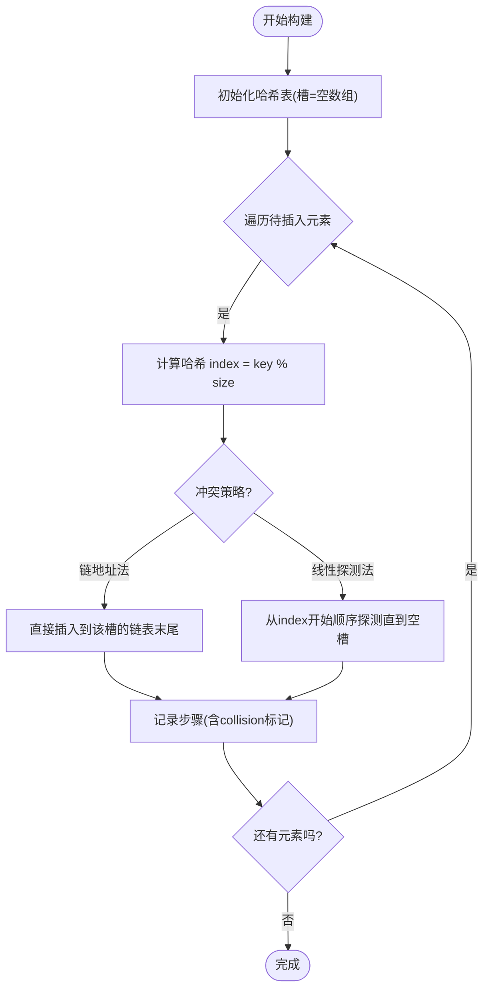
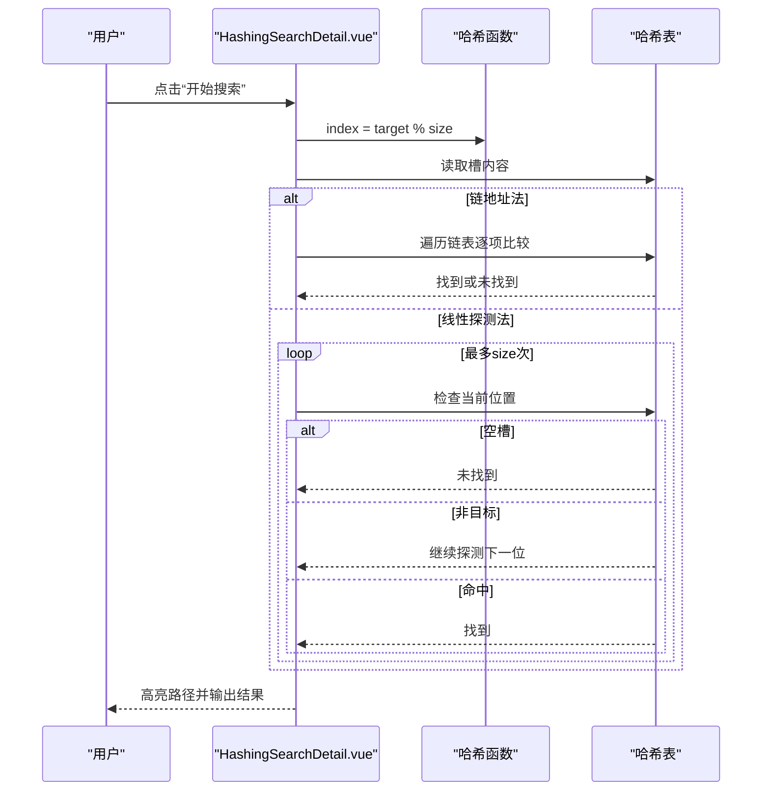
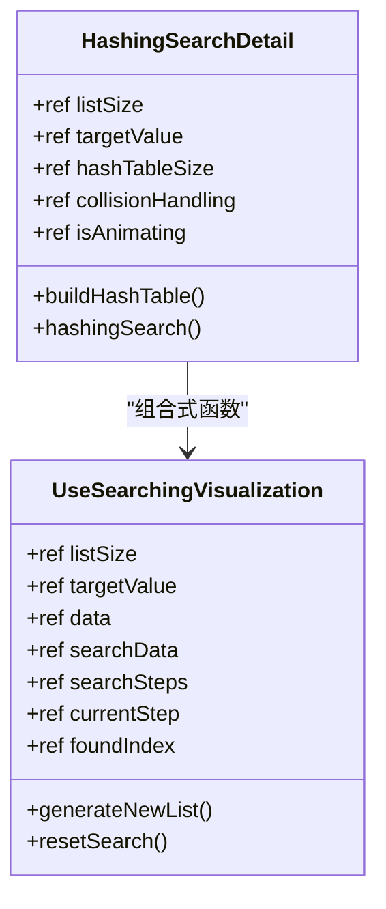
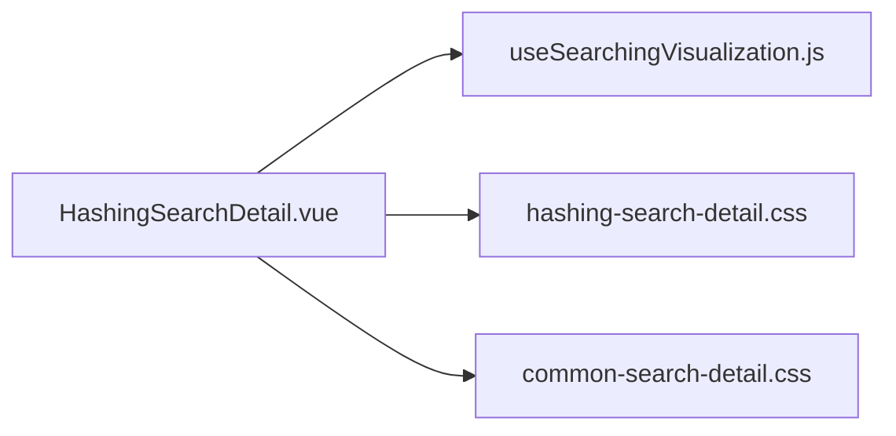

# 哈希查找可视化

<cite>
**本文引用的文件**
- [HashingSearchDetail.vue](file://suanfa_vue/src/components/algorithms/searching_algorithms/HashingSearchDetail.vue)
- [useSearchingVisualization.js](file://suanfa_vue/src/composables/useSearchingVisualization.js)
- [hashing-search-detail.css](file://suanfa_vue/src/components/algorithms/searching_algorithms/hashing-search-detail.css)
- [common-search-detail.css](file://suanfa_vue/src/components/algorithms/searching_algorithms/common-search-detail.css)
</cite>

## 目录
1. [简介](#简介)
2. [项目结构](#项目结构)
3. [核心组件](#核心组件)
4. [架构总览](#架构总览)
5. [详细组件分析](#详细组件分析)
6. [依赖关系分析](#依赖关系分析)
7. [性能考量](#性能考量)
8. [故障排查指南](#故障排查指南)
9. [结论](#结论)
10. [附录](#附录)

## 简介
本文件面向“哈希查找”的可视化实现，系统性说明哈希函数的设计、哈希表的构建、冲突处理方法（链地址法与开放定址中的线性探测法）以及可视化如何呈现哈希表结构、哈希计算过程、冲突解决路径与查找轨迹。同时，深入解析 useSearchingVisualization 组合式函数在状态管理、动画调度、步骤记录中的作用，并结合平均时间复杂度 O(1)、最坏情况 O(n) 进行分析，给出哈希因子选择、冲突处理策略与内存使用优化建议。

## 项目结构
本项目的前端采用 Vue 单文件组件 + 组合式函数模式：
- 算法详情页面：HashingSearchDetail.vue 负责哈希查找的可视化交互、数据生成、哈希表构建与搜索流程控制。
- 共享可视化脚手架：useSearchingVisualization.js 提供通用的列表大小/目标值校验、随机数据生成、重置搜索、动画速度等能力，供多种搜索算法复用。
- 样式资源：hashing-search-detail.css 与 common-search-detail.css 提供哈希表容器、桶、元素高亮、步骤历史等视觉表现。

图表来源
- [HashingSearchDetail.vue:1-502](file://suanfa_vue/src/components/algorithms/searching_algorithms/HashingSearchDetail.vue#L1-L502)
- [useSearchingVisualization.js:1-119](file://suanfa_vue/src/composables/useSearchingVisualization.js#L1-L119)
- [hashing-search-detail.css:1-176](file://suanfa_vue/src/components/algorithms/searching_algorithms/hashing-search-detail.css#L1-L176)
- [common-search-detail.css:1-370](file://suanfa_vue/src/components/algorithms/searching_algorithms/common-search-detail.css#L1-L370)

章节来源
- [HashingSearchDetail.vue:1-502](file://suanfa_vue/src/components/algorithms/searching_algorithms/HashingSearchDetail.vue#L1-L502)
- [useSearchingVisualization.js:1-119](file://suanfa_vue/src/composables/useSearchingVisualization.js#L1-L119)
- [hashing-search-detail.css:1-176](file://suanfa_vue/src/components/algorithms/searching_algorithms/hashing-search-detail.css#L1-L176)
- [common-search-detail.css:1-370](file://suanfa_vue/src/components/algorithms/searching_algorithms/common-search-detail.css#L1-L370)

## 核心组件
- HashingSearchDetail.vue：封装哈希查找的全部业务逻辑与 UI，包括：
  - 哈希函数：key % hashTableSize
  - 哈希表构建：支持链地址法与线性探测法两种冲突处理
  - 查找流程：根据冲突策略执行不同探测/遍历路径
  - 动画与步骤：通过 searchSteps 与 currentStep 驱动逐步高亮
  - 参数控制：列表大小、目标值、哈希表大小、碰撞处理策略、动画速度
- useSearchingVisualization.js：提供通用状态与工具：
  - 输入校验与范围约束（listSize、targetValue）
  - 随机数据生成（可被覆盖为“互不重复”的数据生成器）
  - 生成新列表与重置搜索（公共状态清零 + onReset 钩子）
  - 动画与统计：isSearching、searchStatus、animationSpeed、currentStep、foundIndex 等

章节来源
- [HashingSearchDetail.vue:8-57](file://suanfa_vue/src/components/algorithms/searching_algorithms/HashingSearchDetail.vue#L8-L57)
- [HashingSearchDetail.vue:60-107](file://suanfa_vue/src/components/algorithms/searching_algorithms/HashingSearchDetail.vue#L60-L107)
- [HashingSearchDetail.vue:122-271](file://suanfa_vue/src/components/algorithms/searching_algorithms/HashingSearchDetail.vue#L122-L271)
- [useSearchingVisualization.js:19-119](file://suanfa_vue/src/composables/useSearchingVisualization.js#L19-L119)

## 架构总览
下图展示哈希查找可视化的整体调用关系与数据流：

图表来源
- [HashingSearchDetail.vue:60-107](file://suanfa_vue/src/components/algorithms/searching_algorithms/HashingSearchDetail.vue#L60-L107)
- [HashingSearchDetail.vue:122-271](file://suanfa_vue/src/components/algorithms/searching_algorithms/HashingSearchDetail.vue#L122-L271)
- [useSearchingVisualization.js:72-108](file://suanfa_vue/src/composables/useSearchingVisualization.js#L72-L108)

## 详细组件分析

### 哈希函数与哈希表构建
- 哈希函数：key % hashTableSize，简单取模映射到 [0, hashTableSize-1]。
- 构建流程：
  - 初始化长度为 hashTableSize 的数组，每个槽初始为空数组（链地址法）。
  - 对每个元素计算哈希位置；若为线性探测法，则从原始位置开始顺序探测直到找到空槽。
  - 将元素插入对应槽或链表，并记录每一步（是否发生碰撞、目标索引等）用于动画与步骤历史。

图表来源
- [HashingSearchDetail.vue:60-107](file://suanfa_vue/src/components/algorithms/searching_algorithms/HashingSearchDetail.vue#L60-L107)

章节来源
- [HashingSearchDetail.vue:54-107](file://suanfa_vue/src/components/algorithms/searching_algorithms/HashingSearchDetail.vue#L54-L107)

### 查找流程与冲突处理
- 链地址法查找：
  - 计算哈希位置，若槽为空则未找到；否则遍历该槽的链表逐一比较，找到即返回。
- 线性探测法查找：
  - 计算哈希位置，若该槽为空则未找到；否则顺序探测下一个位置，直到找到或回到起点。

图表来源
- [HashingSearchDetail.vue:122-271](file://suanfa_vue/src/components/algorithms/searching_algorithms/HashingSearchDetail.vue#L122-L271)

章节来源
- [HashingSearchDetail.vue:122-271](file://suanfa_vue/src/components/algorithms/searching_algorithms/HashingSearchDetail.vue#L122-L271)

### 可视化渲染与状态联动
- 哈希表渲染：
  - 每个槽为一个“桶”，内部以列表形式展示元素；当前步对应的桶/元素通过类名高亮。
  - 支持“当前”“找到”“未找到”“碰撞”等视觉状态。
- 步骤历史：
  - 每次插入/查找都会向 searchSteps 追加一条记录，包含状态、索引、是否碰撞、链表下标等，便于回放与解释。
- 动画控制：
  - 通过 setInterval 递增 currentStep，配合 searchSteps[currentStep-1] 决定当前高亮位置与文案。

图表来源
- [HashingSearchDetail.vue:8-57](file://suanfa_vue/src/components/algorithms/searching_algorithms/HashingSearchDetail.vue#L8-L57)
- [useSearchingVisualization.js:19-119](file://suanfa_vue/src/composables/useSearchingVisualization.js#L19-L119)

章节来源
- [HashingSearchDetail.vue:288-398](file://suanfa_vue/src/components/algorithms/searching_algorithms/HashingSearchDetail.vue#L288-L398)
- [hashing-search-detail.css:1-176](file://suanfa_vue/src/components/algorithms/searching_algorithms/hashing-search-detail.css#L1-L176)
- [common-search-detail.css:94-196](file://suanfa_vue/src/components/algorithms/searching_algorithms/common-search-detail.css#L94-L196)

### useSearchingVisualization 在哈希查找中的职责
- 状态管理：
  - 统一维护 isSearching、searchStatus、animationSpeed、currentStep、foundIndex 等状态，避免各算法细节重复。
- 数据与校验：
  - 提供 generateRandomData 钩子，哈希场景覆盖为“互不重复”的数据生成器，保证哈希演示更直观。
  - 对 listSize/targetValue 进行边界约束与类型校验，防止非法输入。
- 生命周期：
  - generateNewList 触发后等待 nextTick 再 resetSearch，确保 DOM 更新后再清理状态。
  - resetSearch 会调用 onReset 钩子，由 HashingSearchDetail 注入清除哈希动画标记的逻辑。

章节来源
- [useSearchingVisualization.js:19-119](file://suanfa_vue/src/composables/useSearchingVisualization.js#L19-L119)
- [HashingSearchDetail.vue:8-40](file://suanfa_vue/src/components/algorithms/searching_algorithms/HashingSearchDetail.vue#L8-L40)

## 依赖关系分析
- 组件耦合：
  - HashingSearchDetail.vue 强依赖 useSearchingVisualization.js 提供的通用能力，自身仅关注哈希专属逻辑（哈希函数、冲突策略、构建与查找）。
- 外部依赖：
  - Vue 响应式 API（ref、watch、nextTick）用于状态驱动视图更新。
- 样式依赖：
  - hashing-search-detail.css 定义哈希表容器、桶、元素高亮等；common-search-detail.css 提供统一的控件、按钮、步骤历史样式。

图表来源
- [HashingSearchDetail.vue:1-502](file://suanfa_vue/src/components/algorithms/searching_algorithms/HashingSearchDetail.vue#L1-L502)
- [useSearchingVisualization.js:1-119](file://suanfa_vue/src/composables/useSearchingVisualization.js#L1-L119)
- [hashing-search-detail.css:1-176](file://suanfa_vue/src/components/algorithms/searching_algorithms/hashing-search-detail.css#L1-L176)
- [common-search-detail.css:1-370](file://suanfa_vue/src/components/algorithms/searching_algorithms/common-search-detail.css#L1-L370)

章节来源
- [HashingSearchDetail.vue:1-502](file://suanfa_vue/src/components/algorithms/searching_algorithms/HashingSearchDetail.vue#L1-L502)
- [useSearchingVisualization.js:1-119](file://suanfa_vue/src/composables/useSearchingVisualization.js#L1-L119)

## 性能考量
- 时间复杂度
  - 平均情况：O(1)。哈希函数均匀分布时，插入与查找期望常数时间。
  - 最坏情况：O(n)。当大量键映射到同一槽（严重冲突），链地址法退化为链表遍历，线性探测法可能产生聚集导致多次探测。
- 哈希因子（负载因子 α = n/m）的影响
  - 增大哈希表大小 m（降低 α）可减少冲突，提升平均性能，但增加内存占用。
  - 过小 m 会导致频繁冲突，查找/插入退化接近 O(n)。
- 冲突处理策略对比
  - 链地址法：实现简单，适合动态增长；额外指针开销；长链表影响查找。
  - 线性探测法：缓存友好，无额外指针；易出现一次聚集，需合理扩容与再哈希。
- 内存使用优化建议
  - 预估数据规模，设置合适的初始容量以减少再分配。
  - 链地址法中，若链表过长，考虑换用平衡树或二次哈希。
  - 线性探测法中，设定阈值自动扩容并重建哈希表，维持较低负载因子。
- 动画与交互性能
  - 大数组时减少每步重绘频率，可通过 animationSpeed 调节。
  - 避免在高频回调中创建大量临时对象，注意 searchSteps 长度控制。

[本节为通用性能讨论，不直接分析具体代码行]

## 故障排查指南
- 常见问题
  - 列表大小非法：useSearchingVisualization 会对 size 做类型与范围校验，错误信息会写入 errorMessage 并提示。
  - 目标值越界：targetValue 会被限制在 minTarget/maxTarget 范围内。
  - 动画卡死：确认 isSearching/isAnimating 状态是否正确复位；必要时调用 resetSearch。
  - 哈希表未更新：修改 hashTableSize 后需重新“重建哈希表”。
- 定位方法
  - 查看“当前步骤详情”与“搜索步骤历史”，确认每一步的状态与索引。
  - 切换冲突策略（链地址法/线性探测法）观察行为差异。
  - 调整动画速度，慢速回放以便理解探测路径。

章节来源
- [useSearchingVisualization.js:72-108](file://suanfa_vue/src/composables/useSearchingVisualization.js#L72-L108)
- [HashingSearchDetail.vue:372-398](file://suanfa_vue/src/components/algorithms/searching_algorithms/HashingSearchDetail.vue#L372-L398)

## 结论
本实现通过 HashingSearchDetail.vue 与 useSearchingVisualization.js 的配合，提供了完整的哈希查找可视化体验：涵盖哈希函数设计、哈希表构建、链地址法与线性探测法的冲突处理、查找路径的高亮与步骤回放。结合平均 O(1)、最坏 O(n) 的复杂度分析与负载因子的影响，用户可直观理解哈希的性能特征与调优方向。建议在真实场景中依据数据规模选择合适的哈希表容量与冲突策略，并通过合理的扩容机制维持良好性能。

[本节为总结性内容，不直接分析具体代码行]

## 附录
- 关键交互入口
  - “生成新列表”：基于自定义生成器（互不重复）生成数据并重建哈希表。
  - “重建哈希表”：按当前哈希表大小与冲突策略重新插入所有元素。
  - “开始搜索”：对目标值执行哈希查找，展示探测/遍历路径。
  - “重置搜索”：清空动画与步骤，恢复就绪状态。
- 可视化要点
  - 桶高亮：当前访问的槽以特定样式突出。
  - 元素高亮：链地址法中链表项逐个高亮；线性探测法中探测到的槽依次高亮。
  - 步骤历史：每条记录包含状态、索引、是否碰撞、链表下标等，便于教学与复盘。

章节来源
- [HashingSearchDetail.vue:288-398](file://suanfa_vue/src/components/algorithms/searching_algorithms/HashingSearchDetail.vue#L288-L398)
- [hashing-search-detail.css:1-176](file://suanfa_vue/src/components/algorithms/searching_algorithms/hashing-search-detail.css#L1-L176)
- [common-search-detail.css:251-310](file://suanfa_vue/src/components/algorithms/searching_algorithms/common-search-detail.css#L251-L310)