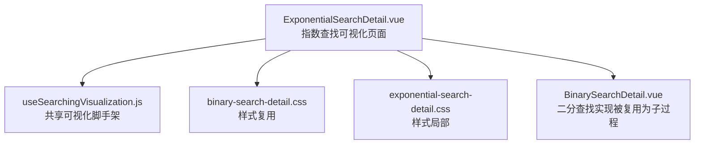
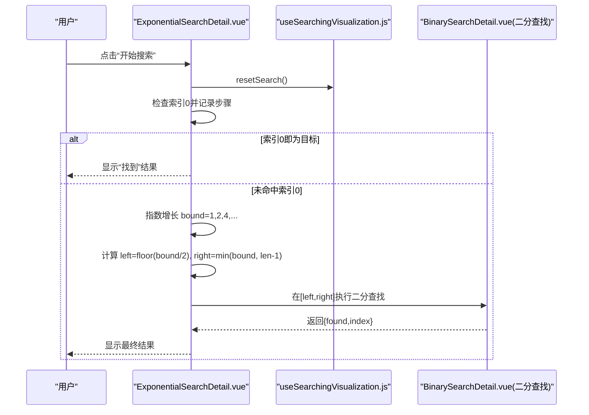
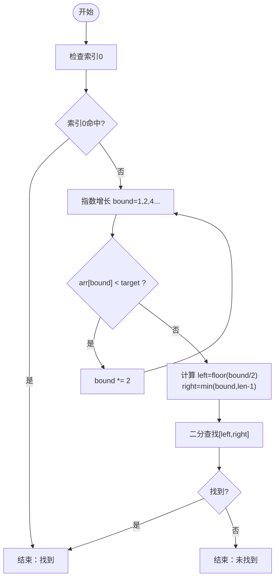
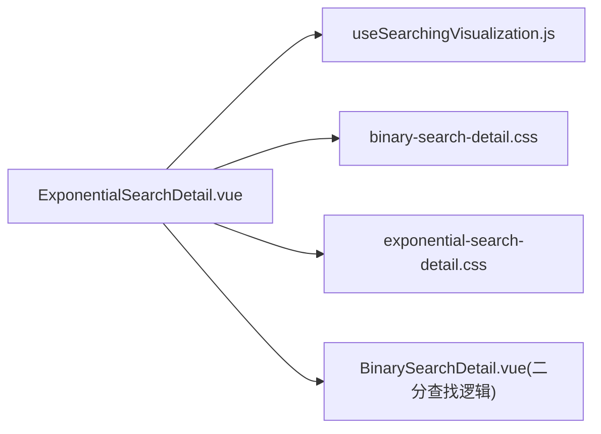

# 指数查找可视化

<cite>
**本文引用的文件**
- [ExponentialSearchDetail.vue](file://suanfa_vue/src/components/algorithms/searching_algorithms/ExponentialSearchDetail.vue)
- [useSearchingVisualization.js](file://suanfa_vue/src/composables/useSearchingVisualization.js)
- [binary-search-detail.css](file://suanfa_vue/src/components/algorithms/searching_algorithms/binary-search-detail.css)
- [exponential-search-detail.css](file://suanfa_vue/src/components/algorithms/searching_algorithms/exponential-search-detail.css)
- [BinarySearchDetail.vue](file://suanfa_vue/src/components/algorithms/searching_algorithms/BinarySearchDetail.vue)
</cite>

## 目录
1. [简介](#简介)
2. [项目结构](#项目结构)
3. [核心组件](#核心组件)
4. [架构总览](#架构总览)
5. [详细组件分析](#详细组件分析)
6. [依赖关系分析](#依赖关系分析)
7. [性能与复杂度](#性能与复杂度)
8. [故障排查指南](#故障排查指南)
9. [结论](#结论)
10. [附录](#附录)

## 简介
本文件面向“指数查找算法可视化”的实现与使用，目标是帮助读者理解：
- 指数查找的工作原理：先以指数方式扩大查找范围，再在确定的范围内进行二分查找。
- 可视化如何展示“指数增长阶段”和“二分查找阶段”的切换。
- useSearchingVisualization 组合式函数在状态管理、动画控制、统计计数等方面的职责。
- 时间复杂度 O(log n) 的来源与适用场景，以及与线性查找、二分查找等算法的比较。
- 无限或未知大小有序数组的处理策略、边界条件检查与性能优化建议。

## 项目结构
本项目采用 Vue 单页应用组织搜索类算法可视化页面。与指数查找相关的代码主要位于 searching_algorithms 目录下，并通过 composables 提供共享的可视化调度逻辑。

图表来源
- [ExponentialSearchDetail.vue:1-364](file://suanfa_vue/src/components/algorithms/searching_algorithms/ExponentialSearchDetail.vue#L1-L364)
- [useSearchingVisualization.js:1-119](file://suanfa_vue/src/composables/useSearchingVisualization.js#L1-L119)
- [binary-search-detail.css:1-147](file://suanfa_vue/src/components/algorithms/searching_algorithms/binary-search-detail.css#L1-L147)
- [exponential-search-detail.css:1-110](file://suanfa_vue/src/components/algorithms/searching_algorithms/exponential-search-detail.css#L1-L110)
- [BinarySearchDetail.vue:1-200](file://suanfa_vue/src/components/algorithms/searching_algorithms/BinarySearchDetail.vue#L1-L200)

章节来源
- [ExponentialSearchDetail.vue:1-364](file://suanfa_vue/src/components/algorithms/searching_algorithms/ExponentialSearchDetail.vue#L1-L364)
- [useSearchingVisualization.js:1-119](file://suanfa_vue/src/composables/useSearchingVisualization.js#L1-L119)

## 核心组件
- ExponentialSearchDetail.vue：指数查找可视化页面，负责用户交互、数据生成、步骤记录、UI 状态更新，以及调用内部二分查找子过程。
- useSearchingVisualization.js：提供通用的可视化脚手架，包括列表大小/目标值校验、随机数据生成、重置搜索、统计状态（比较次数、当前步骤、当前索引、是否正在搜索等）。
- BinarySearchDetail.vue：提供二分查找的具体实现，被指数查找作为子过程复用，用于在确定范围后进行高效查找。
- CSS 样式：binary-search-detail.css 与 exponential-search-detail.css 提供统一的视觉反馈（检查中、找到、未找到、左右边界高亮等）。

章节来源
- [ExponentialSearchDetail.vue:1-364](file://suanfa_vue/src/components/algorithms/searching_algorithms/ExponentialSearchDetail.vue#L1-L364)
- [useSearchingVisualization.js:1-119](file://suanfa_vue/src/composables/useSearchingVisualization.js#L1-L119)
- [BinarySearchDetail.vue:1-200](file://suanfa_vue/src/components/algorithms/searching_algorithms/BinarySearchDetail.vue#L1-L200)
- [binary-search-detail.css:1-147](file://suanfa_vue/src/components/algorithms/searching_algorithms/binary-search-detail.css#L1-L147)
- [exponential-search-detail.css:1-110](file://suanfa_vue/src/components/algorithms/searching_algorithms/exponential-search-detail.css#L1-L110)

## 架构总览
指数查找由两个阶段组成：
- 阶段一：指数增长阶段。从索引 0 开始，按 1, 2, 4, 8, ... 的方式跳跃检查，直到遇到大于等于目标值的元素或越界，从而确定一个包含目标的区间 [left, right]。
- 阶段二：二分查找阶段。在上述区间内进行标准二分查找，快速定位目标。

图表来源
- [ExponentialSearchDetail.vue:118-218](file://suanfa_vue/src/components/algorithms/searching_algorithms/ExponentialSearchDetail.vue#L118-L218)
- [BinarySearchDetail.vue:44-114](file://suanfa_vue/src/components/algorithms/searching_algorithms/BinarySearchDetail.vue#L44-L114)

## 详细组件分析

### 指数查找页面（ExponentialSearchDetail.vue）
- 数据与状态
  - 通过 useSearchingVisualization 获取 listSize、targetValue、searchData、isSearching、comparisonCount、currentStep、currentIndex、foundIndex 等状态。
  - 自定义 generateRandomData 生成递增有序数组，满足指数查找的前提。
  - onReset 钩子用于清除二分查找子过程的专属状态，避免跨次搜索污染。
- 算法流程
  - 第一步：检查索引 0，若命中则直接结束。
  - 第二步：指数增长 bound 从 1 开始倍增，直到 arr[bound] >= target 或越界。
  - 第三步：计算二分查找范围 left = floor(bound/2)，right = min(bound, arr.length - 1)。
  - 第四步：调用内部 binarySearch(arr, target, left, right) 完成查找。
- 可视化呈现
  - 每一步都记录 searchSteps 并更新 currentStepDetails，配合 UI 高亮 currentIndex、binaryLeft、binaryRight、binaryMiddle。
  - 成功/失败消息通过 successMessage/errorMessage 提示，并在 3 秒后自动清除。
- 错误处理
  - try/catch 包裹搜索主流程，捕获异常并设置 errorMessage，同时确保 isSearching/isBinarySearching 复位。

图表来源
- [ExponentialSearchDetail.vue:118-218](file://suanfa_vue/src/components/algorithms/searching_algorithms/ExponentialSearchDetail.vue#L118-L218)

章节来源
- [ExponentialSearchDetail.vue:1-364](file://suanfa_vue/src/components/algorithms/searching_algorithms/ExponentialSearchDetail.vue#L1-L364)

### 共享可视化脚手架（useSearchingVisualization.js）
- 职责
  - 参数校验与默认值：listSize、targetValue 的范围限制与类型校验。
  - 数据生成：支持自定义 generateRandomData；默认生成 1-100 随机数。
  - 生命周期：generateNewList 生成新数据并触发 resetSearch；resetSearch 清零公共状态并复制原始数据。
  - 统计与动画：comparisonCount、currentStep、currentIndex、foundIndex、animationSpeed 等。
- 扩展点
  - onReset 钩子允许各算法注入自身状态清理逻辑（如二分查找的 left/right/mid）。
- 返回值
  - 暴露所有状态与方法供 Detail 组件使用，保证不同搜索算法可视化的一致性。

章节来源
- [useSearchingVisualization.js:1-119](file://suanfa_vue/src/composables/useSearchingVisualization.js#L1-L119)

### 二分查找子过程（BinarySearchDetail.vue）
- 作用
  - 在指数查找确定的区间 [left, right] 内执行标准二分查找，逐步缩小范围直至命中或确认不存在。
- 可视化
  - 每步记录 mid、比较次数、移动方向（左/右），并以步骤历史形式展示。
  - 与指数查找页面共用样式，统一视觉反馈。

章节来源
- [BinarySearchDetail.vue:1-200](file://suanfa_vue/src/components/algorithms/searching_algorithms/BinarySearchDetail.vue#L1-L200)

### 样式与视觉反馈
- binary-search-detail.css：定义 array-element 的检查中、找到、未找到、左右边界高亮等样式，并提供统计容器、滑块控制器、步骤历史等布局样式。
- exponential-search-detail.css：提供基础容器与元素样式，与二分查找保持一致的视觉风格。

章节来源
- [binary-search-detail.css:1-147](file://suanfa_vue/src/components/algorithms/searching_algorithms/binary-search-detail.css#L1-L147)
- [exponential-search-detail.css:1-110](file://suanfa_vue/src/components/algorithms/searching_algorithms/exponential-search-detail.css#L1-L110)

## 依赖关系分析
- ExponentialSearchDetail.vue 依赖 useSearchingVisualization.js 提供的通用状态与工具方法。
- ExponentialSearchDetail.vue 内部实现了 binarySearch 函数，该实现与 BinarySearchDetail.vue 的二分查找逻辑一致，可视为复用同一算法思想。
- 样式文件被组件引入，提供一致的视觉体验。

图表来源
- [ExponentialSearchDetail.vue:1-364](file://suanfa_vue/src/components/algorithms/searching_algorithms/ExponentialSearchDetail.vue#L1-L364)
- [useSearchingVisualization.js:1-119](file://suanfa_vue/src/composables/useSearchingVisualization.js#L1-L119)
- [binary-search-detail.css:1-147](file://suanfa_vue/src/components/algorithms/searching_algorithms/binary-search-detail.css#L1-L147)
- [exponential-search-detail.css:1-110](file://suanfa_vue/src/components/algorithms/searching_algorithms/exponential-search-detail.css#L1-L110)
- [BinarySearchDetail.vue:1-200](file://suanfa_vue/src/components/algorithms/searching_algorithms/BinarySearchDetail.vue#L1-L200)

## 性能与复杂度
- 时间复杂度
  - 指数增长阶段：最多 O(log k) 次检查，其中 k 为目标所在位置的索引上界。
  - 二分查找阶段：O(log m)，m 为区间长度。
  - 总体：O(log n)，n 为数组长度（当目标存在时）。
- 空间复杂度
  - 原地操作，额外空间 O(1)（不计递归栈；此处二分查找为迭代实现）。
- 与其他搜索算法比较
  - 线性查找：O(n)，适合无序或小规模数据。
  - 二分查找：O(log n)，但要求已知上下界且已排序。
  - 插值查找：平均 O(log log n)，对均匀分布数据更优，但对极端分布可能退化。
  - 跳表/分块查找：适用于特定数据结构或外部存储场景。
- 适用场景
  - 无限或未知大小的有序序列（例如流式数据、只读大数组），先指数定位范围，再二分查找。
  - 目标靠近起始位置时，指数查找能更快收敛。

章节来源
- [ExponentialSearchDetail.vue:118-218](file://suanfa_vue/src/components/algorithms/searching_algorithms/ExponentialSearchDetail.vue#L118-L218)
- [BinarySearchDetail.vue:44-114](file://suanfa_vue/src/components/algorithms/searching_algorithms/BinarySearchDetail.vue#L44-L114)

## 故障排查指南
- 常见问题
  - 数组未排序：指数查找要求递增有序。若数据非递增，可能导致范围计算错误或无法找到目标。
  - 目标值越界：当目标小于最小值或大于最大值时，应正确返回“未找到”。
  - 动画卡顿：animationSpeed 过大或过小会影响用户体验，可在界面调整。
- 调试建议
  - 观察 searchSteps 与 currentStepDetails，确认每一步的索引与比较情况。
  - 检查 isSearching/isBinarySearching 状态是否正确复位，避免重复触发。
  - 使用“测试搜索”按钮绕过 isSearching 状态，便于快速验证逻辑。
- 错误处理
  - 搜索主流程使用 try/catch 捕获异常，设置 errorMessage 并复位状态。
  - 生成新列表时对 size 进行类型与范围校验，防止非法输入导致崩溃。

章节来源
- [ExponentialSearchDetail.vue:211-218](file://suanfa_vue/src/components/algorithms/searching_algorithms/ExponentialSearchDetail.vue#L211-L218)
- [useSearchingVisualization.js:72-108](file://suanfa_vue/src/composables/useSearchingVisualization.js#L72-L108)

## 结论
指数查找将“指数增长定位范围”与“二分查找精确定位”结合，既能在未知/无限有序序列中高效工作，又保持了 O(log n) 的时间复杂度。通过可视化组件，用户可以直观看到指数阶段的跳跃过程与二分阶段的范围收缩过程，有助于深入理解算法行为与性能特征。结合 useSearchingVisualization 的通用脚手架，不同搜索算法的可视化实现更加一致与可维护。

## 附录
- 实践建议
  - 无限数组处理：在访问 arr[bound] 前务必检查 bound < arr.length，避免越界。
  - 边界条件检查：空数组、单元素数组、目标小于最小值、目标大于最大值等情形需明确处理。
  - 性能优化：合理设置 animationSpeed；在大数据量下减少不必要的 DOM 更新；必要时对 searchSteps 做分页或节流。
  - 数据生成：对于指数查找，建议使用递增有序数据生成器，确保算法前提成立。
- 参考路径
  - 指数查找主流程：[ExponentialSearchDetail.vue:118-218](file://suanfa_vue/src/components/algorithms/searching_algorithms/ExponentialSearchDetail.vue#L118-L218)
  - 二分查找子过程：[BinarySearchDetail.vue:44-114](file://suanfa_vue/src/components/algorithms/searching_algorithms/BinarySearchDetail.vue#L44-L114)
  - 可视化脚手架：[useSearchingVisualization.js:1-119](file://suanfa_vue/src/composables/useSearchingVisualization.js#L1-L119)
  - 样式资源：[binary-search-detail.css:1-147](file://suanfa_vue/src/components/algorithms/searching_algorithms/binary-search-detail.css#L1-L147)、[exponential-search-detail.css:1-110](file://suanfa_vue/src/components/algorithms/searching_algorithms/exponential-search-detail.css#L1-L110)