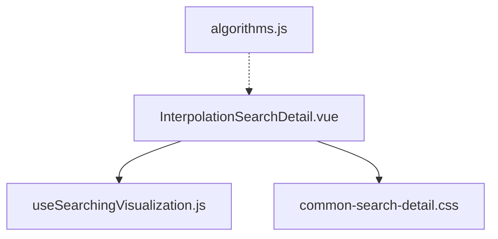
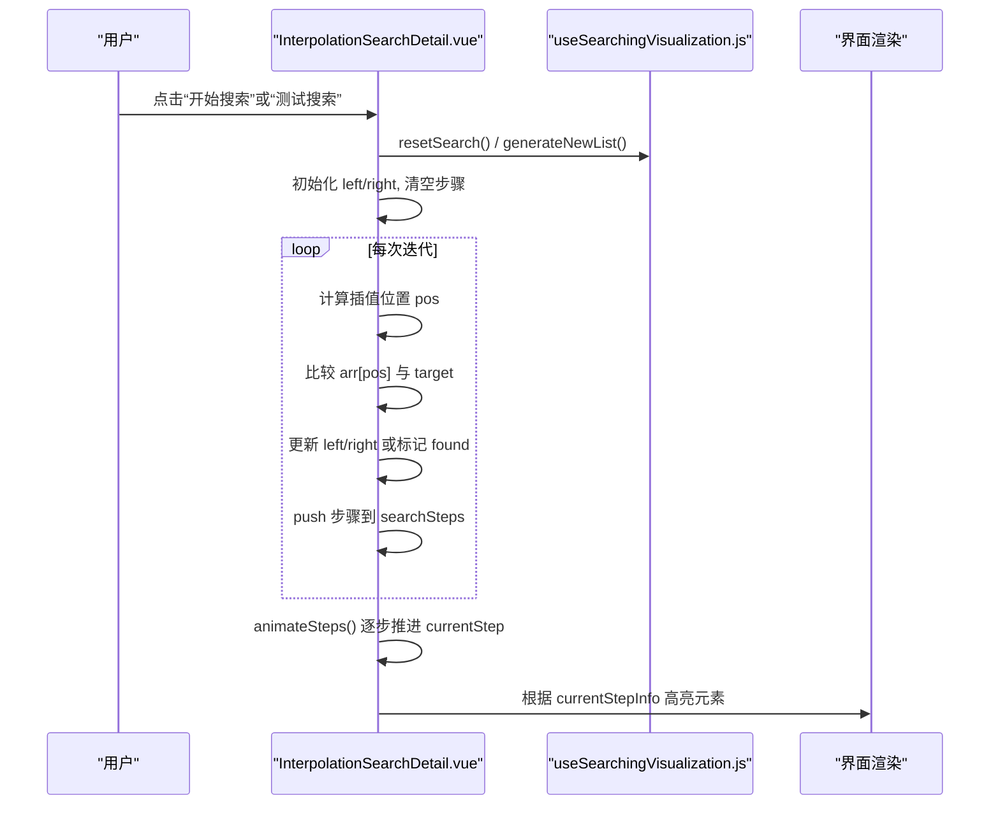
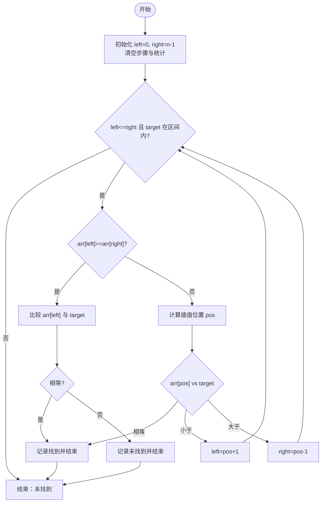
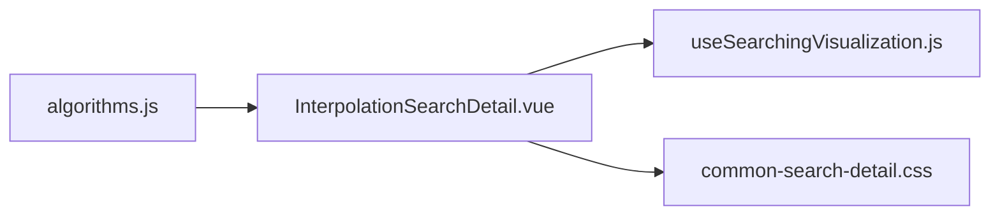

# 插值查找可视化

<cite>
**本文引用的文件**
- [InterpolationSearchDetail.vue](file://suanfa_vue/src/components/algorithms/searching_algorithms/InterpolationSearchDetail.vue)
- [useSearchingVisualization.js](file://suanfa_vue/src/composables/useSearchingVisualization.js)
- [algorithms.js](file://suanfa_vue/src/data/algorithms.js)
- [common-search-detail.css](file://suanfa_vue/src/components/algorithms/searching_algorithms/common-search-detail.css)
</cite>

## 目录
1. [简介](#简介)
2. [项目结构](#项目结构)
3. [核心组件](#核心组件)
4. [架构总览](#架构总览)
5. [详细组件分析](#详细组件分析)
6. [依赖关系分析](#依赖关系分析)
7. [性能与复杂度](#性能与复杂度)
8. [使用指南](#使用指南)
9. [故障排查](#故障排查)
10. [结论](#结论)

## 简介
本文件面向“插值查找算法可视化”的实现与使用说明，系统阐述：
- 插值查找的原理与对二分查找的改进：通过插值公式估计目标值位置，适用于近似均匀分布的有序数据。
- 可视化如何展示插值位置计算、查找区间动态调整、预测精度效果（比较次数、步骤历史）。
- useSearchingVisualization 组合式函数在状态管理、边界处理、动画控制方面的职责。
- 时间复杂度、适用数据特征、与二分查找的性能对比。
- 数据分布要求、插值公式应用、查找效率评估的实践建议。

## 项目结构
与插值查找可视化直接相关的代码位于前端 Vue 工程：
- 算法详情页面：InterpolationSearchDetail.vue 负责插值查找的具体实现、步骤记录与动画播放。
- 共享可视化脚手架：useSearchingVisualization.js 提供列表大小、目标值、随机数据生成、搜索状态、统计指标等通用能力。
- 算法元数据：algorithms.js 中定义了“插值查找”的名称、分类、复杂度描述等。
- 样式：common-search-detail.css 提供统一的搜索类算法可视化样式。

图表来源
- [InterpolationSearchDetail.vue:1-311](file://suanfa_vue/src/components/algorithms/searching_algorithms/InterpolationSearchDetail.vue#L1-L311)
- [useSearchingVisualization.js:1-119](file://suanfa_vue/src/composables/useSearchingVisualization.js#L1-L119)
- [algorithms.js:275-296](file://suanfa_vue/src/data/algorithms.js#L275-L296)
- [common-search-detail.css:93-196](file://suanfa_vue/src/components/algorithms/searching_algorithms/common-search-detail.css#L93-L196)

章节来源
- [InterpolationSearchDetail.vue:1-311](file://suanfa_vue/src/components/algorithms/searching_algorithms/InterpolationSearchDetail.vue#L1-L311)
- [useSearchingVisualization.js:1-119](file://suanfa_vue/src/composables/useSearchingVisualization.js#L1-L119)
- [algorithms.js:275-296](file://suanfa_vue/src/data/algorithms.js#L275-L296)
- [common-search-detail.css:93-196](file://suanfa_vue/src/components/algorithms/searching_algorithms/common-search-detail.css#L93-L196)

## 核心组件
- InterpolationSearchDetail.vue
  - 实现插值查找主流程：初始化左右边界、循环计算插值位置、比较并收缩区间、记录每一步到 searchSteps。
  - 维护专属状态 isAnimating，驱动动画播放；复用共享脚手架提供的 listSize/targetValue/generateNewList/resetSearch 等能力。
  - 提供“开始搜索/测试搜索/重置搜索”等操作按钮，并在 UI 上显示当前步骤、比较次数、找到索引等统计信息。
- useSearchingVisualization.js
  - 统一管理搜索可视化所需的状态：isSearching、searchStatus、comparisonCount、currentStep、foundIndex、animationSpeed 等。
  - 提供 generateNewList 与 resetSearch，确保数据与状态一致性；支持 onReset 钩子用于各算法清理自身状态。
  - 内置输入校验与范围约束，避免非法配置导致异常。

章节来源
- [InterpolationSearchDetail.vue:69-189](file://suanfa_vue/src/components/algorithms/searching_algorithms/InterpolationSearchDetail.vue#L69-L189)
- [useSearchingVisualization.js:19-119](file://suanfa_vue/src/composables/useSearchingVisualization.js#L19-L119)

## 架构总览
插值查找可视化的调用链如下：用户交互触发 InterpolationSearchDetail.vue 中的 interpolationSearch/testSearch，内部调用共享脚手架的 resetSearch/generateNewList，随后执行插值查找逻辑，将每一步写入 searchSteps，并通过 animateSteps 逐步高亮数组元素，展示查找过程。

图表来源
- [InterpolationSearchDetail.vue:69-189](file://suanfa_vue/src/components/algorithms/searching_algorithms/InterpolationSearchDetail.vue#L69-L189)
- [useSearchingVisualization.js:72-108](file://suanfa_vue/src/composables/useSearchingVisualization.js#L72-L108)

## 详细组件分析

### 插值查找主流程（InterpolationSearchDetail.vue）
- 数据准备
  - 通过自定义 generateRandomData 生成递增有序数组，满足插值查找的前提条件。
  - 可选将目标值设置为数组中的一个随机元素，便于演示命中场景。
- 查找循环
  - 循环条件包含 left <= right 以及目标值落在当前区间范围内，避免越界与无效计算。
  - 特殊分支：当 arr[left] === arr[right] 时，直接比较该位置是否为目标值，防止除零。
  - 插值公式：pos = left + floor((target - arr[left]) * (right - left) / (arr[right] - arr[left]))。
  - 比较后根据大小关系移动 left 或 right，直至找到或区间为空。
- 步骤记录与动画
  - 每步记录类型（check/tooSmall/tooBig/found/notFound/finish），并附带 left/right/pos 等信息。
  - animateSteps 以 animationSpeed 为间隔逐步推进 currentStep，驱动 UI 高亮。

图表来源
- [InterpolationSearchDetail.vue:94-152](file://suanfa_vue/src/components/algorithms/searching_algorithms/InterpolationSearchDetail.vue#L94-L152)

章节来源
- [InterpolationSearchDetail.vue:22-36](file://suanfa_vue/src/components/algorithms/searching_algorithms/InterpolationSearchDetail.vue#L22-L36)
- [InterpolationSearchDetail.vue:69-189](file://suanfa_vue/src/components/algorithms/searching_algorithms/InterpolationSearchDetail.vue#L69-L189)

### 共享可视化脚手架（useSearchingVisualization.js）
- 状态管理
  - 列表大小与目标值：listSize、targetValue，带 watch 做范围限制与类型校验。
  - 搜索状态：isSearching、searchStatus、comparisonCount、currentStep、currentIndex、foundIndex、animationSpeed。
  - 数据：data（原始）、searchData（可操作副本）。
- 生命周期方法
  - generateNewList：校验 size → 生成随机数据 → nextTick → resetSearch。
  - resetSearch：清零所有搜索相关状态，复制 data 到 searchData，并调用 onReset 钩子。
- 扩展点
  - generateRandomData：由具体算法注入（如插值查找需递增有序）。
  - onReset：供算法清理自身状态（如 isAnimating）。

章节来源
- [useSearchingVisualization.js:19-119](file://suanfa_vue/src/composables/useSearchingVisualization.js#L19-L119)

### 样式与交互
- common-search-detail.css 统一了搜索类算法的可视化容器、数组元素、滑块控件、步骤历史等样式，保证一致的交互体验。
- InterpolationSearchDetail.vue 通过 CSS 类名（checking/found/not-found/left-boundary/right-boundary）在 UI 上直观呈现当前检查位置、边界与结果。

章节来源
- [common-search-detail.css:93-196](file://suanfa_vue/src/components/algorithms/searching_algorithms/common-search-detail.css#L93-L196)
- [InterpolationSearchDetail.vue:257-291](file://suanfa_vue/src/components/algorithms/searching_algorithms/InterpolationSearchDetail.vue#L257-L291)

## 依赖关系分析
- InterpolationSearchDetail.vue 依赖 useSearchingVisualization.js 提供的状态与方法，解耦了通用逻辑与算法特定逻辑。
- algorithms.js 提供“插值查找”的元数据（名称、分类、复杂度说明），用于导航与展示。
- common-search-detail.css 被多个搜索类详情页复用，降低重复样式成本。

图表来源
- [InterpolationSearchDetail.vue:1-311](file://suanfa_vue/src/components/algorithms/searching_algorithms/InterpolationSearchDetail.vue#L1-L311)
- [useSearchingVisualization.js:1-119](file://suanfa_vue/src/composables/useSearchingVisualization.js#L1-L119)
- [algorithms.js:275-296](file://suanfa_vue/src/data/algorithms.js#L275-L296)
- [common-search-detail.css:93-196](file://suanfa_vue/src/components/algorithms/searching_algorithms/common-search-detail.css#L93-L196)

章节来源
- [InterpolationSearchDetail.vue:1-311](file://suanfa_vue/src/components/algorithms/searching_algorithms/InterpolationSearchDetail.vue#L1-L311)
- [useSearchingVisualization.js:1-119](file://suanfa_vue/src/composables/useSearchingVisualization.js#L1-L119)
- [algorithms.js:275-296](file://suanfa_vue/src/data/algorithms.js#L275-L296)
- [common-search-detail.css:93-196](file://suanfa_vue/src/components/algorithms/searching_algorithms/common-search-detail.css#L93-L196)

## 性能与复杂度
- 平均情况：对于近似均匀分布的有序数据，插值查找的平均时间复杂度约为 O(log log n)。
- 最坏情况：当数据分布极端不均匀时，可能退化至 O(n)。
- 空间复杂度：O(1)，仅使用常数级额外空间。
- 与二分查找对比
  - 二分查找稳定 O(log n)，不依赖数据分布；插值查找在均匀分布下更快，但在非均匀分布下可能退化为线性。
  - 插值查找的优势在于利用数值分布信息“预测”位置，减少比较次数；但需要数据基本均匀且有序。

章节来源
- [algorithms.js:275-296](file://suanfa_vue/src/data/algorithms.js#L275-L296)

## 使用指南
- 数据分布要求
  - 数据必须为有序数组；插值查找依赖数值分布近似均匀以获得更好性能。
  - 示例中通过 generateRandomData 生成递增序列，确保满足有序性。
- 插值公式应用
  - 在每次迭代中计算 pos = left + floor((target - arr[left]) * (right - left) / (arr[right] - arr[left]))。
  - 注意边界保护：当 arr[left] == arr[right] 时避免除零，直接比较该位置。
- 查找效率评估
  - 观察“比较次数”和“步骤历史”，比较次数越少通常意味着预测更准确。
  - 在均匀分布数据上，预期比较次数接近 O(log log n)；在非均匀数据上，比较次数可能接近 O(n)。
- 操作步骤
  - 设置“列表大小”与“目标值”，点击“生成新列表”创建有序数组。
  - 点击“开始搜索”查看逐步过程；或点击“测试搜索”自动生成包含目标的数组并立即搜索。
  - 通过“动画速度”调节步骤播放节奏，便于理解每一步变化。
  - 使用“重置搜索”清空状态，重新进行实验。

章节来源
- [InterpolationSearchDetail.vue:22-36](file://suanfa_vue/src/components/algorithms/searching_algorithms/InterpolationSearchDetail.vue#L22-L36)
- [InterpolationSearchDetail.vue:69-189](file://suanfa_vue/src/components/algorithms/searching_algorithms/InterpolationSearchDetail.vue#L69-L189)
- [useSearchingVisualization.js:72-108](file://suanfa_vue/src/composables/useSearchingVisualization.js#L72-L108)

## 故障排查
- 正在搜索或动画中无法生成新数组
  - 现象：点击“生成新列表”无响应或提示警告。
  - 原因：isSearching 或 isAnimating 为真，防止并发修改状态。
  - 解决：等待当前搜索或动画完成后再操作。
- 列表大小或目标值非法
  - 现象：输入非数字或超出范围，自动回退到默认值。
  - 原因：watch 中对类型与范围进行校验与钳制。
  - 解决：输入合法数字并确保在允许范围内。
- 除零风险
  - 现象：当 arr[left] == arr[right] 时，插值公式分母为零。
  - 解决：代码已添加分支直接比较该位置，避免除零。
- 未找到目标
  - 现象：搜索结束后显示“未找到目标”。
  - 原因：目标不在数组中或区间收缩至空。
  - 解决：检查数据是否有序、目标值是否在合理范围内。

章节来源
- [InterpolationSearchDetail.vue:42-65](file://suanfa_vue/src/components/algorithms/searching_algorithms/InterpolationSearchDetail.vue#L42-L65)
- [InterpolationSearchDetail.vue:94-152](file://suanfa_vue/src/components/algorithms/searching_algorithms/InterpolationSearchDetail.vue#L94-L152)
- [useSearchingVisualization.js:34-52](file://suanfa_vue/src/composables/useSearchingVisualization.js#L34-L52)

## 结论
插值查找可视化通过清晰的步骤记录与动画展示，帮助用户直观理解“基于数值分布的位置预测”如何提升查找效率。结合 useSearchingVisualization 的通用状态管理与边界保护，实现了稳定、易用的教学演示。对于均匀分布的有序数据，插值查找在平均情况下显著优于二分查找；但在非均匀分布时需谨慎使用。实践中应关注数据分布特征，并结合比较次数与步骤历史评估查找效率。