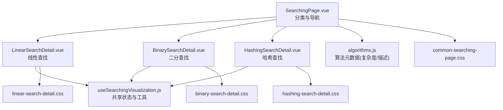
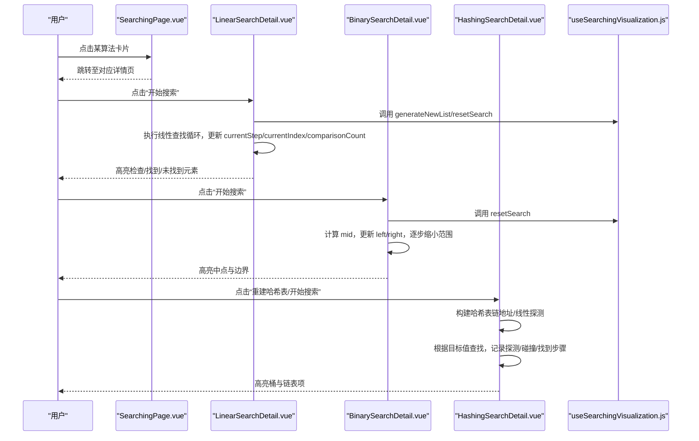
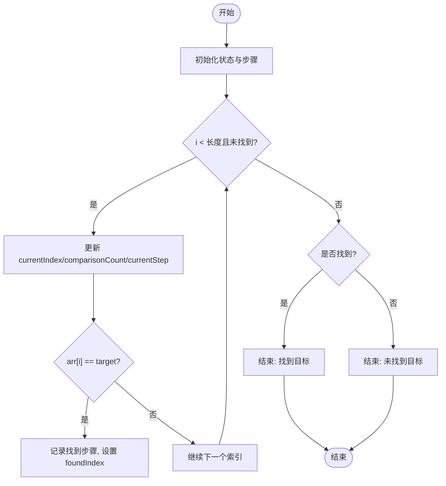
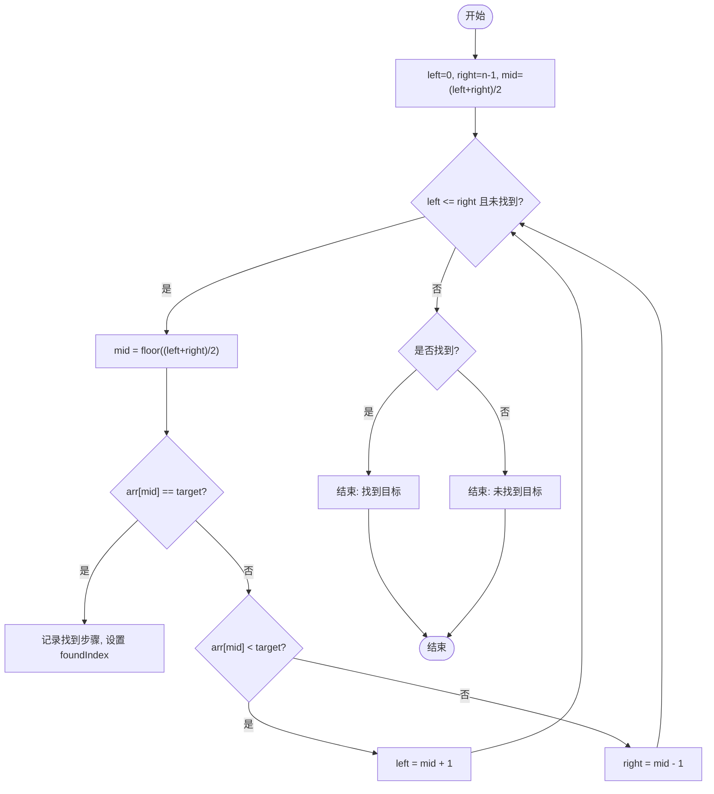
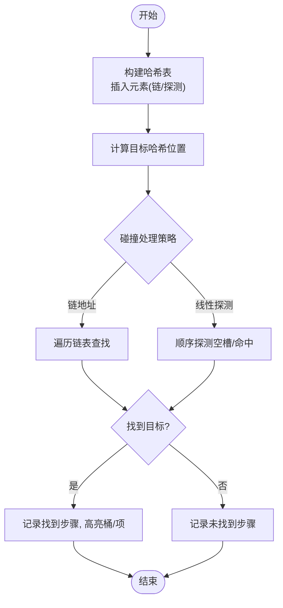
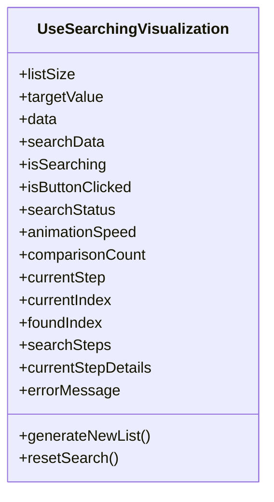
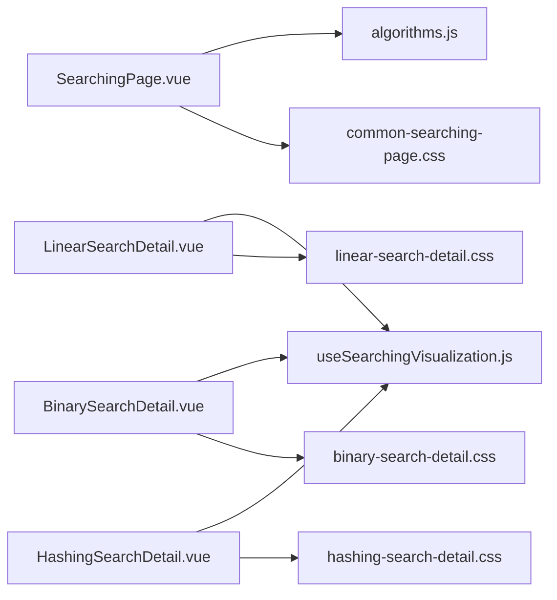

# 搜索算法可视化

<cite>
**本文引用的文件**
- [useSearchingVisualization.js](file://suanfa_vue/src/composables/useSearchingVisualization.js)
- [LinearSearchDetail.vue](file://suanfa_vue/src/components/algorithms/searching_algorithms/LinearSearchDetail.vue)
- [BinarySearchDetail.vue](file://suanfa_vue/src/components/algorithms/searching_algorithms/BinarySearchDetail.vue)
- [HashingSearchDetail.vue](file://suanfa_vue/src/components/algorithms/searching_algorithms/HashingSearchDetail.vue)
- [SearchingPage.vue](file://suanfa_vue/src/components/algorithms/searching_algorithms/SearchingPage.vue)
- [algorithms.js](file://suanfa_vue/src/data/algorithms.js)
- [common-searching-page.css](file://suanfa_vue/src/components/algorithms/searching_algorithms/common-searching-page.css)
- [linear-search-detail.css](file://suanfa_vue/src/components/algorithms/searching_algorithms/linear-search-detail.css)
- [binary-search-detail.css](file://suanfa_vue/src/components/algorithms/searching_algorithms/binary-search-detail.css)
- [hashing-search-detail.css](file://suanfa_vue/src/components/algorithms/searching_algorithms/hashing-search-detail.css)
</cite>

## 目录
1. [简介](#简介)
2. [项目结构](#项目结构)
3. [核心组件](#核心组件)
4. [架构总览](#架构总览)
5. [详细组件分析](#详细组件分析)
6. [依赖关系分析](#依赖关系分析)
7. [性能与复杂度对比](#性能与复杂度对比)
8. [故障排查指南](#故障排查指南)
9. [结论](#结论)
10. [附录](#附录)

## 简介
本仓库实现了一个面向前端的“搜索算法可视化”系统，覆盖线性查找、二分查找、哈希查找等典型搜索算法。通过统一的组合式函数管理搜索状态、动画步骤、结果高亮与错误提示；各算法详情页仅保留算法专属逻辑（如边界指针、哈希表构建与探测），从而降低重复代码、提升可维护性。用户可动态生成数据、设置目标值、控制动画速度，并观察每一步的查找路径与统计指标（比较次数、当前步骤、是否找到）。

## 项目结构
搜索可视化相关的前端代码集中在 suanfa_vue 目录下：
- composables/useSearchingVisualization.js：提供共享的搜索可视化状态与工具方法（列表大小/目标值校验、随机数据生成、重置搜索、动画进度等）
- components/algorithms/searching_algorithms/*：各算法详情页（线性、二分、哈希等）
- data/algorithms.js：算法元数据的单一数据源（包含搜索类算法的复杂度信息）
- CSS：统一页面样式与各算法细节样式

图表来源
- [SearchingPage.vue:1-89](file://suanfa_vue/src/components/algorithms/searching_algorithms/SearchingPage.vue#L1-L89)
- [LinearSearchDetail.vue:1-230](file://suanfa_vue/src/components/algorithms/searching_algorithms/LinearSearchDetail.vue#L1-L230)
- [BinarySearchDetail.vue:1-281](file://suanfa_vue/src/components/algorithms/searching_algorithms/BinarySearchDetail.vue#L1-L281)
- [HashingSearchDetail.vue:1-502](file://suanfa_vue/src/components/algorithms/searching_algorithms/HashingSearchDetail.vue#L1-L502)
- [useSearchingVisualization.js:1-119](file://suanfa_vue/src/composables/useSearchingVisualization.js#L1-L119)
- [algorithms.js:230-362](file://suanfa_vue/src/data/algorithms.js#L230-L362)
- [common-searching-page.css:1-280](file://suanfa_vue/src/components/algorithms/searching_algorithms/common-searching-page.css#L1-L280)
- [linear-search-detail.css:1-173](file://suanfa_vue/src/components/algorithms/searching_algorithms/linear-search-detail.css#L1-L173)
- [binary-search-detail.css:1-147](file://suanfa_vue/src/components/algorithms/searching_algorithms/binary-search-detail.css#L1-L147)
- [hashing-search-detail.css:1-176](file://suanfa_vue/src/components/algorithms/searching_algorithms/hashing-search-detail.css#L1-L176)

章节来源
- [SearchingPage.vue:1-89](file://suanfa_vue/src/components/algorithms/searching_algorithms/SearchingPage.vue#L1-L89)
- [algorithms.js:230-362](file://suanfa_vue/src/data/algorithms.js#L230-L362)

## 核心组件
- useSearchingVisualization：封装了搜索可视化通用能力
  - 输入配置：默认列表大小、范围限制、默认目标值、自定义数据生成器、重置钩子
  - 输出状态：listSize/targetValue、data/searchData、isSearching/isButtonClicked/searchStatus、animationSpeed、comparisonCount/currentStep/currentIndex/foundIndex、searchSteps/currentStepDetails、errorMessage
  - 关键方法：generateNewList（校验+生成+重置）、resetSearch（公共状态清零+复制原始数据）
- LinearSearchDetail：线性查找可视化
  - 使用共享脚手架，实现线性扫描动画、检查/找到/未找到步骤记录、结果高亮
- BinarySearchDetail：二分查找可视化
  - 在共享基础上增加 left/right/mid 指针状态，演示区间收缩过程
- HashingSearchDetail：哈希查找可视化
  - 支持链地址法与线性探测两种碰撞处理策略，展示哈希表构建与查找过程

章节来源
- [useSearchingVisualization.js:1-119](file://suanfa_vue/src/composables/useSearchingVisualization.js#L1-L119)
- [LinearSearchDetail.vue:1-230](file://suanfa_vue/src/components/algorithms/searching_algorithms/LinearSearchDetail.vue#L1-L230)
- [BinarySearchDetail.vue:1-281](file://suanfa_vue/src/components/algorithms/searching_algorithms/BinarySearchDetail.vue#L1-L281)
- [HashingSearchDetail.vue:1-502](file://suanfa_vue/src/components/algorithms/searching_algorithms/HashingSearchDetail.vue#L1-L502)

## 架构总览
整体采用“组合式函数 + 详情组件”的分层设计：
- 组合式函数负责跨组件复用的状态管理与工具方法
- 详情组件专注算法逻辑与UI交互
- 页面入口负责路由与分类筛选
- 样式文件统一视觉风格与交互反馈

图表来源
- [SearchingPage.vue:1-89](file://suanfa_vue/src/components/algorithms/searching_algorithms/SearchingPage.vue#L1-L89)
- [LinearSearchDetail.vue:24-80](file://suanfa_vue/src/components/algorithms/searching_algorithms/LinearSearchDetail.vue#L24-L80)
- [BinarySearchDetail.vue:44-114](file://suanfa_vue/src/components/algorithms/searching_algorithms/BinarySearchDetail.vue#L44-L114)
- [HashingSearchDetail.vue:59-107](file://suanfa_vue/src/components/algorithms/searching_algorithms/HashingSearchDetail.vue#L59-L107)
- [HashingSearchDetail.vue:122-271](file://suanfa_vue/src/components/algorithms/searching_algorithms/HashingSearchDetail.vue#L122-L271)
- [useSearchingVisualization.js:72-108](file://suanfa_vue/src/composables/useSearchingVisualization.js#L72-L108)

## 详细组件分析

### 线性查找（LinearSearchDetail）
- 查找流程
  - 初始化：设置 isSearching、清空统计与步骤历史
  - 逐元素检查：更新 currentIndex、comparisonCount、currentStep，记录“检查”步骤
  - 命中：标记 foundIndex，记录“找到”步骤
  - 结束：若未命中，记录“未找到”步骤，恢复 UI 状态
- 可视化要点
  - 数组元素根据 currentIndex/foundIndex 切换样式（检查/找到/未找到）
  - 步骤历史以 searchSteps 驱动，显示每步详情
- 交互控制
  - 列表大小、目标值、动画速度可调
  - 支持“生成新列表/开始搜索/测试搜索/重置搜索”

图表来源
- [LinearSearchDetail.vue:24-80](file://suanfa_vue/src/components/algorithms/searching_algorithms/LinearSearchDetail.vue#L24-L80)

章节来源
- [LinearSearchDetail.vue:1-230](file://suanfa_vue/src/components/algorithms/searching_algorithms/LinearSearchDetail.vue#L1-L230)
- [linear-search-detail.css:1-173](file://suanfa_vue/src/components/algorithms/searching_algorithms/linear-search-detail.css#L1-L173)

### 二分查找（BinarySearchDetail）
- 查找流程
  - 初始化：left=0, right=n-1, mid=(left+right)/2
  - 循环：比较 arr[mid] 与 target，相等则找到；否则根据大小移动 left 或 right
  - 每次迭代记录“检查/移动边界”步骤，更新 currentMid/left/right
- 可视化要点
  - 高亮中点与左右边界，体现区间收缩
  - 步骤历史清晰展示每次决策
- 数据要求
  - 数据需已排序（通过自定义 generateRandomData 排序保证）

图表来源
- [BinarySearchDetail.vue:44-114](file://suanfa_vue/src/components/algorithms/searching_algorithms/BinarySearchDetail.vue#L44-L114)

章节来源
- [BinarySearchDetail.vue:1-281](file://suanfa_vue/src/components/algorithms/searching_algorithms/BinarySearchDetail.vue#L1-L281)
- [binary-search-detail.css:1-147](file://suanfa_vue/src/components/algorithms/searching_algorithms/binary-search-detail.css#L1-L147)

### 哈希查找（HashingSearchDetail）
- 数据结构与参数
  - 哈希表大小可配置，支持链地址法与线性探测两种碰撞处理
  - 数据生成器确保互不重复（适合哈希场景）
- 构建流程
  - 对每个元素计算 hash(key)，按策略插入到桶中（链或探测）
  - 记录插入步骤（含碰撞标记），逐步动画展示
- 查找流程
  - 计算目标值的哈希位置，按策略探测/遍历链表
  - 记录“查找/探测/碰撞/找到/未找到”步骤，逐步动画展示
- 可视化要点
  - 桶容器高亮当前访问位置，链表项高亮当前检查项
  - 步骤历史区分不同状态类型

图表来源
- [HashingSearchDetail.vue:59-107](file://suanfa_vue/src/components/algorithms/searching_algorithms/HashingSearchDetail.vue#L59-L107)
- [HashingSearchDetail.vue:122-271](file://suanfa_vue/src/components/algorithms/searching_algorithms/HashingSearchDetail.vue#L122-L271)

章节来源
- [HashingSearchDetail.vue:1-502](file://suanfa_vue/src/components/algorithms/searching_algorithms/HashingSearchDetail.vue#L1-L502)
- [hashing-search-detail.css:1-176](file://suanfa_vue/src/components/algorithms/searching_algorithms/hashing-search-detail.css#L1-L176)

### 组合式函数 useSearchingVisualization
- 职责
  - 统一管理列表大小、目标值、数据生成、错误信息、搜索步骤、动画速度、统计指标等
  - 提供 generateNewList 与 resetSearch 两个核心方法，供各算法复用
- 关键点
  - 输入校验：列表大小与目标值范围限制，非法值自动回退
  - 数据生成：默认生成 1-100 随机数，支持自定义生成器（如二分需排序、哈希需去重）
  - 状态重置：公共状态清零并重新复制原始数据，同时触发 onReset 钩子清理算法专属状态
  - 动画控制：animationSpeed 控制每步延迟，searchSteps 记录步骤详情用于UI渲染

图表来源
- [useSearchingVisualization.js:1-119](file://suanfa_vue/src/composables/useSearchingVisualization.js#L1-L119)

章节来源
- [useSearchingVisualization.js:1-119](file://suanfa_vue/src/composables/useSearchingVisualization.js#L1-L119)

## 依赖关系分析
- SearchingPage 依赖 algorithms.js 获取搜索类算法元数据，并渲染分类与卡片
- 各 Detail 组件依赖 useSearchingVisualization 提供的共享状态与方法
- CSS 文件为统一样式与细节样式，增强可视化体验

图表来源
- [SearchingPage.vue:1-89](file://suanfa_vue/src/components/algorithms/searching_algorithms/SearchingPage.vue#L1-L89)
- [algorithms.js:230-362](file://suanfa_vue/src/data/algorithms.js#L230-L362)
- [LinearSearchDetail.vue:1-230](file://suanfa_vue/src/components/algorithms/searching_algorithms/LinearSearchDetail.vue#L1-L230)
- [BinarySearchDetail.vue:1-281](file://suanfa_vue/src/components/algorithms/searching_algorithms/BinarySearchDetail.vue#L1-L281)
- [HashingSearchDetail.vue:1-502](file://suanfa_vue/src/components/algorithms/searching_algorithms/HashingSearchDetail.vue#L1-L502)
- [common-searching-page.css:1-280](file://suanfa_vue/src/components/algorithms/searching_algorithms/common-searching-page.css#L1-L280)
- [linear-search-detail.css:1-173](file://suanfa_vue/src/components/algorithms/searching_algorithms/linear-search-detail.css#L1-L173)
- [binary-search-detail.css:1-147](file://suanfa_vue/src/components/algorithms/searching_algorithms/binary-search-detail.css#L1-L147)
- [hashing-search-detail.css:1-176](file://suanfa_vue/src/components/algorithms/searching_algorithms/hashing-search-detail.css#L1-L176)

章节来源
- [SearchingPage.vue:1-89](file://suanfa_vue/src/components/algorithms/searching_algorithms/SearchingPage.vue#L1-L89)
- [algorithms.js:230-362](file://suanfa_vue/src/data/algorithms.js#L230-L362)

## 性能与复杂度对比
- 线性查找
  - 时间复杂度：最坏 O(n)，最好 O(1)，平均 O(n)
  - 空间复杂度：O(1)
  - 适用数据结构：任意数组/列表（无需有序）
- 二分查找
  - 时间复杂度：最坏 O(log n)，最好 O(1)，平均 O(log n)
  - 空间复杂度：O(1)
  - 适用数据结构：已排序数组
- 哈希查找
  - 时间复杂度：平均 O(1)，最坏 O(n)（严重冲突时）
  - 空间复杂度：O(n)（存储哈希表）
  - 适用数据结构：键值映射场景，支持快速查找

章节来源
- [algorithms.js:230-362](file://suanfa_vue/src/data/algorithms.js#L230-L362)

## 故障排查指南
- 列表大小或目标值无效
  - 现象：生成新列表失败或数值被自动修正
  - 原因：输入非数字或超出范围
  - 处理：useSearchingVisualization 内部进行校验与回退，并在 errorMessage 中提示
- 按钮重复点击导致状态异常
  - 现象：多次点击“开始搜索”可能干扰动画
  - 处理：isSearching 与 isButtonClicked 控制按钮禁用与点击反馈
- 哈希表构建/搜索冲突
  - 现象：线性探测出现长链或频繁碰撞
  - 处理：调整哈希表大小或切换碰撞处理策略，观察步骤历史中的 collision 标记
- 二分查找数据未排序
  - 现象：查找结果不正确
  - 处理：确保 generateRandomData 返回已排序数据（已在二分详情页内置排序）

章节来源
- [useSearchingVisualization.js:72-108](file://suanfa_vue/src/composables/useSearchingVisualization.js#L72-L108)
- [LinearSearchDetail.vue:24-80](file://suanfa_vue/src/components/algorithms/searching_algorithms/LinearSearchDetail.vue#L24-L80)
- [BinarySearchDetail.vue:17-28](file://suanfa_vue/src/components/algorithms/searching_algorithms/BinarySearchDetail.vue#L17-L28)
- [HashingSearchDetail.vue:24-40](file://suanfa_vue/src/components/algorithms/searching_algorithms/HashingSearchDetail.vue#L24-L40)

## 结论
本项目通过组合式函数抽象出搜索可视化的通用能力，使各算法详情页专注于自身逻辑与交互，显著提升了代码复用性与可维护性。线性查找、二分查找、哈希查找分别展示了不同数据结构与策略下的查找过程，配合动画与步骤历史，帮助用户直观理解算法行为与性能差异。未来可扩展更多搜索算法（如插值查找、跳跃查找等），并引入更丰富的统计指标与交互方式。

## 附录
- 用户交互设计
  - 列表大小、目标值、动画速度滑块便于调节实验条件
  - “生成新列表/开始搜索/测试搜索/重置搜索”按钮覆盖常见操作
  - 步骤历史与当前步骤详情帮助追踪查找路径
- 结果高亮与反馈优化
  - 数组元素与哈希桶/链表项通过样式类名高亮（checking/found/not-found/collision）
  - 搜索状态实时更新，错误信息弹窗与文本提示结合
- 错误处理机制
  - 输入校验与范围限制防止非法状态
  - 重置搜索确保状态一致性