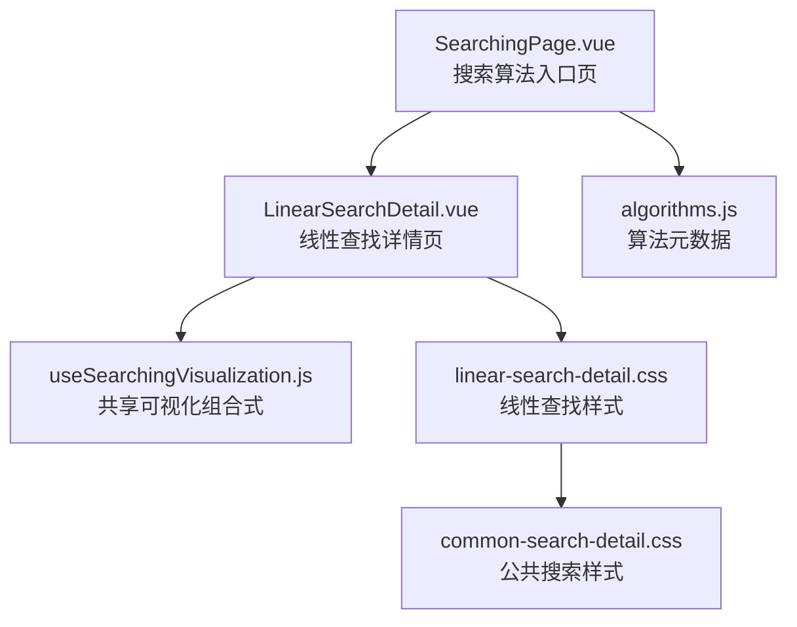
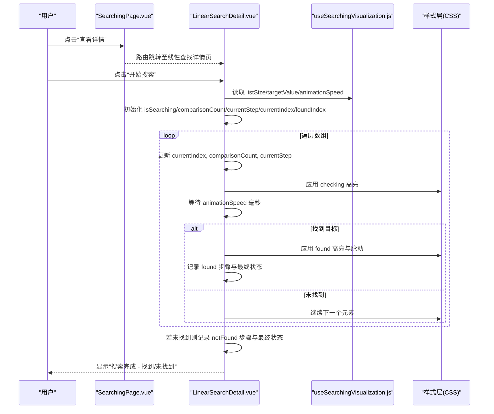
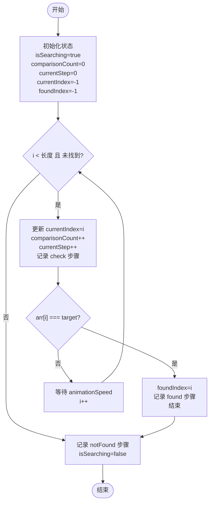
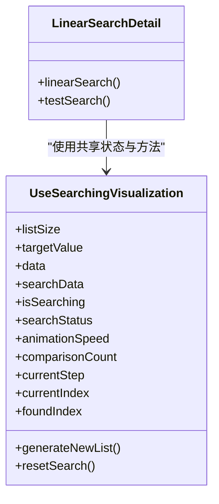
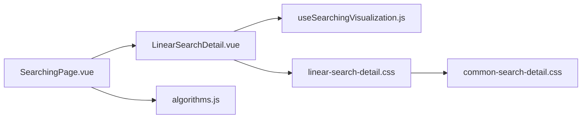

# 线性查找可视化

<cite>
**本文引用的文件**   
- [LinearSearchDetail.vue](file://suanfa_vue/src/components/algorithms/searching_algorithms/LinearSearchDetail.vue)
- [useSearchingVisualization.js](file://suanfa_vue/src/composables/useSearchingVisualization.js)
- [linear-search-detail.css](file://suanfa_vue/src/components/algorithms/searching_algorithms/linear-search-detail.css)
- [common-search-detail.css](file://suanfa_vue/src/components/algorithms/searching_algorithms/common-search-detail.css)
- [SearchingPage.vue](file://suanfa_vue/src/components/algorithms/searching_algorithms/SearchingPage.vue)
- [algorithms.js](file://suanfa_vue/src/data/algorithms.js)
</cite>

## 目录
1. [简介](#简介)
2. [项目结构](#项目结构)
3. [核心组件](#核心组件)
4. [架构总览](#架构总览)
5. [详细组件分析](#详细组件分析)
6. [依赖关系分析](#依赖关系分析)
7. [性能与复杂度](#性能与复杂度)
8. [故障排查指南](#故障排查指南)
9. [结论](#结论)
10. [附录：使用示例](#附录使用示例)

## 简介
本文件面向“线性查找算法可视化”的实现与使用说明，系统阐述从数组首元素开始逐个比较直至找到目标值或遍历完整个数组的查找过程；解释可视化如何展示查找步骤、当前比较位置高亮、查找路径追踪；说明 useSearchingVisualization 组合式函数在状态管理、动画控制、结果反馈中的职责；给出时间复杂度 O(n) 的分析、适用场景与性能特点对比；并提供数据生成、目标值设置、查找速度控制等交互示例。

## 项目结构
线性查找可视化由以下关键部分组成：
- 搜索算法详情页（线性查找）：负责渲染数组、统计信息、控制按钮与步骤历史。
- 共享可视化组合式函数：提供列表大小/目标值校验、随机数据生成、重置搜索、动画速度、统计状态等通用能力。
- 样式文件：定义数组元素高亮、步骤历史、响应式布局等视觉表现。
- 搜索算法入口页：分类筛选并导航到具体算法详情页。
- 算法元数据：集中维护各算法的名称、描述、复杂度等信息。

图表来源
- [SearchingPage.vue:1-89](file://suanfa_vue/src/components/algorithms/searching_algorithms/SearchingPage.vue#L1-L89)
- [LinearSearchDetail.vue:1-230](file://suanfa_vue/src/components/algorithms/searching_algorithms/LinearSearchDetail.vue#L1-L230)
- [useSearchingVisualization.js:1-119](file://suanfa_vue/src/composables/useSearchingVisualization.js#L1-L119)
- [linear-search-detail.css:1-173](file://suanfa_vue/src/components/algorithms/searching_algorithms/linear-search-detail.css#L1-L173)
- [common-search-detail.css:1-370](file://suanfa_vue/src/components/algorithms/searching_algorithms/common-search-detail.css#L1-L370)
- [algorithms.js:231-252](file://suanfa_vue/src/data/algorithms.js#L231-L252)

章节来源
- [SearchingPage.vue:1-89](file://suanfa_vue/src/components/algorithms/searching_algorithms/SearchingPage.vue#L1-L89)
- [LinearSearchDetail.vue:1-230](file://suanfa_vue/src/components/algorithms/searching_algorithms/LinearSearchDetail.vue#L1-L230)
- [useSearchingVisualization.js:1-119](file://suanfa_vue/src/composables/useSearchingVisualization.js#L1-L119)
- [algorithms.js:231-252](file://suanfa_vue/src/data/algorithms.js#L231-L252)

## 核心组件
- LinearSearchDetail.vue：实现线性查找的核心逻辑与界面交互，包括：
  - 调用 useSearchingVisualization 获取共享状态与方法。
  - 实现 linearSearch/testSearch 异步循环，逐步推进 currentIndex、comparisonCount、currentStep，记录 searchSteps 与 currentStepDetails。
  - 通过 CSS 类 checking/found/not-found 对数组元素进行高亮与动画。
- useSearchingVisualization.js：提供可复用的可视化脚手架，包括：
  - 列表大小与目标值的输入校验与范围约束。
  - 随机数据生成与复制为 searchData。
  - generateNewList/resetSearch 统一生命周期管理。
  - isSearching、searchStatus、animationSpeed、comparisonCount、currentStep、currentIndex、foundIndex 等可视化状态。
- 样式文件：
  - linear-search-detail.css：定义数组元素初始色、检查态、找到态、未找到态及脉动动画。
  - common-search-detail.css：统一模态框、标签页、滑块控件、步骤历史、响应式布局等样式。

章节来源
- [LinearSearchDetail.vue:24-80](file://suanfa_vue/src/components/algorithms/searching_algorithms/LinearSearchDetail.vue#L24-L80)
- [LinearSearchDetail.vue:139-223](file://suanfa_vue/src/components/algorithms/searching_algorithms/LinearSearchDetail.vue#L139-L223)
- [useSearchingVisualization.js:19-119](file://suanfa_vue/src/composables/useSearchingVisualization.js#L19-L119)
- [linear-search-detail.css:12-44](file://suanfa_vue/src/components/algorithms/searching_algorithms/linear-search-detail.css#L12-L44)
- [common-search-detail.css:94-197](file://suanfa_vue/src/components/algorithms/searching_algorithms/common-search-detail.css#L94-L197)

## 架构总览
线性查找可视化的运行时交互流程如下：

图表来源
- [LinearSearchDetail.vue:24-80](file://suanfa_vue/src/components/algorithms/searching_algorithms/LinearSearchDetail.vue#L24-L80)
- [LinearSearchDetail.vue:139-223](file://suanfa_vue/src/components/algorithms/searching_algorithms/LinearSearchDetail.vue#L139-L223)
- [useSearchingVisualization.js:59-108](file://suanfa_vue/src/composables/useSearchingVisualization.js#L59-L108)
- [linear-search-detail.css:12-44](file://suanfa_vue/src/components/algorithms/searching_algorithms/linear-search-detail.css#L12-L44)

## 详细组件分析

### 线性查找算法流程与时序
线性查找从索引 0 开始，逐个比较当前元素与目标值：
- 每步更新 currentIndex、comparisonCount、currentStep，并将步骤详情推入 searchSteps。
- 通过 await 延时 animationSpeed 实现可视化步进。
- 若相等则标记 foundIndex，记录 found 步骤并结束；否则继续下一项。
- 遍历结束后若未找到，追加 notFound 步骤并输出最终状态。

图表来源
- [LinearSearchDetail.vue:24-80](file://suanfa_vue/src/components/algorithms/searching_algorithms/LinearSearchDetail.vue#L24-L80)

章节来源
- [LinearSearchDetail.vue:24-80](file://suanfa_vue/src/components/algorithms/searching_algorithms/LinearSearchDetail.vue#L24-L80)

### 可视化状态管理与动画控制
- 状态来源：useSearchingVisualization 暴露 listSize、targetValue、data、searchData、isSearching、searchStatus、animationSpeed、comparisonCount、currentStep、currentIndex、foundIndex、searchSteps、currentStepDetails 等。
- 动画控制：每次比较后 await new Promise(resolve => setTimeout(resolve, animationSpeed.value))，从而以可控速度推进可视化。
- 结果反馈：根据是否找到目标值设置 searchStatus 为“搜索完成 - 找到目标值/未找到目标值”，并在 searchSteps 中追加对应类型步骤。

图表来源
- [useSearchingVisualization.js:19-119](file://suanfa_vue/src/composables/useSearchingVisualization.js#L19-L119)
- [LinearSearchDetail.vue:24-80](file://suanfa_vue/src/components/algorithms/searching_algorithms/LinearSearchDetail.vue#L24-L80)

章节来源
- [useSearchingVisualization.js:19-119](file://suanfa_vue/src/composables/useSearchingVisualization.js#L19-L119)
- [LinearSearchDetail.vue:24-80](file://suanfa_vue/src/components/algorithms/searching_algorithms/LinearSearchDetail.vue#L24-L80)

### 查找路径追踪与高亮机制
- 当前比较位置高亮：通过 CSS 类 .array-element.checking 将当前元素背景变为黄色并放大，配合 transition 平滑过渡。
- 找到目标高亮：.array-element.found 绿色背景并触发脉动动画，强调命中位置。
- 未找到提示：当搜索结束且未找到时，整体数组呈现红色不找到态，便于用户理解结果。
- 步骤历史：searchSteps 按顺序记录每一步的类型（check/found/notFound/info），并在界面中以带编号的条目展示，支持滚动查看。

章节来源
- [linear-search-detail.css:12-44](file://suanfa_vue/src/components/algorithms/searching_algorithms/linear-search-detail.css#L12-L44)
- [LinearSearchDetail.vue:168-223](file://suanfa_vue/src/components/algorithms/searching_algorithms/LinearSearchDetail.vue#L168-L223)
- [common-search-detail.css:251-309](file://suanfa_vue/src/components/algorithms/searching_algorithms/common-search-detail.css#L251-L309)

### 用户交互功能
- 数据生成：点击“生成新列表”会校验 listSize，生成随机数据并重置搜索状态。
- 目标值设置：通过输入框调整 targetValue，受 minTarget/maxTarget 限制。
- 查找速度控制：拖动“动画速度”滑块调整 animationSpeed，影响每次比较的等待时长。
- 开始搜索/测试搜索：分别执行线性查找主流程与测试流程，均会禁用其他按钮防止并发操作。
- 重置搜索：清空所有可视化状态并恢复 searchData 为原始 data 副本。

章节来源
- [LinearSearchDetail.vue:139-223](file://suanfa_vue/src/components/algorithms/searching_algorithms/LinearSearchDetail.vue#L139-L223)
- [useSearchingVisualization.js:72-108](file://suanfa_vue/src/composables/useSearchingVisualization.js#L72-L108)

## 依赖关系分析
- 页面路由与导航：SearchingPage.vue 提供分类筛选与跳转到 /algorithms/searching/linear-search。
- 算法元数据：algorithms.js 中线性查找条目包含名称、描述、复杂度、子分类等，供详情页与卡片展示使用。
- 样式依赖：linear-search-detail.css 引入 common-search-detail.css，确保统一的视觉风格与响应式行为。

图表来源
- [SearchingPage.vue:1-89](file://suanfa_vue/src/components/algorithms/searching_algorithms/SearchingPage.vue#L1-L89)
- [LinearSearchDetail.vue:1-230](file://suanfa_vue/src/components/algorithms/searching_algorithms/LinearSearchDetail.vue#L1-L230)
- [useSearchingVisualization.js:1-119](file://suanfa_vue/src/composables/useSearchingVisualization.js#L1-L119)
- [linear-search-detail.css:1-173](file://suanfa_vue/src/components/algorithms/searching_algorithms/linear-search-detail.css#L1-L173)
- [common-search-detail.css:1-370](file://suanfa_vue/src/components/algorithms/searching_algorithms/common-search-detail.css#L1-L370)
- [algorithms.js:231-252](file://suanfa_vue/src/data/algorithms.js#L231-L252)

章节来源
- [SearchingPage.vue:1-89](file://suanfa_vue/src/components/algorithms/searching_algorithms/SearchingPage.vue#L1-L89)
- [algorithms.js:231-252](file://suanfa_vue/src/data/algorithms.js#L231-L252)

## 性能与复杂度
- 时间复杂度：O(n)。线性查找在最坏情况下需要遍历整个数组，比较次数等于数组长度 n；最好情况为 O(1)，即第一个元素即为目标值。
- 空间复杂度：O(1)。仅使用常数级额外变量（如 currentIndex、comparisonCount、foundIndex）。
- 适用场景：
  - 数据规模较小或无需排序的场景。
  - 数据无序或动态频繁插入/删除导致排序成本较高的场景。
  - 教学演示与初学者理解基础查找思想。
- 性能特点对比：
  - 相较于二分查找 O(log n)，线性查找不需要有序前提，但平均比较次数更高。
  - 相较于哈希查找 O(1) 平均，线性查找无需额外空间与哈希冲突处理，适合内存受限或键分布不可控的场景。
  - 对于小规模数据，线性查找的常数开销更低，实际运行可能优于复杂结构。

章节来源
- [algorithms.js:231-252](file://suanfa_vue/src/data/algorithms.js#L231-L252)
- [LinearSearchDetail.vue:24-80](file://suanfa_vue/src/components/algorithms/searching_algorithms/LinearSearchDetail.vue#L24-L80)

## 故障排查指南
- 列表大小无效：
  - 现象：生成新列表失败并弹出错误提示。
  - 原因：listSize 非数字或超出范围被修正。
  - 处理：useSearchingVisualization 内部已做数值校验与范围钳制，并在异常时设置 errorMessage。
- 搜索过程中按钮不可用：
  - 现象：isSearching 为 true 时按钮 disabled。
  - 原因：防止重复触发导致状态混乱。
  - 处理：等待搜索完成后自动恢复。
- 动画卡顿或过快：
  - 现象：步骤推进不符合预期。
  - 原因：animationSpeed 设置过小或过大。
  - 处理：调整“动画速度”滑块至合适范围（默认 500ms）。
- 未找到目标值时的视觉反馈：
  - 现象：数组整体变红表示未找到。
  - 原因：搜索结束且 foundIndex 仍为 -1。
  - 处理：确认目标值是否在数据范围内，或重新生成数据。

章节来源
- [useSearchingVisualization.js:72-108](file://suanfa_vue/src/composables/useSearchingVisualization.js#L72-L108)
- [LinearSearchDetail.vue:139-223](file://suanfa_vue/src/components/algorithms/searching_algorithms/LinearSearchDetail.vue#L139-L223)
- [linear-search-detail.css:12-44](file://suanfa_vue/src/components/algorithms/searching_algorithms/linear-search-detail.css#L12-L44)

## 结论
线性查找可视化通过清晰的步骤记录、当前位置高亮与结果反馈，帮助用户直观理解“从首元素开始逐个比较”的查找过程。useSearchingVisualization 提供了稳定的状态管理与动画控制能力，使不同搜索算法的可视化实现保持一致性与可复用性。尽管时间复杂度为 O(n)，但在小规模数据与无序场景下具有简单可靠的优势。结合交互式参数调节，学习者可以灵活探索不同数据规模与目标值对查找过程的影响。

## 附录：使用示例
- 生成数据：
  - 在“列表大小”输入框中输入期望的数组长度（例如 10），点击“生成新列表”。
  - 系统将生成 1–100 范围内的随机整数数组，并重置搜索状态。
- 设置目标值：
  - 在“目标值”输入框中输入目标数（例如 42），系统将自动限制在 minTarget–maxTarget 范围内。
- 控制查找速度：
  - 拖动“动画速度”滑块，调整每次比较的等待时间（例如 200ms 快速演示，或 800ms 慢速观察）。
- 开始搜索：
  - 点击“开始搜索”，界面将逐步高亮每个比较位置，并在“当前步骤详情”与“搜索步骤历史”中显示每一步的信息。
  - 若找到目标，对应元素将以绿色脉动显示；若未找到，数组将呈现红色未找到态。
- 测试搜索与重置：
  - “测试搜索”用于快速验证当前数据与目标值的查找过程。
  - “重置搜索”将清空所有状态并恢复原始数据，便于重新配置参数。

章节来源
- [LinearSearchDetail.vue:139-223](file://suanfa_vue/src/components/algorithms/searching_algorithms/LinearSearchDetail.vue#L139-L223)
- [useSearchingVisualization.js:59-108](file://suanfa_vue/src/composables/useSearchingVisualization.js#L59-L108)