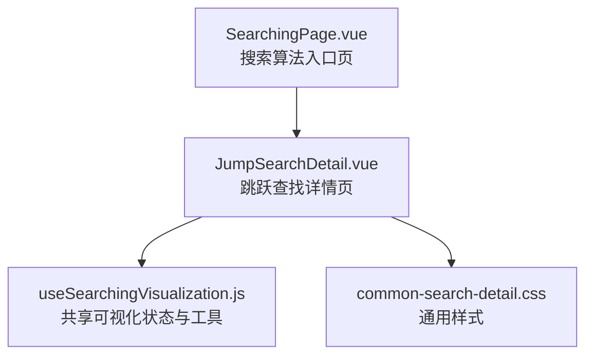
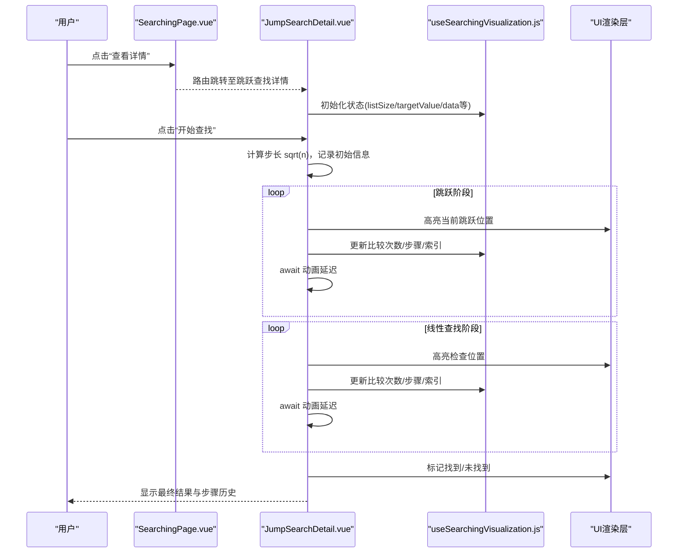
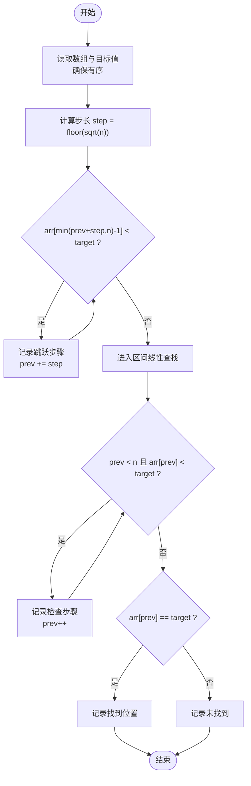
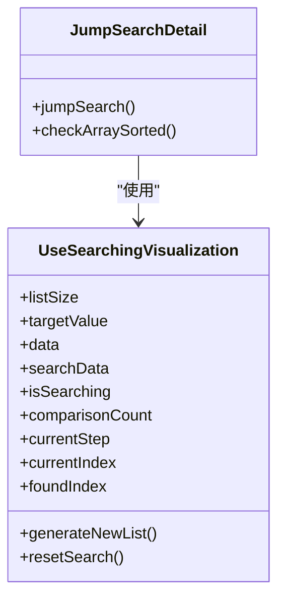
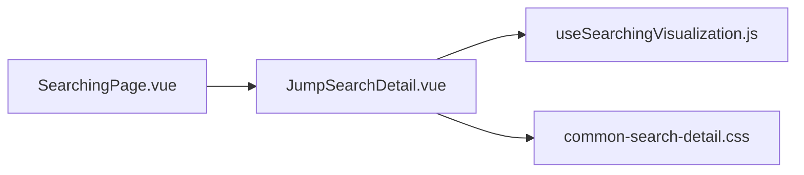

# 跳跃查找可视化

<cite>
**本文引用的文件**
- [JumpSearchDetail.vue](file://suanfa_vue/src/components/algorithms/searching_algorithms/JumpSearchDetail.vue)
- [useSearchingVisualization.js](file://suanfa_vue/src/composables/useSearchingVisualization.js)
- [common-search-detail.css](file://suanfa_vue/src/components/algorithms/searching_algorithms/common-search-detail.css)
- [SearchingPage.vue](file://suanfa_vue/src/components/algorithms/searching_algorithms/SearchingPage.vue)
</cite>

## 目录
1. [简介](#简介)
2. [项目结构](#项目结构)
3. [核心组件](#核心组件)
4. [架构总览](#架构总览)
5. [详细组件分析](#详细组件分析)
6. [依赖关系分析](#依赖关系分析)
7. [性能与复杂度](#性能与复杂度)
8. [故障排查指南](#故障排查指南)
9. [结论](#结论)
10. [附录：参数调优与实践建议](#附录参数调优与实践建议)

## 简介
本文件面向“跳跃查找算法可视化”的实现与使用，目标是帮助读者理解：
- 跳跃查找的核心思想：以固定步长进行跳跃定位区间，再在区间内执行线性查找。
- 可视化如何展示：步长计算、跳跃过程动画、区间内线性查找过程。
- 组合式函数 useSearchingVisualization 的状态管理职责：列表大小与目标值校验、数据生成、重置搜索、统计状态等。
- 时间复杂度 O(√n) 的来源、最优步长选择、与二分查找的性能权衡。
- 步长参数调优、查找效率分析与适用场景选择的实用指导。

## 项目结构
该可视化位于前端 Vue 项目中，属于“搜索算法”模块下的详情页组件，配合共享的组合式函数提供统一的可视化脚手架。

图表来源
- [SearchingPage.vue:1-89](file://suanfa_vue/src/components/algorithms/searching_algorithms/SearchingPage.vue#L1-L89)
- [JumpSearchDetail.vue:1-498](file://suanfa_vue/src/components/algorithms/searching_algorithms/JumpSearchDetail.vue#L1-L498)
- [useSearchingVisualization.js:1-119](file://suanfa_vue/src/composables/useSearchingVisualization.js#L1-L119)
- [common-search-detail.css:1-370](file://suanfa_vue/src/components/algorithms/searching_algorithms/common-search-detail.css#L1-L370)

章节来源
- [SearchingPage.vue:1-89](file://suanfa_vue/src/components/algorithms/searching_algorithms/SearchingPage.vue#L1-L89)
- [JumpSearchDetail.vue:1-498](file://suanfa_vue/src/components/algorithms/searching_algorithms/JumpSearchDetail.vue#L1-L498)
- [useSearchingVisualization.js:1-119](file://suanfa_vue/src/composables/useSearchingVisualization.js#L1-L119)
- [common-search-detail.css:1-370](file://suanfa_vue/src/components/algorithms/searching_algorithms/common-search-detail.css#L1-L370)

## 核心组件
- JumpSearchDetail.vue：实现跳跃查找的可视化逻辑与界面交互，包括数组生成、步长计算、跳跃与线性查找的动画步骤记录、结果展示。
- useSearchingVisualization.js：提供跨搜索算法复用的可视化状态与工具方法（列表大小/目标值控制、随机数据生成、重置搜索、统计指标等）。
- common-search-detail.css：统一模态框、标签页、数组元素、步骤历史等样式。
- SearchingPage.vue：搜索算法分类入口，点击卡片进入具体算法详情页（包含跳跃查找）。

章节来源
- [JumpSearchDetail.vue:1-498](file://suanfa_vue/src/components/algorithms/searching_algorithms/JumpSearchDetail.vue#L1-L498)
- [useSearchingVisualization.js:1-119](file://suanfa_vue/src/composables/useSearchingVisualization.js#L1-L119)
- [common-search-detail.css:1-370](file://suanfa_vue/src/components/algorithms/searching_algorithms/common-search-detail.css#L1-L370)
- [SearchingPage.vue:1-89](file://suanfa_vue/src/components/algorithms/searching_algorithms/SearchingPage.vue#L1-L89)

## 架构总览
下图展示了从页面入口到具体可视化实现的调用关系与数据流。

图表来源
- [SearchingPage.vue:11-14](file://suanfa_vue/src/components/algorithms/searching_algorithms/SearchingPage.vue#L11-L14)
- [JumpSearchDetail.vue:42-135](file://suanfa_vue/src/components/algorithms/searching_algorithms/JumpSearchDetail.vue#L42-L135)
- [useSearchingVisualization.js:72-108](file://suanfa_vue/src/composables/useSearchingVisualization.js#L72-L108)

## 详细组件分析

### 跳跃查找算法流程与可视化
- 输入：递增有序数组（若未排序则自动排序并记录步骤）、目标值。
- 步长计算：step = floor(sqrt(n))，其中 n 为数组长度。
- 跳跃阶段：从 prev=0 开始，每次比较 arr[min(prev+step, n)-1] 与目标值，若小于目标值则继续跳跃；否则停止跳跃。
- 线性查找阶段：在 [prev, min(prev+step, n)) 区间内进行线性扫描，直到找到目标或到达区间边界。
- 结果：记录找到或未找到，并输出最终索引与步骤历史。

图表来源
- [JumpSearchDetail.vue:57-135](file://suanfa_vue/src/components/algorithms/searching_algorithms/JumpSearchDetail.vue#L57-L135)

章节来源
- [JumpSearchDetail.vue:57-135](file://suanfa_vue/src/components/algorithms/searching_algorithms/JumpSearchDetail.vue#L57-L135)

### 可视化状态管理与交互
- 列表大小与目标值：由 useSearchingVisualization 提供双向绑定与范围校验，保证输入合法。
- 数据生成：支持自定义生成器，跳跃查找要求递增有序，组件中通过自定义生成器保证数据有序。
- 重置搜索：清空统计、步骤、索引等状态，并重新复制原始数据；同时允许注入 onReset 钩子清理算法专属状态。
- 动画与步骤：通过 animationSpeed 控制每步延迟；searchSteps 记录每一步的类型与详情；currentStep/currentIndex/foundIndex 驱动 UI 高亮。

图表来源
- [useSearchingVisualization.js:19-119](file://suanfa_vue/src/composables/useSearchingVisualization.js#L19-L119)
- [JumpSearchDetail.vue:8-35](file://suanfa_vue/src/components/algorithms/searching_algorithms/JumpSearchDetail.vue#L8-L35)

章节来源
- [useSearchingVisualization.js:19-119](file://suanfa_vue/src/composables/useSearchingVisualization.js#L19-L119)
- [JumpSearchDetail.vue:8-35](file://suanfa_vue/src/components/algorithms/searching_algorithms/JumpSearchDetail.vue#L8-L35)

### 界面与样式
- 数组元素高亮：根据当前步骤类型（跳跃/检查/找到/未找到）应用不同样式类。
- 滑块与按钮：用于调整列表大小、目标值、动画速度，以及触发生成新列表、开始查找、重置查找。
- 步骤历史：按顺序展示每一步的详细信息，便于教学与复盘。

章节来源
- [JumpSearchDetail.vue:166-258](file://suanfa_vue/src/components/algorithms/searching_algorithms/JumpSearchDetail.vue#L166-L258)
- [common-search-detail.css:94-196](file://suanfa_vue/src/components/algorithms/searching_algorithms/common-search-detail.css#L94-L196)

## 依赖关系分析
- JumpSearchDetail.vue 依赖 useSearchingVisualization.js 提供的状态与工具方法。
- JumpSearchDetail.vue 引入 common-search-detail.css 统一样式。
- SearchingPage.vue 作为导航入口，将用户引导至 JumpSearchDetail.vue。

图表来源
- [SearchingPage.vue:11-14](file://suanfa_vue/src/components/algorithms/searching_algorithms/SearchingPage.vue#L11-L14)
- [JumpSearchDetail.vue:1-4](file://suanfa_vue/src/components/algorithms/searching_algorithms/JumpSearchDetail.vue#L1-L4)
- [useSearchingVisualization.js:1-6](file://suanfa_vue/src/composables/useSearchingVisualization.js#L1-L6)
- [common-search-detail.css:1-3](file://suanfa_vue/src/components/algorithms/searching_algorithms/common-search-detail.css#L1-L3)

章节来源
- [SearchingPage.vue:11-14](file://suanfa_vue/src/components/algorithms/searching_algorithms/SearchingPage.vue#L11-L14)
- [JumpSearchDetail.vue:1-4](file://suanfa_vue/src/components/algorithms/searching_algorithms/JumpSearchDetail.vue#L1-L4)
- [useSearchingVisualization.js:1-6](file://suanfa_vue/src/composables/useSearchingVisualization.js#L1-L6)
- [common-search-detail.css:1-3](file://suanfa_vue/src/components/algorithms/searching_algorithms/common-search-detail.css#L1-L3)

## 性能与复杂度
- 时间复杂度：O(√n)。跳跃阶段最多约 √n 次比较，线性阶段最多约 √n 次比较，合计 O(√n)。
- 空间复杂度：O(1) 额外空间（不计输入与可视化状态）。
- 最优步长：理论上步长为 √n 时最均衡地平衡跳跃与线性阶段的比较次数。
- 与二分查找对比：
  - 二分查找时间复杂度 O(log n)，通常更快；但需要随机访问能力。
  - 跳跃查找适用于链表等不支持高效随机访问的结构，或在某些硬件/缓存特性下可能更友好。
  - 实际工程中，若数据结构支持随机访问，优先选择二分查找；若需兼顾简单性与可迁移性，可选择跳跃查找。

章节来源
- [JumpSearchDetail.vue:64-135](file://suanfa_vue/src/components/algorithms/searching_algorithms/JumpSearchDetail.vue#L64-L135)

## 故障排查指南
- 正在搜索中无法再次启动：组件会阻止重复点击，避免状态冲突。等待完成或重置后再试。
- 数组无序导致结果异常：组件会在开始时检测并自动排序，同时记录步骤说明。
- 输入非法：列表大小与目标值超出范围会被自动修正；无效输入会提示错误信息。
- 动画卡顿：可通过动画速度滑块降低频率，提升流畅度。

章节来源
- [JumpSearchDetail.vue:42-55](file://suanfa_vue/src/components/algorithms/searching_algorithms/JumpSearchDetail.vue#L42-L55)
- [JumpSearchDetail.vue:57-62](file://suanfa_vue/src/components/algorithms/searching_algorithms/JumpSearchDetail.vue#L57-L62)
- [useSearchingVisualization.js:36-52](file://suanfa_vue/src/composables/useSearchingVisualization.js#L36-L52)
- [useSearchingVisualization.js:72-92](file://suanfa_vue/src/composables/useSearchingVisualization.js#L72-L92)

## 结论
该可视化实现清晰展示了跳跃查找的核心思想与执行过程：通过固定步长快速缩小搜索区间，再在区间内线性查找。借助 useSearchingVisualization 提供的统一状态管理，组件专注于算法逻辑与动画呈现，具备良好的复用性与可维护性。对于教学与演示场景，该实现能有效帮助学习者理解 O(√n) 的时间复杂度来源与步长选择策略，并与二分查找形成直观对比。

## 附录：参数调优与实践建议
- 步长参数调优：
  - 默认采用 sqrt(n) 作为步长，已接近理论最优。一般无需手动调整。
  - 若需实验不同步长的影响，可在本地修改步长公式并观察比较次数变化。
- 查找效率分析：
  - 关注“比较次数”与“步骤历史”，评估不同数据规模与目标值分布对效率的影响。
  - 通过增大/减小列表大小与动画速度，观察性能与可视化的平衡。
- 适用场景选择：
  - 链表或受限随机访问结构：优先考虑跳跃查找。
  - 数组或支持随机访问结构：优先选择二分查找以获得更优的对数级性能。
  - 教学演示：跳跃查找有助于直观理解“分块+线性”的思想，适合入门讲解。