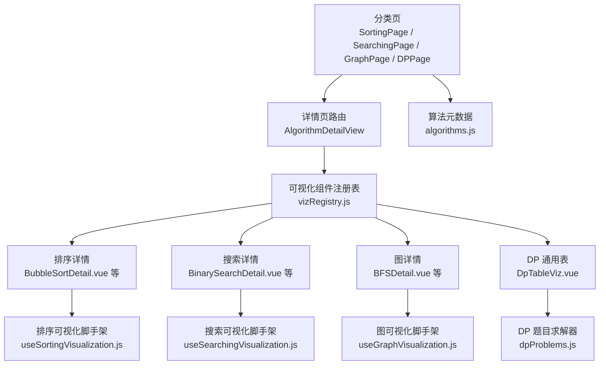
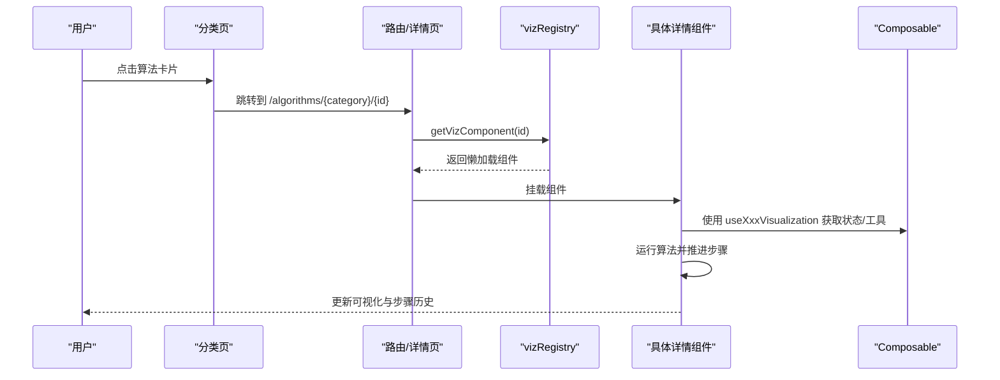
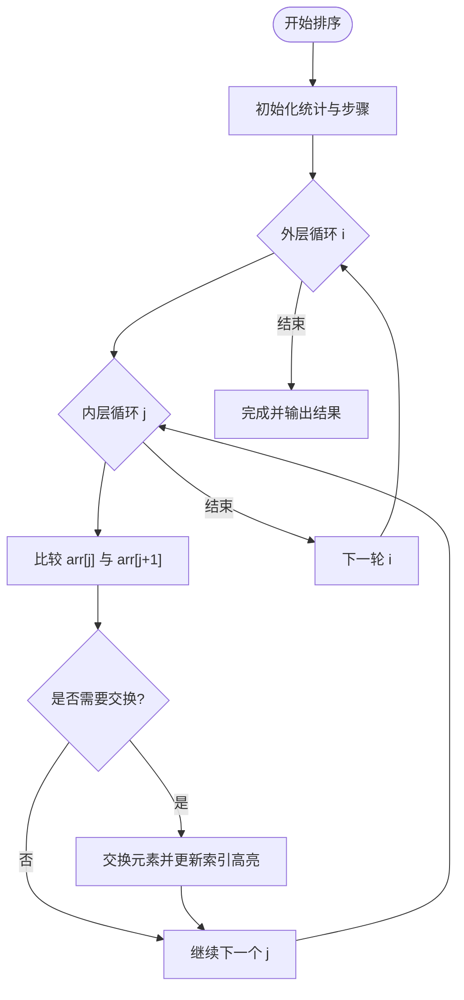
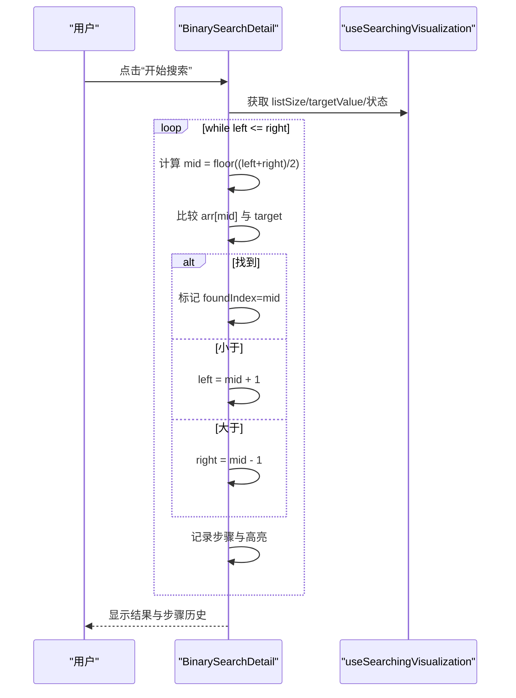
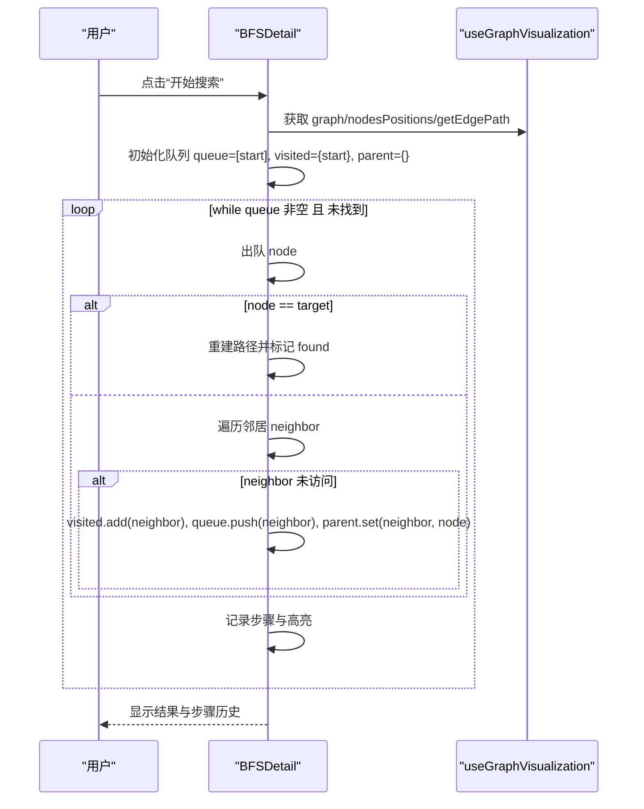
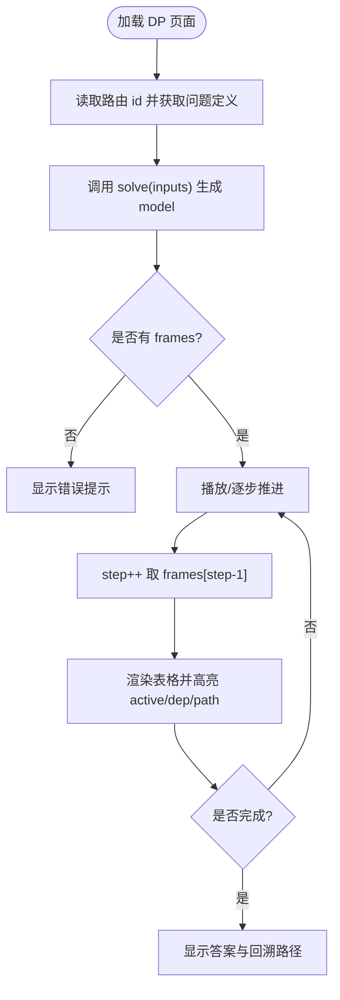
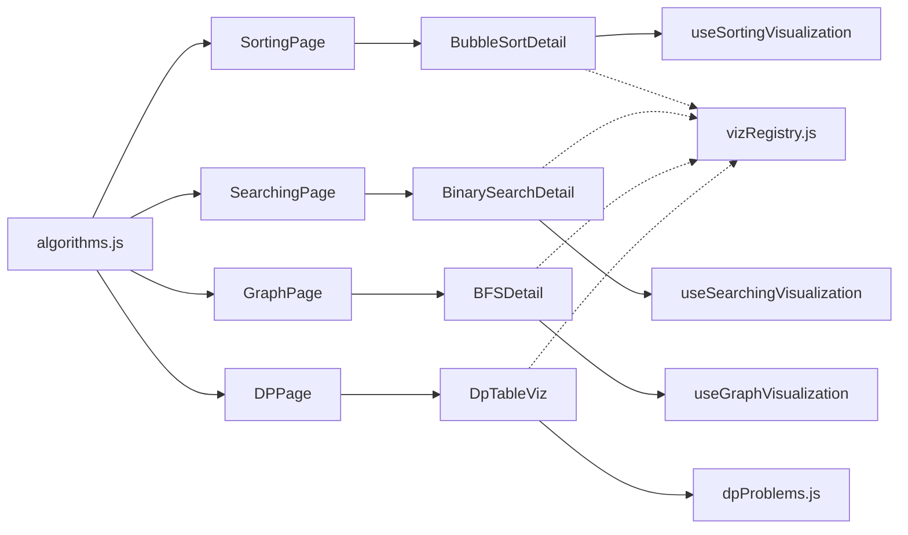

# 算法可视化组件

<cite>
**本文引用的文件**
- [SortingPage.vue](file://suanfa_vue/src/components/algorithms/sorting_algorithms/SortingPage.vue)
- [SearchingPage.vue](file://suanfa_vue/src/components/algorithms/searching_algorithms/SearchingPage.vue)
- [GraphPage.vue](file://suanfa_vue/src/components/algorithms/graph_algorithms/GraphPage.vue)
- [DPPage.vue](file://suanfa_vue/src/components/algorithms/dp_algorithms/DPPage.vue)
- [BubbleSortDetail.vue](file://suanfa_vue/src/components/algorithms/sorting_algorithms/BubbleSortDetail.vue)
- [BinarySearchDetail.vue](file://suanfa_vue/src/components/algorithms/searching_algorithms/BinarySearchDetail.vue)
- [BFSDetail.vue](file://suanfa_vue/src/components/algorithms/graph_algorithms/BFSDetail.vue)
- [DpTableViz.vue](file://suanfa_vue/src/components/algorithms/dp_algorithms/DpTableViz.vue)
- [useSortingVisualization.js](file://suanfa_vue/src/composables/useSortingVisualization.js)
- [useSearchingVisualization.js](file://suanfa_vue/src/composables/useSearchingVisualization.js)
- [useGraphVisualization.js](file://suanfa_vue/src/composables/useGraphVisualization.js)
- [algorithms.js](file://suanfa_vue/src/data/algorithms.js)
- [dpProblems.js](file://suanfa_vue/src/data/dpProblems.js)
- [vizRegistry.js](file://suanfa_vue/src/components/algorithms/vizRegistry.js)
</cite>

## 目录
1. [简介](#简介)
2. [项目结构](#项目结构)
3. [核心组件](#核心组件)
4. [架构总览](#架构总览)
5. [详细组件分析](#详细组件分析)
6. [依赖关系分析](#依赖关系分析)
7. [性能与优化](#性能与优化)
8. [故障排查](#故障排查)
9. [结论](#结论)
10. [附录：配置、样式与扩展指南](#附录：配置样式与扩展指南)

## 简介
本项目提供一套面向教学与学习的算法可视化系统，覆盖排序、搜索、图算法与动态规划四大类。前端基于 Vue 3 组合式 API，通过“页面分类 + 详情页”的导航组织，配合可复用的可视化 Composable（useSortingVisualization、useSearchingVisualization、useGraphVisualization）以及统一的 DP 表格渲染器 DpTableViz，实现：
- 动画化展示算法执行过程（比较、交换、边界移动、节点访问、填表等）
- 用户交互控制（生成数据、调整速度、重置、播放/暂停、逐步前进）
- 统一的数据绑定与状态管理（步骤历史、当前步骤详情、统计计数）
- 响应式布局与主题样式（CSS 变量、网格布局、SVG 图形）
- 可扩展的注册机制（按算法 id 懒加载对应可视化组件）

## 项目结构
- 分类页：SortingPage、SearchingPage、GraphPage、DPPage 负责展示算法卡片与分类筛选，点击后跳转到对应详情页路由。
- 详情页：每个算法一个 Detail 组件，封装具体算法逻辑与可视化 UI。
- 共享 Composable：抽取排序、搜索、图三类可视化通用能力（数据校验、随机生成、状态重置、动画节奏）。
- 数据源：algorithms.js 提供所有算法元数据；dpProblems.js 提供 DP 题目的求解器与帧序列。
- 注册表：vizRegistry.js 将算法 id 映射到懒加载组件，供详情页按需挂载。

图表来源
- [SortingPage.vue:1-97](file://suanfa_vue/src/components/algorithms/sorting_algorithms/SortingPage.vue#L1-L97)
- [SearchingPage.vue:1-89](file://suanfa_vue/src/components/algorithms/searching_algorithms/SearchingPage.vue#L1-L89)
- [GraphPage.vue:1-92](file://suanfa_vue/src/components/algorithms/graph_algorithms/GraphPage.vue#L1-L92)
- [DPPage.vue:1-80](file://suanfa_vue/src/components/algorithms/dp_algorithms/DPPage.vue#L1-L80)
- [vizRegistry.js:1-62](file://suanfa_vue/src/components/algorithms/vizRegistry.js#L1-L62)
- [algorithms.js:777-800](file://suanfa_vue/src/data/algorithms.js#L777-L800)

章节来源
- [SortingPage.vue:1-97](file://suanfa_vue/src/components/algorithms/sorting_algorithms/SortingPage.vue#L1-L97)
- [SearchingPage.vue:1-89](file://suanfa_vue/src/components/algorithms/searching_algorithms/SearchingPage.vue#L1-L89)
- [GraphPage.vue:1-92](file://suanfa_vue/src/components/algorithms/graph_algorithms/GraphPage.vue#L1-L92)
- [DPPage.vue:1-80](file://suanfa_vue/src/components/algorithms/dp_algorithms/DPPage.vue#L1-L80)
- [vizRegistry.js:1-62](file://suanfa_vue/src/components/algorithms/vizRegistry.js#L1-L62)
- [algorithms.js:777-800](file://suanfa_vue/src/data/algorithms.js#L777-L800)

## 核心组件
- 分类页（SortingPage、SearchingPage、GraphPage、DPPage）
  - 功能：展示算法卡片、分类标签筛选、跳转详情页。
  - 数据：从 algorithms.js 派生排序/搜索/图/DP 列表。
  - 交互：点击卡片或“查看详情”按钮触发路由跳转。
- 详情页（以 BubbleSortDetail、BinarySearchDetail、BFSDetail 为代表）
  - 功能：实现具体算法流程，驱动可视化动画，维护步骤历史与统计。
  - 复用：通过 Composable 提供公共状态与工具方法。
- DP 通用表（DpTableViz）
  - 功能：根据 dpProblems.js 中 solve() 返回的 frames 序列，逐步渲染 DP 表、高亮依赖与回溯路径。
  - 交互：播放/暂停、上一步/下一步、随机数据、速度调节。

章节来源
- [BubbleSortDetail.vue:1-243](file://suanfa_vue/src/components/algorithms/sorting_algorithms/BubbleSortDetail.vue#L1-L243)
- [BinarySearchDetail.vue:1-281](file://suanfa_vue/src/components/algorithms/searching_algorithms/BinarySearchDetail.vue#L1-L281)
- [BFSDetail.vue:1-388](file://suanfa_vue/src/components/algorithms/graph_algorithms/BFSDetail.vue#L1-L388)
- [DpTableViz.vue:1-428](file://suanfa_vue/src/components/algorithms/dp_algorithms/DpTableViz.vue#L1-L428)

## 架构总览
本系统采用“数据源 + 页面 + 详情页 + 共享 Composable + 注册表”的分层架构：
- 数据源层：algorithms.js 提供算法元数据；dpProblems.js 提供 DP 求解器与帧序列。
- 页面层：分类页负责导航与筛选。
- 详情页层：各算法的具体可视化实现。
- 共享层：Composable 抽象出排序/搜索/图的通用可视化能力。
- 路由与注册：vizRegistry.js 将算法 id 映射到懒加载组件，支持按需加载与缓存。

图表来源
- [vizRegistry.js:1-62](file://suanfa_vue/src/components/algorithms/vizRegistry.js#L1-L62)
- [useSortingVisualization.js:1-111](file://suanfa_vue/src/composables/useSortingVisualization.js#L1-L111)
- [useSearchingVisualization.js:1-119](file://suanfa_vue/src/composables/useSearchingVisualization.js#L1-L119)
- [useGraphVisualization.js:1-148](file://suanfa_vue/src/composables/useGraphVisualization.js#L1-L148)

## 详细组件分析

### 排序算法可视化（以冒泡排序为例）
- 数据流
  - 列表大小由 listSize 控制，范围受 minSize/maxSize 限制。
  - generateRandomData 生成初始数组，sortedData 用于可视化渲染。
  - 每次比较/交换会更新 comparedIndices/swappedIndices 以高亮当前操作元素。
- 动画与交互
  - 通过 animationSpeed 控制每步延时，await Promise 实现步进动画。
  - 支持“开始排序/测试排序/生成新列表/重置排序”，在 isSorting 状态下禁用危险操作。
- 状态管理
  - comparisonCount、swapCount、currentStep、sortingSteps、currentStepDetails 记录统计与步骤历史。
  - resetSort 使用 Fisher-Yates 打乱数据并清零公共状态。
- 复杂度与性能
  - 冒泡排序 O(n^2)，适合小数组演示；大数据量时建议降低 listSize 或提高动画速度。

图表来源
- [BubbleSortDetail.vue:24-91](file://suanfa_vue/src/components/algorithms/sorting_algorithms/BubbleSortDetail.vue#L24-L91)
- [useSortingVisualization.js:16-111](file://suanfa_vue/src/composables/useSortingVisualization.js#L16-L111)

章节来源
- [BubbleSortDetail.vue:1-243](file://suanfa_vue/src/components/algorithms/sorting_algorithms/BubbleSortDetail.vue#L1-L243)
- [useSortingVisualization.js:1-111](file://suanfa_vue/src/composables/useSortingVisualization.js#L1-L111)

### 搜索算法可视化（以二分查找为例）
- 数据流
  - 列表需有序，generateRandomData 默认生成 1-100 随机数并排序。
  - targetValue 控制目标值，left/right/mid 表示当前搜索区间与中点。
- 动画与交互
  - 每一步检查中点，若找到则标记 foundIndex；否则根据比较结果移动 left 或 right。
  - 通过 animationSpeed 控制每步延时，searchSteps 记录步骤历史。
- 状态管理
  - currentLeft/currentRight/currentMid 用于高亮边界与中点。
  - onReset 钩子用于重置算法专属状态（如 mid 初始化）。
- 复杂度与性能
  - 二分查找 O(log n)，适合演示分治思想；大数据量下仍保持良好性能。

图表来源
- [BinarySearchDetail.vue:44-114](file://suanfa_vue/src/components/algorithms/searching_algorithms/BinarySearchDetail.vue#L44-L114)
- [useSearchingVisualization.js:19-119](file://suanfa_vue/src/composables/useSearchingVisualization.js#L19-L119)

章节来源
- [BinarySearchDetail.vue:1-281](file://suanfa_vue/src/components/algorithms/searching_algorithms/BinarySearchDetail.vue#L1-L281)
- [useSearchingVisualization.js:1-119](file://suanfa_vue/src/composables/useSearchingVisualization.js#L1-L119)

### 图算法可视化（以 BFS 为例）
- 数据流
  - 使用 useGraphVisualization 生成图结构与节点位置（环形布局），getEdgePath 计算边与箭头路径。
  - BFS 使用队列与 visited 集合，parent Map 记录路径以便重建。
- 动画与交互
  - 每步出队节点、访问邻居、入队未访问节点，记录步骤并高亮 visitedNodes 与 path。
  - 支持选择起始节点与目标节点，动画速度可调。
- 状态管理
  - searchStatus、currentStep、searchSteps、currentStepDetails 记录状态与历史。
  - onReset 钩子用于重置 visitedNodes/path/found。
- 复杂度与性能
  - BFS O(V+E)，适合演示层次遍历；大图时建议减少节点数量或提高动画速度。

图表来源
- [BFSDetail.vue:103-211](file://suanfa_vue/src/components/algorithms/graph_algorithms/BFSDetail.vue#L103-L211)
- [useGraphVisualization.js:16-148](file://suanfa_vue/src/composables/useGraphVisualization.js#L16-L148)

章节来源
- [BFSDetail.vue:1-388](file://suanfa_vue/src/components/algorithms/graph_algorithms/BFSDetail.vue#L1-L388)
- [useGraphVisualization.js:1-148](file://suanfa_vue/src/composables/useGraphVisualization.js#L1-L148)

### 动态规划可视化（通用 DP 表）
- 数据流
  - DpTableViz 通过 route.params.id 获取问题定义，调用 getDpProblem().solve(inputs) 生成 model（包含 rowLabels/colLabels/corner/frames/path/answer）。
  - frames 序列描述每一格如何被填入，kind 区分 init/compute/skip/match/answer。
- 动画与交互
  - 播放/暂停、上一步/下一步、回到开头、随机数据、速度调节。
  - 已填单元格通过 cells Map 维护，依赖格子通过 depends 高亮，最终路径高亮 path。
- 状态管理
  - step、speed、playing 控制播放状态；watch 监听 speed/model 变化以自动重播或重置。
- 复杂度与性能
  - 渲染复杂度取决于 frames 长度与表格尺寸；大数据量时建议减小输入规模或提高速度。

图表来源
- [DpTableViz.vue:12-197](file://suanfa_vue/src/components/algorithms/dp_algorithms/DpTableViz.vue#L12-L197)
- [dpProblems.js:1-200](file://suanfa_vue/src/data/dpProblems.js#L1-L200)

章节来源
- [DpTableViz.vue:1-428](file://suanfa_vue/src/components/algorithms/dp_algorithms/DpTableViz.vue#L1-L428)
- [dpProblems.js:1-200](file://suanfa_vue/src/data/dpProblems.js#L1-L200)

## 依赖关系分析
- 分类页依赖 algorithms.js 提供的排序/搜索/图/DP 列表与分类信息。
- 详情页依赖对应 Composable 提供的状态与工具方法。
- DP 页面依赖 dpProblems.js 中的求解器与帧序列。
- 详情页通过 vizRegistry.js 懒加载，避免首屏体积过大。

图表来源
- [algorithms.js:777-800](file://suanfa_vue/src/data/algorithms.js#L777-L800)
- [vizRegistry.js:1-62](file://suanfa_vue/src/components/algorithms/vizRegistry.js#L1-L62)
- [useSortingVisualization.js:1-111](file://suanfa_vue/src/composables/useSortingVisualization.js#L1-L111)
- [useSearchingVisualization.js:1-119](file://suanfa_vue/src/composables/useSearchingVisualization.js#L1-L119)
- [useGraphVisualization.js:1-148](file://suanfa_vue/src/composables/useGraphVisualization.js#L1-L148)
- [dpProblems.js:1-200](file://suanfa_vue/src/data/dpProblems.js#L1-L200)

章节来源
- [algorithms.js:777-800](file://suanfa_vue/src/data/algorithms.js#L777-L800)
- [vizRegistry.js:1-62](file://suanfa_vue/src/components/algorithms/vizRegistry.js#L1-L62)

## 性能与优化
- 动画节奏控制
  - 通过 animationSpeed 控制每步延时，避免阻塞主线程；大数据量时建议提高速度或减少数据规模。
- 数据规模限制
  - 列表大小/节点数量有上下限（minSize/maxSize），防止过度渲染导致卡顿。
- 懒加载与缓存
  - vizRegistry.js 使用 defineAsyncComponent 与 Map 缓存，减少首屏体积并提升后续加载速度。
- 渲染优化
  - DP 表使用 Grid 布局与 computed 属性（cells、depKeys、pathKeys）减少重复计算。
  - 图算法使用 SVG 绘制边与箭头，避免 DOM 节点过多。
- 内存管理
  - 步骤历史（sortingSteps/searchSteps）仅在需要时保留，必要时可限制长度以避免内存增长。

[本节为通用指导，不直接分析具体文件]

## 故障排查
- 生成新列表失败
  - 现象：errorMessage 显示“列表大小必须是数字类型”。
  - 原因：listSize 非数字或越界。
  - 处理：确保输入为数字并在 minSize/maxSize 范围内。
  - 参考：[useSortingVisualization.js:58-77](file://suanfa_vue/src/composables/useSortingVisualization.js#L58-L77)、[useSearchingVisualization.js:73-92](file://suanfa_vue/src/composables/useSearchingVisualization.js#L73-L92)
- 生成新图失败
  - 现象：errorMessage 显示“节点数量必须是数字类型”。
  - 原因：numNodes 非数字或越界。
  - 处理：确保输入为数字并在 minSize/maxSize 范围内。
  - 参考：[useGraphVisualization.js:105-125](file://suanfa_vue/src/composables/useGraphVisualization.js#L105-L125)
- DP 页面无模型
  - 现象：显示“未找到该算法的可视化配置”或“这道题还没有可视化数据”。
  - 原因：route.params.id 未在 dpProblems.js 中定义或 solve 抛出异常。
  - 处理：检查路由 id 与 dpProblems.js 中的问题定义。
  - 参考：[DpTableViz.vue:34-88](file://suanfa_vue/src/components/algorithms/dp_algorithms/DpTableViz.vue#L34-L88)
- 搜索/排序状态未重置
  - 现象：isSearching 始终为 true，按钮不可用。
  - 原因：算法未完成或异常中断。
  - 处理：调用 resetSearch/resetSort 或使用“重置”按钮。
  - 参考：[useSearchingVisualization.js:95-108](file://suanfa_vue/src/composables/useSearchingVisualization.js#L95-L108)、[useSortingVisualization.js:80-101](file://suanfa_vue/src/composables/useSortingVisualization.js#L80-L101)

章节来源
- [useSortingVisualization.js:58-101](file://suanfa_vue/src/composables/useSortingVisualization.js#L58-L101)
- [useSearchingVisualization.js:73-108](file://suanfa_vue/src/composables/useSearchingVisualization.js#L73-L108)
- [useGraphVisualization.js:105-138](file://suanfa_vue/src/composables/useGraphVisualization.js#L105-L138)
- [DpTableViz.vue:34-88](file://suanfa_vue/src/components/algorithms/dp_algorithms/DpTableViz.vue#L34-L88)

## 结论
本系统通过分层架构与共享 Composable，实现了排序、搜索、图算法与动态规划的统一可视化体验。其优势包括：
- 高内聚低耦合：详情页专注算法逻辑，Composable 负责通用状态与工具。
- 可扩展性强：新增算法只需在 algorithms.js 添加元数据，并在 vizRegistry.js 注册懒加载组件。
- 用户体验友好：动画可控、步骤可回放、状态清晰可见。
未来可进一步引入 Web Workers 进行耗时计算、增加更多交互（如拖拽节点、自定义权重）、以及多语言与无障碍支持。

[本节为总结性内容，不直接分析具体文件]

## 附录：配置、样式与扩展指南

### 组件配置选项
- 排序可视化（useSortingVisualization）
  - defaultSize/minSize/maxSize：列表大小控制
  - generateRandomData：自定义数据生成器
  - onReset：重置时清除算法专属状态
  - 参考：[useSortingVisualization.js:8-26](file://suanfa_vue/src/composables/useSortingVisualization.js#L8-L26)
- 搜索可视化（useSearchingVisualization）
  - defaultTarget/minTarget/maxTarget：目标值范围
  - generateRandomData：自定义数据生成器（通常需有序）
  - onReset：重置时清除算法专属状态
  - 参考：[useSearchingVisualization.js:8-32](file://suanfa_vue/src/composables/useSearchingVisualization.js#L8-L32)
- 图可视化（useGraphVisualization）
  - defaultSize/minSize/maxSize：节点数量控制
  - generateGraph：自定义图生成器（返回邻接表）
  - onReset：重置时清除算法专属状态
  - 参考：[useGraphVisualization.js:8-21](file://suanfa_vue/src/composables/useGraphVisualization.js#L8-L21)
- DP 可视化（DpTableViz）
  - 输入控件由 dpProblems.js 中问题的 inputs 定义驱动
  - 播放控制：play/pause/next/prev/restart/randomize
  - 参考：[DpTableViz.vue:14-197](file://suanfa_vue/src/components/algorithms/dp_algorithms/DpTableViz.vue#L14-L197)

### 自定义样式
- 主题变量：通过 CSS 变量（如 --surface-2、--text-3、--c-blue）统一配色。
- 布局：使用 Grid/Flexbox 实现响应式布局，适配不同屏幕尺寸。
- 图形：SVG 绘制边与箭头，便于缩放与交互。
- 参考：
  - [DpTableViz.vue:305-428](file://suanfa_vue/src/components/algorithms/dp_algorithms/DpTableViz.vue#L305-L428)
  - [BFSDetail.vue:227-388](file://suanfa_vue/src/components/algorithms/graph_algorithms/BFSDetail.vue#L227-L388)

### 扩展开发指南
- 新增排序算法
  - 在 algorithms.js 添加元数据（id/name/category/subCategory/difficulty/stability/description/complexity/route/complexityDetails）。
  - 创建 SortingDetail 组件，复用 useSortingVisualization，实现 sortFn/testSort。
  - 在 vizRegistry.js 注册懒加载组件。
  - 参考：[algorithms.js:7-228](file://suanfa_vue/src/data/algorithms.js#L7-L228)、[vizRegistry.js:7-17](file://suanfa_vue/src/components/algorithms/vizRegistry.js#L7-L17)
- 新增搜索算法
  - 同上，但需确保数据有序（或在 generateRandomData 中排序）。
  - 参考：[algorithms.js:230-362](file://suanfa_vue/src/data/algorithms.js#L230-L362)、[vizRegistry.js:18-23](file://suanfa_vue/src/components/algorithms/vizRegistry.js#L18-L23)
- 新增图算法
  - 实现 generateGraph（返回邻接表），并在 BFSDetail 基础上扩展。
  - 参考：[BFSDetail.vue:7-89](file://suanfa_vue/src/components/algorithms/graph_algorithms/BFSDetail.vue#L7-L89)、[vizRegistry.js:24-34](file://suanfa_vue/src/components/algorithms/vizRegistry.js#L24-L34)
- 新增 DP 问题
  - 在 dpProblems.js 中添加 solve(inputs) 函数，返回统一 model（rowLabels/colLabels/corner/frames/path/answer）。
  - 在 vizRegistry.js 注册懒加载组件（指向 DpTableViz）。
  - 参考：[dpProblems.js:44-200](file://suanfa_vue/src/data/dpProblems.js#L44-L200)、[vizRegistry.js:35-43](file://suanfa_vue/src/components/algorithms/vizRegistry.js#L35-L43)

章节来源
- [algorithms.js:7-800](file://suanfa_vue/src/data/algorithms.js#L7-L800)
- [vizRegistry.js:1-62](file://suanfa_vue/src/components/algorithms/vizRegistry.js#L1-L62)
- [DpTableViz.vue:14-197](file://suanfa_vue/src/components/algorithms/dp_algorithms/DpTableViz.vue#L14-L197)
- [useSortingVisualization.js:8-26](file://suanfa_vue/src/composables/useSortingVisualization.js#L8-L26)
- [useSearchingVisualization.js:8-32](file://suanfa_vue/src/composables/useSearchingVisualization.js#L8-L32)
- [useGraphVisualization.js:8-21](file://suanfa_vue/src/composables/useGraphVisualization.js#L8-L21)