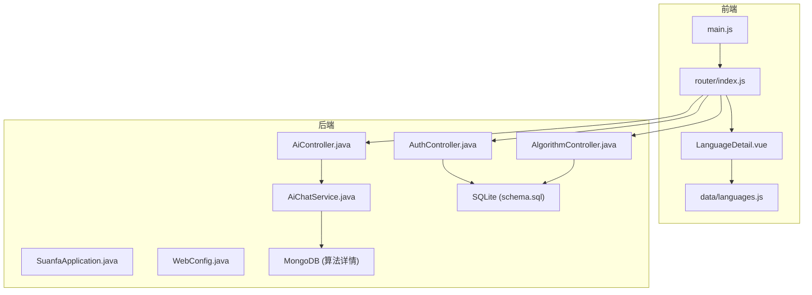
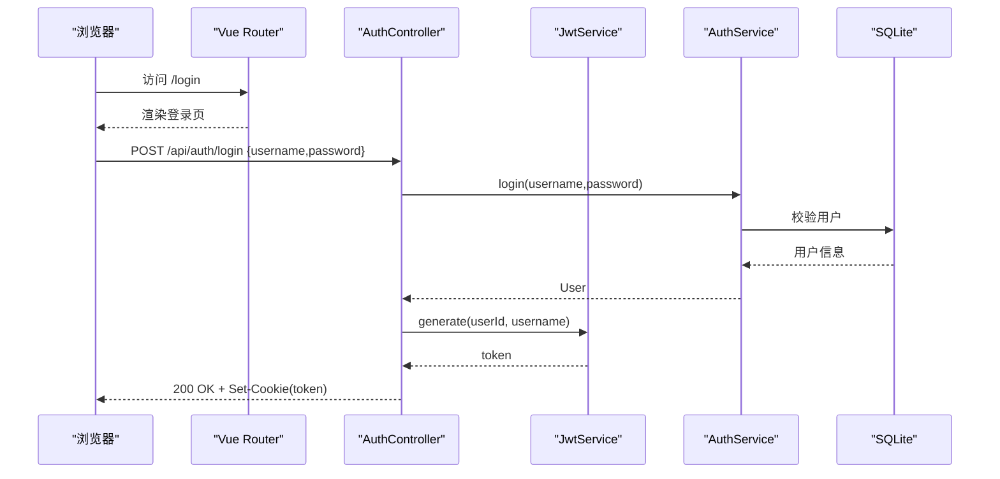
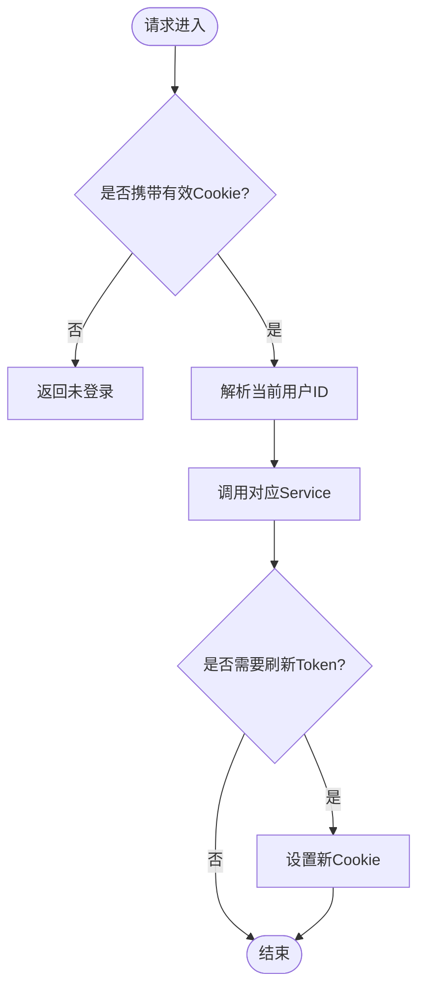
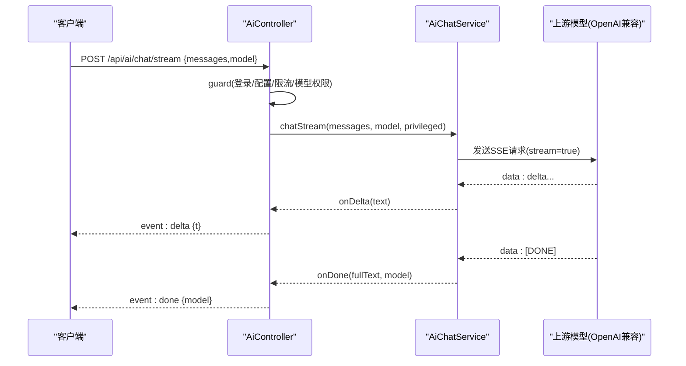
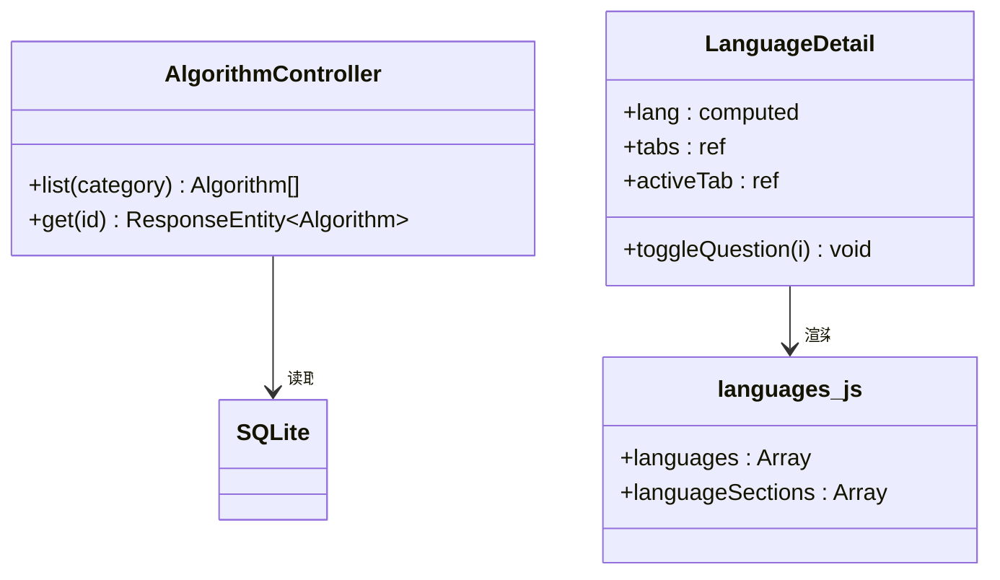
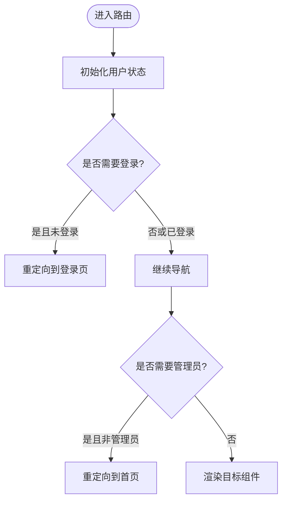
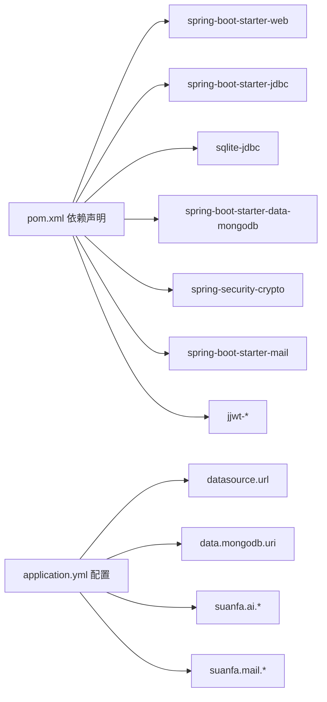
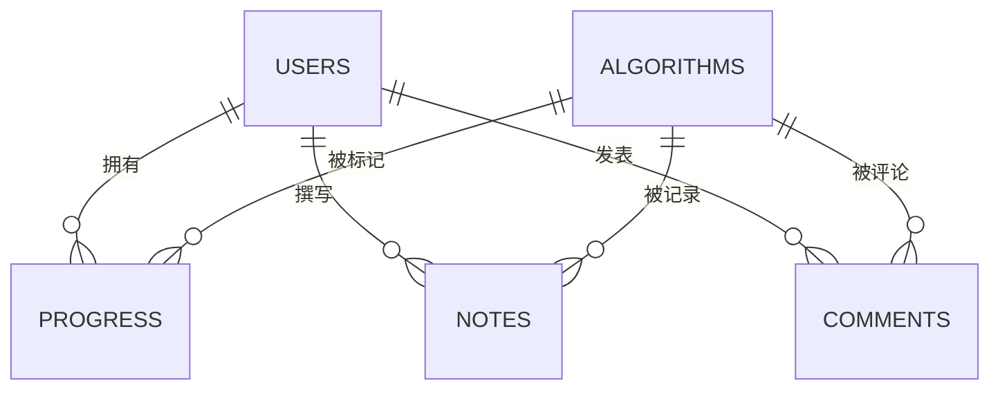

# 计算机语言学习模块

<cite>
**本文引用的文件**
- [backend/pom.xml](file://backend/pom.xml)
- [backend/src/main/java/com/suanfa/SuanfaApplication.java](file://backend/src/main/java/com/suanfa/SuanfaApplication.java)
- [backend/src/main/resources/application.yml](file://backend/src/main/resources/application.yml)
- [backend/src/main/resources/schema.sql](file://backend/src/main/resources/schema.sql)
- [backend/src/main/java/com/suanfa/config/WebConfig.java](file://backend/src/main/java/com/suanfa/config/WebConfig.java)
- [backend/src/main/java/com/suanfa/controller/AuthController.java](file://backend/src/main/java/com/suanfa/controller/AuthController.java)
- [backend/src/main/java/com/suanfa/controller/AiController.java](file://backend/src/main/java/com/suanfa/controller/AiController.java)
- [backend/src/main/java/com/suanfa/controller/AlgorithmController.java](file://backend/src/main/java/com/suanfa/controller/AlgorithmController.java)
- [backend/src/main/java/com/suanfa/service/AiChatService.java](file://backend/src/main/java/com/suanfa/service/AiChatService.java)
- [backend/src/main/java/com/suanfa/entity/User.java](file://backend/src/main/java/com/suanfa/entity/User.java)
- [suanfa_vue/package.json](file://suanfa_vue/package.json)
- [suanfa_vue/src/main.js](file://suanfa_vue/src/main.js)
- [suanfa_vue/src/router/index.js](file://suanfa_vue/src/router/index.js)
- [suanfa_vue/src/components/languages/LanguageDetail.vue](file://suanfa_vue/src/components/languages/LanguageDetail.vue)
- [suanfa_vue/src/data/languages.js](file://suanfa_vue/src/data/languages.js)
</cite>

## 目录
1. [简介](#简介)
2. [项目结构](#项目结构)
3. [核心组件](#核心组件)
4. [架构总览](#架构总览)
5. [详细组件分析](#详细组件分析)
6. [依赖关系分析](#依赖关系分析)
7. [性能与可扩展性](#性能与可扩展性)
8. [故障排查指南](#故障排查指南)
9. [结论](#结论)
10. [附录](#附录)

## 简介
本仓库是一个“算法+计算机语言”学习平台，前端采用 Vue 3 + Vite，后端采用 Spring Boot 3（Java 17），使用 SQLite 存储用户、进度、笔记等结构化数据，MongoDB 存储算法详情内容。系统提供：
- 用户认证与会话管理（JWT + httpOnly Cookie）
- 算法元数据与详情浏览
- AI 助教对话（SSE 流式返回，支持多中转站、模型降级与熔断）
- 计算机语言学习页面（语法/数据结构/常用架构/经典面试题）
- 学习进度、训练记录、评论、笔记等学习辅助功能

## 项目结构
- 后端 backend：Spring Boot 应用，包含控制器、服务、配置、实体、仓库、资源脚本等
- 前端 suanfa_vue：Vue 3 SPA，路由、状态、组件、静态数据（含语言资料）
- 根目录 scripts：开发辅助脚本
- archive：历史测试页面与脚本

**图表来源**
- [backend/src/main/java/com/suanfa/SuanfaApplication.java:10-20](file://backend/src/main/java/com/suanfa/SuanfaApplication.java#L10-L20)
- [backend/src/main/java/com/suanfa/config/WebConfig.java:33-44](file://backend/src/main/java/com/suanfa/config/WebConfig.java#L33-L44)
- [backend/src/main/java/com/suanfa/controller/AuthController.java:25-28](file://backend/src/main/java/com/suanfa/controller/AuthController.java#L25-L28)
- [backend/src/main/java/com/suanfa/controller/AiController.java:51-53](file://backend/src/main/java/com/suanfa/controller/AiController.java#L51-L53)
- [backend/src/main/java/com/suanfa/controller/AlgorithmController.java:10-13](file://backend/src/main/java/com/suanfa/controller/AlgorithmController.java#L10-L13)
- [backend/src/main/java/com/suanfa/service/AiChatService.java:30-47](file://backend/src/main/java/com/suanfa/service/AiChatService.java#L30-L47)
- [backend/src/main/resources/schema.sql:5-79](file://backend/src/main/resources/schema.sql#L5-L79)

**章节来源**
- [backend/pom.xml:1-95](file://backend/pom.xml#L1-L95)
- [suanfa_vue/package.json:1-23](file://suanfa_vue/package.json#L1-L23)
- [backend/src/main/resources/application.yml:1-122](file://backend/src/main/resources/application.yml#L1-L122)

## 核心组件
- 启动与运行环境
  - 应用入口确保 data 目录存在并启动 Spring Boot
  - 通过 application.yml 配置数据库、MongoDB、CORS、AI 参数、邮件等
- 安全与跨域
  - WebConfig 注册当前用户 ID 解析器并配置 CORS
  - JWT 存储在 httpOnly Cookie，过滤器在后续请求中解析
- 认证接口
  - 注册、登录、登出、获取当前用户、邮箱验证码、修改密码
- AI 助教
  - 模型清单、状态查询、一次性聊天、SSE 流式聊天
  - 多中转站、模型降级、熔断、限流、知识增强（RAG）
- 算法与语言
  - 算法元数据接口（分类、详情）
  - 语言详情页（单一数据源 languages.js，Markdown 渲染）

**章节来源**
- [backend/src/main/java/com/suanfa/SuanfaApplication.java:10-20](file://backend/src/main/java/com/suanfa/SuanfaApplication.java#L10-L20)
- [backend/src/main/resources/application.yml:1-122](file://backend/src/main/resources/application.yml#L1-L122)
- [backend/src/main/java/com/suanfa/config/WebConfig.java:13-44](file://backend/src/main/java/com/suanfa/config/WebConfig.java#L13-L44)
- [backend/src/main/java/com/suanfa/controller/AuthController.java:25-173](file://backend/src/main/java/com/suanfa/controller/AuthController.java#L25-L173)
- [backend/src/main/java/com/suanfa/controller/AiController.java:34-451](file://backend/src/main/java/com/suanfa/controller/AiController.java#L34-L451)
- [backend/src/main/java/com/suanfa/controller/AlgorithmController.java:10-32](file://backend/src/main/java/com/suanfa/controller/AlgorithmController.java#L10-L32)
- [suanfa_vue/src/components/languages/LanguageDetail.vue:1-378](file://suanfa_vue/src/components/languages/LanguageDetail.vue#L1-L378)
- [suanfa_vue/src/data/languages.js:1-800](file://suanfa_vue/src/data/languages.js#L1-L800)

## 架构总览
系统采用前后端分离的 REST + SSE 架构：
- 前端通过 Vue Router 组织页面，按需加载组件；通过 Pinia 管理用户状态
- 后端以 Controller 暴露 API，Service 封装业务逻辑，Repository 访问 SQLite/MongoDB
- AI 能力通过 AiChatService 代理上游 OpenAI 兼容接口，支持多中转站与降级

**图表来源**
- [backend/src/main/java/com/suanfa/controller/AuthController.java:60-69](file://backend/src/main/java/com/suanfa/controller/AuthController.java#L60-L69)
- [backend/src/main/java/com/suanfa/controller/AuthController.java:152-167](file://backend/src/main/java/com/suanfa/controller/AuthController.java#L152-L167)
- [backend/src/main/resources/schema.sql:18-25](file://backend/src/main/resources/schema.sql#L18-L25)

## 详细组件分析

### 认证与安全（AuthController + WebConfig）
- 职责
  - 提供注册、登录、登出、当前用户、邮箱验证码、修改密码接口
  - 将 JWT 写入 httpOnly Cookie，配合 CORS 允许携带凭证
- 关键点
  - 登录成功后设置 Cookie，过期时间由配置决定
  - 修改密码流程先校验原/新密码规则，再校验邮箱验证码，最后落库并刷新 Token
  - CORS 使用 allowedOriginPatterns 兼容开发环境全开与生产收紧

**图表来源**
- [backend/src/main/java/com/suanfa/controller/AuthController.java:77-85](file://backend/src/main/java/com/suanfa/controller/AuthController.java#L77-L85)
- [backend/src/main/java/com/suanfa/controller/AuthController.java:124-142](file://backend/src/main/java/com/suanfa/controller/AuthController.java#L124-L142)
- [backend/src/main/java/com/suanfa/config/WebConfig.java:33-44](file://backend/src/main/java/com/suanfa/config/WebConfig.java#L33-L44)

**章节来源**
- [backend/src/main/java/com/suanfa/controller/AuthController.java:25-173](file://backend/src/main/java/com/suanfa/controller/AuthController.java#L25-L173)
- [backend/src/main/java/com/suanfa/config/WebConfig.java:13-44](file://backend/src/main/java/com/suanfa/config/WebConfig.java#L13-L44)
- [backend/src/main/resources/application.yml:18-46](file://backend/src/main/resources/application.yml#L18-L46)

### AI 助教（AiController + AiChatService）
- 职责
  - 暴露模型清单、状态、一次性聊天、SSE 流式聊天、上游模型发现等接口
  - 实现限流、模型降级、熔断、知识增强（RAG）、权限裁剪（普通用户/管理员）
- 关键流程
  - 流式聊天：创建 SSEEmitter，分配线程池执行，按 onMeta/onDelta/onReasoning/onDone 推送事件
  - 降级与熔断：失败时记录 cooldown，自动尝试备用模型；已输出部分文本则不再切换避免混排
  - 权限控制：普通用户仅见供应商级标识，真实模型名对普通用户屏蔽

**图表来源**
- [backend/src/main/java/com/suanfa/controller/AiController.java:297-328](file://backend/src/main/java/com/suanfa/controller/AiController.java#L297-L328)
- [backend/src/main/java/com/suanfa/controller/AiController.java:330-389](file://backend/src/main/java/com/suanfa/controller/AiController.java#L330-L389)
- [backend/src/main/java/com/suanfa/service/AiChatService.java:588-650](file://backend/src/main/java/com/suanfa/service/AiChatService.java#L588-L650)
- [backend/src/main/java/com/suanfa/service/AiChatService.java:686-744](file://backend/src/main/java/com/suanfa/service/AiChatService.java#L686-L744)

**章节来源**
- [backend/src/main/java/com/suanfa/controller/AiController.java:34-451](file://backend/src/main/java/com/suanfa/controller/AiController.java#L34-L451)
- [backend/src/main/java/com/suanfa/service/AiChatService.java:30-800](file://backend/src/main/java/com/suanfa/service/AiChatService.java#L30-L800)
- [backend/src/main/resources/application.yml:46-117](file://backend/src/main/resources/application.yml#L46-L117)

### 算法与语言学习（AlgorithmController + LanguageDetail）
- 算法元数据
  - 提供按分类查询与按 id 获取算法元数据的接口，数据来自 SQLite
- 语言详情页
  - 基于单一数据源 languages.js，展示语法/数据结构/常用架构/经典面试题
  - 支持语言切换、板块切换、面试题折叠展开、主题色映射

**图表来源**
- [backend/src/main/java/com/suanfa/controller/AlgorithmController.java:21-30](file://backend/src/main/java/com/suanfa/controller/AlgorithmController.java#L21-L30)
- [suanfa_vue/src/components/languages/LanguageDetail.vue:1-378](file://suanfa_vue/src/components/languages/LanguageDetail.vue#L1-L378)
- [suanfa_vue/src/data/languages.js:1-800](file://suanfa_vue/src/data/languages.js#L1-L800)

**章节来源**
- [backend/src/main/java/com/suanfa/controller/AlgorithmController.java:10-32](file://backend/src/main/java/com/suanfa/controller/AlgorithmController.java#L10-L32)
- [backend/src/main/resources/schema.sql:5-16](file://backend/src/main/resources/schema.sql#L5-L16)
- [suanfa_vue/src/components/languages/LanguageDetail.vue:1-378](file://suanfa_vue/src/components/languages/LanguageDetail.vue#L1-L378)
- [suanfa_vue/src/data/languages.js:1-800](file://suanfa_vue/src/data/languages.js#L1-L800)

### 前端路由与状态（main.js + router/index.js）
- main.js 初始化 Vue 应用、Pinia、Router
- router/index.js 定义路由与守卫：
  - 需要登录的页面跳转至登录页
  - 管理员页面需具备管理员身份
  - 已登录访问登录页重定向到首页

**图表来源**
- [suanfa_vue/src/main.js:1-12](file://suanfa_vue/src/main.js#L1-L12)
- [suanfa_vue/src/router/index.js:138-153](file://suanfa_vue/src/router/index.js#L138-L153)

**章节来源**
- [suanfa_vue/src/main.js:1-12](file://suanfa_vue/src/main.js#L1-L12)
- [suanfa_vue/src/router/index.js:1-157](file://suanfa_vue/src/router/index.js#L1-L157)

## 依赖关系分析
- 后端依赖
  - Spring Boot Web、JDBC、SQLite、MongoDB、Security Crypto、Mail、JWT
  - 通过 application.yml 注入配置项（端口、数据库、AI、邮件、代码执行等）
- 前端依赖
  - Vue、Vue Router、Pinia、marked、dompurify
- 运行时依赖
  - SQLite 用于用户、进度、笔记、评论、训练等结构化数据
  - MongoDB 用于算法详情文档型数据
  - 可选 SMTP 用于邮箱验证码；未配置时回退为日志模式

**图表来源**
- [backend/pom.xml:24-84](file://backend/pom.xml#L24-L84)
- [backend/src/main/resources/application.yml:4-17](file://backend/src/main/resources/application.yml#L4-L17)
- [backend/src/main/resources/application.yml:18-117](file://backend/src/main/resources/application.yml#L18-L117)

**章节来源**
- [backend/pom.xml:1-95](file://backend/pom.xml#L1-L95)
- [backend/src/main/resources/application.yml:1-122](file://backend/src/main/resources/application.yml#L1-L122)

## 性能与可扩展性
- 并发与流式处理
  - AI 流式对话使用独立线程池（最小2、最大8，无界队列直连），满负载直接拒绝而非排队，避免阻塞主线程
  - SSE 超时保护，防止长连接占用过多资源
- 限流与熔断
  - 用户级每分钟提问次数限制，错误请求可退款额度
  - 模型级熔断表（cooldown），快速跳过不可用上游，提高整体可用性
- 缓存与降级
  - 未配置 SMTP 时验证码走本地回显，便于开发调试
  - 未配置 AI 时前端降级为本地答疑模式
- 扩展点
  - 多中转站配置（环境变量 JSON 或页面热配置）
  - 模型级预算、超时、温度、推理档位可调
  - 管理员白名单与页面角色双重判定

[本节为通用指导，不直接分析具体文件]

## 故障排查指南
- 认证问题
  - 检查 Cookie 是否设置成功（httpOnly、路径、SameSite）
  - 确认 CORS 允许来源与凭据策略匹配
- AI 服务不可用
  - 检查 /api/ai/status 返回 configured 与 loginRequired
  - 查看上游模型列表与熔断剩余秒数
  - 若所有模型均不可用，确认至少一个 provider 已配置 base-url 与 api-key
- 邮箱验证码
  - 未配置 SMTP 时 devCode 会随响应返回；生产环境请关闭 dev-echo-code
- 数据库
  - 启动前确保 data 目录存在；schema.sql 会在每次启动时初始化
- 前端路由
  - 登录后仍被重定向到登录页：检查路由 meta.requiresAuth 与用户状态初始化

**章节来源**
- [backend/src/main/java/com/suanfa/controller/AuthController.java:152-167](file://backend/src/main/java/com/suanfa/controller/AuthController.java#L152-L167)
- [backend/src/main/java/com/suanfa/controller/AiController.java:89-112](file://backend/src/main/java/com/suanfa/controller/AiController.java#L89-L112)
- [backend/src/main/java/com/suanfa/service/AiChatService.java:532-560](file://backend/src/main/java/com/suanfa/service/AiChatService.java#L532-L560)
- [backend/src/main/resources/application.yml:28-46](file://backend/src/main/resources/application.yml#L28-L46)
- [backend/src/main/java/com/suanfa/SuanfaApplication.java:13-20](file://backend/src/main/java/com/suanfa/SuanfaApplication.java#L13-L20)

## 结论
该模块以清晰的分层架构实现了“算法可视化 + 计算机语言学习 + AI 助教”的一体化体验。后端通过多中转站与熔断降级保障 AI 能力的高可用，前端通过单一数据源与模块化组件提升可维护性。建议在生产环境中：
- 严格配置 CORS 与 JWT 密钥
- 启用 SMTP 并关闭开发回显
- 合理设置 AI 限流与模型预算
- 定期备份 SQLite 与 MongoDB 数据

[本节为总结性内容，不直接分析具体文件]

## 附录
- 数据库表概览
  - algorithms：算法元数据（id、名称、分类、难度、复杂度等）
  - users：用户（用户名、密码哈希、邮箱、角色、创建时间）
  - progress：学习进度（用户-算法-状态）
  - notes：学习笔记（用户-算法-Markdown）
  - comments：算法评论（用户-算法-内容-时间）
  - app_settings：应用运行时配置（JSON）
  - training：刷题记录（用户-题目-状态）

**图表来源**
- [backend/src/main/resources/schema.sql:5-79](file://backend/src/main/resources/schema.sql#L5-L79)

**章节来源**
- [backend/src/main/resources/schema.sql:1-79](file://backend/src/main/resources/schema.sql#L1-L79)