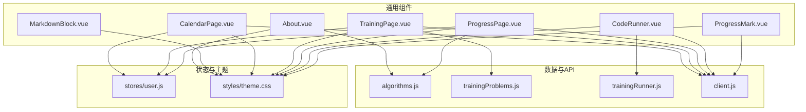
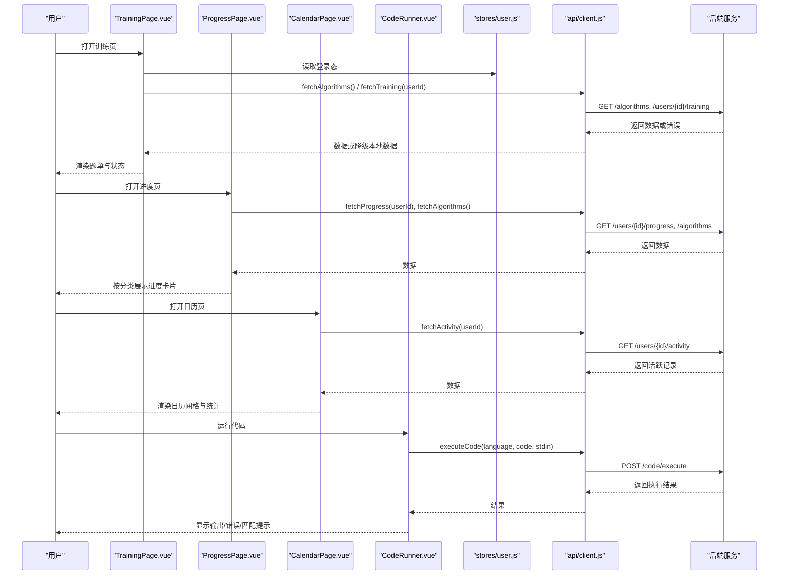
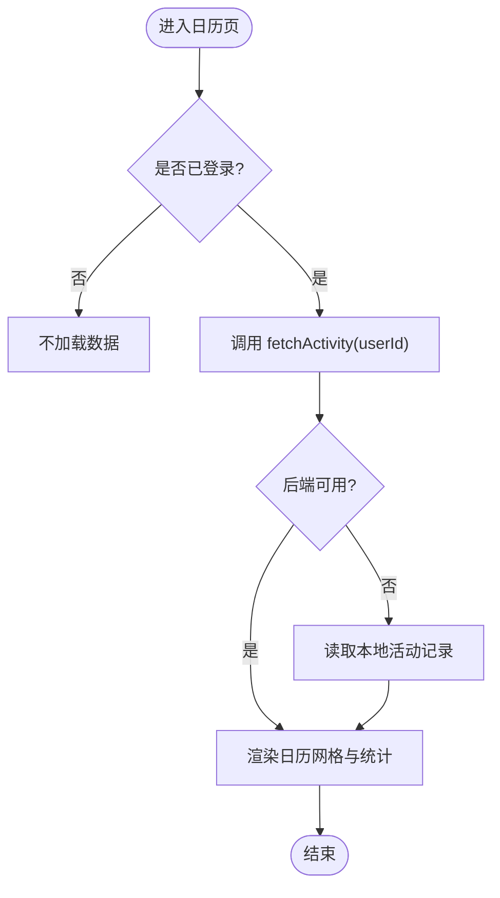
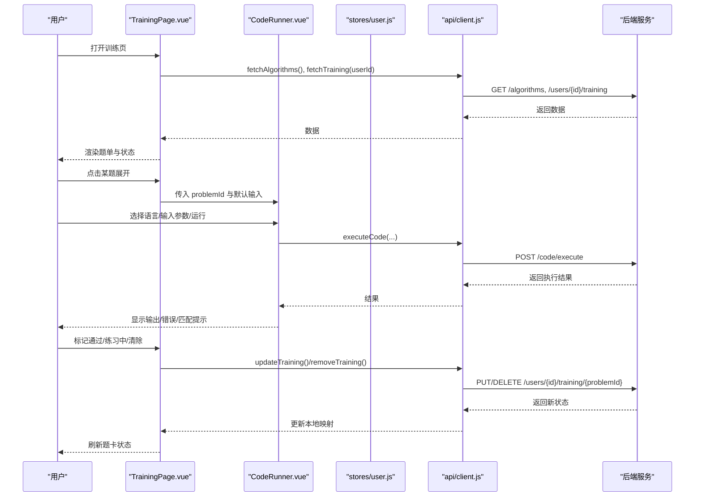
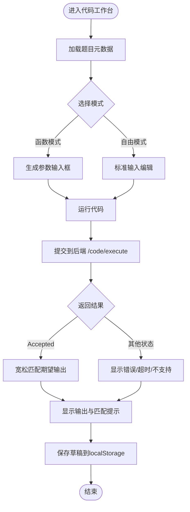
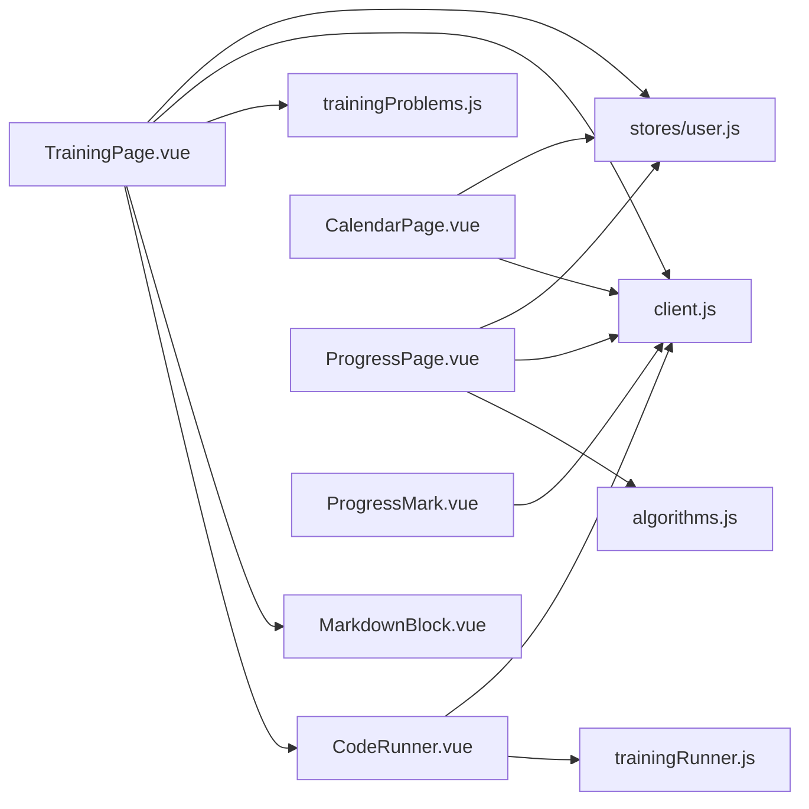

# 通用UI组件

<cite>
**本文引用的文件**
- [About.vue](file://suanfa_vue/src/components/common/About.vue)
- [MarkdownBlock.vue](file://suanfa_vue/src/components/common/MarkdownBlock.vue)
- [CalendarPage.vue](file://suanfa_vue/src/components/common/CalendarPage.vue)
- [TrainingPage.vue](file://suanfa_vue/src/components/common/TrainingPage.vue)
- [ProgressPage.vue](file://suanfa_vue/src/components/common/ProgressPage.vue)
- [CodeRunner.vue](file://suanfa_vue/src/components/common/CodeRunner.vue)
- [ProgressMark.vue](file://suanfa_vue/src/components/common/ProgressMark.vue)
- [algorithms.js](file://suanfa_vue/src/data/algorithms.js)
- [trainingProblems.js](file://suanfa_vue/src/data/trainingProblems.js)
- [trainingRunner.js](file://suanfa_vue/src/data/trainingRunner.js)
- [client.js](file://suanfa_vue/src/api/client.js)
- [user.js](file://suanfa_vue/src/stores/user.js)
- [theme.css](file://suanfa_vue/src/styles/theme.css)
</cite>

## 目录
1. [简介](#简介)
2. [项目结构](#项目结构)
3. [核心组件总览](#核心组件总览)
4. [架构总览](#架构总览)
5. [组件详解](#组件详解)
6. [依赖关系分析](#依赖关系分析)
7. [性能与可访问性建议](#性能与可访问性建议)
8. [故障排查指南](#故障排查指南)
9. [结论](#结论)
10. [附录：使用示例与最佳实践](#附录使用示例与最佳实践)

## 简介
本文件面向“通用UI组件”的文档目标，覆盖以下基础能力：关于页面、Markdown渲染、学习日历、训练页面、进度页面、代码工作台与进度标记。重点说明每个组件的功能特性、配置选项、样式定制、事件处理；并解释数据流、状态管理、后端集成与降级策略、主题与响应式适配等高级特性。

## 项目结构
前端采用 Vue 3 + Composition API 的单页应用，通用 UI 组件集中在 common 目录，数据源集中于 data 目录，API 客户端统一在 api 目录，用户状态由 Pinia store 管理，全站主题通过 CSS 变量集中维护。

图表来源
- [About.vue:1-138](file://suanfa_vue/src/components/common/About.vue#L1-L138)
- [MarkdownBlock.vue:1-85](file://suanfa_vue/src/components/common/MarkdownBlock.vue#L1-L85)
- [CalendarPage.vue:1-172](file://suanfa_vue/src/components/common/CalendarPage.vue#L1-L172)
- [TrainingPage.vue:1-237](file://suanfa_vue/src/components/common/TrainingPage.vue#L1-L237)
- [ProgressPage.vue:1-85](file://suanfa_vue/src/components/common/ProgressPage.vue#L1-L85)
- [CodeRunner.vue:1-331](file://suanfa_vue/src/components/common/CodeRunner.vue#L1-L331)
- [ProgressMark.vue:1-72](file://suanfa_vue/src/components/common/ProgressMark.vue#L1-L72)
- [algorithms.js:777-800](file://suanfa_vue/src/data/algorithms.js#L777-L800)
- [trainingProblems.js:1-225](file://suanfa_vue/src/data/trainingProblems.js#L1-L225)
- [trainingRunner.js:1-139](file://suanfa_vue/src/data/trainingRunner.js#L1-L139)
- [client.js:1-725](file://suanfa_vue/src/api/client.js#L1-L725)
- [user.js:1-36](file://suanfa_vue/src/stores/user.js#L1-L36)
- [theme.css:1-136](file://suanfa_vue/src/styles/theme.css#L1-L136)

章节来源
- [About.vue:1-138](file://suanfa_vue/src/components/common/About.vue#L1-L138)
- [client.js:1-725](file://suanfa_vue/src/api/client.js#L1-L725)
- [theme.css:1-136](file://suanfa_vue/src/styles/theme.css#L1-L136)

## 核心组件总览
- About 关于页：站点定位、内容地图、工具入口、技术栈展示，基于单一算法数据源统计数量。
- MarkdownBlock Markdown渲染块：marked 解析 + DOMPurify 消毒，提供可读的代码块与表格样式。
- CalendarPage 学习日历：按月展示活跃天数、连续学习天数统计，支持月份导航与今日高亮。
- TrainingPage 训练页面：题单筛选（专题/难度/状态/关键词）、分级提示、参考解答、在线代码测试、完成状态跟踪。
- ProgressPage 进度页面：按分类汇总已掌握/收藏的算法，卡片化展示并可跳转详情页。
- CodeRunner 代码工作台：函数模式/自由模式切换，多语言执行，本地草稿持久化，输出比对与错误提示。
- ProgressMark 进度标记：在算法详情页快速标记“已掌握/收藏”，未登录时引导登录。

章节来源
- [About.vue:1-138](file://suanfa_vue/src/components/common/About.vue#L1-L138)
- [MarkdownBlock.vue:1-85](file://suanfa_vue/src/components/common/MarkdownBlock.vue#L1-L85)
- [CalendarPage.vue:1-172](file://suanfa_vue/src/components/common/CalendarPage.vue#L1-L172)
- [TrainingPage.vue:1-237](file://suanfa_vue/src/components/common/TrainingPage.vue#L1-L237)
- [ProgressPage.vue:1-85](file://suanfa_vue/src/components/common/ProgressPage.vue#L1-L85)
- [CodeRunner.vue:1-331](file://suanfa_vue/src/components/common/CodeRunner.vue#L1-L331)
- [ProgressMark.vue:1-72](file://suanfa_vue/src/components/common/ProgressMark.vue#L1-L72)

## 架构总览
整体遵循“组件 → 数据源/API → Store/主题”的分层：
- 组件负责交互与展示，不直接操作网络请求细节。
- client.js 封装所有后端调用，具备“后端优先、失败回退本地”的降级机制。
- stores/user.js 管理登录态，被多个组件共享。
- theme.css 提供设计令牌，组件通过CSS变量实现主题一致性与可扩展换肤。

图表来源
- [TrainingPage.vue:101-124](file://suanfa_vue/src/components/common/TrainingPage.vue#L101-L124)
- [ProgressPage.vue:45-58](file://suanfa_vue/src/components/common/ProgressPage.vue#L45-L58)
- [CalendarPage.vue:80-94](file://suanfa_vue/src/components/common/CalendarPage.vue#L80-L94)
- [CodeRunner.vue:189-223](file://suanfa_vue/src/components/common/CodeRunner.vue#L189-L223)
- [client.js:49-54](file://suanfa_vue/src/api/client.js#L49-L54)
- [client.js:137-146](file://suanfa_vue/src/api/client.js#L137-L146)
- [client.js:207-215](file://suanfa_vue/src/api/client.js#L207-L215)
- [client.js:341-347](file://suanfa_vue/src/api/client.js#L341-L347)

## 组件详解

### About 关于页
- 功能特性
  - 展示站点定位、内容地图、学习工具入口与技术栈。
  - 动态统计算法总数，新增算法无需修改此处。
- 配置选项
  - 分类列表与工具入口通过常量数组定义，便于扩展。
- 样式定制
  - 使用全站主题变量，卡片布局与按钮风格统一。
- 事件处理
  - 通过路由链接跳转到各功能页。
- 数据依赖
  - 从 algorithms.js 派生排序/搜索/图/DP/贪心分类列表。

章节来源
- [About.vue:14-67](file://suanfa_vue/src/components/common/About.vue#L14-L67)
- [algorithms.js:777-800](file://suanfa_vue/src/data/algorithms.js#L777-L800)

### MarkdownBlock Markdown渲染块
- 功能特性
  - 将 Markdown 文本解析为 HTML，并进行安全消毒。
  - 提供代码块、表格、标题、列表等基础排版样式。
- 配置选项
  - 接收 source 字符串作为输入。
- 样式定制
  - 通过 :deep 选择器对内部元素进行样式控制，兼容深色主题。
- 事件处理
  - 无交互事件，纯展示组件。
- 安全与性能
  - 使用 DOMPurify 防止 XSS；computed 缓存解析结果。

章节来源
- [MarkdownBlock.vue:1-85](file://suanfa_vue/src/components/common/MarkdownBlock.vue#L1-L85)

### CalendarPage 学习日历
- 功能特性
  - 按月展示学习活跃（进度标记/笔记/评论/刷题行为），计算连续学习天数与累计活跃天数。
  - 支持上月/下月导航与回到本月。
- 配置选项
  - 周标签、月份标签、活跃度分档样式。
- 样式定制
  - 网格布局、今日高亮、活跃度等级色块、图例。
- 事件处理
  - 加载活动数据、月份切换、回到本月。
- 数据流
  - 登录后拉取活动数据；未登录则不加载。
  - 后端不可用时，client.js 会回退到 localStorage 中的本地活动记录。

图表来源
- [CalendarPage.vue:80-94](file://suanfa_vue/src/components/common/CalendarPage.vue#L80-L94)
- [client.js:207-215](file://suanfa_vue/src/api/client.js#L207-L215)

章节来源
- [CalendarPage.vue:1-172](file://suanfa_vue/src/components/common/CalendarPage.vue#L1-L172)
- [client.js:207-215](file://suanfa_vue/src/api/client.js#L207-L215)

### TrainingPage 训练页面
- 功能特性
  - 静态题单 + 分类/难度/状态/关键词筛选。
  - 分级提示逐步展开、参考解答折叠查看、关联算法跳转。
  - 在线代码测试（集成 CodeRunner）。
  - 完成状态跟踪（未做/练习中/已通过），支持清除记录。
- 配置选项
  - 筛选条件、展开状态、提示层级、错误提示。
- 样式定制
  - 题卡展开高亮、难度标签颜色、动作按钮样式。
- 事件处理
  - 展开/收起题目、显示更多提示、标记通过/练习中、清除记录、求助AI。
- 数据流
  - 并发拉取算法元数据与训练记录；登录后监听登录态变化刷新记录。
  - 后端不可用或旧版后端缺少路由时，回退到本地存储的训练记录。

图表来源
- [TrainingPage.vue:101-124](file://suanfa_vue/src/components/common/TrainingPage.vue#L101-L124)
- [TrainingPage.vue:72-94](file://suanfa_vue/src/components/common/TrainingPage.vue#L72-L94)
- [CodeRunner.vue:189-223](file://suanfa_vue/src/components/common/CodeRunner.vue#L189-L223)
- [client.js:274-316](file://suanfa_vue/src/api/client.js#L274-L316)
- [client.js:341-347](file://suanfa_vue/src/api/client.js#L341-L347)

章节来源
- [TrainingPage.vue:1-237](file://suanfa_vue/src/components/common/TrainingPage.vue#L1-L237)
- [trainingProblems.js:1-225](file://suanfa_vue/src/data/trainingProblems.js#L1-L225)
- [trainingRunner.js:1-139](file://suanfa_vue/src/data/trainingRunner.js#L1-L139)
- [client.js:274-316](file://suanfa_vue/src/api/client.js#L274-L316)

### ProgressPage 进度页面
- 功能特性
  - 按分类分组展示“学习中/已掌握/已收藏”的算法卡片，支持跳转详情页。
- 配置选项
  - 分类顺序与标签来自单一数据源，保证一致性。
- 样式定制
  - 卡片悬停阴影与位移，状态标签配色。
- 事件处理
  - 加载进度与算法元数据，错误提示。
- 数据流
  - 并发拉取进度与算法列表；后端不可用时仍可使用本地数据（若存在）。

章节来源
- [ProgressPage.vue:1-85](file://suanfa_vue/src/components/common/ProgressPage.vue#L1-L85)
- [algorithms.js:777-800](file://suanfa_vue/src/data/algorithms.js#L777-L800)
- [client.js:137-146](file://suanfa_vue/src/api/client.js#L137-L146)

### CodeRunner 代码工作台
- 功能特性
  - 函数模式：根据题目元数据生成具名参数输入框，自动包装 harness 提交。
  - 自由模式：直接编写完整程序，标准输入原样传入。
  - 多语言支持：C/C++/Java/Python/Go/JavaScript，后端不可达时置灰提示。
  - 草稿持久化：代码、语言、模式、参数、标准输入均保存在 localStorage。
  - 输出比对：宽松匹配期望输出，提示实际与期望差异。
- 配置选项
  - 问题ID、默认输入、模式、语言、用例索引、参数值。
- 样式定制
  - 工具栏、编辑器、输入区、输出区布局，移动端自适应。
- 事件处理
  - 运行、重置模板、Tab缩进、Ctrl+Enter运行、语言切换、用例切换。
- 数据流
  - 获取可用语言列表；执行代码后显示状态、耗时、截断提示与编译错误。

图表来源
- [CodeRunner.vue:14-57](file://suanfa_vue/src/components/common/CodeRunner.vue#L14-L57)
- [CodeRunner.vue:189-223](file://suanfa_vue/src/components/common/CodeRunner.vue#L189-L223)
- [trainingRunner.js:108-139](file://suanfa_vue/src/data/trainingRunner.js#L108-L139)
- [client.js:331-347](file://suanfa_vue/src/api/client.js#L331-L347)

章节来源
- [CodeRunner.vue:1-331](file://suanfa_vue/src/components/common/CodeRunner.vue#L1-L331)
- [trainingRunner.js:1-139](file://suanfa_vue/src/data/trainingRunner.js#L1-L139)
- [client.js:331-347](file://suanfa_vue/src/api/client.js#L331-L347)

### ProgressMark 进度标记
- 功能特性
  - 在算法详情页快速标记“已掌握/收藏”，未登录时跳转登录并保留重定向。
- 配置选项
  - algorithmId 必填。
- 样式定制
  - 按钮激活态与语义色区分。
- 事件处理
  - 切换状态、加载当前状态、保存状态。
- 数据流
  - 登录后拉取进度列表，找到对应算法的状态；保存时调用更新接口。

章节来源
- [ProgressMark.vue:1-72](file://suanfa_vue/src/components/common/ProgressMark.vue#L1-L72)
- [client.js:137-146](file://suanfa_vue/src/api/client.js#L137-L146)

## 依赖关系分析
- 组件耦合度
  - TrainingPage 依赖 CodeRunner、MarkdownBlock、训练题单数据与API。
  - CalendarPage 依赖用户状态与活动API。
  - ProgressPage 依赖算法分类与进度API。
  - ProgressMark 依赖进度API与路由。
- 外部依赖
  - marked 与 DOMPurify 用于 Markdown 渲染与安全消毒。
  - Pinia 用于用户状态管理。
  - Vue Router 用于页面跳转。
- 循环依赖
  - 未发现循环导入；数据源与API解耦清晰。
- 接口契约
  - client.js 暴露统一的 fetch/update 方法，组件仅依赖这些方法，降低耦合。

图表来源
- [TrainingPage.vue:1-237](file://suanfa_vue/src/components/common/TrainingPage.vue#L1-L237)
- [CalendarPage.vue:1-172](file://suanfa_vue/src/components/common/CalendarPage.vue#L1-L172)
- [ProgressPage.vue:1-85](file://suanfa_vue/src/components/common/ProgressPage.vue#L1-L85)
- [CodeRunner.vue:1-331](file://suanfa_vue/src/components/common/CodeRunner.vue#L1-L331)
- [ProgressMark.vue:1-72](file://suanfa_vue/src/components/common/ProgressMark.vue#L1-L72)
- [client.js:1-725](file://suanfa_vue/src/api/client.js#L1-L725)
- [algorithms.js:777-800](file://suanfa_vue/src/data/algorithms.js#L777-L800)
- [trainingProblems.js:1-225](file://suanfa_vue/src/data/trainingProblems.js#L1-L225)
- [trainingRunner.js:1-139](file://suanfa_vue/src/data/trainingRunner.js#L1-L139)
- [user.js:1-36](file://suanfa_vue/src/stores/user.js#L1-L36)

章节来源
- [client.js:1-725](file://suanfa_vue/src/api/client.js#L1-L725)
- [user.js:1-36](file://suanfa_vue/src/stores/user.js#L1-L36)

## 性能与可访问性建议
- 性能优化
  - 使用 computed 缓存派生数据（如活动映射、过滤列表、算法映射）。
  - 并发请求减少首屏等待（如训练页同时拉取算法与训练记录）。
  - 代码草稿与参数本地持久化，避免重复输入。
  - Markdown 解析结果缓存，减少重复计算。
- 可访问性
  - 按钮提供 title 与语义化标签。
  - 表单控件具有明确占位符与类型提示。
  - 颜色对比度符合深色主题规范。
- 主题与国际化
  - 全站通过 CSS 变量实现主题切换，新增浅色模式只需覆盖变量。
  - 文案目前为中文，如需国际化可在组件内引入 i18n 资源文件，或使用键值映射替换硬编码文本。

[本节为通用指导，不直接分析具体文件]

## 故障排查指南
- 后端不可用时的降级
  - 算法详情与视频：后端不可用回退本地数据。
  - 进度与笔记：后端不可用回退 localStorage。
  - 活动记录：后端不可用回退本地活动计数。
  - 训练记录：后端不可用回退本地训练记录。
  - 代码执行：后端不可用时语言选择置灰并提示不可用。
- 常见错误
  - 登录过期：代码运行时提示重新登录。
  - 401/403：AI 聊天降级本地答疑并提示登录。
  - 503：AI 服务未配置或上游不可用，降级本地答疑。
  - 404/405：旧版后端缺少路由，自动回退兼容路径或本地数据。
- 调试建议
  - 检查浏览器控制台网络面板，确认请求路径与状态码。
  - 检查 localStorage 中草稿与本地数据键值是否正确。
  - 使用开发者工具观察 computed 与 watch 的触发时机。

章节来源
- [client.js:17-28](file://suanfa_vue/src/api/client.js#L17-L28)
- [client.js:67-105](file://suanfa_vue/src/api/client.js#L67-L105)
- [client.js:154-186](file://suanfa_vue/src/api/client.js#L154-L186)
- [client.js:207-215](file://suanfa_vue/src/api/client.js#L207-L215)
- [client.js:274-316](file://suanfa_vue/src/api/client.js#L274-L316)
- [client.js:331-347](file://suanfa_vue/src/api/client.js#L331-L347)
- [client.js:469-552](file://suanfa_vue/src/api/client.js#L469-L552)

## 结论
本套通用UI组件围绕“可视化学习体验”构建，涵盖关于页、Markdown渲染、学习日历、训练页面、进度页面与代码工作台。组件之间通过统一API客户端与Pinia状态管理协作，具备良好的降级能力与主题一致性。建议在后续迭代中继续强化：
- 增加更丰富的筛选与搜索能力。
- 完善无障碍支持与键盘导航。
- 引入i18n以支持多语言。
- 持续优化大数据量下的渲染性能（虚拟滚动、懒加载）。

[本节为总结，不直接分析具体文件]

## 附录：使用示例与最佳实践
- 关于页
  - 通过路由链接快速导航到各功能页。
  - 新增算法时仅需更新数据源，页面自动统计。
- Markdown渲染
  - 将后端或本地Markdown内容传入 source 即可渲染。
  - 注意长文档分段加载，避免一次性渲染过大HTML。
- 学习日历
  - 登录后自动加载活动数据；未登录时不加载。
  - 月份切换时保持用户体验流畅。
- 训练页面
  - 使用筛选条件快速定位题目。
  - 利用分级提示逐步思考，再查看参考解答。
  - 通过CodeRunner进行在线测试，草稿自动保存。
- 进度页面
  - 定期查看并按分类回顾学习情况。
  - 结合日历与训练记录形成学习闭环。
- 代码工作台
  - 函数模式下直接填写参数，无需手动解析输入。
  - 自由模式下编写完整程序，适合复杂场景。
  - 关注输出比对提示，快速定位逻辑错误。
- 进度标记
  - 在详情页快速标记掌握或收藏，便于后续复习。
  - 未登录时自动跳转登录并保留重定向。

[本节为使用指导，不直接分析具体文件]