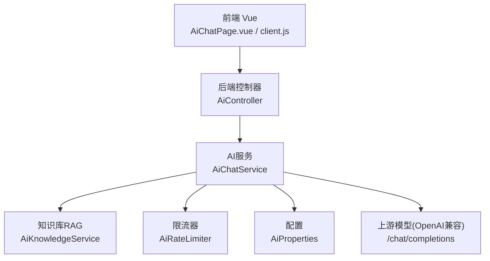
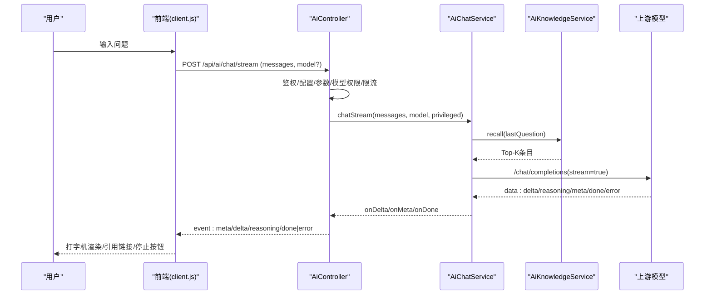
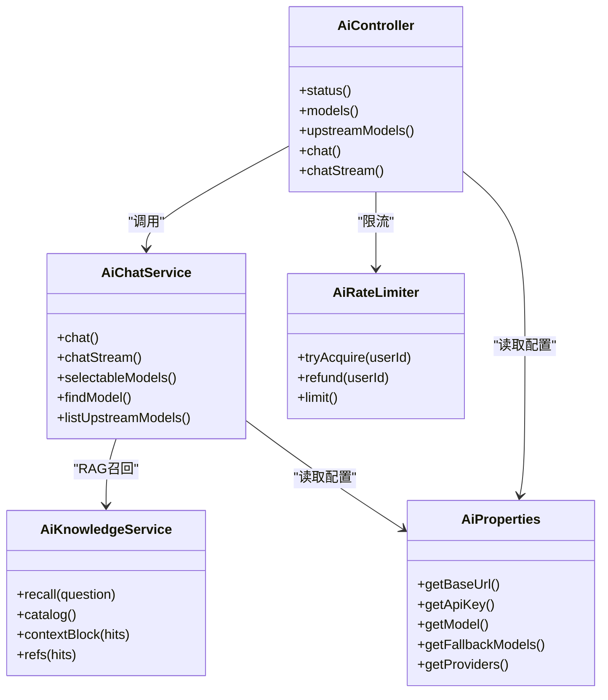
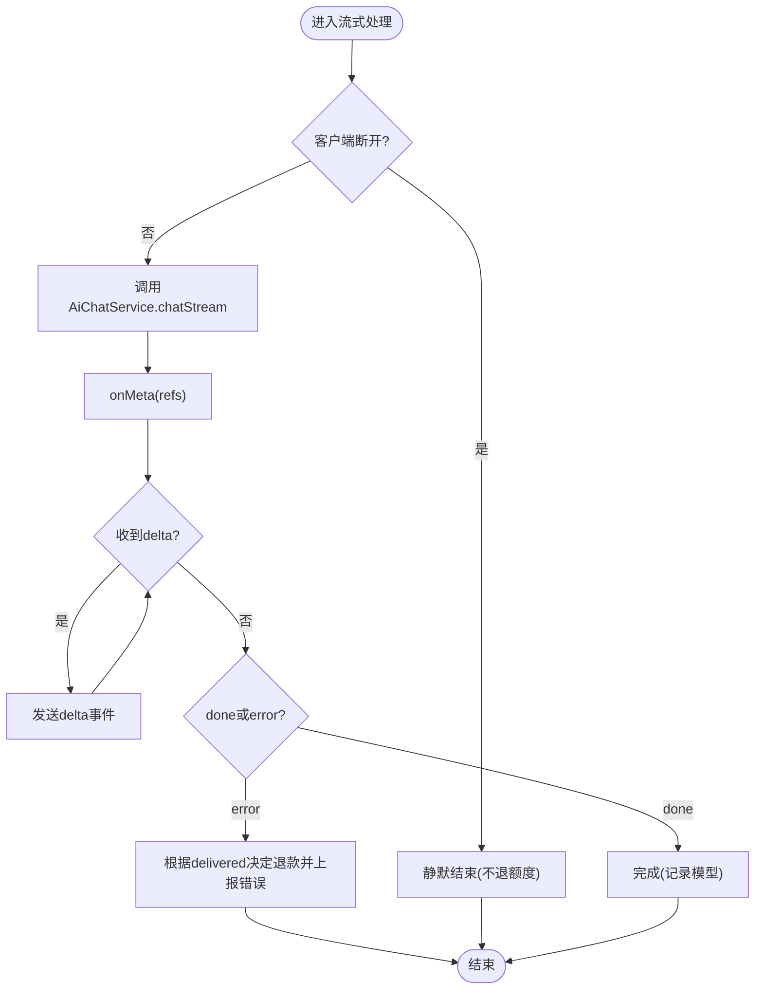

# AI助教API

<cite>
**本文引用的文件**
- [AiController.java](file://backend/src/main/java/com/suanfa/controller/AiController.java)
- [AiChatService.java](file://backend/src/main/java/com/suanfa/service/AiChatService.java)
- [AiKnowledgeService.java](file://backend/src/main/java/com/suanfa/service/AiKnowledgeService.java)
- [AiRateLimiter.java](file://backend/src/main/java/com/suanfa/service/AiRateLimiter.java)
- [AiProperties.java](file://backend/src/main/java/com/suanfa/config/AiProperties.java)
- [application.yml](file://backend/src/main/resources/application.yml)
- [ChatRequest.java](file://backend/src/main/java/com/suanfa/dto/ChatRequest.java)
- [ChatResponse.java](file://backend/src/main/java/com/suanfa/dto/ChatResponse.java)
- [AiModelInfo.java](file://backend/src/main/java/com/suanfa/dto/AiModelInfo.java)
- [client.js](file://suanfa_vue/src/api/client.js)
- [AiChatPage.vue](file://suanfa_vue/src/components/common/AiChatPage.vue)
</cite>

## 目录
1. [简介](#简介)
2. [项目结构](#项目结构)
3. [核心组件](#核心组件)
4. [架构总览](#架构总览)
5. [详细接口说明](#详细接口说明)
6. [依赖与关系分析](#依赖与关系分析)
7. [性能与限流熔断](#性能与限流熔断)
8. [前端实现指南](#前端实现指南)
9. [故障排查](#故障排查)
10. [结论](#结论)

## 简介
本文件为“AI助教”模块的完整API文档，覆盖对话接口、模型管理、限流控制、知识检索增强（RAG）、多中转站与熔断降级等高级特性。重点说明：
- HTTP方法、URL模式、请求参数与响应格式
- SSE流式连接建立、事件类型与消息格式
- 错误处理与重试机制
- 多模型支持、RAG注入、限流与熔断
- 前端实时通信、错误恢复与体验优化建议

## 项目结构
后端采用Spring Boot分层设计：
- Controller层：对外暴露REST/SSE接口，负责鉴权、校验、限流、状态返回
- Service层：封装上游模型调用、流式解析、模型发现、RAG召回、熔断策略
- Config层：集中配置AI中转站、默认模型、超时、温度、知识库开关等
- DTO层：统一请求/响应数据结构
- 前端Vue：SSE客户端、状态探测、降级本地答疑、UI交互

图表来源
- [AiController.java:49-118](file://backend/src/main/java/com/suanfa/controller/AiController.java#L49-L118)
- [AiChatService.java:48-105](file://backend/src/main/java/com/suanfa/service/AiChatService.java#L48-L105)
- [AiKnowledgeService.java:23-33](file://backend/src/main/java/com/suanfa/service/AiKnowledgeService.java#L23-L33)
- [AiRateLimiter.java:11-25](file://backend/src/main/java/com/suanfa/service/AiRateLimiter.java#L11-L25)
- [AiProperties.java:11-57](file://backend/src/main/java/com/suanfa/config/AiProperties.java#L11-L57)

章节来源
- [AiController.java:49-118](file://backend/src/main/java/com/suanfa/controller/AiController.java#L49-L118)
- [application.yml:18-50](file://backend/src/main/resources/application.yml#L18-L50)

## 核心组件
- AiController：提供 /api/ai/status、/api/ai/models、/api/ai/chat、/api/ai/chat/stream、/api/ai/upstream-models 等接口；负责登录校验、模型权限、限流、SSE事件发送
- AiChatService：代理上游OpenAI兼容的 chat/completions 接口；实现多中转站、模型选择与降级、SSE流式解析、RAG注入、熔断表
- AiKnowledgeService：轻量RAG，从MongoDB或种子文件加载算法资料，按关键词召回Top-K并注入system prompt
- AiRateLimiter：基于滑动窗口的用户级限流（每分钟N次），支持失败退款
- AiProperties：集中承载单/多中转站配置、默认模型、超时、温度、知识库开关、管理员白名单等

章节来源
- [AiController.java:49-118](file://backend/src/main/java/com/suanfa/controller/AiController.java#L49-L118)
- [AiChatService.java:48-105](file://backend/src/main/java/com/suanfa/service/AiChatService.java#L48-L105)
- [AiKnowledgeService.java:23-33](file://backend/src/main/java/com/suanfa/service/AiKnowledgeService.java#L23-L33)
- [AiRateLimiter.java:11-25](file://backend/src/main/java/com/suanfa/service/AiRateLimiter.java#L11-L25)
- [AiProperties.java:11-57](file://backend/src/main/java/com/suanfa/config/AiProperties.java#L11-L57)

## 架构总览
整体流程：
- 前端通过 /api/ai/status 获取可用性、默认模型、限流阈值、是否需登录
- 聊天时优先走 /api/ai/chat/stream（SSE）获得增量文本；不支持流式则回退到 /api/ai/chat
- 服务端在AiChatService中组装messages（含RAG上下文），按优先级尝试多个模型，失败自动降级
- 限流器保护上游额度；熔断表避免频繁撞坏模型

图表来源
- [AiController.java:224-313](file://backend/src/main/java/com/suanfa/controller/AiController.java#L224-L313)
- [AiChatService.java:574-636](file://backend/src/main/java/com/suanfa/service/AiChatService.java#L574-L636)
- [AiKnowledgeService.java:203-229](file://backend/src/main/java/com/suanfa/service/AiKnowledgeService.java#L203-L229)
- [client.js:469-552](file://suanfa_vue/src/api/client.js#L469-L552)

## 详细接口说明

### 通用约定
- Base URL: /api/ai
- 认证：需要登录（JWT Cookie），未登录将返回401
- 内容类型：JSON（请求/非流式响应），SSE（流式响应）
- 错误体：{ message: string }

### GET /api/ai/status
- 功能：查询AI能力是否可用、当前默认模型、限流阈值、是否需要登录、提供商列表
- 响应字段：
  - configured: boolean
  - loginRequired: boolean
  - baseUrl: string（仅登录后）
  - models: string[]（兼容旧前端）
  - modelDetails: AiModelInfo[]（按身份裁剪）
  - defaultModel: string?（首个可用的token）
  - providers: ProviderInfo[]
  - ratePerMinute: number
  - canManage: boolean

示例请求
- GET /api/ai/status

示例响应
- {
    "configured": true,
    "loginRequired": false,
    "baseUrl": "http://192.168.1.8:8000/v1",
    "models": ["deepseek-chat"],
    "modelDetails": [{...}],
    "defaultModel": "deepseek-chat",
    "providers": [{"id":"relay-a","label":"中转站A","models":["deepseek-chat"]}],
    "ratePerMinute": 12,
    "canManage": false
  }

章节来源
- [AiController.java:83-106](file://backend/src/main/java/com/suanfa/controller/AiController.java#L83-L106)
- [AiModelInfo.java:1-28](file://backend/src/main/java/com/suanfa/dto/AiModelInfo.java#L1-L28)

### GET /api/ai/models
- 功能：仅返回模型清单（供排障脚本使用）
- 响应：同status中的models/modelDetails/loginRequired/configured

章节来源
- [AiController.java:108-118](file://backend/src/main/java/com/suanfa/controller/AiController.java#L108-L118)

### GET /api/ai/upstream-models
- 功能：拉取各中转站真实可用模型（OpenAI兼容GET /models），仅管理员可访问
- 参数：provider?（可选，过滤某个provider）
- 响应：{ providers: [...] }

示例请求
- GET /api/ai/upstream-models?provider=relay-a

示例响应
- {
    "providers": [
      {"provider":"relay-a","label":"中转站A","baseUrl":"http://...","ok":true,"count":3,"models":["deepseek-chat","kimi-k2","claude-opus"]}
    ]
  }

章节来源
- [AiController.java:120-140](file://backend/src/main/java/com/suanfa/controller/AiController.java#L120-L140)

### POST /api/ai/chat（一次性返回）
- 功能：非流式对话，适合不支持SSE的客户端
- 请求体：
  - messages: ChatMessage[]（role/content）
  - model?: string（留空表示自动选择）
- 响应：
  - reply: string
  - model: string?
  - refs: ChatRef[]

示例请求
- POST /api/ai/chat
- Body:
  - {
      "messages": [
        {"role":"user","content":"快速排序的平均时间复杂度是多少？"}
      ],
      "model": null
    }

示例响应
- {
    "reply": "平均时间复杂度为 O(n log n)...",
    "model": "deepseek-chat",
    "refs": [{"id":"quick-sort","name":"快速排序","route":"/algorithms/sorting/quick-sort"}]
  }

章节来源
- [AiController.java:199-222](file://backend/src/main/java/com/suanfa/controller/AiController.java#L199-L222)
- [ChatRequest.java:1-16](file://backend/src/main/java/com/suanfa/dto/ChatRequest.java#L1-L16)
- [ChatResponse.java:1-10](file://backend/src/main/java/com/suanfa/dto/ChatResponse.java#L1-L10)

### POST /api/ai/chat/stream（SSE流式）
- 功能：流式对话，事件顺序：meta → reasoning? → delta* → done | error
- 请求头：Accept: text/event-stream
- 请求体：同 /api/ai/chat
- 事件类型：
  - meta: { refs: ChatRef[] }
  - reasoning: { t: "" }（仅提示“正在思考”，不传输长推理内容）
  - delta: { t: string }（增量文本）
  - done: { model: string }（实际使用的模型名）
  - error: { message: string }（上游错误或系统异常）

示例请求
- POST /api/ai/chat/stream
- Headers: Accept: text/event-stream
- Body:
  - {
      "messages": [
        {"role":"user","content":"Dijkstra能处理负权边吗？"}
      ]
    }

示例事件流
- event: meta
  data: {"refs":[{"id":"dijkstra","name":"迪杰斯特拉","route":"/algorithms/graph/dijkstra"}]}
- event: reasoning
  data: {"t":""}
- event: delta
  data: {"t":"不能直接处理负权边，因为一旦节点被标记为最短路径..."}
- event: delta
  data: {"t":"若存在负权边，应使用Bellman-Ford或SPFA..."}
- event: done
  data: {"model":"deepseek-chat"}

章节来源
- [AiController.java:224-313](file://backend/src/main/java/com/suanfa/controller/AiController.java#L224-L313)
- [AiChatService.java:672-730](file://backend/src/main/java/com/suanfa/service/AiChatService.java#L672-L730)
- [client.js:426-552](file://suanfa_vue/src/api/client.js#L426-L552)

### 错误码与处理
- 401 Unauthorized：未登录
- 400 Bad Request：参数非法（如messages为空或超限、未知模型）
- 429 Too Many Requests：超过每分钟限制
- 503 Service Unavailable：AI未配置或未开放
- 502 Bad Gateway：上游不可用或异常（已产生输出不退额度；未产生输出会退还额度）

章节来源
- [AiController.java:317-348](file://backend/src/main/java/com/suanfa/controller/AiController.java#L317-L348)
- [AiChatService.java:518-535](file://backend/src/main/java/com/suanfa/service/AiChatService.java#L518-L535)

## 依赖与关系分析
- 控制器依赖服务：AiController → AiChatService、AiRateLimiter、AiSettingsService、AiProperties
- 服务内部依赖：AiChatService → AiKnowledgeService（RAG）、HttpClient（上游）、AiProperties（配置）
- 限流器独立：按用户ID维护滑动窗口队列，支持退款
- 前端依赖：client.js封装SSE解析与降级逻辑；AiChatPage.vue负责UI与交互

图表来源
- [AiController.java:49-118](file://backend/src/main/java/com/suanfa/controller/AiController.java#L49-L118)
- [AiChatService.java:48-105](file://backend/src/main/java/com/suanfa/service/AiChatService.java#L48-L105)
- [AiKnowledgeService.java:23-33](file://backend/src/main/java/com/suanfa/service/AiKnowledgeService.java#L23-L33)
- [AiRateLimiter.java:11-25](file://backend/src/main/java/com/suanfa/service/AiRateLimiter.java#L11-L25)
- [AiProperties.java:11-57](file://backend/src/main/java/com/suanfa/config/AiProperties.java#L11-L57)

章节来源
- [AiController.java:49-118](file://backend/src/main/java/com/suanfa/controller/AiController.java#L49-L118)
- [AiChatService.java:48-105](file://backend/src/main/java/com/suanfa/service/AiChatService.java#L48-L105)

## 性能与限流熔断
- 限流：AiRateLimiter使用滑动窗口（60秒），默认12次/分钟；失败场景（上游全挂/参数错误/并发满）会退款，避免误扣额度
- 熔断：AiChatService维护cooldown表（provider/name→恢复时间），对限流/欠费/超时/网络异常进行短期跳过；所有模型熔断时退化到最快恢复者
- 线程池：SSE流式使用固定小池+无界队列（SynchronousQueue），满则直接503，避免排队放大延迟
- 超时：上游请求设置timeoutSeconds；SSE内循环检查deadline防止长时间阻塞
- 资源：RAG缓存内存化，单次注入Top-K且截断长度，控制prompt体积

图表来源
- [AiController.java:256-313](file://backend/src/main/java/com/suanfa/controller/AiController.java#L256-L313)
- [AiChatService.java:574-636](file://backend/src/main/java/com/suanfa/service/AiChatService.java#L574-L636)
- [AiRateLimiter.java:27-72](file://backend/src/main/java/com/suanfa/service/AiRateLimiter.java#L27-L72)

章节来源
- [AiRateLimiter.java:11-78](file://backend/src/main/java/com/suanfa/service/AiRateLimiter.java#L11-L78)
- [AiChatService.java:518-636](file://backend/src/main/java/com/suanfa/service/AiChatService.java#L518-L636)

## 前端实现指南
- 能力探测：页面挂载时调用 aiStatus()，根据 configured/loginRequired/defaultModel 决定是否显示“登录解锁自由对话”
- 流式对话：
  - 首选 aiChatStream()，监听 onDelta/onMeta/onReasoning
  - 遇到404/405自动回退到 aiChat()
  - 401/503/网络异常自动降级为本地答疑
  - 支持AbortController中断（停止回答）
- 本地答疑：当后端不可达或未登录时，client.js内置本地检索与模板生成，保证离线可用
- UI交互：
  - 顶部徽章展示当前默认模型及预算/熔断信息
  - 回答区显示站内参考链接（refs）
  - 错误消息带“重试”按钮，保留已吐出的部分便于继续
  - 滚动跟随、光标闪烁、停止按钮提升体验

章节来源
- [client.js:360-552](file://suanfa_vue/src/api/client.js#L360-L552)
- [AiChatPage.vue:99-189](file://suanfa_vue/src/components/common/AiChatPage.vue#L99-L189)

## 故障排查
- 未配置AI：/api/ai/status 返回 configured=false，前端降级本地答疑；请设置环境变量 AI_API_KEY 或 suanfa.ai.providers
- 限流触发：429 Too Many Requests；等待一分钟或调整 rate-per-minute
- 模型不可用：modelDetails.available=false，查看 unavailableReason（未配置base-url或api-key）
- 熔断生效：cooldownSeconds>0，短时间内会被跳过；等待恢复后自动重试
- 上游模型发现：管理员调 /api/ai/upstream-models 核对真实模型名
- SSE解析：确保Accept: text/event-stream；前端createSseParser按空行分块解析，跨chunk安全

章节来源
- [AiController.java:83-140](file://backend/src/main/java/com/suanfa/controller/AiController.java#L83-L140)
- [AiChatService.java:752-800](file://backend/src/main/java/com/suanfa/service/AiChatService.java#L752-L800)
- [client.js:426-552](file://suanfa_vue/src/api/client.js#L426-L552)

## 结论
该AI助教API以“中转站+多模型+RAG+限流熔断”为核心，提供稳定、可观测、可扩展的对话能力。通过SSE流式与前端降级策略，既保证了在线时的低延迟体验，也确保了离线/异常时的可用性。开发者可按本文档对接HTTP/SSE接口，结合状态探测、错误恢复与用户体验优化，快速构建高质量的AI聊天功能。