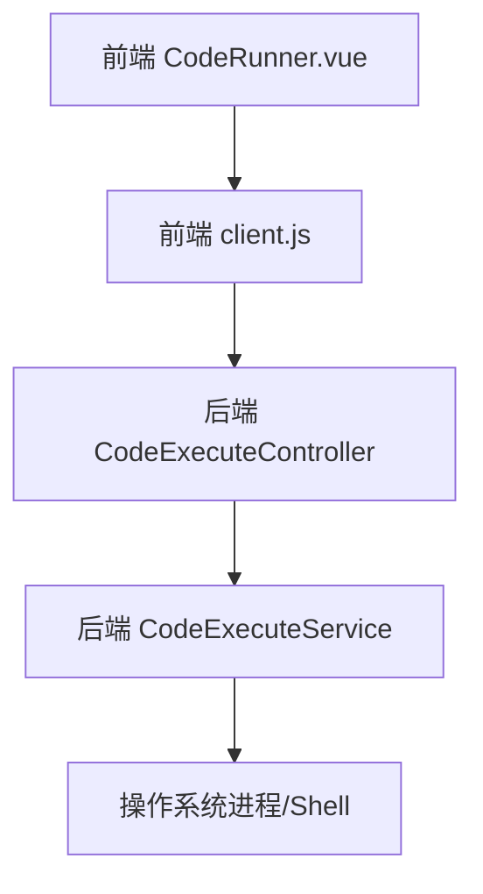
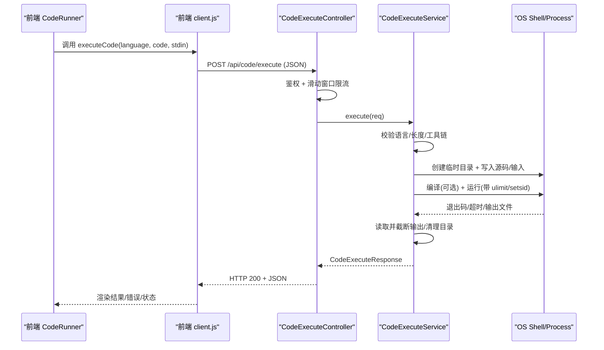
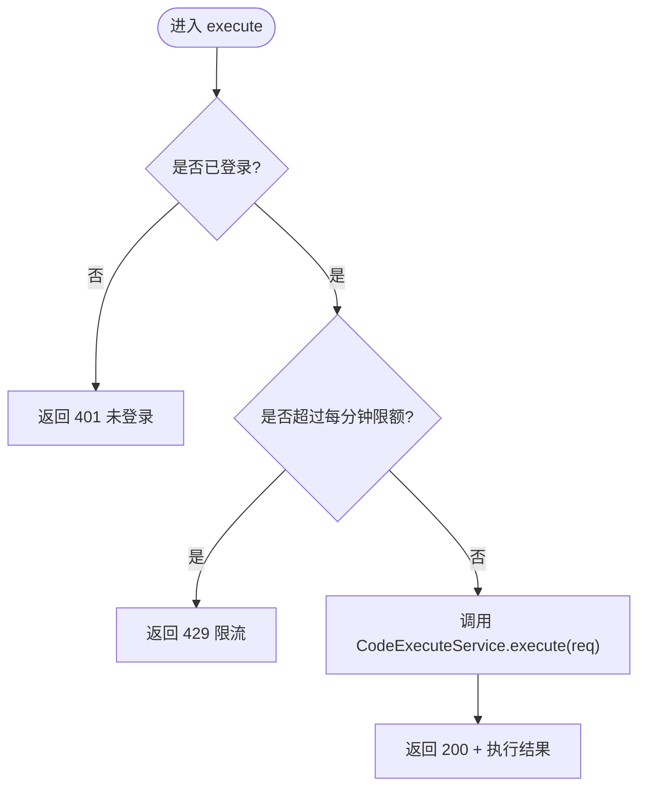
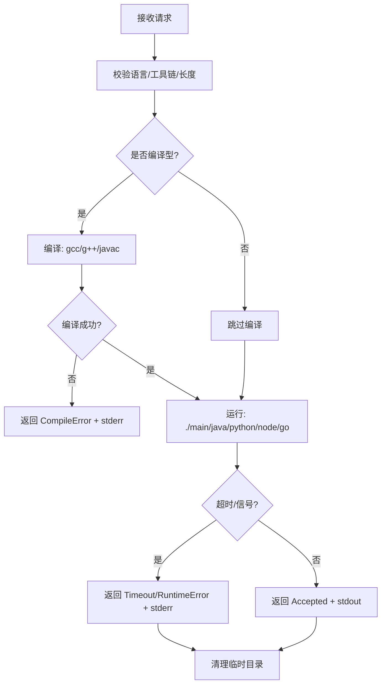
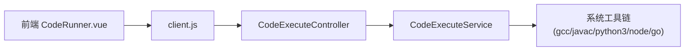
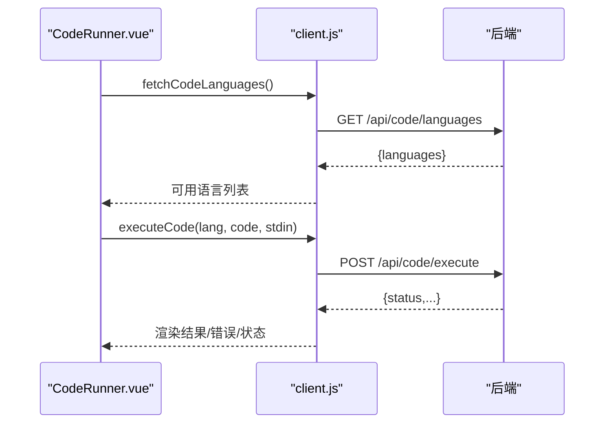

# 代码执行API

<cite>
**本文引用的文件**
- [CodeExecuteController.java](file://backend/src/main/java/com/suanfa/controller/CodeExecuteController.java)
- [CodeExecuteService.java](file://backend/src/main/java/com/suanfa/service/CodeExecuteService.java)
- [CodeExecuteRequest.java](file://backend/src/main/java/com/suanfa/dto/CodeExecuteRequest.java)
- [CodeExecuteResponse.java](file://backend/src/main/java/com/suanfa/dto/CodeExecuteResponse.java)
- [application.yml](file://backend/src/main/resources/application.yml)
- [client.js](file://suanfa_vue/src/api/client.js)
- [CodeRunner.vue](file://suanfa_vue/src/components/common/CodeRunner.vue)
</cite>

## 目录
1. [简介](#简介)
2. [项目结构](#项目结构)
3. [核心组件](#核心组件)
4. [架构总览](#架构总览)
5. [接口规范](#接口规范)
6. [详细组件分析](#详细组件分析)
7. [依赖关系分析](#依赖关系分析)
8. [性能与安全](#性能与安全)
9. [前端集成指南](#前端集成指南)
10. [故障排查](#故障排查)
11. [结论](#结论)

## 简介
本文件为“代码工作台”的完整后端 API 文档，覆盖代码编译运行、语言支持查询、沙箱安全与限流等能力。面向前端开发者提供在线代码编辑器的后端集成指南，包括异步执行、结果展示、错误处理与最佳实践。

## 项目结构
- 后端（Spring Boot）
  - 控制器：暴露 /api/code 下的两个接口
  - 服务层：封装执行流程、工具链检测、超时与资源限制、输出截断与清理
  - DTO：请求与响应数据结构
  - 配置：超时秒数、限流配额等通过 application.yml 注入
- 前端（Vue）
  - API 客户端：封装 fetch 调用，统一错误处理与降级策略
  - 组件：代码编辑器、输入参数面板、结果展示与状态提示

图表来源
- [CodeRunner.vue:189-238](file://suanfa_vue/src/components/common/CodeRunner.vue#L189-L238)
- [client.js:331-347](file://suanfa_vue/src/api/client.js#L331-L347)
- [CodeExecuteController.java:42-58](file://backend/src/main/java/com/suanfa/controller/CodeExecuteController.java#L42-L58)
- [CodeExecuteService.java:89-191](file://backend/src/main/java/com/suanfa/service/CodeExecuteService.java#L89-L191)

章节来源
- [CodeExecuteController.java:1-82](file://backend/src/main/java/com/suanfa/controller/CodeExecuteController.java#L1-L82)
- [CodeExecuteService.java:1-317](file://backend/src/main/java/com/suanfa/service/CodeExecuteService.java#L1-L317)
- [application.yml:92-96](file://backend/src/main/resources/application.yml#L92-L96)
- [client.js:331-347](file://suanfa_vue/src/api/client.js#L331-L347)
- [CodeRunner.vue:1-238](file://suanfa_vue/src/components/common/CodeRunner.vue#L1-L238)

## 核心组件
- 控制器 CodeExecuteController
  - GET /api/code/languages：返回当前服务器可用的编程语言列表
  - POST /api/code/execute：提交代码进行编译与运行（需登录 + 限流）
- 服务 CodeExecuteService
  - 支持语言：c, cpp, python, java, go, javascript
  - 执行流程：创建临时工作目录 → 写入源码与输入 → 可选编译 → 运行并捕获输出 → 清理
  - 安全机制：ulimit CPU/文件大小/虚存限制、setsid 进程组隔离、wall-time 超时 kill、输出截断、长度校验
- DTO
  - CodeExecuteRequest：language, code, stdin
  - CodeExecuteResponse：status, stdout, stderr, compileError, exitCode, timeMs, truncated, supportedLanguages
- 配置 application.yml
  - suanfa.code.compile-timeout-seconds
  - suanfa.code.run-timeout-seconds
  - suanfa.code.rate-per-minute

章节来源
- [CodeExecuteController.java:42-58](file://backend/src/main/java/com/suanfa/controller/CodeExecuteController.java#L42-L58)
- [CodeExecuteService.java:47-82](file://backend/src/main/java/com/suanfa/service/CodeExecuteService.java#L47-L82)
- [CodeExecuteRequest.java:1-6](file://backend/src/main/java/com/suanfa/dto/CodeExecuteRequest.java#L1-L6)
- [CodeExecuteResponse.java:1-25](file://backend/src/main/java/com/suanfa/dto/CodeExecuteResponse.java#L1-L25)
- [application.yml:92-96](file://backend/src/main/resources/application.yml#L92-L96)

## 架构总览

图表来源
- [CodeRunner.vue:189-238](file://suanfa_vue/src/components/common/CodeRunner.vue#L189-L238)
- [client.js:331-347](file://suanfa_vue/src/api/client.js#L331-L347)
- [CodeExecuteController.java:42-58](file://backend/src/main/java/com/suanfa/controller/CodeExecuteController.java#L42-L58)
- [CodeExecuteService.java:89-191](file://backend/src/main/java/com/suanfa/service/CodeExecuteService.java#L89-L191)

## 接口规范

### 通用说明
- 基础路径：/api
- 认证：POST /api/code/execute 需要登录（未登录返回 401）
- 限流：按用户每分钟次数限制（默认 15 次/分钟），超限返回 429
- Content-Type：application/json
- 字符集：UTF-8

### 获取可用语言
- 方法：GET
- URL：/api/code/languages
- 请求体：无
- 响应体：
  - languages: string[]（当前服务器已安装的工具链对应的语言名）
- 示例
  - 请求：GET /api/code/languages
  - 响应：{"languages":["python","javascript","go","java","cpp","c"]}

章节来源
- [CodeExecuteController.java:42-45](file://backend/src/main/java/com/suanfa/controller/CodeExecuteController.java#L42-L45)
- [CodeExecuteService.java:77-82](file://backend/src/main/java/com/suanfa/service/CodeExecuteService.java#L77-L82)

### 执行代码
- 方法：POST
- URL：/api/code/execute
- 请求体：
  - language: string（如 c, cpp, python, java, go, javascript；大小写不敏感，支持别名）
  - code: string（源代码；空或超长将直接返回错误）
  - stdin: string（标准输入；超长将直接返回错误）
- 成功响应（HTTP 200）：
  - status: Accepted | CompileError | RuntimeError | Timeout | Unsupported
  - stdout: string（程序标准输出）
  - stderr: string（程序标准错误/编译错误）
  - compileError: string?（仅编译型语言且编译失败时非空）
  - exitCode: number?（进程退出码）
  - timeMs: number（耗时毫秒）
  - truncated: boolean（stdout/stderr 是否被截断）
  - supportedLanguages: string[]?（当 status=Unsupported 时返回，用于前端置灰不可用语言）
- 错误响应
  - 401：未登录
  - 429：触发限流
  - 其他异常由全局异常处理器包装

- 示例（Python）
  - 请求：
    - POST /api/code/execute
    - Body: {"language":"python","code":"print('hello')","stdin":""}
  - 响应：
    - {
        "status":"Accepted",
        "stdout":"hello",
        "stderr":"",
        "exitCode":0,
        "timeMs":120,
        "truncated":false
      }

- 示例（C++ 编译错误）
  - 请求：
    - POST /api/code/execute
    - Body: {"language":"cpp","code":"int main() { return ; }","stdin":""}
  - 响应：
    - {
        "status":"CompileError",
        "compileError":"...编译器报错...",
        "exitCode":1,
        "timeMs":200,
        "truncated":false
      }

- 示例（Java 动态类名）
  - 若代码中声明 public class Sol，则自动以 Sol.java 编译并以 Sol 作为入口类运行。

- 示例（Go 缓存隔离）
  - Go 构建缓存与 GOPATH 指向本次执行的临时目录，确保每次执行互不影响。

章节来源
- [CodeExecuteController.java:47-58](file://backend/src/main/java/com/suanfa/controller/CodeExecuteController.java#L47-L58)
- [CodeExecuteService.java:89-191](file://backend/src/main/java/com/suanfa/service/CodeExecuteService.java#L89-L191)
- [CodeExecuteRequest.java:1-6](file://backend/src/main/java/com/suanfa/dto/CodeExecuteRequest.java#L1-L6)
- [CodeExecuteResponse.java:1-25](file://backend/src/main/java/com/suanfa/dto/CodeExecuteResponse.java#L1-L25)

## 详细组件分析

### 控制器：CodeExecuteController
- 职责
  - 暴露 /api/code/languages 与 /api/code/execute
  - 鉴权：通过 @CurrentUserId 解析当前用户，未登录返回 401
  - 限流：基于用户 ID 的滑动窗口（每分钟 N 次），超限返回 429
- 关键实现要点
  - 限流使用并发安全的 Map + Deque，定期清理过期条目
  - 限流阈值来自配置 suanfa.code.rate-per-minute

图表来源
- [CodeExecuteController.java:47-80](file://backend/src/main/java/com/suanfa/controller/CodeExecuteController.java#L47-L80)

章节来源
- [CodeExecuteController.java:18-82](file://backend/src/main/java/com/suanfa/controller/CodeExecuteController.java#L18-L82)

### 服务：CodeExecuteService
- 职责
  - 校验语言与工具链可用性
  - 校验代码与输入长度
  - 创建独立临时目录，写入源码与输入
  - 编译型语言先编译，再运行；解释型直接运行
  - 使用 setsid + bash 启动子进程，设置 ulimit 限制 CPU/文件大小/虚存
  - 超时控制：wall-time 超时后按进程组 kill
  - 输出截断：stdout/stderr 最大 64KB，超出追加提示
  - 清理：finally 递归删除临时目录
- 支持语言与工具链
  - c/c++：gcc/g++ 编译，./main 运行，内存上限 512MB（虚存）
  - python：python3 解释执行
  - java：javac 编译，java -Xmx128m -XX:+UseSerialGC 运行，自动识别类名
  - go：go run 运行，GOCACHE/GOPATH 指向临时目录
  - javascript：node 运行
- 超时与资源限制
  - 编译超时：suanfa.code.compile-timeout-seconds（默认 10s）
  - 运行超时：suanfa.code.run-timeout-seconds（默认 10s）
  - ulimit -t 限制 CPU 时间；-f 限制文件大小；-v 限制虚存（部分语言不适用）
  - 进程组 kill：kill -9 -pid，回退 destroyForcibly

图表来源
- [CodeExecuteService.java:89-191](file://backend/src/main/java/com/suanfa/service/CodeExecuteService.java#L89-L191)
- [CodeExecuteService.java:216-257](file://backend/src/main/java/com/suanfa/service/CodeExecuteService.java#L216-L257)

章节来源
- [CodeExecuteService.java:47-82](file://backend/src/main/java/com/suanfa/service/CodeExecuteService.java#L47-L82)
- [CodeExecuteService.java:89-191](file://backend/src/main/java/com/suanfa/service/CodeExecuteService.java#L89-L191)
- [CodeExecuteService.java:216-257](file://backend/src/main/java/com/suanfa/service/CodeExecuteService.java#L216-L257)
- [application.yml:92-96](file://backend/src/main/resources/application.yml#L92-L96)

### DTO 数据模型
- CodeExecuteRequest
  - language: 语言标识
  - code: 源代码
  - stdin: 标准输入
- CodeExecuteResponse
  - status: 执行状态
  - stdout/stderr: 输出/错误
  - compileError: 编译错误信息
  - exitCode: 进程退出码
  - timeMs: 耗时
  - truncated: 输出是否被截断
  - supportedLanguages: 可用语言列表（仅在 Unsupported 时返回）

章节来源
- [CodeExecuteRequest.java:1-6](file://backend/src/main/java/com/suanfa/dto/CodeExecuteRequest.java#L1-L6)
- [CodeExecuteResponse.java:1-25](file://backend/src/main/java/com/suanfa/dto/CodeExecuteResponse.java#L1-L25)

## 依赖关系分析
- 控制器依赖服务层完成业务逻辑
- 服务层依赖操作系统命令（which/gcc/g++/javac/python3/node/go）
- 前端通过 client.js 调用后端 API，并在后端不可用时降级
- 配置通过 application.yml 注入到服务层与控制器

图表来源
- [CodeRunner.vue:189-238](file://suanfa_vue/src/components/common/CodeRunner.vue#L189-L238)
- [client.js:331-347](file://suanfa_vue/src/api/client.js#L331-L347)
- [CodeExecuteController.java:42-58](file://backend/src/main/java/com/suanfa/controller/CodeExecuteController.java#L42-L58)
- [CodeExecuteService.java:285-293](file://backend/src/main/java/com/suanfa/service/CodeExecuteService.java#L285-L293)

章节来源
- [CodeExecuteService.java:285-293](file://backend/src/main/java/com/suanfa/service/CodeExecuteService.java#L285-L293)
- [application.yml:92-96](file://backend/src/main/resources/application.yml#L92-L96)

## 性能与安全
- 性能
  - 每次执行创建独立临时目录，避免污染与冲突
  - 输出截断防止大输出阻塞网络与前端渲染
  - Java 运行时限制堆大小与 GC 策略，降低内存抖动
  - Go 构建缓存隔离，避免跨执行干扰
- 安全
  - 进程级隔离：setsid 使子进程成为独立会话/进程组，便于整体回收
  - 资源限制：ulimit -t（CPU 秒）、-f（文件大小）、-v（虚存，部分语言不适用）
  - 超时保护：wall-time 超时后按进程组 kill，防止僵尸进程
  - 输入/代码长度限制：防止恶意超大 payload
  - 输出截断：防止 OOM 或磁盘占用过大
  - 鉴权与限流：必须登录，按用户每分钟次数限制

章节来源
- [CodeExecuteService.java:216-257](file://backend/src/main/java/com/suanfa/service/CodeExecuteService.java#L216-L257)
- [CodeExecuteService.java:268-283](file://backend/src/main/java/com/suanfa/service/CodeExecuteService.java#L268-L283)
- [CodeExecuteController.java:60-80](file://backend/src/main/java/com/suanfa/controller/CodeExecuteController.java#L60-L80)

## 前端集成指南
- 获取可用语言
  - 调用 fetchCodeLanguages()，根据返回的 languages 数组禁用不可用语言
- 执行代码
  - 调用 executeCode(language, code, stdin)，得到 CodeExecuteResponse
  - 根据 status 显示不同状态：Accepted/CompileError/RuntimeError/Timeout/Unsupported
  - 若 status=Unsupported，使用 supportedLanguages 更新前端语言选项
- 错误处理
  - 401：提示重新登录
  - 429：提示稍后再试
  - 网络异常：降级本地模式或提示重试
- 用户体验
  - 运行中禁用按钮，显示“运行中…”
  - 输出区域支持滚动与换行
  - 函数模式下自动生成测试机，自由模式直接传入 stdin
  - Ctrl+Enter 快捷运行

图表来源
- [CodeRunner.vue:189-238](file://suanfa_vue/src/components/common/CodeRunner.vue#L189-L238)
- [client.js:331-347](file://suanfa_vue/src/api/client.js#L331-L347)

章节来源
- [CodeRunner.vue:189-238](file://suanfa_vue/src/components/common/CodeRunner.vue#L189-L238)
- [client.js:331-347](file://suanfa_vue/src/api/client.js#L331-L347)

## 故障排查
- 常见问题
  - 未登录：检查 Cookie/Token，确保已登录
  - 限流：等待下一分钟或调整 rate-per-minute
  - 超时：增大 compile/run timeout 或优化代码
  - 工具链缺失：确认 gcc/g++/javac/python3/node/go 已安装
  - 输出过长：关注 truncated 标志，必要时分页或下载日志
- 定位步骤
  - 查看后端日志中的执行失败原因
  - 检查临时目录是否被正确清理
  - 验证 ulimit 限制是否生效
  - 对比 stdout/stderr 内容定位问题

章节来源
- [CodeExecuteService.java:180-191](file://backend/src/main/java/com/suanfa/service/CodeExecuteService.java#L180-L191)
- [CodeExecuteService.java:304-315](file://backend/src/main/java/com/suanfa/service/CodeExecuteService.java#L304-L315)

## 结论
该代码执行 API 提供了安全可控的代码编译与运行能力，支持多种主流语言，具备完善的超时、资源限制与输出截断机制。配合前端的 CodeRunner 组件，可实现流畅的在线编程体验。生产环境建议结合容器化进一步隔离执行环境，以获得更强的安全性与稳定性。