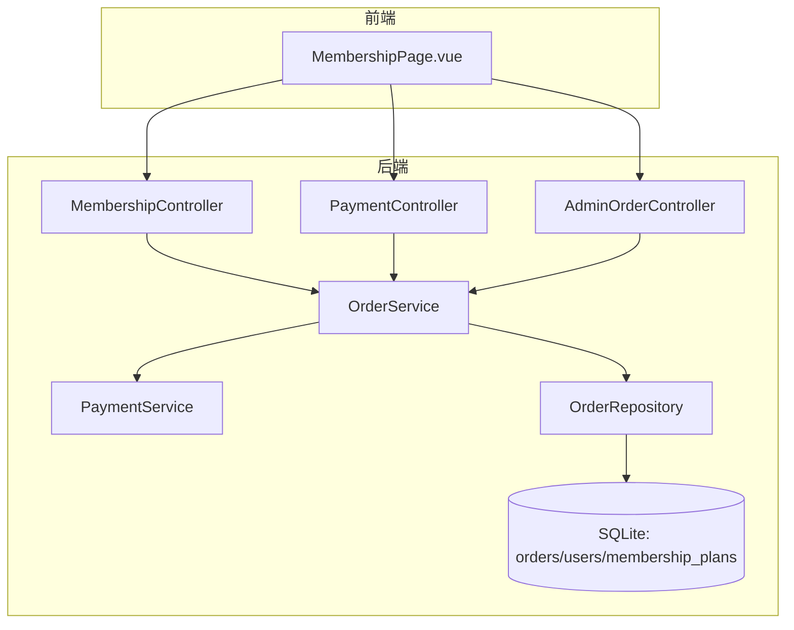
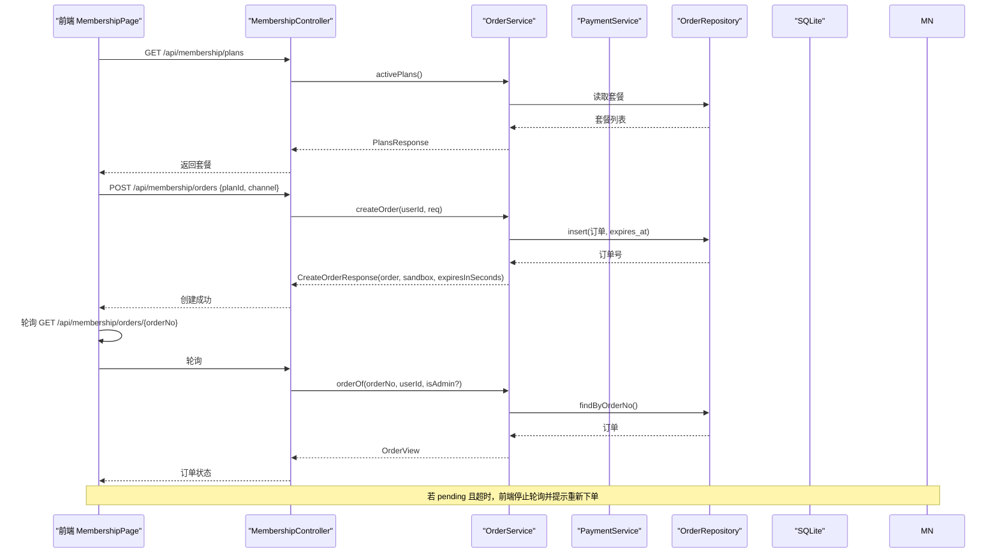
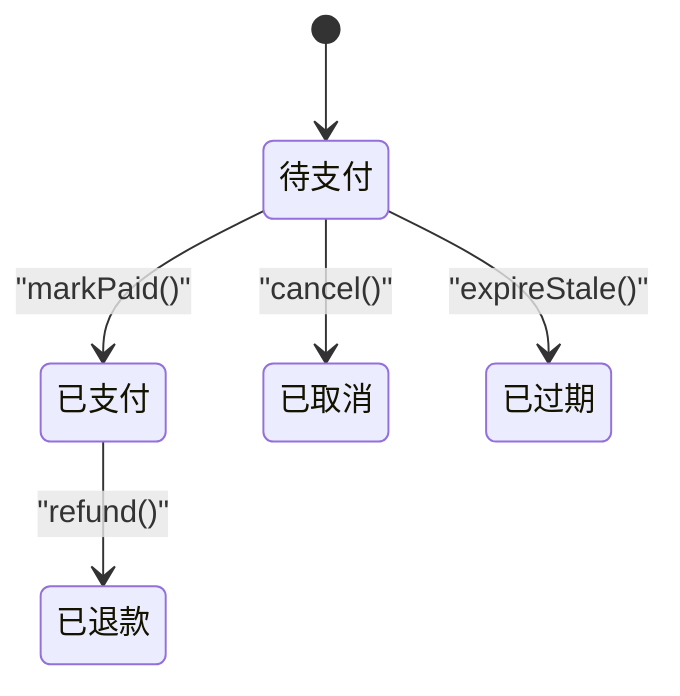
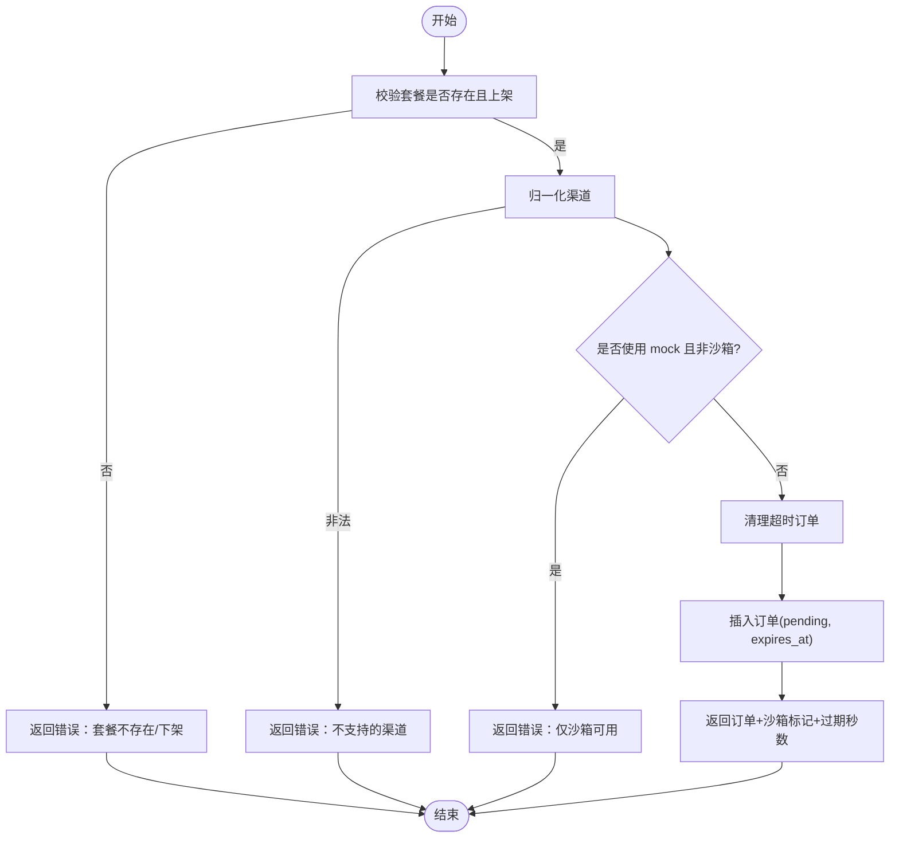
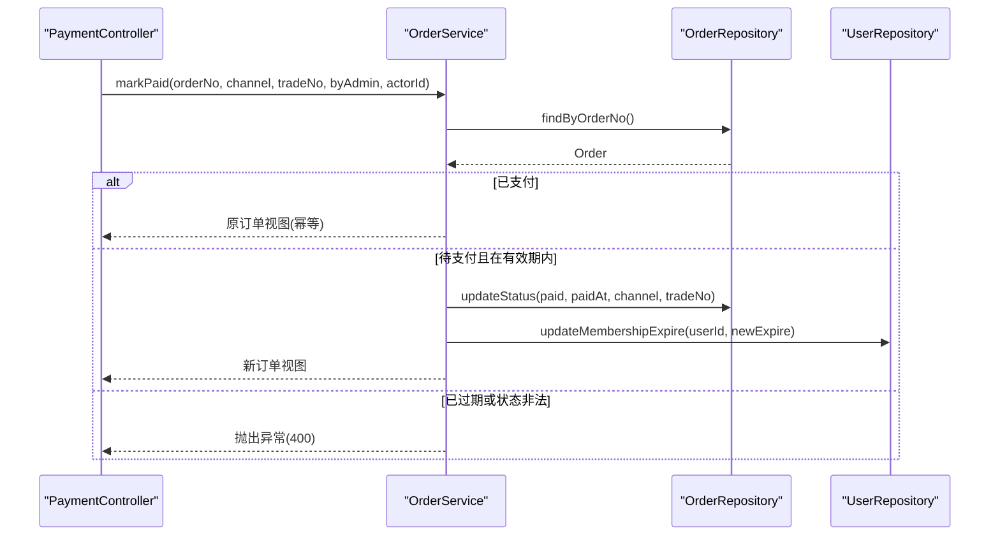
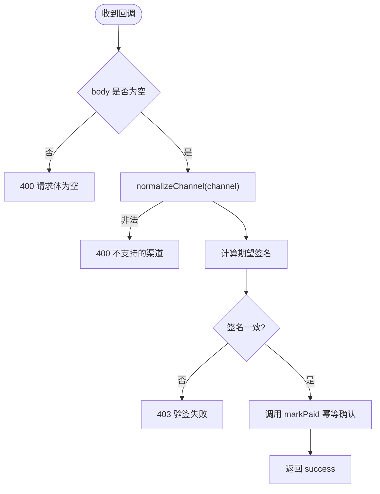
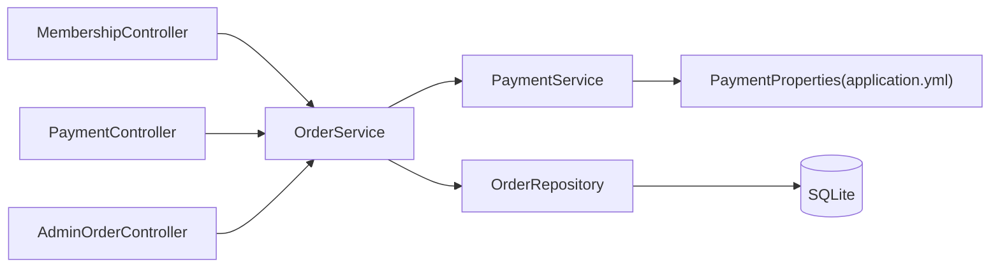

# 会员支付系统

<cite>
**本文引用的文件**
- [SuanfaApplication.java](file://backend/src/main/java/com/suanfa/SuanfaApplication.java)
- [application.yml](file://backend/src/main/resources/application.yml)
- [pom.xml](file://backend/pom.xml)
- [PaymentController.java](file://backend/src/main/java/com/suanfa/controller/PaymentController.java)
- [MembershipController.java](file://backend/src/main/java/com/suanfa/controller/MembershipController.java)
- [AdminOrderController.java](file://backend/src/main/java/com/suanfa/controller/AdminOrderController.java)
- [PaymentService.java](file://backend/src/main/java/com/suanfa/service/PaymentService.java)
- [OrderService.java](file://backend/src/main/java/com/suanfa/service/OrderService.java)
- [OrderRepository.java](file://backend/src/main/java/com/suanfa/repository/OrderRepository.java)
- [Order.java](file://backend/src/main/java/com/suanfa/entity/Order.java)
- [MembershipPlan.java](file://backend/src/main/java/com/suanfa/entity/MembershipPlan.java)
- [MembershipDtos.java](file://backend/src/main/java/com/suanfa/dto/MembershipDtos.java)
- [schema.sql](file://backend/src/main/resources/schema.sql)
- [MembershipPage.vue](file://suanfa_vue/src/components/common/MembershipPage.vue)
</cite>

## 目录
1. [简介](#简介)
2. [项目结构](#项目结构)
3. [核心组件](#核心组件)
4. [架构总览](#架构总览)
5. [详细组件分析](#详细组件分析)
6. [依赖关系分析](#依赖关系分析)
7. [性能与可靠性](#性能与可靠性)
8. [故障排查指南](#故障排查指南)
9. [结论](#结论)
10. [附录：API 参考](#附录api-参考)

## 简介
本系统为算法学习网站的“会员与支付”模块，提供套餐展示、下单、支付确认（含沙箱模拟）、订单管理、营收统计等功能。当前采用 SQLite + JdbcTemplate 的轻量实现，未接入真实支付网关；通过 HMAC-SHA256 验签预留回调安全能力，便于后续接入支付宝/微信等渠道。前端以 Vue 页面呈现会员中心、收银台弹窗、订单列表与状态轮询。

## 项目结构
后端基于 Spring Boot，按控制器、服务、仓储、实体、DTO、配置分层组织；前端位于 suanfa_vue，会员中心页面负责套餐选择、下单、收银台交互与订单轮询。

图表来源
- [MembershipPage.vue:1-120](file://suanfa_vue/src/components/common/MembershipPage.vue#L1-L120)
- [MembershipController.java:48-96](file://backend/src/main/java/com/suanfa/controller/MembershipController.java#L48-L96)
- [PaymentController.java:49-86](file://backend/src/main/java/com/suanfa/controller/PaymentController.java#L49-L86)
- [AdminOrderController.java:46-79](file://backend/src/main/java/com/suanfa/controller/AdminOrderController.java#L46-L79)
- [OrderService.java:121-229](file://backend/src/main/java/com/suanfa/service/OrderService.java#L121-L229)
- [PaymentService.java:57-87](file://backend/src/main/java/com/suanfa/service/PaymentService.java#L57-L87)
- [OrderRepository.java:50-128](file://backend/src/main/java/com/suanfa/repository/OrderRepository.java#L50-L128)

章节来源
- [application.yml:1-132](file://backend/src/main/resources/application.yml#L1-L132)
- [pom.xml:24-84](file://backend/pom.xml#L24-L84)
- [SuanfaApplication.java:10-20](file://backend/src/main/java/com/suanfa/SuanfaApplication.java#L10-L20)

## 核心组件
- 控制器层
  - 用户端：套餐查询、会员状态、下单、我的订单、取消订单
  - 支付端：沙箱模拟支付、网关异步回调
  - 管理端：订单列表、统计、手工确认支付、退款
- 服务层
  - OrderService：订单生命周期、会员激活、统计、权限校验
  - PaymentService：支付链接生成、回调签名校验、渠道归一化
- 数据层
  - OrderRepository：订单读写、过期清理、聚合统计
  - 实体与 DTO：Order、MembershipPlan、MembershipDtos
- 配置
  - application.yml：数据库、JWT、邮件、AI、支付沙箱与回调密钥等
  - schema.sql：orders、membership_plans、users 等表结构

章节来源
- [MembershipController.java:48-96](file://backend/src/main/java/com/suanfa/controller/MembershipController.java#L48-L96)
- [PaymentController.java:49-86](file://backend/src/main/java/com/suanfa/controller/PaymentController.java#L49-L86)
- [AdminOrderController.java:46-79](file://backend/src/main/java/com/suanfa/controller/AdminOrderController.java#L46-L79)
- [OrderService.java:78-229](file://backend/src/main/java/com/suanfa/service/OrderService.java#L78-L229)
- [PaymentService.java:39-87](file://backend/src/main/java/com/suanfa/service/PaymentService.java#L39-L87)
- [OrderRepository.java:50-177](file://backend/src/main/java/com/suanfa/repository/OrderRepository.java#L50-L177)
- [Order.java:10-34](file://backend/src/main/java/com/suanfa/entity/Order.java#L10-L34)
- [MembershipPlan.java:7-17](file://backend/src/main/java/com/suanfa/entity/MembershipPlan.java#L7-L17)
- [MembershipDtos.java:31-111](file://backend/src/main/java/com/suanfa/dto/MembershipDtos.java#L31-L111)
- [application.yml:117-126](file://backend/src/main/resources/application.yml#L117-L126)
- [schema.sql:87-121](file://backend/src/main/resources/schema.sql#L87-L121)

## 架构总览
系统采用前后端分离架构：前端会员中心发起下单与轮询，后端通过控制器路由到服务层完成业务逻辑，持久化至 SQLite。支付回调经统一验签后进入同一幂等处理路径。

图表来源
- [MembershipController.java:48-96](file://backend/src/main/java/com/suanfa/controller/MembershipController.java#L48-L96)
- [OrderService.java:121-164](file://backend/src/main/java/com/suanfa/service/OrderService.java#L121-L164)
- [OrderRepository.java:50-80](file://backend/src/main/java/com/suanfa/repository/OrderRepository.java#L50-L80)

## 详细组件分析

### 订单与会员状态机
订单状态流转：pending → paid | cancelled | expired；paid 后可 → refunded。会员到期时间按“max(现有到期, now)+天数”顺延，避免清零。

图表来源
- [Order.java:25-34](file://backend/src/main/java/com/suanfa/entity/Order.java#L25-L34)
- [OrderService.java:166-229](file://backend/src/main/java/com/suanfa/service/OrderService.java#L166-L229)
- [OrderRepository.java:82-99](file://backend/src/main/java/com/suanfa/repository/OrderRepository.java#L82-L99)

章节来源
- [Order.java:10-34](file://backend/src/main/java/com/suanfa/entity/Order.java#L10-L34)
- [OrderService.java:166-229](file://backend/src/main/java/com/suanfa/service/OrderService.java#L166-L229)

### 下单流程
- 校验套餐与渠道，必要时拒绝 mock 渠道（非沙箱）
- 生成订单号与过期时间，落库 pending
- 返回订单视图与倒计时秒数供前端轮询

图表来源
- [OrderService.java:121-145](file://backend/src/main/java/com/suanfa/service/OrderService.java#L121-L145)
- [PaymentService.java:47-51](file://backend/src/main/java/com/suanfa/service/PaymentService.java#L47-L51)
- [OrderRepository.java:50-70](file://backend/src/main/java/com/suanfa/repository/OrderRepository.java#L50-L70)

章节来源
- [OrderService.java:121-145](file://backend/src/main/java/com/suanfa/service/OrderService.java#L121-L145)

### 支付确认（幂等）
- markPaid 对重复回调幂等，已支付直接返回
- 校验订单仍在校验期内，否则置过期并报错
- 更新订单状态与流水号，计算新会员到期时间并写入用户表

图表来源
- [PaymentController.java:49-62](file://backend/src/main/java/com/suanfa/controller/PaymentController.java#L49-L62)
- [OrderService.java:187-217](file://backend/src/main/java/com/suanfa/service/OrderService.java#L187-L217)
- [OrderRepository.java:91-99](file://backend/src/main/java/com/suanfa/repository/OrderRepository.java#L91-L99)

章节来源
- [PaymentController.java:49-62](file://backend/src/main/java/com/suanfa/controller/PaymentController.java#L49-L62)
- [OrderService.java:187-217](file://backend/src/main/java/com/suanfa/service/OrderService.java#L187-L217)

### 支付回调验签
- 要求 body 包含 orderNo、amount、channel、tradeNo、sign
- 计算 HMAC_SHA256(secret, "orderNo|amount|channel|tradeNo")，常量时间比较
- 沙箱未配密钥放行并告警；生产未配密钥直接拒绝

图表来源
- [PaymentController.java:64-86](file://backend/src/main/java/com/suanfa/controller/PaymentController.java#L64-L86)
- [PaymentService.java:69-87](file://backend/src/main/java/com/suanfa/service/PaymentService.java#L69-L87)

章节来源
- [PaymentController.java:64-86](file://backend/src/main/java/com/suanfa/controller/PaymentController.java#L64-L86)
- [PaymentService.java:69-87](file://backend/src/main/java/com/suanfa/service/PaymentService.java#L69-L87)

### 管理端操作
- 订单列表：支持关键词（订单号/用户名）与状态过滤、分页
- 统计：各状态聚合 + 最近 7 日成交曲线（缺天补零）
- 手工确认支付与退款：仅管理员可操作

章节来源
- [AdminOrderController.java:46-79](file://backend/src/main/java/com/suanfa/controller/AdminOrderController.java#L46-L79)
- [OrderService.java:233-270](file://backend/src/main/java/com/suanfa/service/OrderService.java#L233-L270)
- [OrderRepository.java:134-150](file://backend/src/main/java/com/suanfa/repository/OrderRepository.java#L134-L150)

### 前端会员中心与收银台
- 展示套餐、会员状态、我的订单
- 下单后打开收银台弹窗，显示倒计时与演示收款码
- 每 3 秒轮询订单状态，支付成功后刷新会员状态
- 沙箱模式提供“模拟支付成功”按钮

章节来源
- [MembershipPage.vue:1-120](file://suanfa_vue/src/components/common/MembershipPage.vue#L1-L120)
- [MembershipPage.vue:132-218](file://suanfa_vue/src/components/common/MembershipPage.vue#L132-L218)
- [MembershipPage.vue:249-301](file://suanfa_vue/src/components/common/MembershipPage.vue#L249-L301)

## 依赖关系分析
- 控制器依赖服务层，服务层组合 PaymentService 与 OrderRepository
- OrderRepository 通过 JdbcTemplate 直接访问 SQLite
- 配置项集中在 application.yml，PaymentProperties 注入到服务层

图表来源
- [MembershipController.java:40-46](file://backend/src/main/java/com/suanfa/controller/MembershipController.java#L40-L46)
- [PaymentController.java:39-47](file://backend/src/main/java/com/suanfa/controller/PaymentController.java#L39-L47)
- [AdminOrderController.java:38-44](file://backend/src/main/java/com/suanfa/controller/AdminOrderController.java#L38-L44)
- [OrderService.java:60-74](file://backend/src/main/java/com/suanfa/service/OrderService.java#L60-L74)
- [PaymentService.java:33-37](file://backend/src/main/java/com/suanfa/service/PaymentService.java#L33-L37)
- [OrderRepository.java:21-48](file://backend/src/main/java/com/suanfa/repository/OrderRepository.java#L21-L48)

章节来源
- [application.yml:117-126](file://backend/src/main/resources/application.yml#L117-L126)
- [pom.xml:24-84](file://backend/pom.xml#L24-L84)

## 性能与可靠性
- 幂等设计：markPaid 对重复回调幂等，避免重复延长会员
- 超时清理：读路径主动 expireStale，减少脏数据
- 金额单位：统一使用“分”，避免浮点误差
- 时间格式：UTC 字符串直比，简化比较逻辑
- 连接与存储：SQLite 适合轻量场景；如需高并发建议迁移至 MySQL/PostgreSQL 并增加索引
- 回调安全：生产环境必须配置 notify-secret，否则拒绝回调

[本节为通用指导，不直接分析具体文件]

## 故障排查指南
- 无法下单
  - 检查套餐是否上架、渠道是否合法、是否误用 mock（非沙箱）
  - 关注 400 响应中的 message
- 订单一直 pending
  - 检查 expires_at 是否已过期；前端轮询应停止并提示重新下单
  - 确认是否调用了 mock 支付或真实网关回调
- 回调被拒绝
  - 核对 sign 计算参数顺序与 secret 配置；生产未配密钥将直接拒绝
- 会员未生效
  - 检查 markPaid 是否成功执行；确认用户 membership_expire_at 是否更新
- 管理端无权限
  - 确认登录身份与角色判定逻辑

章节来源
- [PaymentController.java:49-86](file://backend/src/main/java/com/suanfa/controller/PaymentController.java#L49-L86)
- [OrderService.java:187-229](file://backend/src/main/java/com/suanfa/service/OrderService.java#L187-L229)
- [PaymentService.java:69-87](file://backend/src/main/java/com/suanfa/service/PaymentService.java#L69-L87)

## 结论
该会员支付模块以最小依赖实现了完整的下单、支付确认、订单管理与统计闭环，并通过沙箱模式与 HMAC 验签为后续接入真实支付渠道预留了清晰扩展点。建议在生产环境关闭沙箱、配置回调密钥，并根据业务规模评估数据库与缓存方案。

[本节为总结性内容，不直接分析具体文件]

## 附录：API 参考
- 用户端
  - GET /api/membership/plans：获取套餐列表（公开）
  - GET /api/membership/status：会员状态（需登录）
  - POST /api/membership/orders：下单（需登录）
  - GET /api/membership/orders：我的订单（需登录）
  - GET /api/membership/orders/{orderNo}：订单详情（需登录）
  - POST /api/membership/orders/{orderNo}/cancel：取消订单（需登录）
- 支付端
  - POST /api/payment/mock/{orderNo}：沙箱模拟支付（需登录，本人或管理员）
  - POST /api/payment/notify/{channel}：网关回调（验签后幂等确认）
- 管理端
  - GET /api/admin/orders：订单列表（需管理员）
  - GET /api/admin/orders/stats：营收统计（需管理员）
  - POST /api/admin/orders/{orderNo}/mark-paid：手工确认支付（需管理员）
  - POST /api/admin/orders/{orderNo}/refund：标记退款（需管理员）

章节来源
- [MembershipController.java:48-96](file://backend/src/main/java/com/suanfa/controller/MembershipController.java#L48-L96)
- [PaymentController.java:49-86](file://backend/src/main/java/com/suanfa/controller/PaymentController.java#L49-L86)
- [AdminOrderController.java:46-79](file://backend/src/main/java/com/suanfa/controller/AdminOrderController.java#L46-L79)