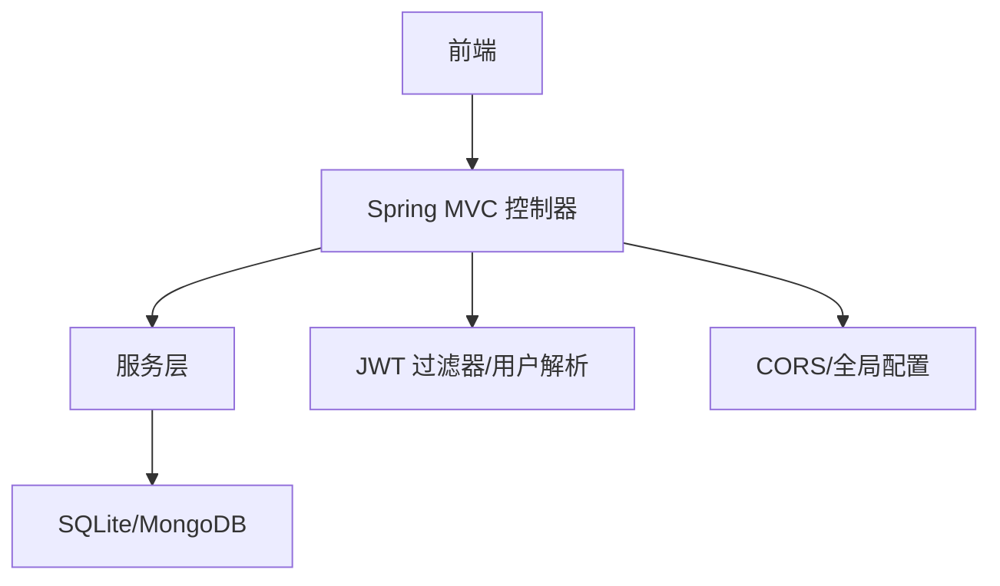
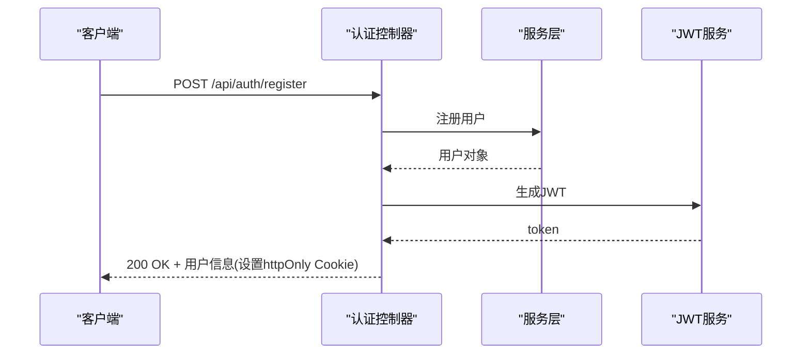
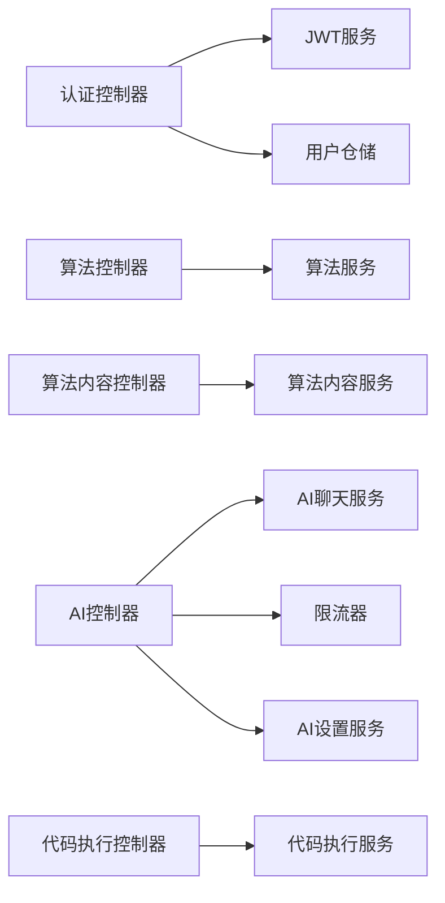

# 后端API文档

<cite>
**本文引用的文件**
- [AuthController.java](file://backend/src/main/java/com/suanfa/controller/AuthController.java)
- [AlgorithmController.java](file://backend/src/main/java/com/suanfa/controller/AlgorithmController.java)
- [AlgorithmContentController.java](file://backend/src/main/java/com/suanfa/controller/AlgorithmContentController.java)
- [AiController.java](file://backend/src/main/java/com/suanfa/controller/AiController.java)
- [AiSettingsController.java](file://backend/src/main/java/com/suanfa/controller/AiSettingsController.java)
- [CodeExecuteController.java](file://backend/src/main/java/com/suanfa/controller/CodeExecuteController.java)
- [WebConfig.java](file://backend/src/main/java/com/suanfa/config/WebConfig.java)
- [application.yml](file://backend/src/main/resources/application.yml)
- [AuthRequest.java](file://backend/src/main/java/com/suanfa/dto/AuthRequest.java)
- [ChatRequest.java](file://backend/src/main/java/com/suanfa/dto/ChatRequest.java)
- [ChatResponse.java](file://backend/src/main/java/com/suanfa/dto/ChatResponse.java)
- [CodeExecuteRequest.java](file://backend/src/main/java/com/suanfa/dto/CodeExecuteRequest.java)
- [CodeExecuteResponse.java](file://backend/src/main/java/com/suanfa/dto/CodeExecuteResponse.java)
- [User.java](file://backend/src/main/java/com/suanfa/entity/User.java)
- [Algorithm.java](file://backend/src/main/java/com/suanfa/entity/Algorithm.java)
</cite>

## 目录
1. [简介](#简介)
2. [项目结构](#项目结构)
3. [核心组件](#核心组件)
4. [架构总览](#架构总览)
5. [详细接口说明](#详细接口说明)
6. [依赖关系分析](#依赖关系分析)
7. [性能与限流](#性能与限流)
8. [故障排查指南](#故障排查指南)
9. [结论](#结论)
10. [附录：版本、安全与最佳实践](#附录：版本安全与最佳实践)

## 简介
本文件为后端 RESTful API 的完整规范，覆盖认证授权、算法数据、AI 助教（对话、模型管理、限流）、代码执行等模块。每个接口均包含 HTTP 方法、URL、请求参数、响应格式、状态码、错误处理以及示例。同时提供版本管理策略、安全考虑与性能优化建议，帮助前端快速集成。

## 项目结构
后端采用 Spring Boot 分层结构：
- controller：对外暴露 REST 接口
- service：业务逻辑封装
- repository：数据访问
- entity/dto：实体与数据传输对象
- config/security：跨域、JWT 鉴权与用户解析
- resources：应用配置与数据库初始化脚本

图表来源
- [WebConfig.java:13-45](file://backend/src/main/java/com/suanfa/config/WebConfig.java#L13-L45)
- [application.yml:1-102](file://backend/src/main/resources/application.yml#L1-L102)

章节来源
- [WebConfig.java:13-45](file://backend/src/main/java/com/suanfa/config/WebConfig.java#L13-L45)
- [application.yml:1-102](file://backend/src/main/resources/application.yml#L1-L102)

## 核心组件
- 认证授权：基于 JWT + httpOnly Cookie；提供注册、登录、登出、当前用户查询。
- 算法数据：提供算法列表（支持分类筛选）与详情内容获取。
- AI 助教：一次性对话与 SSE 流式对话；模型清单与状态；管理员可配置上游中转站。
- 代码执行：查询支持语言、执行代码（编译/运行），具备独立限流。

章节来源
- [AuthController.java:15-93](file://backend/src/main/java/com/suanfa/controller/AuthController.java#L15-L93)
- [AlgorithmController.java:10-31](file://backend/src/main/java/com/suanfa/controller/AlgorithmController.java#L10-L31)
- [AlgorithmContentController.java:11-27](file://backend/src/main/java/com/suanfa/controller/AlgorithmContentController.java#L11-L27)
- [AiController.java:34-118](file://backend/src/main/java/com/suanfa/controller/AiController.java#L34-L118)
- [AiSettingsController.java:21-129](file://backend/src/main/java/com/suanfa/controller/AiSettingsController.java#L21-L129)
- [CodeExecuteController.java:18-81](file://backend/src/main/java/com/suanfa/controller/CodeExecuteController.java#L18-L81)

## 架构总览

图表来源
- [AuthController.java:28-51](file://backend/src/main/java/com/suanfa/controller/AuthController.java#L28-L51)

章节来源
- [AuthController.java:28-51](file://backend/src/main/java/com/suanfa/controller/AuthController.java#L28-L51)

## 详细接口说明

### 认证授权 API
基础路径：/api/auth

- 注册
  - 方法：POST
  - URL：/api/auth/register
  - 请求体：{ username, password }
  - 成功响应：200 OK，返回用户信息（不含密码）
  - 失败：
    - 409 Conflict：用户名已存在
    - 400 Bad Request：参数校验失败
  - 备注：成功后服务端会设置 httpOnly Cookie（名称见过滤器常量），有效期由配置决定

- 登录
  - 方法：POST
  - URL：/api/auth/login
  - 请求体：同注册
  - 成功响应：200 OK，返回用户信息并设置 httpOnly Cookie
  - 失败：401 Unauthorized（用户名或密码错误）

- 登出
  - 方法：POST
  - URL：/api/auth/logout
  - 成功响应：200 OK（清除 Cookie）

- 当前用户
  - 方法：GET
  - URL：/api/auth/me
  - 鉴权：需要有效 JWT（通过 Cookie 传递）
  - 成功响应：200 OK，返回用户信息
  - 失败：401 Unauthorized（未登录或无效令牌）

请求示例
- 登录
  - 请求：POST /api/auth/login
  - 请求体：{"username":"alice","password":"***"}
  - 响应：200 OK {"id":1,"username":"alice","createdAt":"..."}
- 登出
  - 请求：POST /api/auth/logout
  - 响应：200 OK

错误处理
- 统一错误体：{ message: "..." }
- 常见状态码：400、401、409

章节来源
- [AuthController.java:28-93](file://backend/src/main/java/com/suanfa/controller/AuthController.java#L28-L93)
- [application.yml:19-24](file://backend/src/main/resources/application.yml#L19-L24)

### 算法数据 API
基础路径：/api/algorithms

- 算法列表
  - 方法：GET
  - URL：/api/algorithms?category=可选值
  - 响应：200 OK，数组，元素字段包括 id、name、category、subCategory、difficulty、stability、description、complexity、route、complexityDetails
  - 说明：category 为空时返回全部；用于前端下拉筛选

- 算法详情
  - 方法：GET
  - URL：/api/algorithms/{id}
  - 响应：200 OK，返回算法元数据对象
  - 失败：404 Not Found（不存在）

- 算法详情内容
  - 方法：GET
  - URL：/api/algorithms/{id}/content
  - 响应：200 OK，返回详细内容对象
  - 失败：404 Not Found

请求示例
- 列表：GET /api/algorithms?category=sorting
- 详情：GET /api/algorithms/binary-search
- 内容：GET /api/algorithms/binary-search/content

章节来源
- [AlgorithmController.java:21-30](file://backend/src/main/java/com/suanfa/controller/AlgorithmController.java#L21-L30)
- [AlgorithmContentController.java:22-26](file://backend/src/main/java/com/suanfa/controller/AlgorithmContentController.java#L22-L26)
- [Algorithm.java:4-15](file://backend/src/main/java/com/suanfa/entity/Algorithm.java#L4-L15)

### AI 助教 API
基础路径：/api/ai

- 能力与状态
  - 方法：GET
  - URL：/api/ai/status
  - 鉴权：未登录仅返回 configured、loginRequired、ratePerMinute；登录后返回 baseUrl、models、modelDetails、defaultModel、providers、canManage
  - 响应键：
    - configured: boolean
    - loginRequired: boolean
    - baseUrl: string（登录后）
    - models: string[]（兼容旧前端）
    - modelDetails: 模型详细信息数组
    - defaultModel: string|nil
    - providers: 提供商分组信息
    - ratePerMinute: number
    - canManage: boolean（管理员）

- 模型清单
  - 方法：GET
  - URL：/api/ai/models
  - 鉴权：同上，未登录返回空清单
  - 响应：{ configured, loginRequired, models }

- 上游真实模型发现（仅管理员）
  - 方法：GET
  - URL：/api/ai/upstream-models?provider=可选
  - 鉴权：需登录且管理员
  - 响应：{ providers: [...] }
  - 失败：401/403/503（未配置）

- 一次性对话
  - 方法：POST
  - URL：/api/ai/chat
  - 鉴权：需登录
  - 请求体：{ messages: [{role,content}], model: 可选 }
  - 成功响应：200 OK，{ reply, model, refs }
  - 失败：
    - 400 Bad Request：参数非法
    - 429 Too Many Requests：超出每分钟限制
    - 502/503：上游不可用或未配置

- 流式对话（SSE）
  - 方法：POST
  - URL：/api/ai/chat/stream
  - Content-Type：application/json
  - Accept：text/event-stream
  - 鉴权：需登录
  - 事件序列：
    - meta: { refs: [...] }
    - delta: { t: "增量文本" }
    - reasoning: { t: "" }（提示“正在思考”，不输出长链）
    - done: { model }
    - error: { message }（异常或上游错误）
  - 并发保护：线程池满时返回 503（事件 error）

- 管理员设置（中转站配置）
  - 获取配置：GET /api/ai/settings
  - 保存配置：PUT /api/ai/settings
  - 重置配置：POST /api/ai/settings/reset
  - 测试连接：POST /api/ai/settings/test
  - 鉴权：需登录且管理员
  - 说明：所有敏感字段（如 token）在响应中脱敏

请求示例
- 一次性对话
  - 请求：POST /api/ai/chat
  - 请求体：{"messages":[{"role":"user","content":"解释二分查找"},{"role":"assistant","content":"好的..."}],"model":"deepseek-chat"}
  - 响应：200 OK {"reply":"...","model":"deepseek-chat","refs":[...]}
- 流式对话
  - 请求：POST /api/ai/chat/stream
  - 事件：meta → delta* → done | error

错误处理
- 限流：429 Too Many Requests
- 未配置：503 Service Unavailable
- 上游异常：502 Bad Gateway
- 权限不足：401/403

章节来源
- [AiController.java:83-118](file://backend/src/main/java/com/suanfa/controller/AiController.java#L83-L118)
- [AiController.java:199-222](file://backend/src/main/java/com/suanfa/controller/AiController.java#L199-L222)
- [AiController.java:224-313](file://backend/src/main/java/com/suanfa/controller/AiController.java#L224-L313)
- [AiController.java:323-348](file://backend/src/main/java/com/suanfa/controller/AiController.java#L323-L348)
- [AiSettingsController.java:48-109](file://backend/src/main/java/com/suanfa/controller/AiSettingsController.java#L48-L109)
- [ChatRequest.java:1-16](file://backend/src/main/java/com/suanfa/dto/ChatRequest.java#L1-L16)
- [ChatResponse.java:1-10](file://backend/src/main/java/com/suanfa/dto/ChatResponse.java#L1-L10)

### 代码执行 API
基础路径：/api/code

- 支持语言
  - 方法：GET
  - URL：/api/code/languages
  - 响应：200 OK，{ languages: ["java","python",...] }

- 执行代码
  - 方法：POST
  - URL：/api/code/execute
  - 鉴权：需登录
  - 请求体：{ language, code, stdin }
  - 成功响应：200 OK，{ status, stdout, stderr, compileError, exitCode, timeMs, truncated, supportedLanguages }
  - 失败：
    - 401 Unauthorized：未登录
    - 429 Too Many Requests：超过每分钟限制
    - 其他：根据执行结果返回相应 status（Accepted/WrongAnswer/CompileError/RuntimeError/Timeout/Limited）

请求示例
- 执行 Python
  - 请求：POST /api/code/execute
  - 请求体：{"language":"python","code":"print('hello')","stdin":""}
  - 响应：200 OK {"status":"Accepted","stdout":"hello\\n","timeMs":12,"truncated":false,...}

章节来源
- [CodeExecuteController.java:42-58](file://backend/src/main/java/com/suanfa/controller/CodeExecuteController.java#L42-L58)
- [CodeExecuteRequest.java:1-6](file://backend/src/main/java/com/suanfa/dto/CodeExecuteRequest.java#L1-L6)
- [CodeExecuteResponse.java:7-24](file://backend/src/main/java/com/suanfa/dto/CodeExecuteResponse.java#L7-L24)

## 依赖关系分析

图表来源
- [AuthController.java:20-26](file://backend/src/main/java/com/suanfa/controller/AuthController.java#L20-L26)
- [AiController.java:57-76](file://backend/src/main/java/com/suanfa/controller/AiController.java#L57-L76)
- [CodeExecuteController.java:32-39](file://backend/src/main/java/com/suanfa/controller/CodeExecuteController.java#L32-L39)

章节来源
- [AuthController.java:20-26](file://backend/src/main/java/com/suanfa/controller/AuthController.java#L20-L26)
- [AiController.java:57-76](file://backend/src/main/java/com/suanfa/controller/AiController.java#L57-L76)
- [CodeExecuteController.java:32-39](file://backend/src/main/java/com/suanfa/controller/CodeExecuteController.java#L32-L39)

## 性能与限流
- CORS 预检缓存：maxAge 设置为 3600 秒，减少重复预检。
- AI 流式：使用固定大小线程池（2-8）+ 无界队列直连，超限直接 503，避免阻塞主线程。
- 限流策略：
  - AI 聊天：按用户维度每分钟 N 次（默认 12），失败可退款额度。
  - 代码执行：按用户维度每分钟 M 次（默认 15），独立配额。
- 超时与预算：AI 模型支持 max-tokens、timeout-seconds、temperature 等配置，可按 provider/model 单独设定。

章节来源
- [WebConfig.java:33-44](file://backend/src/main/java/com/suanfa/config/WebConfig.java#L33-L44)
- [AiController.java:61-68](file://backend/src/main/java/com/suanfa/controller/AiController.java#L61-L68)
- [application.yml:28-49](file://backend/src/main/resources/application.yml#L28-L49)
- [application.yml:92-96](file://backend/src/main/resources/application.yml#L92-L96)

## 故障排查指南
- 401 未登录：检查是否携带有效 Cookie（httpOnly），确认登录流程正确。
- 403 权限不足：AI 设置类接口需管理员白名单用户。
- 429 频率限制：等待冷却或使用降级策略（本地答疑）。
- 502/503 上游不可用：检查环境变量或管理员页面配置（base-url、api-key、模型可用性）。
- 流式中断：SSE 客户端断开会静默结束，不会扣费；若长时间无输出，检查线程池与上游响应。

章节来源
- [AiController.java:323-348](file://backend/src/main/java/com/suanfa/controller/AiController.java#L323-L348)
- [AiSettingsController.java:113-123](file://backend/src/main/java/com/suanfa/controller/AiSettingsController.java#L113-L123)
- [CodeExecuteController.java:60-80](file://backend/src/main/java/com/suanfa/controller/CodeExecuteController.java#L60-L80)

## 结论
本后端提供完整的认证、算法数据、AI 助教与代码执行能力，具备完善的鉴权、限流与错误处理机制。前端应遵循本规范进行调用，并结合状态与错误码实现健壮的用户体验。

## 附录：版本、安全与最佳实践

- 版本管理
  - 当前以 /api 前缀组织接口，未显式版本号。如需演进，可在路由中加入 v1/v2 或在请求头中声明版本。
  - 向后兼容：新增字段保持可选，删除字段保留占位并弃用。

- 安全
  - 认证：JWT 通过 httpOnly Cookie 传输，避免 XSS 窃取。
  - CORS：生产环境务必将 allowed-origins 设置为具体域名，禁止通配符。
  - 管理员：AI 设置接口严格限制在白名单用户，响应中脱敏敏感字段。
  - 输入校验：对消息条数、模型名等进行校验，防止越权与注入。

- 性能优化
  - 列表接口支持分页与过滤（可扩展 category 分页）。
  - 大响应体压缩（启用 gzip/br）。
  - 流式接口关闭代理缓冲（nginx X-Accel-Buffering: no）。
  - 合理设置线程池与超时，避免雪崩。

- 前端调用建议
  - 统一拦截器处理 401/403/429/502/503，给出友好提示与重试策略。
  - 流式对话使用 EventSource 或 fetch + ReadableStream 处理 SSE。
  - 首次加载先调用 /api/ai/status 判断可用性与默认模型。

章节来源
- [application.yml:19-49](file://backend/src/main/resources/application.yml#L19-L49)
- [WebConfig.java:33-44](file://backend/src/main/java/com/suanfa/config/WebConfig.java#L33-L44)
- [AiController.java:224-253](file://backend/src/main/java/com/suanfa/controller/AiController.java#L224-L253)