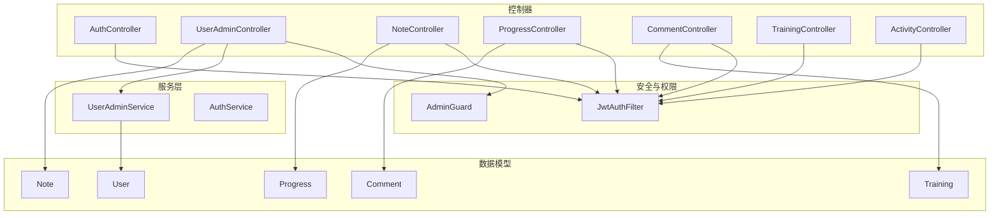
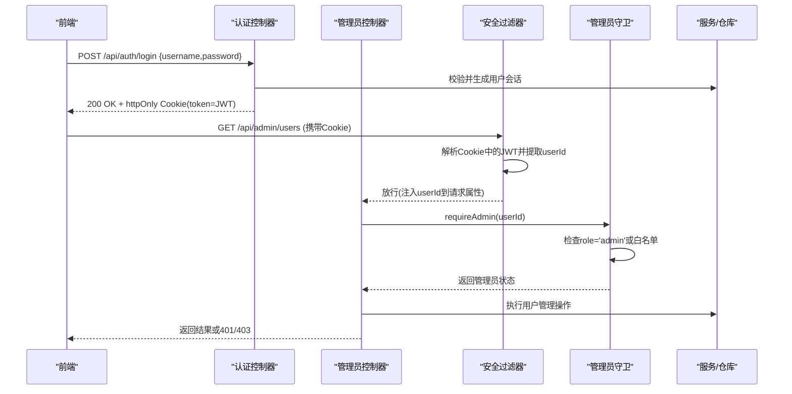
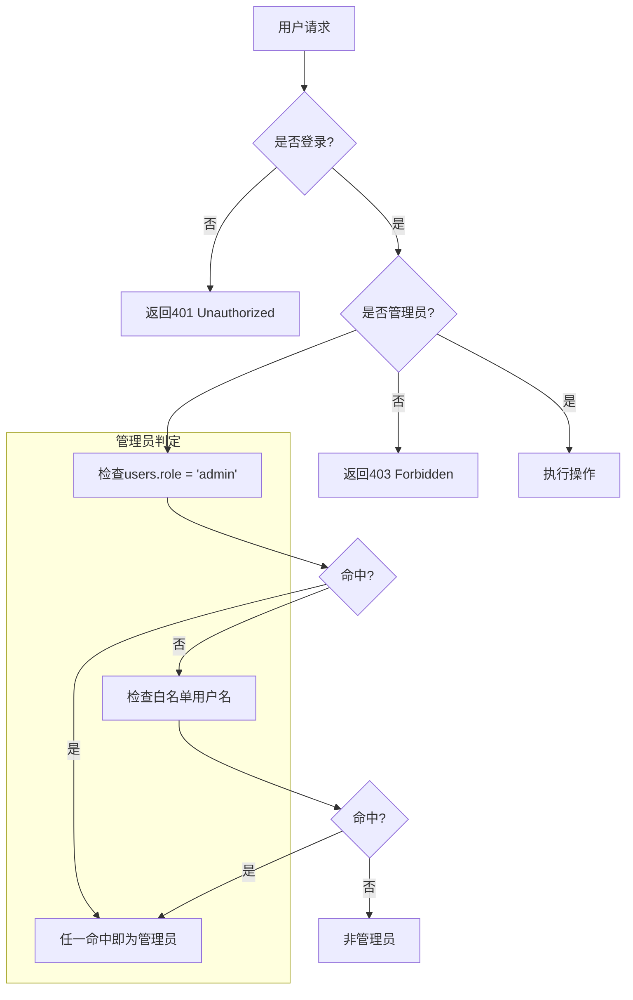
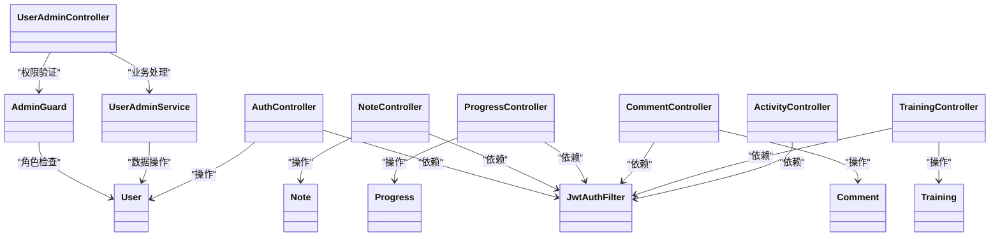

# 用户管理API

<cite>
**本文引用的文件**
- [AuthController.java](file://backend/src/main/java/com/suanfa/controller/AuthController.java)
- [UserAdminController.java](file://backend/src/main/java/com/suanfa/controller/UserAdminController.java)
- [NoteController.java](file://backend/src/main/java/com/suanfa/controller/NoteController.java)
- [ProgressController.java](file://backend/src/main/java/com/suanfa/controller/ProgressController.java)
- [CommentController.java](file://backend/src/main/java/com/suanfa/controller/CommentController.java)
- [TrainingController.java](file://backend/src/main/java/com/suanfa/controller/TrainingController.java)
- [ActivityController.java](file://backend/src/main/java/com/suanfa/controller/ActivityController.java)
- [JwtAuthFilter.java](file://backend/src/main/java/com/suanfa/security/JwtAuthFilter.java)
- [AdminGuard.java](file://backend/src/main/java/com/suanfa/service/AdminGuard.java)
- [UserAdminService.java](file://backend/src/main/java/com/suanfa/service/UserAdminService.java)
- [User.java](file://backend/src/main/java/com/suanfa/entity/User.java)
- [Note.java](file://backend/src/main/java/com/suanfa/entity/Note.java)
- [Progress.java](file://backend/src/main/java/com/suanfa/entity/Progress.java)
- [Comment.java](file://backend/src/main/java/com/suanfa/entity/Comment.java)
- [Training.java](file://backend/src/main/java/com/suanfa/entity/Training.java)
- [AuthRequest.java](file://backend/src/main/java/com/suanfa/dto/AuthRequest.java)
- [UserResponse.java](file://backend/src/main/java/com/suanfa/dto/UserResponse.java)
- [AdminUserDto.java](file://backend/src/main/java/com/suanfa/dto/AdminUserDto.java)
- [AiProperties.java](file://backend/src/main/java/com/suanfa/config/AiProperties.java)
</cite>

## 更新摘要
**变更内容**
- 新增完整的管理员用户管理系统，包括用户CRUD操作
- 实现基于角色的访问控制（RBAC）系统
- 添加管理员白名单机制和双重身份验证
- 提供用户数据级联删除功能
- 增强权限控制和安全性机制

## 目录
1. [简介](#简介)
2. [项目结构](#项目结构)
3. [核心组件](#核心组件)
4. [架构总览](#架构总览)
5. [详细接口说明](#详细接口说明)
6. [权限控制系统](#权限控制系统)
7. [依赖关系分析](#依赖关系分析)
8. [性能与扩展性](#性能与扩展性)
9. [故障排查指南](#故障排查指南)
10. [结论](#结论)
11. [附录：前端集成指南](#附录前端集成指南)

## 简介
本文档面向前端开发者，系统化梳理用户管理相关API，覆盖认证、学习笔记、学习进度、评论系统、训练任务、活动记录等能力。**最新更新**包含完整的管理员用户管理系统，支持用户创建、编辑、删除、密码重置等操作，并提供基于角色的访问控制（RBAC）和白名单机制。文档包含HTTP方法、URL模式、请求参数、响应格式、错误码、示例以及权限控制、隐私保护、数据同步与离线支持等实现建议。

## 项目结构
后端采用Spring MVC控制器分层组织，围绕"用户"维度提供资源型REST API；安全层通过过滤器从httpOnly Cookie中解析JWT并注入当前用户ID；新增的管理员模块提供完整的用户管理能力。



**图表来源**
- [UserAdminController.java:36-48](file://backend/src/main/java/com/suanfa/controller/UserAdminController.java#L36-L48)
- [AdminGuard.java:23-32](file://backend/src/main/java/com/suanfa/service/AdminGuard.java#L23-L32)
- [UserAdminService.java:33-51](file://backend/src/main/java/com/suanfa/service/UserAdminService.java#L33-L51)

## 核心组件
- **认证与会话**
  - 注册、登录、登出、获取当前用户信息
  - JWT以httpOnly Cookie形式下发，跨域默认SameSite=Lax
- **管理员用户管理** ⭐ **新增**
  - 用户列表查询（支持关键词搜索和学习数据统计）
  - 用户创建（用户名、密码、邮箱、角色）
  - 用户编辑（用户名、邮箱、角色修改）
  - 密码重置（无需原密码和邮箱验证码）
  - 用户删除（级联清理所有关联数据）
- **学习笔记**
  - 按用户+算法维度读写删除笔记
- **学习进度**
  - 按用户+算法维度更新状态（learning/learned/favorited）
- **评论系统**
  - 公开读取某算法评论；发表/删除需登录且仅本人可删
- **训练任务**
  - 按用户+题目维度更新刷题状态（solving/solved）
- **活动记录**
  - 聚合用户活跃日（由进度/笔记/评论/训练时间戳派生）

**章节来源**
- [UserAdminController.java:21-35](file://backend/src/main/java/com/suanfa/controller/UserAdminController.java#L21-L35)
- [UserAdminService.java:21-32](file://backend/src/main/java/com/suanfa/service/UserAdminService.java#L21-L32)
- [AuthController.java:28-71](file://backend/src/main/java/com/suanfa/controller/AuthController.java#L28-L71)

## 架构总览
认证流程与安全机制：
- 登录成功后服务端设置httpOnly Cookie（名称固定），携带JWT
- 后续请求自动携带Cookie，过滤器解析JWT并将userId注入请求属性
- 受保护接口通过参数解析当前用户ID并进行鉴权
- **新增** 管理员权限通过双重机制验证：数据库角色字段 + 配置白名单



**图表来源**
- [UserAdminController.java:111-123](file://backend/src/main/java/com/suanfa/controller/UserAdminController.java#L111-L123)
- [AdminGuard.java:52-65](file://backend/src/main/java/com/suanfa/service/AdminGuard.java#L52-L65)

## 详细接口说明

### 认证与会话
- **注册**
  - 方法: POST
  - URL: /api/auth/register
  - 请求体: { username, password }
  - 成功响应: 200 OK，返回用户基本信息（不含密码）
  - 冲突: 409 Conflict，用户名已存在
  - 失败: 400 Bad Request，参数不合法
- **登录**
  - 方法: POST
  - URL: /api/auth/login
  - 请求体: { username, password }
  - 成功响应: 200 OK，返回用户基本信息；同时设置httpOnly Cookie(token)
  - 失败: 401 Unauthorized，用户名或密码错误
- **登出**
  - 方法: POST
  - URL: /api/auth/logout
  - 成功响应: 200 OK，清除token Cookie
- **当前用户**
  - 方法: GET
  - URL: /api/auth/me
  - 成功响应: 200 OK，返回当前用户信息（包含admin标识）
  - 未登录: 401 Unauthorized

**章节来源**
- [AuthController.java:28-71](file://backend/src/main/java/com/suanfa/controller/AuthController.java#L28-L71)
- [UserResponse.java:3-10](file://backend/src/main/java/com/suanfa/dto/UserResponse.java#L3-L10)

### 管理员用户管理接口 ⭐ **新增**

#### 用户列表查询
- **方法**: GET
- **URL**: /api/admin/users?keyword={search_term}
- **权限**: 需要管理员权限
- **查询参数**:
  - keyword: 可选，按用户名或邮箱模糊搜索
- **成功响应**: 200 OK，返回用户列表
  ```json
  {
    "total": 100,
    "users": [
      {
        "id": 1,
        "username": "alice",
        "email": "alice@example.com",
        "role": "user",
        "admin": true,
        "whitelisted": false,
        "createdAt": "2025-01-01T10:00:00",
        "progressCount": 5,
        "noteCount": 3,
        "commentCount": 10,
        "trainingCount": 15
      }
    ]
  }
  ```
- **错误响应**:
  - 401 Unauthorized: 未登录
  - 403 Forbidden: 非管理员用户

#### 创建新用户
- **方法**: POST
- **URL**: /api/admin/users
- **权限**: 需要管理员权限
- **请求体**:
  ```json
  {
    "username": "newuser",
    "password": "securepass123",
    "email": "newuser@example.com",
    "role": "user"
  }
  ```
- **必填字段**: username, password
- **可选字段**: email, role (user|admin)
- **成功响应**: 200 OK，返回创建的用户信息
- **错误响应**:
  - 400 Bad Request: 用户名格式不正确、密码长度不足、用户名已存在
  - 401 Unauthorized: 未登录
  - 403 Forbidden: 非管理员用户

#### 编辑用户信息
- **方法**: PUT
- **URL**: /api/admin/users/{id}
- **权限**: 需要管理员权限
- **路径参数**: id - 用户ID
- **请求体**:
  ```json
  {
    "username": "updated_username",
    "email": "updated@example.com",
    "role": "admin"
  }
  ```
- **字段说明**:
  - 任何字段为null表示不修改该项
  - email传空字符串表示解绑邮箱
  - 白名单用户的角色和用户名不可修改
- **成功响应**: 200 OK，返回更新后的用户信息
- **错误响应**:
  - 400 Bad Request: 参数验证失败
  - 401 Unauthorized: 未登录
  - 403 Forbidden: 非管理员用户
  - 404 Not Found: 用户不存在

#### 重置用户密码
- **方法**: PUT
- **URL**: /api/admin/users/{id}/password
- **权限**: 需要管理员权限
- **路径参数**: id - 用户ID
- **请求体**:
  ```json
  {
    "password": "newpassword123"
  }
  ```
- **成功响应**: 200 OK，返回操作成功消息
  ```json
  {
    "message": "密码已重置，该用户需要用新密码重新登录"
  }
  ```
- **错误响应**:
  - 400 Bad Request: 密码长度不足
  - 401 Unauthorized: 未登录
  - 403 Forbidden: 非管理员用户
  - 404 Not Found: 用户不存在

#### 删除用户
- **方法**: DELETE
- **URL**: /api/admin/users/{id}
- **权限**: 需要管理员权限
- **路径参数**: id - 用户ID
- **成功响应**: 200 OK，返回操作成功消息
  ```json
  {
    "message": "用户已删除"
  }
  ```
- **级联删除**: 自动删除以下关联数据
  - 学习进度记录
  - 学习笔记
  - 评论
  - 训练记录
- **安全限制**:
  - 不能删除当前登录的管理员账号
  - 不能删除白名单用户
  - 至少保留一个管理员账号
- **错误响应**:
  - 400 Bad Request: 违反安全规则
  - 401 Unauthorized: 未登录
  - 403 Forbidden: 非管理员用户
  - 404 Not Found: 用户不存在

**章节来源**
- [UserAdminController.java:50-107](file://backend/src/main/java/com/suanfa/controller/UserAdminController.java#L50-L107)
- [UserAdminService.java:53-147](file://backend/src/main/java/com/suanfa/service/UserAdminService.java#L53-L147)
- [AdminUserDto.java:13-46](file://backend/src/main/java/com/suanfa/dto/AdminUserDto.java#L13-L46)

### 学习笔记
- **获取单算法笔记**
  - 方法: GET
  - URL: /api/users/{userId}/notes/{algorithmId}
  - 路径参数: userId, algorithmId
  - 成功响应: 200 OK，返回笔记内容、更新时间
  - 未找到: 404 Not Found（前端回退到预置默认笔记）
  - 未登录/无权: 401 Unauthorized
- **保存/更新笔记**
  - 方法: PUT
  - URL: /api/users/{userId}/notes/{algorithmId}
  - 请求体: { content }
  - 成功响应: 200 OK，返回保存后的笔记
  - 参数校验失败: 400 Bad Request（content为空或超长）
  - 算法不存在: 404 Not Found
  - 未登录/无权: 401 Unauthorized
- **删除笔记**
  - 方法: DELETE
  - URL: /api/users/{userId}/notes/{algorithmId}
  - 成功响应: 204 No Content
  - 未登录/无权: 401 Unauthorized

**章节来源**
- [NoteController.java:28-68](file://backend/src/main/java/com/suanfa/controller/NoteController.java#L28-L68)

### 学习进度
- **获取全部进度**
  - 方法: GET
  - URL: /api/users/{userId}/progress
  - 成功响应: 200 OK，数组，每项包含算法ID、名称、分类、状态、更新时间
  - 未登录/无权: 401 Unauthorized
- **更新单算法进度**
  - 方法: PUT
  - URL: /api/users/{userId}/progress/{algorithmId}
  - 请求体: { status }，允许值: learning | learned | favorited
  - 成功响应: 200 OK，返回更新后的进度
  - 非法状态: 400 Bad Request
  - 算法不存在: 404 Not Found
  - 未登录/无权: 401 Unauthorized

**章节来源**
- [ProgressController.java:31-59](file://backend/src/main/java/com/suanfa/controller/ProgressController.java#L31-L59)

### 评论系统
- **获取算法评论列表**
  - 方法: GET
  - URL: /api/algorithms/{algorithmId}/comments
  - 成功响应: 200 OK，数组，包含评论ID、算法ID、用户ID、用户名、内容、创建时间
  - 公开可读，无需登录
- **发表评论**
  - 方法: POST
  - URL: /api/algorithms/{algorithmId}/comments
  - 请求体: { content }
  - 成功响应: 201 Created，返回新建评论
  - 未登录: 401 Unauthorized
  - 内容非法: 400 Bad Request
  - 算法不存在: 404 Not Found
- **删除评论**
  - 方法: DELETE
  - URL: /api/comments/{id}
  - 成功响应: 204 No Content
  - 未登录: 401 Unauthorized
  - 非本人: 403 Forbidden
  - 不存在: 404 Not Found

**章节来源**
- [CommentController.java:35-77](file://backend/src/main/java/com/suanfa/controller/CommentController.java#L35-L77)

### 训练任务
- **获取全部训练记录**
  - 方法: GET
  - URL: /api/users/{userId}/training
  - 成功响应: 200 OK，数组，包含题目ID、状态、更新时间
  - 未登录/无权: 401 Unauthorized
- **更新单题状态**
  - 方法: PUT
  - URL: /api/users/{userId}/training/{problemId}
  - 请求体: { status }，允许值: solving | solved
  - 成功响应: 200 OK，返回更新后的记录
  - 非法状态: 400 Bad Request
  - 未登录/无权: 401 Unauthorized
- **删除单题记录**
  - 方法: DELETE
  - URL: /api/users/{userId}/training/{problemId}
  - 成功响应: 204 No Content
  - 未登录/无权: 401 Unauthorized

**章节来源**
- [TrainingController.java:27-62](file://backend/src/main/java/com/suanfa/controller/TrainingController.java#L27-L62)

### 活动记录
- **获取用户活跃日**
  - 方法: GET
  - URL: /api/users/{userId}/activity
  - 成功响应: 200 OK，数组，包含日期与当日活动计数
  - 未登录/无权: 401 Unauthorized

**章节来源**
- [ActivityController.java:27-40](file://backend/src/main/java/com/suanfa/controller/ActivityController.java#L27-L40)

## 权限控制系统

### 双重管理员身份验证
系统实现了双重管理员身份验证机制，确保系统安全性和灵活性：

1. **数据库角色验证**
   - users表中的role字段存储用户角色（admin/user）
   - 通过用户管理界面动态授予或撤销管理员权限

2. **配置白名单机制**
   - suanfa.ai.admin-usernames配置项定义白名单用户名
   - 白名单用户自动获得管理员权限，不受页面角色控制
   - 防止管理员误操作导致系统锁死

### 权限检查流程


**图表来源**
- [AdminGuard.java:52-65](file://backend/src/main/java/com/suanfa/service/AdminGuard.java#L52-L65)
- [AiProperties.java:52-58](file://backend/src/main/java/com/suanfa/config/AiProperties.java#L52-L58)

### 安全保护措施
- **自删除保护**: 禁止删除当前登录的管理员账号
- **最后管理员保护**: 确保系统中至少保留一个管理员账号
- **白名单保护**: 白名单用户不可被改名或删除
- **级联删除**: 删除用户时自动清理所有关联数据

**章节来源**
- [UserAdminService.java:181-199](file://backend/src/main/java/com/suanfa/service/UserAdminService.java#L181-L199)
- [AdminGuard.java:12-22](file://backend/src/main/java/com/suanfa/service/AdminGuard.java#L12-L22)

## 依赖关系分析
- 控制器依赖仓库与服务进行数据存取与业务处理
- 安全过滤器负责从Cookie解析JWT并注入当前用户ID
- **新增** 管理员守卫服务统一处理权限验证逻辑
- 实体与DTO定义数据契约，确保前后端一致



**图表来源**
- [UserAdminController.java:36-48](file://backend/src/main/java/com/suanfa/controller/UserAdminController.java#L36-L48)
- [AdminGuard.java:23-32](file://backend/src/main/java/com/suanfa/service/AdminGuard.java#L23-L32)
- [UserAdminService.java:33-51](file://backend/src/main/java/com/suanfa/service/UserAdminService.java#L33-L51)

## 性能与扩展性
- **批量读取优化**
  - 用户列表查询使用单次SQL查询获取用户信息和统计数据，避免N+1问题
  - 进度、训练、活动均为列表接口，建议在数据库层建立复合索引（如 user_id + algorithm_id/problem_id）以提升查询性能
- **缓存策略**
  - 评论列表可考虑短期缓存（按算法ID），减少重复查询
  - 管理员权限检查结果可缓存，减少数据库查询
- **限流与防刷**
  - 评论与登录接口可结合令牌桶或滑动窗口进行限流，防止滥用
  - 管理员操作接口可增加操作频率限制
- **分页与排序**
  - 当数据量增长时，为列表接口增加分页参数与排序字段，避免一次性加载过多数据
- **异步化**
  - 活动记录可由事件驱动异步聚合，降低写路径延迟
  - 用户删除操作可异步处理大量数据清理

## 故障排查指南
- **401 未登录/无权访问**
  - 检查是否已登录并携带token Cookie
  - 确认请求目标用户ID与当前用户一致
  - 管理员接口需要管理员权限
- **403 禁止访问**
  - 尝试访问管理员接口但非管理员用户
  - 尝试删除他人评论
- **400 参数错误**
  - 检查content长度限制（笔记20000字符、评论2000字符）
  - 检查状态枚举值是否合法
  - 用户名格式不正确（2-32位字母、数字、下划线、点、横线或中文）
  - 密码长度不足（至少4位）
- **404 资源不存在**
  - 算法ID或题目ID无效
  - 笔记尚未创建（前端应回退到默认内容）
  - 用户ID不存在
- **409 冲突**
  - 注册时用户名已存在
  - 邮箱已被其他账号绑定
- **管理员操作限制**
  - 不能删除当前登录的管理员账号
  - 不能删除白名单用户
  - 不能将最后一个管理员降级或删除

**章节来源**
- [UserAdminController.java:111-127](file://backend/src/main/java/com/suanfa/controller/UserAdminController.java#L111-L127)
- [UserAdminService.java:201-244](file://backend/src/main/java/com/suanfa/service/UserAdminService.java#L201-L244)

## 结论
该用户管理API以"用户"为中心，提供认证、笔记、进度、评论、训练、活动六大能力。**最新更新**增加了完整的管理员用户管理系统，支持用户CRUD操作、角色权限控制和级联数据清理。通过JWT与httpOnly Cookie实现安全的会话管理，并通过双重管理员身份验证机制确保系统安全性。接口设计简洁明确，便于前端快速集成。建议在生产环境补充限流、缓存、分页与监控告警，进一步提升稳定性与可扩展性。

## 附录：前端集成指南

### 管理员功能集成
- **权限检测**
  - 登录后调用 /api/auth/me 获取用户信息，检查 admin 字段
  - 根据 admin 字段决定是否显示用户管理入口
- **用户管理操作**
  - 使用 fetchAdminUsers() 获取用户列表，支持关键词搜索
  - 使用 adminCreateUser() 创建新用户，需要提供用户名和密码
  - 使用 adminUpdateUser() 编辑用户信息，支持部分字段更新
  - 使用 adminResetUserPassword() 重置用户密码
  - 使用 adminDeleteUser() 删除用户，会级联删除所有关联数据
- **错误处理**
  - 401错误：提示用户重新登录
  - 403错误：提示无管理员权限
  - 400错误：显示具体的参数验证错误信息

### 数据持久化
- 登录后将token保存在浏览器Cookie中（服务端已设置httpOnly），后续请求自动携带
- 本地可缓存用户信息（id、username、createdAt、admin），在页面初始化时调用 /api/auth/me 刷新
- 管理员操作结果可缓存，减少重复请求

### 离线支持
- 对读多写少的数据（如笔记、进度、训练记录）可在IndexedDB或localStorage中缓存
- 网络恢复后合并本地变更，优先使用服务器最新数据（基于updatedAt时间戳）
- 管理员操作需要网络连接，无法离线执行

### 冲突解决
- 乐观锁思想：提交前记录本地版本号或时间戳，若服务端返回409/404则提示用户重新拉取
- 对于并发更新（如进度、训练状态），建议先GET再PUT，或使用幂等更新接口
- 用户管理操作涉及敏感数据，建议实时同步，避免本地缓存

### 权限与隐私
- 所有写操作必须携带有效token；服务端会校验当前用户与资源归属
- 管理员接口需要额外权限检查，前端应根据admin字段隐藏或禁用相关功能
- 敏感字段（如密码哈希）不会返回给前端
- 用户删除操作需要二次确认，防止误操作

### 典型工作流
- **管理员工作流程**
  - 登录 -> 获取当前用户信息 -> 检查admin权限 -> 进入用户管理页面
  - 查看用户列表 -> 搜索特定用户 -> 执行创建/编辑/删除操作
  - 重置用户密码 -> 通知用户重新登录
- **普通用户工作流程**
  - 登录 -> 获取当前用户信息 -> 使用个人功能（笔记、进度、评论等）
  - 定期同步数据到服务器，保证多设备一致性

**章节来源**
- [client.js:154-181](file://suanfa_vue/src/api/client.js#L154-L181)
- [UserManagePage.vue:1-800](file://suanfa_vue/src/components/common/UserManagePage.vue#L1-L800)