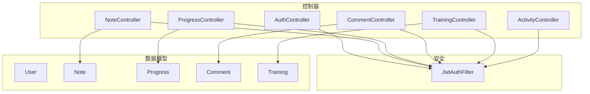
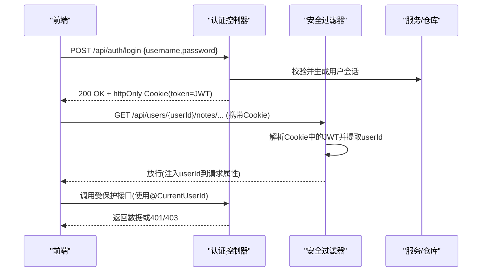
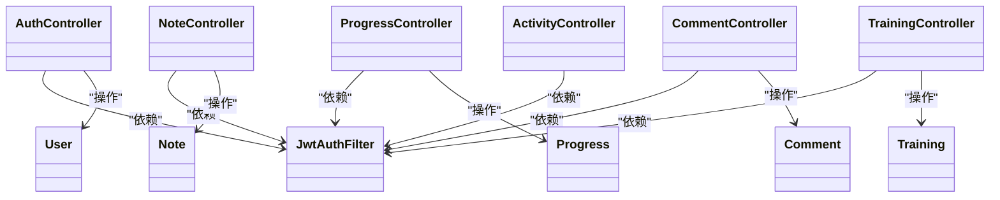

# 用户管理API

<cite>
**本文引用的文件**
- [AuthController.java](file://backend/src/main/java/com/suanfa/controller/AuthController.java)
- [NoteController.java](file://backend/src/main/java/com/suanfa/controller/NoteController.java)
- [ProgressController.java](file://backend/src/main/java/com/suanfa/controller/ProgressController.java)
- [CommentController.java](file://backend/src/main/java/com/suanfa/controller/CommentController.java)
- [TrainingController.java](file://backend/src/main/java/com/suanfa/controller/TrainingController.java)
- [ActivityController.java](file://backend/src/main/java/com/suanfa/controller/ActivityController.java)
- [JwtAuthFilter.java](file://backend/src/main/java/com/suanfa/security/JwtAuthFilter.java)
- [User.java](file://backend/src/main/java/com/suanfa/entity/User.java)
- [Note.java](file://backend/src/main/java/com/suanfa/entity/Note.java)
- [Progress.java](file://backend/src/main/java/com/suanfa/entity/Progress.java)
- [Comment.java](file://backend/src/main/java/com/suanfa/entity/Comment.java)
- [Training.java](file://backend/src/main/java/com/suanfa/entity/Training.java)
- [AuthRequest.java](file://backend/src/main/java/com/suanfa/dto/AuthRequest.java)
- [UserResponse.java](file://backend/src/main/java/com/suanfa/dto/UserResponse.java)
- [NoteUpdateRequest.java](file://backend/src/main/java/com/suanfa/dto/NoteUpdateRequest.java)
- [ProgressUpdateRequest.java](file://backend/src/main/java/com/suanfa/dto/ProgressUpdateRequest.java)
- [CommentRequest.java](file://backend/src/main/java/com/suanfa/dto/CommentRequest.java)
- [TrainingUpdateRequest.java](file://backend/src/main/java/com/suanfa/dto/TrainingUpdateRequest.java)
</cite>

## 目录
1. [简介](#简介)
2. [项目结构](#项目结构)
3. [核心组件](#核心组件)
4. [架构总览](#架构总览)
5. [详细接口说明](#详细接口说明)
6. [依赖关系分析](#依赖关系分析)
7. [性能与扩展性](#性能与扩展性)
8. [故障排查指南](#故障排查指南)
9. [结论](#结论)
10. [附录：前端集成指南](#附录前端集成指南)

## 简介
本文档面向前端开发者，系统化梳理用户管理相关API，覆盖认证、学习笔记、学习进度、评论系统、训练任务、活动记录等能力。文档包含HTTP方法、URL模式、请求参数、响应格式、错误码、示例以及权限控制、隐私保护、数据同步与离线支持等实现建议。

## 项目结构
后端采用Spring MVC控制器分层组织，围绕“用户”维度提供资源型REST API；安全层通过过滤器从httpOnly Cookie中解析JWT并注入当前用户ID；实体与DTO用于数据建模与传输。

图表来源
- [AuthController.java:15-94](file://backend/src/main/java/com/suanfa/controller/AuthController.java#L15-L94)
- [NoteController.java:13-77](file://backend/src/main/java/com/suanfa/controller/NoteController.java#L13-L77)
- [ProgressController.java:16-74](file://backend/src/main/java/com/suanfa/controller/ProgressController.java#L16-L74)
- [CommentController.java:18-96](file://backend/src/main/java/com/suanfa/controller/CommentController.java#L18-L96)
- [TrainingController.java:14-67](file://backend/src/main/java/com/suanfa/controller/TrainingController.java#L14-L67)
- [ActivityController.java:16-45](file://backend/src/main/java/com/suanfa/controller/ActivityController.java#L16-L45)
- [JwtAuthFilter.java:15-49](file://backend/src/main/java/com/suanfa/security/JwtAuthFilter.java#L15-L49)

章节来源
- [AuthController.java:15-94](file://backend/src/main/java/com/suanfa/controller/AuthController.java#L15-L94)
- [JwtAuthFilter.java:15-49](file://backend/src/main/java/com/suanfa/security/JwtAuthFilter.java#L15-L49)

## 核心组件
- 认证与会话
  - 注册、登录、登出、获取当前用户信息
  - JWT以httpOnly Cookie形式下发，跨域默认SameSite=Lax
- 学习笔记
  - 按用户+算法维度读写删除笔记
- 学习进度
  - 按用户+算法维度更新状态（learning/learned/favorited）
- 评论系统
  - 公开读取某算法评论；发表/删除需登录且仅本人可删
- 训练任务
  - 按用户+题目维度更新刷题状态（solving/solved）
- 活动记录
  - 聚合用户活跃日（由进度/笔记/评论/训练时间戳派生）

章节来源
- [AuthController.java:28-71](file://backend/src/main/java/com/suanfa/controller/AuthController.java#L28-L71)
- [NoteController.java:28-68](file://backend/src/main/java/com/suanfa/controller/NoteController.java#L28-L68)
- [ProgressController.java:31-59](file://backend/src/main/java/com/suanfa/controller/ProgressController.java#L31-L59)
- [CommentController.java:35-77](file://backend/src/main/java/com/suanfa/controller/CommentController.java#L35-L77)
- [TrainingController.java:27-62](file://backend/src/main/java/com/suanfa/controller/TrainingController.java#L27-L62)
- [ActivityController.java:27-40](file://backend/src/main/java/com/suanfa/controller/ActivityController.java#L27-L40)

## 架构总览
认证流程与安全机制：
- 登录成功后服务端设置httpOnly Cookie（名称固定），携带JWT
- 后续请求自动携带Cookie，过滤器解析JWT并将userId注入请求属性
- 受保护接口通过参数解析当前用户ID并进行鉴权

图表来源
- [AuthController.java:43-71](file://backend/src/main/java/com/suanfa/controller/AuthController.java#L43-L71)
- [JwtAuthFilter.java:31-47](file://backend/src/main/java/com/suanfa/security/JwtAuthFilter.java#L31-L47)

## 详细接口说明

### 认证与会话
- 注册
  - 方法: POST
  - URL: /api/auth/register
  - 请求体: { username, password }
  - 成功响应: 200 OK，返回用户基本信息（不含密码）
  - 冲突: 409 Conflict，用户名已存在
  - 失败: 400 Bad Request，参数不合法
- 登录
  - 方法: POST
  - URL: /api/auth/login
  - 请求体: { username, password }
  - 成功响应: 200 OK，返回用户基本信息；同时设置httpOnly Cookie(token)
  - 失败: 401 Unauthorized，用户名或密码错误
- 登出
  - 方法: POST
  - URL: /api/auth/logout
  - 成功响应: 200 OK，清除token Cookie
- 当前用户
  - 方法: GET
  - URL: /api/auth/me
  - 成功响应: 200 OK，返回当前用户信息
  - 未登录: 401 Unauthorized

请求示例
- 登录
  - 请求: POST /api/auth/login
  - 请求体: { "username": "alice", "password": "******" }
  - 响应: 200 OK，{ "id": 1, "username": "alice", "createdAt": "..." }
  - 响应头: Set-Cookie: token=eyJ...; Path=/; HttpOnly; SameSite=Lax; Max-Age=604800

章节来源
- [AuthController.java:28-71](file://backend/src/main/java/com/suanfa/controller/AuthController.java#L28-L71)
- [AuthRequest.java:3-5](file://backend/src/main/java/com/suanfa/dto/AuthRequest.java#L3-L5)
- [UserResponse.java:3-5](file://backend/src/main/java/com/suanfa/dto/UserResponse.java#L3-L5)
- [JwtAuthFilter.java:22-47](file://backend/src/main/java/com/suanfa/security/JwtAuthFilter.java#L22-L47)

### 学习笔记
- 获取单算法笔记
  - 方法: GET
  - URL: /api/users/{userId}/notes/{algorithmId}
  - 路径参数: userId, algorithmId
  - 成功响应: 200 OK，返回笔记内容、更新时间
  - 未找到: 404 Not Found（前端回退到预置默认笔记）
  - 未登录/无权: 401 Unauthorized
- 保存/更新笔记
  - 方法: PUT
  - URL: /api/users/{userId}/notes/{algorithmId}
  - 请求体: { content }
  - 成功响应: 200 OK，返回保存后的笔记
  - 参数校验失败: 400 Bad Request（content为空或超长）
  - 算法不存在: 404 Not Found
  - 未登录/无权: 401 Unauthorized
- 删除笔记
  - 方法: DELETE
  - URL: /api/users/{userId}/notes/{algorithmId}
  - 成功响应: 204 No Content
  - 未登录/无权: 401 Unauthorized

请求示例
- 更新笔记
  - 请求: PUT /api/users/1/notes/binary-search
  - 请求体: { "content": "二分查找的关键在于边界处理..." }
  - 响应: 200 OK，{ "algorithmId": "binary-search", "content": "...", "updatedAt": "..." }

章节来源
- [NoteController.java:28-68](file://backend/src/main/java/com/suanfa/controller/NoteController.java#L28-L68)
- [NoteUpdateRequest.java:3-5](file://backend/src/main/java/com/suanfa/dto/NoteUpdateRequest.java#L3-L5)
- [Note.java:3-10](file://backend/src/main/java/com/suanfa/entity/Note.java#L3-L10)

### 学习进度
- 获取全部进度
  - 方法: GET
  - URL: /api/users/{userId}/progress
  - 成功响应: 200 OK，数组，每项包含算法ID、名称、分类、状态、更新时间
  - 未登录/无权: 401 Unauthorized
- 更新单算法进度
  - 方法: PUT
  - URL: /api/users/{userId}/progress/{algorithmId}
  - 请求体: { status }，允许值: learning | learned | favorited
  - 成功响应: 200 OK，返回更新后的进度
  - 非法状态: 400 Bad Request
  - 算法不存在: 404 Not Found
  - 未登录/无权: 401 Unauthorized

请求示例
- 更新进度
  - 请求: PUT /api/users/1/progress/dijkstra
  - 请求体: { "status": "learned" }
  - 响应: 200 OK，{ "algorithmId": "dijkstra", "name": "Dijkstra", "category": "图算法", "status": "learned", "updatedAt": "..." }

章节来源
- [ProgressController.java:31-59](file://backend/src/main/java/com/suanfa/controller/ProgressController.java#L31-L59)
- [ProgressUpdateRequest.java:3-5](file://backend/src/main/java/com/suanfa/dto/ProgressUpdateRequest.java#L3-L5)
- [Progress.java:3-10](file://backend/src/main/java/com/suanfa/entity/Progress.java#L3-L10)

### 评论系统
- 获取算法评论列表
  - 方法: GET
  - URL: /api/algorithms/{algorithmId}/comments
  - 成功响应: 200 OK，数组，包含评论ID、算法ID、用户ID、用户名、内容、创建时间
  - 公开可读，无需登录
- 发表评论
  - 方法: POST
  - URL: /api/algorithms/{algorithmId}/comments
  - 请求体: { content }
  - 成功响应: 201 Created，返回新建评论
  - 未登录: 401 Unauthorized
  - 内容非法: 400 Bad Request
  - 算法不存在: 404 Not Found
- 删除评论
  - 方法: DELETE
  - URL: /api/comments/{id}
  - 成功响应: 204 No Content
  - 未登录: 401 Unauthorized
  - 非本人: 403 Forbidden
  - 不存在: 404 Not Found

请求示例
- 发表评论
  - 请求: POST /api/algorithms/binary-search/comments
  - 请求体: { "content": "注意边界条件" }
  - 响应: 201 Created，{ "id": 101, "algorithmId": "binary-search", "userId": 1, "username": "alice", "content": "注意边界条件", "createdAt": "..." }

章节来源
- [CommentController.java:35-77](file://backend/src/main/java/com/suanfa/controller/CommentController.java#L35-L77)
- [CommentRequest.java:3-5](file://backend/src/main/java/com/suanfa/dto/CommentRequest.java#L3-L5)
- [Comment.java:3-10](file://backend/src/main/java/com/suanfa/entity/Comment.java#L3-L10)

### 训练任务
- 获取全部训练记录
  - 方法: GET
  - URL: /api/users/{userId}/training
  - 成功响应: 200 OK，数组，包含题目ID、状态、更新时间
  - 未登录/无权: 401 Unauthorized
- 更新单题状态
  - 方法: PUT
  - URL: /api/users/{userId}/training/{problemId}
  - 请求体: { status }，允许值: solving | solved
  - 成功响应: 200 OK，返回更新后的记录
  - 非法状态: 400 Bad Request
  - 未登录/无权: 401 Unauthorized
- 删除单题记录
  - 方法: DELETE
  - URL: /api/users/{userId}/training/{problemId}
  - 成功响应: 204 No Content
  - 未登录/无权: 401 Unauthorized

请求示例
- 更新训练状态
  - 请求: PUT /api/users/1/training/two-sum
  - 请求体: { "status": "solved" }
  - 响应: 200 OK，{ "problemId": "two-sum", "status": "solved", "updatedAt": "..." }

章节来源
- [TrainingController.java:27-62](file://backend/src/main/java/com/suanfa/controller/TrainingController.java#L27-L62)
- [TrainingUpdateRequest.java:3-5](file://backend/src/main/java/com/suanfa/dto/TrainingUpdateRequest.java#L3-L5)
- [Training.java:3-10](file://backend/src/main/java/com/suanfa/entity/Training.java#L3-L10)

### 活动记录
- 获取用户活跃日
  - 方法: GET
  - URL: /api/users/{userId}/activity
  - 成功响应: 200 OK，数组，包含日期与当日活动计数
  - 未登录/无权: 401 Unauthorized

请求示例
- 获取活跃日
  - 请求: GET /api/users/1/activity
  - 响应: 200 OK，[ { "date": "2025-01-01", "count": 5 }, ... ]

章节来源
- [ActivityController.java:27-40](file://backend/src/main/java/com/suanfa/controller/ActivityController.java#L27-L40)

## 依赖关系分析
- 控制器依赖仓库与服务进行数据存取与业务处理
- 安全过滤器负责从Cookie解析JWT并注入当前用户ID
- 实体与DTO定义数据契约，确保前后端一致

图表来源
- [AuthController.java:15-94](file://backend/src/main/java/com/suanfa/controller/AuthController.java#L15-L94)
- [NoteController.java:13-77](file://backend/src/main/java/com/suanfa/controller/NoteController.java#L13-L77)
- [ProgressController.java:16-74](file://backend/src/main/java/com/suanfa/controller/ProgressController.java#L16-L74)
- [CommentController.java:18-96](file://backend/src/main/java/com/suanfa/controller/CommentController.java#L18-L96)
- [TrainingController.java:14-67](file://backend/src/main/java/com/suanfa/controller/TrainingController.java#L14-L67)
- [ActivityController.java:16-45](file://backend/src/main/java/com/suanfa/controller/ActivityController.java#L16-L45)
- [JwtAuthFilter.java:15-49](file://backend/src/main/java/com/suanfa/security/JwtAuthFilter.java#L15-L49)

## 性能与扩展性
- 批量读取
  - 进度、训练、活动均为列表接口，建议在数据库层建立复合索引（如 user_id + algorithm_id/problem_id）以提升查询性能
- 缓存策略
  - 评论列表可考虑短期缓存（按算法ID），减少重复查询
- 限流与防刷
  - 评论与登录接口可结合令牌桶或滑动窗口进行限流，防止滥用
- 分页与排序
  - 当数据量增长时，为列表接口增加分页参数与排序字段，避免一次性加载过多数据
- 异步化
  - 活动记录可由事件驱动异步聚合，降低写路径延迟

## 故障排查指南
- 401 未登录/无权访问
  - 检查是否已登录并携带token Cookie
  - 确认请求目标用户ID与当前用户一致
- 400 参数错误
  - 检查content长度限制（笔记20000字符、评论2000字符）
  - 检查状态枚举值是否合法
- 404 资源不存在
  - 算法ID或题目ID无效
  - 笔记尚未创建（前端应回退到默认内容）
- 403 禁止访问
  - 尝试删除他人评论
- 409 冲突
  - 注册时用户名已存在

章节来源
- [NoteController.java:42-68](file://backend/src/main/java/com/suanfa/controller/NoteController.java#L42-L68)
- [ProgressController.java:43-59](file://backend/src/main/java/com/suanfa/controller/ProgressController.java#L43-L59)
- [CommentController.java:43-77](file://backend/src/main/java/com/suanfa/controller/CommentController.java#L43-L77)
- [TrainingController.java:39-62](file://backend/src/main/java/com/suanfa/controller/TrainingController.java#L39-L62)
- [AuthController.java:28-71](file://backend/src/main/java/com/suanfa/controller/AuthController.java#L28-L71)

## 结论
该用户管理API以“用户”为中心，提供认证、笔记、进度、评论、训练、活动六大能力。通过JWT与httpOnly Cookie实现安全的会话管理，并在控制器层进行细粒度鉴权。接口设计简洁明确，便于前端快速集成。建议在生产环境补充限流、缓存、分页与监控告警，进一步提升稳定性与可扩展性。

## 附录：前端集成指南
- 数据持久化
  - 登录后将token保存在浏览器Cookie中（服务端已设置httpOnly），后续请求自动携带
  - 本地可缓存用户信息（id、username、createdAt），在页面初始化时调用 /api/auth/me 刷新
- 离线支持
  - 对读多写少的数据（如笔记、进度、训练记录）可在IndexedDB或localStorage中缓存
  - 网络恢复后合并本地变更，优先使用服务器最新数据（基于updatedAt时间戳）
- 冲突解决
  - 乐观锁思想：提交前记录本地版本号或时间戳，若服务端返回409/404则提示用户重新拉取
  - 对于并发更新（如进度、训练状态），建议先GET再PUT，或使用幂等更新接口
- 权限与隐私
  - 所有写操作必须携带有效token；服务端会校验当前用户与资源归属
  - 敏感字段（如密码哈希）不会返回给前端
- 典型工作流
  - 登录 -> 获取当前用户 -> 拉取个人数据（笔记/进度/训练/活动） -> 编辑并提交 -> 刷新本地缓存
  - 评论列表公开可读，但发表/删除需要登录