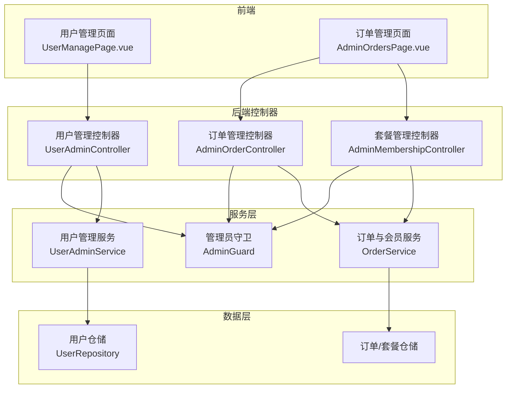
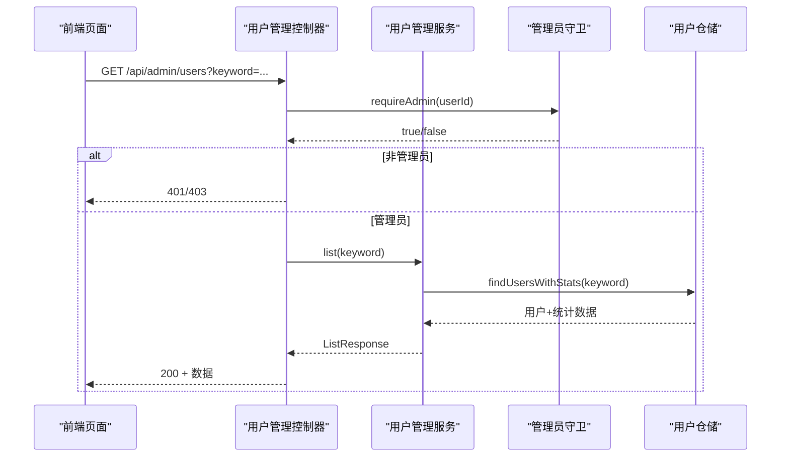
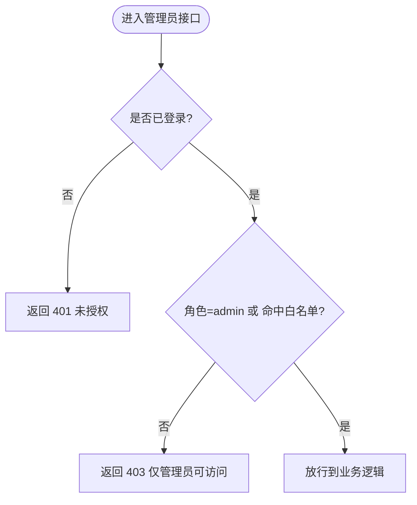
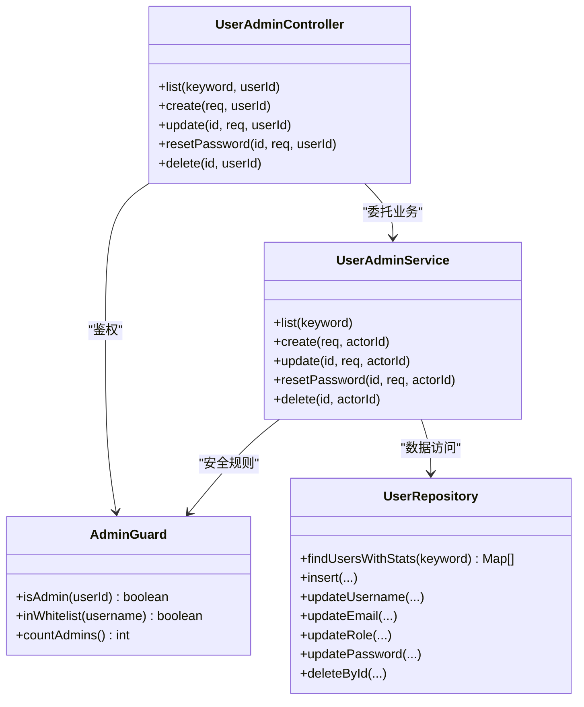
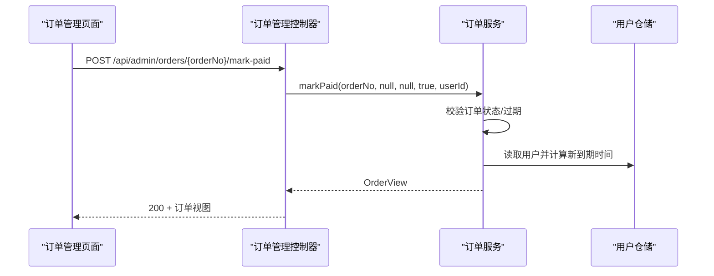
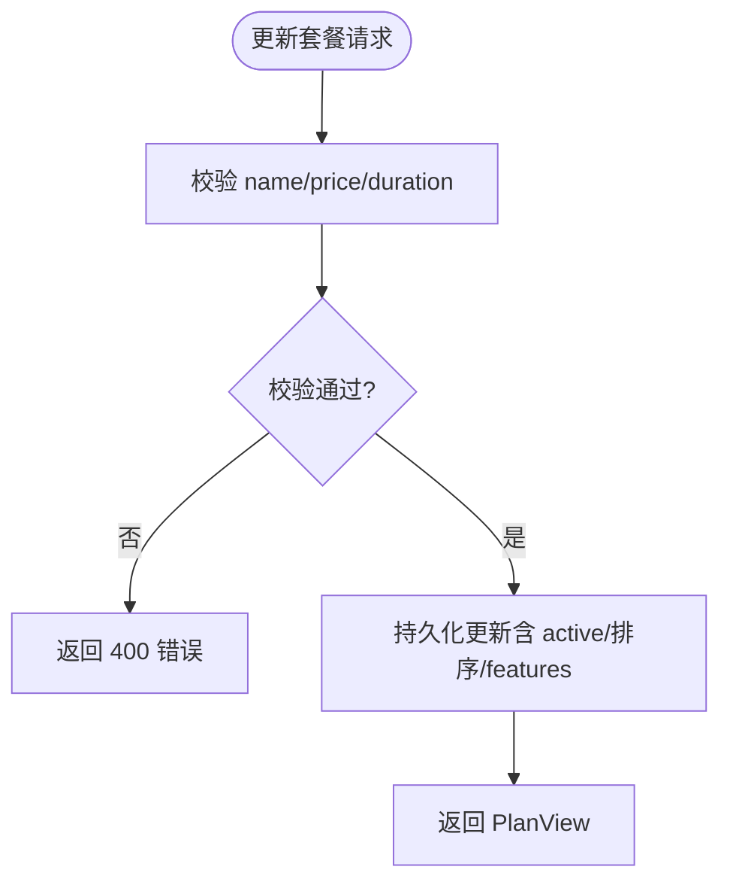
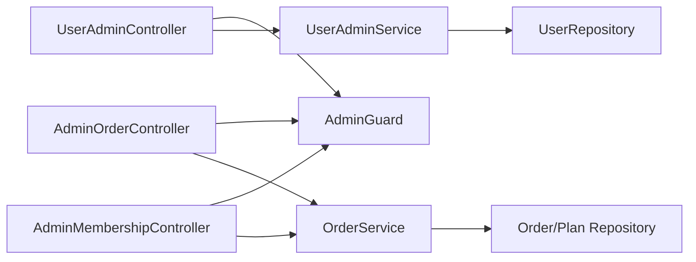

# 管理员功能

<cite>
**本文引用的文件**
- [AdminMembershipController.java](file://backend/src/main/java/com/suanfa/controller/AdminMembershipController.java)
- [AdminOrderController.java](file://backend/src/main/java/com/suanfa/controller/AdminOrderController.java)
- [UserAdminController.java](file://backend/src/main/java/com/suanfa/controller/UserAdminController.java)
- [AdminGuard.java](file://backend/src/main/java/com/suanfa/service/AdminGuard.java)
- [UserAdminService.java](file://backend/src/main/java/com/suanfa/service/UserAdminService.java)
- [OrderService.java](file://backend/src/main/java/com/suanfa/service/OrderService.java)
- [MembershipDtos.java](file://backend/src/main/java/com/suanfa/dto/MembershipDtos.java)
- [UserRepository.java](file://backend/src/main/java/com/suanfa/repository/UserRepository.java)
- [User.java](file://backend/src/main/java/com/suanfa/entity/User.java)
- [Order.java](file://backend/src/main/java/com/suanfa/entity/Order.java)
- [AiProperties.java](file://backend/src/main/java/com/suanfa/config/AiProperties.java)
- [UserManagePage.vue](file://suanfa_vue/src/components/common/UserManagePage.vue)
- [AdminOrdersPage.vue](file://suanfa_vue/src/components/common/AdminOrdersPage.vue)
</cite>

## 目录
1. [简介](#简介)
2. [项目结构与管理入口](#项目结构与管理入口)
3. [核心组件](#核心组件)
4. [架构总览](#架构总览)
5. [详细组件分析](#详细组件分析)
6. [依赖关系分析](#依赖关系分析)
7. [性能与一致性考虑](#性能与一致性考虑)
8. [故障排查指南](#故障排查指南)
9. [结论](#结论)

## 简介
本仓库为算法学习平台，后端采用 Spring Boot，前端为 Vue。管理员功能围绕“用户管理、订单管理与会员套餐管理”三大模块展开，统一通过权限守卫进行鉴权，并提供前后端联动的管理页面。管理员身份由“数据库角色 + 配置白名单”双重来源判定，确保系统可维护性与安全性。

## 项目结构与管理入口
- 后端控制器：
  - 用户管理：/api/admin/users（增删改查、重置密码）
  - 订单管理：/api/admin/orders（列表、统计、手工确认支付、退款）
  - 会员套餐管理：/api/admin/membership/plans（查询、更新）
- 权限守卫：AdminGuard 提供 isAdmin(userId) 判断，所有 /api/admin/* 接口均要求登录且为管理员。
- 前端页面：
  - 用户管理页：UserManagePage.vue
  - 订单管理页：AdminOrdersPage.vue（含营收统计、订单列表、套餐配置）

图表来源
- [UserAdminController.java:36-137](file://backend/src/main/java/com/suanfa/controller/UserAdminController.java#L36-L137)
- [AdminOrderController.java:32-98](file://backend/src/main/java/com/suanfa/controller/AdminOrderController.java#L32-L98)
- [AdminMembershipController.java:29-78](file://backend/src/main/java/com/suanfa/controller/AdminMembershipController.java#L29-L78)
- [AdminGuard.java:23-72](file://backend/src/main/java/com/suanfa/service/AdminGuard.java#L23-L72)
- [UserAdminService.java:33-251](file://backend/src/main/java/com/suanfa/service/UserAdminService.java#L33-L251)
- [OrderService.java:49-382](file://backend/src/main/java/com/suanfa/service/OrderService.java#L49-L382)
- [UserRepository.java:18-205](file://backend/src/main/java/com/suanfa/repository/UserRepository.java#L18-L205)

章节来源
- [UserAdminController.java:36-137](file://backend/src/main/java/com/suanfa/controller/UserAdminController.java#L36-L137)
- [AdminOrderController.java:32-98](file://backend/src/main/java/com/suanfa/controller/AdminOrderController.java#L32-L98)
- [AdminMembershipController.java:29-78](file://backend/src/main/java/com/suanfa/controller/AdminMembershipController.java#L29-L78)

## 核心组件
- 管理员守卫（AdminGuard）
  - 判定逻辑：用户角色为 admin 或用户名命中配置白名单（suanfa.ai.admin-usernames）。
  - 提供 isAdmin(Long)、isAdmin(User)、countAdmins() 等方法，用于全链路鉴权与保护。
- 用户管理服务（UserAdminService）
  - 提供用户列表、创建、编辑（用户名/邮箱/角色）、重置密码、删除等能力。
  - 安全约束：禁止删除/降级当前登录账号；保证至少保留一个管理员；白名单账号不可改名/删除。
- 订单与会员服务（OrderService）
  - 管理套餐展示、下单、取消、支付激活、退款、管理端列表与统计。
  - 关键约定：金额单位为分；时间使用 UTC 字符串；支付成功顺延会员到期时间；markPaid 幂等。
- 仓储层（UserRepository）
  - 用户 CRUD、用户名/邮箱唯一性校验、带学习数据统计的列表查询、删除用户。
- DTO 与实体
  - AdminUserDto：用户管理接口出入参。
  - MembershipDtos：套餐、订单、统计等 DTO。
  - User、Order：核心实体。

章节来源
- [AdminGuard.java:23-72](file://backend/src/main/java/com/suanfa/service/AdminGuard.java#L23-L72)
- [UserAdminService.java:33-251](file://backend/src/main/java/com/suanfa/service/UserAdminService.java#L33-L251)
- [OrderService.java:49-382](file://backend/src/main/java/com/suanfa/service/OrderService.java#L49-L382)
- [UserRepository.java:18-205](file://backend/src/main/java/com/suanfa/repository/UserRepository.java#L18-L205)
- [AdminUserDto.java:1-48](file://backend/src/main/java/com/suanfa/dto/AdminUserDto.java#L1-L48)
- [MembershipDtos.java:1-113](file://backend/src/main/java/com/suanfa/dto/MembershipDtos.java#L1-L113)
- [User.java:1-26](file://backend/src/main/java/com/suanfa/entity/User.java#L1-L26)
- [Order.java:1-35](file://backend/src/main/java/com/suanfa/entity/Order.java#L1-L35)

## 架构总览
管理员功能遵循“控制器 → 服务 → 仓储”的分层架构，并通过统一的权限守卫进行鉴权。前端管理页面调用对应控制器接口，完成用户、订单、套餐的管理操作。

图表来源
- [UserAdminController.java:50-55](file://backend/src/main/java/com/suanfa/controller/UserAdminController.java#L50-L55)
- [UserAdminService.java:52-58](file://backend/src/main/java/com/suanfa/service/UserAdminService.java#L52-L58)
- [UserRepository.java:175-187](file://backend/src/main/java/com/suanfa/repository/UserRepository.java#L175-L187)
- [AdminGuard.java:60-65](file://backend/src/main/java/com/suanfa/service/AdminGuard.java#L60-L65)

## 详细组件分析

### 管理员鉴权（AdminGuard）
- 两条来源任一命中即为管理员：
  - users.role = 'admin'
  - suanfa.ai.admin-usernames 白名单（默认包含 admin）
- 提供方法：
  - inWhitelist(username)
  - isAdmin(User user)
  - isAdmin(Long userId)
  - countAdmins()

图表来源
- [AdminGuard.java:34-72](file://backend/src/main/java/com/suanfa/service/AdminGuard.java#L34-L72)
- [AiProperties.java:52-59](file://backend/src/main/java/com/suanfa/config/AiProperties.java#L52-L59)

章节来源
- [AdminGuard.java:23-72](file://backend/src/main/java/com/suanfa/service/AdminGuard.java#L23-L72)
- [AiProperties.java:52-59](file://backend/src/main/java/com/suanfa/config/AiProperties.java#L52-L59)

### 用户管理（UserAdminController + UserAdminService）
- 接口能力：
  - 列表：GET /api/admin/users?keyword=（支持用户名/邮箱过滤，附带学习数据统计）
  - 新建：POST /api/admin/users（username/password 必填，email/role 可选）
  - 编辑：PUT /api/admin/users/{id}（username/email/role，null 表示不改）
  - 重置密码：PUT /api/admin/users/{id}/password（无需原密码与验证码）
  - 删除：DELETE /api/admin/users/{id}（连带清理进度/笔记/评论/刷题记录）
- 安全规则：
  - 不能删除/降级当前登录账号
  - 至少保留一个管理员
  - 白名单账号不支持改名/删除
- 数据层：
  - UserRepository.findUsersWithStats 一次 SQL 聚合各表计数，避免 N+1

图表来源
- [UserAdminController.java:36-137](file://backend/src/main/java/com/suanfa/controller/UserAdminController.java#L36-L137)
- [UserAdminService.java:33-251](file://backend/src/main/java/com/suanfa/service/UserAdminService.java#L33-L251)
- [UserRepository.java:18-205](file://backend/src/main/java/com/suanfa/repository/UserRepository.java#L18-L205)
- [AdminGuard.java:23-72](file://backend/src/main/java/com/suanfa/service/AdminGuard.java#L23-L72)

章节来源
- [UserAdminController.java:36-137](file://backend/src/main/java/com/suanfa/controller/UserAdminController.java#L36-L137)
- [UserAdminService.java:33-251](file://backend/src/main/java/com/suanfa/service/UserAdminService.java#L33-L251)
- [UserRepository.java:18-205](file://backend/src/main/java/com/suanfa/repository/UserRepository.java#L18-L205)

### 订单与会员管理（AdminOrderController + OrderService）
- 接口能力：
  - 列表：GET /api/admin/orders?keyword=&status=&page=&size=
  - 统计：GET /api/admin/orders/stats（营收、状态聚合、最近 7 日成交曲线）
  - 手工确认支付：POST /api/admin/orders/{orderNo}/mark-paid（幂等）
  - 退款：POST /api/admin/orders/{orderNo}/refund（不回收已生效会员）
- 业务要点：
  - 金额单位：分
  - 时间格式：UTC 'YYYY-MM-DD HH:MM:SS'
  - 支付成功：会员到期时间按 max(现有到期时间, now) + 订单天数顺延
  - markPaid 幂等：重复回调直接返回当前订单视图
- 前端：AdminOrdersPage.vue 提供订单筛选、手工确认、退款、套餐配置保存等操作

图表来源
- [AdminOrderController.java:62-79](file://backend/src/main/java/com/suanfa/controller/AdminOrderController.java#L62-L79)
- [OrderService.java:187-217](file://backend/src/main/java/com/suanfa/service/OrderService.java#L187-L217)
- [UserRepository.java:131-133](file://backend/src/main/java/com/suanfa/repository/UserRepository.java#L131-L133)

章节来源
- [AdminOrderController.java:32-98](file://backend/src/main/java/com/suanfa/controller/AdminOrderController.java#L32-L98)
- [OrderService.java:49-382](file://backend/src/main/java/com/suanfa/service/OrderService.java#L49-L382)
- [AdminOrdersPage.vue:1-626](file://suanfa_vue/src/components/common/AdminOrdersPage.vue#L1-L626)

### 会员套餐管理（AdminMembershipController + OrderService）
- 接口能力：
  - 全部套餐（含下架）：GET /api/admin/membership/plans
  - 更新套餐：PUT /api/admin/membership/plans/{id}（名称/价格/时长/文案/排序/上下架，null 表示不改）
- 业务要点：
  - 套餐字段校验（名称非空、价格非负、时长大于 0）
  - features 以 JSON 数组存储，更新时传入数组，空数组表示清空
- 前端：AdminOrdersPage.vue 内嵌套餐配置面板，支持行内编辑与保存

图表来源
- [AdminMembershipController.java:49-62](file://backend/src/main/java/com/suanfa/controller/AdminMembershipController.java#L49-L62)
- [OrderService.java:89-108](file://backend/src/main/java/com/suanfa/service/OrderService.java#L89-L108)
- [MembershipDtos.java:101-111](file://backend/src/main/java/com/suanfa/dto/MembershipDtos.java#L101-L111)

章节来源
- [AdminMembershipController.java:29-78](file://backend/src/main/java/com/suanfa/controller/AdminMembershipController.java#L29-L78)
- [OrderService.java:89-108](file://backend/src/main/java/com/suanfa/service/OrderService.java#L89-L108)
- [MembershipDtos.java:31-47](file://backend/src/main/java/com/suanfa/dto/MembershipDtos.java#L31-L47)

## 依赖关系分析
- 控制器依赖服务，服务依赖仓储与配置，形成清晰分层。
- 管理员鉴权贯穿所有 /api/admin/* 接口，确保统一的安全策略。
- 用户管理涉及多表关联统计（progress/notes/comments/training），通过单次 SQL 聚合提升性能。
- 订单与会员状态机严格受控，避免非法状态迁移。

图表来源
- [UserAdminController.java:36-137](file://backend/src/main/java/com/suanfa/controller/UserAdminController.java#L36-L137)
- [AdminOrderController.java:32-98](file://backend/src/main/java/com/suanfa/controller/AdminOrderController.java#L32-L98)
- [AdminMembershipController.java:29-78](file://backend/src/main/java/com/suanfa/controller/AdminMembershipController.java#L29-L78)
- [UserAdminService.java:33-251](file://backend/src/main/java/com/suanfa/service/UserAdminService.java#L33-L251)
- [OrderService.java:49-382](file://backend/src/main/java/com/suanfa/service/OrderService.java#L49-L382)

章节来源
- [UserAdminController.java:36-137](file://backend/src/main/java/com/suanfa/controller/UserAdminController.java#L36-L137)
- [AdminOrderController.java:32-98](file://backend/src/main/java/com/suanfa/controller/AdminOrderController.java#L32-L98)
- [AdminMembershipController.java:29-78](file://backend/src/main/java/com/suanfa/controller/AdminMembershipController.java#L29-L78)

## 性能与一致性考虑
- 用户列表查询使用单次 SQL 聚合多个表的计数，避免 N+1 问题，提高响应速度。
- 订单过期清理在每次读路径前执行（expireStale），幂等且不影响正常流程。
- 金额使用整型“分”，避免浮点误差；时间统一使用 UTC 字符串，便于比较与排序。
- 支付激活会员采用“max(现有到期时间, now) + 天数”的顺延策略，保证续费体验一致。
- 删除用户时显式清理关联数据（进度/笔记/评论/刷题），防止孤儿数据。

章节来源
- [UserRepository.java:175-198](file://backend/src/main/java/com/suanfa/repository/UserRepository.java#L175-L198)
- [OrderService.java:294-301](file://backend/src/main/java/com/suanfa/service/OrderService.java#L294-L301)
- [OrderService.java:206-212](file://backend/src/main/java/com/suanfa/service/OrderService.java#L206-L212)
- [UserAdminService.java:133-146](file://backend/src/main/java/com/suanfa/service/UserAdminService.java#L133-L146)

## 故障排查指南
- 401 未授权：未携带有效登录态，检查 JWT 与登录流程。
- 403 仅管理员：当前用户不是管理员，检查 role 或 suanfa.ai.admin-usernames 白名单。
- 参数校验失败：如用户名格式、邮箱唯一性、密码长度、套餐价格/时长等，查看具体错误消息。
- 订单状态异常：
  - 无法支付：订单非 pending 或已过期，需重新下单。
  - 无法退款：订单非 paid，先确认支付。
- 删除用户失败：
  - 不能删除当前登录账号。
  - 不能将管理员数量降至 0。
  - 白名单账号不可删除/改名。

章节来源
- [UserAdminController.java:111-127](file://backend/src/main/java/com/suanfa/controller/UserAdminController.java#L111-L127)
- [AdminOrderController.java:83-93](file://backend/src/main/java/com/suanfa/controller/AdminOrderController.java#L83-L93)
- [AdminMembershipController.java:64-73](file://backend/src/main/java/com/suanfa/controller/AdminMembershipController.java#L64-L73)
- [UserAdminService.java:180-198](file://backend/src/main/java/com/suanfa/service/UserAdminService.java#L180-L198)
- [OrderService.java:193-200](file://backend/src/main/java/com/suanfa/service/OrderService.java#L193-L200)

## 结论
管理员功能通过清晰的层次化设计与严格的权限控制，提供了用户、订单、套餐的全面管理能力。系统在安全性（双源管理员判定、最小管理员保护）、一致性（金额/时间规范、状态机约束）和性能（SQL 聚合、幂等处理）方面均有良好实践。前端管理页面与后端接口紧密配合，提升了运营效率与用户体验。