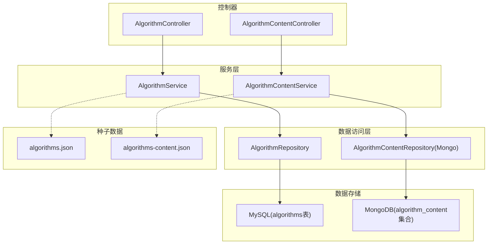
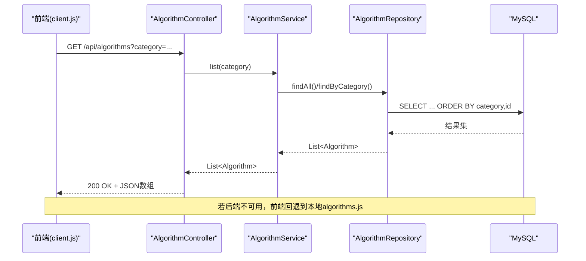
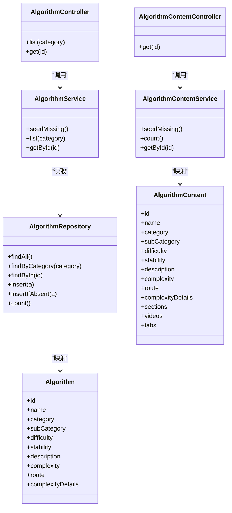
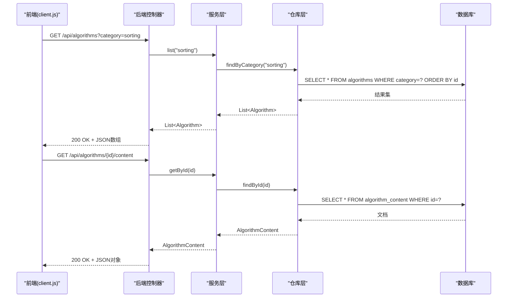

# 算法数据API

<cite>
**本文引用的文件**
- [AlgorithmController.java](file://backend/src/main/java/com/suanfa/controller/AlgorithmController.java)
- [AlgorithmContentController.java](file://backend/src/main/java/com/suanfa/controller/AlgorithmContentController.java)
- [AlgorithmService.java](file://backend/src/main/java/com/suanfa/service/AlgorithmService.java)
- [AlgorithmContentService.java](file://backend/src/main/java/com/suanfa/service/AlgorithmContentService.java)
- [AlgorithmRepository.java](file://backend/src/main/java/com/suanfa/repository/AlgorithmRepository.java)
- [Algorithm.java](file://backend/src/main/java/com/suanfa/entity/Algorithm.java)
- [AlgorithmContent.java](file://backend/src/main/java/com/suanfa/entity/AlgorithmContent.java)
- [algorithms.json](file://backend/src/main/resources/seed/algorithms.json)
- [algorithms-content.json](file://backend/src/main/resources/seed/algorithms-content.json)
- [client.js](file://suanfa_vue/src/api/client.js)
</cite>

## 目录
1. [简介](#简介)
2. [项目结构](#项目结构)
3. [核心组件](#核心组件)
4. [架构总览](#架构总览)
5. [详细接口说明](#详细接口说明)
6. [依赖关系分析](#依赖关系分析)
7. [性能与缓存建议](#性能与缓存建议)
8. [故障排查指南](#故障排查指南)
9. [结论](#结论)
10. [附录：数据结构与示例](#附录数据结构与示例)

## 简介
本文件为“算法数据API”的完整技术文档，面向前端开发者，覆盖算法列表查询、详情获取、分类筛选等能力。文档包含HTTP方法、URL模式、查询参数、响应格式、请求与响应示例，以及分页、排序、过滤的实现现状与建议。同时给出算法数据的组织结构（分类、复杂度分析、内容区块、视频等），并提供前端实现指南（数据缓存、懒加载、降级策略）与性能优化建议。

## 项目结构
后端采用Spring Boot分层架构：
- Controller层暴露REST API
- Service层封装业务逻辑与种子数据导入
- Repository层通过JDBC访问MySQL（算法元数据）与MongoDB（算法详情内容）
- Entity定义数据模型
- Seed数据用于初始化数据库集合

图表来源
- [AlgorithmController.java:1-32](file://backend/src/main/java/com/suanfa/controller/AlgorithmController.java#L1-L32)
- [AlgorithmContentController.java:1-28](file://backend/src/main/java/com/suanfa/controller/AlgorithmContentController.java#L1-L28)
- [AlgorithmService.java:1-64](file://backend/src/main/java/com/suanfa/service/AlgorithmService.java#L1-L64)
- [AlgorithmContentService.java:1-66](file://backend/src/main/java/com/suanfa/service/AlgorithmContentService.java#L1-L66)
- [AlgorithmRepository.java:1-72](file://backend/src/main/java/com/suanfa/repository/AlgorithmRepository.java#L1-L72)

章节来源
- [AlgorithmController.java:1-32](file://backend/src/main/java/com/suanfa/controller/AlgorithmController.java#L1-L32)
- [AlgorithmContentController.java:1-28](file://backend/src/main/java/com/suanfa/controller/AlgorithmContentController.java#L1-L28)
- [AlgorithmService.java:1-64](file://backend/src/main/java/com/suanfa/service/AlgorithmService.java#L1-L64)
- [AlgorithmContentService.java:1-66](file://backend/src/main/java/com/suanfa/service/AlgorithmContentService.java#L1-L66)
- [AlgorithmRepository.java:1-72](file://backend/src/main/java/com/suanfa/repository/AlgorithmRepository.java#L1-L72)

## 核心组件
- 算法元数据接口：提供按分类筛选的算法列表与按ID获取单个算法元信息。
- 算法详情内容接口：提供某算法的详细内容（Markdown区块、标签页、视频等）。
- 服务层：负责从种子文件幂等导入缺失数据，并聚合查询。
- 数据模型：
  - Algorithm：算法元数据（id、name、category、subCategory、difficulty、stability、description、complexity、route、complexityDetails）。
  - AlgorithmContent：算法详情内容（sections、videos、tabs、复杂度细节等）。

章节来源
- [Algorithm.java:1-16](file://backend/src/main/java/com/suanfa/entity/Algorithm.java#L1-L16)
- [AlgorithmContent.java:1-34](file://backend/src/main/java/com/suanfa/entity/AlgorithmContent.java#L1-L34)

## 架构总览

图表来源
- [AlgorithmController.java:21-30](file://backend/src/main/java/com/suanfa/controller/AlgorithmController.java#L21-L30)
- [AlgorithmService.java:54-62](file://backend/src/main/java/com/suanfa/service/AlgorithmService.java#L54-L62)
- [AlgorithmRepository.java:32-43](file://backend/src/main/java/com/suanfa/repository/AlgorithmRepository.java#L32-L43)
- [client.js:49-61](file://suanfa_vue/src/api/client.js#L49-L61)

## 详细接口说明

### 接口一：获取算法列表（支持分类筛选）
- 方法：GET
- URL：/api/algorithms
- 查询参数：
  - category：可选。按主分类筛选（如 sorting、searching、graph、dp、greedy）。不传或为空时返回全部。
- 响应体：
  - 200 OK：JSON数组，元素为Algorithm记录。
  - 404：无此路由（当前不存在）。
- 排序：默认按 category, id 升序；不支持前端自定义排序参数。
- 分页：当前未实现服务端分页；前端可通过客户端分页实现。
- 过滤：仅支持按 category 过滤；不支持难度、关键词等多维过滤。

请求示例
- GET /api/algorithms
- GET /api/algorithms?category=sorting

响应示例（节选字段）
- 数组项包含：id、name、category、subCategory、difficulty、stability、description、complexity、route、complexityDetails。

章节来源
- [AlgorithmController.java:21-30](file://backend/src/main/java/com/suanfa/controller/AlgorithmController.java#L21-L30)
- [AlgorithmService.java:54-58](file://backend/src/main/java/com/suanfa/service/AlgorithmService.java#L54-L58)
- [AlgorithmRepository.java:32-38](file://backend/src/main/java/com/suanfa/repository/AlgorithmRepository.java#L32-L38)
- [Algorithm.java:4-14](file://backend/src/main/java/com/suanfa/entity/Algorithm.java#L4-L14)

### 接口二：获取单个算法元信息
- 方法：GET
- URL：/api/algorithms/{id}
- 路径参数：
  - id：算法唯一标识（如 bubble-sort、binary-search）。
- 响应体：
  - 200 OK：Algorithm对象。
  - 404 Not Found：未找到对应id。

请求示例
- GET /api/algorithms/binary-search

响应示例（节选字段）
- id、name、category、subCategory、difficulty、stability、description、complexity、route、complexityDetails。

章节来源
- [AlgorithmController.java:26-30](file://backend/src/main/java/com/suanfa/controller/AlgorithmController.java#L26-L30)
- [AlgorithmService.java:60-62](file://backend/src/main/java/com/suanfa/service/AlgorithmService.java#L60-L62)
- [AlgorithmRepository.java:40-43](file://backend/src/main/java/com/suanfa/repository/AlgorithmRepository.java#L40-L43)
- [Algorithm.java:4-14](file://backend/src/main/java/com/suanfa/entity/Algorithm.java#L4-L14)

### 接口三：获取算法详情内容（Markdown、标签页、视频）
- 方法：GET
- URL：/api/algorithms/{id}/content
- 路径参数：
  - id：算法唯一标识。
- 响应体：
  - 200 OK：AlgorithmContent对象，包含 sections.basic/advanced/defaultNotes、videos、tabs、复杂度细节等。
  - 404 Not Found：未找到对应id。

请求示例
- GET /api/algorithms/bubble-sort/content

响应示例（节选字段）
- id、name、category、subCategory、difficulty、stability、description、complexity、route、complexityDetails、sections、videos、tabs。

章节来源
- [AlgorithmContentController.java:22-26](file://backend/src/main/java/com/suanfa/controller/AlgorithmContentController.java#L22-L26)
- [AlgorithmContentService.java:62-64](file://backend/src/main/java/com/suanfa/service/AlgorithmContentService.java#L62-L64)
- [AlgorithmContent.java:11-33](file://backend/src/main/java/com/suanfa/entity/AlgorithmContent.java#L11-L33)

### 前端调用与降级策略（重要）
- 前端优先请求后端；若后端不可用，自动降级到本地静态数据（algorithms.js 与 videos.js）。
- 后端可用性探测使用HEAD请求，失败会缓存30秒避免频繁重试。
- 详情内容接口若失败，也会回退到本地数据拼装。

章节来源
- [client.js:12-28](file://suanfa_vue/src/api/client.js#L12-L28)
- [client.js:49-105](file://suanfa_vue/src/api/client.js#L49-L105)

## 依赖关系分析
- 控制器依赖服务，服务依赖仓库；仓库直接操作数据库。
- 种子数据在启动时幂等导入，保证新增分类无需清库。
- 前端通过统一客户端封装请求，具备离线降级能力。

图表来源
- [AlgorithmController.java:1-32](file://backend/src/main/java/com/suanfa/controller/AlgorithmController.java#L1-L32)
- [AlgorithmContentController.java:1-28](file://backend/src/main/java/com/suanfa/controller/AlgorithmContentController.java#L1-L28)
- [AlgorithmService.java:1-64](file://backend/src/main/java/com/suanfa/service/AlgorithmService.java#L1-L64)
- [AlgorithmContentService.java:1-66](file://backend/src/main/java/com/suanfa/service/AlgorithmContentService.java#L1-L66)
- [AlgorithmRepository.java:1-72](file://backend/src/main/java/com/suanfa/repository/AlgorithmRepository.java#L1-L72)
- [Algorithm.java:4-14](file://backend/src/main/java/com/suanfa/entity/Algorithm.java#L4-L14)
- [AlgorithmContent.java:11-33](file://backend/src/main/java/com/suanfa/entity/AlgorithmContent.java#L11-L33)

## 性能与缓存建议
- 列表接口未实现服务端分页与多维过滤，建议在服务端增加：
  - 分页参数：page、size、sort、order。
  - 过滤参数：difficulty、keyword（模糊匹配name/description）、subCategory。
  - 索引优化：对category、id建立复合索引以提升排序与筛选性能。
- 前端缓存策略：
  - 列表数据可缓存一段时间（如5分钟），减少重复请求。
  - 详情内容按需懒加载，进入详情页再请求。
  - 使用浏览器缓存（ETag/Last-Modified）配合后端响应头。
- 降级与容错：
  - 保持前端降级到本地数据的能力，确保无后端时仍可浏览。
  - 对网络异常进行重试与错误提示。

[本节为通用指导，不直接分析具体文件]

## 故障排查指南
- 404 Not Found：
  - 列表或详情接口返回404，检查id是否正确、路由是否注册。
  - 确认后端已部署且端口可达。
- 空列表：
  - 检查种子数据是否成功导入（服务启动时会幂等补齐缺失数据）。
  - 检查数据库连接与表结构。
- 前端降级：
  - 若后端不可用，前端将回退到本地数据；检查本地数据是否完整。
  - 查看后端可用性探测逻辑与缓存时间。

章节来源
- [AlgorithmService.java:25-52](file://backend/src/main/java/com/suanfa/service/AlgorithmService.java#L25-L52)
- [AlgorithmContentService.java:26-56](file://backend/src/main/java/com/suanfa/service/AlgorithmContentService.java#L26-L56)
- [client.js:12-28](file://suanfa_vue/src/api/client.js#L12-L28)

## 结论
当前API提供了基础的算法元数据与详情内容读取能力，支持按分类筛选与按ID获取详情。前端具备完善的降级机制，可在无后端环境下正常浏览。后续建议在服务端增强分页、排序与多维过滤能力，并结合索引优化提升查询性能；前端继续完善缓存与懒加载策略，以获得更佳的用户体验。

[本节为总结性内容，不直接分析具体文件]

## 附录：数据结构与示例

### 算法元数据（Algorithm）
- 字段说明：
  - id：唯一标识
  - name：算法名称
  - category：主分类（如 sorting、searching、graph、dp、greedy）
  - subCategory：子分类（如 比较类排序、分治查找、图遍历等）
  - difficulty：难度（简单、中等、困难、较难）
  - stability：稳定性（稳定、不稳定、null）
  - description：描述
  - complexity：复杂度摘要
  - route：前端路由
  - complexityDetails：复杂度细节（JSON字符串或对象）

章节来源
- [Algorithm.java:4-14](file://backend/src/main/java/com/suanfa/entity/Algorithm.java#L4-L14)
- [algorithms.json:1-471](file://backend/src/main/resources/seed/algorithms.json#L1-L471)

### 算法详情内容（AlgorithmContent）
- 字段说明：
  - id、name、category、subCategory、difficulty、stability、description、complexity、route：与元数据一致
  - complexityDetails：复杂度细节（对象，包含time、space、stability、difficulty、extras）
  - sections：basic/advanced/defaultNotes（Markdown源码）
  - videos：视频条目（title、author、platform、bvid）
  - tabs：标签页（basic、viz、advanced、notes、videos）

章节来源
- [AlgorithmContent.java:11-33](file://backend/src/main/java/com/suanfa/entity/AlgorithmContent.java#L11-L33)
- [algorithms-content.json:1-800](file://backend/src/main/resources/seed/algorithms-content.json#L1-L800)

### 前端调用流程（序列图）

图表来源
- [AlgorithmController.java:21-30](file://backend/src/main/java/com/suanfa/controller/AlgorithmController.java#L21-L30)
- [AlgorithmContentController.java:22-26](file://backend/src/main/java/com/suanfa/controller/AlgorithmContentController.java#L22-L26)
- [AlgorithmService.java:54-62](file://backend/src/main/java/com/suanfa/service/AlgorithmService.java#L54-L62)
- [AlgorithmContentService.java:62-64](file://backend/src/main/java/com/suanfa/service/AlgorithmContentService.java#L62-L64)
- [AlgorithmRepository.java:32-43](file://backend/src/main/java/com/suanfa/repository/AlgorithmRepository.java#L32-L43)