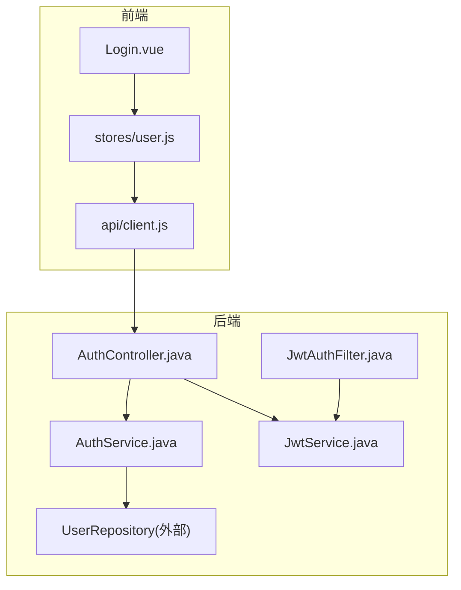
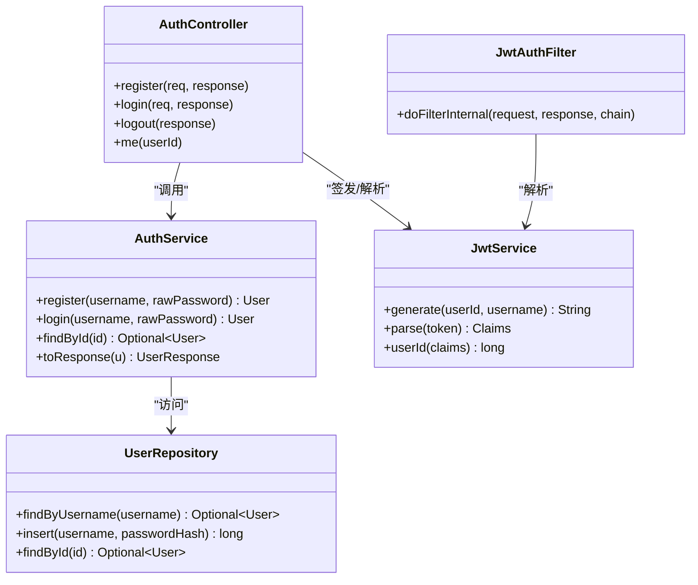

# 认证授权API

<cite>
**本文引用的文件**
- [AuthController.java](file://backend/src/main/java/com/suanfa/controller/AuthController.java)
- [AuthService.java](file://backend/src/main/java/com/suanfa/service/AuthService.java)
- [JwtService.java](file://backend/src/main/java/com/suanfa/security/JwtService.java)
- [JwtAuthFilter.java](file://backend/src/main/java/com/suanfa/security/JwtAuthFilter.java)
- [AuthRequest.java](file://backend/src/main/java/com/suanfa/dto/AuthRequest.java)
- [UserResponse.java](file://backend/src/main/java/com/suanfa/dto/UserResponse.java)
- [User.java](file://backend/src/main/java/com/suanfa/entity/User.java)
- [application.yml](file://backend/src/main/resources/application.yml)
- [client.js](file://suanfa_vue/src/api/client.js)
- [Login.vue](file://suanfa_vue/src/components/common/Login.vue)
- [user.js](file://suanfa_vue/src/stores/user.js)
</cite>

## 目录
1. [简介](#简介)
2. [项目结构](#项目结构)
3. [核心组件](#核心组件)
4. [架构总览](#架构总览)
5. [详细接口说明](#详细接口说明)
6. [依赖关系分析](#依赖关系分析)
7. [性能与安全考虑](#性能与安全考虑)
8. [故障排查指南](#故障排查指南)
9. [结论](#结论)
10. [附录：前端实现指南](#附录：前端实现指南)

## 简介
本文件为认证授权模块的完整技术文档，覆盖用户注册、登录、登出与获取当前用户等接口；详细说明JWT令牌的生成、解析与过期策略；给出HTTP方法、URL模式、请求参数、响应格式及成功/失败示例；并提供安全建议与前端最佳实践（令牌存储、自动刷新、会话恢复）。

## 项目结构
认证相关后端由控制器、服务、安全过滤器与JWT工具组成；前端通过统一的API客户端调用并维护用户状态。



图表来源
- [AuthController.java:15-94](file://backend/src/main/java/com/suanfa/controller/AuthController.java#L15-L94)
- [AuthService.java:10-53](file://backend/src/main/java/com/suanfa/service/AuthService.java#L10-L53)
- [JwtAuthFilter.java:15-49](file://backend/src/main/java/com/suanfa/security/JwtAuthFilter.java#L15-L49)
- [JwtService.java:14-56](file://backend/src/main/java/com/suanfa/security/JwtService.java#L14-L56)
- [client.js:108-131](file://suanfa_vue/src/api/client.js#L108-L131)
- [Login.vue:16-44](file://suanfa_vue/src/components/common/Login.vue#L16-L44)
- [user.js:1-36](file://suanfa_vue/src/stores/user.js#L1-L36)

章节来源
- [AuthController.java:15-94](file://backend/src/main/java/com/suanfa/controller/AuthController.java#L15-L94)
- [application.yml:18-27](file://backend/src/main/resources/application.yml#L18-L27)

## 核心组件
- AuthController：暴露 /api/auth 下的注册、登录、登出、当前用户接口；负责设置/清除Cookie中的JWT。
- AuthService：处理用户名唯一性校验、密码加密与比对、用户查询与DTO转换。
- JwtService：基于HS256签发和解析JWT，支持从配置读取密钥与过期天数。
- JwtAuthFilter：从httpOnly Cookie中解析JWT，将userId注入请求属性，供受保护接口使用。
- DTO/Entity：AuthRequest、UserResponse、User用于请求/响应与数据模型。

章节来源
- [AuthController.java:15-94](file://backend/src/main/java/com/suanfa/controller/AuthController.java#L15-L94)
- [AuthService.java:10-53](file://backend/src/main/java/com/suanfa/service/AuthService.java#L10-L53)
- [JwtService.java:14-56](file://backend/src/main/java/com/suanfa/security/JwtService.java#L14-L56)
- [JwtAuthFilter.java:15-49](file://backend/src/main/java/com/suanfa/security/JwtAuthFilter.java#L15-L49)
- [AuthRequest.java:1-6](file://backend/src/main/java/com/suanfa/dto/AuthRequest.java#L1-L6)
- [UserResponse.java:1-6](file://backend/src/main/java/com/suanfa/dto/UserResponse.java#L1-L6)
- [User.java:1-6](file://backend/src/main/java/com/suanfa/entity/User.java#L1-L6)

## 架构总览
认证流程采用“服务端签发JWT并写入httpOnly Cookie”的模式。前端每次请求携带Cookie，后端过滤器解析JWT并将用户ID注入请求属性，业务接口据此判断是否已登录。

```mermaid
sequenceDiagram
participant FE as "前端"
participant API as "AuthController"
participant SVC as "AuthService"
participant JWT as "JwtService"
participant DB as "数据库"
FE->>API : POST /api/auth/register {username,password}
API->>SVC : register(username,password)
SVC->>DB : 检查用户名/插入用户
DB-->>SVC : 用户对象
SVC-->>API : User
API->>JWT : generate(userId, username)
JWT-->>API : token
API-->>FE : 200 + UserResponse<br/>Set-Cookie : token=...; HttpOnly; SameSite=Lax
FE->>API : GET /api/auth/me
API->>JWT : parse(Cookie.token)
JWT-->>API : Claims
API->>SVC : findById(userId)
SVC-->>API : User
API-->>FE : 200 + UserResponse
```

图表来源
- [AuthController.java:28-71](file://backend/src/main/java/com/suanfa/controller/AuthController.java#L28-L71)
- [AuthService.java:22-51](file://backend/src/main/java/com/suanfa/service/AuthService.java#L22-L51)
- [JwtService.java:28-50](file://backend/src/main/java/com/suanfa/security/JwtService.java#L28-L50)
- [JwtAuthFilter.java:31-47](file://backend/src/main/java/com/suanfa/security/JwtAuthFilter.java#L31-L47)

## 详细接口说明

### 通用约定
- Base URL: /api
- 内容类型: application/json
- 认证方式: httpOnly Cookie（名称: token），跨域需允许凭据
- 统一错误体: { message: string }

章节来源
- [client.js:30-43](file://suanfa_vue/src/api/client.js#L30-L43)
- [AuthController.java:90-93](file://backend/src/main/java/com/suanfa/controller/AuthController.java#L90-L93)

### 注册
- 方法: POST
- 路径: /api/auth/register
- 请求体:
  - username: string（必填）
  - password: string（必填，至少4位）
- 成功响应: 200
  - 主体: UserResponse
  - Set-Cookie: token=...; HttpOnly; Path=/; Max-Age=604800; SameSite=Lax
- 失败响应:
  - 409 Conflict: { message: "用户名已存在" }
  - 400 Bad Request: { message: "用户名不能为空且密码至少 4 位" }

章节来源
- [AuthController.java:28-41](file://backend/src/main/java/com/suanfa/controller/AuthController.java#L28-L41)
- [AuthService.java:22-33](file://backend/src/main/java/com/suanfa/service/AuthService.java#L22-L33)
- [UserResponse.java:1-6](file://backend/src/main/java/com/suanfa/dto/UserResponse.java#L1-L6)

### 登录
- 方法: POST
- 路径: /api/auth/login
- 请求体:
  - username: string（必填）
  - password: string（必填）
- 成功响应: 200
  - 主体: UserResponse
  - Set-Cookie: token=...; HttpOnly; Path=/; Max-Age=604800; SameSite=Lax
- 失败响应:
  - 401 Unauthorized: { message: "用户名或密码错误" }

章节来源
- [AuthController.java:43-52](file://backend/src/main/java/com/suanfa/controller/AuthController.java#L43-L52)
- [AuthService.java:35-43](file://backend/src/main/java/com/suanfa/service/AuthService.java#L35-L43)

### 登出
- 方法: POST
- 路径: /api/auth/logout
- 请求体: 无
- 成功响应: 200
- 行为: 清除token Cookie

章节来源
- [AuthController.java:54-58](file://backend/src/main/java/com/suanfa/controller/AuthController.java#L54-L58)

### 获取当前用户
- 方法: GET
- 路径: /api/auth/me
- 认证: 需要有效的token Cookie
- 成功响应: 200
  - 主体: UserResponse
- 失败响应:
  - 401 Unauthorized: { message: "未登录" } 或 { message: "用户不存在" }

章节来源
- [AuthController.java:60-71](file://backend/src/main/java/com/suanfa/controller/AuthController.java#L60-L71)
- [JwtAuthFilter.java:31-47](file://backend/src/main/java/com/suanfa/security/JwtAuthFilter.java#L31-L47)

### 请求与响应示例

- 注册成功
  - 请求:
    - POST /api/auth/register
    - Content-Type: application/json
    - Body: { "username": "alice", "password": "1234" }
  - 响应:
    - 200 OK
    - Body: { "id": 1, "username": "alice", "createdAt": "..." }
    - Set-Cookie: token=eyJhbGciOiJIUzI1NiIsInR5cCI6IkpXVCJ9...; HttpOnly; Path=/; Max-Age=604800; SameSite=Lax

- 注册失败（用户名已存在）
  - 响应: 409 Conflict
  - Body: { "message": "用户名已存在" }

- 登录成功
  - 请求:
    - POST /api/auth/login
    - Body: { "username": "alice", "password": "1234" }
  - 响应: 200 OK
  - Body: { "id": 1, "username": "alice", "createdAt": "..." }
  - Set-Cookie: token=...; HttpOnly; Path=/; Max-Age=604800; SameSite=Lax

- 登录失败（凭证错误）
  - 响应: 401 Unauthorized
  - Body: { "message": "用户名或密码错误" }

- 获取当前用户（未登录）
  - 响应: 401 Unauthorized
  - Body: { "message": "未登录" }

章节来源
- [AuthController.java:28-71](file://backend/src/main/java/com/suanfa/controller/AuthController.java#L28-L71)
- [UserResponse.java:1-6](file://backend/src/main/java/com/suanfa/dto/UserResponse.java#L1-L6)

## 依赖关系分析



图表来源
- [AuthController.java:15-94](file://backend/src/main/java/com/suanfa/controller/AuthController.java#L15-L94)
- [AuthService.java:10-53](file://backend/src/main/java/com/suanfa/service/AuthService.java#L10-L53)
- [JwtService.java:14-56](file://backend/src/main/java/com/suanfa/security/JwtService.java#L14-L56)
- [JwtAuthFilter.java:15-49](file://backend/src/main/java/com/suanfa/security/JwtAuthFilter.java#L15-L49)

章节来源
- [AuthController.java:15-94](file://backend/src/main/java/com/suanfa/controller/AuthController.java#L15-L94)
- [AuthService.java:10-53](file://backend/src/main/java/com/suanfa/service/AuthService.java#L10-L53)
- [JwtService.java:14-56](file://backend/src/main/java/com/suanfa/security/JwtService.java#L14-L56)
- [JwtAuthFilter.java:15-49](file://backend/src/main/java/com/suanfa/security/JwtAuthFilter.java#L15-L49)

## 性能与安全考虑

- 密码安全
  - 使用BCrypt对密码进行哈希存储，避免明文保存。
  - 登录时通过匹配器验证原始密码与哈希值。

- 令牌机制
  - 算法: HS256，subject为用户ID，claim包含username。
  - 有效期: 由配置项 suafa.jwt.expiry-days 控制（默认7天）。
  - 传输与存储: 通过httpOnly Cookie下发，降低XSS窃取风险；SameSite=Lax缓解CSRF风险。
  - 解析: 过滤器从Cookie中读取并解析，无效或过期返回null，不拦截但交由业务层判定。

- 权限控制
  - 当前设计在Controller层通过请求属性判断是否已登录；如需细粒度权限，可在过滤器或注解层扩展。

- 配置要点
  - 生产环境必须通过环境变量覆盖 suafa.jwt.secret，避免硬编码密钥。
  - CORS在生产应限制allowed-origins为可信域名。

章节来源
- [AuthService.java:17-20](file://backend/src/main/java/com/suanfa/service/AuthService.java#L17-L20)
- [AuthService.java:35-43](file://backend/src/main/java/com/suanfa/service/AuthService.java#L35-L43)
- [JwtService.java:21-36](file://backend/src/main/java/com/suanfa/security/JwtService.java#L21-L36)
- [JwtService.java:39-50](file://backend/src/main/java/com/suanfa/security/JwtService.java#L39-L50)
- [application.yml:18-27](file://backend/src/main/resources/application.yml#L18-L27)
- [AuthController.java:73-88](file://backend/src/main/java/com/suanfa/controller/AuthController.java#L73-L88)

## 故障排查指南

- 401 未登录
  - 可能原因: Cookie缺失、Token过期、过滤器未解析到有效Claims。
  - 排查: 检查浏览器是否发送Cookie；确认服务端已正确设置token；查看JwtService.parse是否返回null。

- 409 用户名已存在
  - 可能原因: 重复注册。
  - 处理: 提示用户更换用户名或引导登录。

- 400 参数校验失败
  - 可能原因: 用户名空或密码长度不足。
  - 处理: 前端增加输入校验并提示。

- 跨域导致Cookie不发送
  - 可能原因: 前端未启用凭据或后端CORS未放行。
  - 处理: 前端fetch使用credentials: include；后端CORS允许对应origin。

章节来源
- [AuthController.java:28-71](file://backend/src/main/java/com/suanfa/controller/AuthController.java#L28-L71)
- [JwtAuthFilter.java:31-47](file://backend/src/main/java/com/suanfa/security/JwtAuthFilter.java#L31-L47)
- [client.js:30-43](file://suanfa_vue/src/api/client.js#L30-L43)

## 结论
该认证方案以httpOnly Cookie承载JWT为核心，结合BCrypt密码哈希与可配置的令牌有效期，实现了简洁安全的注册、登录、登出与会话恢复。前端通过统一客户端封装了凭据传递与错误处理，便于集成与维护。后续可按需在过滤器或注解层引入更细粒度的权限控制。

## 附录：前端实现指南

- 基础调用
  - 使用提供的API客户端函数：register、login、logout、fetchCurrentUser。
  - 所有请求均附带credentials: include，确保Cookie随请求发送。

- 登录态初始化
  - 应用启动时调用init()拉取当前用户，若失败则视为未登录。

- 登录/注册流程
  - 表单提交前做前端校验（用户名非空、密码长度≥4、注册时两次密码一致）。
  - 成功后跳转首页或目标页面。

- 登出流程
  - 调用logout()后清空本地用户状态。

- 令牌存储与刷新
  - 令牌由服务端通过httpOnly Cookie管理，前端无需手动存取。
  - 令牌过期后，受保护接口将返回401；建议在路由守卫或全局拦截器中检测401并引导重新登录。
  - 如需“静默续期”，可增加一个仅刷新Cookie的接口并在后台定时调用；当前实现可通过再次访问 /api/auth/me 触发服务端逻辑（如需）。

- 跨域与安全性
  - 开发阶段CORS可放宽，生产务必限制allowed-origins。
  - 不要将token写入localStorage或sessionStorage，保持httpOnly策略。

章节来源
- [client.js:108-131](file://suanfa_vue/src/api/client.js#L108-L131)
- [user.js:13-33](file://suanfa_vue/src/stores/user.js#L13-L33)
- [Login.vue:16-44](file://suanfa_vue/src/components/common/Login.vue#L16-L44)
- [application.yml:18-27](file://backend/src/main/resources/application.yml#L18-L27)