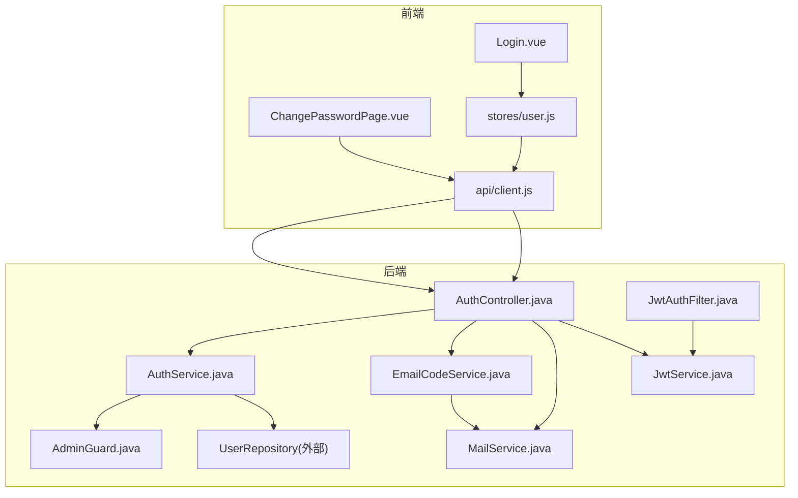
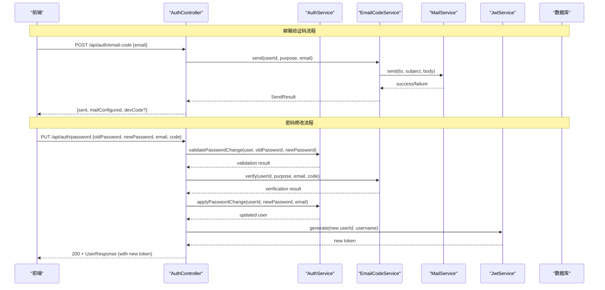
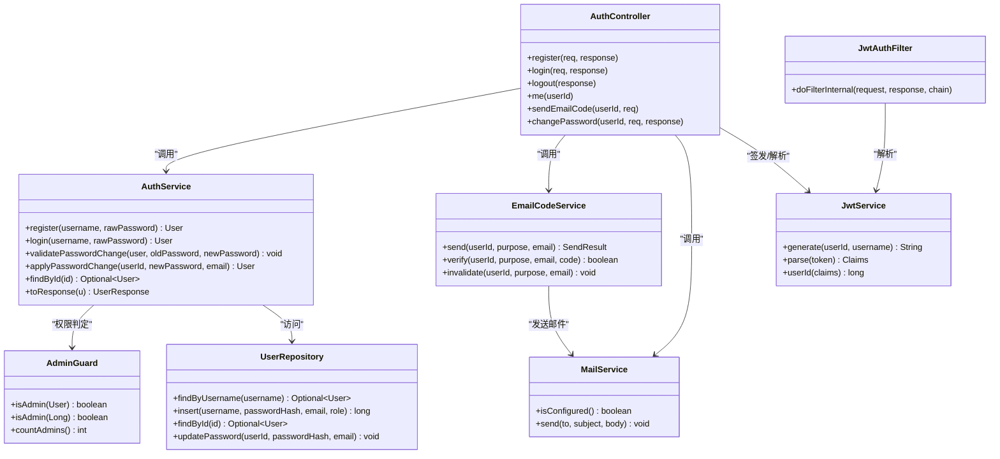

# 认证授权API

<cite>
**本文引用的文件**
- [AuthController.java](file://backend/src/main/java/com/suanfa/controller/AuthController.java)
- [AuthService.java](file://backend/src/main/java/com/suanfa/service/AuthService.java)
- [JwtService.java](file://backend/src/main/java/com/suanfa/security/JwtService.java)
- [JwtAuthFilter.java](file://backend/src/main/java/com/suanfa/security/JwtAuthFilter.java)
- [EmailCodeService.java](file://backend/src/main/java/com/suanfa/service/EmailCodeService.java)
- [MailService.java](file://backend/src/main/java/com/suanfa/service/MailService.java)
- [AdminGuard.java](file://backend/src/main/java/com/suanfa/service/AdminGuard.java)
- [AuthRequest.java](file://backend/src/main/java/com/suanfa/dto/AuthRequest.java)
- [ChangePasswordRequest.java](file://backend/src/main/java/com/suanfa/dto/ChangePasswordRequest.java)
- [EmailCodeRequest.java](file://backend/src/main/java/com/suanfa/dto/EmailCodeRequest.java)
- [UserResponse.java](file://backend/src/main/java/com/suanfa/dto/UserResponse.java)
- [User.java](file://backend/src/main/java/com/suanfa/entity/User.java)
- [MailProperties.java](file://backend/src/main/java/com/suanfa/config/MailProperties.java)
- [application.yml](file://backend/src/main/resources/application.yml)
- [client.js](file://suanfa_vue/src/api/client.js)
- [Login.vue](file://suanfa_vue/src/components/common/Login.vue)
- [ChangePasswordPage.vue](file://suanfa_vue/src/components/common/ChangePasswordPage.vue)
- [user.js](file://suanfa_vue/src/stores/user.js)
</cite>

## 更新摘要
**变更内容**
- 新增邮箱验证码发送接口 `/api/auth/email-code`
- 新增密码修改接口 `/api/auth/password`（需要邮箱验证码）
- 增强用户模型支持邮箱绑定和角色管理
- 添加管理员权限控制机制
- 集成邮件服务用于验证码发送
- 前端新增完整的密码修改界面

## 目录
1. [简介](#简介)
2. [项目结构](#项目结构)
3. [核心组件](#核心组件)
4. [架构总览](#架构总览)
5. [详细接口说明](#详细接口说明)
6. [依赖关系分析](#依赖关系分析)
7. [性能与安全考虑](#性能与安全考虑)
8. [故障排查指南](#故障排查指南)
9. [结论](#结论)
10. [附录：前端实现指南](#附录：前端实现指南)

## 简介
本文件为认证授权模块的完整技术文档，覆盖用户注册、登录、登出与获取当前用户等基础接口；详细说明JWT令牌的生成、解析与过期策略；新增邮箱验证码验证和密码修改功能；提供角色-based授权机制（管理员和普通用户）；给出HTTP方法、URL模式、请求参数、响应格式及成功/失败示例；并提供安全建议与前端最佳实践（令牌存储、自动刷新、会话恢复）。

## 项目结构
认证相关后端由控制器、服务、安全过滤器与JWT工具组成；新增邮件服务和邮箱验证码服务；前端通过统一的API客户端调用并维护用户状态，包含完整的密码修改界面。

**图表来源**
- [AuthController.java:25-173](file://backend/src/main/java/com/suanfa/controller/AuthController.java#L25-L173)
- [AuthService.java:10-94](file://backend/src/main/java/com/suanfa/service/AuthService.java#L10-L94)
- [EmailCodeService.java:15-195](file://backend/src/main/java/com/suanfa/service/EmailCodeService.java#L15-L195)
- [MailService.java:15-109](file://backend/src/main/java/com/suanfa/service/MailService.java#L15-L109)
- [AdminGuard.java:12-72](file://backend/src/main/java/com/suanfa/service/AdminGuard.java#L12-L72)

## 核心组件
- **AuthController**：暴露 /api/auth 下的注册、登录、登出、当前用户、邮箱验证码、密码修改接口；负责设置/清除Cookie中的JWT。
- **AuthService**：处理用户名唯一性校验、密码加密与比对、用户查询与DTO转换、密码修改验证。
- **EmailCodeService**：管理邮箱验证码的生成、发送、验证和生命周期管理，支持重发限流和尝试次数限制。
- **MailService**：SMTP邮件发送服务，支持SSL/TLS配置，未配置时进入开发模式。
- **AdminGuard**：管理员权限判定，支持数据库角色和配置白名单双重机制。
- **JwtService**：基于HS256签发和解析JWT，支持从配置读取密钥与过期天数。
- **JwtAuthFilter**：从httpOnly Cookie中解析JWT，将userId注入请求属性，供受保护接口使用。

**章节来源**
- [AuthController.java:25-173](file://backend/src/main/java/com/suanfa/controller/AuthController.java#L25-L173)
- [AuthService.java:10-94](file://backend/src/main/java/com/suanfa/service/AuthService.java#L10-L94)
- [EmailCodeService.java:15-195](file://backend/src/main/java/com/suanfa/service/EmailCodeService.java#L15-L195)
- [MailService.java:15-109](file://backend/src/main/java/com/suanfa/service/MailService.java#L15-L109)
- [AdminGuard.java:12-72](file://backend/src/main/java/com/suanfa/service/AdminGuard.java#L12-L72)

## 架构总览
认证流程采用"服务端签发JWT并写入httpOnly Cookie"的模式。新增的邮箱验证码系统提供二次身份验证，确保密码修改的安全性。管理员权限系统支持基于角色的访问控制。

**图表来源**
- [AuthController.java:87-142](file://backend/src/main/java/com/suanfa/controller/AuthController.java#L87-L142)
- [EmailCodeService.java:63-141](file://backend/src/main/java/com/suanfa/service/EmailCodeService.java#L63-L141)
- [MailService.java:43-82](file://backend/src/main/java/com/suanfa/service/MailService.java#L43-L82)

## 详细接口说明

### 通用约定
- Base URL: /api
- 内容类型: application/json
- 认证方式: httpOnly Cookie（名称: token），跨域需允许凭据
- 统一错误体: { message: string }

**章节来源**
- [client.js:30-43](file://suanfa_vue/src/api/client.js#L30-L43)
- [AuthController.java:169-171](file://backend/src/main/java/com/suanfa/controller/AuthController.java#L169-L171)

### 基础认证接口

#### 注册
- 方法: POST
- 路径: /api/auth/register
- 请求体:
  - username: string（必填）
  - password: string（必填，至少4位）
- 成功响应: 200
  - 主体: UserResponse（包含id, username, email, createdAt, role, admin）
  - Set-Cookie: token=...; HttpOnly; Path=/; Max-Age=604800; SameSite=Lax
- 失败响应:
  - 409 Conflict: { message: "用户名已存在" }
  - 400 Bad Request: { message: "用户名不能为空且密码至少 4 位" }

#### 登录
- 方法: POST
- 路径: /api/auth/login
- 请求体:
  - username: string（必填）
  - password: string（必填）
- 成功响应: 200
  - 主体: UserResponse（包含id, username, email, createdAt, role, admin）
  - Set-Cookie: token=...; HttpOnly; Path=/; Max-Age=604800; SameSite=Lax
- 失败响应:
  - 401 Unauthorized: { message: "用户名或密码错误" }

#### 登出
- 方法: POST
- 路径: /api/auth/logout
- 请求体: 无
- 成功响应: 200
- 行为: 清除token Cookie

#### 获取当前用户
- 方法: GET
- 路径: /api/auth/me
- 认证: 需要有效的token Cookie
- 成功响应: 200
  - 主体: UserResponse（包含id, username, email, createdAt, role, admin）
- 失败响应:
  - 401 Unauthorized: { message: "未登录" } 或 { message: "用户不存在" }

### 新增邮箱验证码接口

#### 发送邮箱验证码
- 方法: POST
- 路径: /api/auth/email-code
- 认证: 需要有效的token Cookie
- 请求体:
  - email: string（必填，邮箱格式）
- 成功响应: 200
  - 主体: { sent: boolean, mailConfigured: boolean, maskedEmail: string, expiresInSeconds: number, cooldownSeconds: number, devCode?: string }
  - devCode字段仅在开发模式（未配置SMTP）时返回
- 失败响应:
  - 401 Unauthorized: { message: "未登录" }
  - 400 Bad Request: { message: "邮箱格式不正确" } 或 { message: "验证码发送过于频繁，请 X 秒后重试" }
  - 502 Bad Gateway: { message: "邮件发送失败..." }

**章节来源**
- [AuthController.java:87-116](file://backend/src/main/java/com/suanfa/controller/AuthController.java#L87-L116)
- [EmailCodeService.java:63-104](file://backend/src/main/java/com/suanfa/service/EmailCodeService.java#L63-L104)

### 新增密码修改接口

#### 修改密码
- 方法: PUT
- 路径: /api/auth/password
- 认证: 需要有效的token Cookie
- 请求体:
  - oldPassword: string（必填，原密码）
  - newPassword: string（必填，新密码至少6位）
  - email: string（可选，用于绑定的邮箱）
  - code: string（必填，邮箱验证码）
- 成功响应: 200
  - 主体: UserResponse（包含更新后的用户信息和新绑定的邮箱）
  - Set-Cookie: token=...; HttpOnly; Path=/; Max-Age=604800; SameSite=Lax（重新签发新令牌）
- 失败响应:
  - 401 Unauthorized: { message: "未登录" }
  - 400 Bad Request: { message: "原密码不正确" } 或 { message: "新密码至少 6 位" } 或 { message: "新密码不能与原密码相同" }
  - 400 Bad Request: { message: "请输入邮箱验证码" } 或 { message: "验证码已过期，请重新获取" } 或 { message: "验证码错误次数过多，请重新获取" }
  - 502 Bad Gateway: { message: "邮件发送失败..." }

**章节来源**
- [AuthController.java:118-142](file://backend/src/main/java/com/suanfa/controller/AuthController.java#L118-L142)
- [AuthService.java:55-83](file://backend/src/main/java/com/suanfa/service/AuthService.java#L55-L83)

### 请求与响应示例

#### 发送邮箱验证码
- 请求:
  - POST /api/auth/email-code
  - Content-Type: application/json
  - Body: { "email": "user@example.com" }
- 成功响应:
  - 200 OK
  - Body: { "sent": true, "mailConfigured": true, "maskedEmail": "us***@example.com", "expiresInSeconds": 600, "cooldownSeconds": 60 }
- 开发模式响应:
  - 200 OK
  - Body: { "sent": false, "mailConfigured": false, "devCode": "123456", "expiresInSeconds": 600, "cooldownSeconds": 60 }

#### 修改密码
- 请求:
  - PUT /api/auth/password
  - Content-Type: application/json
  - Body: { "oldPassword": "oldpass123", "newPassword": "newpass456", "email": "user@example.com", "code": "123456" }
- 成功响应:
  - 200 OK
  - Body: { "id": 1, "username": "alice", "email": "user@example.com", "createdAt": "...", "role": "user", "admin": false }
  - Set-Cookie: token=...; HttpOnly; Path=/; Max-Age=604800; SameSite=Lax

#### 用户响应格式
- UserResponse:
  - id: number（用户ID）
  - username: string（用户名）
  - email: string?（绑定的邮箱，可为空）
  - createdAt: string（创建时间）
  - role: string（角色：user 或 admin）
  - admin: boolean（是否为管理员）

**章节来源**
- [AuthController.java:45-142](file://backend/src/main/java/com/suanfa/controller/AuthController.java#L45-L142)
- [AuthService.java:89-92](file://backend/src/main/java/com/suanfa/service/AuthService.java#L89-L92)

## 依赖关系分析

**图表来源**
- [AuthController.java:25-173](file://backend/src/main/java/com/suanfa/controller/AuthController.java#L25-L173)
- [AuthService.java:10-94](file://backend/src/main/java/com/suanfa/service/AuthService.java#L10-L94)
- [EmailCodeService.java:15-195](file://backend/src/main/java/com/suanfa/service/EmailCodeService.java#L15-L195)
- [MailService.java:15-109](file://backend/src/main/java/com/suanfa/service/MailService.java#L15-L109)
- [AdminGuard.java:12-72](file://backend/src/main/java/com/suanfa/service/AdminGuard.java#L12-L72)

**章节来源**
- [AuthController.java:25-173](file://backend/src/main/java/com/suanfa/controller/AuthController.java#L25-L173)
- [AuthService.java:10-94](file://backend/src/main/java/com/suanfa/service/AuthService.java#L10-L94)
- [EmailCodeService.java:15-195](file://backend/src/main/java/com/suanfa/service/EmailCodeService.java#L15-L195)
- [MailService.java:15-109](file://backend/src/main/java/com/suanfa/service/MailService.java#L15-L109)
- [AdminGuard.java:12-72](file://backend/src/main/java/com/suanfa/service/AdminGuard.java#L12-L72)

## 性能与安全考虑

### 密码安全
- 使用BCrypt对密码进行哈希存储，避免明文保存。
- 登录时通过匹配器验证原始密码与哈希值。
- 密码修改前验证原密码正确性和新密码强度。

### 邮箱验证码安全
- 验证码存储在内存中（ConcurrentHashMap），重启后自动失效。
- 验证码有效期默认600秒（可配置）。
- 重发冷却时间默认60秒（可配置）。
- 最大尝试次数默认5次（可配置）。
- 验证码一次性使用，验证后立即删除。
- 开发模式下可选择是否回显验证码到响应。

### 令牌机制
- 算法: HS256，subject为用户ID，claim包含username。
- 有效期: 由配置项 suafa.jwt.expiry-days 控制（默认7天）。
- 传输与存储: 通过httpOnly Cookie下发，降低XSS窃取风险；SameSite=Lax缓解CSRF风险。
- 解析: 过滤器从Cookie中读取并解析，无效或过期返回null，不拦截但交由业务层判定。
- 密码修改后重新签发新令牌。

### 权限控制
- 支持两种管理员身份：数据库角色（users.role='admin'）和配置白名单（suanfa.ai.admin-usernames）。
- 管理员判定逻辑收口在AdminGuard服务中。
- 当前设计在Controller层通过请求属性判断是否已登录；如需细粒度权限，可在过滤器或注解层扩展。

### 邮件服务配置
- 支持SSL和STARTTLS连接。
- 未配置SMTP时进入开发模式，验证码仅写日志。
- 生产环境必须配置有效的SMTP服务器。

**章节来源**
- [AuthService.java:24-45](file://backend/src/main/java/com/suanfa/service/AuthService.java#L24-L45)
- [AuthService.java:55-83](file://backend/src/main/java/com/suanfa/service/AuthService.java#L55-L83)
- [EmailCodeService.java:63-141](file://backend/src/main/java/com/suanfa/service/EmailCodeService.java#L63-L141)
- [MailService.java:32-82](file://backend/src/main/java/com/suanfa/service/MailService.java#L32-L82)
- [AdminGuard.java:52-65](file://backend/src/main/java/com/suanfa/service/AdminGuard.java#L52-L65)
- [application.yml:18-70](file://backend/src/main/resources/application.yml#L18-L70)

## 故障排查指南

### 认证相关问题
- **401 未登录**: 检查Cookie是否存在、Token是否过期、过滤器是否正确解析。
- **409 用户名已存在**: 重复注册，提示用户更换用户名或引导登录。
- **400 参数校验失败**: 用户名空或密码长度不足，前端增加输入校验。

### 邮箱验证码问题
- **邮箱格式不正确**: 检查邮箱格式是否符合正则表达式。
- **验证码发送过于频繁**: 等待冷却时间后再试。
- **验证码已过期**: 重新获取验证码。
- **验证码错误次数过多**: 验证码被作废，需要重新获取。
- **邮件发送失败**: 检查SMTP配置和网络连接。

### 密码修改问题
- **原密码不正确**: 确认输入的当前密码正确。
- **新密码不符合要求**: 新密码至少6位，且不能与原密码相同。
- **验证码问题**: 确保先获取验证码，再在规定时间内使用。

### 权限相关问题
- **管理员功能不可用**: 检查用户角色或是否在配置白名单中。
- **数据不一致**: 确认AdminGuard的判定逻辑和用户数据同步。

**章节来源**
- [AuthController.java:45-142](file://backend/src/main/java/com/suanfa/controller/AuthController.java#L45-L142)
- [EmailCodeService.java:63-141](file://backend/src/main/java/com/suanfa/service/EmailCodeService.java#L63-L141)
- [MailService.java:43-82](file://backend/src/main/java/com/suanfa/service/MailService.java#L43-L82)

## 结论
该认证方案以httpOnly Cookie承载JWT为核心，结合BCrypt密码哈希、邮箱验证码二次验证和可配置的令牌有效期，实现了安全的注册、登录、登出、密码修改与会话恢复功能。新增的角色授权机制支持管理员和普通用户的差异化权限控制。前端通过完整的密码修改界面和统一客户端封装了凭据传递与错误处理，便于集成与维护。

## 附录：前端实现指南

### 基础调用
- 使用提供的API客户端函数：register、login、logout、fetchCurrentUser、sendEmailCode、changePassword。
- 所有请求均附带credentials: 'include'，确保Cookie随请求发送。

### 登录态初始化
- 应用启动时调用init()拉取当前用户，若失败则视为未登录。
- 支持管理员状态检测：userStore.isAdmin。

### 密码修改流程
- **步骤1**: 调用sendEmailCode(email)发送验证码。
- **步骤2**: 处理响应，开发模式下自动填充devCode。
- **步骤3**: 用户输入验证码、原密码和新密码。
- **步骤4**: 调用changePassword({email, code, oldPassword, newPassword})提交修改。
- **步骤5**: 成功后刷新用户状态，显示绑定邮箱。

### 表单验证
- 邮箱格式验证：正则表达式检查。
- 验证码长度：固定6位数字。
- 密码强度：新密码至少6位，两次输入一致。
- 原密码验证：防止未授权密码修改。

### 用户体验优化
- 验证码倒计时：防止频繁发送。
- 开发模式支持：未配置SMTP时自动回显验证码。
- 错误提示：详细的错误信息和操作指导。
- 状态反馈：发送中、提交中等加载状态。

### 令牌存储与刷新
- 令牌由服务端通过httpOnly Cookie管理，前端无需手动存取。
- 密码修改后自动重新签发新令牌。
- 令牌过期后，受保护接口将返回401；建议在路由守卫或全局拦截器中检测401并引导重新登录。

### 跨域与安全性
- 开发阶段CORS可放宽，生产务必限制allowed-origins。
- 不要将token写入localStorage或sessionStorage，保持httpOnly策略。
- 邮箱验证码在生产环境不会回显到响应中。

**章节来源**
- [client.js:111-148](file://suanfa_vue/src/api/client.js#L111-L148)
- [user.js:21-55](file://suanfa_vue/src/stores/user.js#L21-L55)
- [ChangePasswordPage.vue:49-103](file://suanfa_vue/src/components/common/ChangePasswordPage.vue#L49-L103)
- [application.yml:28-45](file://backend/src/main/resources/application.yml#L28-L45)