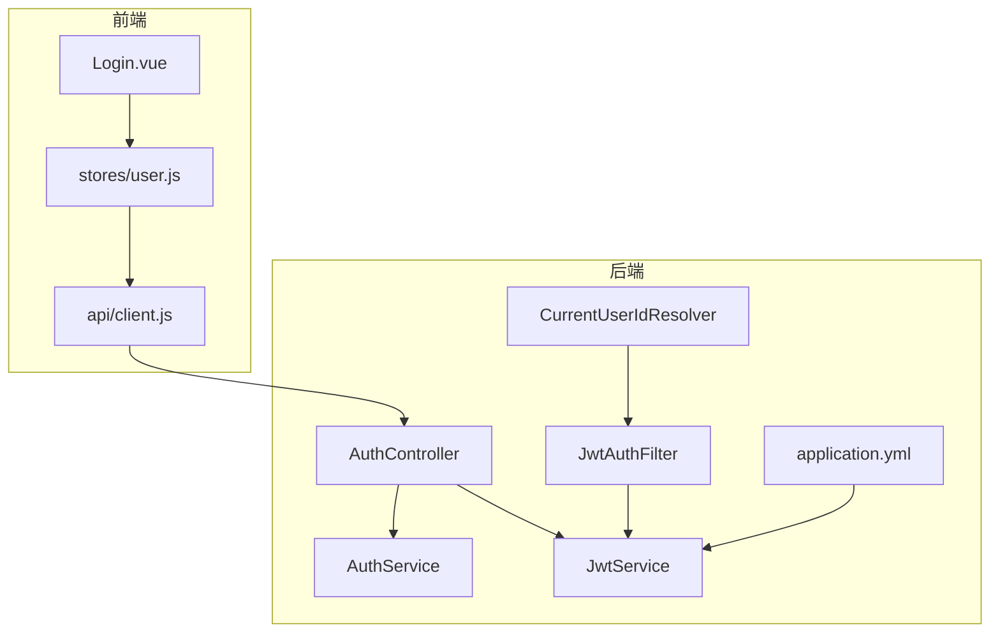
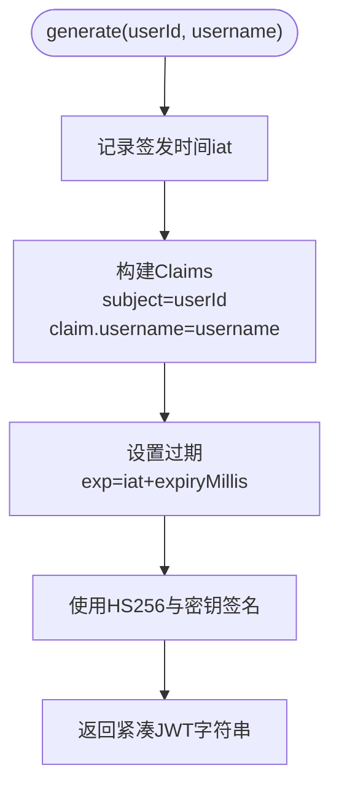
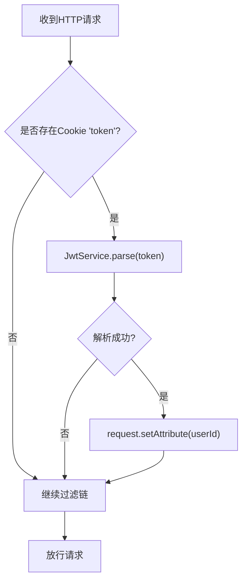
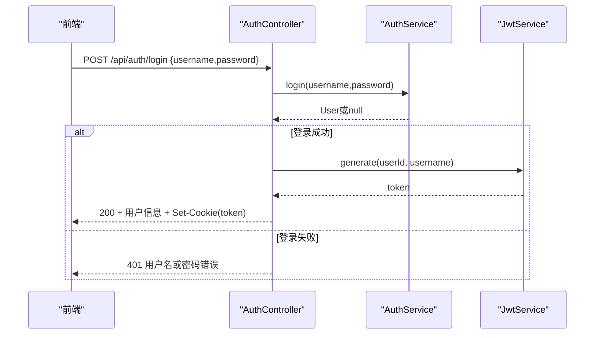
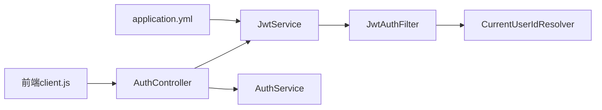

# JWT认证机制

<cite>
**本文引用的文件**
- [JwtService.java](file://backend/src/main/java/com/suanfa/security/JwtService.java)
- [JwtAuthFilter.java](file://backend/src/main/java/com/suanfa/security/JwtAuthFilter.java)
- [CurrentUserIdResolver.java](file://backend/src/main/java/com/suanfa/security/CurrentUserIdResolver.java)
- [CurrentUserId.java](file://backend/src/main/java/com/suanfa/security/CurrentUserId.java)
- [AuthController.java](file://backend/src/main/java/com/suanfa/controller/AuthController.java)
- [AuthService.java](file://backend/src/main/java/com/suanfa/service/AuthService.java)
- [application.yml](file://backend/src/main/resources/application.yml)
- [Login.vue](file://suanfa_vue/src/components/common/Login.vue)
- [user.js](file://suanfa_vue/src/stores/user.js)
- [client.js](file://suanfa_vue/src/api/client.js)
</cite>

## 目录
1. [简介](#简介)
2. [项目结构](#项目结构)
3. [核心组件](#核心组件)
4. [架构总览](#架构总览)
5. [详细组件分析](#详细组件分析)
6. [依赖关系分析](#依赖关系分析)
7. [性能与扩展性](#性能与扩展性)
8. [故障排查指南](#故障排查指南)
9. [结论](#结论)
10. [附录：配置与示例](#附录配置与示例)

## 简介
本文件围绕后端基于JWT的无状态认证方案，系统说明令牌生命周期（生成、验证、过期处理）、用户登录到签发令牌的完整流程、Cookie存储策略、前端解析与携带机制，以及安全最佳实践。当前实现采用HS256对称签名算法，使用应用配置中的密钥进行签名；请求通过过滤器从httpOnly Cookie中解析JWT并注入当前用户ID，控制器层按需校验。

## 项目结构
与JWT认证相关的代码主要分布在以下模块：
- 安全层：JwtService、JwtAuthFilter、@CurrentUserId注解及参数解析器
- 认证接口：AuthController（注册/登录/登出/当前用户）
- 业务服务：AuthService（密码加密、用户校验）
- 配置：application.yml中的JWT密钥与有效期
- 前端：登录页面、用户状态管理、API客户端（自动携带Cookie）



图表来源
- [AuthController.java:1-94](file://backend/src/main/java/com/suanfa/controller/AuthController.java#L1-L94)
- [JwtService.java:1-56](file://backend/src/main/java/com/suanfa/security/JwtService.java#L1-L56)
- [JwtAuthFilter.java:1-49](file://backend/src/main/java/com/suanfa/security/JwtAuthFilter.java#L1-L49)
- [CurrentUserIdResolver.java:1-28](file://backend/src/main/java/com/suanfa/security/CurrentUserIdResolver.java#L1-L28)
- [application.yml:18-24](file://backend/src/main/resources/application.yml#L18-L24)
- [Login.vue:1-178](file://suanfa_vue/src/components/common/Login.vue#L1-L178)
- [user.js:1-36](file://suanfa_vue/src/stores/user.js#L1-L36)
- [client.js:10-131](file://suanfa_vue/src/api/client.js#L10-L131)

章节来源
- [AuthController.java:1-94](file://backend/src/main/java/com/suanfa/controller/AuthController.java#L1-L94)
- [JwtService.java:1-56](file://backend/src/main/java/com/suanfa/security/JwtService.java#L1-L56)
- [JwtAuthFilter.java:1-49](file://backend/src/main/java/com/suanfa/security/JwtAuthFilter.java#L1-L49)
- [CurrentUserIdResolver.java:1-28](file://backend/src/main/java/com/suanfa/security/CurrentUserIdResolver.java#L1-L28)
- [application.yml:18-24](file://backend/src/main/resources/application.yml#L18-L24)
- [Login.vue:1-178](file://suanfa_vue/src/components/common/Login.vue#L1-L178)
- [user.js:1-36](file://suanfa_vue/src/stores/user.js#L1-L36)
- [client.js:10-131](file://suanfa_vue/src/api/client.js#L10-L131)

## 核心组件
- JwtService：负责JWT的签发与解析，使用HS256算法，Claims包含subject为userId、username自定义claim，支持过期时间控制。
- JwtAuthFilter：在每次请求时从httpOnly Cookie“token”中读取JWT并解析，将userId注入请求属性，供后续控制器或参数解析器使用。
- CurrentUserId注解与解析器：允许在控制器方法参数上声明@CurrentUserId以获取当前用户ID（未认证时为null）。
- AuthController：提供注册、登录、登出、获取当前用户等接口；登录成功后设置httpOnly Cookie并返回用户信息。
- AuthService：负责用户名唯一性检查、密码BCrypt加密与校验、用户查询。
- application.yml：定义JWT密钥与有效期，以及CORS等运行配置。
- 前端：Login.vue调用user store，user store通过client.js发起认证请求；client.js默认携带credentials: include，使浏览器自动附带Cookie。

章节来源
- [JwtService.java:1-56](file://backend/src/main/java/com/suanfa/security/JwtService.java#L1-L56)
- [JwtAuthFilter.java:1-49](file://backend/src/main/java/com/suanfa/security/JwtAuthFilter.java#L1-L49)
- [CurrentUserId.java:1-16](file://backend/src/main/java/com/suanfa/security/CurrentUserId.java#L1-L16)
- [CurrentUserIdResolver.java:1-28](file://backend/src/main/java/com/suanfa/security/CurrentUserIdResolver.java#L1-L28)
- [AuthController.java:1-94](file://backend/src/main/java/com/suanfa/controller/AuthController.java#L1-L94)
- [AuthService.java:1-53](file://backend/src/main/java/com/suanfa/service/AuthService.java#L1-L53)
- [application.yml:18-24](file://backend/src/main/resources/application.yml#L18-L24)
- [Login.vue:1-178](file://suanfa_vue/src/components/common/Login.vue#L1-L178)
- [user.js:1-36](file://suanfa_vue/src/stores/user.js#L1-L36)
- [client.js:10-131](file://suanfa_vue/src/api/client.js#L10-L131)

## 架构总览
下图展示了从前端登录到后端签发JWT、再到后续受保护接口鉴权的整体流程。

```mermaid
sequenceDiagram
participant FE as "前端(Login.vue)"
participant Store as "用户状态(user.js)"
participant API as "API客户端(client.js)"
participant CTRL as "AuthController"
participant SVC as "AuthService"
participant JWT as "JwtService"
participant FIL as "JwtAuthFilter"
FE->>Store : 提交用户名/密码
Store->>API : POST /api/auth/login (credentials : include)
API->>CTRL : 转发请求
CTRL->>SVC : 校验用户名+密码(BCrypt)
SVC-->>CTRL : 成功返回用户对象
CTRL->>JWT : generate(userId, username)
JWT-->>CTRL : 返回JWT字符串
CTRL-->>API : 200 + 用户信息 + Set-Cookie(token=JWT; httpOnly; SameSite=Lax)
API-->>Store : 响应体
Store-->>FE : 更新用户状态
Note over FE,API : 后续受保护请求由浏览器自动携带Cookie
FE->>API : GET /api/auth/me (带Cookie)
API->>FIL : 进入过滤器
FIL->>JWT : parse(Cookie.token)
JWT-->>FIL : Claims或null
FIL-->>API : 注入userId到请求属性
API->>CTRL : 调用me()
CTRL-->>API : 返回当前用户或401
```

图表来源
- [AuthController.java:43-71](file://backend/src/main/java/com/suanfa/controller/AuthController.java#L43-L71)
- [AuthService.java:22-43](file://backend/src/main/java/com/suanfa/service/AuthService.java#L22-L43)
- [JwtService.java:28-54](file://backend/src/main/java/com/suanfa/security/JwtService.java#L28-L54)
- [JwtAuthFilter.java:31-47](file://backend/src/main/java/com/suanfa/security/JwtAuthFilter.java#L31-L47)
- [client.js:118-131](file://suanfa_vue/src/api/client.js#L118-L131)
- [user.js:24-33](file://suanfa_vue/src/stores/user.js#L24-L33)

## 详细组件分析

### JwtService：令牌签发与解析
- 算法与密钥：使用HS256对称签名，密钥来源于配置项suanfa.jwt.secret，通过HMAC-SHA256构建SecretKey。
- Claims设计：
  - subject：用户ID（Long转String）
  - username：自定义claim，便于日志或审计
  - iat/exp：签发时间与过期时间，过期时间由配置suanfa.jwt.expiry-days计算
- 签发流程：构造JWS，设置上述字段后compact生成字符串。
- 解析流程：使用相同密钥解析并验签，异常时返回null（表示无效或过期）。
- 复杂度：签发与解析均为O(1)（相对于输入长度线性），开销主要来自签名运算。



图表来源
- [JwtService.java:21-37](file://backend/src/main/java/com/suanfa/security/JwtService.java#L21-L37)

章节来源
- [JwtService.java:1-56](file://backend/src/main/java/com/suanfa/security/JwtService.java#L1-L56)
- [application.yml:18-24](file://backend/src/main/resources/application.yml#L18-L24)

### JwtAuthFilter：请求级JWT解析与用户注入
- 行为：从请求Cookie中查找名为“token”的Cookie，若存在则调用JwtService.parse解析；解析成功则将userId写入请求属性（用于后续@CurrentUserId解析）。
- 不拦截：过滤器仅做解析与注入，不进行授权拦截；受保护接口在Controller层根据@CurrentUserId是否为null决定返回401。
- 安全性：Cookie设置为httpOnly，避免XSS直接读取；SameSite=Lax缓解CSRF风险。



图表来源
- [JwtAuthFilter.java:31-47](file://backend/src/main/java/com/suanfa/security/JwtAuthFilter.java#L31-L47)

章节来源
- [JwtAuthFilter.java:1-49](file://backend/src/main/java/com/suanfa/security/JwtAuthFilter.java#L1-L49)

### CurrentUserId注解与参数解析器
- @CurrentUserId：标注在控制器方法参数上，表示该参数应为当前已认证用户ID。
- 解析器：从请求属性中读取JwtAuthFilter注入的userId；若不存在或类型不符则返回null，由控制器自行判断是否拒绝访问。

章节来源
- [CurrentUserId.java:1-16](file://backend/src/main/java/com/suanfa/security/CurrentUserId.java#L1-L16)
- [CurrentUserIdResolver.java:1-28](file://backend/src/main/java/com/suanfa/security/CurrentUserIdResolver.java#L1-L28)

### AuthController：认证接口与Cookie管理
- 注册：校验用户名与密码规则，调用AuthService.register创建用户，成功后立即签发JWT并写入Cookie。
- 登录：校验用户名与密码（BCrypt匹配），成功后签发JWT并写入Cookie。
- 登出：清空Cookie（设置MaxAge=0）。
- 当前用户：通过@RequestAttribute读取userId，为空则返回401；否则查询用户并返回。
- Cookie配置：httpOnly=true，Path=/，MaxAge=7天，SameSite=Lax。



图表来源
- [AuthController.java:43-52](file://backend/src/main/java/com/suanfa/controller/AuthController.java#L43-L52)
- [AuthService.java:35-43](file://backend/src/main/java/com/suanfa/service/AuthService.java#L35-L43)
- [JwtService.java:28-37](file://backend/src/main/java/com/suanfa/security/JwtService.java#L28-L37)

章节来源
- [AuthController.java:1-94](file://backend/src/main/java/com/suanfa/controller/AuthController.java#L1-L94)
- [AuthService.java:1-53](file://backend/src/main/java/com/suanfa/service/AuthService.java#L1-L53)

### 前端：Cookie携带与会话恢复
- credentials: include：API客户端在fetch中启用credentials: include，确保跨域请求也携带Cookie。
- 会话恢复：应用启动时调用/auth/me尝试恢复当前用户；若后端返回401则视为未登录。
- 登录/注册：调用对应接口，成功后更新本地用户状态并跳转首页。

章节来源
- [client.js:30-43](file://suanfa_vue/src/api/client.js#L30-L43)
- [client.js:118-131](file://suanfa_vue/src/api/client.js#L118-L131)
- [user.js:14-33](file://suanfa_vue/src/stores/user.js#L14-L33)
- [Login.vue:16-39](file://suanfa_vue/src/components/common/Login.vue#L16-L39)

## 依赖关系分析
- JwtService依赖配置项suanfa.jwt.secret与suanfa.jwt.expiry-days，用于密钥与过期时间。
- JwtAuthFilter依赖JwtService进行解析。
- CurrentUserIdResolver依赖JwtAuthFilter注入的请求属性。
- AuthController依赖AuthService进行用户校验，依赖JwtService签发令牌。
- 前端client.js通过credentials: include自动携带Cookie，无需手动设置Authorization头。



图表来源
- [application.yml:18-24](file://backend/src/main/resources/application.yml#L18-L24)
- [JwtService.java:21-26](file://backend/src/main/java/com/suanfa/security/JwtService.java#L21-L26)
- [JwtAuthFilter.java:25-47](file://backend/src/main/java/com/suanfa/security/JwtAuthFilter.java#L25-L47)
- [CurrentUserIdResolver.java:21-26](file://backend/src/main/java/com/suanfa/security/CurrentUserIdResolver.java#L21-L26)
- [AuthController.java:20-26](file://backend/src/main/java/com/suanfa/controller/AuthController.java#L20-L26)
- [client.js:30-43](file://suanfa_vue/src/api/client.js#L30-L43)

章节来源
- [JwtService.java:1-56](file://backend/src/main/java/com/suanfa/security/JwtService.java#L1-L56)
- [JwtAuthFilter.java:1-49](file://backend/src/main/java/com/suanfa/security/JwtAuthFilter.java#L1-L49)
- [CurrentUserIdResolver.java:1-28](file://backend/src/main/java/com/suanfa/security/CurrentUserIdResolver.java#L1-L28)
- [AuthController.java:1-94](file://backend/src/main/java/com/suanfa/controller/AuthController.java#L1-L94)
- [application.yml:18-24](file://backend/src/main/resources/application.yml#L18-L24)
- [client.js:30-43](file://suanfa_vue/src/api/client.js#L30-L43)

## 性能与扩展性
- 性能特征：
  - HS256签名与验签为CPU密集型但单次开销小，适合高并发场景。
  - 无状态设计，无需服务端会话存储，水平扩展友好。
- 可扩展点：
  - 可引入刷新令牌（Refresh Token）机制，将短期Access Token与长期Refresh Token分离，提升安全性与用户体验。
  - 可加入黑名单/撤销机制（如Redis）以支持强制下线。
  - 可将密钥轮换策略纳入配置中心，支持平滑切换。

[本节为通用建议，不直接分析具体文件]

## 故障排查指南
- 401未登录：
  - 检查Cookie是否被浏览器阻止（隐私模式/第三方Cookie限制）。
  - 确认请求是否携带credentials: include。
  - 查看JwtService.parse是否返回null（可能因密钥不一致或Token损坏）。
- 登录失败：
  - 检查AuthService.login是否返回null（用户名不存在或密码不匹配）。
  - 确认数据库连接与用户表数据正常。
- Cookie未生效：
  - 检查AuthController.setTokenCookie是否被调用（登录成功路径）。
  - 确认SameSite与跨域配置一致（开发环境allowed-origins为*，生产需显式域名）。
- 令牌过期：
  - 观察响应是否仍为401；如需刷新，应实现Refresh Token流程（当前版本未内置）。

章节来源
- [AuthController.java:60-71](file://backend/src/main/java/com/suanfa/controller/AuthController.java#L60-L71)
- [AuthService.java:35-43](file://backend/src/main/java/com/suanfa/service/AuthService.java#L35-L43)
- [JwtService.java:39-54](file://backend/src/main/java/com/suanfa/security/JwtService.java#L39-L54)
- [application.yml:25-27](file://backend/src/main/resources/application.yml#L25-L27)

## 结论
本项目实现了基于HS256的JWT无状态认证，通过过滤器在请求级解析Cookie中的令牌并注入用户ID，控制器层按需校验。登录成功后以httpOnly Cookie形式下发令牌，前端通过credentials: include自动携带。当前实现简洁高效，适合快速迭代；在生产环境中建议补充刷新令牌、密钥轮换与更严格的CORS策略，以提升安全性与可维护性。

[本节为总结性内容，不直接分析具体文件]

## 附录：配置与示例

### 关键配置项
- suanfa.jwt.secret：JWT签名密钥，生产环境必须通过环境变量覆盖。
- suanfa.jwt.expiry-days：令牌有效期（天），同时影响Cookie MaxAge。
- CORS allowed-origins：开发默认全开，生产建议限定可信域名。

章节来源
- [application.yml:18-27](file://backend/src/main/resources/application.yml#L18-L27)

### 登录到鉴权的关键路径参考
- 登录接口与Cookie设置：[AuthController.java:43-52](file://backend/src/main/java/com/suanfa/controller/AuthController.java#L43-L52)、[AuthController.java:73-80](file://backend/src/main/java/com/suanfa/controller/AuthController.java#L73-L80)
- 密码校验与用户查询：[AuthService.java:35-43](file://backend/src/main/java/com/suanfa/service/AuthService.java#L35-L43)
- 令牌签发与解析：[JwtService.java:28-54](file://backend/src/main/java/com/suanfa/security/JwtService.java#L28-L54)
- 请求级解析与注入：[JwtAuthFilter.java:31-47](file://backend/src/main/java/com/suanfa/security/JwtAuthFilter.java#L31-L47)
- 前端携带Cookie与恢复会话：[client.js:30-43](file://suanfa_vue/src/api/client.js#L30-L43)、[client.js:118-131](file://suanfa_vue/src/api/client.js#L118-L131)、[user.js:14-33](file://suanfa_vue/src/stores/user.js#L14-L33)

### 安全最佳实践（结合当前实现）
- 使用httpOnly Cookie防止JS读取令牌，降低XSS窃取风险。
- SameSite=Lax缓解CSRF风险；生产建议配合严格CORS白名单。
- 定期轮换JWT密钥，并在多实例部署中保证一致性。
- 对敏感操作增加二次校验（如修改密码、删除数据）。
- 监控异常登录与频繁失败，实施限流与告警。

[本节为通用建议，不直接分析具体文件]