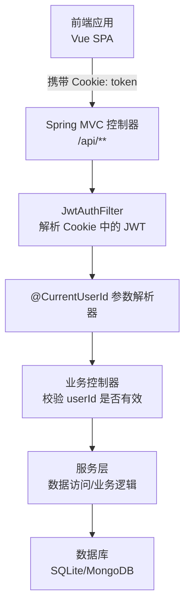
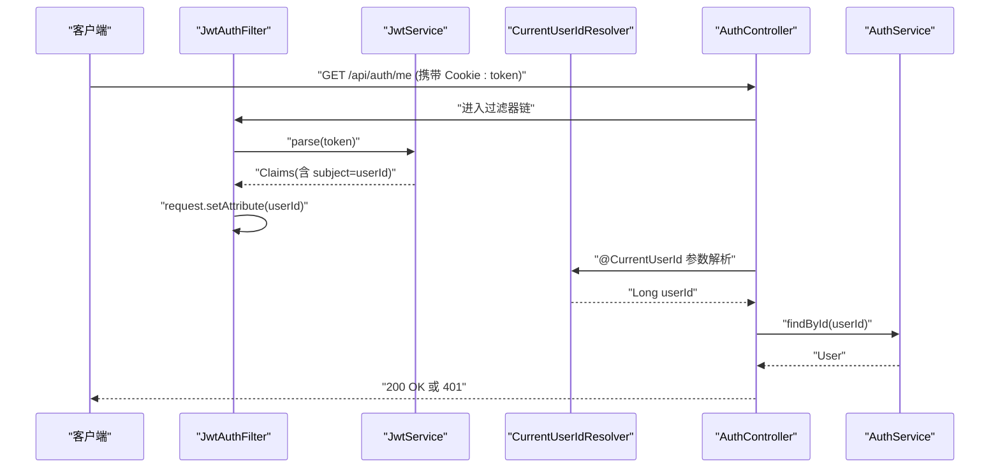
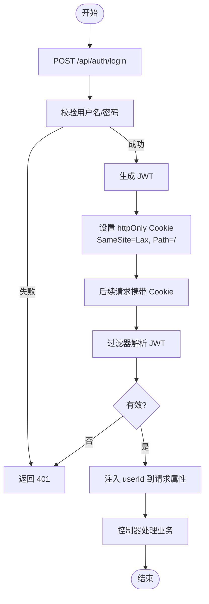
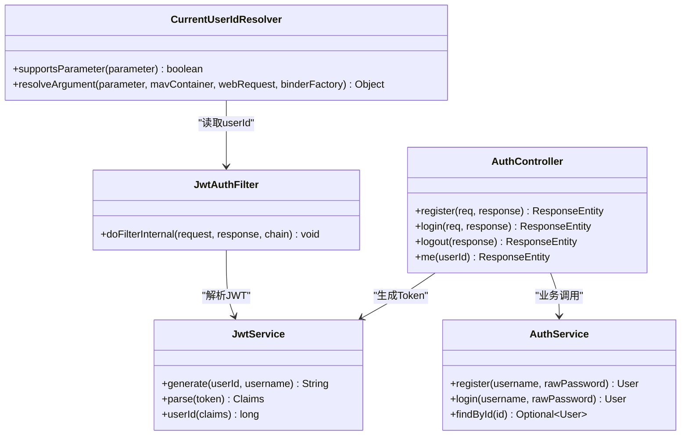

# 安全与认证

<cite>
**本文引用的文件**
- [JwtAuthFilter.java](file://backend/src/main/java/com/suanfa/security/JwtAuthFilter.java)
- [JwtService.java](file://backend/src/main/java/com/suanfa/security/JwtService.java)
- [CurrentUserId.java](file://backend/src/main/java/com/suanfa/security/CurrentUserId.java)
- [CurrentUserIdResolver.java](file://backend/src/main/java/com/suanfa/security/CurrentUserIdResolver.java)
- [AuthController.java](file://backend/src/main/java/com/suanfa/controller/AuthController.java)
- [AuthService.java](file://backend/src/main/java/com/suanfa/service/AuthService.java)
- [WebConfig.java](file://backend/src/main/java/com/suanfa/config/WebConfig.java)
- [GlobalExceptionHandler.java](file://backend/src/main/java/com/suanfa/config/GlobalExceptionHandler.java)
- [application.yml](file://backend/src/main/resources/application.yml)
- [User.java](file://backend/src/main/java/com/suanfa/entity/User.java)
- [client.js](file://suanfa_vue/src/api/client.js)
- [user.js](file://suanfa_vue/src/stores/user.js)
- [Login.vue](file://suanfa_vue/src/components/common/Login.vue)
</cite>

## 目录
1. [简介](#简介)
2. [项目结构](#项目结构)
3. [核心组件](#核心组件)
4. [架构总览](#架构总览)
5. [详细组件分析](#详细组件分析)
6. [依赖关系分析](#依赖关系分析)
7. [性能与安全考量](#性能与安全考量)
8. [故障排查指南](#故障排查指南)
9. [结论](#结论)
10. [附录：安全最佳实践清单](#附录：安全最佳实践清单)

## 简介
本文件聚焦系统的安全与认证机制，覆盖以下主题：
- JWT 认证流程：Token 生成、解析、刷新策略（当前实现为基于 Cookie 的无状态会话）
- 安全过滤器：请求拦截、用户身份注入、权限检查点
- 会话管理：Cookie 配置、跨域处理、安全头设置现状与建议
- 密码加密存储、敏感信息保护、输入验证策略
- CORS、CSRF、XSS 防护现状与加固建议
- 安全开发审计参考

## 项目结构
后端采用 Spring Web MVC + 自定义安全过滤器；前端通过浏览器 Cookie 自动携带凭证访问受保护接口。关键路径如下：
- 认证入口：/api/auth/*（注册、登录、登出、当前用户）
- 安全过滤器：JwtAuthFilter（从 httpOnly Cookie 中解析 Token，注入 userId）
- 参数解析：@CurrentUserId + CurrentUserIdResolver（将已认证用户 ID 注入 Controller 方法参数）
- 跨域：WebConfig 配置 allowedOriginPatterns 与 allowCredentials
- 全局异常：GlobalExceptionHandler 统一错误响应

图表来源
- [WebConfig.java:33-44](file://backend/src/main/java/com/suanfa/config/WebConfig.java#L33-L44)
- [JwtAuthFilter.java:31-47](file://backend/src/main/java/com/suanfa/security/JwtAuthFilter.java#L31-L47)
- [AuthController.java:28-71](file://backend/src/main/java/com/suanfa/controller/AuthController.java#L28-L71)

章节来源
- [WebConfig.java:13-44](file://backend/src/main/java/com/suanfa/config/WebConfig.java#L13-L44)
- [JwtAuthFilter.java:15-47](file://backend/src/main/java/com/suanfa/security/JwtAuthFilter.java#L15-L47)
- [AuthController.java:15-71](file://backend/src/main/java/com/suanfa/controller/AuthController.java#L15-L71)

## 核心组件
- JwtService：使用 HS256 对 JWT 进行签名与解析，subject 为用户 ID，包含 username 声明，过期时间由配置决定。
- JwtAuthFilter：在每个请求上读取 httpOnly Cookie 中的 token，解析并提取 userId 写入 request attribute，供后续参数解析使用。
- @CurrentUserId 与 CurrentUserIdResolver：将 filter 注入的 userId 以注解形式注入到 Controller 方法参数，未认证时为 null，由业务方法决定是否返回 401。
- AuthController：提供注册、登录、登出、获取当前用户等接口；成功登录后设置 httpOnly Cookie 并附带 SameSite=Lax。
- AuthService：注册时进行基础输入校验并使用 BCrypt 加密存储密码；登录时比对哈希。
- WebConfig：配置 CORS，允许 credentials，使用 allowedOriginPatterns 兼容通配与凭据共存；注册 @CurrentUserId 参数解析器。
- GlobalExceptionHandler：统一错误响应，保证路由级异常（如 404/405/400）不被吞掉。

章节来源
- [JwtService.java:14-55](file://backend/src/main/java/com/suanfa/security/JwtService.java#L14-L55)
- [JwtAuthFilter.java:15-47](file://backend/src/main/java/com/suanfa/security/JwtAuthFilter.java#L15-L47)
- [CurrentUserId.java:8-15](file://backend/src/main/java/com/suanfa/security/CurrentUserId.java#L8-L15)
- [CurrentUserIdResolver.java:11-27](file://backend/src/main/java/com/suanfa/security/CurrentUserIdResolver.java#L11-L27)
- [AuthController.java:15-88](file://backend/src/main/java/com/suanfa/controller/AuthController.java#L15-L88)
- [AuthService.java:10-51](file://backend/src/main/java/com/suanfa/service/AuthService.java#L10-L51)
- [WebConfig.java:13-44](file://backend/src/main/java/com/suanfa/config/WebConfig.java#L13-L44)
- [GlobalExceptionHandler.java:21-67](file://backend/src/main/java/com/suanfa/config/GlobalExceptionHandler.java#L21-L67)

## 架构总览
下图展示一次受保护接口的完整调用链：前端发起请求携带 Cookie，过滤器解析 JWT 并注入 userId，控制器根据业务需要校验并返回结果。

图表来源
- [JwtAuthFilter.java:31-47](file://backend/src/main/java/com/suanfa/security/JwtAuthFilter.java#L31-L47)
- [JwtService.java:28-54](file://backend/src/main/java/com/suanfa/security/JwtService.java#L28-L54)
- [CurrentUserIdResolver.java:21-27](file://backend/src/main/java/com/suanfa/security/CurrentUserIdResolver.java#L21-L27)
- [AuthController.java:60-71](file://backend/src/main/java/com/suanfa/controller/AuthController.java#L60-L71)
- [AuthService.java:45-47](file://backend/src/main/java/com/suanfa/service/AuthService.java#L45-L47)

## 详细组件分析

### JWT 认证流程与 Token 生命周期
- 登录/注册成功后，服务端生成 JWT 并通过 httpOnly Cookie 下发给浏览器，有效期由配置项控制。
- 后续请求自动携带该 Cookie，过滤器解析并注入 userId；若无效或未登录，则返回 401。
- 登出时清空 Cookie，会话失效。

图表来源
- [AuthController.java:43-57](file://backend/src/main/java/com/suanfa/controller/AuthController.java#L43-L57)
- [JwtAuthFilter.java:31-47](file://backend/src/main/java/com/suanfa/security/JwtAuthFilter.java#L31-L47)
- [JwtService.java:28-54](file://backend/src/main/java/com/suanfa/security/JwtService.java#L28-L54)

章节来源
- [AuthController.java:28-88](file://backend/src/main/java/com/suanfa/controller/AuthController.java#L28-L88)
- [JwtAuthFilter.java:15-47](file://backend/src/main/java/com/suanfa/security/JwtAuthFilter.java#L15-L47)
- [JwtService.java:14-55](file://backend/src/main/java/com/suanfa/security/JwtService.java#L14-L55)

### 令牌生成、验证与刷新机制
- 生成：HS256 签名，subject 为用户 ID，包含 username 声明，过期时间来自配置。
- 验证：过滤器解析 token，异常或无效返回 null，不直接拦截，交由控制器判断。
- 刷新：当前实现未提供显式刷新接口；可通过重新登录或扩展刷新端点实现。

章节来源
- [JwtService.java:21-54](file://backend/src/main/java/com/suanfa/security/JwtService.java#L21-L54)
- [application.yml:19-27](file://backend/src/main/resources/application.yml#L19-L27)

### 安全过滤器与请求拦截
- JwtAuthFilter 在每个请求上执行，从 Cookie 中读取 token 并解析，将 userId 写入 request attribute。
- 不直接拒绝请求，而是让控制器在需要时检查 userId 是否为空并返回 401。

章节来源
- [JwtAuthFilter.java:15-47](file://backend/src/main/java/com/suanfa/security/JwtAuthFilter.java#L15-L47)

### 权限检查与注解注入
- @CurrentUserId 标注 Controller 方法参数，由 CurrentUserIdResolver 从请求属性中解析 userId。
- 未认证时解析为 null，由方法体自行决定返回 401 或其他行为。

章节来源
- [CurrentUserId.java:8-15](file://backend/src/main/java/com/suanfa/security/CurrentUserId.java#L8-L15)
- [CurrentUserIdResolver.java:11-27](file://backend/src/main/java/com/suanfa/security/CurrentUserIdResolver.java#L11-L27)
- [AuthController.java:60-71](file://backend/src/main/java/com/suanfa/controller/AuthController.java#L60-L71)

### 用户会话管理与 Cookie 配置
- 登录成功后设置 httpOnly Cookie，Path 为根路径，SameSite=Lax，Max-Age 为固定天数。
- 登出时清空 Cookie。
- 前端通过 fetch 的 credentials: 'include' 自动携带 Cookie。

章节来源
- [AuthController.java:73-88](file://backend/src/main/java/com/suanfa/controller/AuthController.java#L73-L88)
- [client.js:30-43](file://suanfa_vue/src/api/client.js#L30-L43)

### 跨域处理与安全头
- CORS：使用 allowedOriginPatterns 与 allowCredentials(true)，支持开发环境全开与生产环境收紧。
- 安全头：当前未显式设置安全响应头（如 CSP、X-Frame-Options、Referrer-Policy），建议在生产环境补充。

章节来源
- [WebConfig.java:33-44](file://backend/src/main/java/com/suanfa/config/WebConfig.java#L33-L44)
- [application.yml:25-27](file://backend/src/main/resources/application.yml#L25-L27)

### 密码加密存储与输入验证
- 密码使用 BCryptPasswordEncoder 加密存储，避免明文保存。
- 注册时对用户名与密码长度做基础校验；登录时比对哈希。
- 用户实体不包含 passwordHash 对外暴露。

章节来源
- [AuthService.java:22-43](file://backend/src/main/java/com/suanfa/service/AuthService.java#L22-L43)
- [User.java:1-5](file://backend/src/main/java/com/suanfa/entity/User.java#L1-L5)

### 前端认证集成
- 登录/注册/登出/获取当前用户接口封装在 client.js，统一处理错误与降级。
- user store 维护登录态，页面初始化时尝试恢复会话。
- Login 组件负责表单校验与交互。

章节来源
- [client.js:111-131](file://suanfa_vue/src/api/client.js#L111-L131)
- [user.js:4-35](file://suanfa_vue/src/stores/user.js#L4-L35)
- [Login.vue:16-39](file://suanfa_vue/src/components/common/Login.vue#L16-L39)

## 依赖关系分析
- 控制器依赖服务层进行业务处理与数据访问。
- 过滤器依赖 JwtService 解析 Token。
- 参数解析器依赖过滤器注入的请求属性。
- 配置类集中管理 CORS 与参数解析器注册。

图表来源
- [JwtService.java:21-54](file://backend/src/main/java/com/suanfa/security/JwtService.java#L21-L54)
- [JwtAuthFilter.java:25-47](file://backend/src/main/java/com/suanfa/security/JwtAuthFilter.java#L25-L47)
- [CurrentUserIdResolver.java:15-27](file://backend/src/main/java/com/suanfa/security/CurrentUserIdResolver.java#L15-L27)
- [AuthController.java:20-88](file://backend/src/main/java/com/suanfa/controller/AuthController.java#L20-L88)
- [AuthService.java:14-51](file://backend/src/main/java/com/suanfa/service/AuthService.java#L14-L51)

章节来源
- [JwtService.java:14-55](file://backend/src/main/java/com/suanfa/security/JwtService.java#L14-L55)
- [JwtAuthFilter.java:15-47](file://backend/src/main/java/com/suanfa/security/JwtAuthFilter.java#L15-L47)
- [CurrentUserIdResolver.java:11-27](file://backend/src/main/java/com/suanfa/security/CurrentUserIdResolver.java#L11-L27)
- [AuthController.java:15-88](file://backend/src/main/java/com/suanfa/controller/AuthController.java#L15-L88)
- [AuthService.java:10-51](file://backend/src/main/java/com/suanfa/service/AuthService.java#L10-L51)

## 性能与安全考量
- 性能
  - JWT 解析轻量，适合高并发场景；注意密钥长度与算法选择。
  - 过滤器对所有请求生效，应确保解析逻辑高效且异常快速返回。
- 安全
  - 当前未实现 CSRF 防护（仅 GET 资源通常不受影响，但写操作需考虑）。
  - 未设置严格的安全响应头（CSP、X-Frame-Options、Referrer-Policy、Content-Security-Policy 等）。
  - CORS 在生产环境应限制为明确域名列表，避免使用通配符。
  - 建议增加速率限制、登录失败锁定、敏感操作二次确认等。

[本节为通用指导，不直接分析具体文件]

## 故障排查指南
- 401 未登录：检查 Cookie 是否存在且有效；确认过滤器是否正确解析；确认控制器是否检查 userId。
- 404/405/400：全局异常处理器会返回统一 JSON 错误；核对前端请求方法与路径。
- CORS 错误：确认 allowedOriginPatterns 与 allowCredentials 配置；浏览器是否携带 credentials。
- 登录失败：检查用户名/密码校验逻辑；BCrypt 匹配是否正确。

章节来源
- [GlobalExceptionHandler.java:26-58](file://backend/src/main/java/com/suanfa/config/GlobalExceptionHandler.java#L26-L58)
- [WebConfig.java:33-44](file://backend/src/main/java/com/suanfa/config/WebConfig.java#L33-L44)
- [AuthService.java:22-43](file://backend/src/main/java/com/suanfa/service/AuthService.java#L22-L43)

## 结论
本项目实现了基于 JWT 的无状态认证与会话管理，通过 httpOnly Cookie 传递 Token，过滤器解析并注入用户身份，控制器按需校验。CORS 支持凭据模式，便于前后端同域或跨域协作。当前实现简洁实用，建议在生产环境中补充 CSRF 防护、安全响应头、严格的 CORS 白名单以及更完善的 Token 刷新策略。

[本节为总结性内容，不直接分析具体文件]

## 附录：安全最佳实践清单
- 密钥管理
  - 使用环境变量或密钥管理服务注入 JWT 密钥，避免硬编码。
  - 定期轮换密钥，支持多版本解析过渡期。
- 会话与会话安全
  - 使用 httpOnly、Secure、SameSite 属性；生产环境启用 Secure。
  - 实现 Token 刷新机制（短生命周期 Access Token + 长生命周期 Refresh Token）。
  - 提供主动注销与批量撤销能力。
- 输入与输出
  - 服务端严格校验输入（长度、格式、类型）。
  - 输出脱敏，避免泄露敏感字段。
  - 使用 CSP、X-Frame-Options、Referrer-Policy 等安全响应头。
- 跨域与 CSRF
  - 生产环境限制 allowedOrigins 为明确域名。
  - 对写操作启用 CSRF 防护（双提交 Token 或同源策略）。
- 防暴力破解与滥用
  - 登录失败次数限制、验证码、IP 限流。
  - 接口级速率限制与熔断。
- 审计与监控
  - 记录认证事件（登录成功/失败、注销、权限拒绝）。
  - 告警异常登录与异常流量。

[本节为通用指导，不直接分析具体文件]