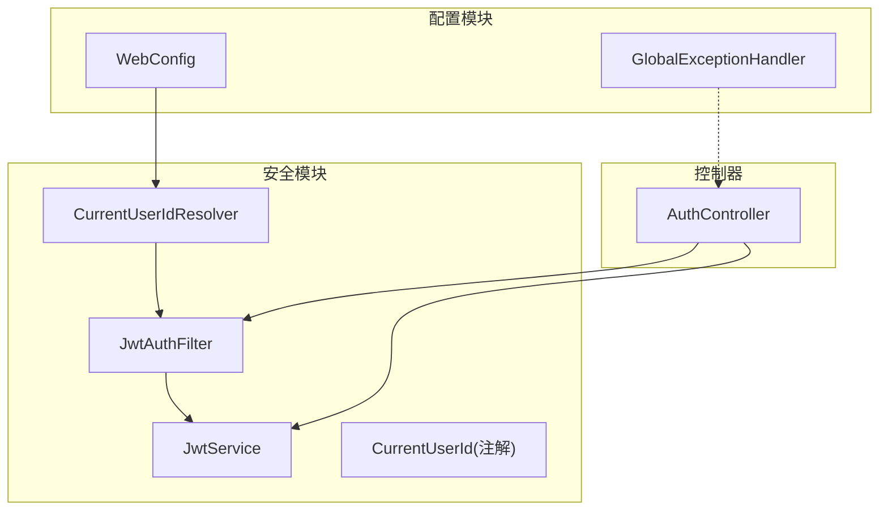
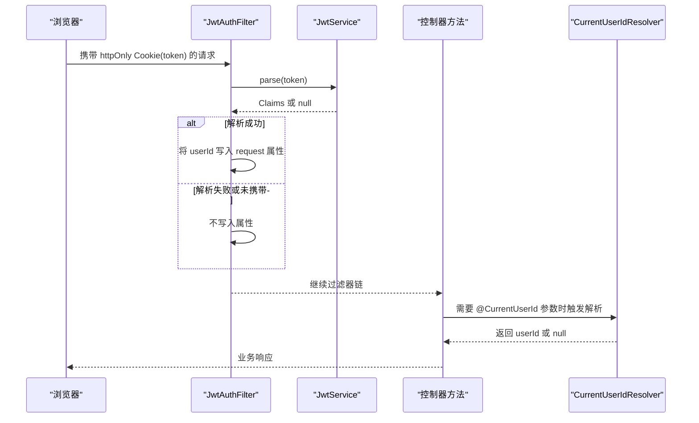
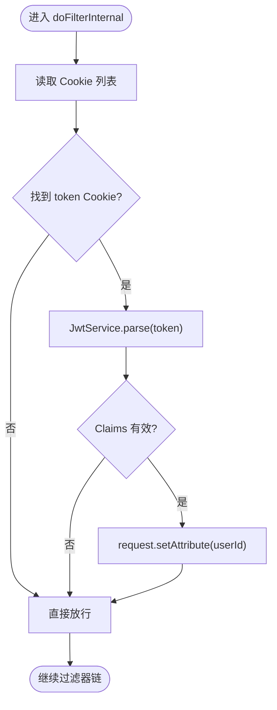
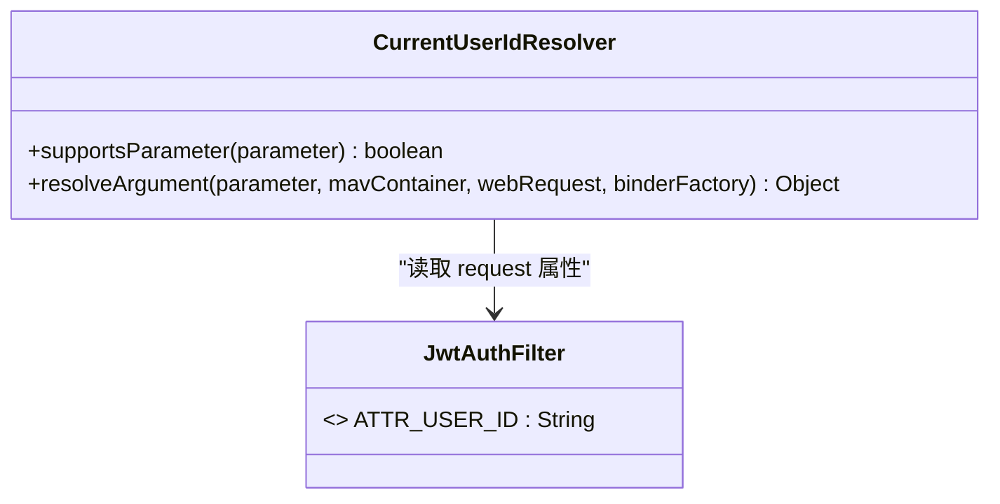
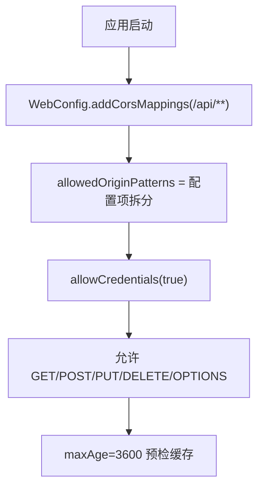
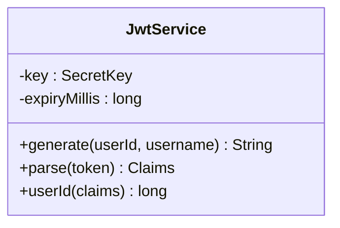
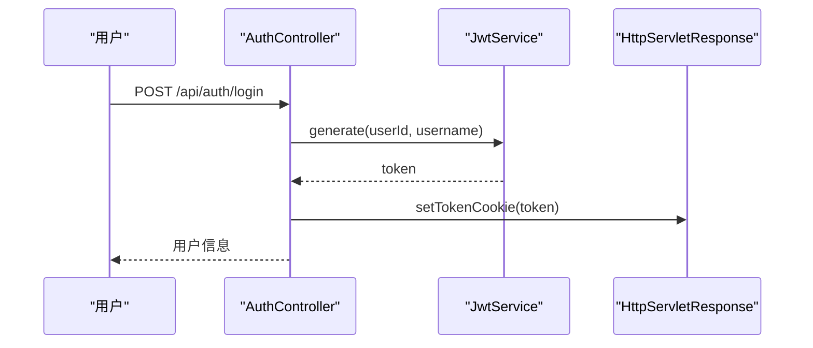
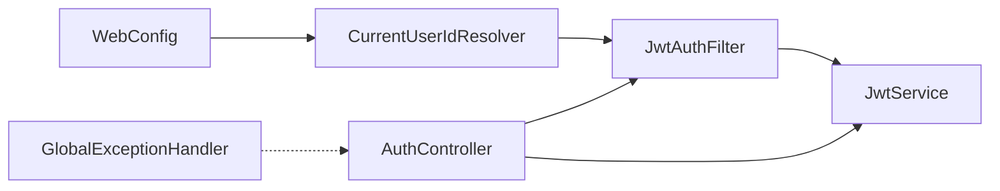
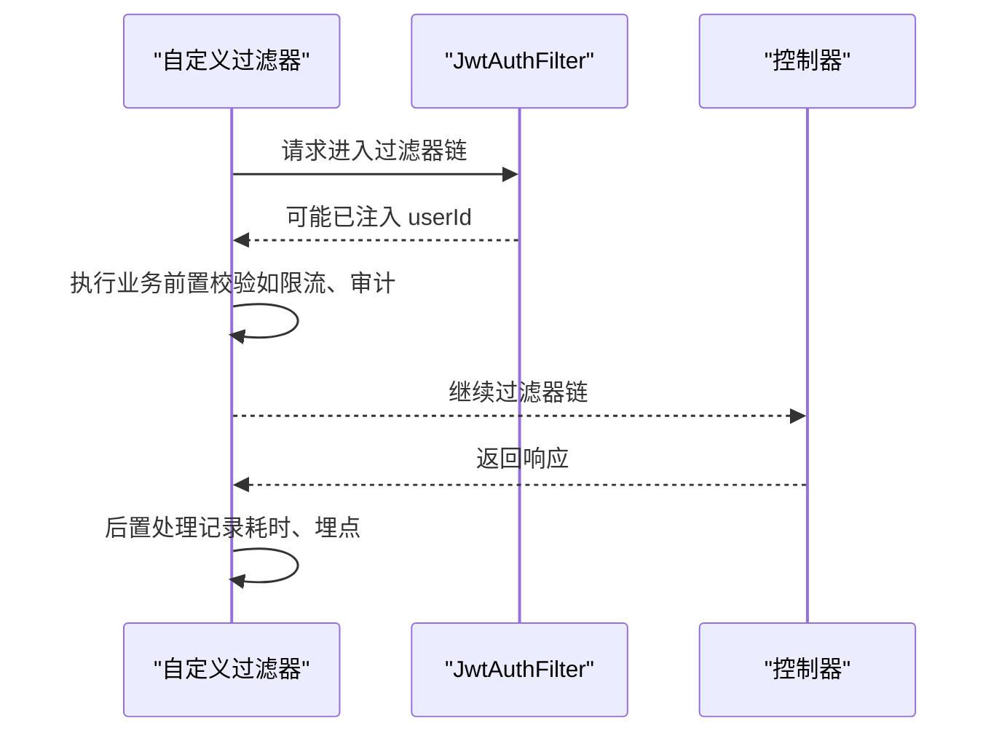

# 安全过滤器

<cite>
**本文引用的文件**
- [JwtAuthFilter.java](file://backend/src/main/java/com/suanfa/security/JwtAuthFilter.java)
- [CurrentUserIdResolver.java](file://backend/src/main/java/com/suanfa/security/CurrentUserIdResolver.java)
- [WebConfig.java](file://backend/src/main/java/com/suanfa/config/WebConfig.java)
- [JwtService.java](file://backend/src/main/java/com/suanfa/security/JwtService.java)
- [CurrentUserId.java](file://backend/src/main/java/com/suanfa/security/CurrentUserId.java)
- [AuthController.java](file://backend/src/main/java/com/suanfa/controller/AuthController.java)
- [GlobalExceptionHandler.java](file://backend/src/main/java/com/suanfa/config/GlobalExceptionHandler.java)
- [application.yml](file://backend/src/main/resources/application.yml)
</cite>

## 目录
1. [简介](#简介)
2. [项目结构](#项目结构)
3. [核心组件](#核心组件)
4. [架构总览](#架构总览)
5. [详细组件分析](#详细组件分析)
6. [依赖关系分析](#依赖关系分析)
7. [性能考虑](#性能考虑)
8. [故障排查指南](#故障排查指南)
9. [结论](#结论)
10. [附录：自定义过滤器开发指南与集成示例](#附录自定义过滤器开发指南与集成示例)

## 简介
本章节面向后端安全机制，重点说明基于 Cookie + JWT 的无状态认证方案。核心包括：
- JwtAuthFilter：从 httpOnly Cookie 中解析 Token，将当前用户 ID 注入请求属性，不拦截请求。
- CurrentUserIdResolver：为控制器方法参数 @CurrentUserId 自动注入当前用户 ID（未登录时为 null）。
- WebConfig：注册参数解析器、配置 CORS 策略（允许来源、方法、头、凭据等）。
- JwtService：负责生成和解析 JWT（HS256），并提取 userId。
- AuthController：提供登录/注册/登出/当前用户接口，设置或清除 Token Cookie。
- GlobalExceptionHandler：统一异常处理，保证错误响应格式一致且保留正确 HTTP 状态码。

## 项目结构
与安全相关的代码主要分布在 security、config、controller 三个包中，配合 application.yml 中的 suanfa.jwt.* 与 suanfa.cors.* 配置项完成整体行为。

图表来源
- [JwtAuthFilter.java:1-49](file://backend/src/main/java/com/suanfa/security/JwtAuthFilter.java#L1-L49)
- [JwtService.java:1-56](file://backend/src/main/java/com/suanfa/security/JwtService.java#L1-L56)
- [CurrentUserIdResolver.java:1-28](file://backend/src/main/java/com/suanfa/security/CurrentUserIdResolver.java#L1-L28)
- [WebConfig.java:1-46](file://backend/src/main/java/com/suanfa/config/WebConfig.java#L1-L46)
- [AuthController.java:1-94](file://backend/src/main/java/com/suanfa/controller/AuthController.java#L1-L94)
- [GlobalExceptionHandler.java:1-69](file://backend/src/main/java/com/suanfa/config/GlobalExceptionHandler.java#L1-L69)

章节来源
- [JwtAuthFilter.java:1-49](file://backend/src/main/java/com/suanfa/security/JwtAuthFilter.java#L1-L49)
- [WebConfig.java:1-46](file://backend/src/main/java/com/suanfa/config/WebConfig.java#L1-L46)
- [application.yml:19-27](file://backend/src/main/resources/application.yml#L19-L27)

## 核心组件
- JwtAuthFilter：实现 OncePerRequestFilter，仅做“解析与注入”，不做“拒绝”。从 Cookie 中读取 token，调用 JwtService.parse 解析 Claims，若成功则将 userId 写入 request 属性。随后继续过滤器链。
- CurrentUserIdResolver：实现 HandlerMethodArgumentResolver，当控制器方法参数带有 @CurrentUserId 且类型为 Long 时，从 request 属性中取出 userId 注入；未登录则为 null。
- WebConfig：注册 CurrentUserIdResolver；通过 CorsRegistry 配置 /api/** 的跨域策略，支持 allowedOriginPatterns 与 allowCredentials(true)。
- JwtService：使用 HS256 签名，subject 存储 userId，claim username 用于展示；提供 generate、parse、userId 等方法。
- AuthController：登录/注册成功后通过 setTokenCookie 下发 httpOnly Cookie；/me 接口校验当前用户是否已登录。
- GlobalExceptionHandler：统一返回 ErrorBody，对 404/405/400/500 等场景给出友好提示。

章节来源
- [JwtAuthFilter.java:15-47](file://backend/src/main/java/com/suanfa/security/JwtAuthFilter.java#L15-L47)
- [CurrentUserIdResolver.java:11-26](file://backend/src/main/java/com/suanfa/security/CurrentUserIdResolver.java#L11-L26)
- [WebConfig.java:13-44](file://backend/src/main/java/com/suanfa/config/WebConfig.java#L13-L44)
- [JwtService.java:14-54](file://backend/src/main/java/com/suanfa/security/JwtService.java#L14-L54)
- [AuthController.java:15-94](file://backend/src/main/java/com/suanfa/controller/AuthController.java#L15-L94)
- [GlobalExceptionHandler.java:14-69](file://backend/src/main/java/com/suanfa/config/GlobalExceptionHandler.java#L14-L69)

## 架构总览
下图展示了从浏览器发起请求到控制器处理的完整链路，包括 Cookie 传递、过滤器解析、参数注入与业务处理。

图表来源
- [JwtAuthFilter.java:31-47](file://backend/src/main/java/com/suanfa/security/JwtAuthFilter.java#L31-L47)
- [JwtService.java:39-54](file://backend/src/main/java/com/suanfa/security/JwtService.java#L39-L54)
- [CurrentUserIdResolver.java:15-26](file://backend/src/main/java/com/suanfa/security/CurrentUserIdResolver.java#L15-L26)
- [AuthController.java:60-71](file://backend/src/main/java/com/suanfa/controller/AuthController.java#L60-L71)

## 详细组件分析

### JwtAuthFilter：请求拦截、Token 提取、权限验证流程
- 请求拦截：继承 OncePerRequestFilter，确保每个请求只执行一次。
- Token 提取：从 Cookie 中查找名为 token 的 httpOnly Cookie，调用 JwtService.parse 解析。
- 权限验证：过滤器本身不拒绝请求；若解析成功，将 userId 写入 request 属性；若失败则不写。真正的鉴权在 Controller 层进行（例如 /me 检查是否为 null 返回 401）。
- 过滤器链：无论是否解析成功，都会调用 chain.doFilter 继续后续处理。

图表来源
- [JwtAuthFilter.java:31-47](file://backend/src/main/java/com/suanfa/security/JwtAuthFilter.java#L31-L47)
- [JwtService.java:39-54](file://backend/src/main/java/com/suanfa/security/JwtService.java#L39-L54)

章节来源
- [JwtAuthFilter.java:15-47](file://backend/src/main/java/com/suanfa/security/JwtAuthFilter.java#L15-L47)

### CurrentUserIdResolver：在控制器中获取当前用户 ID
- 作用：为标注了 @CurrentUserId 的 Long 类型参数注入当前用户 ID。
- 数据来源：从 request 属性中读取 JwtAuthFilter 设置的 userId；若不存在则返回 null。
- 适用场景：所有需要“当前操作者”的业务接口，如笔记、评论、训练记录等。

图表来源
- [CurrentUserIdResolver.java:11-26](file://backend/src/main/java/com/suanfa/security/CurrentUserIdResolver.java#L11-L26)
- [JwtAuthFilter.java:22-23](file://backend/src/main/java/com/suanfa/security/JwtAuthFilter.java#L22-L23)

章节来源
- [CurrentUserIdResolver.java:11-26](file://backend/src/main/java/com/suanfa/security/CurrentUserIdResolver.java#L11-L26)
- [CurrentUserId.java:8-15](file://backend/src/main/java/com/suanfa/security/CurrentUserId.java#L8-L15)

### WebConfig：安全配置（CORS、路径匹配、参数解析）
- 参数解析器注册：addArgumentResolvers 中注册 CurrentUserIdResolver，使 @CurrentUserId 生效。
- CORS 配置：
  - 路径：/api/**
  - 允许的来源：allowedOriginPatterns，支持通配与多域名；开发默认全开，生产通过环境变量收紧。
  - 方法与头：GET/POST/PUT/DELETE/OPTIONS，允许任意头。
  - 凭据：allowCredentials(true)，与 allowedOriginPatterns 搭配避免 "*"" 与凭据冲突。
  - 预检缓存：maxAge 设为 3600 秒。
- 配置来源：suanfa.cors.allowed-origins 来自 application.yml。

图表来源
- [WebConfig.java:28-44](file://backend/src/main/java/com/suanfa/config/WebConfig.java#L28-L44)
- [application.yml:19-27](file://backend/src/main/resources/application.yml#L19-L27)

章节来源
- [WebConfig.java:13-44](file://backend/src/main/java/com/suanfa/config/WebConfig.java#L13-L44)
- [application.yml:19-27](file://backend/src/main/resources/application.yml#L19-L27)

### JwtService：JWT 签发与解析
- 算法与密钥：HS256，密钥由 suanfa.jwt.secret 配置注入。
- 过期时间：suanfa.jwt.expiry-days 转换为毫秒。
- 载荷：subject 为 userId，claim username 用于显示。
- 解析：无效或过期返回 null，便于上层判断。

图表来源
- [JwtService.java:14-54](file://backend/src/main/java/com/suanfa/security/JwtService.java#L14-L54)

章节来源
- [JwtService.java:14-54](file://backend/src/main/java/com/suanfa/security/JwtService.java#L14-L54)
- [application.yml:19-24](file://backend/src/main/resources/application.yml#L19-L24)

### AuthController：认证流程与 Cookie 管理
- 登录/注册：成功后调用 setTokenCookie 下发 httpOnly Cookie（SameSite=Lax，Path=/，有效期 7 天）。
- 登出：clearTokenCookie 清空 Cookie。
- 当前用户：/me 通过 RequestAttribute 读取 userId，未登录返回 401。

图表来源
- [AuthController.java:43-52](file://backend/src/main/java/com/suanfa/controller/AuthController.java#L43-L52)
- [AuthController.java:73-80](file://backend/src/main/java/com/suanfa/controller/AuthController.java#L73-L80)
- [JwtService.java:28-37](file://backend/src/main/java/com/suanfa/security/JwtService.java#L28-L37)

章节来源
- [AuthController.java:15-94](file://backend/src/main/java/com/suanfa/controller/AuthController.java#L15-L94)

### 全局异常处理：统一错误响应
- 405 方法不支持：返回 METHOD_NOT_ALLOWED 与提示信息。
- 404 接口不存在：返回 NOT_FOUND。
- 400 请求体/参数解析失败：返回 BAD_REQUEST。
- 其他异常：返回 INTERNAL_SERVER_ERROR 并记录日志。

章节来源
- [GlobalExceptionHandler.java:14-69](file://backend/src/main/java/com/suanfa/config/GlobalExceptionHandler.java#L14-L69)

## 依赖关系分析
- JwtAuthFilter 依赖 JwtService 进行 Token 解析。
- CurrentUserIdResolver 依赖 JwtAuthFilter 定义的 request 属性键名。
- WebConfig 注入 CurrentUserIdResolver 并配置 CORS。
- AuthController 依赖 JwtService 生成 Token，并通过 Cookie 下发。
- 全局异常处理器独立于安全组件，但影响最终响应形态。

图表来源
- [JwtAuthFilter.java:25-47](file://backend/src/main/java/com/suanfa/security/JwtAuthFilter.java#L25-L47)
- [CurrentUserIdResolver.java:15-26](file://backend/src/main/java/com/suanfa/security/CurrentUserIdResolver.java#L15-L26)
- [WebConfig.java:16-31](file://backend/src/main/java/com/suanfa/config/WebConfig.java#L16-L31)
- [AuthController.java:20-26](file://backend/src/main/java/com/suanfa/controller/AuthController.java#L20-L26)
- [GlobalExceptionHandler.java:21-69](file://backend/src/main/java/com/suanfa/config/GlobalExceptionHandler.java#L21-L69)

章节来源
- [JwtAuthFilter.java:25-47](file://backend/src/main/java/com/suanfa/security/JwtAuthFilter.java#L25-L47)
- [WebConfig.java:16-31](file://backend/src/main/java/com/suanfa/config/WebConfig.java#L16-L31)
- [AuthController.java:20-26](file://backend/src/main/java/com/suanfa/controller/AuthController.java#L20-L26)

## 性能考虑
- 过滤器轻量：仅遍历 Cookie 数组并做一次字符串比较，解析失败快速返回 null，不阻塞主流程。
- 解析开销：JwtService.parse 仅在存在 token 时执行；建议在生产环境合理设置 expiry-days，减少无效解析。
- CORS 预检：maxAge=3600 可减少 OPTIONS 预检频率。
- 日志级别：根日志 info，com.suanfa debug，可按需调整以平衡可观测性与性能。

[本节为通用性能建议，不直接分析具体文件]

## 故障排查指南
- 无法获取当前用户：
  - 确认前端是否正确发送 httpOnly Cookie（登录成功后应自动携带）。
  - 检查 JwtService 的 secret 与 expiry-days 配置是否与签发端一致。
  - 查看 /api/auth/me 是否返回 401，定位是否缺少 token 或 token 无效。
- 跨域失败：
  - 检查 suanfa.cors.allowed-origins 是否包含前端实际来源。
  - 确认使用了 allowedOriginPatterns 而非 allowedOrigins("*")，以便与 allowCredentials(true) 共存。
- 接口 404/405：
  - 参考 GlobalExceptionHandler 的统一错误响应，核对请求方法与路径。
- 调试技巧：
  - 开启 com.suanfa 包 debug 日志，观察异常堆栈与关键分支。
  - 在浏览器开发者工具中检查 Cookie 是否被设置且 SameSite/Limit 符合预期。

章节来源
- [GlobalExceptionHandler.java:26-69](file://backend/src/main/java/com/suanfa/config/GlobalExceptionHandler.java#L26-L69)
- [application.yml:98-102](file://backend/src/main/resources/application.yml#L98-L102)

## 结论
本项目采用“过滤器解析 + 控制器校验”的解耦设计：
- JwtAuthFilter 只做 Token 解析与用户 ID 注入，保持过滤器职责单一、性能可控。
- CurrentUserIdResolver 让控制器以声明式方式获取当前用户，提升可读性与一致性。
- WebConfig 集中管理 CORS 与参数解析器，便于环境与策略切换。
- 全局异常处理器保障错误响应的一致性与可诊断性。

该方案兼顾安全性、可维护性与扩展性，适合在无状态服务中广泛使用。

[本节为总结性内容，不直接分析具体文件]

## 附录：自定义过滤器开发指南与集成示例

### 开发步骤
- 新建过滤器类：继承 OncePerRequestFilter，实现 doFilterInternal。
- 注入必要服务：如日志、配置、第三方客户端等。
- 定义规则：在 doFilterInternal 中决定放行或提前返回响应。
- 注册顺序：如需控制执行顺序，可实现 Ordered 或使用 @Order 注解。
- 与现有安全组件协作：
  - 若需读取当前用户，可从 request 属性中读取 JwtAuthFilter.ATTR_USER_ID。
  - 若需修改响应头或记录审计日志，可在 chain.doFilter 前后添加逻辑。

### 集成示例（概念流程）

[此图为概念流程图，不直接映射具体源码，故无图表来源]

### 最佳实践
- 过滤器尽量幂等、无副作用，避免重复计算。
- 对敏感操作增加白名单或速率限制。
- 结合 GlobalExceptionHandler 输出结构化错误信息。
- 通过 application.yml 暴露开关与阈值，便于灰度与回滚。

[本节为通用指导，不直接分析具体文件]